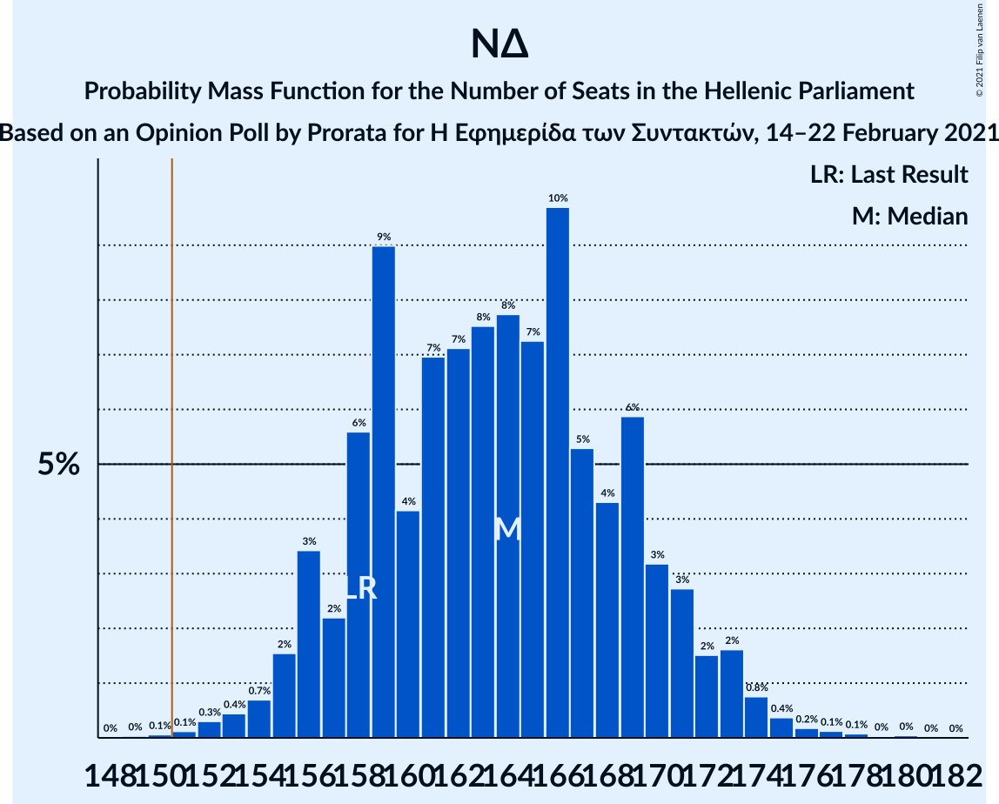

# Opinion Poll by Prorata for Η Εφημερίδα των Συντακτών, 14–22 February 2021

<a href="#voting-intentions">Voting Intentions</a> | <a href="#seats">Seats</a> | <a href="#coalitions">Coalitions</a> | <a href="#technical-information">Technical Information</a>

## Voting Intentions

### Confidence Intervals

| Party | Last Result | Poll Result | 80% Confidence Interval | 90% Confidence Interval | 95% Confidence Interval | 99% Confidence Interval |
|:-----:|:-----------:|:-----------:|:-----------------------:|:-----------------------:|:-----------------------:|:-----------------------:|
| Νέα Δημοκρατία | 39.8% | 41.8% | 39.8–43.8% |39.3–44.4% |38.8–44.9% |37.8–45.9% |
| Συνασπισμός Ριζοσπαστικής Αριστεράς | 31.5% | 30.3% | 28.5–32.2% |28.0–32.8% |27.5–33.2% |26.7–34.2% |
| Κίνημα Αλλαγής | 8.1% | 7.0% | 6.1–8.2% |5.8–8.5% |5.6–8.8% |5.2–9.3% |
| Κομμουνιστικό Κόμμα Ελλάδας | 5.3% | 5.7% | 4.9–6.8% |4.6–7.1% |4.4–7.3% |4.1–7.9% |
| Μέτωπο Ευρωπαϊκής Ρεαλιστικής Ανυπακοής | 3.4% | 4.4% | 3.7–5.3% |3.5–5.6% |3.3–5.9% |3.0–6.4% |
| Ελληνική Λύση | 3.7% | 3.2% | 2.6–4.0% |2.4–4.3% |2.3–4.5% |2.0–4.9% |

*Note:* The poll result column reflects the actual value used in the calculations. Published results may vary slightly, and in addition be rounded to fewer digits.

## Seats

### Confidence Intervals

| Party | Last Result | Median | 80% Confidence Interval | 90% Confidence Interval | 95% Confidence Interval | 99% Confidence Interval |
|:-----:|:-----------:|:------:|:-----------------------:|:-----------------------:|:-----------------------:|:-----------------------:|
| <a href="#νέα-δημοκρατία">Νέα Δημοκρατία</a> | 158 | 164 | 158–170 |156–171 |155–173 |152–175 |
| <a href="#συνασπισμός-ριζοσπαστικής-αριστεράς">Συνασπισμός Ριζοσπαστικής Αριστεράς</a> | 86 | 83 | 77–88 |76–90 |75–91 |72–94 |
| <a href="#κίνημα-αλλαγής">Κίνημα Αλλαγής</a> | 22 | 20 | 17–22 |16–23 |15–24 |14–26 |
| <a href="#κομμουνιστικό-κόμμα-ελλάδας">Κομμουνιστικό Κόμμα Ελλάδας</a> | 15 | 16 | 13–18 |13–19 |12–20 |11–21 |
| <a href="#μέτωπο-ευρωπαϊκής-ρεαλιστικής-ανυπακοής">Μέτωπο Ευρωπαϊκής Ρεαλιστικής Ανυπακοής</a> | 9 | 12 | 10–15 |9–15 |9–16 |0–18 |
| <a href="#ελληνική-λύση">Ελληνική Λύση</a> | 10 | 9 | 0–11 |0–12 |0–12 |0–13 |

### Νέα Δημοκρατία

*For a full overview of the results for this party, see the [Νέα Δημοκρατία](party-νέαδημοκρατία.html) page.*

| Number of Seats | Probability | Accumulated | Special Marks |
|:---------------:|:-----------:|:-----------:|:-------------:|
| 149 | 0% | 100% |  |
| 150 | 0.1% | 99.9% |  |
| 151 | 0.1% | 99.9% | Majority |
| 152 | 0.3% | 99.8% |  |
| 153 | 0.4% | 99.5% |  |
| 154 | 0.7% | 99.0% |  |
| 155 | 2% | 98% |  |
| 156 | 3% | 97% |  |
| 157 | 2% | 93% |  |
| 158 | 6% | 91% | Last Result |
| 159 | 9% | 86% |  |
| 160 | 4% | 77% |  |
| 161 | 7% | 72% |  |
| 162 | 7% | 65% |  |
| 163 | 8% | 58% |  |
| 164 | 8% | 51% | Median |
| 165 | 7% | 43% |  |
| 166 | 10% | 36% |  |
| 167 | 5% | 26% |  |
| 168 | 4% | 21% |  |
| 169 | 6% | 17% |  |
| 170 | 3% | 11% |  |
| 171 | 3% | 7% |  |
| 172 | 2% | 5% |  |
| 173 | 2% | 3% |  |
| 174 | 0.8% | 2% |  |
| 175 | 0.4% | 0.9% |  |
| 176 | 0.2% | 0.5% |  |
| 177 | 0.1% | 0.3% |  |
| 178 | 0.1% | 0.2% |  |
| 179 | 0% | 0.1% |  |
| 180 | 0% | 0.1% |  |
| 181 | 0% | 0% |  |

### Συνασπισμός Ριζοσπαστικής Αριστεράς

*For a full overview of the results for this party, see the [Συνασπισμός Ριζοσπαστικής Αριστεράς](party-συνασπισμόςριζοσπαστικήςαριστεράς.html) page.*

| Number of Seats | Probability | Accumulated | Special Marks |
|:---------------:|:-----------:|:-----------:|:-------------:|
| 70 | 0.1% | 100% |  |
| 71 | 0.2% | 99.9% |  |
| 72 | 0.4% | 99.7% |  |
| 73 | 0.5% | 99.4% |  |
| 74 | 1.1% | 98.9% |  |
| 75 | 3% | 98% |  |
| 76 | 2% | 95% |  |
| 77 | 4% | 93% |  |
| 78 | 6% | 89% |  |
| 79 | 6% | 83% |  |
| 80 | 11% | 77% |  |
| 81 | 5% | 66% |  |
| 82 | 7% | 61% |  |
| 83 | 9% | 54% | Median |
| 84 | 11% | 45% |  |
| 85 | 9% | 33% |  |
| 86 | 6% | 24% | Last Result |
| 87 | 6% | 18% |  |
| 88 | 4% | 12% |  |
| 89 | 2% | 8% |  |
| 90 | 3% | 6% |  |
| 91 | 1.0% | 3% |  |
| 92 | 1.2% | 2% |  |
| 93 | 0.4% | 0.9% |  |
| 94 | 0.2% | 0.5% |  |
| 95 | 0.2% | 0.4% |  |
| 96 | 0.1% | 0.2% |  |
| 97 | 0.1% | 0.1% |  |
| 98 | 0% | 0% |  |

### Κίνημα Αλλαγής

*For a full overview of the results for this party, see the [Κίνημα Αλλαγής](party-κίνημααλλαγής.html) page.*

| Number of Seats | Probability | Accumulated | Special Marks |
|:---------------:|:-----------:|:-----------:|:-------------:|
| 13 | 0.2% | 100% |  |
| 14 | 1.1% | 99.8% |  |
| 15 | 4% | 98.7% |  |
| 16 | 4% | 95% |  |
| 17 | 6% | 91% |  |
| 18 | 12% | 86% |  |
| 19 | 23% | 74% |  |
| 20 | 22% | 51% | Median |
| 21 | 16% | 29% |  |
| 22 | 6% | 12% | Last Result |
| 23 | 3% | 7% |  |
| 24 | 2% | 4% |  |
| 25 | 1.1% | 2% |  |
| 26 | 0.7% | 0.8% |  |
| 27 | 0.1% | 0.1% |  |
| 28 | 0% | 0% |  |

### Κομμουνιστικό Κόμμα Ελλάδας

*For a full overview of the results for this party, see the [Κομμουνιστικό Κόμμα Ελλάδας](party-κομμουνιστικόκόμμαελλάδας.html) page.*

| Number of Seats | Probability | Accumulated | Special Marks |
|:---------------:|:-----------:|:-----------:|:-------------:|
| 10 | 0.2% | 100% |  |
| 11 | 1.2% | 99.8% |  |
| 12 | 3% | 98.6% |  |
| 13 | 8% | 95% |  |
| 14 | 15% | 87% |  |
| 15 | 20% | 72% | Last Result |
| 16 | 16% | 53% | Median |
| 17 | 15% | 36% |  |
| 18 | 12% | 21% |  |
| 19 | 5% | 8% |  |
| 20 | 2% | 4% |  |
| 21 | 1.2% | 2% |  |
| 22 | 0.3% | 0.4% |  |
| 23 | 0.1% | 0.1% |  |
| 24 | 0% | 0% |  |

### Μέτωπο Ευρωπαϊκής Ρεαλιστικής Ανυπακοής

*For a full overview of the results for this party, see the [Μέτωπο Ευρωπαϊκής Ρεαλιστικής Ανυπακοής](party-μέτωποευρωπαϊκήςρεαλιστικήςανυπακοής.html) page.*

| Number of Seats | Probability | Accumulated | Special Marks |
|:---------------:|:-----------:|:-----------:|:-------------:|
| 0 | 0.6% | 100% |  |
| 1 | 0% | 99.4% |  |
| 2 | 0% | 99.4% |  |
| 3 | 0% | 99.4% |  |
| 4 | 0% | 99.4% |  |
| 5 | 0% | 99.4% |  |
| 6 | 0% | 99.4% |  |
| 7 | 0% | 99.4% |  |
| 8 | 0.4% | 99.4% |  |
| 9 | 5% | 99.0% | Last Result |
| 10 | 10% | 94% |  |
| 11 | 17% | 84% |  |
| 12 | 21% | 67% | Median |
| 13 | 20% | 45% |  |
| 14 | 14% | 26% |  |
| 15 | 8% | 12% |  |
| 16 | 3% | 4% |  |
| 17 | 1.0% | 2% |  |
| 18 | 0.4% | 0.5% |  |
| 19 | 0.1% | 0.1% |  |
| 20 | 0% | 0% |  |

### Ελληνική Λύση

*For a full overview of the results for this party, see the [Ελληνική Λύση](party-ελληνικήλύση.html) page.*

| Number of Seats | Probability | Accumulated | Special Marks |
|:---------------:|:-----------:|:-----------:|:-------------:|
| 0 | 36% | 100% |  |
| 1 | 0% | 64% |  |
| 2 | 0% | 64% |  |
| 3 | 0% | 64% |  |
| 4 | 0% | 64% |  |
| 5 | 0% | 64% |  |
| 6 | 0% | 64% |  |
| 7 | 0% | 64% |  |
| 8 | 10% | 64% |  |
| 9 | 24% | 54% | Median |
| 10 | 16% | 30% | Last Result |
| 11 | 8% | 14% |  |
| 12 | 4% | 5% |  |
| 13 | 1.1% | 1.5% |  |
| 14 | 0.3% | 0.4% |  |
| 15 | 0% | 0.1% |  |
| 16 | 0% | 0% |  |

## Coalitions

### Confidence Intervals

| Coalition | Last Result | Median | Majority? | 80% Confidence Interval | 90% Confidence Interval | 95% Confidence Interval | 99% Confidence Interval |
|:---------:|:-----------:|:------:|:---------:|:-----------------------:|:-----------------------:|:-----------------------:|:-----------------------:|
| Νέα Δημοκρατία – Κίνημα Αλλαγής | 180 | 183 | 100% | 176–189 | 175–191 | 174–193 | 172–196 |
| Νέα Δημοκρατία | 158 | 164 | 99.9% | 158–170 | 156–171 | 155–173 | 152–175 |
| Συνασπισμός Ριζοσπαστικής Αριστεράς – Μέτωπο Ευρωπαϊκής Ρεαλιστικής Ανυπακοής | 95 | 95 | 0% | 89–101 | 88–102 | 87–103 | 83–107 |
| Συνασπισμός Ριζοσπαστικής Αριστεράς | 86 | 83 | 0% | 77–88 | 76–90 | 75–91 | 72–94 |

### Νέα Δημοκρατία – Κίνημα Αλλαγής

| Number of Seats | Probability | Accumulated | Special Marks |
|:---------------:|:-----------:|:-----------:|:-------------:|
| 168 | 0% | 100% |  |
| 169 | 0.1% | 99.9% |  |
| 170 | 0.2% | 99.9% |  |
| 171 | 0.2% | 99.7% |  |
| 172 | 0.5% | 99.5% |  |
| 173 | 0.9% | 99.1% |  |
| 174 | 2% | 98% |  |
| 175 | 3% | 97% |  |
| 176 | 4% | 94% |  |
| 177 | 2% | 90% |  |
| 178 | 6% | 87% |  |
| 179 | 5% | 81% |  |
| 180 | 7% | 76% | Last Result |
| 181 | 8% | 69% |  |
| 182 | 8% | 61% |  |
| 183 | 7% | 52% |  |
| 184 | 8% | 46% | Median |
| 185 | 4% | 38% |  |
| 186 | 7% | 34% |  |
| 187 | 7% | 27% |  |
| 188 | 7% | 20% |  |
| 189 | 4% | 14% |  |
| 190 | 4% | 10% |  |
| 191 | 2% | 6% |  |
| 192 | 1.2% | 4% |  |
| 193 | 0.6% | 3% |  |
| 194 | 1.2% | 2% |  |
| 195 | 0.3% | 1.1% |  |
| 196 | 0.6% | 0.9% |  |
| 197 | 0.2% | 0.3% |  |
| 198 | 0.1% | 0.1% |  |
| 199 | 0% | 0.1% |  |
| 200 | 0% | 0.1% |  |
| 201 | 0% | 0% |  |

### Νέα Δημοκρατία

| Number of Seats | Probability | Accumulated | Special Marks |
|:---------------:|:-----------:|:-----------:|:-------------:|
| 149 | 0% | 100% |  |
| 150 | 0.1% | 99.9% |  |
| 151 | 0.1% | 99.9% | Majority |
| 152 | 0.3% | 99.8% |  |
| 153 | 0.4% | 99.5% |  |
| 154 | 0.7% | 99.0% |  |
| 155 | 2% | 98% |  |
| 156 | 3% | 97% |  |
| 157 | 2% | 93% |  |
| 158 | 6% | 91% | Last Result |
| 159 | 9% | 86% |  |
| 160 | 4% | 77% |  |
| 161 | 7% | 72% |  |
| 162 | 7% | 65% |  |
| 163 | 8% | 58% |  |
| 164 | 8% | 51% | Median |
| 165 | 7% | 43% |  |
| 166 | 10% | 36% |  |
| 167 | 5% | 26% |  |
| 168 | 4% | 21% |  |
| 169 | 6% | 17% |  |
| 170 | 3% | 11% |  |
| 171 | 3% | 7% |  |
| 172 | 2% | 5% |  |
| 173 | 2% | 3% |  |
| 174 | 0.8% | 2% |  |
| 175 | 0.4% | 0.9% |  |
| 176 | 0.2% | 0.5% |  |
| 177 | 0.1% | 0.3% |  |
| 178 | 0.1% | 0.2% |  |
| 179 | 0% | 0.1% |  |
| 180 | 0% | 0.1% |  |
| 181 | 0% | 0% |  |

### Συνασπισμός Ριζοσπαστικής Αριστεράς – Μέτωπο Ευρωπαϊκής Ρεαλιστικής Ανυπακοής

| Number of Seats | Probability | Accumulated | Special Marks |
|:---------------:|:-----------:|:-----------:|:-------------:|
| 80 | 0% | 100% |  |
| 81 | 0% | 99.9% |  |
| 82 | 0.2% | 99.9% |  |
| 83 | 0.4% | 99.7% |  |
| 84 | 0.6% | 99.3% |  |
| 85 | 0.2% | 98.7% |  |
| 86 | 0.1% | 98% |  |
| 87 | 2% | 98% |  |
| 88 | 5% | 97% |  |
| 89 | 7% | 91% |  |
| 90 | 4% | 84% |  |
| 91 | 1.3% | 80% |  |
| 92 | 2% | 79% |  |
| 93 | 11% | 78% |  |
| 94 | 13% | 67% |  |
| 95 | 11% | 54% | Last Result, Median |
| 96 | 12% | 42% |  |
| 97 | 3% | 30% |  |
| 98 | 3% | 28% |  |
| 99 | 8% | 25% |  |
| 100 | 4% | 17% |  |
| 101 | 6% | 13% |  |
| 102 | 3% | 7% |  |
| 103 | 2% | 4% |  |
| 104 | 0.5% | 2% |  |
| 105 | 0.4% | 1.4% |  |
| 106 | 0.4% | 1.0% |  |
| 107 | 0.3% | 0.6% |  |
| 108 | 0.2% | 0.3% |  |
| 109 | 0.1% | 0.1% |  |
| 110 | 0% | 0% |  |

### Συνασπισμός Ριζοσπαστικής Αριστεράς

| Number of Seats | Probability | Accumulated | Special Marks |
|:---------------:|:-----------:|:-----------:|:-------------:|
| 70 | 0.1% | 100% |  |
| 71 | 0.2% | 99.9% |  |
| 72 | 0.4% | 99.7% |  |
| 73 | 0.5% | 99.4% |  |
| 74 | 1.1% | 98.9% |  |
| 75 | 3% | 98% |  |
| 76 | 2% | 95% |  |
| 77 | 4% | 93% |  |
| 78 | 6% | 89% |  |
| 79 | 6% | 83% |  |
| 80 | 11% | 77% |  |
| 81 | 5% | 66% |  |
| 82 | 7% | 61% |  |
| 83 | 9% | 54% | Median |
| 84 | 11% | 45% |  |
| 85 | 9% | 33% |  |
| 86 | 6% | 24% | Last Result |
| 87 | 6% | 18% |  |
| 88 | 4% | 12% |  |
| 89 | 2% | 8% |  |
| 90 | 3% | 6% |  |
| 91 | 1.0% | 3% |  |
| 92 | 1.2% | 2% |  |
| 93 | 0.4% | 0.9% |  |
| 94 | 0.2% | 0.5% |  |
| 95 | 0.2% | 0.4% |  |
| 96 | 0.1% | 0.2% |  |
| 97 | 0.1% | 0.1% |  |
| 98 | 0% | 0% |  |

## Technical Information

### Opinion Poll

+ **Polling firm:** Prorata
+ **Commissioner(s):** Η Εφημερίδα των Συντακτών
+ **Fieldwork period:** 14–22 February 2021

### Calculations

+ **Sample size:** 1000
+ **Simulations done:** 131,072
+ **Error estimate:** 0.81%

