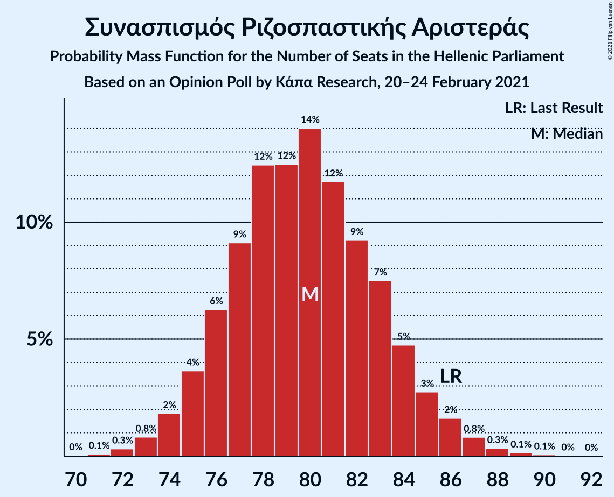
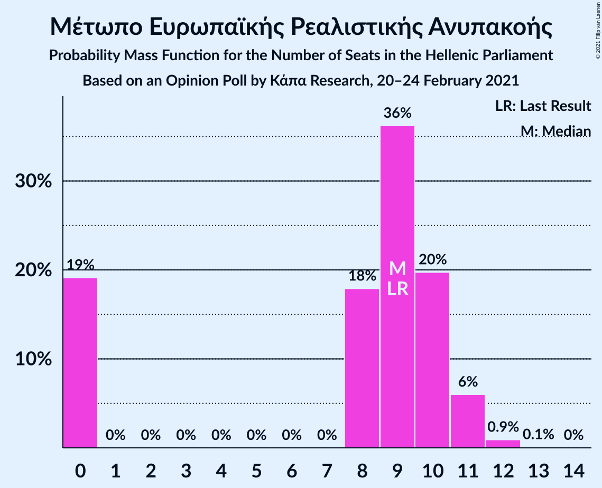

# Opinion Poll by Κάπα Research, 20–24 February 2021

<a href="#voting-intentions">Voting Intentions</a> | <a href="#seats">Seats</a> | <a href="#coalitions">Coalitions</a> | <a href="#technical-information">Technical Information</a>

## Voting Intentions

### Confidence Intervals

| Party | Last Result | Poll Result | 80% Confidence Interval | 90% Confidence Interval | 95% Confidence Interval | 99% Confidence Interval |
|:-----:|:-----------:|:-----------:|:-----------------------:|:-----------------------:|:-----------------------:|:-----------------------:|
| Νέα Δημοκρατία | 39.8% | 44.3% | 42.9–45.7% |42.5–46.1% |42.1–46.5% |41.5–47.2% |
| Συνασπισμός Ριζοσπαστικής Αριστεράς | 31.5% | 30.0% | 28.7–31.3% |28.3–31.7% |28.0–32.0% |27.4–32.7% |
| Κίνημα Αλλαγής | 8.1% | 7.4% | 6.7–8.2% |6.5–8.5% |6.4–8.7% |6.0–9.1% |
| Κομμουνιστικό Κόμμα Ελλάδας | 5.3% | 5.0% | 4.4–5.7% |4.3–5.9% |4.1–6.1% |3.9–6.4% |
| Ελληνική Λύση | 3.7% | 4.4% | 3.9–5.0% |3.7–5.2% |3.6–5.4% |3.4–5.7% |
| Μέτωπο Ευρωπαϊκής Ρεαλιστικής Ανυπακοής | 3.4% | 3.3% | 2.9–3.9% |2.7–4.1% |2.6–4.2% |2.4–4.5% |

*Note:* The poll result column reflects the actual value used in the calculations. Published results may vary slightly, and in addition be rounded to fewer digits.

## Seats

### Confidence Intervals

| Party | Last Result | Median | 80% Confidence Interval | 90% Confidence Interval | 95% Confidence Interval | 99% Confidence Interval |
|:-----:|:-----------:|:------:|:-----------------------:|:-----------------------:|:-----------------------:|:-----------------------:|
| <a href="#νέα-δημοκρατία">Νέα Δημοκρατία</a> | 158 | 168 | 163–172 |162–174 |162–175 |160–177 |
| <a href="#συνασπισμός-ριζοσπαστικής-αριστεράς">Συνασπισμός Ριζοσπαστικής Αριστεράς</a> | 86 | 80 | 76–84 |75–85 |74–86 |73–88 |
| <a href="#κίνημα-αλλαγής">Κίνημα Αλλαγής</a> | 22 | 20 | 18–22 |18–22 |17–23 |16–24 |
| <a href="#κομμουνιστικό-κόμμα-ελλάδας">Κομμουνιστικό Κόμμα Ελλάδας</a> | 15 | 13 | 12–15 |11–16 |11–16 |10–17 |
| <a href="#ελληνική-λύση">Ελληνική Λύση</a> | 10 | 12 | 10–13 |10–14 |10–14 |9–15 |
| <a href="#μέτωπο-ευρωπαϊκής-ρεαλιστικής-ανυπακοής">Μέτωπο Ευρωπαϊκής Ρεαλιστικής Ανυπακοής</a> | 9 | 9 | 0–10 |0–11 |0–11 |0–12 |

### Νέα Δημοκρατία

*For a full overview of the results for this party, see the [Νέα Δημοκρατία](party-νέαδημοκρατία.html) page.*

| Number of Seats | Probability | Accumulated | Special Marks |
|:---------------:|:-----------:|:-----------:|:-------------:|
| 158 | 0.1% | 100% | Last Result |
| 159 | 0.3% | 99.8% |  |
| 160 | 0.6% | 99.5% |  |
| 161 | 1.2% | 98.9% |  |
| 162 | 3% | 98% |  |
| 163 | 5% | 95% |  |
| 164 | 6% | 90% |  |
| 165 | 7% | 84% |  |
| 166 | 12% | 76% |  |
| 167 | 13% | 64% |  |
| 168 | 11% | 51% | Median |
| 169 | 10% | 40% |  |
| 170 | 9% | 30% |  |
| 171 | 5% | 21% |  |
| 172 | 6% | 16% |  |
| 173 | 4% | 10% |  |
| 174 | 3% | 6% |  |
| 175 | 1.3% | 3% |  |
| 176 | 0.7% | 1.4% |  |
| 177 | 0.4% | 0.6% |  |
| 178 | 0.1% | 0.3% |  |
| 179 | 0.1% | 0.1% |  |
| 180 | 0% | 0% |  |

### Συνασπισμός Ριζοσπαστικής Αριστεράς

*For a full overview of the results for this party, see the [Συνασπισμός Ριζοσπαστικής Αριστεράς](party-συνασπισμόςριζοσπαστικήςαριστεράς.html) page.*

| Number of Seats | Probability | Accumulated | Special Marks |
|:---------------:|:-----------:|:-----------:|:-------------:|
| 71 | 0.1% | 100% |  |
| 72 | 0.3% | 99.9% |  |
| 73 | 0.5% | 99.6% |  |
| 74 | 2% | 99.0% |  |
| 75 | 4% | 97% |  |
| 76 | 8% | 94% |  |
| 77 | 8% | 86% |  |
| 78 | 12% | 78% |  |
| 79 | 10% | 66% |  |
| 80 | 13% | 55% | Median |
| 81 | 13% | 42% |  |
| 82 | 9% | 30% |  |
| 83 | 9% | 21% |  |
| 84 | 6% | 12% |  |
| 85 | 3% | 6% |  |
| 86 | 1.2% | 3% | Last Result |
| 87 | 0.7% | 1.5% |  |
| 88 | 0.4% | 0.8% |  |
| 89 | 0.2% | 0.4% |  |
| 90 | 0.1% | 0.1% |  |
| 91 | 0% | 0% |  |

### Κίνημα Αλλαγής

*For a full overview of the results for this party, see the [Κίνημα Αλλαγής](party-κίνημααλλαγής.html) page.*

| Number of Seats | Probability | Accumulated | Special Marks |
|:---------------:|:-----------:|:-----------:|:-------------:|
| 15 | 0.1% | 100% |  |
| 16 | 1.4% | 99.9% |  |
| 17 | 3% | 98% |  |
| 18 | 16% | 95% |  |
| 19 | 19% | 79% |  |
| 20 | 26% | 60% | Median |
| 21 | 17% | 33% |  |
| 22 | 11% | 16% | Last Result |
| 23 | 3% | 5% |  |
| 24 | 1.1% | 1.3% |  |
| 25 | 0.2% | 0.2% |  |
| 26 | 0% | 0% |  |

### Κομμουνιστικό Κόμμα Ελλάδας

*For a full overview of the results for this party, see the [Κομμουνιστικό Κόμμα Ελλάδας](party-κομμουνιστικόκόμμαελλάδας.html) page.*

| Number of Seats | Probability | Accumulated | Special Marks |
|:---------------:|:-----------:|:-----------:|:-------------:|
| 9 | 0.1% | 100% |  |
| 10 | 0.9% | 99.9% |  |
| 11 | 6% | 99.0% |  |
| 12 | 17% | 93% |  |
| 13 | 31% | 77% | Median |
| 14 | 25% | 46% |  |
| 15 | 14% | 21% | Last Result |
| 16 | 6% | 7% |  |
| 17 | 1.1% | 1.2% |  |
| 18 | 0.1% | 0.2% |  |
| 19 | 0% | 0% |  |

### Ελληνική Λύση

*For a full overview of the results for this party, see the [Ελληνική Λύση](party-ελληνικήλύση.html) page.*

| Number of Seats | Probability | Accumulated | Special Marks |
|:---------------:|:-----------:|:-----------:|:-------------:|
| 8 | 0.1% | 100% |  |
| 9 | 2% | 99.9% |  |
| 10 | 11% | 98% | Last Result |
| 11 | 26% | 87% |  |
| 12 | 33% | 61% | Median |
| 13 | 19% | 28% |  |
| 14 | 7% | 9% |  |
| 15 | 2% | 2% |  |
| 16 | 0.3% | 0.4% |  |
| 17 | 0% | 0% |  |

### Μέτωπο Ευρωπαϊκής Ρεαλιστικής Ανυπακοής

*For a full overview of the results for this party, see the [Μέτωπο Ευρωπαϊκής Ρεαλιστικής Ανυπακοής](party-μέτωποευρωπαϊκήςρεαλιστικήςανυπακοής.html) page.*

| Number of Seats | Probability | Accumulated | Special Marks |
|:---------------:|:-----------:|:-----------:|:-------------:|
| 0 | 23% | 100% |  |
| 1 | 0% | 77% |  |
| 2 | 0% | 77% |  |
| 3 | 0% | 77% |  |
| 4 | 0% | 77% |  |
| 5 | 0% | 77% |  |
| 6 | 0% | 77% |  |
| 7 | 0% | 77% |  |
| 8 | 14% | 77% |  |
| 9 | 39% | 63% | Last Result, Median |
| 10 | 17% | 24% |  |
| 11 | 6% | 7% |  |
| 12 | 0.8% | 0.9% |  |
| 13 | 0.1% | 0.1% |  |
| 14 | 0% | 0% |  |

## Coalitions

### Confidence Intervals

| Coalition | Last Result | Median | Majority? | 80% Confidence Interval | 90% Confidence Interval | 95% Confidence Interval | 99% Confidence Interval |
|:---------:|:-----------:|:------:|:---------:|:-----------------------:|:-----------------------:|:-----------------------:|:-----------------------:|
| Νέα Δημοκρατία – Κίνημα Αλλαγής | 180 | 187 | 100% | 183–193 | 182–193 | 181–194 | 180–198 |
| Νέα Δημοκρατία | 158 | 168 | 100% | 163–172 | 162–174 | 162–175 | 160–177 |
| Συνασπισμός Ριζοσπαστικής Αριστεράς – Μέτωπο Ευρωπαϊκής Ρεαλιστικής Ανυπακοής | 95 | 87 | 0% | 82–92 | 81–93 | 80–93 | 77–95 |
| Συνασπισμός Ριζοσπαστικής Αριστεράς | 86 | 80 | 0% | 76–84 | 75–85 | 74–86 | 73–88 |

### Νέα Δημοκρατία – Κίνημα Αλλαγής

| Number of Seats | Probability | Accumulated | Special Marks |
|:---------------:|:-----------:|:-----------:|:-------------:|
| 177 | 0% | 100% |  |
| 178 | 0.1% | 99.9% |  |
| 179 | 0.3% | 99.8% |  |
| 180 | 0.6% | 99.5% | Last Result |
| 181 | 2% | 98.9% |  |
| 182 | 4% | 97% |  |
| 183 | 4% | 93% |  |
| 184 | 8% | 89% |  |
| 185 | 10% | 81% |  |
| 186 | 11% | 71% |  |
| 187 | 14% | 60% |  |
| 188 | 6% | 46% | Median |
| 189 | 6% | 41% |  |
| 190 | 12% | 35% |  |
| 191 | 8% | 23% |  |
| 192 | 4% | 15% |  |
| 193 | 8% | 11% |  |
| 194 | 1.0% | 3% |  |
| 195 | 0.8% | 2% |  |
| 196 | 0.7% | 2% |  |
| 197 | 0.1% | 0.9% |  |
| 198 | 0.4% | 0.8% |  |
| 199 | 0.3% | 0.4% |  |
| 200 | 0% | 0.1% |  |
| 201 | 0% | 0% |  |

### Νέα Δημοκρατία

| Number of Seats | Probability | Accumulated | Special Marks |
|:---------------:|:-----------:|:-----------:|:-------------:|
| 158 | 0.1% | 100% | Last Result |
| 159 | 0.3% | 99.8% |  |
| 160 | 0.6% | 99.5% |  |
| 161 | 1.2% | 98.9% |  |
| 162 | 3% | 98% |  |
| 163 | 5% | 95% |  |
| 164 | 6% | 90% |  |
| 165 | 7% | 84% |  |
| 166 | 12% | 76% |  |
| 167 | 13% | 64% |  |
| 168 | 11% | 51% | Median |
| 169 | 10% | 40% |  |
| 170 | 9% | 30% |  |
| 171 | 5% | 21% |  |
| 172 | 6% | 16% |  |
| 173 | 4% | 10% |  |
| 174 | 3% | 6% |  |
| 175 | 1.3% | 3% |  |
| 176 | 0.7% | 1.4% |  |
| 177 | 0.4% | 0.6% |  |
| 178 | 0.1% | 0.3% |  |
| 179 | 0.1% | 0.1% |  |
| 180 | 0% | 0% |  |

### Συνασπισμός Ριζοσπαστικής Αριστεράς – Μέτωπο Ευρωπαϊκής Ρεαλιστικής Ανυπακοής

| Number of Seats | Probability | Accumulated | Special Marks |
|:---------------:|:-----------:|:-----------:|:-------------:|
| 74 | 0% | 100% |  |
| 75 | 0.1% | 99.9% |  |
| 76 | 0.3% | 99.8% |  |
| 77 | 0.3% | 99.5% |  |
| 78 | 0.5% | 99.2% |  |
| 79 | 1.0% | 98.7% |  |
| 80 | 2% | 98% |  |
| 81 | 4% | 96% |  |
| 82 | 5% | 91% |  |
| 83 | 5% | 87% |  |
| 84 | 6% | 81% |  |
| 85 | 9% | 75% |  |
| 86 | 7% | 66% |  |
| 87 | 11% | 59% |  |
| 88 | 9% | 48% |  |
| 89 | 12% | 38% | Median |
| 90 | 10% | 27% |  |
| 91 | 6% | 17% |  |
| 92 | 6% | 11% |  |
| 93 | 3% | 6% |  |
| 94 | 1.2% | 2% |  |
| 95 | 0.7% | 1.2% | Last Result |
| 96 | 0.3% | 0.5% |  |
| 97 | 0.1% | 0.2% |  |
| 98 | 0% | 0% |  |

### Συνασπισμός Ριζοσπαστικής Αριστεράς

| Number of Seats | Probability | Accumulated | Special Marks |
|:---------------:|:-----------:|:-----------:|:-------------:|
| 71 | 0.1% | 100% |  |
| 72 | 0.3% | 99.9% |  |
| 73 | 0.5% | 99.6% |  |
| 74 | 2% | 99.0% |  |
| 75 | 4% | 97% |  |
| 76 | 8% | 94% |  |
| 77 | 8% | 86% |  |
| 78 | 12% | 78% |  |
| 79 | 10% | 66% |  |
| 80 | 13% | 55% | Median |
| 81 | 13% | 42% |  |
| 82 | 9% | 30% |  |
| 83 | 9% | 21% |  |
| 84 | 6% | 12% |  |
| 85 | 3% | 6% |  |
| 86 | 1.2% | 3% | Last Result |
| 87 | 0.7% | 1.5% |  |
| 88 | 0.4% | 0.8% |  |
| 89 | 0.2% | 0.4% |  |
| 90 | 0.1% | 0.1% |  |
| 91 | 0% | 0% |  |

## Technical Information

### Opinion Poll

+ **Polling firm:** Κάπα Research
+ **Commissioner(s):** —
+ **Fieldwork period:** 20–24 February 2021

### Calculations

+ **Sample size:** 2021
+ **Simulations done:** 131,072
+ **Error estimate:** 0.34%

