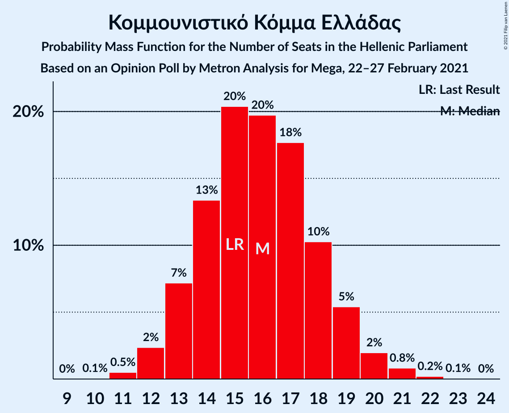
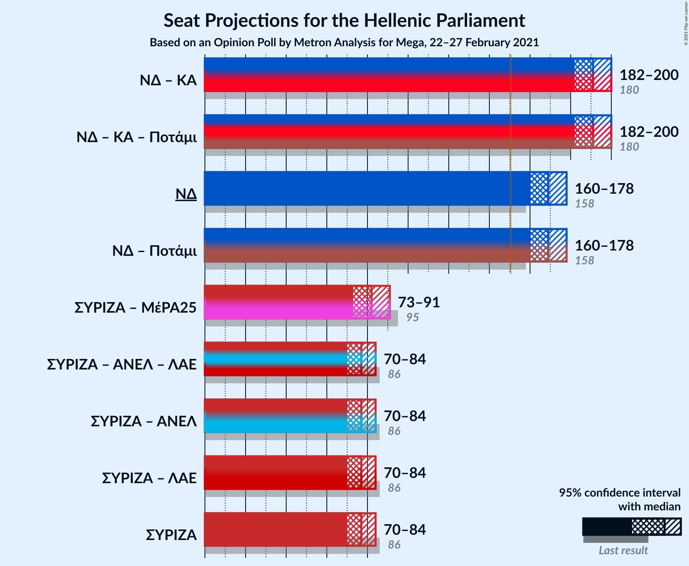
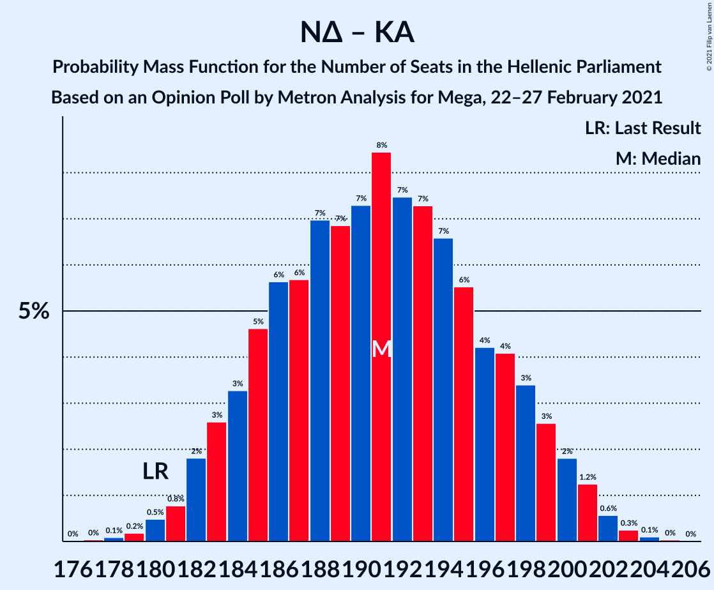

# Opinion Poll by Metron Analysis for Mega, 22–27 February 2021

<a href="#voting-intentions">Voting Intentions</a> | <a href="#seats">Seats</a> | <a href="#coalitions">Coalitions</a> | <a href="#technical-information">Technical Information</a>

## Voting Intentions

### Confidence Intervals

| Party | Last Result | Poll Result | 80% Confidence Interval | 90% Confidence Interval | 95% Confidence Interval | 99% Confidence Interval |
|:-----:|:-----------:|:-----------:|:-----------------------:|:-----------------------:|:-----------------------:|:-----------------------:|
| Νέα Δημοκρατία | 39.8% | 44.0% | 42.2–45.8% |41.6–46.3% |41.2–46.8% |40.3–47.7% |
| Συνασπισμός Ριζοσπαστικής Αριστεράς | 31.5% | 28.5% | 26.8–30.2% |26.4–30.7% |26.0–31.1% |25.2–31.9% |
| Κίνημα Αλλαγής | 8.1% | 8.2% | 7.3–9.3% |7.0–9.6% |6.8–9.9% |6.4–10.5% |
| Κομμουνιστικό Κόμμα Ελλάδας | 5.3% | 5.8% | 5.0–6.8% |4.8–7.0% |4.6–7.3% |4.3–7.8% |
| Ελληνική Λύση | 3.7% | 4.2% | 3.6–5.1% |3.4–5.3% |3.2–5.5% |2.9–6.0% |
| Μέτωπο Ευρωπαϊκής Ρεαλιστικής Ανυπακοής | 3.4% | 3.0% | 2.4–3.7% |2.3–3.9% |2.2–4.1% |1.9–4.5% |

*Note:* The poll result column reflects the actual value used in the calculations. Published results may vary slightly, and in addition be rounded to fewer digits.

## Seats

### Confidence Intervals

| Party | Last Result | Median | 80% Confidence Interval | 90% Confidence Interval | 95% Confidence Interval | 99% Confidence Interval |
|:-----:|:-----------:|:------:|:-----------------------:|:-----------------------:|:-----------------------:|:-----------------------:|
| <a href="#νέα-δημοκρατία">Νέα Δημοκρατία</a> | 158 | 169 | 163–174 |161–176 |160–177 |158–179 |
| <a href="#συνασπισμός-ριζοσπαστικής-αριστεράς">Συνασπισμός Ριζοσπαστικής Αριστεράς</a> | 86 | 77 | 71–83 |70–84 |69–84 |68–86 |
| <a href="#κίνημα-αλλαγής">Κίνημα Αλλαγής</a> | 22 | 22 | 20–25 |19–26 |19–26 |17–29 |
| <a href="#κομμουνιστικό-κόμμα-ελλάδας">Κομμουνιστικό Κόμμα Ελλάδας</a> | 15 | 16 | 13–18 |13–19 |12–19 |11–21 |
| <a href="#ελληνική-λύση">Ελληνική Λύση</a> | 10 | 11 | 9–14 |9–14 |9–15 |0–16 |
| <a href="#μέτωπο-ευρωπαϊκής-ρεαλιστικής-ανυπακοής">Μέτωπο Ευρωπαϊκής Ρεαλιστικής Ανυπακοής</a> | 9 | 0 | 0–10 |0–10 |0–11 |0–12 |

### Νέα Δημοκρατία

*For a full overview of the results for this party, see the [Νέα Δημοκρατία](party-νέαδημοκρατία.html) page.*

| Number of Seats | Probability | Accumulated | Special Marks |
|:---------------:|:-----------:|:-----------:|:-------------:|
| 155 | 0% | 100% |  |
| 156 | 0.1% | 99.9% |  |
| 157 | 0.2% | 99.8% |  |
| 158 | 0.4% | 99.7% | Last Result |
| 159 | 0.6% | 99.3% |  |
| 160 | 2% | 98.7% |  |
| 161 | 3% | 97% |  |
| 162 | 3% | 94% |  |
| 163 | 5% | 91% |  |
| 164 | 5% | 86% |  |
| 165 | 7% | 81% |  |
| 166 | 6% | 75% |  |
| 167 | 8% | 68% |  |
| 168 | 10% | 60% |  |
| 169 | 9% | 50% | Median |
| 170 | 8% | 41% |  |
| 171 | 10% | 33% |  |
| 172 | 6% | 23% |  |
| 173 | 5% | 17% |  |
| 174 | 4% | 12% |  |
| 175 | 2% | 8% |  |
| 176 | 2% | 5% |  |
| 177 | 2% | 4% |  |
| 178 | 1.1% | 2% |  |
| 179 | 0.6% | 1.0% |  |
| 180 | 0.2% | 0.4% |  |
| 181 | 0.1% | 0.2% |  |
| 182 | 0.1% | 0.1% |  |
| 183 | 0% | 0% |  |

### Συνασπισμός Ριζοσπαστικής Αριστεράς

*For a full overview of the results for this party, see the [Συνασπισμός Ριζοσπαστικής Αριστεράς](party-συνασπισμόςριζοσπαστικήςαριστεράς.html) page.*

| Number of Seats | Probability | Accumulated | Special Marks |
|:---------------:|:-----------:|:-----------:|:-------------:|
| 66 | 0.1% | 100% |  |
| 67 | 0.2% | 99.9% |  |
| 68 | 0.6% | 99.7% |  |
| 69 | 2% | 99.1% |  |
| 70 | 4% | 97% |  |
| 71 | 6% | 94% |  |
| 72 | 6% | 88% |  |
| 73 | 7% | 82% |  |
| 74 | 5% | 74% |  |
| 75 | 6% | 69% |  |
| 76 | 6% | 63% |  |
| 77 | 7% | 57% | Median |
| 78 | 6% | 50% |  |
| 79 | 6% | 43% |  |
| 80 | 8% | 37% |  |
| 81 | 10% | 29% |  |
| 82 | 7% | 19% |  |
| 83 | 6% | 12% |  |
| 84 | 3% | 6% |  |
| 85 | 1.5% | 2% |  |
| 86 | 0.6% | 1.0% | Last Result |
| 87 | 0.2% | 0.4% |  |
| 88 | 0.1% | 0.1% |  |
| 89 | 0% | 0.1% |  |
| 90 | 0% | 0% |  |

### Κίνημα Αλλαγής

*For a full overview of the results for this party, see the [Κίνημα Αλλαγής](party-κίνημααλλαγής.html) page.*

| Number of Seats | Probability | Accumulated | Special Marks |
|:---------------:|:-----------:|:-----------:|:-------------:|
| 16 | 0.2% | 100% |  |
| 17 | 1.1% | 99.8% |  |
| 18 | 0.8% | 98.7% |  |
| 19 | 5% | 98% |  |
| 20 | 16% | 93% |  |
| 21 | 20% | 77% |  |
| 22 | 17% | 58% | Last Result, Median |
| 23 | 7% | 41% |  |
| 24 | 15% | 34% |  |
| 25 | 12% | 19% |  |
| 26 | 5% | 7% |  |
| 27 | 1.0% | 2% |  |
| 28 | 0.4% | 1.0% |  |
| 29 | 0.4% | 0.5% |  |
| 30 | 0.1% | 0.1% |  |
| 31 | 0% | 0% |  |

### Κομμουνιστικό Κόμμα Ελλάδας

*For a full overview of the results for this party, see the [Κομμουνιστικό Κόμμα Ελλάδας](party-κομμουνιστικόκόμμαελλάδας.html) page.*

| Number of Seats | Probability | Accumulated | Special Marks |
|:---------------:|:-----------:|:-----------:|:-------------:|
| 11 | 0.5% | 100% |  |
| 12 | 2% | 99.5% |  |
| 13 | 9% | 97% |  |
| 14 | 11% | 88% |  |
| 15 | 17% | 78% | Last Result |
| 16 | 21% | 61% | Median |
| 17 | 23% | 40% |  |
| 18 | 8% | 17% |  |
| 19 | 6% | 8% |  |
| 20 | 1.4% | 2% |  |
| 21 | 0.6% | 0.9% |  |
| 22 | 0.2% | 0.3% |  |
| 23 | 0.1% | 0.1% |  |
| 24 | 0% | 0% |  |

### Ελληνική Λύση

*For a full overview of the results for this party, see the [Ελληνική Λύση](party-ελληνικήλύση.html) page.*

| Number of Seats | Probability | Accumulated | Special Marks |
|:---------------:|:-----------:|:-----------:|:-------------:|
| 0 | 0.8% | 100% |  |
| 1 | 0% | 99.2% |  |
| 2 | 0% | 99.2% |  |
| 3 | 0% | 99.2% |  |
| 4 | 0% | 99.2% |  |
| 5 | 0% | 99.2% |  |
| 6 | 0% | 99.2% |  |
| 7 | 0% | 99.2% |  |
| 8 | 1.0% | 99.2% |  |
| 9 | 9% | 98% |  |
| 10 | 17% | 90% | Last Result |
| 11 | 23% | 73% | Median |
| 12 | 23% | 50% |  |
| 13 | 16% | 27% |  |
| 14 | 7% | 11% |  |
| 15 | 3% | 4% |  |
| 16 | 1.0% | 1.3% |  |
| 17 | 0.3% | 0.3% |  |
| 18 | 0.1% | 0.1% |  |
| 19 | 0% | 0% |  |

### Μέτωπο Ευρωπαϊκής Ρεαλιστικής Ανυπακοής

*For a full overview of the results for this party, see the [Μέτωπο Ευρωπαϊκής Ρεαλιστικής Ανυπακοής](party-μέτωποευρωπαϊκήςρεαλιστικήςανυπακοής.html) page.*

| Number of Seats | Probability | Accumulated | Special Marks |
|:---------------:|:-----------:|:-----------:|:-------------:|
| 0 | 50% | 100% | Median |
| 1 | 0% | 50% |  |
| 2 | 0% | 50% |  |
| 3 | 0% | 50% |  |
| 4 | 0% | 50% |  |
| 5 | 0% | 50% |  |
| 6 | 0% | 50% |  |
| 7 | 0% | 50% |  |
| 8 | 10% | 50% |  |
| 9 | 22% | 40% | Last Result |
| 10 | 14% | 18% |  |
| 11 | 2% | 3% |  |
| 12 | 0.8% | 1.0% |  |
| 13 | 0.2% | 0.2% |  |
| 14 | 0% | 0% |  |

## Coalitions

### Confidence Intervals

| Coalition | Last Result | Median | Majority? | 80% Confidence Interval | 90% Confidence Interval | 95% Confidence Interval | 99% Confidence Interval |
|:---------:|:-----------:|:------:|:---------:|:-----------------------:|:-----------------------:|:-----------------------:|:-----------------------:|
| Νέα Δημοκρατία – Κίνημα Αλλαγής | 180 | 191 | 100% | 185–196 | 183–199 | 182–200 | 180–202 |
| Νέα Δημοκρατία | 158 | 169 | 100% | 163–174 | 161–176 | 160–177 | 158–179 |
| Συνασπισμός Ριζοσπαστικής Αριστεράς – Μέτωπο Ευρωπαϊκής Ρεαλιστικής Ανυπακοής | 95 | 82 | 0% | 76–88 | 73–89 | 72–90 | 70–92 |
| Συνασπισμός Ριζοσπαστικής Αριστεράς | 86 | 77 | 0% | 71–83 | 70–84 | 69–84 | 68–86 |

### Νέα Δημοκρατία – Κίνημα Αλλαγής

| Number of Seats | Probability | Accumulated | Special Marks |
|:---------------:|:-----------:|:-----------:|:-------------:|
| 177 | 0% | 100% |  |
| 178 | 0.1% | 99.9% |  |
| 179 | 0.2% | 99.8% |  |
| 180 | 0.4% | 99.7% | Last Result |
| 181 | 0.6% | 99.2% |  |
| 182 | 2% | 98.6% |  |
| 183 | 3% | 97% |  |
| 184 | 3% | 94% |  |
| 185 | 4% | 91% |  |
| 186 | 4% | 87% |  |
| 187 | 6% | 82% |  |
| 188 | 7% | 77% |  |
| 189 | 7% | 70% |  |
| 190 | 10% | 63% |  |
| 191 | 10% | 53% | Median |
| 192 | 10% | 44% |  |
| 193 | 8% | 34% |  |
| 194 | 7% | 26% |  |
| 195 | 5% | 19% |  |
| 196 | 4% | 14% |  |
| 197 | 2% | 10% |  |
| 198 | 2% | 7% |  |
| 199 | 2% | 5% |  |
| 200 | 1.1% | 3% |  |
| 201 | 1.1% | 2% |  |
| 202 | 0.5% | 0.9% |  |
| 203 | 0.3% | 0.4% |  |
| 204 | 0.1% | 0.2% |  |
| 205 | 0% | 0.1% |  |
| 206 | 0% | 0% |  |

### Νέα Δημοκρατία

| Number of Seats | Probability | Accumulated | Special Marks |
|:---------------:|:-----------:|:-----------:|:-------------:|
| 155 | 0% | 100% |  |
| 156 | 0.1% | 99.9% |  |
| 157 | 0.2% | 99.8% |  |
| 158 | 0.4% | 99.7% | Last Result |
| 159 | 0.6% | 99.3% |  |
| 160 | 2% | 98.7% |  |
| 161 | 3% | 97% |  |
| 162 | 3% | 94% |  |
| 163 | 5% | 91% |  |
| 164 | 5% | 86% |  |
| 165 | 7% | 81% |  |
| 166 | 6% | 75% |  |
| 167 | 8% | 68% |  |
| 168 | 10% | 60% |  |
| 169 | 9% | 50% | Median |
| 170 | 8% | 41% |  |
| 171 | 10% | 33% |  |
| 172 | 6% | 23% |  |
| 173 | 5% | 17% |  |
| 174 | 4% | 12% |  |
| 175 | 2% | 8% |  |
| 176 | 2% | 5% |  |
| 177 | 2% | 4% |  |
| 178 | 1.1% | 2% |  |
| 179 | 0.6% | 1.0% |  |
| 180 | 0.2% | 0.4% |  |
| 181 | 0.1% | 0.2% |  |
| 182 | 0.1% | 0.1% |  |
| 183 | 0% | 0% |  |

### Συνασπισμός Ριζοσπαστικής Αριστεράς – Μέτωπο Ευρωπαϊκής Ρεαλιστικής Ανυπακοής

| Number of Seats | Probability | Accumulated | Special Marks |
|:---------------:|:-----------:|:-----------:|:-------------:|
| 68 | 0% | 100% |  |
| 69 | 0.2% | 99.9% |  |
| 70 | 0.5% | 99.8% |  |
| 71 | 0.9% | 99.3% |  |
| 72 | 2% | 98% |  |
| 73 | 2% | 97% |  |
| 74 | 2% | 95% |  |
| 75 | 2% | 93% |  |
| 76 | 2% | 91% |  |
| 77 | 2% | 89% | Median |
| 78 | 4% | 87% |  |
| 79 | 8% | 83% |  |
| 80 | 10% | 75% |  |
| 81 | 12% | 64% |  |
| 82 | 10% | 52% |  |
| 83 | 10% | 42% |  |
| 84 | 6% | 32% |  |
| 85 | 5% | 25% |  |
| 86 | 5% | 20% |  |
| 87 | 4% | 15% |  |
| 88 | 4% | 11% |  |
| 89 | 2% | 7% |  |
| 90 | 2% | 5% |  |
| 91 | 1.4% | 2% |  |
| 92 | 0.7% | 1.0% |  |
| 93 | 0.2% | 0.4% |  |
| 94 | 0.1% | 0.2% |  |
| 95 | 0% | 0.1% | Last Result |
| 96 | 0% | 0.1% |  |
| 97 | 0% | 0% |  |

### Συνασπισμός Ριζοσπαστικής Αριστεράς

| Number of Seats | Probability | Accumulated | Special Marks |
|:---------------:|:-----------:|:-----------:|:-------------:|
| 66 | 0.1% | 100% |  |
| 67 | 0.2% | 99.9% |  |
| 68 | 0.6% | 99.7% |  |
| 69 | 2% | 99.1% |  |
| 70 | 4% | 97% |  |
| 71 | 6% | 94% |  |
| 72 | 6% | 88% |  |
| 73 | 7% | 82% |  |
| 74 | 5% | 74% |  |
| 75 | 6% | 69% |  |
| 76 | 6% | 63% |  |
| 77 | 7% | 57% | Median |
| 78 | 6% | 50% |  |
| 79 | 6% | 43% |  |
| 80 | 8% | 37% |  |
| 81 | 10% | 29% |  |
| 82 | 7% | 19% |  |
| 83 | 6% | 12% |  |
| 84 | 3% | 6% |  |
| 85 | 1.5% | 2% |  |
| 86 | 0.6% | 1.0% | Last Result |
| 87 | 0.2% | 0.4% |  |
| 88 | 0.1% | 0.1% |  |
| 89 | 0% | 0.1% |  |
| 90 | 0% | 0% |  |

## Technical Information

### Opinion Poll

+ **Polling firm:** Metron Analysis
+ **Commissioner(s):** Mega
+ **Fieldwork period:** 22–27 February 2021

### Calculations

+ **Sample size:** 1205
+ **Simulations done:** 131,072
+ **Error estimate:** 0.67%

