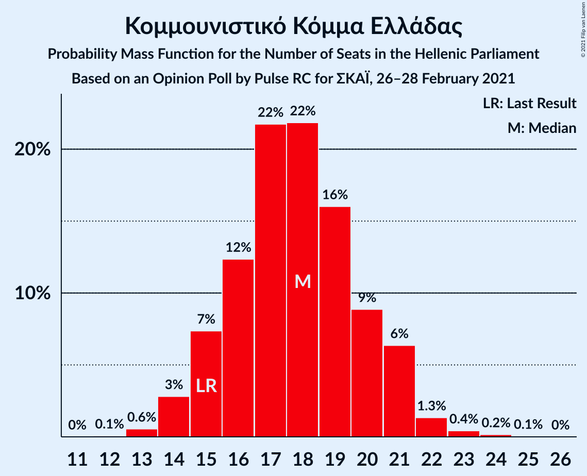

# Opinion Poll by Pulse RC for ΣΚΑΪ, 26–28 February 2021

<a href="#voting-intentions">Voting Intentions</a> | <a href="#seats">Seats</a> | <a href="#coalitions">Coalitions</a> | <a href="#technical-information">Technical Information</a>

## Voting Intentions

### Confidence Intervals

| Party | Last Result | Poll Result | 80% Confidence Interval | 90% Confidence Interval | 95% Confidence Interval | 99% Confidence Interval |
|:-----:|:-----------:|:-----------:|:-----------------------:|:-----------------------:|:-----------------------:|:-----------------------:|
| Νέα Δημοκρατία | 39.8% | 42.1% | 40.4–43.9% |39.9–44.4% |39.5–44.8% |38.6–45.7% |
| Συνασπισμός Ριζοσπαστικής Αριστεράς | 31.5% | 25.7% | 24.2–27.3% |23.8–27.8% |23.4–28.2% |22.7–29.0% |
| Κίνημα Αλλαγής | 8.1% | 8.2% | 7.3–9.3% |7.0–9.6% |6.8–9.8% |6.4–10.3% |
| Κομμουνιστικό Κόμμα Ελλάδας | 5.3% | 6.4% | 5.6–7.4% |5.4–7.7% |5.2–7.9% |4.9–8.4% |
| Ελληνική Λύση | 3.7% | 5.2% | 4.5–6.1% |4.3–6.3% |4.1–6.6% |3.8–7.0% |
| Μέτωπο Ευρωπαϊκής Ρεαλιστικής Ανυπακοής | 3.4% | 3.6% | 3.0–4.4% |2.9–4.6% |2.7–4.8% |2.5–5.2% |

*Note:* The poll result column reflects the actual value used in the calculations. Published results may vary slightly, and in addition be rounded to fewer digits.

## Seats

### Confidence Intervals

| Party | Last Result | Median | 80% Confidence Interval | 90% Confidence Interval | 95% Confidence Interval | 99% Confidence Interval |
|:-----:|:-----------:|:------:|:-----------------------:|:-----------------------:|:-----------------------:|:-----------------------:|
| <a href="#νέα-δημοκρατία">Νέα Δημοκρατία</a> | 158 | 165 | 161–171 |159–172 |158–174 |156–176 |
| <a href="#συνασπισμός-ριζοσπαστικής-αριστεράς">Συνασπισμός Ριζοσπαστικής Αριστεράς</a> | 86 | 70 | 67–75 |65–76 |64–76 |62–80 |
| <a href="#κίνημα-αλλαγής">Κίνημα Αλλαγής</a> | 22 | 23 | 20–25 |19–26 |19–27 |18–28 |
| <a href="#κομμουνιστικό-κόμμα-ελλάδας">Κομμουνιστικό Κόμμα Ελλάδας</a> | 15 | 18 | 15–20 |15–21 |14–21 |13–23 |
| <a href="#ελληνική-λύση">Ελληνική Λύση</a> | 10 | 14 | 13–16 |12–18 |12–18 |11–19 |
| <a href="#μέτωπο-ευρωπαϊκής-ρεαλιστικής-ανυπακοής">Μέτωπο Ευρωπαϊκής Ρεαλιστικής Ανυπακοής</a> | 9 | 10 | 0–12 |0–13 |0–13 |0–14 |

### Νέα Δημοκρατία

*For a full overview of the results for this party, see the [Νέα Δημοκρατία](party-νέαδημοκρατία.html) page.*

| Number of Seats | Probability | Accumulated | Special Marks |
|:---------------:|:-----------:|:-----------:|:-------------:|
| 153 | 0% | 100% |  |
| 154 | 0.1% | 99.9% |  |
| 155 | 0.2% | 99.9% |  |
| 156 | 0.4% | 99.7% |  |
| 157 | 0.6% | 99.3% |  |
| 158 | 1.2% | 98.7% | Last Result |
| 159 | 5% | 97% |  |
| 160 | 2% | 93% |  |
| 161 | 5% | 91% |  |
| 162 | 4% | 86% |  |
| 163 | 7% | 82% |  |
| 164 | 11% | 75% |  |
| 165 | 22% | 64% | Median |
| 166 | 11% | 43% |  |
| 167 | 4% | 32% |  |
| 168 | 3% | 27% |  |
| 169 | 3% | 24% |  |
| 170 | 10% | 20% |  |
| 171 | 2% | 11% |  |
| 172 | 4% | 9% |  |
| 173 | 0.3% | 5% |  |
| 174 | 3% | 4% |  |
| 175 | 0.3% | 1.0% |  |
| 176 | 0.2% | 0.6% |  |
| 177 | 0.1% | 0.4% |  |
| 178 | 0.2% | 0.3% |  |
| 179 | 0.1% | 0.1% |  |
| 180 | 0% | 0% |  |

### Συνασπισμός Ριζοσπαστικής Αριστεράς

*For a full overview of the results for this party, see the [Συνασπισμός Ριζοσπαστικής Αριστεράς](party-συνασπισμόςριζοσπαστικήςαριστεράς.html) page.*

| Number of Seats | Probability | Accumulated | Special Marks |
|:---------------:|:-----------:|:-----------:|:-------------:|
| 60 | 0% | 100% |  |
| 61 | 0.1% | 99.9% |  |
| 62 | 0.8% | 99.9% |  |
| 63 | 1.0% | 99.1% |  |
| 64 | 2% | 98% |  |
| 65 | 4% | 96% |  |
| 66 | 1.1% | 92% |  |
| 67 | 3% | 91% |  |
| 68 | 14% | 88% |  |
| 69 | 13% | 74% |  |
| 70 | 16% | 61% | Median |
| 71 | 11% | 44% |  |
| 72 | 2% | 34% |  |
| 73 | 6% | 31% |  |
| 74 | 14% | 25% |  |
| 75 | 4% | 12% |  |
| 76 | 5% | 7% |  |
| 77 | 0.6% | 2% |  |
| 78 | 0.3% | 2% |  |
| 79 | 0.4% | 1.2% |  |
| 80 | 0.5% | 0.8% |  |
| 81 | 0.2% | 0.3% |  |
| 82 | 0.1% | 0.1% |  |
| 83 | 0% | 0% |  |
| 84 | 0% | 0% |  |
| 85 | 0% | 0% |  |
| 86 | 0% | 0% | Last Result |

### Κίνημα Αλλαγής

*For a full overview of the results for this party, see the [Κίνημα Αλλαγής](party-κίνημααλλαγής.html) page.*

| Number of Seats | Probability | Accumulated | Special Marks |
|:---------------:|:-----------:|:-----------:|:-------------:|
| 16 | 0.1% | 100% |  |
| 17 | 0.4% | 99.9% |  |
| 18 | 1.5% | 99.6% |  |
| 19 | 3% | 98% |  |
| 20 | 9% | 95% |  |
| 21 | 11% | 85% |  |
| 22 | 18% | 75% | Last Result |
| 23 | 19% | 56% | Median |
| 24 | 15% | 37% |  |
| 25 | 13% | 22% |  |
| 26 | 5% | 9% |  |
| 27 | 3% | 4% |  |
| 28 | 1.0% | 1.3% |  |
| 29 | 0.2% | 0.4% |  |
| 30 | 0.1% | 0.1% |  |
| 31 | 0% | 0% |  |

### Κομμουνιστικό Κόμμα Ελλάδας

*For a full overview of the results for this party, see the [Κομμουνιστικό Κόμμα Ελλάδας](party-κομμουνιστικόκόμμαελλάδας.html) page.*

| Number of Seats | Probability | Accumulated | Special Marks |
|:---------------:|:-----------:|:-----------:|:-------------:|
| 12 | 0.1% | 100% |  |
| 13 | 0.7% | 99.9% |  |
| 14 | 4% | 99.2% |  |
| 15 | 7% | 96% | Last Result |
| 16 | 13% | 88% |  |
| 17 | 23% | 75% |  |
| 18 | 23% | 52% | Median |
| 19 | 14% | 29% |  |
| 20 | 7% | 15% |  |
| 21 | 6% | 8% |  |
| 22 | 2% | 2% |  |
| 23 | 0.3% | 0.6% |  |
| 24 | 0.1% | 0.2% |  |
| 25 | 0.1% | 0.1% |  |
| 26 | 0% | 0% |  |

### Ελληνική Λύση

*For a full overview of the results for this party, see the [Ελληνική Λύση](party-ελληνικήλύση.html) page.*

| Number of Seats | Probability | Accumulated | Special Marks |
|:---------------:|:-----------:|:-----------:|:-------------:|
| 9 | 0.1% | 100% |  |
| 10 | 0.3% | 99.9% | Last Result |
| 11 | 0.9% | 99.6% |  |
| 12 | 8% | 98.7% |  |
| 13 | 30% | 91% |  |
| 14 | 35% | 60% | Median |
| 15 | 13% | 25% |  |
| 16 | 3% | 12% |  |
| 17 | 4% | 10% |  |
| 18 | 4% | 6% |  |
| 19 | 1.3% | 2% |  |
| 20 | 0.2% | 0.3% |  |
| 21 | 0% | 0% |  |

### Μέτωπο Ευρωπαϊκής Ρεαλιστικής Ανυπακοής

*For a full overview of the results for this party, see the [Μέτωπο Ευρωπαϊκής Ρεαλιστικής Ανυπακοής](party-μέτωποευρωπαϊκήςρεαλιστικήςανυπακοής.html) page.*

| Number of Seats | Probability | Accumulated | Special Marks |
|:---------------:|:-----------:|:-----------:|:-------------:|
| 0 | 10% | 100% |  |
| 1 | 0% | 90% |  |
| 2 | 0% | 90% |  |
| 3 | 0% | 90% |  |
| 4 | 0% | 90% |  |
| 5 | 0% | 90% |  |
| 6 | 0% | 90% |  |
| 7 | 0% | 90% |  |
| 8 | 5% | 90% |  |
| 9 | 20% | 85% | Last Result |
| 10 | 29% | 65% | Median |
| 11 | 20% | 36% |  |
| 12 | 9% | 16% |  |
| 13 | 5% | 6% |  |
| 14 | 1.2% | 1.4% |  |
| 15 | 0.2% | 0.2% |  |
| 16 | 0% | 0% |  |

## Coalitions

### Confidence Intervals

| Coalition | Last Result | Median | Majority? | 80% Confidence Interval | 90% Confidence Interval | 95% Confidence Interval | 99% Confidence Interval |
|:---------:|:-----------:|:------:|:---------:|:-----------------------:|:-----------------------:|:-----------------------:|:-----------------------:|
| Νέα Δημοκρατία – Κίνημα Αλλαγής | 180 | 189 | 100% | 184–193 | 182–196 | 181–198 | 178–200 |
| Νέα Δημοκρατία | 158 | 165 | 100% | 161–171 | 159–172 | 158–174 | 156–176 |
| Συνασπισμός Ριζοσπαστικής Αριστεράς – Μέτωπο Ευρωπαϊκής Ρεαλιστικής Ανυπακοής | 95 | 80 | 0% | 75–85 | 71–86 | 70–87 | 68–89 |
| Συνασπισμός Ριζοσπαστικής Αριστεράς | 86 | 70 | 0% | 67–75 | 65–76 | 64–76 | 62–80 |

### Νέα Δημοκρατία – Κίνημα Αλλαγής

| Number of Seats | Probability | Accumulated | Special Marks |
|:---------------:|:-----------:|:-----------:|:-------------:|
| 176 | 0.1% | 100% |  |
| 177 | 0.1% | 99.9% |  |
| 178 | 0.3% | 99.8% |  |
| 179 | 0.7% | 99.5% |  |
| 180 | 1.0% | 98.8% | Last Result |
| 181 | 1.3% | 98% |  |
| 182 | 3% | 97% |  |
| 183 | 4% | 94% |  |
| 184 | 4% | 90% |  |
| 185 | 8% | 86% |  |
| 186 | 7% | 78% |  |
| 187 | 15% | 72% |  |
| 188 | 5% | 57% | Median |
| 189 | 15% | 52% |  |
| 190 | 14% | 37% |  |
| 191 | 2% | 23% |  |
| 192 | 8% | 21% |  |
| 193 | 3% | 12% |  |
| 194 | 3% | 9% |  |
| 195 | 0.9% | 6% |  |
| 196 | 0.6% | 5% |  |
| 197 | 0.7% | 5% |  |
| 198 | 3% | 4% |  |
| 199 | 0.5% | 1.1% |  |
| 200 | 0.5% | 0.6% |  |
| 201 | 0.1% | 0.1% |  |
| 202 | 0% | 0.1% |  |
| 203 | 0% | 0.1% |  |
| 204 | 0% | 0% |  |

### Νέα Δημοκρατία

| Number of Seats | Probability | Accumulated | Special Marks |
|:---------------:|:-----------:|:-----------:|:-------------:|
| 153 | 0% | 100% |  |
| 154 | 0.1% | 99.9% |  |
| 155 | 0.2% | 99.9% |  |
| 156 | 0.4% | 99.7% |  |
| 157 | 0.6% | 99.3% |  |
| 158 | 1.2% | 98.7% | Last Result |
| 159 | 5% | 97% |  |
| 160 | 2% | 93% |  |
| 161 | 5% | 91% |  |
| 162 | 4% | 86% |  |
| 163 | 7% | 82% |  |
| 164 | 11% | 75% |  |
| 165 | 22% | 64% | Median |
| 166 | 11% | 43% |  |
| 167 | 4% | 32% |  |
| 168 | 3% | 27% |  |
| 169 | 3% | 24% |  |
| 170 | 10% | 20% |  |
| 171 | 2% | 11% |  |
| 172 | 4% | 9% |  |
| 173 | 0.3% | 5% |  |
| 174 | 3% | 4% |  |
| 175 | 0.3% | 1.0% |  |
| 176 | 0.2% | 0.6% |  |
| 177 | 0.1% | 0.4% |  |
| 178 | 0.2% | 0.3% |  |
| 179 | 0.1% | 0.1% |  |
| 180 | 0% | 0% |  |

### Συνασπισμός Ριζοσπαστικής Αριστεράς – Μέτωπο Ευρωπαϊκής Ρεαλιστικής Ανυπακοής

| Number of Seats | Probability | Accumulated | Special Marks |
|:---------------:|:-----------:|:-----------:|:-------------:|
| 64 | 0% | 100% |  |
| 65 | 0% | 99.9% |  |
| 66 | 0% | 99.9% |  |
| 67 | 0.3% | 99.9% |  |
| 68 | 0.5% | 99.7% |  |
| 69 | 0.7% | 99.2% |  |
| 70 | 3% | 98.5% |  |
| 71 | 0.7% | 96% |  |
| 72 | 0.4% | 95% |  |
| 73 | 1.5% | 94% |  |
| 74 | 3% | 93% |  |
| 75 | 3% | 90% |  |
| 76 | 5% | 87% |  |
| 77 | 6% | 83% |  |
| 78 | 11% | 76% |  |
| 79 | 9% | 65% |  |
| 80 | 8% | 56% | Median |
| 81 | 12% | 48% |  |
| 82 | 7% | 36% |  |
| 83 | 12% | 29% |  |
| 84 | 7% | 17% |  |
| 85 | 1.4% | 10% |  |
| 86 | 5% | 9% |  |
| 87 | 2% | 3% |  |
| 88 | 0.9% | 2% |  |
| 89 | 0.6% | 0.9% |  |
| 90 | 0.2% | 0.3% |  |
| 91 | 0.1% | 0.2% |  |
| 92 | 0% | 0.1% |  |
| 93 | 0% | 0% |  |
| 94 | 0% | 0% |  |
| 95 | 0% | 0% | Last Result |

### Συνασπισμός Ριζοσπαστικής Αριστεράς

| Number of Seats | Probability | Accumulated | Special Marks |
|:---------------:|:-----------:|:-----------:|:-------------:|
| 60 | 0% | 100% |  |
| 61 | 0.1% | 99.9% |  |
| 62 | 0.8% | 99.9% |  |
| 63 | 1.0% | 99.1% |  |
| 64 | 2% | 98% |  |
| 65 | 4% | 96% |  |
| 66 | 1.1% | 92% |  |
| 67 | 3% | 91% |  |
| 68 | 14% | 88% |  |
| 69 | 13% | 74% |  |
| 70 | 16% | 61% | Median |
| 71 | 11% | 44% |  |
| 72 | 2% | 34% |  |
| 73 | 6% | 31% |  |
| 74 | 14% | 25% |  |
| 75 | 4% | 12% |  |
| 76 | 5% | 7% |  |
| 77 | 0.6% | 2% |  |
| 78 | 0.3% | 2% |  |
| 79 | 0.4% | 1.2% |  |
| 80 | 0.5% | 0.8% |  |
| 81 | 0.2% | 0.3% |  |
| 82 | 0.1% | 0.1% |  |
| 83 | 0% | 0% |  |
| 84 | 0% | 0% |  |
| 85 | 0% | 0% |  |
| 86 | 0% | 0% | Last Result |

## Technical Information

### Opinion Poll

+ **Polling firm:** Pulse RC
+ **Commissioner(s):** ΣΚΑΪ
+ **Fieldwork period:** 26–28 February 2021

### Calculations

+ **Sample size:** 1306
+ **Simulations done:** 65,536
+ **Error estimate:** 1.08%

