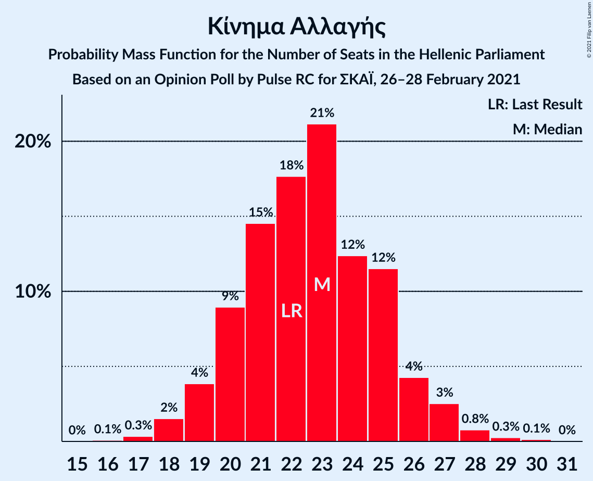
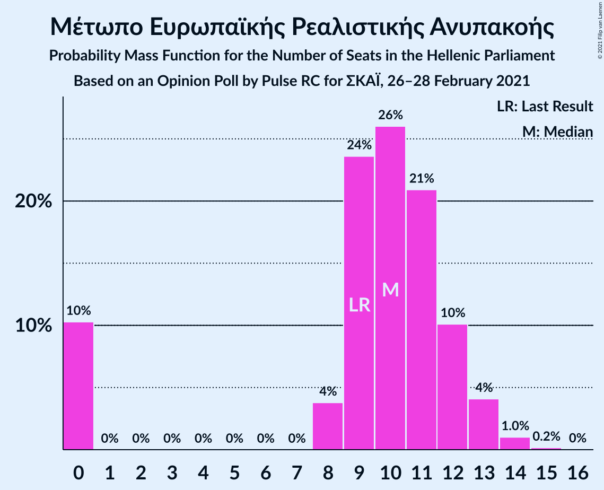
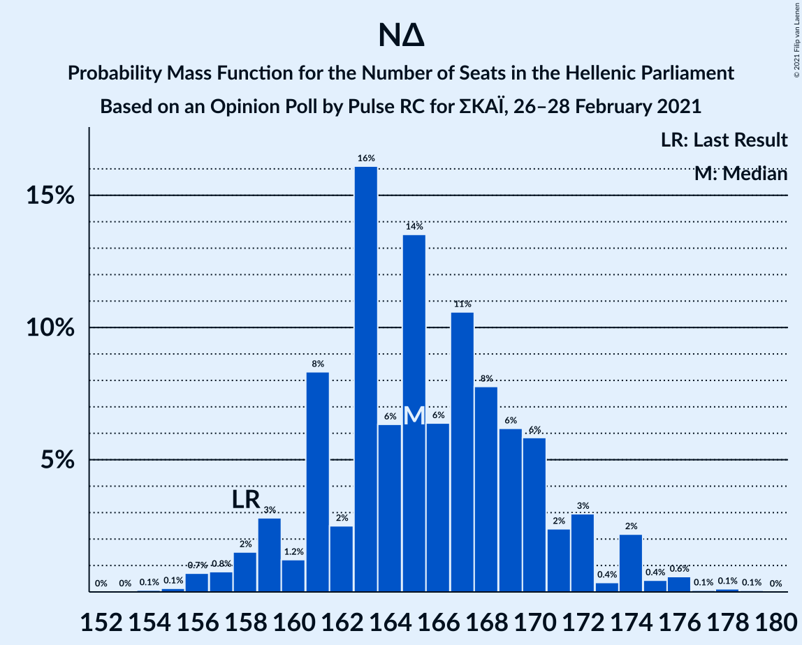
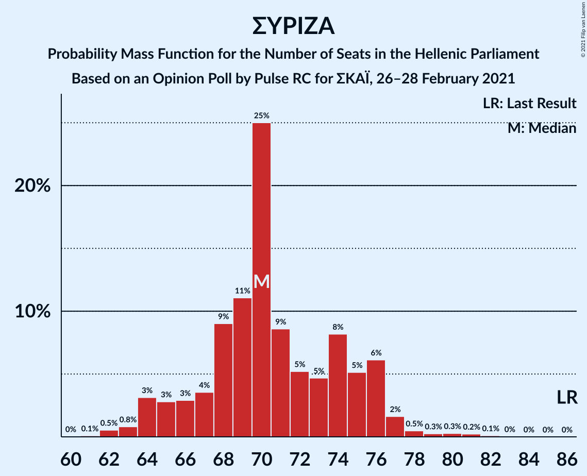

# Opinion Poll by Pulse RC for ΣΚΑΪ, 26–28 February 2021

<a href="#voting-intentions">Voting Intentions</a> | <a href="#seats">Seats</a> | <a href="#coalitions">Coalitions</a> | <a href="#technical-information">Technical Information</a>

## Voting Intentions

### Confidence Intervals

| Party | Last Result | Poll Result | 80% Confidence Interval | 90% Confidence Interval | 95% Confidence Interval | 99% Confidence Interval |
|:-----:|:-----------:|:-----------:|:-----------------------:|:-----------------------:|:-----------------------:|:-----------------------:|
| Νέα Δημοκρατία | 39.8% | 42.0% | 40.3–43.8% |39.8–44.3% |39.4–44.7% |38.5–45.6% |
| Συνασπισμός Ριζοσπαστικής Αριστεράς | 31.5% | 25.5% | 24.0–27.1% |23.6–27.5% |23.2–27.9% |22.5–28.7% |
| Κίνημα Αλλαγής | 8.1% | 8.5% | 7.6–9.6% |7.3–9.9% |7.1–10.2% |6.7–10.7% |
| Κομμουνιστικό Κόμμα Ελλάδας | 5.3% | 6.5% | 5.7–7.5% |5.5–7.7% |5.3–8.0% |4.9–8.5% |
| Ελληνική Λύση | 3.7% | 5.0% | 4.3–5.8% |4.1–6.1% |3.9–6.3% |3.6–6.7% |
| Μέτωπο Ευρωπαϊκής Ρεαλιστικής Ανυπακοής | 3.4% | 3.5% | 2.9–4.3% |2.8–4.5% |2.7–4.7% |2.4–5.1% |

*Note:* The poll result column reflects the actual value used in the calculations. Published results may vary slightly, and in addition be rounded to fewer digits.

## Seats

### Confidence Intervals

| Party | Last Result | Median | 80% Confidence Interval | 90% Confidence Interval | 95% Confidence Interval | 99% Confidence Interval |
|:-----:|:-----------:|:------:|:-----------------------:|:-----------------------:|:-----------------------:|:-----------------------:|
| <a href="#νέα-δημοκρατία">Νέα Δημοκρατία</a> | 158 | 165 | 161–171 |159–172 |158–174 |156–176 |
| <a href="#συνασπισμός-ριζοσπαστικής-αριστεράς">Συνασπισμός Ριζοσπαστικής Αριστεράς</a> | 86 | 70 | 66–75 |65–76 |64–77 |62–79 |
| <a href="#κίνημα-αλλαγής">Κίνημα Αλλαγής</a> | 22 | 24 | 21–26 |20–27 |20–28 |18–29 |
| <a href="#κομμουνιστικό-κόμμα-ελλάδας">Κομμουνιστικό Κόμμα Ελλάδας</a> | 15 | 18 | 16–20 |16–22 |15–22 |13–23 |
| <a href="#ελληνική-λύση">Ελληνική Λύση</a> | 10 | 14 | 12–16 |11–17 |11–17 |10–18 |
| <a href="#μέτωπο-ευρωπαϊκής-ρεαλιστικής-ανυπακοής">Μέτωπο Ευρωπαϊκής Ρεαλιστικής Ανυπακοής</a> | 9 | 10 | 0–12 |0–12 |0–13 |0–14 |

### Νέα Δημοκρατία

*For a full overview of the results for this party, see the [Νέα Δημοκρατία](party-νέαδημοκρατία.html) page.*

| Number of Seats | Probability | Accumulated | Special Marks |
|:---------------:|:-----------:|:-----------:|:-------------:|
| 153 | 0% | 100% |  |
| 154 | 0.1% | 99.9% |  |
| 155 | 0.2% | 99.9% |  |
| 156 | 0.4% | 99.7% |  |
| 157 | 0.8% | 99.3% |  |
| 158 | 2% | 98% | Last Result |
| 159 | 2% | 97% |  |
| 160 | 4% | 94% |  |
| 161 | 4% | 90% |  |
| 162 | 8% | 86% |  |
| 163 | 8% | 78% |  |
| 164 | 11% | 70% |  |
| 165 | 10% | 60% | Median |
| 166 | 11% | 49% |  |
| 167 | 8% | 39% |  |
| 168 | 9% | 31% |  |
| 169 | 5% | 21% |  |
| 170 | 6% | 16% |  |
| 171 | 3% | 10% |  |
| 172 | 3% | 7% |  |
| 173 | 2% | 4% |  |
| 174 | 1.1% | 3% |  |
| 175 | 0.7% | 2% |  |
| 176 | 0.5% | 0.9% |  |
| 177 | 0.2% | 0.5% |  |
| 178 | 0.2% | 0.3% |  |
| 179 | 0.1% | 0.1% |  |
| 180 | 0% | 0.1% |  |
| 181 | 0% | 0% |  |

### Συνασπισμός Ριζοσπαστικής Αριστεράς

*For a full overview of the results for this party, see the [Συνασπισμός Ριζοσπαστικής Αριστεράς](party-συνασπισμόςριζοσπαστικήςαριστεράς.html) page.*

| Number of Seats | Probability | Accumulated | Special Marks |
|:---------------:|:-----------:|:-----------:|:-------------:|
| 60 | 0.1% | 100% |  |
| 61 | 0.2% | 99.9% |  |
| 62 | 0.6% | 99.6% |  |
| 63 | 1.1% | 99.1% |  |
| 64 | 2% | 98% |  |
| 65 | 4% | 96% |  |
| 66 | 6% | 92% |  |
| 67 | 8% | 86% |  |
| 68 | 10% | 79% |  |
| 69 | 11% | 68% |  |
| 70 | 12% | 57% | Median |
| 71 | 11% | 45% |  |
| 72 | 10% | 35% |  |
| 73 | 7% | 24% |  |
| 74 | 6% | 17% |  |
| 75 | 4% | 10% |  |
| 76 | 3% | 6% |  |
| 77 | 1.5% | 3% |  |
| 78 | 0.8% | 2% |  |
| 79 | 0.5% | 1.0% |  |
| 80 | 0.2% | 0.5% |  |
| 81 | 0.1% | 0.2% |  |
| 82 | 0.1% | 0.1% |  |
| 83 | 0% | 0% |  |
| 84 | 0% | 0% |  |
| 85 | 0% | 0% |  |
| 86 | 0% | 0% | Last Result |

### Κίνημα Αλλαγής

*For a full overview of the results for this party, see the [Κίνημα Αλλαγής](party-κίνημααλλαγής.html) page.*

| Number of Seats | Probability | Accumulated | Special Marks |
|:---------------:|:-----------:|:-----------:|:-------------:|
| 17 | 0.1% | 100% |  |
| 18 | 0.5% | 99.9% |  |
| 19 | 2% | 99.4% |  |
| 20 | 5% | 98% |  |
| 21 | 10% | 93% |  |
| 22 | 15% | 83% | Last Result |
| 23 | 18% | 68% |  |
| 24 | 19% | 50% | Median |
| 25 | 14% | 32% |  |
| 26 | 9% | 17% |  |
| 27 | 5% | 8% |  |
| 28 | 2% | 4% |  |
| 29 | 1.0% | 1.4% |  |
| 30 | 0.3% | 0.4% |  |
| 31 | 0.1% | 0.1% |  |
| 32 | 0% | 0% |  |

### Κομμουνιστικό Κόμμα Ελλάδας

*For a full overview of the results for this party, see the [Κομμουνιστικό Κόμμα Ελλάδας](party-κομμουνιστικόκόμμαελλάδας.html) page.*

| Number of Seats | Probability | Accumulated | Special Marks |
|:---------------:|:-----------:|:-----------:|:-------------:|
| 12 | 0.1% | 100% |  |
| 13 | 0.5% | 99.9% |  |
| 14 | 1.0% | 99.4% |  |
| 15 | 1.4% | 98% | Last Result |
| 16 | 8% | 97% |  |
| 17 | 29% | 89% |  |
| 18 | 34% | 59% | Median |
| 19 | 15% | 25% |  |
| 20 | 3% | 10% |  |
| 21 | 2% | 8% |  |
| 22 | 3% | 5% |  |
| 23 | 2% | 2% |  |
| 24 | 0.4% | 0.4% |  |
| 25 | 0% | 0% |  |

### Ελληνική Λύση

*For a full overview of the results for this party, see the [Ελληνική Λύση](party-ελληνικήλύση.html) page.*

| Number of Seats | Probability | Accumulated | Special Marks |
|:---------------:|:-----------:|:-----------:|:-------------:|
| 9 | 0.2% | 100% |  |
| 10 | 1.2% | 99.8% | Last Result |
| 11 | 6% | 98.6% |  |
| 12 | 13% | 93% |  |
| 13 | 23% | 80% |  |
| 14 | 23% | 57% | Median |
| 15 | 19% | 34% |  |
| 16 | 9% | 15% |  |
| 17 | 4% | 6% |  |
| 18 | 1.3% | 2% |  |
| 19 | 0.3% | 0.4% |  |
| 20 | 0.1% | 0.1% |  |
| 21 | 0% | 0% |  |

### Μέτωπο Ευρωπαϊκής Ρεαλιστικής Ανυπακοής

*For a full overview of the results for this party, see the [Μέτωπο Ευρωπαϊκής Ρεαλιστικής Ανυπακοής](party-μέτωποευρωπαϊκήςρεαλιστικήςανυπακοής.html) page.*

| Number of Seats | Probability | Accumulated | Special Marks |
|:---------------:|:-----------:|:-----------:|:-------------:|
| 0 | 12% | 100% |  |
| 1 | 0% | 88% |  |
| 2 | 0% | 88% |  |
| 3 | 0% | 88% |  |
| 4 | 0% | 88% |  |
| 5 | 0% | 88% |  |
| 6 | 0% | 88% |  |
| 7 | 0% | 88% |  |
| 8 | 4% | 88% |  |
| 9 | 25% | 83% | Last Result |
| 10 | 28% | 58% | Median |
| 11 | 18% | 30% |  |
| 12 | 9% | 12% |  |
| 13 | 3% | 4% |  |
| 14 | 0.7% | 0.8% |  |
| 15 | 0.1% | 0.1% |  |
| 16 | 0% | 0% |  |

## Coalitions

### Confidence Intervals

| Coalition | Last Result | Median | Majority? | 80% Confidence Interval | 90% Confidence Interval | 95% Confidence Interval | 99% Confidence Interval |
|:---------:|:-----------:|:------:|:---------:|:-----------------------:|:-----------------------:|:-----------------------:|:-----------------------:|
| Νέα Δημοκρατία – Κίνημα Αλλαγής | 180 | 189 | 100% | 184–194 | 183–196 | 182–198 | 179–201 |
| Νέα Δημοκρατία | 158 | 165 | 100% | 161–171 | 159–172 | 158–174 | 156–176 |
| Συνασπισμός Ριζοσπαστικής Αριστεράς – Μέτωπο Ευρωπαϊκής Ρεαλιστικής Ανυπακοής | 95 | 79 | 0% | 74–84 | 72–85 | 70–86 | 67–88 |
| Συνασπισμός Ριζοσπαστικής Αριστεράς | 86 | 70 | 0% | 66–75 | 65–76 | 64–77 | 62–79 |

### Νέα Δημοκρατία – Κίνημα Αλλαγής

| Number of Seats | Probability | Accumulated | Special Marks |
|:---------------:|:-----------:|:-----------:|:-------------:|
| 177 | 0.1% | 100% |  |
| 178 | 0.1% | 99.9% |  |
| 179 | 0.3% | 99.8% |  |
| 180 | 0.6% | 99.5% | Last Result |
| 181 | 1.1% | 98.8% |  |
| 182 | 2% | 98% |  |
| 183 | 3% | 96% |  |
| 184 | 4% | 93% |  |
| 185 | 6% | 88% |  |
| 186 | 8% | 82% |  |
| 187 | 9% | 74% |  |
| 188 | 10% | 65% |  |
| 189 | 10% | 54% | Median |
| 190 | 10% | 44% |  |
| 191 | 8% | 35% |  |
| 192 | 8% | 26% |  |
| 193 | 5% | 19% |  |
| 194 | 4% | 13% |  |
| 195 | 3% | 10% |  |
| 196 | 2% | 6% |  |
| 197 | 1.4% | 4% |  |
| 198 | 1.2% | 3% |  |
| 199 | 0.6% | 2% |  |
| 200 | 0.5% | 1.1% |  |
| 201 | 0.3% | 0.6% |  |
| 202 | 0.1% | 0.3% |  |
| 203 | 0.1% | 0.1% |  |
| 204 | 0% | 0.1% |  |
| 205 | 0% | 0% |  |

### Νέα Δημοκρατία

| Number of Seats | Probability | Accumulated | Special Marks |
|:---------------:|:-----------:|:-----------:|:-------------:|
| 153 | 0% | 100% |  |
| 154 | 0.1% | 99.9% |  |
| 155 | 0.2% | 99.9% |  |
| 156 | 0.4% | 99.7% |  |
| 157 | 0.8% | 99.3% |  |
| 158 | 2% | 98% | Last Result |
| 159 | 2% | 97% |  |
| 160 | 4% | 94% |  |
| 161 | 4% | 90% |  |
| 162 | 8% | 86% |  |
| 163 | 8% | 78% |  |
| 164 | 11% | 70% |  |
| 165 | 10% | 60% | Median |
| 166 | 11% | 49% |  |
| 167 | 8% | 39% |  |
| 168 | 9% | 31% |  |
| 169 | 5% | 21% |  |
| 170 | 6% | 16% |  |
| 171 | 3% | 10% |  |
| 172 | 3% | 7% |  |
| 173 | 2% | 4% |  |
| 174 | 1.1% | 3% |  |
| 175 | 0.7% | 2% |  |
| 176 | 0.5% | 0.9% |  |
| 177 | 0.2% | 0.5% |  |
| 178 | 0.2% | 0.3% |  |
| 179 | 0.1% | 0.1% |  |
| 180 | 0% | 0.1% |  |
| 181 | 0% | 0% |  |

### Συνασπισμός Ριζοσπαστικής Αριστεράς – Μέτωπο Ευρωπαϊκής Ρεαλιστικής Ανυπακοής

| Number of Seats | Probability | Accumulated | Special Marks |
|:---------------:|:-----------:|:-----------:|:-------------:|
| 64 | 0% | 100% |  |
| 65 | 0.1% | 99.9% |  |
| 66 | 0.2% | 99.9% |  |
| 67 | 0.3% | 99.6% |  |
| 68 | 0.5% | 99.3% |  |
| 69 | 0.9% | 98.8% |  |
| 70 | 1.0% | 98% |  |
| 71 | 1.2% | 97% |  |
| 72 | 2% | 96% |  |
| 73 | 3% | 94% |  |
| 74 | 3% | 91% |  |
| 75 | 5% | 88% |  |
| 76 | 6% | 83% |  |
| 77 | 8% | 77% |  |
| 78 | 10% | 69% |  |
| 79 | 11% | 59% |  |
| 80 | 11% | 48% | Median |
| 81 | 9% | 38% |  |
| 82 | 9% | 28% |  |
| 83 | 7% | 20% |  |
| 84 | 5% | 13% |  |
| 85 | 3% | 7% |  |
| 86 | 2% | 4% |  |
| 87 | 1.1% | 2% |  |
| 88 | 0.6% | 1.0% |  |
| 89 | 0.3% | 0.5% |  |
| 90 | 0.1% | 0.2% |  |
| 91 | 0% | 0.1% |  |
| 92 | 0% | 0% |  |
| 93 | 0% | 0% |  |
| 94 | 0% | 0% |  |
| 95 | 0% | 0% | Last Result |

### Συνασπισμός Ριζοσπαστικής Αριστεράς

| Number of Seats | Probability | Accumulated | Special Marks |
|:---------------:|:-----------:|:-----------:|:-------------:|
| 60 | 0.1% | 100% |  |
| 61 | 0.2% | 99.9% |  |
| 62 | 0.6% | 99.6% |  |
| 63 | 1.1% | 99.1% |  |
| 64 | 2% | 98% |  |
| 65 | 4% | 96% |  |
| 66 | 6% | 92% |  |
| 67 | 8% | 86% |  |
| 68 | 10% | 79% |  |
| 69 | 11% | 68% |  |
| 70 | 12% | 57% | Median |
| 71 | 11% | 45% |  |
| 72 | 10% | 35% |  |
| 73 | 7% | 24% |  |
| 74 | 6% | 17% |  |
| 75 | 4% | 10% |  |
| 76 | 3% | 6% |  |
| 77 | 1.5% | 3% |  |
| 78 | 0.8% | 2% |  |
| 79 | 0.5% | 1.0% |  |
| 80 | 0.2% | 0.5% |  |
| 81 | 0.1% | 0.2% |  |
| 82 | 0.1% | 0.1% |  |
| 83 | 0% | 0% |  |
| 84 | 0% | 0% |  |
| 85 | 0% | 0% |  |
| 86 | 0% | 0% | Last Result |

## Technical Information

### Opinion Poll

+ **Polling firm:** Pulse RC
+ **Commissioner(s):** ΣΚΑΪ
+ **Fieldwork period:** 26–28 February 2021

### Calculations

+ **Sample size:** 1306
+ **Simulations done:** 1,048,576
+ **Error estimate:** 0.38%

