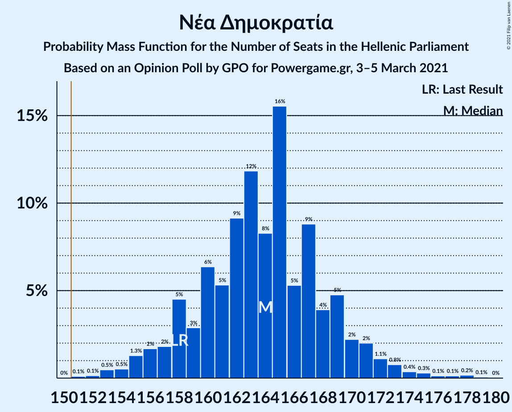
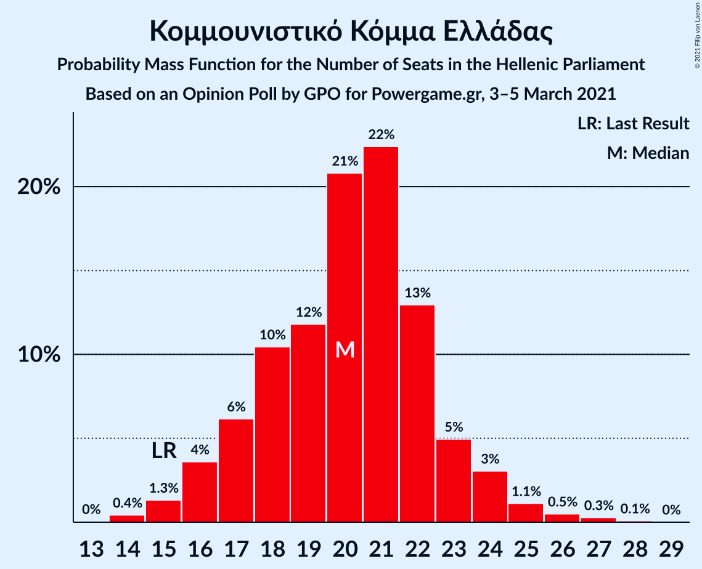
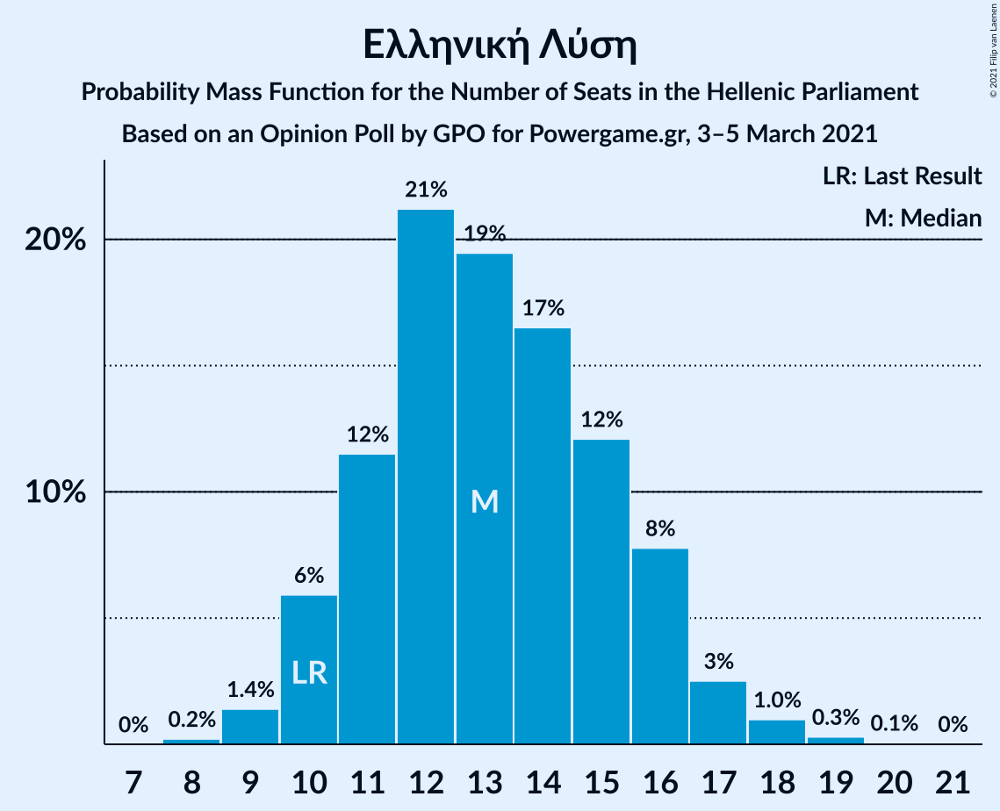
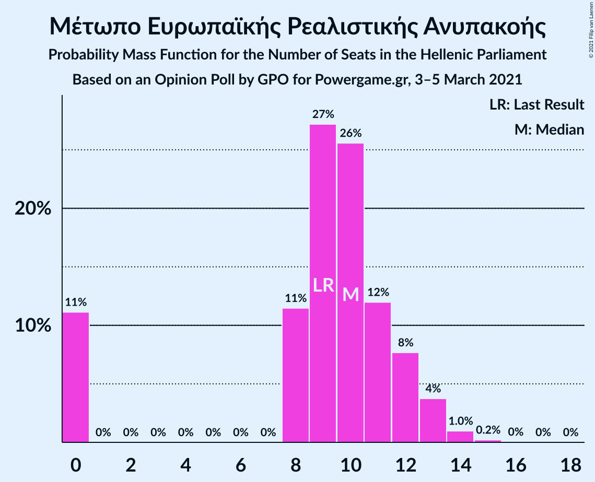
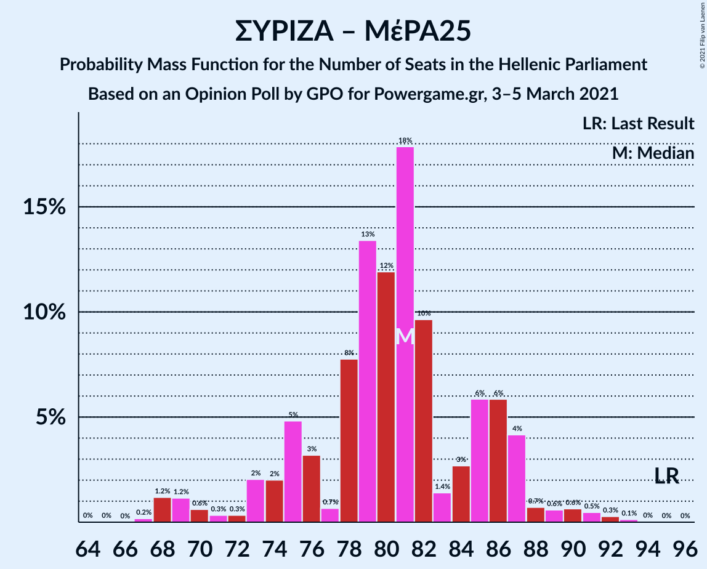

# Opinion Poll by GPO for Powergame.gr, 3–5 March 2021

<a href="#voting-intentions">Voting Intentions</a> | <a href="#seats">Seats</a> | <a href="#coalitions">Coalitions</a> | <a href="#technical-information">Technical Information</a>

## Voting Intentions

### Confidence Intervals

| Party | Last Result | Poll Result | 80% Confidence Interval | 90% Confidence Interval | 95% Confidence Interval | 99% Confidence Interval |
|:-----:|:-----------:|:-----------:|:-----------------------:|:-----------------------:|:-----------------------:|:-----------------------:|
| Νέα Δημοκρατία | 39.8% | 43.2% | 41.2–45.2% |40.6–45.8% |40.2–46.3% |39.2–47.3% |
| Συνασπισμός Ριζοσπαστικής Αριστεράς | 31.5% | 27.2% | 25.5–29.1% |25.0–29.6% |24.5–30.1% |23.7–31.0% |
| Κίνημα Αλλαγής | 8.1% | 8.5% | 7.5–9.7% |7.2–10.1% |6.9–10.4% |6.4–11.0% |
| Κομμουνιστικό Κόμμα Ελλάδας | 5.3% | 7.5% | 6.5–8.7% |6.2–9.0% |6.0–9.3% |5.6–9.9% |
| Ελληνική Λύση | 3.7% | 4.9% | 4.1–5.9% |3.9–6.2% |3.7–6.4% |3.4–6.9% |
| Μέτωπο Ευρωπαϊκής Ρεαλιστικής Ανυπακοής | 3.4% | 3.6% | 2.9–4.5% |2.8–4.7% |2.6–5.0% |2.3–5.4% |

*Note:* The poll result column reflects the actual value used in the calculations. Published results may vary slightly, and in addition be rounded to fewer digits.

## Seats

### Confidence Intervals

| Party | Last Result | Median | 80% Confidence Interval | 90% Confidence Interval | 95% Confidence Interval | 99% Confidence Interval |
|:-----:|:-----------:|:------:|:-----------------------:|:-----------------------:|:-----------------------:|:-----------------------:|
| <a href="#νέα-δημοκρατία">Νέα Δημοκρατία</a> | 158 | 164 | 158–169 |157–171 |155–172 |153–176 |
| <a href="#συνασπισμός-ριζοσπαστικής-αριστεράς">Συνασπισμός Ριζοσπαστικής Αριστεράς</a> | 86 | 71 | 68–76 |65–78 |64–80 |62–82 |
| <a href="#κίνημα-αλλαγής">Κίνημα Αλλαγής</a> | 22 | 22 | 19–26 |19–27 |18–28 |17–29 |
| <a href="#κομμουνιστικό-κόμμα-ελλάδας">Κομμουνιστικό Κόμμα Ελλάδας</a> | 15 | 20 | 17–23 |16–24 |16–24 |15–26 |
| <a href="#ελληνική-λύση">Ελληνική Λύση</a> | 10 | 13 | 11–16 |10–16 |10–17 |9–18 |
| <a href="#μέτωπο-ευρωπαϊκής-ρεαλιστικής-ανυπακοής">Μέτωπο Ευρωπαϊκής Ρεαλιστικής Ανυπακοής</a> | 9 | 10 | 0–12 |0–12 |0–13 |0–14 |

### Νέα Δημοκρατία

*For a full overview of the results for this party, see the [Νέα Δημοκρατία](party-νέαδημοκρατία.html) page.*

| Number of Seats | Probability | Accumulated | Special Marks |
|:---------------:|:-----------:|:-----------:|:-------------:|
| 150 | 0% | 100% |  |
| 151 | 0.1% | 99.9% | Majority |
| 152 | 0.1% | 99.8% |  |
| 153 | 0.5% | 99.7% |  |
| 154 | 0.5% | 99.2% |  |
| 155 | 1.3% | 98.7% |  |
| 156 | 2% | 97% |  |
| 157 | 2% | 96% |  |
| 158 | 5% | 94% | Last Result |
| 159 | 3% | 89% |  |
| 160 | 6% | 87% |  |
| 161 | 5% | 80% |  |
| 162 | 9% | 75% |  |
| 163 | 12% | 66% |  |
| 164 | 8% | 54% | Median |
| 165 | 16% | 46% |  |
| 166 | 5% | 30% |  |
| 167 | 9% | 25% |  |
| 168 | 4% | 16% |  |
| 169 | 5% | 12% |  |
| 170 | 2% | 7% |  |
| 171 | 2% | 5% |  |
| 172 | 1.1% | 3% |  |
| 173 | 0.8% | 2% |  |
| 174 | 0.4% | 1.2% |  |
| 175 | 0.3% | 0.8% |  |
| 176 | 0.1% | 0.5% |  |
| 177 | 0.1% | 0.4% |  |
| 178 | 0.2% | 0.3% |  |
| 179 | 0.1% | 0.1% |  |
| 180 | 0% | 0% |  |

### Συνασπισμός Ριζοσπαστικής Αριστεράς

*For a full overview of the results for this party, see the [Συνασπισμός Ριζοσπαστικής Αριστεράς](party-συνασπισμόςριζοσπαστικήςαριστεράς.html) page.*

| Number of Seats | Probability | Accumulated | Special Marks |
|:---------------:|:-----------:|:-----------:|:-------------:|
| 60 | 0.1% | 100% |  |
| 61 | 0.2% | 99.9% |  |
| 62 | 0.2% | 99.6% |  |
| 63 | 0.5% | 99.4% |  |
| 64 | 2% | 99.0% |  |
| 65 | 3% | 97% |  |
| 66 | 2% | 94% |  |
| 67 | 2% | 92% |  |
| 68 | 5% | 90% |  |
| 69 | 10% | 85% |  |
| 70 | 14% | 76% |  |
| 71 | 14% | 61% | Median |
| 72 | 17% | 47% |  |
| 73 | 4% | 31% |  |
| 74 | 3% | 26% |  |
| 75 | 12% | 23% |  |
| 76 | 4% | 12% |  |
| 77 | 2% | 7% |  |
| 78 | 0.8% | 6% |  |
| 79 | 2% | 5% |  |
| 80 | 2% | 3% |  |
| 81 | 0.7% | 1.4% |  |
| 82 | 0.2% | 0.6% |  |
| 83 | 0.1% | 0.4% |  |
| 84 | 0.1% | 0.3% |  |
| 85 | 0.1% | 0.2% |  |
| 86 | 0.1% | 0.1% | Last Result |
| 87 | 0% | 0% |  |

### Κίνημα Αλλαγής

*For a full overview of the results for this party, see the [Κίνημα Αλλαγής](party-κίνημααλλαγής.html) page.*

| Number of Seats | Probability | Accumulated | Special Marks |
|:---------------:|:-----------:|:-----------:|:-------------:|
| 16 | 0.2% | 100% |  |
| 17 | 1.0% | 99.8% |  |
| 18 | 3% | 98.8% |  |
| 19 | 8% | 96% |  |
| 20 | 14% | 88% |  |
| 21 | 11% | 74% |  |
| 22 | 13% | 62% | Last Result, Median |
| 23 | 12% | 49% |  |
| 24 | 11% | 37% |  |
| 25 | 12% | 26% |  |
| 26 | 8% | 14% |  |
| 27 | 4% | 6% |  |
| 28 | 2% | 3% |  |
| 29 | 0.6% | 0.9% |  |
| 30 | 0.2% | 0.3% |  |
| 31 | 0% | 0.1% |  |
| 32 | 0% | 0% |  |

### Κομμουνιστικό Κόμμα Ελλάδας

*For a full overview of the results for this party, see the [Κομμουνιστικό Κόμμα Ελλάδας](party-κομμουνιστικόκόμμαελλάδας.html) page.*

| Number of Seats | Probability | Accumulated | Special Marks |
|:---------------:|:-----------:|:-----------:|:-------------:|
| 13 | 0% | 100% |  |
| 14 | 0.4% | 99.9% |  |
| 15 | 1.3% | 99.5% | Last Result |
| 16 | 4% | 98% |  |
| 17 | 6% | 95% |  |
| 18 | 10% | 88% |  |
| 19 | 12% | 78% |  |
| 20 | 21% | 66% | Median |
| 21 | 22% | 45% |  |
| 22 | 13% | 23% |  |
| 23 | 5% | 10% |  |
| 24 | 3% | 5% |  |
| 25 | 1.1% | 2% |  |
| 26 | 0.5% | 0.9% |  |
| 27 | 0.3% | 0.4% |  |
| 28 | 0.1% | 0.1% |  |
| 29 | 0% | 0% |  |

### Ελληνική Λύση

*For a full overview of the results for this party, see the [Ελληνική Λύση](party-ελληνικήλύση.html) page.*

| Number of Seats | Probability | Accumulated | Special Marks |
|:---------------:|:-----------:|:-----------:|:-------------:|
| 8 | 0.2% | 100% |  |
| 9 | 1.4% | 99.7% |  |
| 10 | 6% | 98% | Last Result |
| 11 | 12% | 92% |  |
| 12 | 21% | 81% |  |
| 13 | 19% | 60% | Median |
| 14 | 17% | 40% |  |
| 15 | 12% | 24% |  |
| 16 | 8% | 12% |  |
| 17 | 3% | 4% |  |
| 18 | 1.0% | 1.4% |  |
| 19 | 0.3% | 0.4% |  |
| 20 | 0.1% | 0.1% |  |
| 21 | 0% | 0% |  |

### Μέτωπο Ευρωπαϊκής Ρεαλιστικής Ανυπακοής

*For a full overview of the results for this party, see the [Μέτωπο Ευρωπαϊκής Ρεαλιστικής Ανυπακοής](party-μέτωποευρωπαϊκήςρεαλιστικήςανυπακοής.html) page.*

| Number of Seats | Probability | Accumulated | Special Marks |
|:---------------:|:-----------:|:-----------:|:-------------:|
| 0 | 11% | 100% |  |
| 1 | 0% | 89% |  |
| 2 | 0% | 89% |  |
| 3 | 0% | 89% |  |
| 4 | 0% | 89% |  |
| 5 | 0% | 89% |  |
| 6 | 0% | 89% |  |
| 7 | 0% | 89% |  |
| 8 | 11% | 89% |  |
| 9 | 27% | 77% | Last Result |
| 10 | 26% | 50% | Median |
| 11 | 12% | 25% |  |
| 12 | 8% | 13% |  |
| 13 | 4% | 5% |  |
| 14 | 1.0% | 1.2% |  |
| 15 | 0.2% | 0.3% |  |
| 16 | 0% | 0.1% |  |
| 17 | 0% | 0% |  |

## Coalitions

### Confidence Intervals

| Coalition | Last Result | Median | Majority? | 80% Confidence Interval | 90% Confidence Interval | 95% Confidence Interval | 99% Confidence Interval |
|:---------:|:-----------:|:------:|:---------:|:-----------------------:|:-----------------------:|:-----------------------:|:-----------------------:|
| Νέα Δημοκρατία – Κίνημα Αλλαγής | 180 | 186 | 100% | 182–191 | 179–194 | 178–195 | 176–200 |
| Νέα Δημοκρατία | 158 | 164 | 99.9% | 158–169 | 157–171 | 155–172 | 153–176 |
| Συνασπισμός Ριζοσπαστικής Αριστεράς – Μέτωπο Ευρωπαϊκής Ρεαλιστικής Ανυπακοής | 95 | 81 | 0% | 75–86 | 73–87 | 69–88 | 68–91 |
| Συνασπισμός Ριζοσπαστικής Αριστεράς | 86 | 71 | 0% | 68–76 | 65–78 | 64–80 | 62–82 |

### Νέα Δημοκρατία – Κίνημα Αλλαγής

| Number of Seats | Probability | Accumulated | Special Marks |
|:---------------:|:-----------:|:-----------:|:-------------:|
| 173 | 0.1% | 100% |  |
| 174 | 0.2% | 99.9% |  |
| 175 | 0.2% | 99.8% |  |
| 176 | 0.7% | 99.5% |  |
| 177 | 0.7% | 98.8% |  |
| 178 | 2% | 98% |  |
| 179 | 2% | 97% |  |
| 180 | 2% | 95% | Last Result |
| 181 | 2% | 93% |  |
| 182 | 4% | 90% |  |
| 183 | 8% | 87% |  |
| 184 | 7% | 79% |  |
| 185 | 13% | 71% |  |
| 186 | 12% | 59% | Median |
| 187 | 10% | 47% |  |
| 188 | 11% | 37% |  |
| 189 | 6% | 26% |  |
| 190 | 8% | 20% |  |
| 191 | 3% | 12% |  |
| 192 | 3% | 9% |  |
| 193 | 2% | 7% |  |
| 194 | 2% | 5% |  |
| 195 | 0.9% | 3% |  |
| 196 | 0.5% | 2% |  |
| 197 | 0.6% | 2% |  |
| 198 | 0.5% | 1.3% |  |
| 199 | 0.3% | 0.8% |  |
| 200 | 0.2% | 0.5% |  |
| 201 | 0.1% | 0.3% |  |
| 202 | 0.1% | 0.2% |  |
| 203 | 0% | 0.1% |  |
| 204 | 0% | 0% |  |

### Νέα Δημοκρατία

| Number of Seats | Probability | Accumulated | Special Marks |
|:---------------:|:-----------:|:-----------:|:-------------:|
| 150 | 0% | 100% |  |
| 151 | 0.1% | 99.9% | Majority |
| 152 | 0.1% | 99.8% |  |
| 153 | 0.5% | 99.7% |  |
| 154 | 0.5% | 99.2% |  |
| 155 | 1.3% | 98.7% |  |
| 156 | 2% | 97% |  |
| 157 | 2% | 96% |  |
| 158 | 5% | 94% | Last Result |
| 159 | 3% | 89% |  |
| 160 | 6% | 87% |  |
| 161 | 5% | 80% |  |
| 162 | 9% | 75% |  |
| 163 | 12% | 66% |  |
| 164 | 8% | 54% | Median |
| 165 | 16% | 46% |  |
| 166 | 5% | 30% |  |
| 167 | 9% | 25% |  |
| 168 | 4% | 16% |  |
| 169 | 5% | 12% |  |
| 170 | 2% | 7% |  |
| 171 | 2% | 5% |  |
| 172 | 1.1% | 3% |  |
| 173 | 0.8% | 2% |  |
| 174 | 0.4% | 1.2% |  |
| 175 | 0.3% | 0.8% |  |
| 176 | 0.1% | 0.5% |  |
| 177 | 0.1% | 0.4% |  |
| 178 | 0.2% | 0.3% |  |
| 179 | 0.1% | 0.1% |  |
| 180 | 0% | 0% |  |

### Συνασπισμός Ριζοσπαστικής Αριστεράς – Μέτωπο Ευρωπαϊκής Ρεαλιστικής Ανυπακοής

| Number of Seats | Probability | Accumulated | Special Marks |
|:---------------:|:-----------:|:-----------:|:-------------:|
| 65 | 0% | 100% |  |
| 66 | 0% | 99.9% |  |
| 67 | 0.2% | 99.9% |  |
| 68 | 1.2% | 99.8% |  |
| 69 | 1.2% | 98.6% |  |
| 70 | 0.6% | 97% |  |
| 71 | 0.3% | 97% |  |
| 72 | 0.3% | 96% |  |
| 73 | 2% | 96% |  |
| 74 | 2% | 94% |  |
| 75 | 5% | 92% |  |
| 76 | 3% | 87% |  |
| 77 | 0.7% | 84% |  |
| 78 | 8% | 83% |  |
| 79 | 13% | 76% |  |
| 80 | 12% | 62% |  |
| 81 | 18% | 50% | Median |
| 82 | 10% | 32% |  |
| 83 | 1.4% | 23% |  |
| 84 | 3% | 21% |  |
| 85 | 6% | 19% |  |
| 86 | 6% | 13% |  |
| 87 | 4% | 7% |  |
| 88 | 0.7% | 3% |  |
| 89 | 0.6% | 2% |  |
| 90 | 0.6% | 2% |  |
| 91 | 0.5% | 0.9% |  |
| 92 | 0.3% | 0.5% |  |
| 93 | 0.1% | 0.2% |  |
| 94 | 0% | 0.1% |  |
| 95 | 0% | 0% | Last Result |

### Συνασπισμός Ριζοσπαστικής Αριστεράς

| Number of Seats | Probability | Accumulated | Special Marks |
|:---------------:|:-----------:|:-----------:|:-------------:|
| 60 | 0.1% | 100% |  |
| 61 | 0.2% | 99.9% |  |
| 62 | 0.2% | 99.6% |  |
| 63 | 0.5% | 99.4% |  |
| 64 | 2% | 99.0% |  |
| 65 | 3% | 97% |  |
| 66 | 2% | 94% |  |
| 67 | 2% | 92% |  |
| 68 | 5% | 90% |  |
| 69 | 10% | 85% |  |
| 70 | 14% | 76% |  |
| 71 | 14% | 61% | Median |
| 72 | 17% | 47% |  |
| 73 | 4% | 31% |  |
| 74 | 3% | 26% |  |
| 75 | 12% | 23% |  |
| 76 | 4% | 12% |  |
| 77 | 2% | 7% |  |
| 78 | 0.8% | 6% |  |
| 79 | 2% | 5% |  |
| 80 | 2% | 3% |  |
| 81 | 0.7% | 1.4% |  |
| 82 | 0.2% | 0.6% |  |
| 83 | 0.1% | 0.4% |  |
| 84 | 0.1% | 0.3% |  |
| 85 | 0.1% | 0.2% |  |
| 86 | 0.1% | 0.1% | Last Result |
| 87 | 0% | 0% |  |

## Technical Information

### Opinion Poll

+ **Polling firm:** GPO
+ **Commissioner(s):** Powergame.gr
+ **Fieldwork period:** 3–5 March 2021

### Calculations

+ **Sample size:** 1000
+ **Simulations done:** 131,072
+ **Error estimate:** 0.84%

