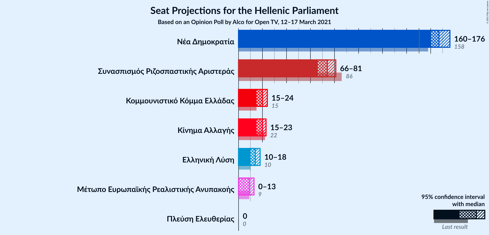

# Opinion Poll by Alco for Open TV, 12–17 March 2021

<a href="#voting-intentions">Voting Intentions</a> | <a href="#seats">Seats</a> | <a href="#coalitions">Coalitions</a> | <a href="#technical-information">Technical Information</a>

## Voting Intentions

### Confidence Intervals

| Party | Last Result | Poll Result | 80% Confidence Interval | 90% Confidence Interval | 95% Confidence Interval | 99% Confidence Interval |
|:-----:|:-----------:|:-----------:|:-----------------------:|:-----------------------:|:-----------------------:|:-----------------------:|
| Νέα Δημοκρατία | 39.8% | 42.8% | 40.8–44.8% |40.2–45.4% |39.8–45.9% |38.8–46.9% |
| Συνασπισμός Ριζοσπαστικής Αριστεράς | 31.5% | 26.7% | 25.0–28.6% |24.5–29.1% |24.1–29.5% |23.2–30.4% |
| Κίνημα Αλλαγής | 8.1% | 7.0% | 6.1–8.2% |5.8–8.5% |5.6–8.8% |5.2–9.3% |
| Κομμουνιστικό Κόμμα Ελλάδας | 5.3% | 6.9% | 6.0–8.0% |5.7–8.4% |5.5–8.7% |5.1–9.2% |
| Ελληνική Λύση | 3.7% | 4.9% | 4.1–5.9% |3.9–6.2% |3.7–6.4% |3.4–6.9% |
| Μέτωπο Ευρωπαϊκής Ρεαλιστικής Ανυπακοής | 3.4% | 3.3% | 2.7–4.1% |2.5–4.4% |2.4–4.6% |2.1–5.0% |
| Πλεύση Ελευθερίας | 1.5% | 1.7% | 1.3–2.4% |1.2–2.5% |1.1–2.7% |0.9–3.1% |

*Note:* The poll result column reflects the actual value used in the calculations. Published results may vary slightly, and in addition be rounded to fewer digits.

## Seats

### Confidence Intervals

| Party | Last Result | Median | 80% Confidence Interval | 90% Confidence Interval | 95% Confidence Interval | 99% Confidence Interval |
|:-----:|:-----------:|:------:|:-----------------------:|:-----------------------:|:-----------------------:|:-----------------------:|
| <a href="#νέα-δημοκρατία">Νέα Δημοκρατία</a> | 158 | 167 | 162–172 |161–174 |160–176 |157–180 |
| <a href="#συνασπισμός-ριζοσπαστικής-αριστεράς">Συνασπισμός Ριζοσπαστικής Αριστεράς</a> | 86 | 74 | 68–79 |67–80 |66–81 |65–84 |
| <a href="#κίνημα-αλλαγής">Κίνημα Αλλαγής</a> | 22 | 20 | 17–22 |16–23 |15–23 |14–26 |
| <a href="#κομμουνιστικό-κόμμα-ελλάδας">Κομμουνιστικό Κόμμα Ελλάδας</a> | 15 | 20 | 16–22 |15–23 |15–24 |14–25 |
| <a href="#ελληνική-λύση">Ελληνική Λύση</a> | 10 | 14 | 11–16 |11–17 |10–18 |9–19 |
| <a href="#μέτωπο-ευρωπαϊκής-ρεαλιστικής-ανυπακοής">Μέτωπο Ευρωπαϊκής Ρεαλιστικής Ανυπακοής</a> | 9 | 9 | 0–11 |0–12 |0–13 |0–13 |
| <a href="#πλεύση-ελευθερίας">Πλεύση Ελευθερίας</a> | 0 | 0 | 0 |0 |0 |0–8 |

### Νέα Δημοκρατία

*For a full overview of the results for this party, see the [Νέα Δημοκρατία](party-νέαδημοκρατία.html) page.*

| Number of Seats | Probability | Accumulated | Special Marks |
|:---------------:|:-----------:|:-----------:|:-------------:|
| 153 | 0% | 100% |  |
| 154 | 0.1% | 99.9% |  |
| 155 | 0.1% | 99.8% |  |
| 156 | 0.2% | 99.7% |  |
| 157 | 0.2% | 99.5% |  |
| 158 | 0.3% | 99.3% | Last Result |
| 159 | 1.2% | 99.0% |  |
| 160 | 1.2% | 98% |  |
| 161 | 5% | 97% |  |
| 162 | 2% | 92% |  |
| 163 | 5% | 89% |  |
| 164 | 14% | 85% |  |
| 165 | 10% | 71% |  |
| 166 | 7% | 61% |  |
| 167 | 6% | 54% | Median |
| 168 | 11% | 48% |  |
| 169 | 13% | 37% |  |
| 170 | 4% | 23% |  |
| 171 | 4% | 20% |  |
| 172 | 7% | 16% |  |
| 173 | 2% | 8% |  |
| 174 | 3% | 7% |  |
| 175 | 1.4% | 4% |  |
| 176 | 0.4% | 3% |  |
| 177 | 0.7% | 2% |  |
| 178 | 0.2% | 2% |  |
| 179 | 0.7% | 1.3% |  |
| 180 | 0.1% | 0.6% |  |
| 181 | 0.1% | 0.4% |  |
| 182 | 0.2% | 0.4% |  |
| 183 | 0.1% | 0.1% |  |
| 184 | 0% | 0% |  |

### Συνασπισμός Ριζοσπαστικής Αριστεράς

*For a full overview of the results for this party, see the [Συνασπισμός Ριζοσπαστικής Αριστεράς](party-συνασπισμόςριζοσπαστικήςαριστεράς.html) page.*

| Number of Seats | Probability | Accumulated | Special Marks |
|:---------------:|:-----------:|:-----------:|:-------------:|
| 61 | 0% | 100% |  |
| 62 | 0.1% | 99.9% |  |
| 63 | 0.2% | 99.8% |  |
| 64 | 0.2% | 99.7% |  |
| 65 | 1.0% | 99.5% |  |
| 66 | 1.4% | 98.5% |  |
| 67 | 3% | 97% |  |
| 68 | 4% | 94% |  |
| 69 | 4% | 90% |  |
| 70 | 3% | 85% |  |
| 71 | 10% | 82% |  |
| 72 | 10% | 72% |  |
| 73 | 6% | 61% |  |
| 74 | 11% | 55% | Median |
| 75 | 13% | 44% |  |
| 76 | 13% | 31% |  |
| 77 | 5% | 18% |  |
| 78 | 3% | 14% |  |
| 79 | 3% | 11% |  |
| 80 | 4% | 8% |  |
| 81 | 2% | 4% |  |
| 82 | 0.9% | 2% |  |
| 83 | 0.4% | 1.0% |  |
| 84 | 0.3% | 0.6% |  |
| 85 | 0.2% | 0.3% |  |
| 86 | 0% | 0.1% | Last Result |
| 87 | 0% | 0.1% |  |
| 88 | 0% | 0% |  |

### Κίνημα Αλλαγής

*For a full overview of the results for this party, see the [Κίνημα Αλλαγής](party-κίνημααλλαγής.html) page.*

| Number of Seats | Probability | Accumulated | Special Marks |
|:---------------:|:-----------:|:-----------:|:-------------:|
| 13 | 0.1% | 100% |  |
| 14 | 0.9% | 99.9% |  |
| 15 | 2% | 99.0% |  |
| 16 | 4% | 97% |  |
| 17 | 6% | 93% |  |
| 18 | 9% | 87% |  |
| 19 | 18% | 79% |  |
| 20 | 23% | 60% | Median |
| 21 | 22% | 37% |  |
| 22 | 9% | 16% | Last Result |
| 23 | 4% | 6% |  |
| 24 | 1.1% | 2% |  |
| 25 | 0.5% | 1.4% |  |
| 26 | 0.7% | 0.9% |  |
| 27 | 0.2% | 0.2% |  |
| 28 | 0% | 0% |  |

### Κομμουνιστικό Κόμμα Ελλάδας

*For a full overview of the results for this party, see the [Κομμουνιστικό Κόμμα Ελλάδας](party-κομμουνιστικόκόμμαελλάδας.html) page.*

| Number of Seats | Probability | Accumulated | Special Marks |
|:---------------:|:-----------:|:-----------:|:-------------:|
| 13 | 0.2% | 100% |  |
| 14 | 1.4% | 99.7% |  |
| 15 | 4% | 98% | Last Result |
| 16 | 5% | 95% |  |
| 17 | 15% | 90% |  |
| 18 | 12% | 75% |  |
| 19 | 12% | 63% |  |
| 20 | 23% | 51% | Median |
| 21 | 11% | 28% |  |
| 22 | 10% | 17% |  |
| 23 | 4% | 7% |  |
| 24 | 2% | 4% |  |
| 25 | 2% | 2% |  |
| 26 | 0.1% | 0.3% |  |
| 27 | 0.1% | 0.2% |  |
| 28 | 0% | 0% |  |

### Ελληνική Λύση

*For a full overview of the results for this party, see the [Ελληνική Λύση](party-ελληνικήλύση.html) page.*

| Number of Seats | Probability | Accumulated | Special Marks |
|:---------------:|:-----------:|:-----------:|:-------------:|
| 0 | 0.1% | 100% |  |
| 1 | 0% | 99.9% |  |
| 2 | 0% | 99.9% |  |
| 3 | 0% | 99.9% |  |
| 4 | 0% | 99.9% |  |
| 5 | 0% | 99.9% |  |
| 6 | 0% | 99.9% |  |
| 7 | 0% | 99.9% |  |
| 8 | 0.1% | 99.9% |  |
| 9 | 0.5% | 99.9% |  |
| 10 | 2% | 99.4% | Last Result |
| 11 | 18% | 97% |  |
| 12 | 11% | 79% |  |
| 13 | 16% | 68% |  |
| 14 | 18% | 52% | Median |
| 15 | 22% | 34% |  |
| 16 | 5% | 11% |  |
| 17 | 4% | 7% |  |
| 18 | 2% | 3% |  |
| 19 | 0.5% | 0.9% |  |
| 20 | 0.3% | 0.4% |  |
| 21 | 0% | 0.1% |  |
| 22 | 0% | 0% |  |

### Μέτωπο Ευρωπαϊκής Ρεαλιστικής Ανυπακοής

*For a full overview of the results for this party, see the [Μέτωπο Ευρωπαϊκής Ρεαλιστικής Ανυπακοής](party-μέτωποευρωπαϊκήςρεαλιστικήςανυπακοής.html) page.*

| Number of Seats | Probability | Accumulated | Special Marks |
|:---------------:|:-----------:|:-----------:|:-------------:|
| 0 | 35% | 100% |  |
| 1 | 0% | 65% |  |
| 2 | 0% | 65% |  |
| 3 | 0% | 65% |  |
| 4 | 0% | 65% |  |
| 5 | 0% | 65% |  |
| 6 | 0% | 65% |  |
| 7 | 0% | 65% |  |
| 8 | 6% | 65% |  |
| 9 | 13% | 60% | Last Result, Median |
| 10 | 30% | 47% |  |
| 11 | 10% | 16% |  |
| 12 | 3% | 6% |  |
| 13 | 3% | 3% |  |
| 14 | 0.2% | 0.3% |  |
| 15 | 0.2% | 0.2% |  |
| 16 | 0% | 0% |  |

### Πλεύση Ελευθερίας

*For a full overview of the results for this party, see the [Πλεύση Ελευθερίας](party-πλεύσηελευθερίας.html) page.*

| Number of Seats | Probability | Accumulated | Special Marks |
|:---------------:|:-----------:|:-----------:|:-------------:|
| 0 | 99.5% | 100% | Last Result, Median |
| 1 | 0% | 0.5% |  |
| 2 | 0% | 0.5% |  |
| 3 | 0% | 0.5% |  |
| 4 | 0% | 0.5% |  |
| 5 | 0% | 0.5% |  |
| 6 | 0% | 0.5% |  |
| 7 | 0% | 0.5% |  |
| 8 | 0.3% | 0.5% |  |
| 9 | 0.2% | 0.2% |  |
| 10 | 0% | 0% |  |

## Coalitions

### Confidence Intervals

| Coalition | Last Result | Median | Majority? | 80% Confidence Interval | 90% Confidence Interval | 95% Confidence Interval | 99% Confidence Interval |
|:---------:|:-----------:|:------:|:---------:|:-----------------------:|:-----------------------:|:-----------------------:|:-----------------------:|
| Νέα Δημοκρατία – Κίνημα Αλλαγής | 180 | 187 | 100% | 182–192 | 180–194 | 178–196 | 176–200 |
| Νέα Δημοκρατία | 158 | 167 | 100% | 162–172 | 161–174 | 160–176 | 157–180 |
| Συνασπισμός Ριζοσπαστικής Αριστεράς – Μέτωπο Ευρωπαϊκής Ρεαλιστικής Ανυπακοής | 95 | 81 | 0% | 75–86 | 73–87 | 72–89 | 68–91 |
| Συνασπισμός Ριζοσπαστικής Αριστεράς | 86 | 74 | 0% | 68–79 | 67–80 | 66–81 | 65–84 |

### Νέα Δημοκρατία – Κίνημα Αλλαγής

| Number of Seats | Probability | Accumulated | Special Marks |
|:---------------:|:-----------:|:-----------:|:-------------:|
| 172 | 0.1% | 100% |  |
| 173 | 0% | 99.9% |  |
| 174 | 0.2% | 99.9% |  |
| 175 | 0.2% | 99.7% |  |
| 176 | 0.4% | 99.5% |  |
| 177 | 0.7% | 99.1% |  |
| 178 | 1.3% | 98% |  |
| 179 | 1.2% | 97% |  |
| 180 | 2% | 96% | Last Result |
| 181 | 3% | 94% |  |
| 182 | 7% | 91% |  |
| 183 | 5% | 84% |  |
| 184 | 11% | 79% |  |
| 185 | 5% | 68% |  |
| 186 | 6% | 63% |  |
| 187 | 13% | 57% | Median |
| 188 | 9% | 45% |  |
| 189 | 7% | 35% |  |
| 190 | 11% | 29% |  |
| 191 | 6% | 18% |  |
| 192 | 4% | 12% |  |
| 193 | 3% | 9% |  |
| 194 | 2% | 6% |  |
| 195 | 1.3% | 4% |  |
| 196 | 0.4% | 3% |  |
| 197 | 0.3% | 2% |  |
| 198 | 0.6% | 2% |  |
| 199 | 0.7% | 1.3% |  |
| 200 | 0.1% | 0.5% |  |
| 201 | 0.3% | 0.4% |  |
| 202 | 0% | 0.1% |  |
| 203 | 0.1% | 0.1% |  |
| 204 | 0% | 0% |  |

### Νέα Δημοκρατία

| Number of Seats | Probability | Accumulated | Special Marks |
|:---------------:|:-----------:|:-----------:|:-------------:|
| 153 | 0% | 100% |  |
| 154 | 0.1% | 99.9% |  |
| 155 | 0.1% | 99.8% |  |
| 156 | 0.2% | 99.7% |  |
| 157 | 0.2% | 99.5% |  |
| 158 | 0.3% | 99.3% | Last Result |
| 159 | 1.2% | 99.0% |  |
| 160 | 1.2% | 98% |  |
| 161 | 5% | 97% |  |
| 162 | 2% | 92% |  |
| 163 | 5% | 89% |  |
| 164 | 14% | 85% |  |
| 165 | 10% | 71% |  |
| 166 | 7% | 61% |  |
| 167 | 6% | 54% | Median |
| 168 | 11% | 48% |  |
| 169 | 13% | 37% |  |
| 170 | 4% | 23% |  |
| 171 | 4% | 20% |  |
| 172 | 7% | 16% |  |
| 173 | 2% | 8% |  |
| 174 | 3% | 7% |  |
| 175 | 1.4% | 4% |  |
| 176 | 0.4% | 3% |  |
| 177 | 0.7% | 2% |  |
| 178 | 0.2% | 2% |  |
| 179 | 0.7% | 1.3% |  |
| 180 | 0.1% | 0.6% |  |
| 181 | 0.1% | 0.4% |  |
| 182 | 0.2% | 0.4% |  |
| 183 | 0.1% | 0.1% |  |
| 184 | 0% | 0% |  |

### Συνασπισμός Ριζοσπαστικής Αριστεράς – Μέτωπο Ευρωπαϊκής Ρεαλιστικής Ανυπακοής

| Number of Seats | Probability | Accumulated | Special Marks |
|:---------------:|:-----------:|:-----------:|:-------------:|
| 65 | 0.1% | 100% |  |
| 66 | 0.1% | 99.8% |  |
| 67 | 0.1% | 99.7% |  |
| 68 | 0.3% | 99.6% |  |
| 69 | 0.8% | 99.3% |  |
| 70 | 0.2% | 98.5% |  |
| 71 | 0.5% | 98% |  |
| 72 | 1.4% | 98% |  |
| 73 | 3% | 96% |  |
| 74 | 2% | 93% |  |
| 75 | 8% | 92% |  |
| 76 | 10% | 84% |  |
| 77 | 5% | 74% |  |
| 78 | 5% | 68% |  |
| 79 | 4% | 64% |  |
| 80 | 7% | 59% |  |
| 81 | 11% | 52% |  |
| 82 | 8% | 41% |  |
| 83 | 3% | 32% | Median |
| 84 | 11% | 29% |  |
| 85 | 7% | 18% |  |
| 86 | 3% | 11% |  |
| 87 | 3% | 7% |  |
| 88 | 2% | 5% |  |
| 89 | 1.1% | 3% |  |
| 90 | 0.4% | 1.5% |  |
| 91 | 0.7% | 1.1% |  |
| 92 | 0.2% | 0.4% |  |
| 93 | 0.1% | 0.2% |  |
| 94 | 0% | 0.1% |  |
| 95 | 0.1% | 0.1% | Last Result |
| 96 | 0% | 0% |  |

### Συνασπισμός Ριζοσπαστικής Αριστεράς

| Number of Seats | Probability | Accumulated | Special Marks |
|:---------------:|:-----------:|:-----------:|:-------------:|
| 61 | 0% | 100% |  |
| 62 | 0.1% | 99.9% |  |
| 63 | 0.2% | 99.8% |  |
| 64 | 0.2% | 99.7% |  |
| 65 | 1.0% | 99.5% |  |
| 66 | 1.4% | 98.5% |  |
| 67 | 3% | 97% |  |
| 68 | 4% | 94% |  |
| 69 | 4% | 90% |  |
| 70 | 3% | 85% |  |
| 71 | 10% | 82% |  |
| 72 | 10% | 72% |  |
| 73 | 6% | 61% |  |
| 74 | 11% | 55% | Median |
| 75 | 13% | 44% |  |
| 76 | 13% | 31% |  |
| 77 | 5% | 18% |  |
| 78 | 3% | 14% |  |
| 79 | 3% | 11% |  |
| 80 | 4% | 8% |  |
| 81 | 2% | 4% |  |
| 82 | 0.9% | 2% |  |
| 83 | 0.4% | 1.0% |  |
| 84 | 0.3% | 0.6% |  |
| 85 | 0.2% | 0.3% |  |
| 86 | 0% | 0.1% | Last Result |
| 87 | 0% | 0.1% |  |
| 88 | 0% | 0% |  |

## Technical Information

### Opinion Poll

+ **Polling firm:** Alco
+ **Commissioner(s):** Open TV
+ **Fieldwork period:** 12–17 March 2021

### Calculations

+ **Sample size:** 1000
+ **Simulations done:** 131,072
+ **Error estimate:** 1.30%

