# Opinion Poll by Metron Analysis for Mega TV, 16–22 March 2021

<a href="#voting-intentions">Voting Intentions</a> | <a href="#seats">Seats</a> | <a href="#coalitions">Coalitions</a> | <a href="#technical-information">Technical Information</a>

## Voting Intentions

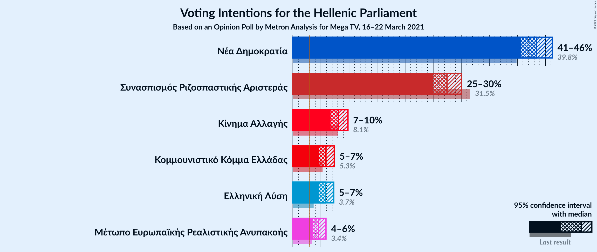

### Confidence Intervals

| Party | Last Result | Poll Result | 80% Confidence Interval | 90% Confidence Interval | 95% Confidence Interval | 99% Confidence Interval |
|:-----:|:-----------:|:-----------:|:-----------------------:|:-----------------------:|:-----------------------:|:-----------------------:|
| Νέα Δημοκρατία | 39.8% | 43.4% | 41.6–45.3% |41.1–45.8% |40.6–46.2% |39.8–47.1% |
| Συνασπισμός Ριζοσπαστικής Αριστεράς | 31.5% | 27.5% | 25.9–29.2% |25.4–29.6% |25.0–30.1% |24.3–30.9% |
| Κίνημα Αλλαγής | 8.1% | 8.1% | 7.2–9.2% |6.9–9.5% |6.7–9.8% |6.3–10.4% |
| Κομμουνιστικό Κόμμα Ελλάδας | 5.3% | 5.9% | 5.1–6.9% |4.9–7.1% |4.7–7.4% |4.3–7.9% |
| Ελληνική Λύση | 3.7% | 5.8% | 5.0–6.8% |4.8–7.0% |4.6–7.3% |4.3–7.8% |
| Μέτωπο Ευρωπαϊκής Ρεαλιστικής Ανυπακοής | 3.4% | 4.6% | 3.9–5.4% |3.7–5.7% |3.5–5.9% |3.2–6.3% |

*Note:* The poll result column reflects the actual value used in the calculations. Published results may vary slightly, and in addition be rounded to fewer digits.

## Seats

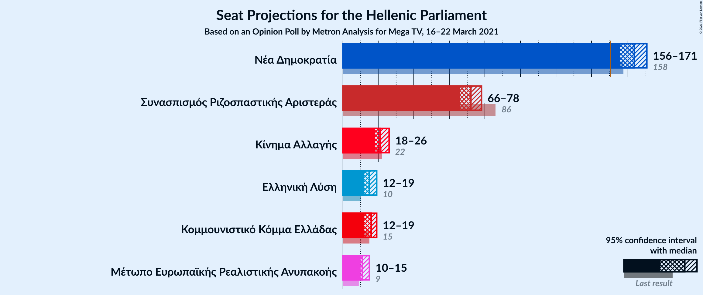

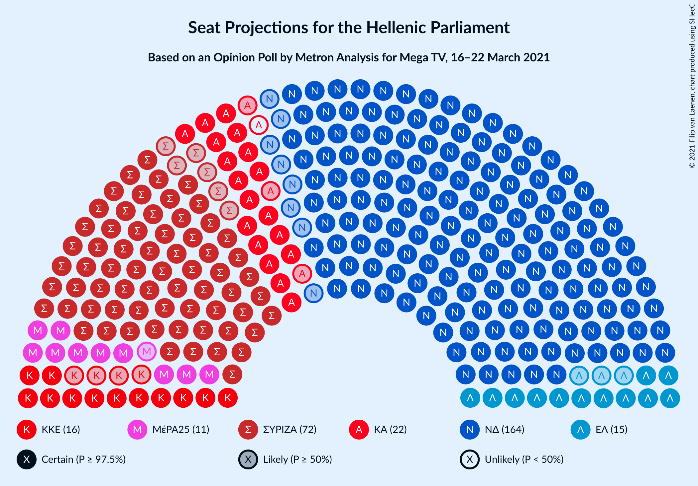

### Confidence Intervals

| Party | Last Result | Median | 80% Confidence Interval | 90% Confidence Interval | 95% Confidence Interval | 99% Confidence Interval |
|:-----:|:-----------:|:------:|:-----------------------:|:-----------------------:|:-----------------------:|:-----------------------:|
| <a href="#νέα-δημοκρατία">Νέα Δημοκρατία</a> | 158 | 164 | 159–168 |158–170 |156–171 |154–173 |
| <a href="#συνασπισμός-ριζοσπαστικής-αριστεράς">Συνασπισμός Ριζοσπαστικής Αριστεράς</a> | 86 | 72 | 68–76 |66–78 |66–78 |64–80 |
| <a href="#κίνημα-αλλαγής">Κίνημα Αλλαγής</a> | 22 | 21 | 19–24 |18–25 |18–26 |16–27 |
| <a href="#κομμουνιστικό-κόμμα-ελλάδας">Κομμουνιστικό Κόμμα Ελλάδας</a> | 15 | 16 | 14–18 |13–19 |12–19 |11–21 |
| <a href="#ελληνική-λύση">Ελληνική Λύση</a> | 10 | 15 | 13–18 |13–18 |12–19 |11–20 |
| <a href="#μέτωπο-ευρωπαϊκής-ρεαλιστικής-ανυπακοής">Μέτωπο Ευρωπαϊκής Ρεαλιστικής Ανυπακοής</a> | 9 | 11 | 10–14 |10–15 |10–15 |9–16 |

### Νέα Δημοκρατία

*For a full overview of the results for this party, see the [Νέα Δημοκρατία](party-νέαδημοκρατία.html) page.*

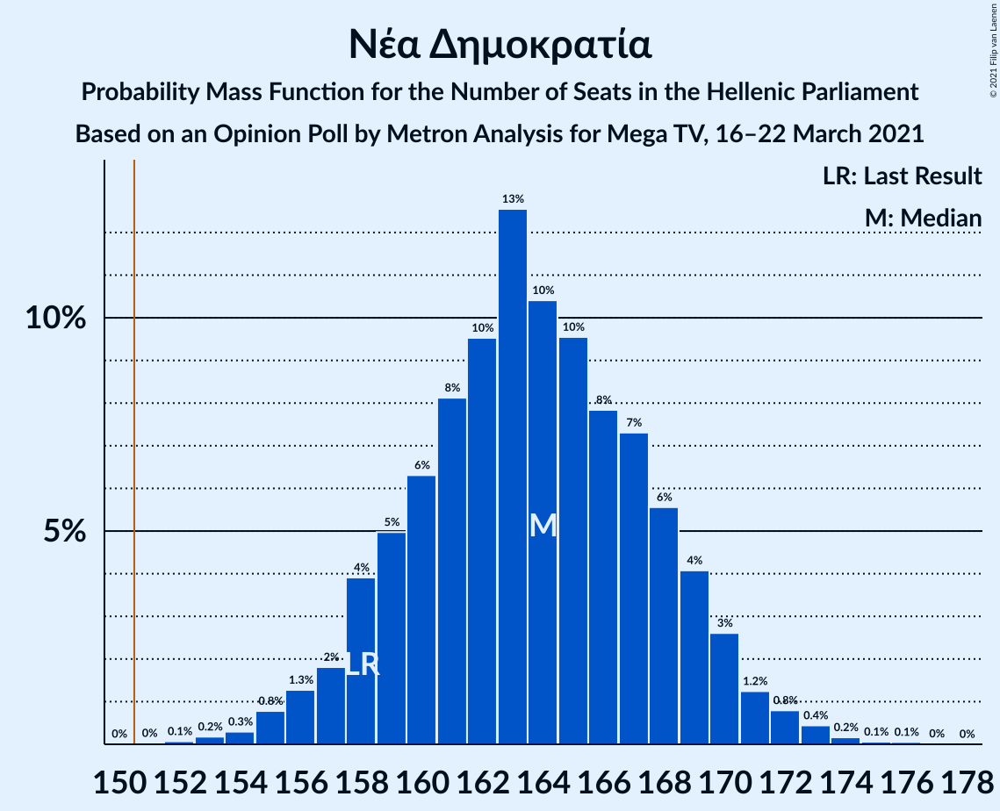

| Number of Seats | Probability | Accumulated | Special Marks |
|:---------------:|:-----------:|:-----------:|:-------------:|
| 152 | 0.1% | 100% |  |
| 153 | 0.2% | 99.9% |  |
| 154 | 0.3% | 99.7% |  |
| 155 | 0.8% | 99.4% |  |
| 156 | 1.3% | 98.6% |  |
| 157 | 2% | 97% |  |
| 158 | 4% | 96% | Last Result |
| 159 | 5% | 92% |  |
| 160 | 6% | 87% |  |
| 161 | 8% | 80% |  |
| 162 | 10% | 72% |  |
| 163 | 13% | 63% |  |
| 164 | 10% | 50% | Median |
| 165 | 10% | 40% |  |
| 166 | 8% | 30% |  |
| 167 | 7% | 22% |  |
| 168 | 6% | 15% |  |
| 169 | 4% | 9% |  |
| 170 | 3% | 5% |  |
| 171 | 1.2% | 3% |  |
| 172 | 0.8% | 2% |  |
| 173 | 0.4% | 0.7% |  |
| 174 | 0.2% | 0.3% |  |
| 175 | 0.1% | 0.1% |  |
| 176 | 0.1% | 0.1% |  |
| 177 | 0% | 0% |  |

### Συνασπισμός Ριζοσπαστικής Αριστεράς

*For a full overview of the results for this party, see the [Συνασπισμός Ριζοσπαστικής Αριστεράς](party-συνασπισμόςριζοσπαστικήςαριστεράς.html) page.*

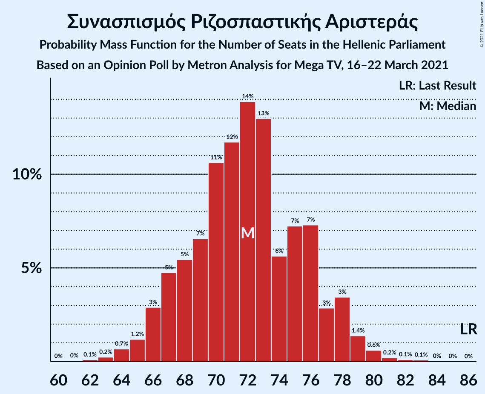

| Number of Seats | Probability | Accumulated | Special Marks |
|:---------------:|:-----------:|:-----------:|:-------------:|
| 61 | 0% | 100% |  |
| 62 | 0.1% | 99.9% |  |
| 63 | 0.2% | 99.8% |  |
| 64 | 0.7% | 99.6% |  |
| 65 | 1.2% | 98.9% |  |
| 66 | 3% | 98% |  |
| 67 | 5% | 95% |  |
| 68 | 5% | 90% |  |
| 69 | 7% | 85% |  |
| 70 | 11% | 78% |  |
| 71 | 12% | 67% |  |
| 72 | 14% | 56% | Median |
| 73 | 13% | 42% |  |
| 74 | 6% | 29% |  |
| 75 | 7% | 23% |  |
| 76 | 7% | 16% |  |
| 77 | 3% | 9% |  |
| 78 | 3% | 6% |  |
| 79 | 1.4% | 2% |  |
| 80 | 0.6% | 1.0% |  |
| 81 | 0.2% | 0.4% |  |
| 82 | 0.1% | 0.2% |  |
| 83 | 0.1% | 0.1% |  |
| 84 | 0% | 0% |  |
| 85 | 0% | 0% |  |
| 86 | 0% | 0% | Last Result |

### Κίνημα Αλλαγής

*For a full overview of the results for this party, see the [Κίνημα Αλλαγής](party-κίνημααλλαγής.html) page.*

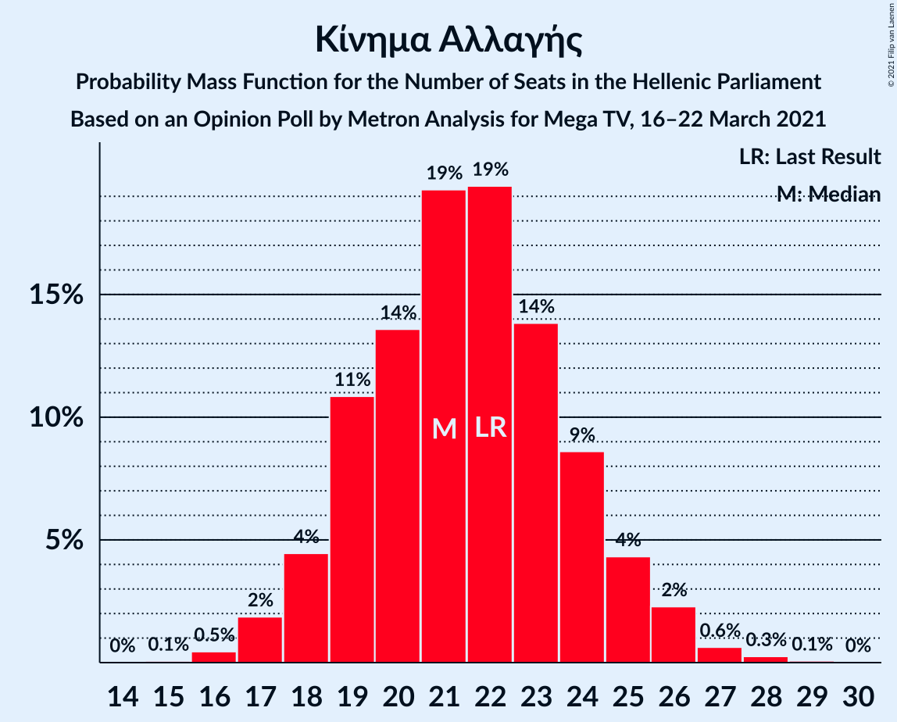

| Number of Seats | Probability | Accumulated | Special Marks |
|:---------------:|:-----------:|:-----------:|:-------------:|
| 15 | 0.1% | 100% |  |
| 16 | 0.5% | 99.9% |  |
| 17 | 2% | 99.5% |  |
| 18 | 4% | 98% |  |
| 19 | 11% | 93% |  |
| 20 | 14% | 82% |  |
| 21 | 19% | 69% | Median |
| 22 | 19% | 49% | Last Result |
| 23 | 14% | 30% |  |
| 24 | 9% | 16% |  |
| 25 | 4% | 8% |  |
| 26 | 2% | 3% |  |
| 27 | 0.6% | 1.0% |  |
| 28 | 0.3% | 0.3% |  |
| 29 | 0.1% | 0.1% |  |
| 30 | 0% | 0% |  |

### Κομμουνιστικό Κόμμα Ελλάδας

*For a full overview of the results for this party, see the [Κομμουνιστικό Κόμμα Ελλάδας](party-κομμουνιστικόκόμμαελλάδας.html) page.*

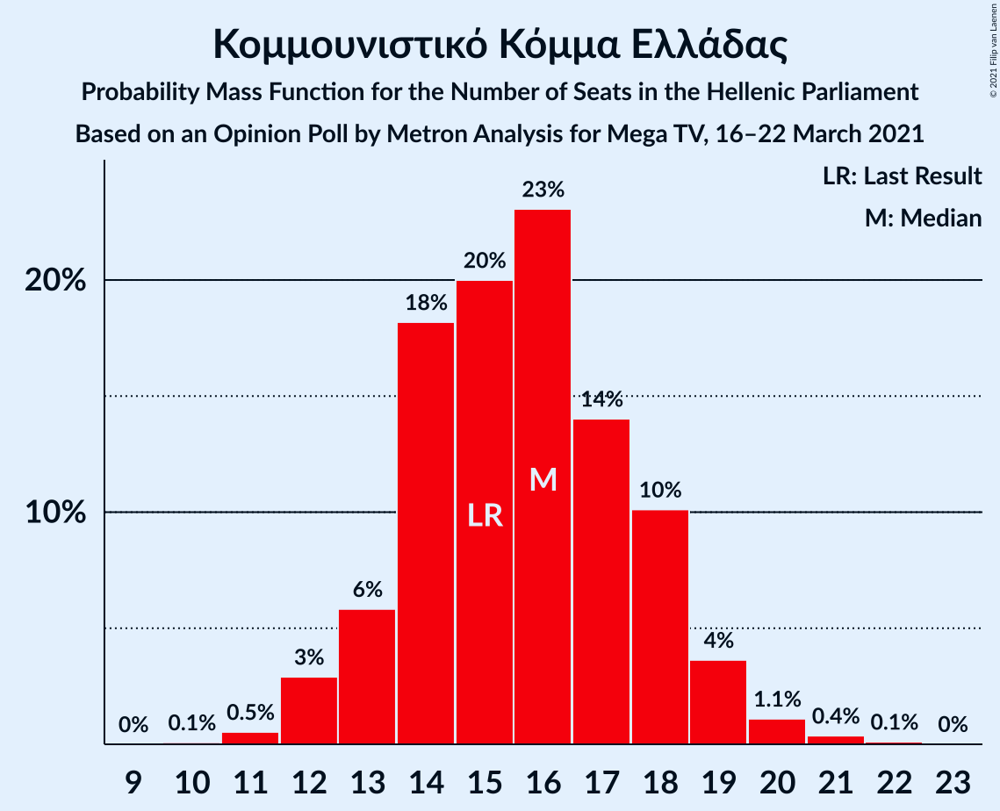

| Number of Seats | Probability | Accumulated | Special Marks |
|:---------------:|:-----------:|:-----------:|:-------------:|
| 10 | 0.1% | 100% |  |
| 11 | 0.5% | 99.9% |  |
| 12 | 3% | 99.4% |  |
| 13 | 6% | 96% |  |
| 14 | 18% | 91% |  |
| 15 | 20% | 72% | Last Result |
| 16 | 23% | 52% | Median |
| 17 | 14% | 29% |  |
| 18 | 10% | 15% |  |
| 19 | 4% | 5% |  |
| 20 | 1.1% | 2% |  |
| 21 | 0.4% | 0.5% |  |
| 22 | 0.1% | 0.1% |  |
| 23 | 0% | 0% |  |

### Ελληνική Λύση

*For a full overview of the results for this party, see the [Ελληνική Λύση](party-ελληνικήλύση.html) page.*

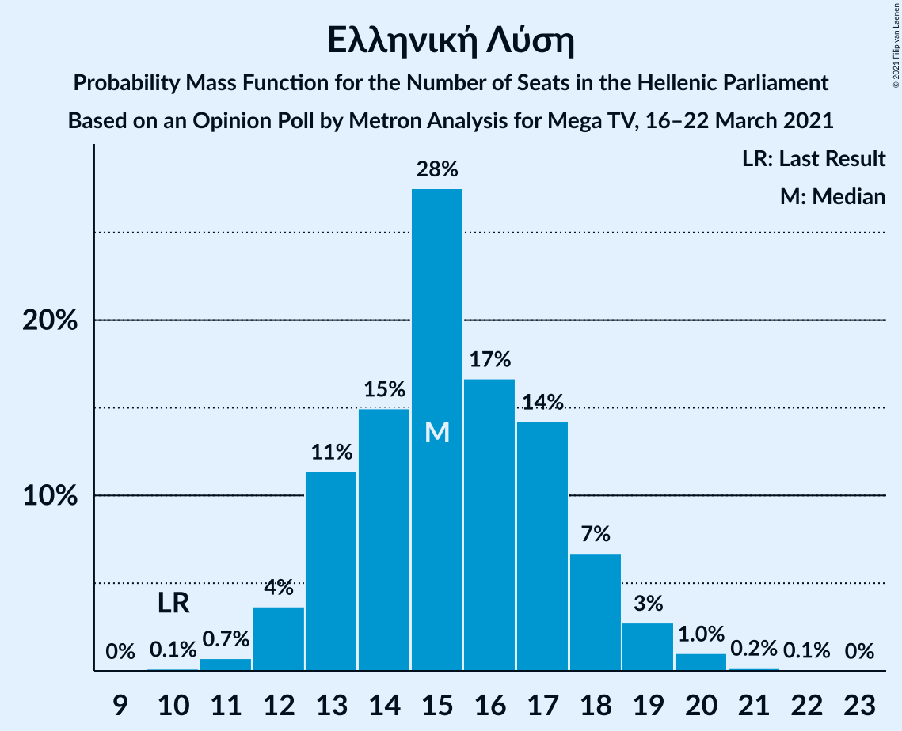

| Number of Seats | Probability | Accumulated | Special Marks |
|:---------------:|:-----------:|:-----------:|:-------------:|
| 10 | 0.1% | 100% | Last Result |
| 11 | 0.7% | 99.9% |  |
| 12 | 4% | 99.2% |  |
| 13 | 11% | 95% |  |
| 14 | 15% | 84% |  |
| 15 | 28% | 69% | Median |
| 16 | 17% | 42% |  |
| 17 | 14% | 25% |  |
| 18 | 7% | 11% |  |
| 19 | 3% | 4% |  |
| 20 | 1.0% | 1.3% |  |
| 21 | 0.2% | 0.3% |  |
| 22 | 0.1% | 0.1% |  |
| 23 | 0% | 0% |  |

### Μέτωπο Ευρωπαϊκής Ρεαλιστικής Ανυπακοής

*For a full overview of the results for this party, see the [Μέτωπο Ευρωπαϊκής Ρεαλιστικής Ανυπακοής](party-μέτωποευρωπαϊκήςρεαλιστικήςανυπακοής.html) page.*

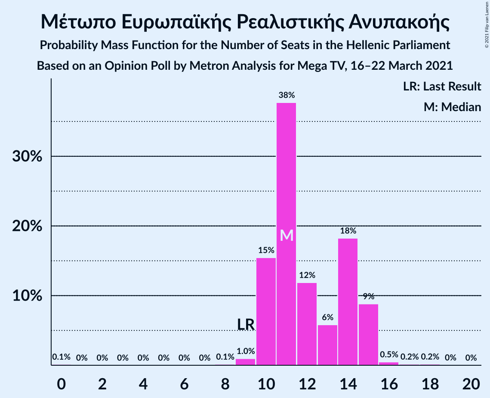

| Number of Seats | Probability | Accumulated | Special Marks |
|:---------------:|:-----------:|:-----------:|:-------------:|
| 0 | 0.1% | 100% |  |
| 1 | 0% | 99.9% |  |
| 2 | 0% | 99.9% |  |
| 3 | 0% | 99.9% |  |
| 4 | 0% | 99.9% |  |
| 5 | 0% | 99.9% |  |
| 6 | 0% | 99.9% |  |
| 7 | 0% | 99.9% |  |
| 8 | 0.1% | 99.9% |  |
| 9 | 1.0% | 99.7% | Last Result |
| 10 | 15% | 98.7% |  |
| 11 | 38% | 83% | Median |
| 12 | 12% | 46% |  |
| 13 | 6% | 34% |  |
| 14 | 18% | 28% |  |
| 15 | 9% | 10% |  |
| 16 | 0.5% | 0.8% |  |
| 17 | 0.2% | 0.4% |  |
| 18 | 0.2% | 0.2% |  |
| 19 | 0% | 0% |  |

## Coalitions

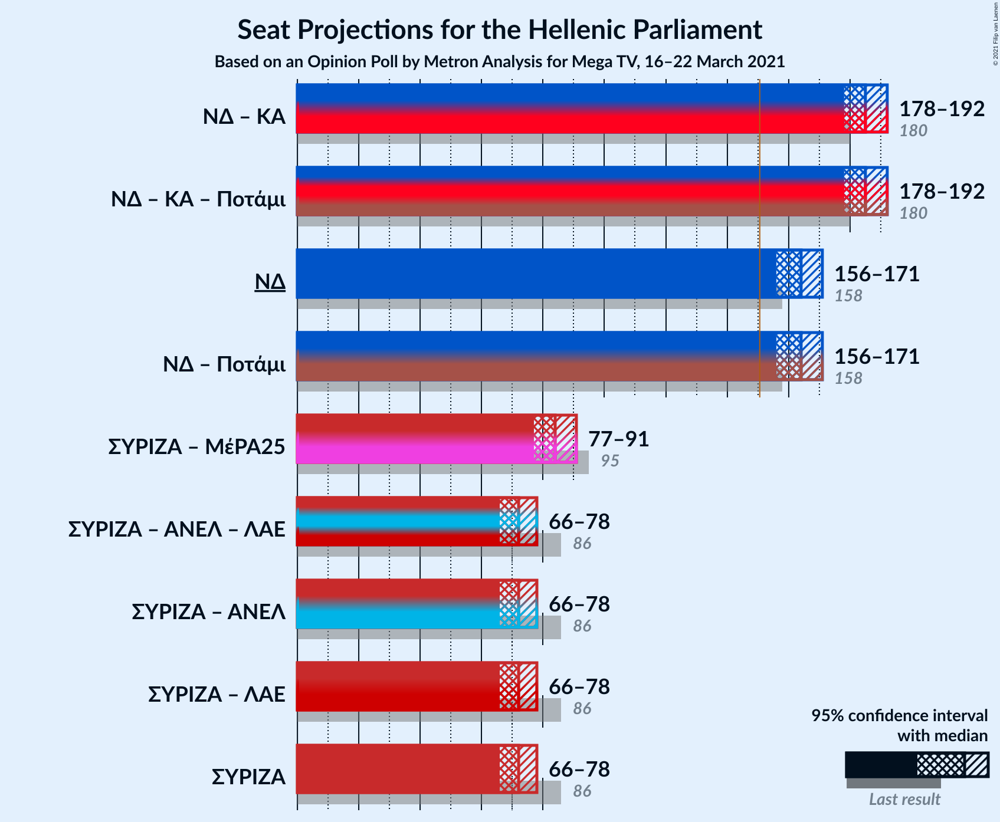

### Confidence Intervals

| Coalition | Last Result | Median | Majority? | 80% Confidence Interval | 90% Confidence Interval | 95% Confidence Interval | 99% Confidence Interval |
|:---------:|:-----------:|:------:|:---------:|:-----------------------:|:-----------------------:|:-----------------------:|:-----------------------:|
| Νέα Δημοκρατία – Κίνημα Αλλαγής | 180 | 185 | 100% | 180–190 | 179–191 | 178–192 | 176–194 |
| Νέα Δημοκρατία | 158 | 164 | 100% | 159–168 | 158–170 | 156–171 | 154–173 |
| Συνασπισμός Ριζοσπαστικής Αριστεράς – Μέτωπο Ευρωπαϊκής Ρεαλιστικής Ανυπακοής | 95 | 84 | 0% | 79–89 | 78–90 | 77–91 | 75–93 |
| Συνασπισμός Ριζοσπαστικής Αριστεράς | 86 | 72 | 0% | 68–76 | 66–78 | 66–78 | 64–80 |

### Νέα Δημοκρατία – Κίνημα Αλλαγής

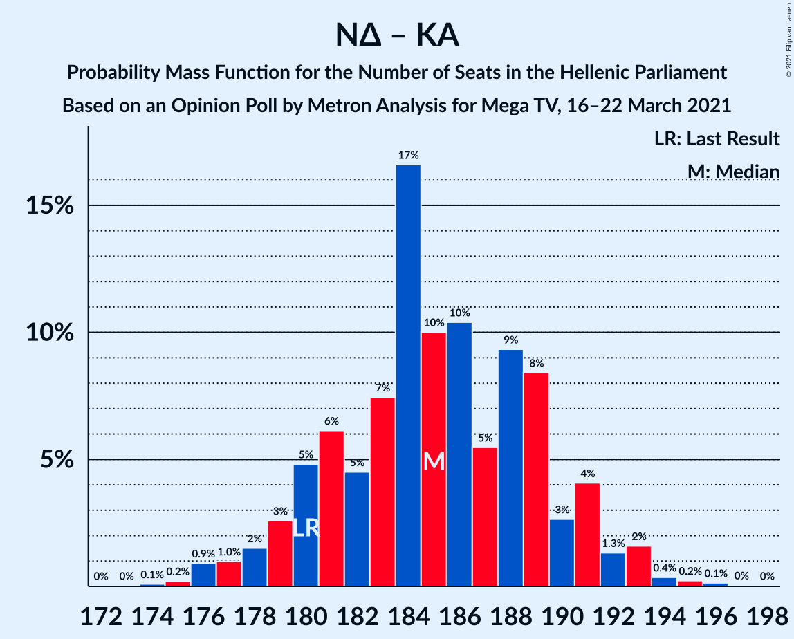

| Number of Seats | Probability | Accumulated | Special Marks |
|:---------------:|:-----------:|:-----------:|:-------------:|
| 173 | 0% | 100% |  |
| 174 | 0.1% | 99.9% |  |
| 175 | 0.2% | 99.8% |  |
| 176 | 0.9% | 99.6% |  |
| 177 | 1.0% | 98.7% |  |
| 178 | 2% | 98% |  |
| 179 | 3% | 96% |  |
| 180 | 5% | 94% | Last Result |
| 181 | 6% | 89% |  |
| 182 | 5% | 83% |  |
| 183 | 7% | 78% |  |
| 184 | 17% | 71% |  |
| 185 | 10% | 54% | Median |
| 186 | 10% | 44% |  |
| 187 | 5% | 34% |  |
| 188 | 9% | 28% |  |
| 189 | 8% | 19% |  |
| 190 | 3% | 10% |  |
| 191 | 4% | 8% |  |
| 192 | 1.3% | 4% |  |
| 193 | 2% | 2% |  |
| 194 | 0.4% | 0.8% |  |
| 195 | 0.2% | 0.5% |  |
| 196 | 0.1% | 0.2% |  |
| 197 | 0% | 0.1% |  |
| 198 | 0% | 0% |  |

### Νέα Δημοκρατία

| Number of Seats | Probability | Accumulated | Special Marks |
|:---------------:|:-----------:|:-----------:|:-------------:|
| 152 | 0.1% | 100% |  |
| 153 | 0.2% | 99.9% |  |
| 154 | 0.3% | 99.7% |  |
| 155 | 0.8% | 99.4% |  |
| 156 | 1.3% | 98.6% |  |
| 157 | 2% | 97% |  |
| 158 | 4% | 96% | Last Result |
| 159 | 5% | 92% |  |
| 160 | 6% | 87% |  |
| 161 | 8% | 80% |  |
| 162 | 10% | 72% |  |
| 163 | 13% | 63% |  |
| 164 | 10% | 50% | Median |
| 165 | 10% | 40% |  |
| 166 | 8% | 30% |  |
| 167 | 7% | 22% |  |
| 168 | 6% | 15% |  |
| 169 | 4% | 9% |  |
| 170 | 3% | 5% |  |
| 171 | 1.2% | 3% |  |
| 172 | 0.8% | 2% |  |
| 173 | 0.4% | 0.7% |  |
| 174 | 0.2% | 0.3% |  |
| 175 | 0.1% | 0.1% |  |
| 176 | 0.1% | 0.1% |  |
| 177 | 0% | 0% |  |

### Συνασπισμός Ριζοσπαστικής Αριστεράς – Μέτωπο Ευρωπαϊκής Ρεαλιστικής Ανυπακοής

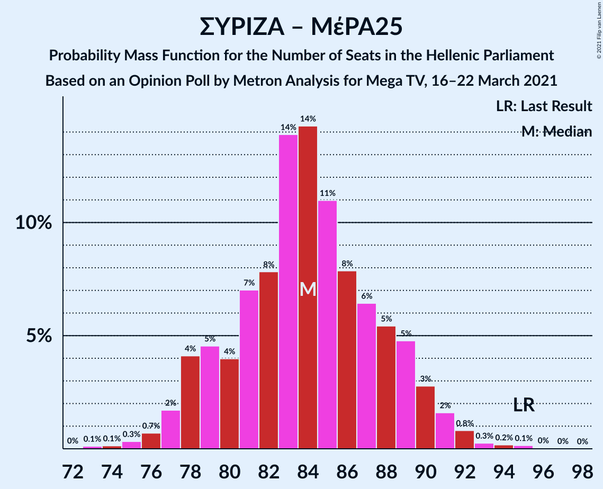

| Number of Seats | Probability | Accumulated | Special Marks |
|:---------------:|:-----------:|:-----------:|:-------------:|
| 72 | 0% | 100% |  |
| 73 | 0.1% | 99.9% |  |
| 74 | 0.1% | 99.8% |  |
| 75 | 0.3% | 99.7% |  |
| 76 | 0.7% | 99.4% |  |
| 77 | 2% | 98.7% |  |
| 78 | 4% | 97% |  |
| 79 | 5% | 93% |  |
| 80 | 4% | 88% |  |
| 81 | 7% | 84% |  |
| 82 | 8% | 77% |  |
| 83 | 14% | 69% | Median |
| 84 | 14% | 56% |  |
| 85 | 11% | 41% |  |
| 86 | 8% | 30% |  |
| 87 | 6% | 22% |  |
| 88 | 5% | 16% |  |
| 89 | 5% | 11% |  |
| 90 | 3% | 6% |  |
| 91 | 2% | 3% |  |
| 92 | 0.8% | 1.5% |  |
| 93 | 0.3% | 0.6% |  |
| 94 | 0.2% | 0.4% |  |
| 95 | 0.1% | 0.2% | Last Result |
| 96 | 0% | 0.1% |  |
| 97 | 0% | 0% |  |

### Συνασπισμός Ριζοσπαστικής Αριστεράς

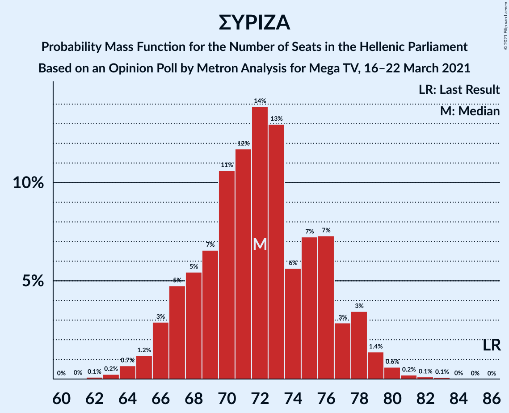

| Number of Seats | Probability | Accumulated | Special Marks |
|:---------------:|:-----------:|:-----------:|:-------------:|
| 61 | 0% | 100% |  |
| 62 | 0.1% | 99.9% |  |
| 63 | 0.2% | 99.8% |  |
| 64 | 0.7% | 99.6% |  |
| 65 | 1.2% | 98.9% |  |
| 66 | 3% | 98% |  |
| 67 | 5% | 95% |  |
| 68 | 5% | 90% |  |
| 69 | 7% | 85% |  |
| 70 | 11% | 78% |  |
| 71 | 12% | 67% |  |
| 72 | 14% | 56% | Median |
| 73 | 13% | 42% |  |
| 74 | 6% | 29% |  |
| 75 | 7% | 23% |  |
| 76 | 7% | 16% |  |
| 77 | 3% | 9% |  |
| 78 | 3% | 6% |  |
| 79 | 1.4% | 2% |  |
| 80 | 0.6% | 1.0% |  |
| 81 | 0.2% | 0.4% |  |
| 82 | 0.1% | 0.2% |  |
| 83 | 0.1% | 0.1% |  |
| 84 | 0% | 0% |  |
| 85 | 0% | 0% |  |
| 86 | 0% | 0% | Last Result |

## Technical Information

### Opinion Poll

+ **Polling firm:** Metron Analysis
+ **Commissioner(s):** Mega TV
+ **Fieldwork period:** 16–22 March 2021

### Calculations

+ **Sample size:** 1205
+ **Simulations done:** 131,072
+ **Error estimate:** 1.20%

