# Opinion Poll by Metron Analysis for Mega, 17–23 March 2021

<a href="#voting-intentions">Voting Intentions</a> | <a href="#seats">Seats</a> | <a href="#coalitions">Coalitions</a> | <a href="#technical-information">Technical Information</a>

## Voting Intentions

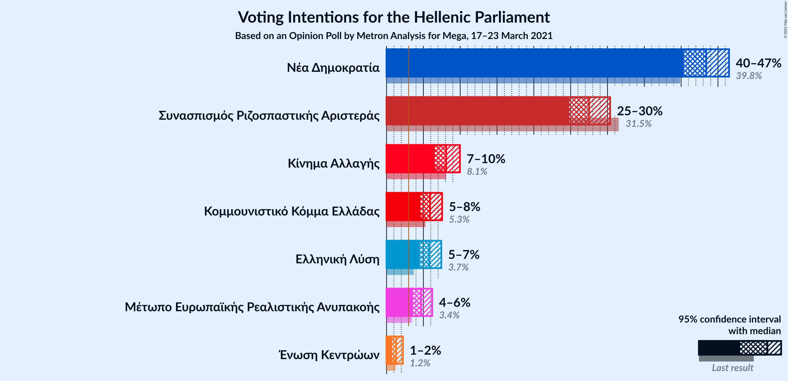

### Confidence Intervals

| Party | Last Result | Poll Result | 80% Confidence Interval | 90% Confidence Interval | 95% Confidence Interval | 99% Confidence Interval |
|:-----:|:-----------:|:-----------:|:-----------------------:|:-----------------------:|:-----------------------:|:-----------------------:|
| Νέα Δημοκρατία | 39.8% | 43.4% | 41.4–45.4% |40.8–46.0% |40.3–46.5% |39.4–47.5% |
| Συνασπισμός Ριζοσπαστικής Αριστεράς | 31.5% | 27.5% | 25.7–29.4% |25.2–29.9% |24.8–30.4% |24.0–31.3% |
| Κίνημα Αλλαγής | 8.1% | 8.1% | 7.1–9.3% |6.8–9.7% |6.6–10.0% |6.1–10.6% |
| Κομμουνιστικό Κόμμα Ελλάδας | 5.3% | 5.9% | 5.0–7.0% |4.8–7.3% |4.6–7.5% |4.2–8.1% |
| Ελληνική Λύση | 3.7% | 5.8% | 5.0–6.9% |4.7–7.2% |4.5–7.4% |4.1–8.0% |
| Μέτωπο Ευρωπαϊκής Ρεαλιστικής Ανυπακοής | 3.4% | 4.7% | 3.9–5.7% |3.7–6.0% |3.6–6.2% |3.2–6.7% |
| Ένωση Κεντρώων | 1.2% | 1.3% | 0.9–1.9% |0.8–2.1% |0.8–2.2% |0.6–2.5% |

*Note:* The poll result column reflects the actual value used in the calculations. Published results may vary slightly, and in addition be rounded to fewer digits.

## Seats

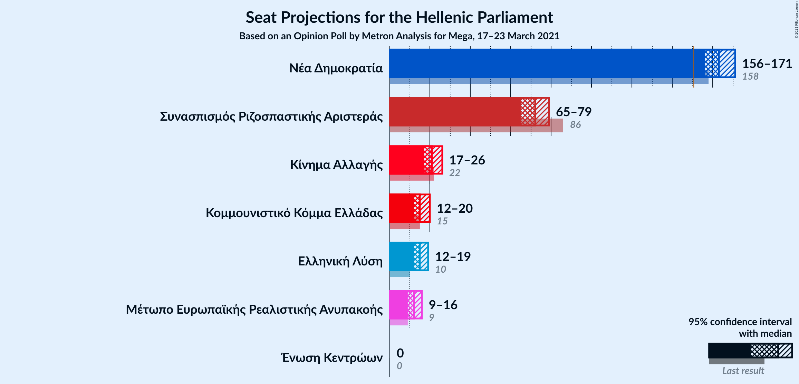

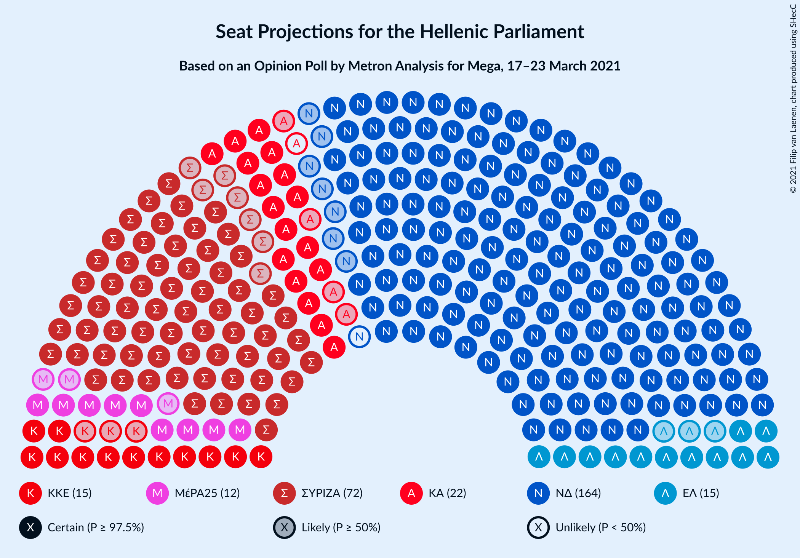

### Confidence Intervals

| Party | Last Result | Median | 80% Confidence Interval | 90% Confidence Interval | 95% Confidence Interval | 99% Confidence Interval |
|:-----:|:-----------:|:------:|:-----------------------:|:-----------------------:|:-----------------------:|:-----------------------:|
| <a href="#νέα-δημοκρατία">Νέα Δημοκρατία</a> | 158 | 163 | 158–169 |157–170 |156–171 |153–174 |
| <a href="#συνασπισμός-ριζοσπαστικής-αριστεράς">Συνασπισμός Ριζοσπαστικής Αριστεράς</a> | 86 | 72 | 67–77 |66–78 |65–79 |63–81 |
| <a href="#κίνημα-αλλαγής">Κίνημα Αλλαγής</a> | 22 | 21 | 19–24 |18–25 |17–26 |16–28 |
| <a href="#κομμουνιστικό-κόμμα-ελλάδας">Κομμουνιστικό Κόμμα Ελλάδας</a> | 15 | 15 | 13–18 |13–19 |12–20 |11–21 |
| <a href="#ελληνική-λύση">Ελληνική Λύση</a> | 10 | 15 | 13–18 |12–19 |12–19 |11–21 |
| <a href="#μέτωπο-ευρωπαϊκής-ρεαλιστικής-ανυπακοής">Μέτωπο Ευρωπαϊκής Ρεαλιστικής Ανυπακοής</a> | 9 | 12 | 10–15 |10–16 |9–16 |8–17 |
| <a href="#ένωση-κεντρώων">Ένωση Κεντρώων</a> | 0 | 0 | 0 |0 |0 |0 |

### Νέα Δημοκρατία

*For a full overview of the results for this party, see the [Νέα Δημοκρατία](party-νέαδημοκρατία.html) page.*

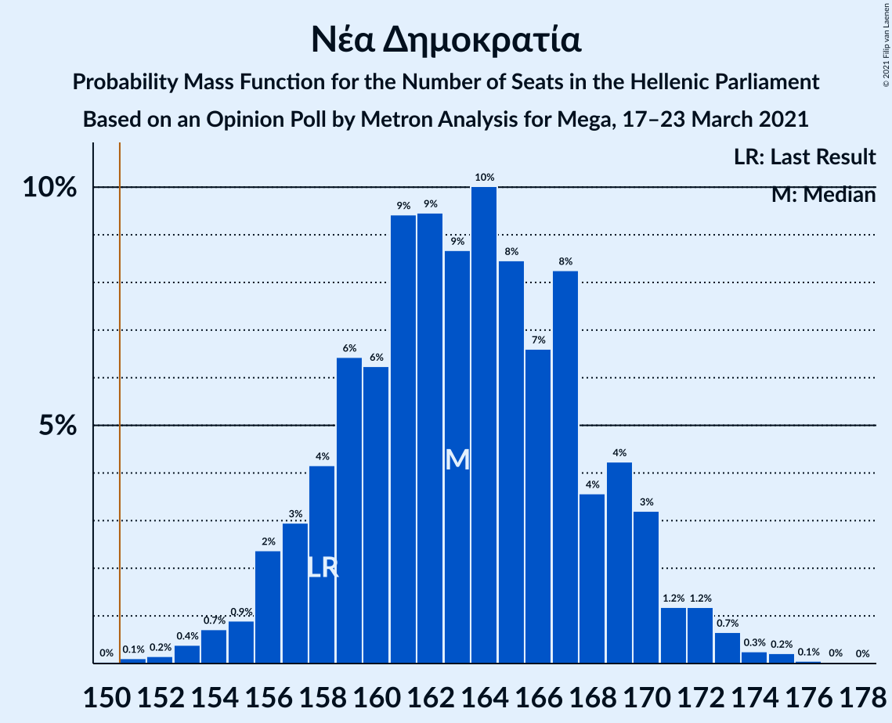

| Number of Seats | Probability | Accumulated | Special Marks |
|:---------------:|:-----------:|:-----------:|:-------------:|
| 150 | 0% | 100% |  |
| 151 | 0.1% | 99.9% | Majority |
| 152 | 0.2% | 99.8% |  |
| 153 | 0.4% | 99.7% |  |
| 154 | 0.7% | 99.3% |  |
| 155 | 0.9% | 98.6% |  |
| 156 | 2% | 98% |  |
| 157 | 3% | 95% |  |
| 158 | 4% | 92% | Last Result |
| 159 | 6% | 88% |  |
| 160 | 6% | 82% |  |
| 161 | 9% | 76% |  |
| 162 | 9% | 66% |  |
| 163 | 9% | 57% | Median |
| 164 | 10% | 48% |  |
| 165 | 8% | 38% |  |
| 166 | 7% | 29% |  |
| 167 | 8% | 23% |  |
| 168 | 4% | 15% |  |
| 169 | 4% | 11% |  |
| 170 | 3% | 7% |  |
| 171 | 1.2% | 4% |  |
| 172 | 1.2% | 2% |  |
| 173 | 0.7% | 1.2% |  |
| 174 | 0.3% | 0.6% |  |
| 175 | 0.2% | 0.3% |  |
| 176 | 0.1% | 0.1% |  |
| 177 | 0% | 0.1% |  |
| 178 | 0% | 0% |  |

### Συνασπισμός Ριζοσπαστικής Αριστεράς

*For a full overview of the results for this party, see the [Συνασπισμός Ριζοσπαστικής Αριστεράς](party-συνασπισμόςριζοσπαστικήςαριστεράς.html) page.*

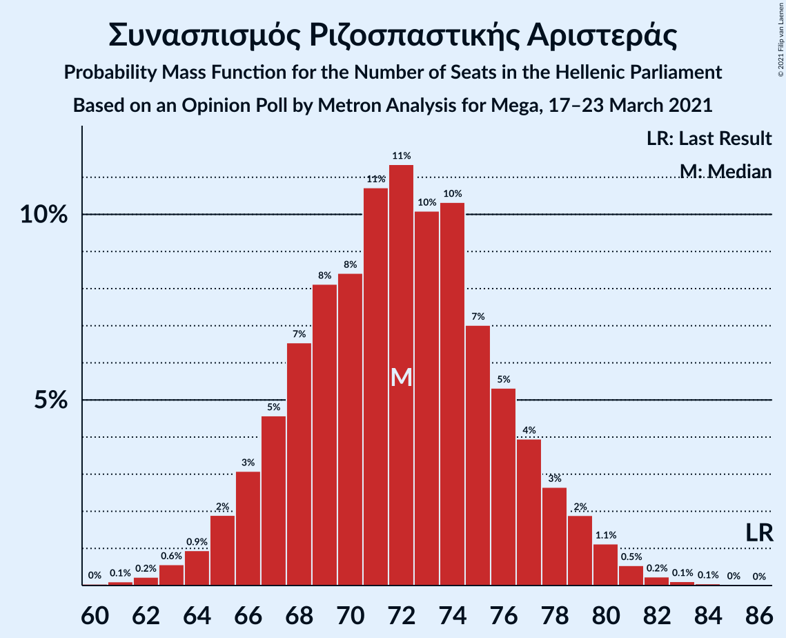

| Number of Seats | Probability | Accumulated | Special Marks |
|:---------------:|:-----------:|:-----------:|:-------------:|
| 60 | 0% | 100% |  |
| 61 | 0.1% | 99.9% |  |
| 62 | 0.2% | 99.8% |  |
| 63 | 0.6% | 99.6% |  |
| 64 | 0.9% | 99.0% |  |
| 65 | 2% | 98% |  |
| 66 | 3% | 96% |  |
| 67 | 5% | 93% |  |
| 68 | 7% | 89% |  |
| 69 | 8% | 82% |  |
| 70 | 8% | 74% |  |
| 71 | 11% | 65% |  |
| 72 | 11% | 55% | Median |
| 73 | 10% | 43% |  |
| 74 | 10% | 33% |  |
| 75 | 7% | 23% |  |
| 76 | 5% | 16% |  |
| 77 | 4% | 11% |  |
| 78 | 3% | 7% |  |
| 79 | 2% | 4% |  |
| 80 | 1.1% | 2% |  |
| 81 | 0.5% | 1.0% |  |
| 82 | 0.2% | 0.4% |  |
| 83 | 0.1% | 0.2% |  |
| 84 | 0.1% | 0.1% |  |
| 85 | 0% | 0% |  |
| 86 | 0% | 0% | Last Result |

### Κίνημα Αλλαγής

*For a full overview of the results for this party, see the [Κίνημα Αλλαγής](party-κίνημααλλαγής.html) page.*

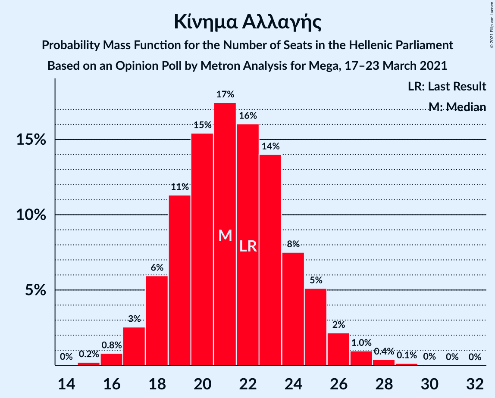

| Number of Seats | Probability | Accumulated | Special Marks |
|:---------------:|:-----------:|:-----------:|:-------------:|
| 15 | 0.2% | 100% |  |
| 16 | 0.8% | 99.8% |  |
| 17 | 3% | 99.0% |  |
| 18 | 6% | 96% |  |
| 19 | 11% | 90% |  |
| 20 | 15% | 79% |  |
| 21 | 17% | 64% | Median |
| 22 | 16% | 46% | Last Result |
| 23 | 14% | 30% |  |
| 24 | 8% | 16% |  |
| 25 | 5% | 9% |  |
| 26 | 2% | 4% |  |
| 27 | 1.0% | 2% |  |
| 28 | 0.4% | 0.6% |  |
| 29 | 0.1% | 0.2% |  |
| 30 | 0% | 0.1% |  |
| 31 | 0% | 0% |  |

### Κομμουνιστικό Κόμμα Ελλάδας

*For a full overview of the results for this party, see the [Κομμουνιστικό Κόμμα Ελλάδας](party-κομμουνιστικόκόμμαελλάδας.html) page.*

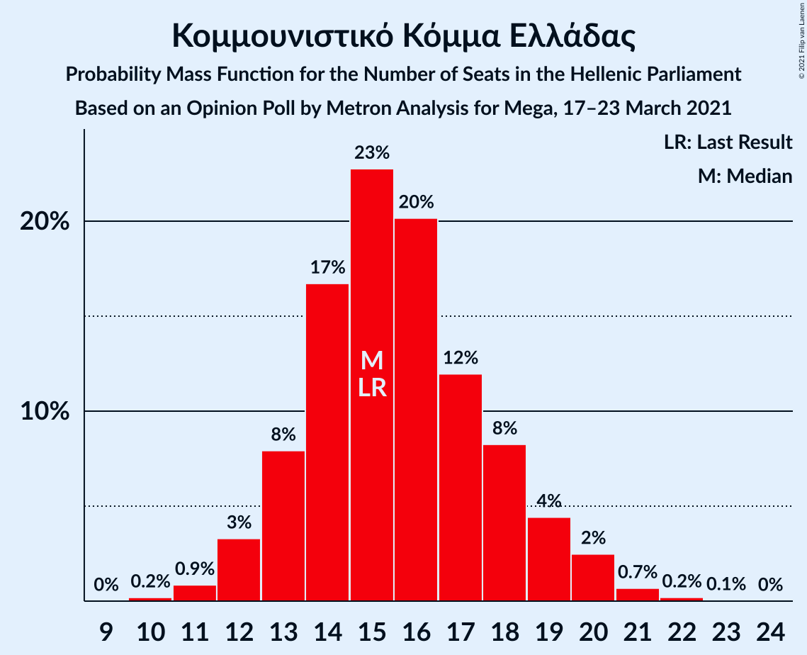

| Number of Seats | Probability | Accumulated | Special Marks |
|:---------------:|:-----------:|:-----------:|:-------------:|
| 10 | 0.2% | 100% |  |
| 11 | 0.9% | 99.8% |  |
| 12 | 3% | 98.9% |  |
| 13 | 8% | 96% |  |
| 14 | 17% | 88% |  |
| 15 | 23% | 71% | Last Result, Median |
| 16 | 20% | 48% |  |
| 17 | 12% | 28% |  |
| 18 | 8% | 16% |  |
| 19 | 4% | 8% |  |
| 20 | 2% | 3% |  |
| 21 | 0.7% | 1.0% |  |
| 22 | 0.2% | 0.3% |  |
| 23 | 0.1% | 0.1% |  |
| 24 | 0% | 0% |  |

### Ελληνική Λύση

*For a full overview of the results for this party, see the [Ελληνική Λύση](party-ελληνικήλύση.html) page.*

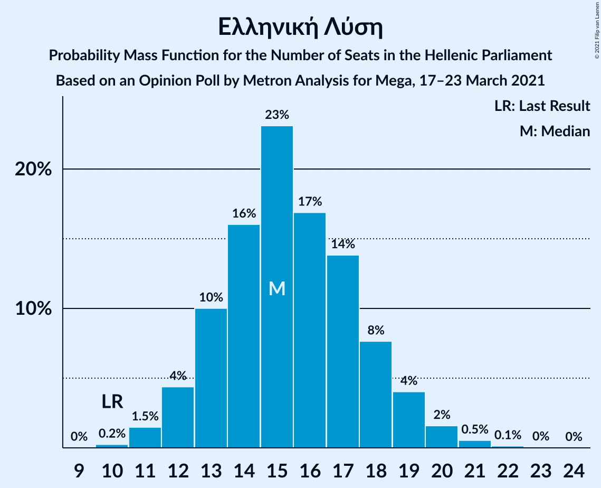

| Number of Seats | Probability | Accumulated | Special Marks |
|:---------------:|:-----------:|:-----------:|:-------------:|
| 10 | 0.2% | 100% | Last Result |
| 11 | 1.5% | 99.7% |  |
| 12 | 4% | 98% |  |
| 13 | 10% | 94% |  |
| 14 | 16% | 84% |  |
| 15 | 23% | 68% | Median |
| 16 | 17% | 45% |  |
| 17 | 14% | 28% |  |
| 18 | 8% | 14% |  |
| 19 | 4% | 6% |  |
| 20 | 2% | 2% |  |
| 21 | 0.5% | 0.7% |  |
| 22 | 0.1% | 0.2% |  |
| 23 | 0% | 0.1% |  |
| 24 | 0% | 0% |  |

### Μέτωπο Ευρωπαϊκής Ρεαλιστικής Ανυπακοής

*For a full overview of the results for this party, see the [Μέτωπο Ευρωπαϊκής Ρεαλιστικής Ανυπακοής](party-μέτωποευρωπαϊκήςρεαλιστικήςανυπακοής.html) page.*

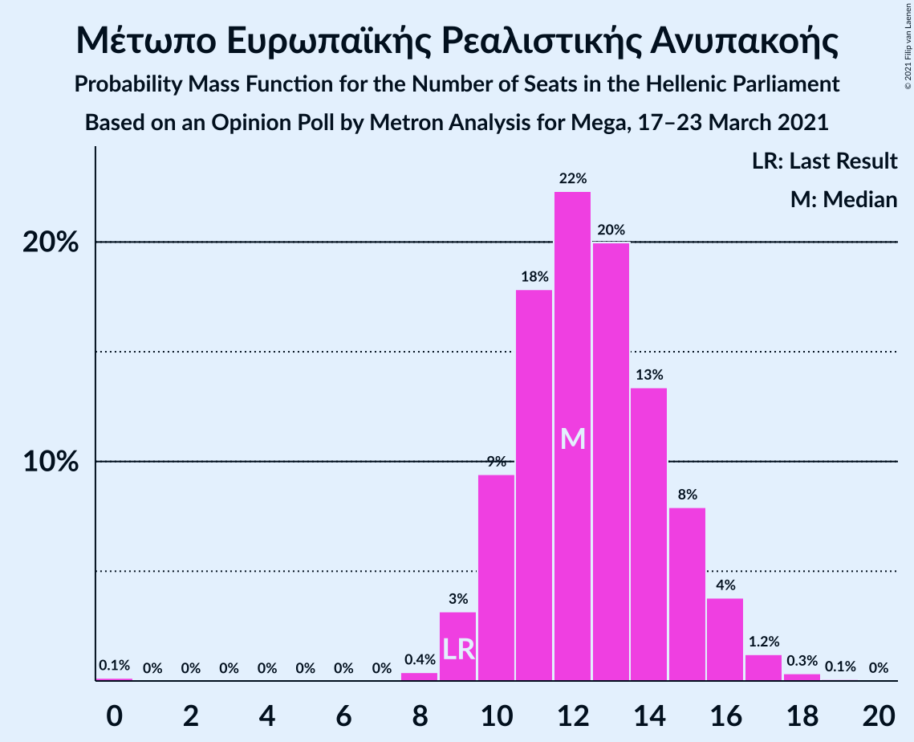

| Number of Seats | Probability | Accumulated | Special Marks |
|:---------------:|:-----------:|:-----------:|:-------------:|
| 0 | 0.1% | 100% |  |
| 1 | 0% | 99.9% |  |
| 2 | 0% | 99.9% |  |
| 3 | 0% | 99.9% |  |
| 4 | 0% | 99.9% |  |
| 5 | 0% | 99.9% |  |
| 6 | 0% | 99.9% |  |
| 7 | 0% | 99.9% |  |
| 8 | 0.4% | 99.9% |  |
| 9 | 3% | 99.5% | Last Result |
| 10 | 9% | 96% |  |
| 11 | 18% | 87% |  |
| 12 | 22% | 69% | Median |
| 13 | 20% | 47% |  |
| 14 | 13% | 27% |  |
| 15 | 8% | 13% |  |
| 16 | 4% | 5% |  |
| 17 | 1.2% | 2% |  |
| 18 | 0.3% | 0.4% |  |
| 19 | 0.1% | 0.1% |  |
| 20 | 0% | 0% |  |

### Ένωση Κεντρώων

*For a full overview of the results for this party, see the [Ένωση Κεντρώων](party-ένωσηκεντρώων.html) page.*

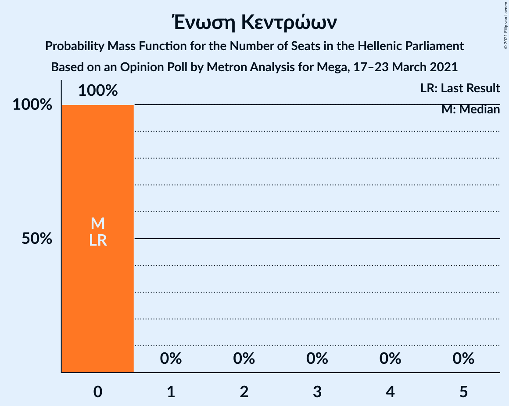

| Number of Seats | Probability | Accumulated | Special Marks |
|:---------------:|:-----------:|:-----------:|:-------------:|
| 0 | 100% | 100% | Last Result, Median |

## Coalitions

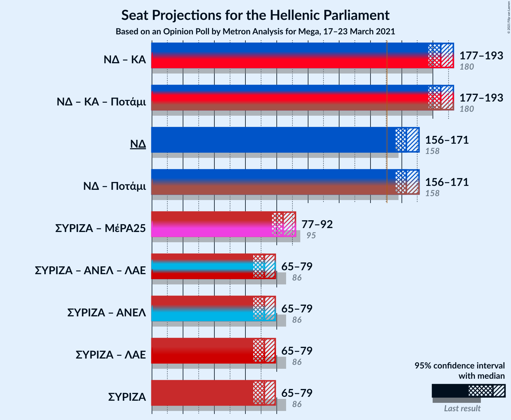

### Confidence Intervals

| Coalition | Last Result | Median | Majority? | 80% Confidence Interval | 90% Confidence Interval | 95% Confidence Interval | 99% Confidence Interval |
|:---------:|:-----------:|:------:|:---------:|:-----------------------:|:-----------------------:|:-----------------------:|:-----------------------:|
| Νέα Δημοκρατία – Κίνημα Αλλαγής | 180 | 185 | 100% | 179–190 | 178–191 | 177–193 | 174–195 |
| Νέα Δημοκρατία | 158 | 163 | 99.9% | 158–169 | 157–170 | 156–171 | 153–174 |
| Συνασπισμός Ριζοσπαστικής Αριστεράς – Μέτωπο Ευρωπαϊκής Ρεαλιστικής Ανυπακοής | 95 | 84 | 0% | 79–89 | 78–91 | 77–92 | 75–94 |
| Συνασπισμός Ριζοσπαστικής Αριστεράς | 86 | 72 | 0% | 67–77 | 66–78 | 65–79 | 63–81 |

### Νέα Δημοκρατία – Κίνημα Αλλαγής

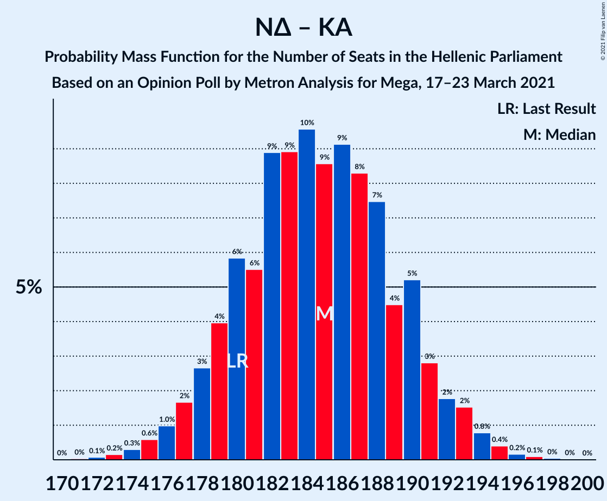

| Number of Seats | Probability | Accumulated | Special Marks |
|:---------------:|:-----------:|:-----------:|:-------------:|
| 171 | 0% | 100% |  |
| 172 | 0.1% | 99.9% |  |
| 173 | 0.2% | 99.9% |  |
| 174 | 0.3% | 99.7% |  |
| 175 | 0.6% | 99.4% |  |
| 176 | 1.0% | 98.8% |  |
| 177 | 2% | 98% |  |
| 178 | 3% | 96% |  |
| 179 | 4% | 94% |  |
| 180 | 6% | 90% | Last Result |
| 181 | 6% | 84% |  |
| 182 | 9% | 78% |  |
| 183 | 9% | 69% |  |
| 184 | 10% | 60% | Median |
| 185 | 9% | 51% |  |
| 186 | 9% | 42% |  |
| 187 | 8% | 33% |  |
| 188 | 7% | 25% |  |
| 189 | 4% | 17% |  |
| 190 | 5% | 13% |  |
| 191 | 3% | 8% |  |
| 192 | 2% | 5% |  |
| 193 | 2% | 3% |  |
| 194 | 0.8% | 2% |  |
| 195 | 0.4% | 0.7% |  |
| 196 | 0.2% | 0.3% |  |
| 197 | 0.1% | 0.2% |  |
| 198 | 0% | 0.1% |  |
| 199 | 0% | 0% |  |

### Νέα Δημοκρατία

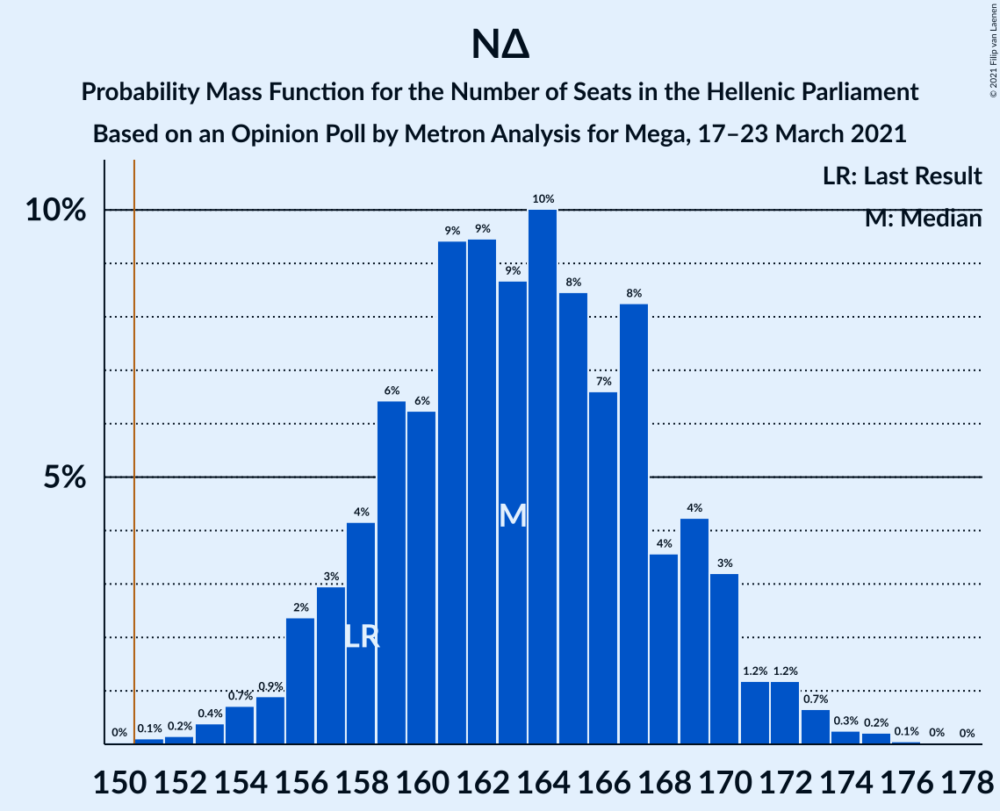

| Number of Seats | Probability | Accumulated | Special Marks |
|:---------------:|:-----------:|:-----------:|:-------------:|
| 150 | 0% | 100% |  |
| 151 | 0.1% | 99.9% | Majority |
| 152 | 0.2% | 99.8% |  |
| 153 | 0.4% | 99.7% |  |
| 154 | 0.7% | 99.3% |  |
| 155 | 0.9% | 98.6% |  |
| 156 | 2% | 98% |  |
| 157 | 3% | 95% |  |
| 158 | 4% | 92% | Last Result |
| 159 | 6% | 88% |  |
| 160 | 6% | 82% |  |
| 161 | 9% | 76% |  |
| 162 | 9% | 66% |  |
| 163 | 9% | 57% | Median |
| 164 | 10% | 48% |  |
| 165 | 8% | 38% |  |
| 166 | 7% | 29% |  |
| 167 | 8% | 23% |  |
| 168 | 4% | 15% |  |
| 169 | 4% | 11% |  |
| 170 | 3% | 7% |  |
| 171 | 1.2% | 4% |  |
| 172 | 1.2% | 2% |  |
| 173 | 0.7% | 1.2% |  |
| 174 | 0.3% | 0.6% |  |
| 175 | 0.2% | 0.3% |  |
| 176 | 0.1% | 0.1% |  |
| 177 | 0% | 0.1% |  |
| 178 | 0% | 0% |  |

### Συνασπισμός Ριζοσπαστικής Αριστεράς – Μέτωπο Ευρωπαϊκής Ρεαλιστικής Ανυπακοής

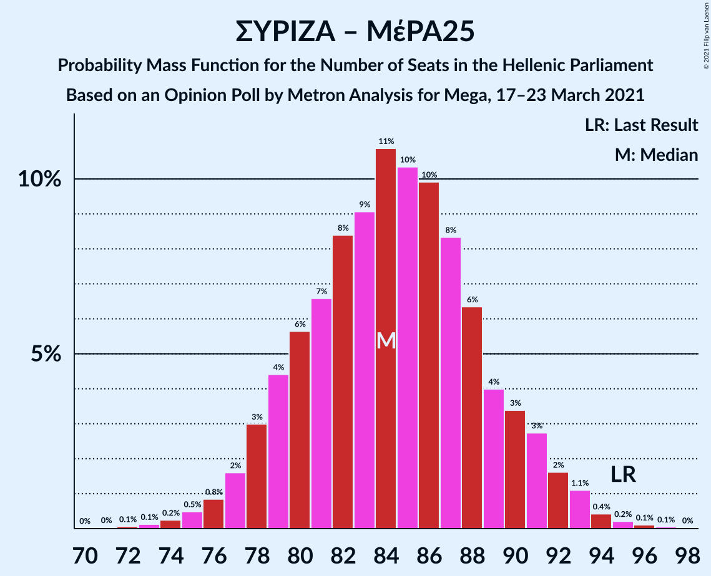

| Number of Seats | Probability | Accumulated | Special Marks |
|:---------------:|:-----------:|:-----------:|:-------------:|
| 71 | 0% | 100% |  |
| 72 | 0.1% | 99.9% |  |
| 73 | 0.1% | 99.9% |  |
| 74 | 0.2% | 99.8% |  |
| 75 | 0.5% | 99.5% |  |
| 76 | 0.8% | 99.0% |  |
| 77 | 2% | 98% |  |
| 78 | 3% | 97% |  |
| 79 | 4% | 94% |  |
| 80 | 6% | 89% |  |
| 81 | 7% | 84% |  |
| 82 | 8% | 77% |  |
| 83 | 9% | 69% |  |
| 84 | 11% | 59% | Median |
| 85 | 10% | 49% |  |
| 86 | 10% | 38% |  |
| 87 | 8% | 28% |  |
| 88 | 6% | 20% |  |
| 89 | 4% | 14% |  |
| 90 | 3% | 10% |  |
| 91 | 3% | 6% |  |
| 92 | 2% | 4% |  |
| 93 | 1.1% | 2% |  |
| 94 | 0.4% | 0.8% |  |
| 95 | 0.2% | 0.4% | Last Result |
| 96 | 0.1% | 0.2% |  |
| 97 | 0.1% | 0.1% |  |
| 98 | 0% | 0% |  |

### Συνασπισμός Ριζοσπαστικής Αριστεράς

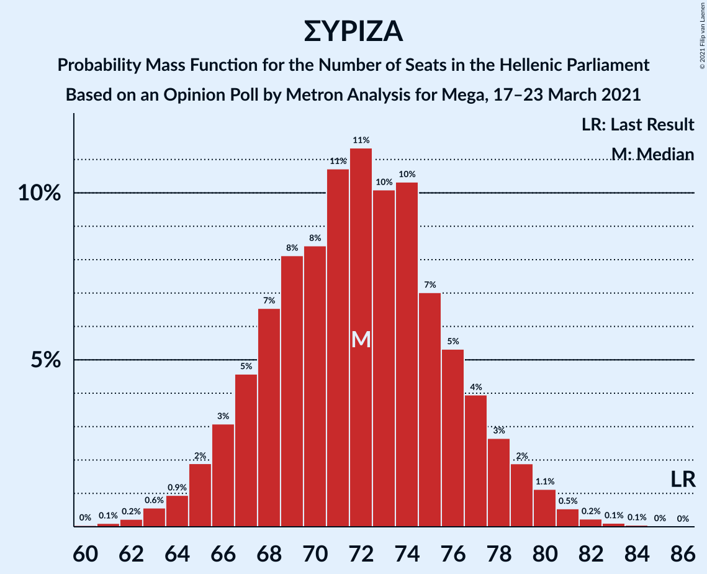

| Number of Seats | Probability | Accumulated | Special Marks |
|:---------------:|:-----------:|:-----------:|:-------------:|
| 60 | 0% | 100% |  |
| 61 | 0.1% | 99.9% |  |
| 62 | 0.2% | 99.8% |  |
| 63 | 0.6% | 99.6% |  |
| 64 | 0.9% | 99.0% |  |
| 65 | 2% | 98% |  |
| 66 | 3% | 96% |  |
| 67 | 5% | 93% |  |
| 68 | 7% | 89% |  |
| 69 | 8% | 82% |  |
| 70 | 8% | 74% |  |
| 71 | 11% | 65% |  |
| 72 | 11% | 55% | Median |
| 73 | 10% | 43% |  |
| 74 | 10% | 33% |  |
| 75 | 7% | 23% |  |
| 76 | 5% | 16% |  |
| 77 | 4% | 11% |  |
| 78 | 3% | 7% |  |
| 79 | 2% | 4% |  |
| 80 | 1.1% | 2% |  |
| 81 | 0.5% | 1.0% |  |
| 82 | 0.2% | 0.4% |  |
| 83 | 0.1% | 0.2% |  |
| 84 | 0.1% | 0.1% |  |
| 85 | 0% | 0% |  |
| 86 | 0% | 0% | Last Result |

## Technical Information

### Opinion Poll

+ **Polling firm:** Metron Analysis
+ **Commissioner(s):** Mega
+ **Fieldwork period:** 17–23 March 2021

### Calculations

+ **Sample size:** 1000
+ **Simulations done:** 1,048,576
+ **Error estimate:** 1.52%

