# Opinion Poll by Pulse RC for ΣΚΑΪ, 26–28 March 2021

<a href="#voting-intentions">Voting Intentions</a> | <a href="#seats">Seats</a> | <a href="#coalitions">Coalitions</a> | <a href="#technical-information">Technical Information</a>

## Voting Intentions

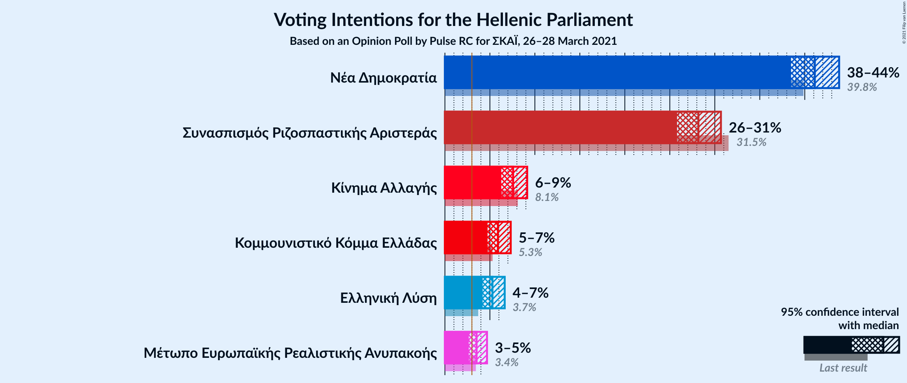

### Confidence Intervals

| Party | Last Result | Poll Result | 80% Confidence Interval | 90% Confidence Interval | 95% Confidence Interval | 99% Confidence Interval |
|:-----:|:-----------:|:-----------:|:-----------------------:|:-----------------------:|:-----------------------:|:-----------------------:|
| Νέα Δημοκρατία | 39.8% | 41.3% | 39.5–43.0% |39.0–43.5% |38.6–44.0% |37.8–44.8% |
| Συνασπισμός Ριζοσπαστικής Αριστεράς | 31.5% | 27.9% | 26.3–29.5% |25.9–30.0% |25.5–30.4% |24.8–31.2% |
| Κίνημα Αλλαγής | 8.1% | 7.8% | 6.9–8.9% |6.7–9.1% |6.5–9.4% |6.1–9.9% |
| Κομμουνιστικό Κόμμα Ελλάδας | 5.3% | 6.1% | 5.3–7.1% |5.1–7.3% |4.9–7.6% |4.6–8.0% |
| Ελληνική Λύση | 3.7% | 5.0% | 4.3–5.8% |4.1–6.1% |3.9–6.3% |3.6–6.7% |
| Μέτωπο Ευρωπαϊκής Ρεαλιστικής Ανυπακοής | 3.4% | 3.4% | 2.8–4.1% |2.7–4.3% |2.5–4.5% |2.3–4.9% |

*Note:* The poll result column reflects the actual value used in the calculations. Published results may vary slightly, and in addition be rounded to fewer digits.

## Seats

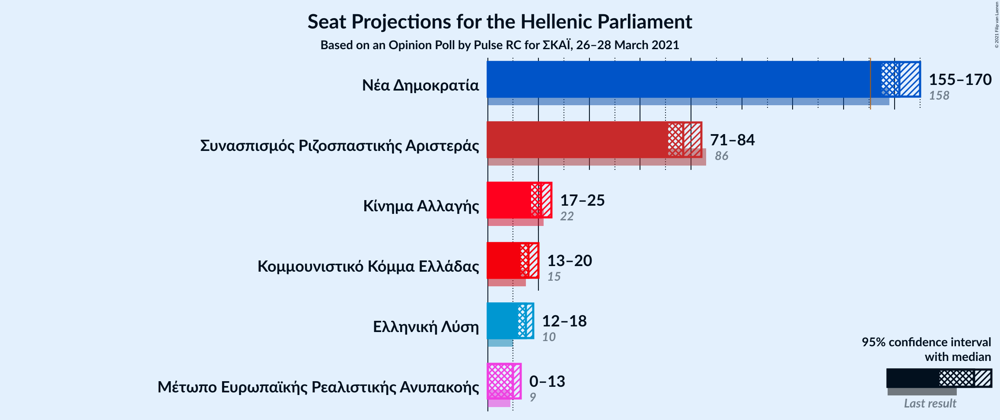

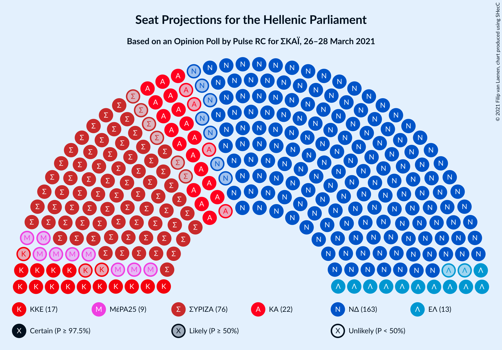

### Confidence Intervals

| Party | Last Result | Median | 80% Confidence Interval | 90% Confidence Interval | 95% Confidence Interval | 99% Confidence Interval |
|:-----:|:-----------:|:------:|:-----------------------:|:-----------------------:|:-----------------------:|:-----------------------:|
| <a href="#νέα-δημοκρατία">Νέα Δημοκρατία</a> | 158 | 163 | 158–168 |157–170 |156–172 |153–174 |
| <a href="#συνασπισμός-ριζοσπαστικής-αριστεράς">Συνασπισμός Ριζοσπαστικής Αριστεράς</a> | 86 | 76 | 72–81 |71–82 |70–84 |68–86 |
| <a href="#κίνημα-αλλαγής">Κίνημα Αλλαγής</a> | 22 | 22 | 19–24 |18–25 |18–26 |17–27 |
| <a href="#κομμουνιστικό-κόμμα-ελλάδας">Κομμουνιστικό Κόμμα Ελλάδας</a> | 15 | 17 | 15–19 |14–20 |14–21 |13–22 |
| <a href="#ελληνική-λύση">Ελληνική Λύση</a> | 10 | 14 | 12–16 |11–17 |11–17 |10–18 |
| <a href="#μέτωπο-ευρωπαϊκής-ρεαλιστικής-ανυπακοής">Μέτωπο Ευρωπαϊκής Ρεαλιστικής Ανυπακοής</a> | 9 | 9 | 0–11 |0–12 |0–12 |0–13 |

### Νέα Δημοκρατία

*For a full overview of the results for this party, see the [Νέα Δημοκρατία](party-νέαδημοκρατία.html) page.*

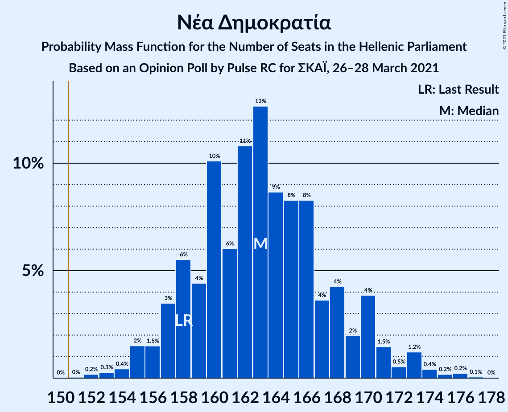

| Number of Seats | Probability | Accumulated | Special Marks |
|:---------------:|:-----------:|:-----------:|:-------------:|
| 151 | 0.1% | 100% | Majority |
| 152 | 0.1% | 99.9% |  |
| 153 | 0.3% | 99.8% |  |
| 154 | 0.6% | 99.5% |  |
| 155 | 1.2% | 98.9% |  |
| 156 | 2% | 98% |  |
| 157 | 3% | 96% |  |
| 158 | 4% | 93% | Last Result |
| 159 | 6% | 88% |  |
| 160 | 8% | 83% |  |
| 161 | 9% | 74% |  |
| 162 | 10% | 66% |  |
| 163 | 10% | 56% | Median |
| 164 | 9% | 45% |  |
| 165 | 9% | 36% |  |
| 166 | 7% | 28% |  |
| 167 | 6% | 20% |  |
| 168 | 4% | 14% |  |
| 169 | 3% | 10% |  |
| 170 | 3% | 7% |  |
| 171 | 2% | 4% |  |
| 172 | 0.9% | 3% |  |
| 173 | 0.8% | 2% |  |
| 174 | 0.4% | 0.8% |  |
| 175 | 0.3% | 0.5% |  |
| 176 | 0.1% | 0.2% |  |
| 177 | 0% | 0.1% |  |
| 178 | 0% | 0% |  |

### Συνασπισμός Ριζοσπαστικής Αριστεράς

*For a full overview of the results for this party, see the [Συνασπισμός Ριζοσπαστικής Αριστεράς](party-συνασπισμόςριζοσπαστικήςαριστεράς.html) page.*

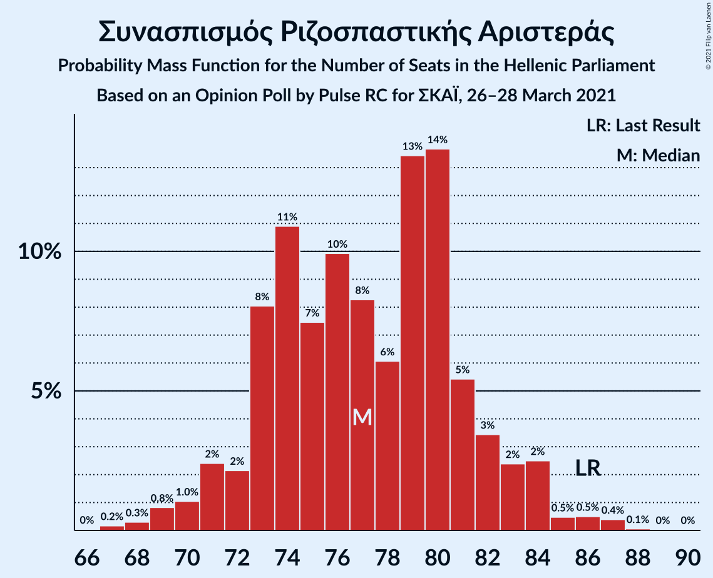

| Number of Seats | Probability | Accumulated | Special Marks |
|:---------------:|:-----------:|:-----------:|:-------------:|
| 65 | 0% | 100% |  |
| 66 | 0.1% | 99.9% |  |
| 67 | 0.2% | 99.9% |  |
| 68 | 0.6% | 99.6% |  |
| 69 | 1.1% | 99.0% |  |
| 70 | 2% | 98% |  |
| 71 | 3% | 96% |  |
| 72 | 5% | 93% |  |
| 73 | 7% | 88% |  |
| 74 | 9% | 80% |  |
| 75 | 10% | 71% |  |
| 76 | 12% | 61% | Median |
| 77 | 11% | 49% |  |
| 78 | 10% | 38% |  |
| 79 | 9% | 28% |  |
| 80 | 6% | 19% |  |
| 81 | 5% | 13% |  |
| 82 | 4% | 8% |  |
| 83 | 2% | 5% |  |
| 84 | 1.3% | 3% |  |
| 85 | 0.7% | 2% |  |
| 86 | 0.4% | 0.8% | Last Result |
| 87 | 0.2% | 0.3% |  |
| 88 | 0.1% | 0.2% |  |
| 89 | 0% | 0.1% |  |
| 90 | 0% | 0% |  |

### Κίνημα Αλλαγής

*For a full overview of the results for this party, see the [Κίνημα Αλλαγής](party-κίνημααλλαγής.html) page.*

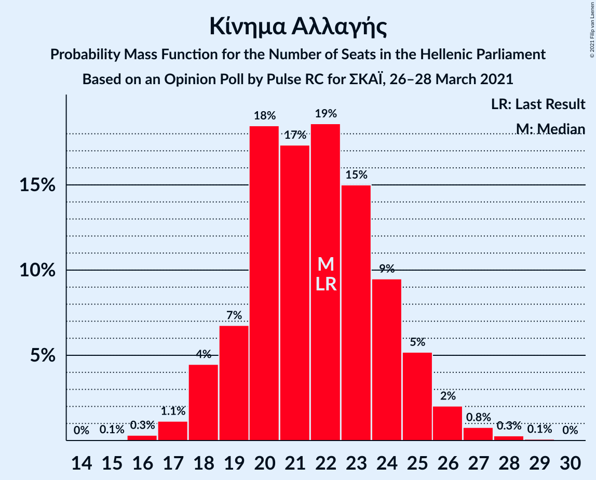

| Number of Seats | Probability | Accumulated | Special Marks |
|:---------------:|:-----------:|:-----------:|:-------------:|
| 15 | 0.1% | 100% |  |
| 16 | 0.3% | 99.9% |  |
| 17 | 1.5% | 99.6% |  |
| 18 | 4% | 98% |  |
| 19 | 9% | 94% |  |
| 20 | 15% | 85% |  |
| 21 | 19% | 69% |  |
| 22 | 19% | 50% | Last Result, Median |
| 23 | 14% | 32% |  |
| 24 | 10% | 18% |  |
| 25 | 5% | 8% |  |
| 26 | 2% | 3% |  |
| 27 | 0.8% | 1.2% |  |
| 28 | 0.3% | 0.4% |  |
| 29 | 0.1% | 0.1% |  |
| 30 | 0% | 0% |  |

### Κομμουνιστικό Κόμμα Ελλάδας

*For a full overview of the results for this party, see the [Κομμουνιστικό Κόμμα Ελλάδας](party-κομμουνιστικόκόμμαελλάδας.html) page.*

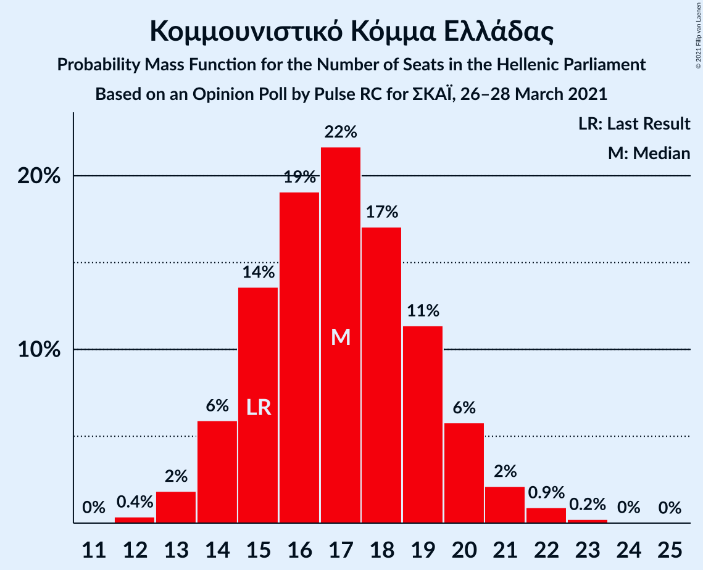

| Number of Seats | Probability | Accumulated | Special Marks |
|:---------------:|:-----------:|:-----------:|:-------------:|
| 12 | 0.4% | 100% |  |
| 13 | 2% | 99.6% |  |
| 14 | 6% | 98% |  |
| 15 | 14% | 92% | Last Result |
| 16 | 19% | 78% |  |
| 17 | 22% | 59% | Median |
| 18 | 17% | 38% |  |
| 19 | 11% | 20% |  |
| 20 | 6% | 9% |  |
| 21 | 2% | 3% |  |
| 22 | 0.9% | 1.2% |  |
| 23 | 0.2% | 0.3% |  |
| 24 | 0% | 0.1% |  |
| 25 | 0% | 0% |  |

### Ελληνική Λύση

*For a full overview of the results for this party, see the [Ελληνική Λύση](party-ελληνικήλύση.html) page.*

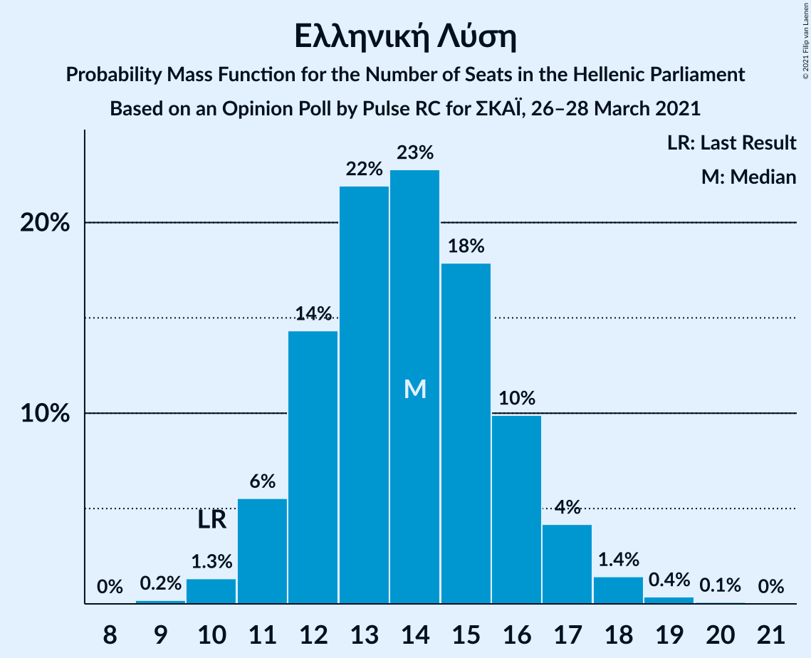

| Number of Seats | Probability | Accumulated | Special Marks |
|:---------------:|:-----------:|:-----------:|:-------------:|
| 9 | 0.2% | 100% |  |
| 10 | 1.3% | 99.8% | Last Result |
| 11 | 6% | 98% |  |
| 12 | 14% | 93% |  |
| 13 | 22% | 79% |  |
| 14 | 23% | 57% | Median |
| 15 | 18% | 34% |  |
| 16 | 10% | 16% |  |
| 17 | 4% | 6% |  |
| 18 | 1.4% | 2% |  |
| 19 | 0.4% | 0.5% |  |
| 20 | 0.1% | 0.1% |  |
| 21 | 0% | 0% |  |

### Μέτωπο Ευρωπαϊκής Ρεαλιστικής Ανυπακοής

*For a full overview of the results for this party, see the [Μέτωπο Ευρωπαϊκής Ρεαλιστικής Ανυπακοής](party-μέτωποευρωπαϊκήςρεαλιστικήςανυπακοής.html) page.*

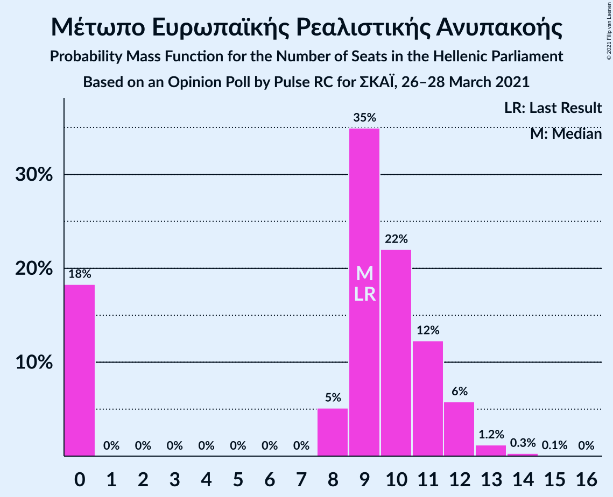

| Number of Seats | Probability | Accumulated | Special Marks |
|:---------------:|:-----------:|:-----------:|:-------------:|
| 0 | 20% | 100% |  |
| 1 | 0% | 80% |  |
| 2 | 0% | 80% |  |
| 3 | 0% | 80% |  |
| 4 | 0% | 80% |  |
| 5 | 0% | 80% |  |
| 6 | 0% | 80% |  |
| 7 | 0% | 80% |  |
| 8 | 7% | 80% |  |
| 9 | 28% | 73% | Last Result, Median |
| 10 | 25% | 45% |  |
| 11 | 13% | 20% |  |
| 12 | 5% | 7% |  |
| 13 | 1.3% | 2% |  |
| 14 | 0.3% | 0.3% |  |
| 15 | 0% | 0.1% |  |
| 16 | 0% | 0% |  |

## Coalitions

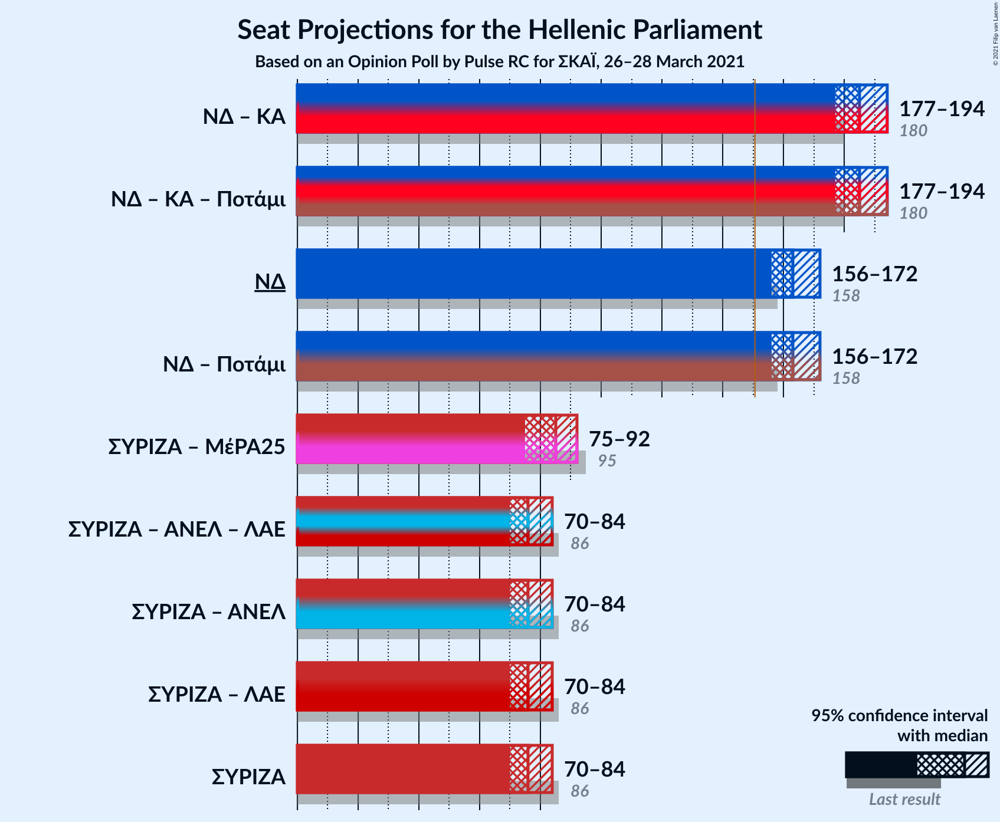

### Confidence Intervals

| Coalition | Last Result | Median | Majority? | 80% Confidence Interval | 90% Confidence Interval | 95% Confidence Interval | 99% Confidence Interval |
|:---------:|:-----------:|:------:|:---------:|:-----------------------:|:-----------------------:|:-----------------------:|:-----------------------:|
| Νέα Δημοκρατία – Κίνημα Αλλαγής | 180 | 185 | 100% | 179–190 | 178–192 | 177–194 | 175–197 |
| Νέα Δημοκρατία | 158 | 163 | 100% | 158–168 | 157–170 | 156–172 | 153–174 |
| Συνασπισμός Ριζοσπαστικής Αριστεράς – Μέτωπο Ευρωπαϊκής Ρεαλιστικής Ανυπακοής | 95 | 85 | 0% | 78–90 | 76–91 | 75–92 | 72–94 |
| Συνασπισμός Ριζοσπαστικής Αριστεράς | 86 | 76 | 0% | 72–81 | 71–82 | 70–84 | 68–86 |

### Νέα Δημοκρατία – Κίνημα Αλλαγής

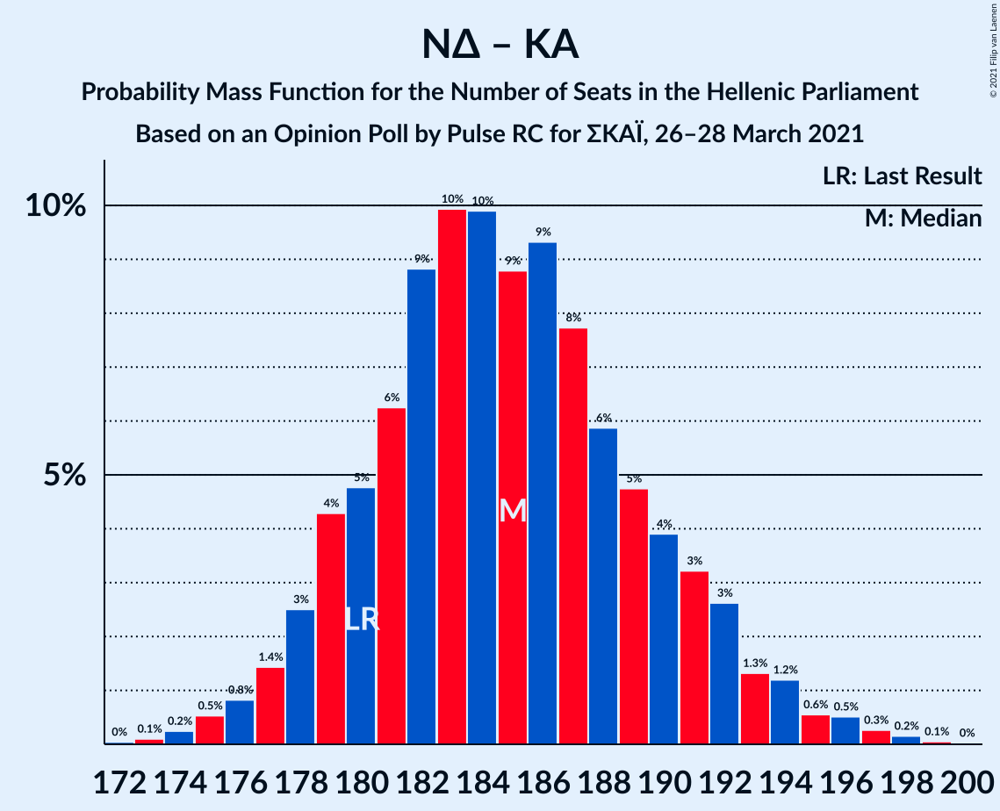

| Number of Seats | Probability | Accumulated | Special Marks |
|:---------------:|:-----------:|:-----------:|:-------------:|
| 172 | 0% | 100% |  |
| 173 | 0.1% | 99.9% |  |
| 174 | 0.2% | 99.8% |  |
| 175 | 0.5% | 99.6% |  |
| 176 | 0.8% | 99.1% |  |
| 177 | 1.4% | 98% |  |
| 178 | 3% | 97% |  |
| 179 | 4% | 94% |  |
| 180 | 5% | 90% | Last Result |
| 181 | 6% | 85% |  |
| 182 | 9% | 79% |  |
| 183 | 10% | 70% |  |
| 184 | 10% | 60% |  |
| 185 | 9% | 50% | Median |
| 186 | 9% | 42% |  |
| 187 | 8% | 32% |  |
| 188 | 6% | 24% |  |
| 189 | 5% | 19% |  |
| 190 | 4% | 14% |  |
| 191 | 3% | 10% |  |
| 192 | 3% | 7% |  |
| 193 | 1.3% | 4% |  |
| 194 | 1.2% | 3% |  |
| 195 | 0.6% | 2% |  |
| 196 | 0.5% | 1.0% |  |
| 197 | 0.3% | 0.5% |  |
| 198 | 0.2% | 0.3% |  |
| 199 | 0.1% | 0.1% |  |
| 200 | 0% | 0% |  |

### Νέα Δημοκρατία

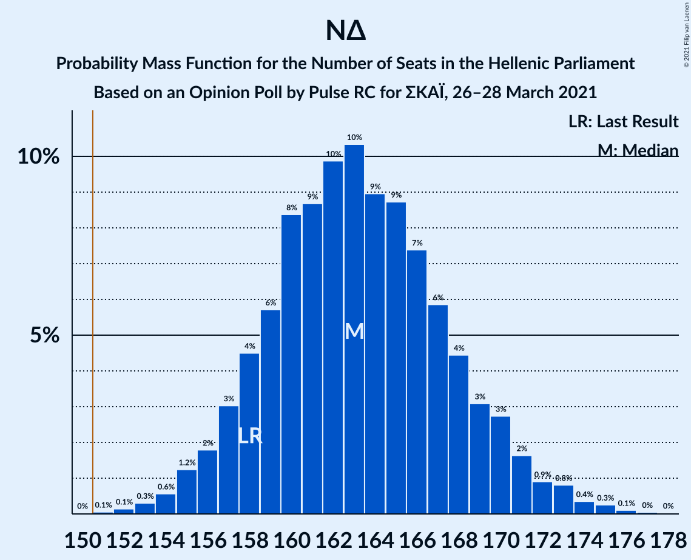

| Number of Seats | Probability | Accumulated | Special Marks |
|:---------------:|:-----------:|:-----------:|:-------------:|
| 151 | 0.1% | 100% | Majority |
| 152 | 0.1% | 99.9% |  |
| 153 | 0.3% | 99.8% |  |
| 154 | 0.6% | 99.5% |  |
| 155 | 1.2% | 98.9% |  |
| 156 | 2% | 98% |  |
| 157 | 3% | 96% |  |
| 158 | 4% | 93% | Last Result |
| 159 | 6% | 88% |  |
| 160 | 8% | 83% |  |
| 161 | 9% | 74% |  |
| 162 | 10% | 66% |  |
| 163 | 10% | 56% | Median |
| 164 | 9% | 45% |  |
| 165 | 9% | 36% |  |
| 166 | 7% | 28% |  |
| 167 | 6% | 20% |  |
| 168 | 4% | 14% |  |
| 169 | 3% | 10% |  |
| 170 | 3% | 7% |  |
| 171 | 2% | 4% |  |
| 172 | 0.9% | 3% |  |
| 173 | 0.8% | 2% |  |
| 174 | 0.4% | 0.8% |  |
| 175 | 0.3% | 0.5% |  |
| 176 | 0.1% | 0.2% |  |
| 177 | 0% | 0.1% |  |
| 178 | 0% | 0% |  |

### Συνασπισμός Ριζοσπαστικής Αριστεράς – Μέτωπο Ευρωπαϊκής Ρεαλιστικής Ανυπακοής

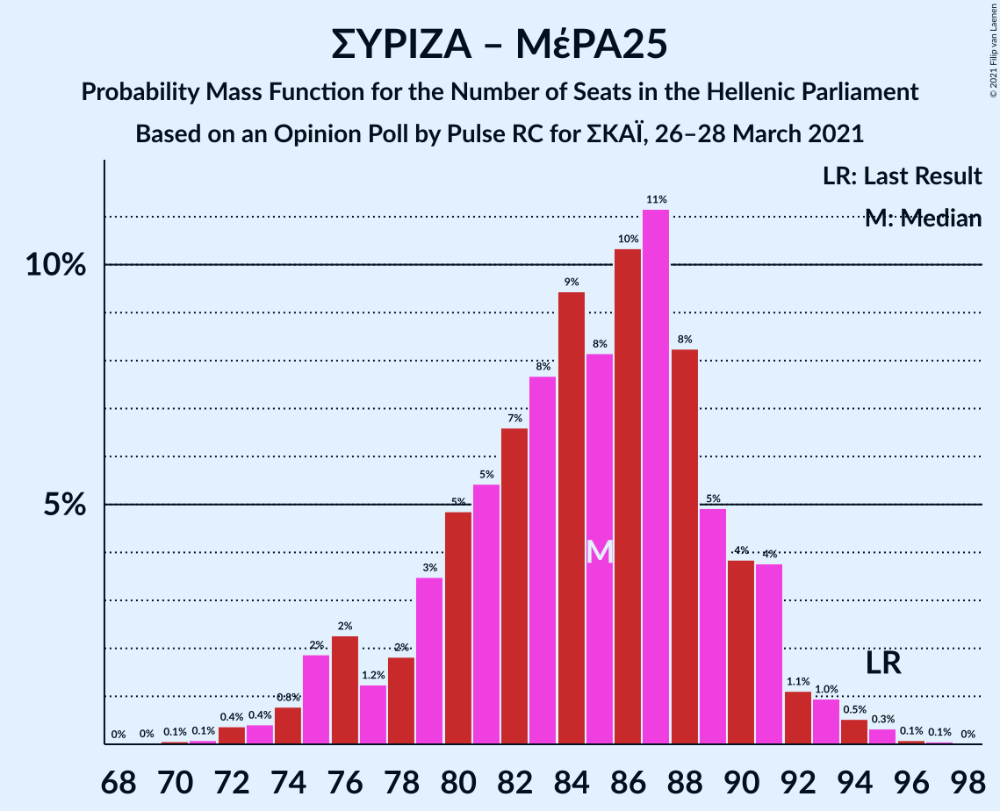

| Number of Seats | Probability | Accumulated | Special Marks |
|:---------------:|:-----------:|:-----------:|:-------------:|
| 70 | 0.1% | 100% |  |
| 71 | 0.1% | 99.9% |  |
| 72 | 0.3% | 99.8% |  |
| 73 | 0.6% | 99.5% |  |
| 74 | 0.8% | 98.9% |  |
| 75 | 1.2% | 98% |  |
| 76 | 2% | 97% |  |
| 77 | 2% | 95% |  |
| 78 | 3% | 93% |  |
| 79 | 4% | 90% |  |
| 80 | 4% | 86% |  |
| 81 | 5% | 81% |  |
| 82 | 6% | 76% |  |
| 83 | 9% | 70% |  |
| 84 | 9% | 61% |  |
| 85 | 10% | 52% | Median |
| 86 | 10% | 43% |  |
| 87 | 9% | 32% |  |
| 88 | 7% | 24% |  |
| 89 | 6% | 16% |  |
| 90 | 4% | 11% |  |
| 91 | 3% | 6% |  |
| 92 | 2% | 4% |  |
| 93 | 0.9% | 2% |  |
| 94 | 0.5% | 0.9% |  |
| 95 | 0.3% | 0.4% | Last Result |
| 96 | 0.1% | 0.2% |  |
| 97 | 0% | 0.1% |  |
| 98 | 0% | 0% |  |

### Συνασπισμός Ριζοσπαστικής Αριστεράς

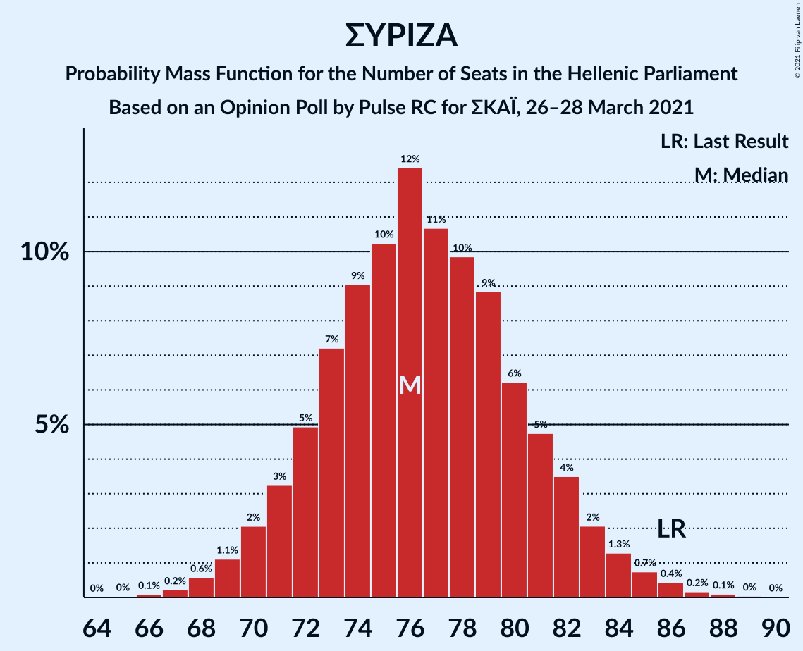

| Number of Seats | Probability | Accumulated | Special Marks |
|:---------------:|:-----------:|:-----------:|:-------------:|
| 65 | 0% | 100% |  |
| 66 | 0.1% | 99.9% |  |
| 67 | 0.2% | 99.9% |  |
| 68 | 0.6% | 99.6% |  |
| 69 | 1.1% | 99.0% |  |
| 70 | 2% | 98% |  |
| 71 | 3% | 96% |  |
| 72 | 5% | 93% |  |
| 73 | 7% | 88% |  |
| 74 | 9% | 80% |  |
| 75 | 10% | 71% |  |
| 76 | 12% | 61% | Median |
| 77 | 11% | 49% |  |
| 78 | 10% | 38% |  |
| 79 | 9% | 28% |  |
| 80 | 6% | 19% |  |
| 81 | 5% | 13% |  |
| 82 | 4% | 8% |  |
| 83 | 2% | 5% |  |
| 84 | 1.3% | 3% |  |
| 85 | 0.7% | 2% |  |
| 86 | 0.4% | 0.8% | Last Result |
| 87 | 0.2% | 0.3% |  |
| 88 | 0.1% | 0.2% |  |
| 89 | 0% | 0.1% |  |
| 90 | 0% | 0% |  |

## Technical Information

### Opinion Poll

+ **Polling firm:** Pulse RC
+ **Commissioner(s):** ΣΚΑΪ
+ **Fieldwork period:** 26–28 March 2021

### Calculations

+ **Sample size:** 1306
+ **Simulations done:** 1,048,576
+ **Error estimate:** 0.70%

