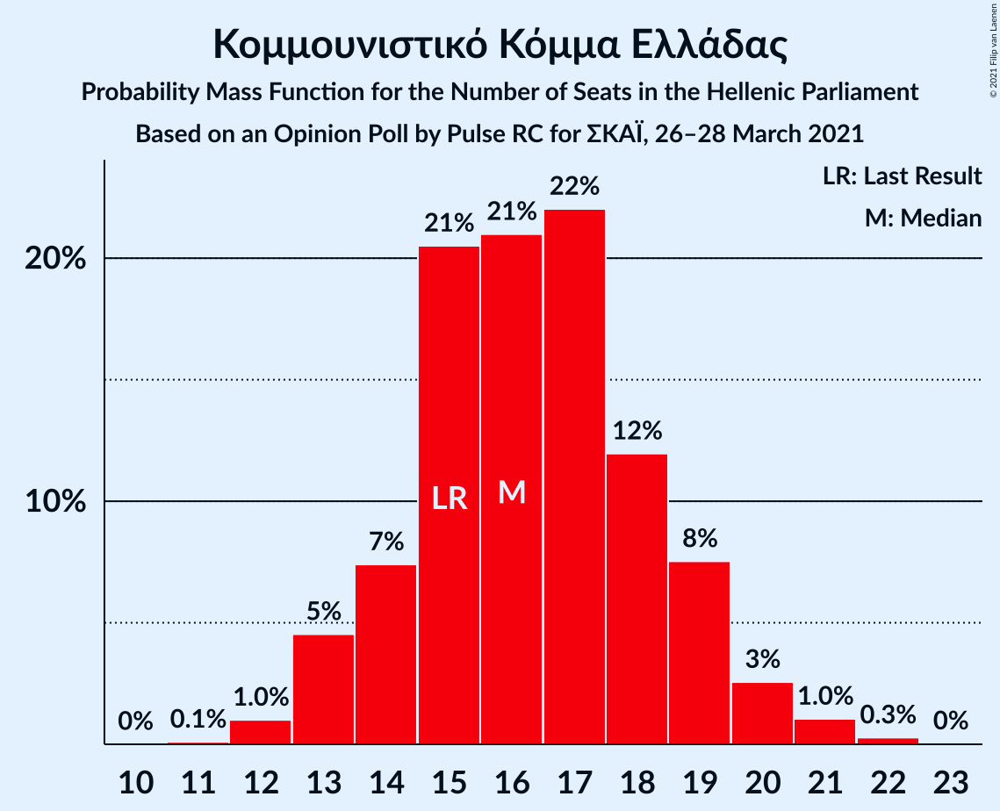
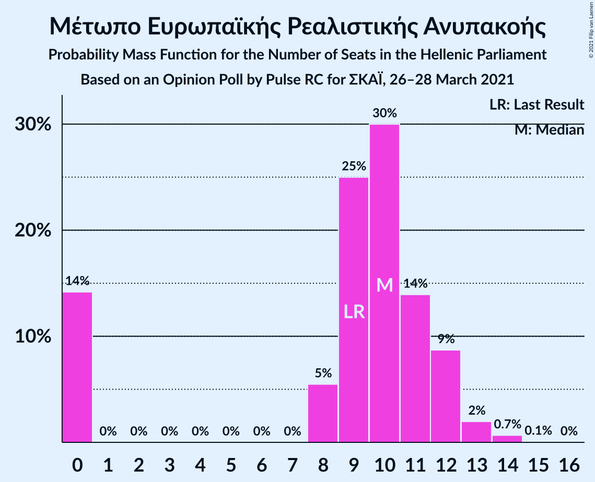
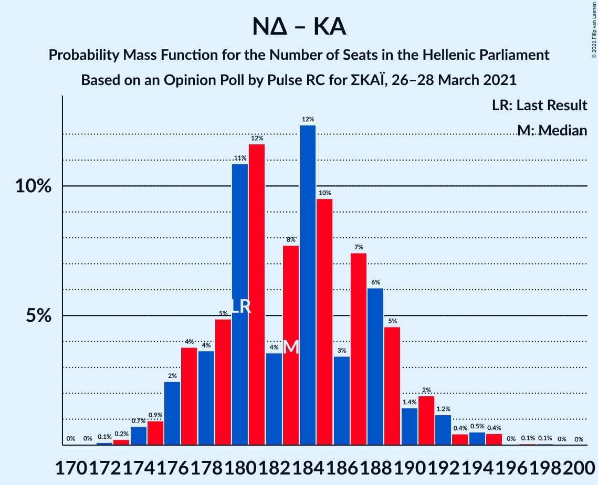
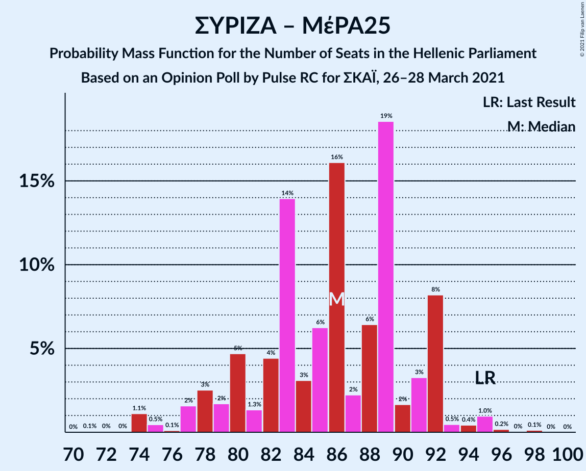
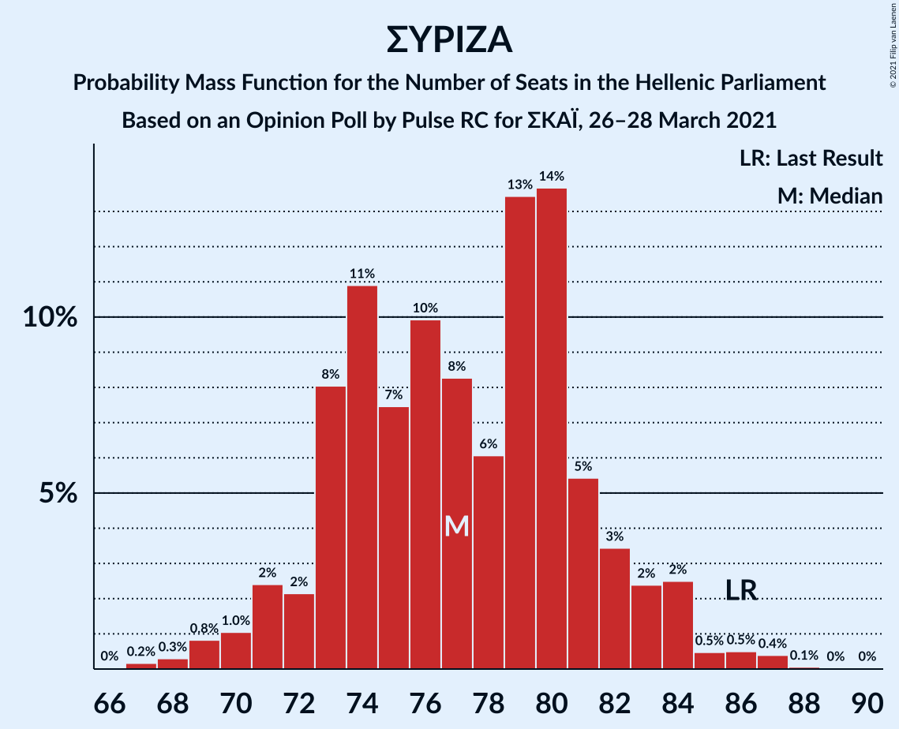

# Opinion Poll by Pulse RC for ΣΚΑΪ, 26–28 March 2021

<a href="#voting-intentions">Voting Intentions</a> | <a href="#seats">Seats</a> | <a href="#coalitions">Coalitions</a> | <a href="#technical-information">Technical Information</a>

## Voting Intentions

### Confidence Intervals

| Party | Last Result | Poll Result | 80% Confidence Interval | 90% Confidence Interval | 95% Confidence Interval | 99% Confidence Interval |
|:-----:|:-----------:|:-----------:|:-----------------------:|:-----------------------:|:-----------------------:|:-----------------------:|
| Νέα Δημοκρατία | 39.8% | 41.1% | 39.4–42.9% |38.9–43.4% |38.5–43.8% |37.6–44.7% |
| Συνασπισμός Ριζοσπαστικής Αριστεράς | 31.5% | 28.2% | 26.6–29.8% |26.2–30.3% |25.8–30.7% |25.1–31.5% |
| Κίνημα Αλλαγής | 8.1% | 7.6% | 6.7–8.6% |6.5–8.9% |6.3–9.1% |5.9–9.7% |
| Κομμουνιστικό Κόμμα Ελλάδας | 5.3% | 5.9% | 5.1–6.8% |4.9–7.1% |4.7–7.3% |4.4–7.8% |
| Ελληνική Λύση | 3.7% | 5.3% | 4.6–6.2% |4.4–6.4% |4.2–6.6% |3.9–7.1% |
| Μέτωπο Ευρωπαϊκής Ρεαλιστικής Ανυπακοής | 3.4% | 3.5% | 2.9–4.3% |2.8–4.5% |2.7–4.7% |2.4–5.1% |

*Note:* The poll result column reflects the actual value used in the calculations. Published results may vary slightly, and in addition be rounded to fewer digits.

## Seats

### Confidence Intervals

| Party | Last Result | Median | 80% Confidence Interval | 90% Confidence Interval | 95% Confidence Interval | 99% Confidence Interval |
|:-----:|:-----------:|:------:|:-----------------------:|:-----------------------:|:-----------------------:|:-----------------------:|
| <a href="#νέα-δημοκρατία">Νέα Δημοκρατία</a> | 158 | 162 | 157–167 |156–168 |155–170 |153–173 |
| <a href="#συνασπισμός-ριζοσπαστικής-αριστεράς">Συνασπισμός Ριζοσπαστικής Αριστεράς</a> | 86 | 77 | 73–81 |72–83 |71–84 |68–87 |
| <a href="#κίνημα-αλλαγής">Κίνημα Αλλαγής</a> | 22 | 21 | 19–24 |18–25 |17–25 |16–26 |
| <a href="#κομμουνιστικό-κόμμα-ελλάδας">Κομμουνιστικό Κόμμα Ελλάδας</a> | 15 | 16 | 14–19 |13–19 |13–20 |12–21 |
| <a href="#ελληνική-λύση">Ελληνική Λύση</a> | 10 | 15 | 12–17 |12–17 |12–18 |11–20 |
| <a href="#μέτωπο-ευρωπαϊκής-ρεαλιστικής-ανυπακοής">Μέτωπο Ευρωπαϊκής Ρεαλιστικής Ανυπακοής</a> | 9 | 10 | 0–12 |0–12 |0–13 |0–14 |

### Νέα Δημοκρατία

*For a full overview of the results for this party, see the [Νέα Δημοκρατία](party-νέαδημοκρατία.html) page.*

| Number of Seats | Probability | Accumulated | Special Marks |
|:---------------:|:-----------:|:-----------:|:-------------:|
| 151 | 0.1% | 100% | Majority |
| 152 | 0.2% | 99.9% |  |
| 153 | 0.5% | 99.7% |  |
| 154 | 0.7% | 99.2% |  |
| 155 | 2% | 98.5% |  |
| 156 | 3% | 97% |  |
| 157 | 4% | 94% |  |
| 158 | 6% | 89% | Last Result |
| 159 | 8% | 83% |  |
| 160 | 8% | 76% |  |
| 161 | 12% | 68% |  |
| 162 | 10% | 56% | Median |
| 163 | 6% | 46% |  |
| 164 | 5% | 40% |  |
| 165 | 9% | 34% |  |
| 166 | 9% | 25% |  |
| 167 | 8% | 16% |  |
| 168 | 4% | 8% |  |
| 169 | 1.3% | 4% |  |
| 170 | 1.2% | 3% |  |
| 171 | 0.4% | 2% |  |
| 172 | 0.6% | 2% |  |
| 173 | 0.7% | 0.9% |  |
| 174 | 0.1% | 0.2% |  |
| 175 | 0.1% | 0.1% |  |
| 176 | 0% | 0.1% |  |
| 177 | 0% | 0% |  |

### Συνασπισμός Ριζοσπαστικής Αριστεράς

*For a full overview of the results for this party, see the [Συνασπισμός Ριζοσπαστικής Αριστεράς](party-συνασπισμόςριζοσπαστικήςαριστεράς.html) page.*

| Number of Seats | Probability | Accumulated | Special Marks |
|:---------------:|:-----------:|:-----------:|:-------------:|
| 66 | 0% | 100% |  |
| 67 | 0.2% | 99.9% |  |
| 68 | 0.3% | 99.8% |  |
| 69 | 0.8% | 99.5% |  |
| 70 | 1.0% | 98.7% |  |
| 71 | 2% | 98% |  |
| 72 | 2% | 95% |  |
| 73 | 8% | 93% |  |
| 74 | 11% | 85% |  |
| 75 | 7% | 74% |  |
| 76 | 10% | 67% |  |
| 77 | 8% | 57% | Median |
| 78 | 6% | 48% |  |
| 79 | 13% | 42% |  |
| 80 | 14% | 29% |  |
| 81 | 5% | 15% |  |
| 82 | 3% | 10% |  |
| 83 | 2% | 6% |  |
| 84 | 2% | 4% |  |
| 85 | 0.5% | 2% |  |
| 86 | 0.5% | 1.0% | Last Result |
| 87 | 0.4% | 0.5% |  |
| 88 | 0.1% | 0.1% |  |
| 89 | 0% | 0.1% |  |
| 90 | 0% | 0% |  |

### Κίνημα Αλλαγής

*For a full overview of the results for this party, see the [Κίνημα Αλλαγής](party-κίνημααλλαγής.html) page.*

| Number of Seats | Probability | Accumulated | Special Marks |
|:---------------:|:-----------:|:-----------:|:-------------:|
| 15 | 0.1% | 100% |  |
| 16 | 0.8% | 99.9% |  |
| 17 | 3% | 99.1% |  |
| 18 | 6% | 96% |  |
| 19 | 20% | 90% |  |
| 20 | 17% | 70% |  |
| 21 | 15% | 53% | Median |
| 22 | 18% | 39% | Last Result |
| 23 | 9% | 21% |  |
| 24 | 6% | 11% |  |
| 25 | 4% | 5% |  |
| 26 | 0.8% | 1.1% |  |
| 27 | 0.2% | 0.3% |  |
| 28 | 0.1% | 0.1% |  |
| 29 | 0% | 0% |  |

### Κομμουνιστικό Κόμμα Ελλάδας

*For a full overview of the results for this party, see the [Κομμουνιστικό Κόμμα Ελλάδας](party-κομμουνιστικόκόμμαελλάδας.html) page.*

| Number of Seats | Probability | Accumulated | Special Marks |
|:---------------:|:-----------:|:-----------:|:-------------:|
| 11 | 0.1% | 100% |  |
| 12 | 1.0% | 99.9% |  |
| 13 | 5% | 98.9% |  |
| 14 | 7% | 94% |  |
| 15 | 21% | 87% | Last Result |
| 16 | 21% | 66% | Median |
| 17 | 22% | 45% |  |
| 18 | 12% | 23% |  |
| 19 | 8% | 11% |  |
| 20 | 3% | 4% |  |
| 21 | 1.0% | 1.4% |  |
| 22 | 0.3% | 0.3% |  |
| 23 | 0% | 0% |  |

### Ελληνική Λύση

*For a full overview of the results for this party, see the [Ελληνική Λύση](party-ελληνικήλύση.html) page.*

| Number of Seats | Probability | Accumulated | Special Marks |
|:---------------:|:-----------:|:-----------:|:-------------:|
| 10 | 0.3% | 100% | Last Result |
| 11 | 2% | 99.6% |  |
| 12 | 9% | 98% |  |
| 13 | 17% | 89% |  |
| 14 | 20% | 73% |  |
| 15 | 29% | 52% | Median |
| 16 | 12% | 23% |  |
| 17 | 7% | 11% |  |
| 18 | 2% | 4% |  |
| 19 | 2% | 2% |  |
| 20 | 0.4% | 0.5% |  |
| 21 | 0.1% | 0.1% |  |
| 22 | 0% | 0% |  |

### Μέτωπο Ευρωπαϊκής Ρεαλιστικής Ανυπακοής

*For a full overview of the results for this party, see the [Μέτωπο Ευρωπαϊκής Ρεαλιστικής Ανυπακοής](party-μέτωποευρωπαϊκήςρεαλιστικήςανυπακοής.html) page.*

| Number of Seats | Probability | Accumulated | Special Marks |
|:---------------:|:-----------:|:-----------:|:-------------:|
| 0 | 14% | 100% |  |
| 1 | 0% | 86% |  |
| 2 | 0% | 86% |  |
| 3 | 0% | 86% |  |
| 4 | 0% | 86% |  |
| 5 | 0% | 86% |  |
| 6 | 0% | 86% |  |
| 7 | 0% | 86% |  |
| 8 | 5% | 86% |  |
| 9 | 25% | 80% | Last Result |
| 10 | 30% | 55% | Median |
| 11 | 14% | 25% |  |
| 12 | 9% | 11% |  |
| 13 | 2% | 3% |  |
| 14 | 0.7% | 0.8% |  |
| 15 | 0.1% | 0.1% |  |
| 16 | 0% | 0% |  |

## Coalitions

### Confidence Intervals

| Coalition | Last Result | Median | Majority? | 80% Confidence Interval | 90% Confidence Interval | 95% Confidence Interval | 99% Confidence Interval |
|:---------:|:-----------:|:------:|:---------:|:-----------------------:|:-----------------------:|:-----------------------:|:-----------------------:|
| Νέα Δημοκρατία – Κίνημα Αλλαγής | 180 | 183 | 100% | 178–189 | 177–190 | 176–192 | 174–195 |
| Νέα Δημοκρατία | 158 | 162 | 100% | 157–167 | 156–168 | 155–170 | 153–173 |
| Συνασπισμός Ριζοσπαστικής Αριστεράς – Μέτωπο Ευρωπαϊκής Ρεαλιστικής Ανυπακοής | 95 | 86 | 0% | 80–92 | 78–92 | 77–92 | 74–95 |
| Συνασπισμός Ριζοσπαστικής Αριστεράς | 86 | 77 | 0% | 73–81 | 72–83 | 71–84 | 68–87 |

### Νέα Δημοκρατία – Κίνημα Αλλαγής

| Number of Seats | Probability | Accumulated | Special Marks |
|:---------------:|:-----------:|:-----------:|:-------------:|
| 171 | 0% | 100% |  |
| 172 | 0.1% | 99.9% |  |
| 173 | 0.2% | 99.8% |  |
| 174 | 0.7% | 99.6% |  |
| 175 | 0.9% | 98.9% |  |
| 176 | 2% | 98% |  |
| 177 | 4% | 95% |  |
| 178 | 4% | 92% |  |
| 179 | 5% | 88% |  |
| 180 | 11% | 83% | Last Result |
| 181 | 12% | 72% |  |
| 182 | 4% | 61% |  |
| 183 | 8% | 57% | Median |
| 184 | 12% | 49% |  |
| 185 | 10% | 37% |  |
| 186 | 3% | 28% |  |
| 187 | 7% | 24% |  |
| 188 | 6% | 17% |  |
| 189 | 5% | 11% |  |
| 190 | 1.4% | 6% |  |
| 191 | 2% | 5% |  |
| 192 | 1.2% | 3% |  |
| 193 | 0.4% | 2% |  |
| 194 | 0.5% | 1.1% |  |
| 195 | 0.4% | 0.6% |  |
| 196 | 0% | 0.2% |  |
| 197 | 0.1% | 0.1% |  |
| 198 | 0.1% | 0.1% |  |
| 199 | 0% | 0% |  |

### Νέα Δημοκρατία

| Number of Seats | Probability | Accumulated | Special Marks |
|:---------------:|:-----------:|:-----------:|:-------------:|
| 151 | 0.1% | 100% | Majority |
| 152 | 0.2% | 99.9% |  |
| 153 | 0.5% | 99.7% |  |
| 154 | 0.7% | 99.2% |  |
| 155 | 2% | 98.5% |  |
| 156 | 3% | 97% |  |
| 157 | 4% | 94% |  |
| 158 | 6% | 89% | Last Result |
| 159 | 8% | 83% |  |
| 160 | 8% | 76% |  |
| 161 | 12% | 68% |  |
| 162 | 10% | 56% | Median |
| 163 | 6% | 46% |  |
| 164 | 5% | 40% |  |
| 165 | 9% | 34% |  |
| 166 | 9% | 25% |  |
| 167 | 8% | 16% |  |
| 168 | 4% | 8% |  |
| 169 | 1.3% | 4% |  |
| 170 | 1.2% | 3% |  |
| 171 | 0.4% | 2% |  |
| 172 | 0.6% | 2% |  |
| 173 | 0.7% | 0.9% |  |
| 174 | 0.1% | 0.2% |  |
| 175 | 0.1% | 0.1% |  |
| 176 | 0% | 0.1% |  |
| 177 | 0% | 0% |  |

### Συνασπισμός Ριζοσπαστικής Αριστεράς – Μέτωπο Ευρωπαϊκής Ρεαλιστικής Ανυπακοής

| Number of Seats | Probability | Accumulated | Special Marks |
|:---------------:|:-----------:|:-----------:|:-------------:|
| 71 | 0.1% | 100% |  |
| 72 | 0% | 99.9% |  |
| 73 | 0% | 99.9% |  |
| 74 | 1.1% | 99.8% |  |
| 75 | 0.5% | 98.7% |  |
| 76 | 0.1% | 98% |  |
| 77 | 2% | 98% |  |
| 78 | 3% | 97% |  |
| 79 | 2% | 94% |  |
| 80 | 5% | 92% |  |
| 81 | 1.3% | 88% |  |
| 82 | 4% | 86% |  |
| 83 | 14% | 82% |  |
| 84 | 3% | 68% |  |
| 85 | 6% | 65% |  |
| 86 | 16% | 59% |  |
| 87 | 2% | 43% | Median |
| 88 | 6% | 40% |  |
| 89 | 19% | 34% |  |
| 90 | 2% | 15% |  |
| 91 | 3% | 14% |  |
| 92 | 8% | 10% |  |
| 93 | 0.5% | 2% |  |
| 94 | 0.4% | 2% |  |
| 95 | 1.0% | 1.3% | Last Result |
| 96 | 0.2% | 0.3% |  |
| 97 | 0% | 0.2% |  |
| 98 | 0.1% | 0.1% |  |
| 99 | 0% | 0% |  |

### Συνασπισμός Ριζοσπαστικής Αριστεράς

| Number of Seats | Probability | Accumulated | Special Marks |
|:---------------:|:-----------:|:-----------:|:-------------:|
| 66 | 0% | 100% |  |
| 67 | 0.2% | 99.9% |  |
| 68 | 0.3% | 99.8% |  |
| 69 | 0.8% | 99.5% |  |
| 70 | 1.0% | 98.7% |  |
| 71 | 2% | 98% |  |
| 72 | 2% | 95% |  |
| 73 | 8% | 93% |  |
| 74 | 11% | 85% |  |
| 75 | 7% | 74% |  |
| 76 | 10% | 67% |  |
| 77 | 8% | 57% | Median |
| 78 | 6% | 48% |  |
| 79 | 13% | 42% |  |
| 80 | 14% | 29% |  |
| 81 | 5% | 15% |  |
| 82 | 3% | 10% |  |
| 83 | 2% | 6% |  |
| 84 | 2% | 4% |  |
| 85 | 0.5% | 2% |  |
| 86 | 0.5% | 1.0% | Last Result |
| 87 | 0.4% | 0.5% |  |
| 88 | 0.1% | 0.1% |  |
| 89 | 0% | 0.1% |  |
| 90 | 0% | 0% |  |

## Technical Information

### Opinion Poll

+ **Polling firm:** Pulse RC
+ **Commissioner(s):** ΣΚΑΪ
+ **Fieldwork period:** 26–28 March 2021

### Calculations

+ **Sample size:** 1306
+ **Simulations done:** 131,072
+ **Error estimate:** 0.64%

