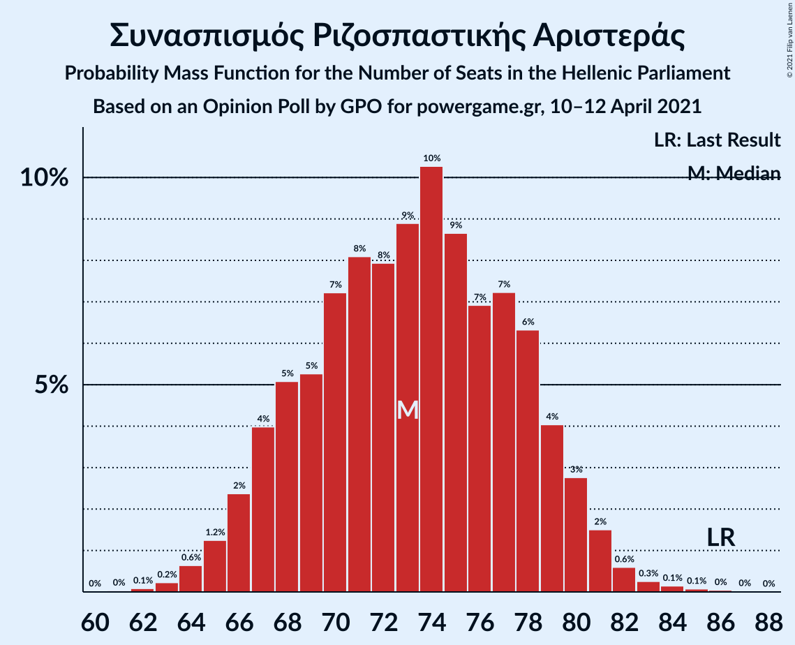
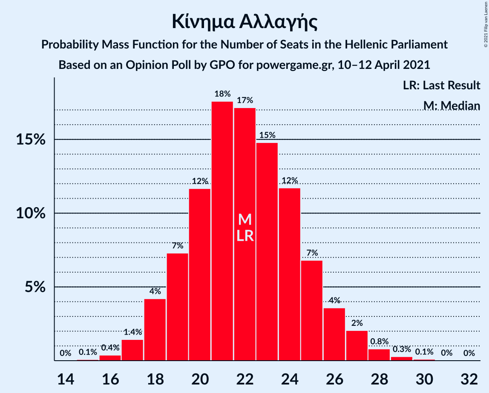
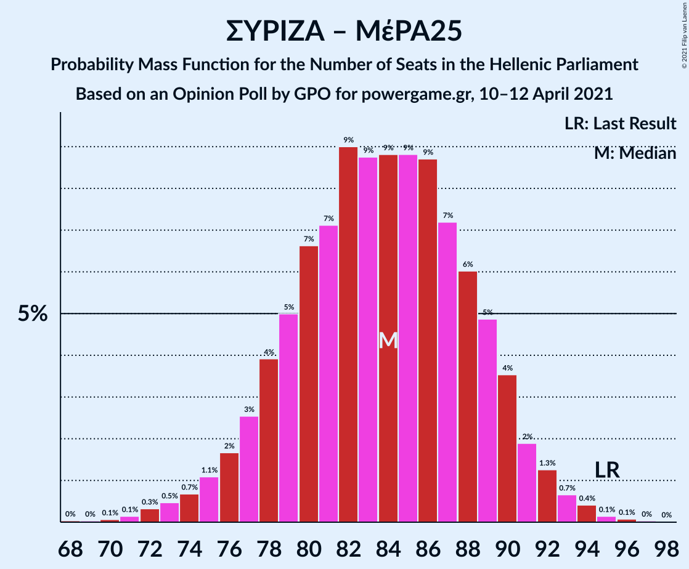

# Opinion Poll by GPO for powergame.gr, 10–12 April 2021

<a href="#voting-intentions">Voting Intentions</a> | <a href="#seats">Seats</a> | <a href="#coalitions">Coalitions</a> | <a href="#technical-information">Technical Information</a>

## Voting Intentions

### Confidence Intervals

| Party | Last Result | Poll Result | 80% Confidence Interval | 90% Confidence Interval | 95% Confidence Interval | 99% Confidence Interval |
|:-----:|:-----------:|:-----------:|:-----------------------:|:-----------------------:|:-----------------------:|:-----------------------:|
| Νέα Δημοκρατία | 39.8% | 42.5% | 40.5–44.5% |39.9–45.1% |39.5–45.6% |38.5–46.6% |
| Συνασπισμός Ριζοσπαστικής Αριστεράς | 31.5% | 27.8% | 26.0–29.7% |25.5–30.2% |25.1–30.7% |24.3–31.6% |
| Κίνημα Αλλαγής | 8.1% | 8.3% | 7.3–9.5% |7.0–9.9% |6.7–10.2% |6.3–10.8% |
| Κομμουνιστικό Κόμμα Ελλάδας | 5.3% | 7.6% | 6.6–8.8% |6.3–9.1% |6.1–9.4% |5.7–10.0% |
| Ελληνική Λύση | 3.7% | 4.7% | 3.9–5.7% |3.7–6.0% |3.6–6.2% |3.2–6.7% |
| Μέτωπο Ευρωπαϊκής Ρεαλιστικής Ανυπακοής | 3.4% | 4.0% | 3.3–4.9% |3.1–5.2% |2.9–5.4% |2.7–5.9% |

*Note:* The poll result column reflects the actual value used in the calculations. Published results may vary slightly, and in addition be rounded to fewer digits.

## Seats

### Confidence Intervals

| Party | Last Result | Median | 80% Confidence Interval | 90% Confidence Interval | 95% Confidence Interval | 99% Confidence Interval |
|:-----:|:-----------:|:------:|:-----------------------:|:-----------------------:|:-----------------------:|:-----------------------:|
| <a href="#νέα-δημοκρατία">Νέα Δημοκρατία</a> | 158 | 161 | 154–167 |153–169 |153–171 |150–173 |
| <a href="#συνασπισμός-ριζοσπαστικής-αριστεράς">Συνασπισμός Ριζοσπαστικής Αριστεράς</a> | 86 | 77 | 66–79 |65–80 |65–80 |64–81 |
| <a href="#κίνημα-αλλαγής">Κίνημα Αλλαγής</a> | 22 | 22 | 18–25 |18–27 |18–27 |17–28 |
| <a href="#κομμουνιστικό-κόμμα-ελλάδας">Κομμουνιστικό Κόμμα Ελλάδας</a> | 15 | 20 | 17–23 |17–24 |16–25 |15–26 |
| <a href="#ελληνική-λύση">Ελληνική Λύση</a> | 10 | 12 | 10–15 |9–16 |9–16 |8–18 |
| <a href="#μέτωπο-ευρωπαϊκής-ρεαλιστικής-ανυπακοής">Μέτωπο Ευρωπαϊκής Ρεαλιστικής Ανυπακοής</a> | 9 | 11 | 8–13 |0–14 |0–14 |0–16 |

### Νέα Δημοκρατία

*For a full overview of the results for this party, see the [Νέα Δημοκρατία](party-νέαδημοκρατία.html) page.*

| Number of Seats | Probability | Accumulated | Special Marks |
|:---------------:|:-----------:|:-----------:|:-------------:|
| 148 | 0% | 100% |  |
| 149 | 0.1% | 99.9% |  |
| 150 | 0.4% | 99.8% |  |
| 151 | 0.4% | 99.5% | Majority |
| 152 | 0.8% | 99.0% |  |
| 153 | 4% | 98% |  |
| 154 | 5% | 94% |  |
| 155 | 3% | 89% |  |
| 156 | 4% | 86% |  |
| 157 | 9% | 82% |  |
| 158 | 5% | 73% | Last Result |
| 159 | 6% | 68% |  |
| 160 | 4% | 62% |  |
| 161 | 13% | 58% | Median |
| 162 | 14% | 45% |  |
| 163 | 5% | 31% |  |
| 164 | 3% | 26% |  |
| 165 | 3% | 23% |  |
| 166 | 4% | 20% |  |
| 167 | 6% | 16% |  |
| 168 | 3% | 10% |  |
| 169 | 2% | 7% |  |
| 170 | 2% | 4% |  |
| 171 | 2% | 3% |  |
| 172 | 0.4% | 1.0% |  |
| 173 | 0.2% | 0.6% |  |
| 174 | 0.2% | 0.4% |  |
| 175 | 0.1% | 0.2% |  |
| 176 | 0.1% | 0.1% |  |
| 177 | 0% | 0.1% |  |
| 178 | 0% | 0% |  |

### Συνασπισμός Ριζοσπαστικής Αριστεράς

*For a full overview of the results for this party, see the [Συνασπισμός Ριζοσπαστικής Αριστεράς](party-συνασπισμόςριζοσπαστικήςαριστεράς.html) page.*

| Number of Seats | Probability | Accumulated | Special Marks |
|:---------------:|:-----------:|:-----------:|:-------------:|
| 62 | 0.1% | 100% |  |
| 63 | 0.4% | 99.9% |  |
| 64 | 2% | 99.5% |  |
| 65 | 3% | 98% |  |
| 66 | 7% | 95% |  |
| 67 | 8% | 88% |  |
| 68 | 5% | 80% |  |
| 69 | 2% | 75% |  |
| 70 | 0.6% | 72% |  |
| 71 | 0.2% | 72% |  |
| 72 | 0% | 72% |  |
| 73 | 0.3% | 72% |  |
| 74 | 1.3% | 71% |  |
| 75 | 4% | 70% |  |
| 76 | 14% | 66% |  |
| 77 | 17% | 53% | Median |
| 78 | 18% | 36% |  |
| 79 | 11% | 18% |  |
| 80 | 5% | 6% |  |
| 81 | 1.3% | 2% |  |
| 82 | 0.2% | 0.2% |  |
| 83 | 0% | 0% |  |
| 84 | 0% | 0% |  |
| 85 | 0% | 0% |  |
| 86 | 0% | 0% | Last Result |

### Κίνημα Αλλαγής

*For a full overview of the results for this party, see the [Κίνημα Αλλαγής](party-κίνημααλλαγής.html) page.*

| Number of Seats | Probability | Accumulated | Special Marks |
|:---------------:|:-----------:|:-----------:|:-------------:|
| 15 | 0.1% | 100% |  |
| 16 | 0.2% | 99.9% |  |
| 17 | 1.3% | 99.7% |  |
| 18 | 8% | 98% |  |
| 19 | 5% | 90% |  |
| 20 | 5% | 85% |  |
| 21 | 27% | 80% |  |
| 22 | 15% | 53% | Last Result, Median |
| 23 | 12% | 38% |  |
| 24 | 16% | 26% |  |
| 25 | 3% | 11% |  |
| 26 | 2% | 8% |  |
| 27 | 4% | 5% |  |
| 28 | 0.9% | 1.2% |  |
| 29 | 0.1% | 0.3% |  |
| 30 | 0.1% | 0.1% |  |
| 31 | 0% | 0% |  |

### Κομμουνιστικό Κόμμα Ελλάδας

*For a full overview of the results for this party, see the [Κομμουνιστικό Κόμμα Ελλάδας](party-κομμουνιστικόκόμμαελλάδας.html) page.*

| Number of Seats | Probability | Accumulated | Special Marks |
|:---------------:|:-----------:|:-----------:|:-------------:|
| 14 | 0.2% | 100% |  |
| 15 | 0.9% | 99.7% | Last Result |
| 16 | 3% | 98.8% |  |
| 17 | 6% | 96% |  |
| 18 | 11% | 89% |  |
| 19 | 18% | 78% |  |
| 20 | 17% | 60% | Median |
| 21 | 18% | 44% |  |
| 22 | 11% | 26% |  |
| 23 | 8% | 15% |  |
| 24 | 5% | 7% |  |
| 25 | 1.4% | 3% |  |
| 26 | 0.9% | 1.3% |  |
| 27 | 0.3% | 0.4% |  |
| 28 | 0.1% | 0.1% |  |
| 29 | 0% | 0% |  |

### Ελληνική Λύση

*For a full overview of the results for this party, see the [Ελληνική Λύση](party-ελληνικήλύση.html) page.*

| Number of Seats | Probability | Accumulated | Special Marks |
|:---------------:|:-----------:|:-----------:|:-------------:|
| 0 | 0.2% | 100% |  |
| 1 | 0% | 99.8% |  |
| 2 | 0% | 99.8% |  |
| 3 | 0% | 99.8% |  |
| 4 | 0% | 99.8% |  |
| 5 | 0% | 99.8% |  |
| 6 | 0% | 99.8% |  |
| 7 | 0% | 99.8% |  |
| 8 | 0.4% | 99.8% |  |
| 9 | 5% | 99.4% |  |
| 10 | 17% | 95% | Last Result |
| 11 | 16% | 77% |  |
| 12 | 18% | 62% | Median |
| 13 | 18% | 44% |  |
| 14 | 12% | 26% |  |
| 15 | 7% | 13% |  |
| 16 | 4% | 7% |  |
| 17 | 2% | 2% |  |
| 18 | 0.5% | 0.6% |  |
| 19 | 0.1% | 0.2% |  |
| 20 | 0% | 0% |  |

### Μέτωπο Ευρωπαϊκής Ρεαλιστικής Ανυπακοής

*For a full overview of the results for this party, see the [Μέτωπο Ευρωπαϊκής Ρεαλιστικής Ανυπακοής](party-μέτωποευρωπαϊκήςρεαλιστικήςανυπακοής.html) page.*

| Number of Seats | Probability | Accumulated | Special Marks |
|:---------------:|:-----------:|:-----------:|:-------------:|
| 0 | 5% | 100% |  |
| 1 | 0% | 95% |  |
| 2 | 0% | 95% |  |
| 3 | 0% | 95% |  |
| 4 | 0% | 95% |  |
| 5 | 0% | 95% |  |
| 6 | 0% | 95% |  |
| 7 | 0% | 95% |  |
| 8 | 5% | 95% |  |
| 9 | 16% | 90% | Last Result |
| 10 | 23% | 74% |  |
| 11 | 24% | 51% | Median |
| 12 | 13% | 27% |  |
| 13 | 9% | 14% |  |
| 14 | 4% | 6% |  |
| 15 | 1.1% | 2% |  |
| 16 | 0.4% | 0.6% |  |
| 17 | 0.1% | 0.2% |  |
| 18 | 0% | 0% |  |

## Coalitions

### Confidence Intervals

| Coalition | Last Result | Median | Majority? | 80% Confidence Interval | 90% Confidence Interval | 95% Confidence Interval | 99% Confidence Interval |
|:---------:|:-----------:|:------:|:---------:|:-----------------------:|:-----------------------:|:-----------------------:|:-----------------------:|
| Νέα Δημοκρατία – Κίνημα Αλλαγής | 180 | 183 | 100% | 177–189 | 176–191 | 175–193 | 172–195 |
| Νέα Δημοκρατία | 158 | 161 | 99.5% | 154–167 | 153–169 | 153–171 | 150–173 |
| Συνασπισμός Ριζοσπαστικής Αριστεράς – Μέτωπο Ευρωπαϊκής Ρεαλιστικής Ανυπακοής | 95 | 86 | 0% | 77–90 | 76–91 | 75–92 | 73–94 |
| Συνασπισμός Ριζοσπαστικής Αριστεράς | 86 | 77 | 0% | 66–79 | 65–80 | 65–80 | 64–81 |

### Νέα Δημοκρατία – Κίνημα Αλλαγής

| Number of Seats | Probability | Accumulated | Special Marks |
|:---------------:|:-----------:|:-----------:|:-------------:|
| 170 | 0.1% | 100% |  |
| 171 | 0.3% | 99.9% |  |
| 172 | 0.5% | 99.6% |  |
| 173 | 0.2% | 99.1% |  |
| 174 | 0.7% | 98.9% |  |
| 175 | 2% | 98% |  |
| 176 | 3% | 96% |  |
| 177 | 8% | 93% |  |
| 178 | 7% | 84% |  |
| 179 | 1.2% | 78% |  |
| 180 | 6% | 77% | Last Result |
| 181 | 7% | 70% |  |
| 182 | 10% | 63% |  |
| 183 | 17% | 54% | Median |
| 184 | 4% | 37% |  |
| 185 | 3% | 32% |  |
| 186 | 6% | 29% |  |
| 187 | 3% | 23% |  |
| 188 | 8% | 20% |  |
| 189 | 3% | 11% |  |
| 190 | 1.4% | 9% |  |
| 191 | 3% | 7% |  |
| 192 | 2% | 4% |  |
| 193 | 1.3% | 3% |  |
| 194 | 1.0% | 1.5% |  |
| 195 | 0.2% | 0.5% |  |
| 196 | 0.1% | 0.4% |  |
| 197 | 0.2% | 0.3% |  |
| 198 | 0.1% | 0.1% |  |
| 199 | 0% | 0.1% |  |
| 200 | 0% | 0% |  |

### Νέα Δημοκρατία

| Number of Seats | Probability | Accumulated | Special Marks |
|:---------------:|:-----------:|:-----------:|:-------------:|
| 148 | 0% | 100% |  |
| 149 | 0.1% | 99.9% |  |
| 150 | 0.4% | 99.8% |  |
| 151 | 0.4% | 99.5% | Majority |
| 152 | 0.8% | 99.0% |  |
| 153 | 4% | 98% |  |
| 154 | 5% | 94% |  |
| 155 | 3% | 89% |  |
| 156 | 4% | 86% |  |
| 157 | 9% | 82% |  |
| 158 | 5% | 73% | Last Result |
| 159 | 6% | 68% |  |
| 160 | 4% | 62% |  |
| 161 | 13% | 58% | Median |
| 162 | 14% | 45% |  |
| 163 | 5% | 31% |  |
| 164 | 3% | 26% |  |
| 165 | 3% | 23% |  |
| 166 | 4% | 20% |  |
| 167 | 6% | 16% |  |
| 168 | 3% | 10% |  |
| 169 | 2% | 7% |  |
| 170 | 2% | 4% |  |
| 171 | 2% | 3% |  |
| 172 | 0.4% | 1.0% |  |
| 173 | 0.2% | 0.6% |  |
| 174 | 0.2% | 0.4% |  |
| 175 | 0.1% | 0.2% |  |
| 176 | 0.1% | 0.1% |  |
| 177 | 0% | 0.1% |  |
| 178 | 0% | 0% |  |

### Συνασπισμός Ριζοσπαστικής Αριστεράς – Μέτωπο Ευρωπαϊκής Ρεαλιστικής Ανυπακοής

| Number of Seats | Probability | Accumulated | Special Marks |
|:---------------:|:-----------:|:-----------:|:-------------:|
| 66 | 0% | 100% |  |
| 67 | 0% | 99.9% |  |
| 68 | 0% | 99.9% |  |
| 69 | 0% | 99.9% |  |
| 70 | 0% | 99.9% |  |
| 71 | 0.1% | 99.9% |  |
| 72 | 0.1% | 99.8% |  |
| 73 | 0.5% | 99.7% |  |
| 74 | 0.9% | 99.2% |  |
| 75 | 2% | 98% |  |
| 76 | 3% | 97% |  |
| 77 | 4% | 93% |  |
| 78 | 5% | 89% |  |
| 79 | 4% | 83% |  |
| 80 | 6% | 79% |  |
| 81 | 2% | 73% |  |
| 82 | 2% | 71% |  |
| 83 | 3% | 68% |  |
| 84 | 1.5% | 65% |  |
| 85 | 6% | 64% |  |
| 86 | 14% | 58% |  |
| 87 | 10% | 44% |  |
| 88 | 9% | 34% | Median |
| 89 | 11% | 25% |  |
| 90 | 7% | 14% |  |
| 91 | 2% | 6% |  |
| 92 | 2% | 4% |  |
| 93 | 1.2% | 2% |  |
| 94 | 0.6% | 0.9% |  |
| 95 | 0.2% | 0.3% | Last Result |
| 96 | 0.1% | 0.1% |  |
| 97 | 0% | 0% |  |

### Συνασπισμός Ριζοσπαστικής Αριστεράς

| Number of Seats | Probability | Accumulated | Special Marks |
|:---------------:|:-----------:|:-----------:|:-------------:|
| 62 | 0.1% | 100% |  |
| 63 | 0.4% | 99.9% |  |
| 64 | 2% | 99.5% |  |
| 65 | 3% | 98% |  |
| 66 | 7% | 95% |  |
| 67 | 8% | 88% |  |
| 68 | 5% | 80% |  |
| 69 | 2% | 75% |  |
| 70 | 0.6% | 72% |  |
| 71 | 0.2% | 72% |  |
| 72 | 0% | 72% |  |
| 73 | 0.3% | 72% |  |
| 74 | 1.3% | 71% |  |
| 75 | 4% | 70% |  |
| 76 | 14% | 66% |  |
| 77 | 17% | 53% | Median |
| 78 | 18% | 36% |  |
| 79 | 11% | 18% |  |
| 80 | 5% | 6% |  |
| 81 | 1.3% | 2% |  |
| 82 | 0.2% | 0.2% |  |
| 83 | 0% | 0% |  |
| 84 | 0% | 0% |  |
| 85 | 0% | 0% |  |
| 86 | 0% | 0% | Last Result |

## Technical Information

### Opinion Poll

+ **Polling firm:** GPO
+ **Commissioner(s):** powergame.gr
+ **Fieldwork period:** 10–12 April 2021

### Calculations

+ **Sample size:** 1000
+ **Simulations done:** 131,072
+ **Error estimate:** 0.62%

