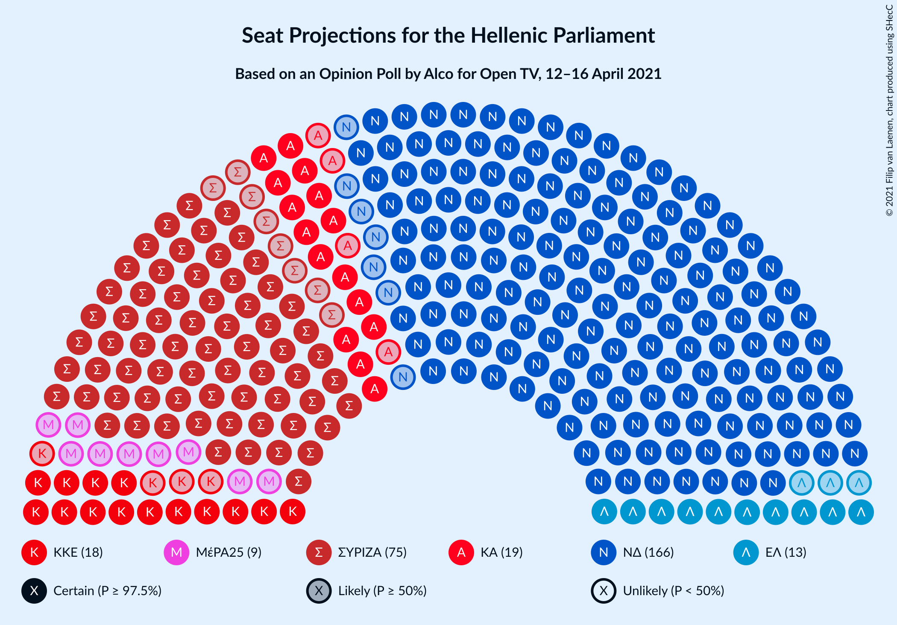
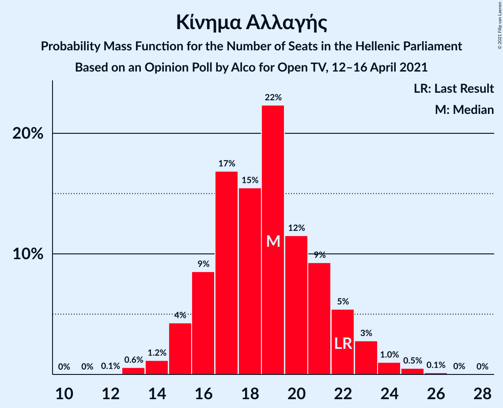
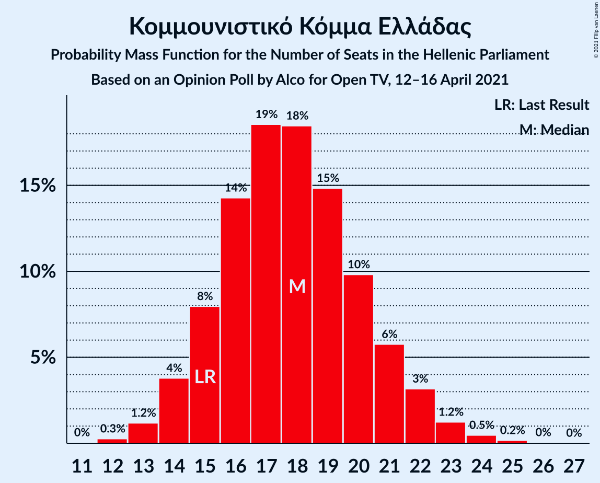

# Opinion Poll by Alco for Open TV, 12–16 April 2021

<a href="#voting-intentions">Voting Intentions</a> | <a href="#seats">Seats</a> | <a href="#coalitions">Coalitions</a> | <a href="#technical-information">Technical Information</a>

## Voting Intentions

### Confidence Intervals

| Party | Last Result | Poll Result | 80% Confidence Interval | 90% Confidence Interval | 95% Confidence Interval | 99% Confidence Interval |
|:-----:|:-----------:|:-----------:|:-----------------------:|:-----------------------:|:-----------------------:|:-----------------------:|
| Νέα Δημοκρατία | 39.8% | 43.3% | 41.3–45.3% |40.7–45.9% |40.3–46.4% |39.3–47.4% |
| Συνασπισμός Ριζοσπαστικής Αριστεράς | 31.5% | 27.6% | 25.8–29.5% |25.3–30.0% |24.9–30.5% |24.1–31.4% |
| Κίνημα Αλλαγής | 8.1% | 6.8% | 5.9–7.9% |5.6–8.3% |5.4–8.5% |5.0–9.1% |
| Κομμουνιστικό Κόμμα Ελλάδας | 5.3% | 6.5% | 5.6–7.6% |5.3–7.9% |5.1–8.2% |4.7–8.8% |
| Ελληνική Λύση | 3.7% | 4.9% | 4.1–5.9% |3.9–6.2% |3.7–6.4% |3.4–6.9% |
| Μέτωπο Ευρωπαϊκής Ρεαλιστικής Ανυπακοής | 3.4% | 3.4% | 2.8–4.3% |2.6–4.5% |2.4–4.7% |2.2–5.2% |
| Πλεύση Ελευθερίας | 1.5% | 1.6% | 1.2–2.2% |1.1–2.4% |1.0–2.6% |0.8–2.9% |

*Note:* The poll result column reflects the actual value used in the calculations. Published results may vary slightly, and in addition be rounded to fewer digits.

## Seats

### Confidence Intervals

| Party | Last Result | Median | 80% Confidence Interval | 90% Confidence Interval | 95% Confidence Interval | 99% Confidence Interval |
|:-----:|:-----------:|:------:|:-----------------------:|:-----------------------:|:-----------------------:|:-----------------------:|
| <a href="#νέα-δημοκρατία">Νέα Δημοκρατία</a> | 158 | 164 | 155–169 |155–170 |154–170 |153–170 |
| <a href="#συνασπισμός-ριζοσπαστικής-αριστεράς">Συνασπισμός Ριζοσπαστικής Αριστεράς</a> | 86 | 70 | 64–88 |64–89 |64–89 |64–91 |
| <a href="#κίνημα-αλλαγής">Κίνημα Αλλαγής</a> | 22 | 19 | 15–22 |15–22 |15–23 |15–26 |
| <a href="#κομμουνιστικό-κόμμα-ελλάδας">Κομμουνιστικό Κόμμα Ελλάδας</a> | 15 | 19 | 14–21 |14–21 |14–21 |14–23 |
| <a href="#ελληνική-λύση">Ελληνική Λύση</a> | 10 | 18 | 13–18 |13–18 |13–18 |12–18 |
| <a href="#μέτωπο-ευρωπαϊκής-ρεαλιστικής-ανυπακοής">Μέτωπο Ευρωπαϊκής Ρεαλιστικής Ανυπακοής</a> | 9 | 13 | 9–14 |9–14 |9–14 |9–14 |
| <a href="#πλεύση-ελευθερίας">Πλεύση Ελευθερίας</a> | 0 | 0 | 0 |0 |0 |0 |

### Νέα Δημοκρατία

*For a full overview of the results for this party, see the [Νέα Δημοκρατία](party-νέαδημοκρατία.html) page.*

| Number of Seats | Probability | Accumulated | Special Marks |
|:---------------:|:-----------:|:-----------:|:-------------:|
| 152 | 0.2% | 100% |  |
| 153 | 0.4% | 99.8% |  |
| 154 | 3% | 99.4% |  |
| 155 | 13% | 97% |  |
| 156 | 0.1% | 84% |  |
| 157 | 3% | 84% |  |
| 158 | 1.1% | 81% | Last Result |
| 159 | 0.1% | 80% |  |
| 160 | 0.4% | 80% |  |
| 161 | 0.1% | 79% |  |
| 162 | 0.2% | 79% |  |
| 163 | 17% | 79% |  |
| 164 | 18% | 62% | Median |
| 165 | 4% | 44% |  |
| 166 | 12% | 39% |  |
| 167 | 15% | 27% |  |
| 168 | 0.6% | 12% |  |
| 169 | 3% | 11% |  |
| 170 | 8% | 8% |  |
| 171 | 0.2% | 0.2% |  |
| 172 | 0% | 0% |  |

### Συνασπισμός Ριζοσπαστικής Αριστεράς

*For a full overview of the results for this party, see the [Συνασπισμός Ριζοσπαστικής Αριστεράς](party-συνασπισμόςριζοσπαστικήςαριστεράς.html) page.*

| Number of Seats | Probability | Accumulated | Special Marks |
|:---------------:|:-----------:|:-----------:|:-------------:|
| 61 | 0.1% | 100% |  |
| 62 | 0.1% | 99.9% |  |
| 63 | 0% | 99.8% |  |
| 64 | 11% | 99.7% |  |
| 65 | 2% | 88% |  |
| 66 | 3% | 86% |  |
| 67 | 9% | 83% |  |
| 68 | 15% | 74% |  |
| 69 | 0.4% | 59% |  |
| 70 | 19% | 59% | Median |
| 71 | 19% | 40% |  |
| 72 | 0.2% | 21% |  |
| 73 | 0% | 20% |  |
| 74 | 0% | 20% |  |
| 75 | 0% | 20% |  |
| 76 | 0% | 20% |  |
| 77 | 0.1% | 20% |  |
| 78 | 0% | 20% |  |
| 79 | 0% | 20% |  |
| 80 | 0% | 20% |  |
| 81 | 0% | 20% |  |
| 82 | 0% | 20% |  |
| 83 | 1.5% | 20% |  |
| 84 | 1.1% | 19% |  |
| 85 | 4% | 18% |  |
| 86 | 0% | 14% | Last Result |
| 87 | 0% | 14% |  |
| 88 | 7% | 14% |  |
| 89 | 6% | 7% |  |
| 90 | 0.2% | 0.7% |  |
| 91 | 0.2% | 0.6% |  |
| 92 | 0.4% | 0.4% |  |
| 93 | 0% | 0% |  |

### Κίνημα Αλλαγής

*For a full overview of the results for this party, see the [Κίνημα Αλλαγής](party-κίνημααλλαγής.html) page.*

| Number of Seats | Probability | Accumulated | Special Marks |
|:---------------:|:-----------:|:-----------:|:-------------:|
| 12 | 0.1% | 100% |  |
| 13 | 0% | 99.9% |  |
| 14 | 0.1% | 99.9% |  |
| 15 | 18% | 99.8% |  |
| 16 | 1.4% | 82% |  |
| 17 | 15% | 80% |  |
| 18 | 14% | 66% |  |
| 19 | 11% | 52% | Median |
| 20 | 11% | 41% |  |
| 21 | 20% | 30% |  |
| 22 | 5% | 10% | Last Result |
| 23 | 3% | 5% |  |
| 24 | 0% | 2% |  |
| 25 | 0% | 2% |  |
| 26 | 1.4% | 2% |  |
| 27 | 0.2% | 0.2% |  |
| 28 | 0% | 0% |  |

### Κομμουνιστικό Κόμμα Ελλάδας

*For a full overview of the results for this party, see the [Κομμουνιστικό Κόμμα Ελλάδας](party-κομμουνιστικόκόμμαελλάδας.html) page.*

| Number of Seats | Probability | Accumulated | Special Marks |
|:---------------:|:-----------:|:-----------:|:-------------:|
| 12 | 0.2% | 100% |  |
| 13 | 0% | 99.8% |  |
| 14 | 12% | 99.7% |  |
| 15 | 3% | 88% | Last Result |
| 16 | 28% | 85% |  |
| 17 | 3% | 56% |  |
| 18 | 4% | 54% |  |
| 19 | 13% | 50% | Median |
| 20 | 21% | 37% |  |
| 21 | 15% | 17% |  |
| 22 | 2% | 2% |  |
| 23 | 0.1% | 0.6% |  |
| 24 | 0.4% | 0.4% |  |
| 25 | 0% | 0% |  |

### Ελληνική Λύση

*For a full overview of the results for this party, see the [Ελληνική Λύση](party-ελληνικήλύση.html) page.*

| Number of Seats | Probability | Accumulated | Special Marks |
|:---------------:|:-----------:|:-----------:|:-------------:|
| 10 | 0% | 100% | Last Result |
| 11 | 0% | 100% |  |
| 12 | 2% | 100% |  |
| 13 | 18% | 98% |  |
| 14 | 23% | 80% |  |
| 15 | 0% | 57% |  |
| 16 | 0% | 57% |  |
| 17 | 0.3% | 57% |  |
| 18 | 56% | 57% | Median |
| 19 | 0.1% | 0.1% |  |
| 20 | 0% | 0% |  |

### Μέτωπο Ευρωπαϊκής Ρεαλιστικής Ανυπακοής

*For a full overview of the results for this party, see the [Μέτωπο Ευρωπαϊκής Ρεαλιστικής Ανυπακοής](party-μέτωποευρωπαϊκήςρεαλιστικήςανυπακοής.html) page.*

| Number of Seats | Probability | Accumulated | Special Marks |
|:---------------:|:-----------:|:-----------:|:-------------:|
| 8 | 0.1% | 100% |  |
| 9 | 20% | 99.9% | Last Result |
| 10 | 22% | 80% |  |
| 11 | 1.4% | 58% |  |
| 12 | 0% | 57% |  |
| 13 | 37% | 57% | Median |
| 14 | 20% | 20% |  |
| 15 | 0% | 0% |  |

### Πλεύση Ελευθερίας

*For a full overview of the results for this party, see the [Πλεύση Ελευθερίας](party-πλεύσηελευθερίας.html) page.*

| Number of Seats | Probability | Accumulated | Special Marks |
|:---------------:|:-----------:|:-----------:|:-------------:|
| 0 | 99.7% | 100% | Last Result, Median |
| 1 | 0% | 0.3% |  |
| 2 | 0% | 0.3% |  |
| 3 | 0% | 0.3% |  |
| 4 | 0% | 0.3% |  |
| 5 | 0% | 0.3% |  |
| 6 | 0% | 0.3% |  |
| 7 | 0% | 0.3% |  |
| 8 | 0.1% | 0.3% |  |
| 9 | 0% | 0.3% |  |
| 10 | 0.1% | 0.2% |  |
| 11 | 0.2% | 0.2% |  |
| 12 | 0% | 0% |  |

## Coalitions

### Confidence Intervals

| Coalition | Last Result | Median | Majority? | 80% Confidence Interval | 90% Confidence Interval | 95% Confidence Interval | 99% Confidence Interval |
|:---------:|:-----------:|:------:|:---------:|:-----------------------:|:-----------------------:|:-----------------------:|:-----------------------:|
| Νέα Δημοκρατία – Κίνημα Αλλαγής | 180 | 182 | 100% | 174–188 | 173–188 | 173–188 | 168–189 |
| Νέα Δημοκρατία | 158 | 164 | 100% | 155–169 | 155–170 | 154–170 | 153–170 |
| Συνασπισμός Ριζοσπαστικής Αριστεράς – Μέτωπο Ευρωπαϊκής Ρεαλιστικής Ανυπακοής | 95 | 81 | 0% | 77–97 | 77–98 | 77–98 | 75–101 |
| Συνασπισμός Ριζοσπαστικής Αριστεράς | 86 | 70 | 0% | 64–88 | 64–89 | 64–89 | 64–91 |

### Νέα Δημοκρατία – Κίνημα Αλλαγής

| Number of Seats | Probability | Accumulated | Special Marks |
|:---------------:|:-----------:|:-----------:|:-------------:|
| 167 | 0.2% | 100% |  |
| 168 | 0.4% | 99.8% |  |
| 169 | 0% | 99.4% |  |
| 170 | 0% | 99.4% |  |
| 171 | 0% | 99.4% |  |
| 172 | 0% | 99.4% |  |
| 173 | 6% | 99.4% |  |
| 174 | 7% | 93% |  |
| 175 | 0.2% | 86% |  |
| 176 | 0.1% | 86% |  |
| 177 | 3% | 86% |  |
| 178 | 0% | 84% |  |
| 179 | 3% | 84% |  |
| 180 | 15% | 80% | Last Result |
| 181 | 4% | 65% |  |
| 182 | 15% | 61% |  |
| 183 | 1.0% | 47% | Median |
| 184 | 0.2% | 46% |  |
| 185 | 21% | 45% |  |
| 186 | 12% | 24% |  |
| 187 | 0% | 13% |  |
| 188 | 11% | 13% |  |
| 189 | 2% | 2% |  |
| 190 | 0.1% | 0.2% |  |
| 191 | 0% | 0.1% |  |
| 192 | 0.1% | 0.1% |  |
| 193 | 0% | 0% |  |

### Νέα Δημοκρατία

| Number of Seats | Probability | Accumulated | Special Marks |
|:---------------:|:-----------:|:-----------:|:-------------:|
| 152 | 0.2% | 100% |  |
| 153 | 0.4% | 99.8% |  |
| 154 | 3% | 99.4% |  |
| 155 | 13% | 97% |  |
| 156 | 0.1% | 84% |  |
| 157 | 3% | 84% |  |
| 158 | 1.1% | 81% | Last Result |
| 159 | 0.1% | 80% |  |
| 160 | 0.4% | 80% |  |
| 161 | 0.1% | 79% |  |
| 162 | 0.2% | 79% |  |
| 163 | 17% | 79% |  |
| 164 | 18% | 62% | Median |
| 165 | 4% | 44% |  |
| 166 | 12% | 39% |  |
| 167 | 15% | 27% |  |
| 168 | 0.6% | 12% |  |
| 169 | 3% | 11% |  |
| 170 | 8% | 8% |  |
| 171 | 0.2% | 0.2% |  |
| 172 | 0% | 0% |  |

### Συνασπισμός Ριζοσπαστικής Αριστεράς – Μέτωπο Ευρωπαϊκής Ρεαλιστικής Ανυπακοής

| Number of Seats | Probability | Accumulated | Special Marks |
|:---------------:|:-----------:|:-----------:|:-------------:|
| 74 | 0.1% | 100% |  |
| 75 | 2% | 99.9% |  |
| 76 | 0% | 98% |  |
| 77 | 10% | 98% |  |
| 78 | 2% | 89% |  |
| 79 | 4% | 86% |  |
| 80 | 8% | 82% |  |
| 81 | 37% | 75% |  |
| 82 | 0.1% | 38% |  |
| 83 | 0.6% | 38% | Median |
| 84 | 17% | 37% |  |
| 85 | 0.1% | 20% |  |
| 86 | 0.1% | 20% |  |
| 87 | 0.1% | 20% |  |
| 88 | 0% | 20% |  |
| 89 | 0% | 20% |  |
| 90 | 0% | 20% |  |
| 91 | 0% | 20% |  |
| 92 | 1.5% | 20% |  |
| 93 | 1.1% | 19% |  |
| 94 | 4% | 18% |  |
| 95 | 0% | 14% | Last Result |
| 96 | 0% | 14% |  |
| 97 | 7% | 14% |  |
| 98 | 6% | 7% |  |
| 99 | 0.1% | 0.7% |  |
| 100 | 0.1% | 0.7% |  |
| 101 | 0.5% | 0.6% |  |
| 102 | 0% | 0% |  |

### Συνασπισμός Ριζοσπαστικής Αριστεράς

| Number of Seats | Probability | Accumulated | Special Marks |
|:---------------:|:-----------:|:-----------:|:-------------:|
| 61 | 0.1% | 100% |  |
| 62 | 0.1% | 99.9% |  |
| 63 | 0% | 99.8% |  |
| 64 | 11% | 99.7% |  |
| 65 | 2% | 88% |  |
| 66 | 3% | 86% |  |
| 67 | 9% | 83% |  |
| 68 | 15% | 74% |  |
| 69 | 0.4% | 59% |  |
| 70 | 19% | 59% | Median |
| 71 | 19% | 40% |  |
| 72 | 0.2% | 21% |  |
| 73 | 0% | 20% |  |
| 74 | 0% | 20% |  |
| 75 | 0% | 20% |  |
| 76 | 0% | 20% |  |
| 77 | 0.1% | 20% |  |
| 78 | 0% | 20% |  |
| 79 | 0% | 20% |  |
| 80 | 0% | 20% |  |
| 81 | 0% | 20% |  |
| 82 | 0% | 20% |  |
| 83 | 1.5% | 20% |  |
| 84 | 1.1% | 19% |  |
| 85 | 4% | 18% |  |
| 86 | 0% | 14% | Last Result |
| 87 | 0% | 14% |  |
| 88 | 7% | 14% |  |
| 89 | 6% | 7% |  |
| 90 | 0.2% | 0.7% |  |
| 91 | 0.2% | 0.6% |  |
| 92 | 0.4% | 0.4% |  |
| 93 | 0% | 0% |  |

## Technical Information

### Opinion Poll

+ **Polling firm:** Alco
+ **Commissioner(s):** Open TV
+ **Fieldwork period:** 12–16 April 2021

### Calculations

+ **Sample size:** 1000
+ **Simulations done:** 512
+ **Error estimate:** 2.41%

