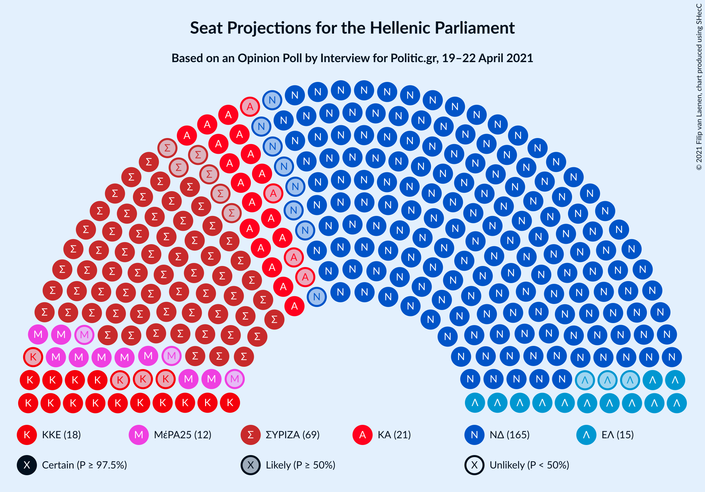
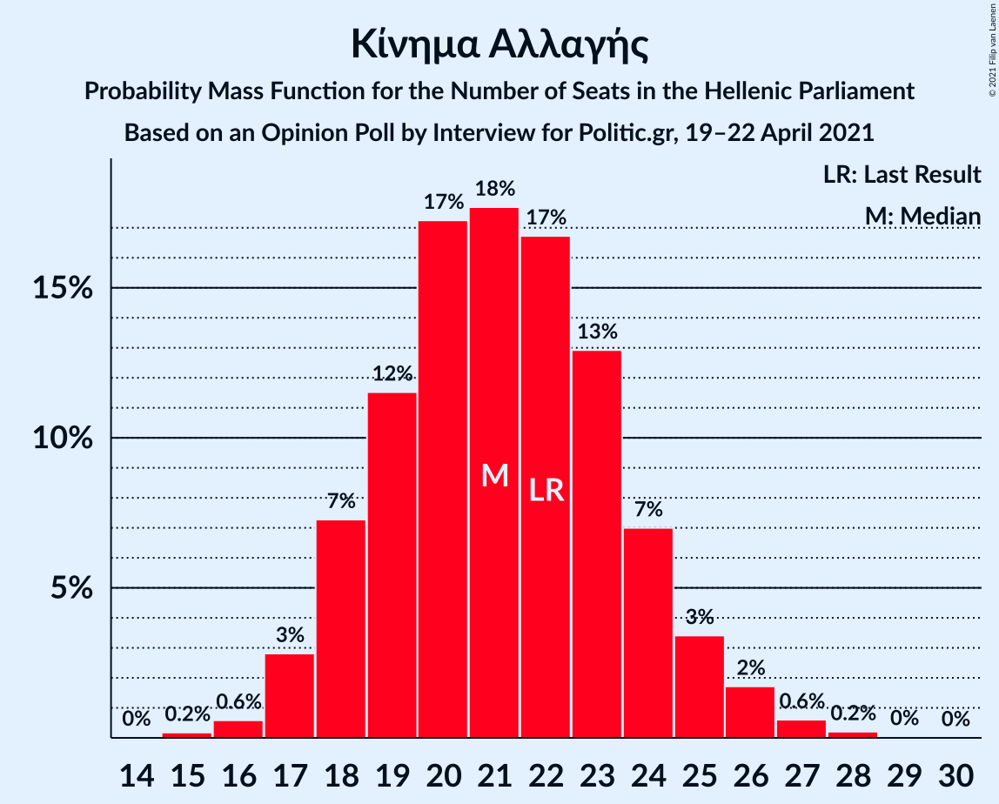
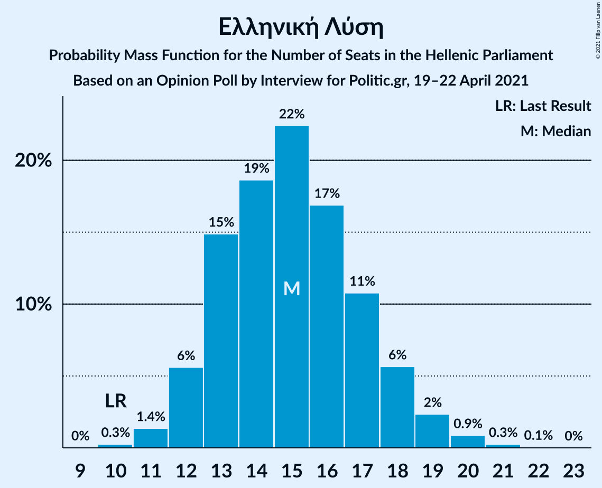
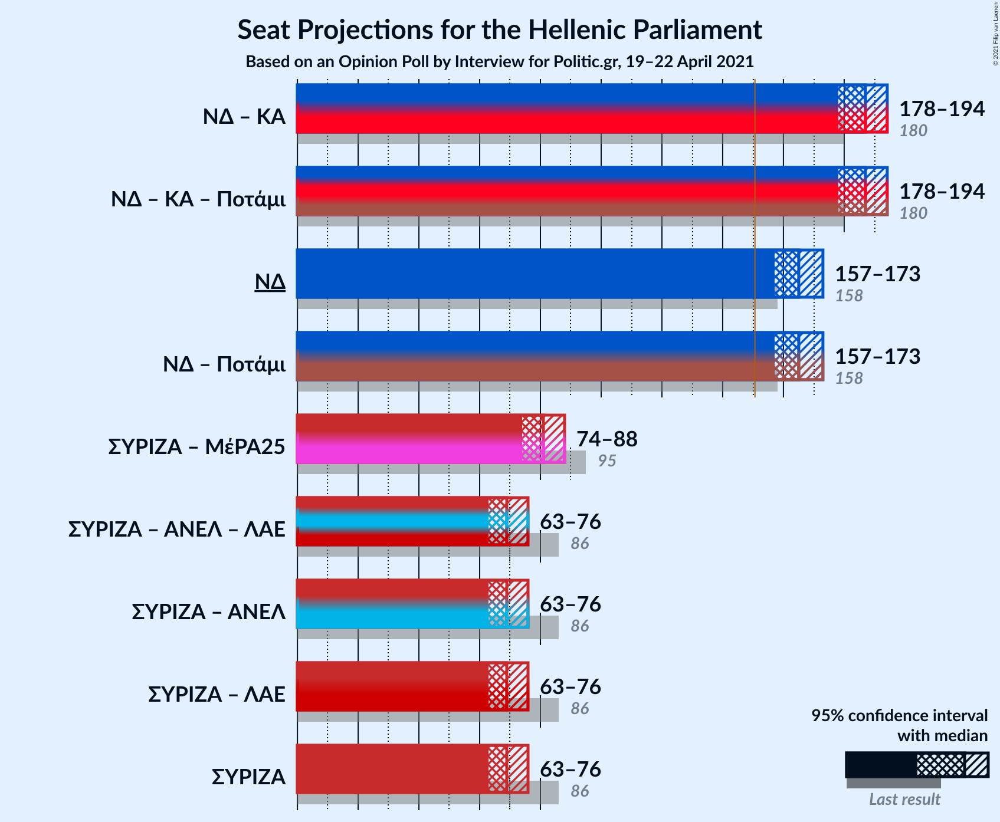

# Opinion Poll by Interview for Politic.gr, 19–22 April 2021

<a href="#voting-intentions">Voting Intentions</a> | <a href="#seats">Seats</a> | <a href="#coalitions">Coalitions</a> | <a href="#technical-information">Technical Information</a>

## Voting Intentions

### Confidence Intervals

| Party | Last Result | Poll Result | 80% Confidence Interval | 90% Confidence Interval | 95% Confidence Interval | 99% Confidence Interval |
|:-----:|:-----------:|:-----------:|:-----------------------:|:-----------------------:|:-----------------------:|:-----------------------:|
| Νέα Δημοκρατία | 39.8% | 42.3% | 40.5–44.2% |39.9–44.8% |39.5–45.3% |38.6–46.2% |
| Συνασπισμός Ριζοσπαστικής Αριστεράς | 31.5% | 25.5% | 23.9–27.2% |23.4–27.7% |23.0–28.1% |22.2–29.0% |
| Κίνημα Αλλαγής | 8.1% | 7.7% | 6.8–8.8% |6.5–9.2% |6.3–9.4% |5.9–10.0% |
| Κομμουνιστικό Κόμμα Ελλάδας | 5.3% | 6.5% | 5.6–7.5% |5.4–7.8% |5.2–8.1% |4.8–8.6% |
| Ελληνική Λύση | 3.7% | 5.5% | 4.7–6.4% |4.5–6.7% |4.3–7.0% |3.9–7.5% |
| Μέτωπο Ευρωπαϊκής Ρεαλιστικής Ανυπακοής | 3.4% | 4.2% | 3.5–5.1% |3.3–5.3% |3.2–5.6% |2.9–6.0% |

*Note:* The poll result column reflects the actual value used in the calculations. Published results may vary slightly, and in addition be rounded to fewer digits.

## Seats

### Confidence Intervals

| Party | Last Result | Median | 80% Confidence Interval | 90% Confidence Interval | 95% Confidence Interval | 99% Confidence Interval |
|:-----:|:-----------:|:------:|:-----------------------:|:-----------------------:|:-----------------------:|:-----------------------:|
| <a href="#νέα-δημοκρατία">Νέα Δημοκρατία</a> | 158 | 165 | 160–170 |159–171 |157–173 |155–175 |
| <a href="#συνασπισμός-ριζοσπαστικής-αριστεράς">Συνασπισμός Ριζοσπαστικής Αριστεράς</a> | 86 | 69 | 65–74 |64–75 |63–76 |61–79 |
| <a href="#κίνημα-αλλαγής">Κίνημα Αλλαγής</a> | 22 | 21 | 18–24 |18–25 |17–26 |16–27 |
| <a href="#κομμουνιστικό-κόμμα-ελλάδας">Κομμουνιστικό Κόμμα Ελλάδας</a> | 15 | 18 | 15–20 |15–21 |14–22 |13–23 |
| <a href="#ελληνική-λύση">Ελληνική Λύση</a> | 10 | 15 | 13–17 |12–18 |12–19 |11–20 |
| <a href="#μέτωπο-ευρωπαϊκής-ρεαλιστικής-ανυπακοής">Μέτωπο Ευρωπαϊκής Ρεαλιστικής Ανυπακοής</a> | 9 | 12 | 10–14 |9–14 |9–15 |0–16 |

### Νέα Δημοκρατία

*For a full overview of the results for this party, see the [Νέα Δημοκρατία](party-νέαδημοκρατία.html) page.*

| Number of Seats | Probability | Accumulated | Special Marks |
|:---------------:|:-----------:|:-----------:|:-------------:|
| 152 | 0% | 100% |  |
| 153 | 0.1% | 99.9% |  |
| 154 | 0.2% | 99.9% |  |
| 155 | 0.4% | 99.7% |  |
| 156 | 0.7% | 99.3% |  |
| 157 | 1.3% | 98.6% |  |
| 158 | 2% | 97% | Last Result |
| 159 | 3% | 95% |  |
| 160 | 4% | 92% |  |
| 161 | 6% | 88% |  |
| 162 | 8% | 82% |  |
| 163 | 8% | 74% |  |
| 164 | 10% | 66% |  |
| 165 | 11% | 56% | Median |
| 166 | 10% | 45% |  |
| 167 | 9% | 35% |  |
| 168 | 7% | 26% |  |
| 169 | 6% | 19% |  |
| 170 | 5% | 13% |  |
| 171 | 4% | 8% |  |
| 172 | 2% | 5% |  |
| 173 | 1.3% | 3% |  |
| 174 | 0.8% | 2% |  |
| 175 | 0.5% | 0.9% |  |
| 176 | 0.2% | 0.5% |  |
| 177 | 0.1% | 0.2% |  |
| 178 | 0.1% | 0.1% |  |
| 179 | 0% | 0.1% |  |
| 180 | 0% | 0% |  |

### Συνασπισμός Ριζοσπαστικής Αριστεράς

*For a full overview of the results for this party, see the [Συνασπισμός Ριζοσπαστικής Αριστεράς](party-συνασπισμόςριζοσπαστικήςαριστεράς.html) page.*

| Number of Seats | Probability | Accumulated | Special Marks |
|:---------------:|:-----------:|:-----------:|:-------------:|
| 58 | 0% | 100% |  |
| 59 | 0.1% | 99.9% |  |
| 60 | 0.3% | 99.8% |  |
| 61 | 0.6% | 99.5% |  |
| 62 | 1.2% | 98.9% |  |
| 63 | 2% | 98% |  |
| 64 | 4% | 95% |  |
| 65 | 5% | 92% |  |
| 66 | 7% | 86% |  |
| 67 | 10% | 79% |  |
| 68 | 11% | 69% |  |
| 69 | 11% | 58% | Median |
| 70 | 11% | 47% |  |
| 71 | 10% | 36% |  |
| 72 | 8% | 27% |  |
| 73 | 6% | 18% |  |
| 74 | 5% | 12% |  |
| 75 | 3% | 7% |  |
| 76 | 2% | 4% |  |
| 77 | 1.0% | 2% |  |
| 78 | 0.6% | 1.2% |  |
| 79 | 0.3% | 0.6% |  |
| 80 | 0.1% | 0.2% |  |
| 81 | 0.1% | 0.1% |  |
| 82 | 0% | 0% |  |
| 83 | 0% | 0% |  |
| 84 | 0% | 0% |  |
| 85 | 0% | 0% |  |
| 86 | 0% | 0% | Last Result |

### Κίνημα Αλλαγής

*For a full overview of the results for this party, see the [Κίνημα Αλλαγής](party-κίνημααλλαγής.html) page.*

| Number of Seats | Probability | Accumulated | Special Marks |
|:---------------:|:-----------:|:-----------:|:-------------:|
| 15 | 0.2% | 100% |  |
| 16 | 0.9% | 99.8% |  |
| 17 | 3% | 98.9% |  |
| 18 | 6% | 96% |  |
| 19 | 12% | 90% |  |
| 20 | 16% | 77% |  |
| 21 | 18% | 61% | Median |
| 22 | 16% | 43% | Last Result |
| 23 | 12% | 27% |  |
| 24 | 8% | 14% |  |
| 25 | 4% | 7% |  |
| 26 | 2% | 3% |  |
| 27 | 0.7% | 1.0% |  |
| 28 | 0.2% | 0.3% |  |
| 29 | 0.1% | 0.1% |  |
| 30 | 0% | 0% |  |

### Κομμουνιστικό Κόμμα Ελλάδας

*For a full overview of the results for this party, see the [Κομμουνιστικό Κόμμα Ελλάδας](party-κομμουνιστικόκόμμαελλάδας.html) page.*

| Number of Seats | Probability | Accumulated | Special Marks |
|:---------------:|:-----------:|:-----------:|:-------------:|
| 12 | 0.2% | 100% |  |
| 13 | 1.0% | 99.8% |  |
| 14 | 3% | 98.8% |  |
| 15 | 8% | 95% | Last Result |
| 16 | 14% | 87% |  |
| 17 | 18% | 73% |  |
| 18 | 20% | 55% | Median |
| 19 | 15% | 34% |  |
| 20 | 10% | 19% |  |
| 21 | 5% | 9% |  |
| 22 | 2% | 4% |  |
| 23 | 0.9% | 1.3% |  |
| 24 | 0.3% | 0.4% |  |
| 25 | 0.1% | 0.1% |  |
| 26 | 0% | 0% |  |

### Ελληνική Λύση

*For a full overview of the results for this party, see the [Ελληνική Λύση](party-ελληνικήλύση.html) page.*

| Number of Seats | Probability | Accumulated | Special Marks |
|:---------------:|:-----------:|:-----------:|:-------------:|
| 10 | 0.3% | 100% | Last Result |
| 11 | 2% | 99.6% |  |
| 12 | 6% | 98% |  |
| 13 | 12% | 92% |  |
| 14 | 18% | 80% |  |
| 15 | 22% | 62% | Median |
| 16 | 18% | 39% |  |
| 17 | 12% | 22% |  |
| 18 | 6% | 10% |  |
| 19 | 2% | 4% |  |
| 20 | 1.0% | 1.3% |  |
| 21 | 0.3% | 0.4% |  |
| 22 | 0.1% | 0.1% |  |
| 23 | 0% | 0% |  |

### Μέτωπο Ευρωπαϊκής Ρεαλιστικής Ανυπακοής

*For a full overview of the results for this party, see the [Μέτωπο Ευρωπαϊκής Ρεαλιστικής Ανυπακοής](party-μέτωποευρωπαϊκήςρεαλιστικήςανυπακοής.html) page.*

| Number of Seats | Probability | Accumulated | Special Marks |
|:---------------:|:-----------:|:-----------:|:-------------:|
| 0 | 1.0% | 100% |  |
| 1 | 0% | 99.0% |  |
| 2 | 0% | 99.0% |  |
| 3 | 0% | 99.0% |  |
| 4 | 0% | 99.0% |  |
| 5 | 0% | 99.0% |  |
| 6 | 0% | 99.0% |  |
| 7 | 0% | 99.0% |  |
| 8 | 0.9% | 99.0% |  |
| 9 | 7% | 98% | Last Result |
| 10 | 16% | 91% |  |
| 11 | 23% | 75% |  |
| 12 | 22% | 52% | Median |
| 13 | 16% | 30% |  |
| 14 | 8% | 13% |  |
| 15 | 3% | 5% |  |
| 16 | 1.1% | 2% |  |
| 17 | 0.3% | 0.4% |  |
| 18 | 0.1% | 0.1% |  |
| 19 | 0% | 0% |  |

## Coalitions

### Confidence Intervals

| Coalition | Last Result | Median | Majority? | 80% Confidence Interval | 90% Confidence Interval | 95% Confidence Interval | 99% Confidence Interval |
|:---------:|:-----------:|:------:|:---------:|:-----------------------:|:-----------------------:|:-----------------------:|:-----------------------:|
| Νέα Δημοκρατία – Κίνημα Αλλαγής | 180 | 186 | 100% | 181–191 | 180–193 | 179–194 | 176–197 |
| Νέα Δημοκρατία | 158 | 165 | 100% | 160–170 | 159–171 | 157–173 | 155–175 |
| Συνασπισμός Ριζοσπαστικής Αριστεράς – Μέτωπο Ευρωπαϊκής Ρεαλιστικής Ανυπακοής | 95 | 81 | 0% | 76–86 | 75–87 | 74–88 | 71–91 |
| Συνασπισμός Ριζοσπαστικής Αριστεράς | 86 | 69 | 0% | 65–74 | 64–75 | 63–76 | 61–79 |

### Νέα Δημοκρατία – Κίνημα Αλλαγής

| Number of Seats | Probability | Accumulated | Special Marks |
|:---------------:|:-----------:|:-----------:|:-------------:|
| 173 | 0% | 100% |  |
| 174 | 0.1% | 99.9% |  |
| 175 | 0.2% | 99.9% |  |
| 176 | 0.3% | 99.7% |  |
| 177 | 0.7% | 99.3% |  |
| 178 | 1.1% | 98.7% |  |
| 179 | 2% | 98% |  |
| 180 | 3% | 96% | Last Result |
| 181 | 4% | 93% |  |
| 182 | 6% | 89% |  |
| 183 | 7% | 82% |  |
| 184 | 8% | 75% |  |
| 185 | 10% | 68% |  |
| 186 | 10% | 57% | Median |
| 187 | 10% | 47% |  |
| 188 | 9% | 37% |  |
| 189 | 8% | 28% |  |
| 190 | 6% | 20% |  |
| 191 | 5% | 14% |  |
| 192 | 4% | 9% |  |
| 193 | 2% | 6% |  |
| 194 | 1.3% | 3% |  |
| 195 | 0.8% | 2% |  |
| 196 | 0.5% | 1.1% |  |
| 197 | 0.3% | 0.6% |  |
| 198 | 0.1% | 0.3% |  |
| 199 | 0.1% | 0.1% |  |
| 200 | 0% | 0.1% |  |
| 201 | 0% | 0% |  |

### Νέα Δημοκρατία

| Number of Seats | Probability | Accumulated | Special Marks |
|:---------------:|:-----------:|:-----------:|:-------------:|
| 152 | 0% | 100% |  |
| 153 | 0.1% | 99.9% |  |
| 154 | 0.2% | 99.9% |  |
| 155 | 0.4% | 99.7% |  |
| 156 | 0.7% | 99.3% |  |
| 157 | 1.3% | 98.6% |  |
| 158 | 2% | 97% | Last Result |
| 159 | 3% | 95% |  |
| 160 | 4% | 92% |  |
| 161 | 6% | 88% |  |
| 162 | 8% | 82% |  |
| 163 | 8% | 74% |  |
| 164 | 10% | 66% |  |
| 165 | 11% | 56% | Median |
| 166 | 10% | 45% |  |
| 167 | 9% | 35% |  |
| 168 | 7% | 26% |  |
| 169 | 6% | 19% |  |
| 170 | 5% | 13% |  |
| 171 | 4% | 8% |  |
| 172 | 2% | 5% |  |
| 173 | 1.3% | 3% |  |
| 174 | 0.8% | 2% |  |
| 175 | 0.5% | 0.9% |  |
| 176 | 0.2% | 0.5% |  |
| 177 | 0.1% | 0.2% |  |
| 178 | 0.1% | 0.1% |  |
| 179 | 0% | 0.1% |  |
| 180 | 0% | 0% |  |

### Συνασπισμός Ριζοσπαστικής Αριστεράς – Μέτωπο Ευρωπαϊκής Ρεαλιστικής Ανυπακοής

| Number of Seats | Probability | Accumulated | Special Marks |
|:---------------:|:-----------:|:-----------:|:-------------:|
| 67 | 0% | 100% |  |
| 68 | 0.1% | 99.9% |  |
| 69 | 0.1% | 99.8% |  |
| 70 | 0.2% | 99.7% |  |
| 71 | 0.3% | 99.6% |  |
| 72 | 0.6% | 99.2% |  |
| 73 | 1.1% | 98.7% |  |
| 74 | 2% | 98% |  |
| 75 | 3% | 96% |  |
| 76 | 4% | 93% |  |
| 77 | 6% | 88% |  |
| 78 | 7% | 82% |  |
| 79 | 10% | 75% |  |
| 80 | 11% | 65% |  |
| 81 | 10% | 54% | Median |
| 82 | 11% | 44% |  |
| 83 | 8% | 33% |  |
| 84 | 8% | 25% |  |
| 85 | 6% | 17% |  |
| 86 | 4% | 11% |  |
| 87 | 3% | 7% |  |
| 88 | 2% | 4% |  |
| 89 | 1.1% | 2% |  |
| 90 | 0.5% | 1.1% |  |
| 91 | 0.3% | 0.5% |  |
| 92 | 0.1% | 0.2% |  |
| 93 | 0.1% | 0.1% |  |
| 94 | 0% | 0% |  |
| 95 | 0% | 0% | Last Result |

### Συνασπισμός Ριζοσπαστικής Αριστεράς

| Number of Seats | Probability | Accumulated | Special Marks |
|:---------------:|:-----------:|:-----------:|:-------------:|
| 58 | 0% | 100% |  |
| 59 | 0.1% | 99.9% |  |
| 60 | 0.3% | 99.8% |  |
| 61 | 0.6% | 99.5% |  |
| 62 | 1.2% | 98.9% |  |
| 63 | 2% | 98% |  |
| 64 | 4% | 95% |  |
| 65 | 5% | 92% |  |
| 66 | 7% | 86% |  |
| 67 | 10% | 79% |  |
| 68 | 11% | 69% |  |
| 69 | 11% | 58% | Median |
| 70 | 11% | 47% |  |
| 71 | 10% | 36% |  |
| 72 | 8% | 27% |  |
| 73 | 6% | 18% |  |
| 74 | 5% | 12% |  |
| 75 | 3% | 7% |  |
| 76 | 2% | 4% |  |
| 77 | 1.0% | 2% |  |
| 78 | 0.6% | 1.2% |  |
| 79 | 0.3% | 0.6% |  |
| 80 | 0.1% | 0.2% |  |
| 81 | 0.1% | 0.1% |  |
| 82 | 0% | 0% |  |
| 83 | 0% | 0% |  |
| 84 | 0% | 0% |  |
| 85 | 0% | 0% |  |
| 86 | 0% | 0% | Last Result |

## Technical Information

### Opinion Poll

+ **Polling firm:** Interview
+ **Commissioner(s):** Politic.gr
+ **Fieldwork period:** 19–22 April 2021

### Calculations

+ **Sample size:** 1115
+ **Simulations done:** 1,048,576
+ **Error estimate:** 1.20%

