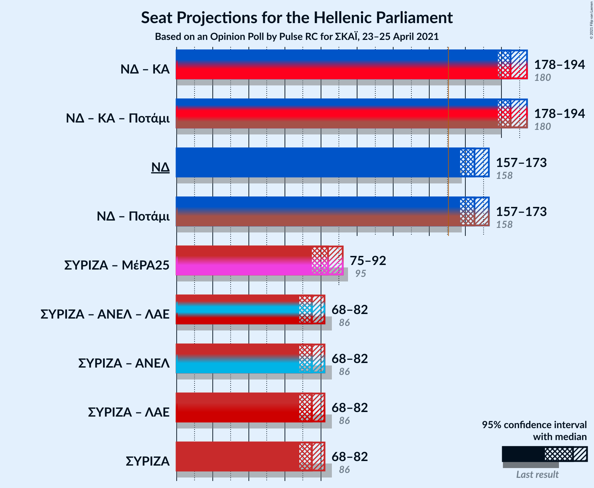
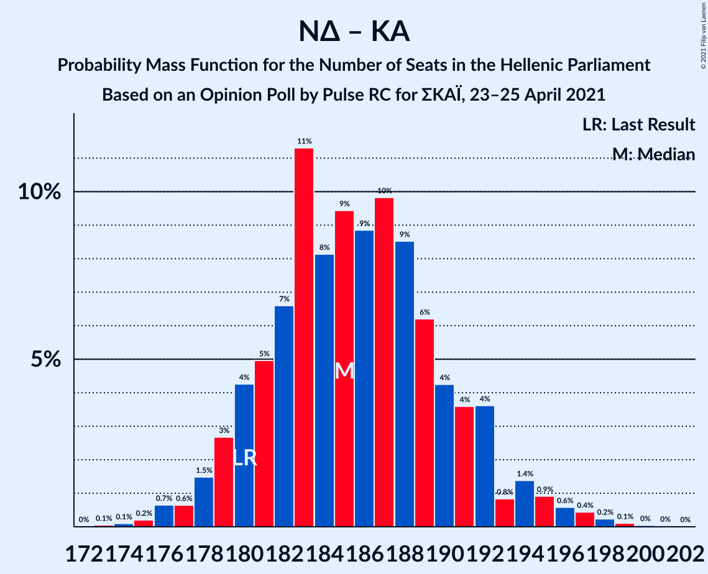
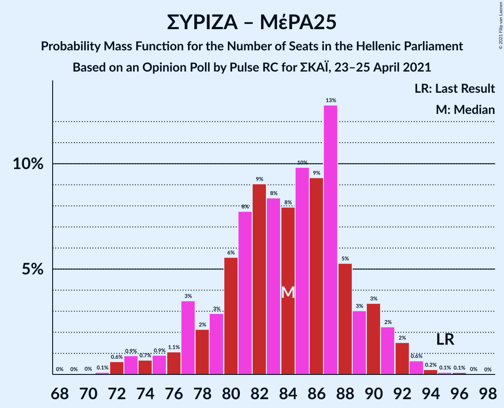

# Opinion Poll by Pulse RC for ΣΚΑΪ, 20–25 April 2021

<a href="#voting-intentions">Voting Intentions</a> | <a href="#seats">Seats</a> | <a href="#coalitions">Coalitions</a> | <a href="#technical-information">Technical Information</a>

## Voting Intentions

### Confidence Intervals

| Party | Last Result | Poll Result | 80% Confidence Interval | 90% Confidence Interval | 95% Confidence Interval | 99% Confidence Interval |
|:-----:|:-----------:|:-----------:|:-----------------------:|:-----------------------:|:-----------------------:|:-----------------------:|
| Νέα Δημοκρατία | 39.8% | 42.0% | 40.0–44.0% |39.5–44.6% |39.0–45.1% |38.0–46.1% |
| Συνασπισμός Ριζοσπαστικής Αριστεράς | 31.5% | 27.1% | 25.3–29.0% |24.9–29.5% |24.4–29.9% |23.6–30.8% |
| Κίνημα Αλλαγής | 8.1% | 7.7% | 6.7–8.9% |6.4–9.2% |6.2–9.5% |5.8–10.1% |
| Κομμουνιστικό Κόμμα Ελλάδας | 5.3% | 6.6% | 5.7–7.7% |5.4–8.0% |5.2–8.3% |4.8–8.9% |
| Ελληνική Λύση | 3.7% | 5.0% | 4.2–6.0% |4.0–6.3% |3.8–6.5% |3.5–7.1% |
| Μέτωπο Ευρωπαϊκής Ρεαλιστικής Ανυπακοής | 3.4% | 3.3% | 2.7–4.1% |2.5–4.4% |2.4–4.6% |2.1–5.0% |

*Note:* The poll result column reflects the actual value used in the calculations. Published results may vary slightly, and in addition be rounded to fewer digits.

## Seats

### Confidence Intervals

| Party | Last Result | Median | 80% Confidence Interval | 90% Confidence Interval | 95% Confidence Interval | 99% Confidence Interval |
|:-----:|:-----------:|:------:|:-----------------------:|:-----------------------:|:-----------------------:|:-----------------------:|
| <a href="#νέα-δημοκρατία">Νέα Δημοκρατία</a> | 158 | 165 | 159–171 |158–173 |156–174 |154–177 |
| <a href="#συνασπισμός-ριζοσπαστικής-αριστεράς">Συνασπισμός Ριζοσπαστικής Αριστεράς</a> | 86 | 74 | 69–79 |68–81 |67–82 |64–85 |
| <a href="#κίνημα-αλλαγής">Κίνημα Αλλαγής</a> | 22 | 21 | 18–24 |18–25 |17–26 |16–28 |
| <a href="#κομμουνιστικό-κόμμα-ελλάδας">Κομμουνιστικό Κόμμα Ελλάδας</a> | 15 | 18 | 16–21 |15–22 |14–23 |13–24 |
| <a href="#ελληνική-λύση">Ελληνική Λύση</a> | 10 | 14 | 12–16 |11–17 |10–18 |10–19 |
| <a href="#μέτωπο-ευρωπαϊκής-ρεαλιστικής-ανυπακοής">Μέτωπο Ευρωπαϊκής Ρεαλιστικής Ανυπακοής</a> | 9 | 9 | 0–11 |0–12 |0–13 |0–14 |

### Νέα Δημοκρατία

*For a full overview of the results for this party, see the [Νέα Δημοκρατία](party-νέαδημοκρατία.html) page.*

| Number of Seats | Probability | Accumulated | Special Marks |
|:---------------:|:-----------:|:-----------:|:-------------:|
| 151 | 0% | 100% | Majority |
| 152 | 0.1% | 99.9% |  |
| 153 | 0.2% | 99.8% |  |
| 154 | 0.4% | 99.6% |  |
| 155 | 0.8% | 99.2% |  |
| 156 | 1.0% | 98% |  |
| 157 | 2% | 97% |  |
| 158 | 3% | 95% | Last Result |
| 159 | 4% | 93% |  |
| 160 | 5% | 89% |  |
| 161 | 6% | 84% |  |
| 162 | 7% | 78% |  |
| 163 | 8% | 70% |  |
| 164 | 9% | 63% |  |
| 165 | 9% | 54% | Median |
| 166 | 8% | 45% |  |
| 167 | 9% | 37% |  |
| 168 | 7% | 28% |  |
| 169 | 5% | 22% |  |
| 170 | 5% | 16% |  |
| 171 | 4% | 12% |  |
| 172 | 2% | 8% |  |
| 173 | 2% | 6% |  |
| 174 | 1.3% | 4% |  |
| 175 | 0.8% | 2% |  |
| 176 | 0.6% | 1.4% |  |
| 177 | 0.3% | 0.8% |  |
| 178 | 0.2% | 0.4% |  |
| 179 | 0.1% | 0.2% |  |
| 180 | 0% | 0.1% |  |
| 181 | 0% | 0.1% |  |
| 182 | 0% | 0% |  |

### Συνασπισμός Ριζοσπαστικής Αριστεράς

*For a full overview of the results for this party, see the [Συνασπισμός Ριζοσπαστικής Αριστεράς](party-συνασπισμόςριζοσπαστικήςαριστεράς.html) page.*

| Number of Seats | Probability | Accumulated | Special Marks |
|:---------------:|:-----------:|:-----------:|:-------------:|
| 62 | 0.1% | 100% |  |
| 63 | 0.1% | 99.9% |  |
| 64 | 0.3% | 99.8% |  |
| 65 | 0.7% | 99.5% |  |
| 66 | 1.2% | 98.8% |  |
| 67 | 2% | 98% |  |
| 68 | 3% | 96% |  |
| 69 | 4% | 93% |  |
| 70 | 6% | 89% |  |
| 71 | 8% | 83% |  |
| 72 | 9% | 75% |  |
| 73 | 9% | 67% |  |
| 74 | 10% | 58% | Median |
| 75 | 11% | 47% |  |
| 76 | 9% | 37% |  |
| 77 | 6% | 28% |  |
| 78 | 7% | 22% |  |
| 79 | 5% | 15% |  |
| 80 | 4% | 10% |  |
| 81 | 2% | 6% |  |
| 82 | 2% | 4% |  |
| 83 | 1.0% | 2% |  |
| 84 | 0.5% | 1.2% |  |
| 85 | 0.4% | 0.8% |  |
| 86 | 0.2% | 0.3% | Last Result |
| 87 | 0.1% | 0.2% |  |
| 88 | 0% | 0.1% |  |
| 89 | 0% | 0% |  |

### Κίνημα Αλλαγής

*For a full overview of the results for this party, see the [Κίνημα Αλλαγής](party-κίνημααλλαγής.html) page.*

| Number of Seats | Probability | Accumulated | Special Marks |
|:---------------:|:-----------:|:-----------:|:-------------:|
| 14 | 0.1% | 100% |  |
| 15 | 0.3% | 99.9% |  |
| 16 | 1.1% | 99.6% |  |
| 17 | 3% | 98.6% |  |
| 18 | 6% | 95% |  |
| 19 | 12% | 89% |  |
| 20 | 15% | 77% |  |
| 21 | 17% | 63% | Median |
| 22 | 16% | 45% | Last Result |
| 23 | 12% | 29% |  |
| 24 | 9% | 17% |  |
| 25 | 4% | 9% |  |
| 26 | 3% | 4% |  |
| 27 | 1.0% | 2% |  |
| 28 | 0.5% | 0.7% |  |
| 29 | 0.1% | 0.2% |  |
| 30 | 0.1% | 0.1% |  |
| 31 | 0% | 0% |  |

### Κομμουνιστικό Κόμμα Ελλάδας

*For a full overview of the results for this party, see the [Κομμουνιστικό Κόμμα Ελλάδας](party-κομμουνιστικόκόμμαελλάδας.html) page.*

| Number of Seats | Probability | Accumulated | Special Marks |
|:---------------:|:-----------:|:-----------:|:-------------:|
| 12 | 0.1% | 100% |  |
| 13 | 0.7% | 99.8% |  |
| 14 | 3% | 99.1% |  |
| 15 | 6% | 97% | Last Result |
| 16 | 11% | 91% |  |
| 17 | 16% | 80% |  |
| 18 | 18% | 63% | Median |
| 19 | 17% | 45% |  |
| 20 | 13% | 28% |  |
| 21 | 8% | 15% |  |
| 22 | 4% | 7% |  |
| 23 | 2% | 3% |  |
| 24 | 0.8% | 1.2% |  |
| 25 | 0.3% | 0.4% |  |
| 26 | 0.1% | 0.1% |  |
| 27 | 0% | 0% |  |

### Ελληνική Λύση

*For a full overview of the results for this party, see the [Ελληνική Λύση](party-ελληνικήλύση.html) page.*

| Number of Seats | Probability | Accumulated | Special Marks |
|:---------------:|:-----------:|:-----------:|:-------------:|
| 8 | 0% | 100% |  |
| 9 | 0.3% | 99.9% |  |
| 10 | 3% | 99.7% | Last Result |
| 11 | 6% | 96% |  |
| 12 | 13% | 91% |  |
| 13 | 24% | 78% |  |
| 14 | 15% | 54% | Median |
| 15 | 21% | 40% |  |
| 16 | 9% | 19% |  |
| 17 | 5% | 10% |  |
| 18 | 3% | 4% |  |
| 19 | 0.7% | 1.2% |  |
| 20 | 0.3% | 0.4% |  |
| 21 | 0.1% | 0.1% |  |
| 22 | 0% | 0% |  |

### Μέτωπο Ευρωπαϊκής Ρεαλιστικής Ανυπακοής

*For a full overview of the results for this party, see the [Μέτωπο Ευρωπαϊκής Ρεαλιστικής Ανυπακοής](party-μέτωποευρωπαϊκήςρεαλιστικήςανυπακοής.html) page.*

| Number of Seats | Probability | Accumulated | Special Marks |
|:---------------:|:-----------:|:-----------:|:-------------:|
| 0 | 28% | 100% |  |
| 1 | 0% | 72% |  |
| 2 | 0% | 72% |  |
| 3 | 0% | 72% |  |
| 4 | 0% | 72% |  |
| 5 | 0% | 72% |  |
| 6 | 0% | 72% |  |
| 7 | 0% | 72% |  |
| 8 | 5% | 72% |  |
| 9 | 26% | 67% | Last Result, Median |
| 10 | 22% | 41% |  |
| 11 | 12% | 19% |  |
| 12 | 5% | 8% |  |
| 13 | 2% | 3% |  |
| 14 | 0.5% | 0.7% |  |
| 15 | 0.1% | 0.1% |  |
| 16 | 0% | 0% |  |

## Coalitions

### Confidence Intervals

| Coalition | Last Result | Median | Majority? | 80% Confidence Interval | 90% Confidence Interval | 95% Confidence Interval | 99% Confidence Interval |
|:---------:|:-----------:|:------:|:---------:|:-----------------------:|:-----------------------:|:-----------------------:|:-----------------------:|
| Νέα Δημοκρατία – Κίνημα Αλλαγής | 180 | 186 | 100% | 180–192 | 179–194 | 177–196 | 175–199 |
| Νέα Δημοκρατία | 158 | 165 | 100% | 159–171 | 158–173 | 156–174 | 154–177 |
| Συνασπισμός Ριζοσπαστικής Αριστεράς – Μέτωπο Ευρωπαϊκής Ρεαλιστικής Ανυπακοής | 95 | 82 | 0% | 75–88 | 73–89 | 71–90 | 69–93 |
| Συνασπισμός Ριζοσπαστικής Αριστεράς | 86 | 74 | 0% | 69–79 | 68–81 | 67–82 | 64–85 |

### Νέα Δημοκρατία – Κίνημα Αλλαγής

| Number of Seats | Probability | Accumulated | Special Marks |
|:---------------:|:-----------:|:-----------:|:-------------:|
| 172 | 0.1% | 100% |  |
| 173 | 0.1% | 99.9% |  |
| 174 | 0.2% | 99.8% |  |
| 175 | 0.4% | 99.6% |  |
| 176 | 0.7% | 99.1% |  |
| 177 | 1.1% | 98% |  |
| 178 | 2% | 97% |  |
| 179 | 3% | 96% |  |
| 180 | 4% | 93% | Last Result |
| 181 | 5% | 89% |  |
| 182 | 6% | 85% |  |
| 183 | 6% | 79% |  |
| 184 | 7% | 73% |  |
| 185 | 8% | 66% |  |
| 186 | 9% | 57% | Median |
| 187 | 10% | 48% |  |
| 188 | 8% | 38% |  |
| 189 | 7% | 30% |  |
| 190 | 6% | 23% |  |
| 191 | 4% | 17% |  |
| 192 | 4% | 13% |  |
| 193 | 3% | 9% |  |
| 194 | 2% | 7% |  |
| 195 | 1.4% | 5% |  |
| 196 | 1.1% | 3% |  |
| 197 | 1.0% | 2% |  |
| 198 | 0.5% | 1.3% |  |
| 199 | 0.4% | 0.7% |  |
| 200 | 0.2% | 0.4% |  |
| 201 | 0.1% | 0.2% |  |
| 202 | 0% | 0.1% |  |
| 203 | 0% | 0% |  |

### Νέα Δημοκρατία

| Number of Seats | Probability | Accumulated | Special Marks |
|:---------------:|:-----------:|:-----------:|:-------------:|
| 151 | 0% | 100% | Majority |
| 152 | 0.1% | 99.9% |  |
| 153 | 0.2% | 99.8% |  |
| 154 | 0.4% | 99.6% |  |
| 155 | 0.8% | 99.2% |  |
| 156 | 1.0% | 98% |  |
| 157 | 2% | 97% |  |
| 158 | 3% | 95% | Last Result |
| 159 | 4% | 93% |  |
| 160 | 5% | 89% |  |
| 161 | 6% | 84% |  |
| 162 | 7% | 78% |  |
| 163 | 8% | 70% |  |
| 164 | 9% | 63% |  |
| 165 | 9% | 54% | Median |
| 166 | 8% | 45% |  |
| 167 | 9% | 37% |  |
| 168 | 7% | 28% |  |
| 169 | 5% | 22% |  |
| 170 | 5% | 16% |  |
| 171 | 4% | 12% |  |
| 172 | 2% | 8% |  |
| 173 | 2% | 6% |  |
| 174 | 1.3% | 4% |  |
| 175 | 0.8% | 2% |  |
| 176 | 0.6% | 1.4% |  |
| 177 | 0.3% | 0.8% |  |
| 178 | 0.2% | 0.4% |  |
| 179 | 0.1% | 0.2% |  |
| 180 | 0% | 0.1% |  |
| 181 | 0% | 0.1% |  |
| 182 | 0% | 0% |  |

### Συνασπισμός Ριζοσπαστικής Αριστεράς – Μέτωπο Ευρωπαϊκής Ρεαλιστικής Ανυπακοής

| Number of Seats | Probability | Accumulated | Special Marks |
|:---------------:|:-----------:|:-----------:|:-------------:|
| 66 | 0.1% | 100% |  |
| 67 | 0.1% | 99.9% |  |
| 68 | 0.2% | 99.8% |  |
| 69 | 0.3% | 99.5% |  |
| 70 | 0.8% | 99.2% |  |
| 71 | 1.4% | 98% |  |
| 72 | 1.3% | 97% |  |
| 73 | 2% | 96% |  |
| 74 | 2% | 94% |  |
| 75 | 4% | 92% |  |
| 76 | 4% | 88% |  |
| 77 | 4% | 84% |  |
| 78 | 7% | 80% |  |
| 79 | 6% | 73% |  |
| 80 | 6% | 67% |  |
| 81 | 10% | 61% |  |
| 82 | 6% | 51% |  |
| 83 | 11% | 46% | Median |
| 84 | 7% | 34% |  |
| 85 | 7% | 27% |  |
| 86 | 5% | 20% |  |
| 87 | 4% | 15% |  |
| 88 | 4% | 10% |  |
| 89 | 2% | 6% |  |
| 90 | 2% | 4% |  |
| 91 | 0.9% | 2% |  |
| 92 | 0.7% | 1.2% |  |
| 93 | 0.2% | 0.6% |  |
| 94 | 0.2% | 0.3% |  |
| 95 | 0.1% | 0.1% | Last Result |
| 96 | 0% | 0.1% |  |
| 97 | 0% | 0% |  |

### Συνασπισμός Ριζοσπαστικής Αριστεράς

| Number of Seats | Probability | Accumulated | Special Marks |
|:---------------:|:-----------:|:-----------:|:-------------:|
| 62 | 0.1% | 100% |  |
| 63 | 0.1% | 99.9% |  |
| 64 | 0.3% | 99.8% |  |
| 65 | 0.7% | 99.5% |  |
| 66 | 1.2% | 98.8% |  |
| 67 | 2% | 98% |  |
| 68 | 3% | 96% |  |
| 69 | 4% | 93% |  |
| 70 | 6% | 89% |  |
| 71 | 8% | 83% |  |
| 72 | 9% | 75% |  |
| 73 | 9% | 67% |  |
| 74 | 10% | 58% | Median |
| 75 | 11% | 47% |  |
| 76 | 9% | 37% |  |
| 77 | 6% | 28% |  |
| 78 | 7% | 22% |  |
| 79 | 5% | 15% |  |
| 80 | 4% | 10% |  |
| 81 | 2% | 6% |  |
| 82 | 2% | 4% |  |
| 83 | 1.0% | 2% |  |
| 84 | 0.5% | 1.2% |  |
| 85 | 0.4% | 0.8% |  |
| 86 | 0.2% | 0.3% | Last Result |
| 87 | 0.1% | 0.2% |  |
| 88 | 0% | 0.1% |  |
| 89 | 0% | 0% |  |

## Technical Information

### Opinion Poll

+ **Polling firm:** Pulse RC
+ **Commissioner(s):** ΣΚΑΪ
+ **Fieldwork period:** 20–25 April 2021

### Calculations

+ **Sample size:** 1000
+ **Simulations done:** 1,048,576
+ **Error estimate:** 0.38%

