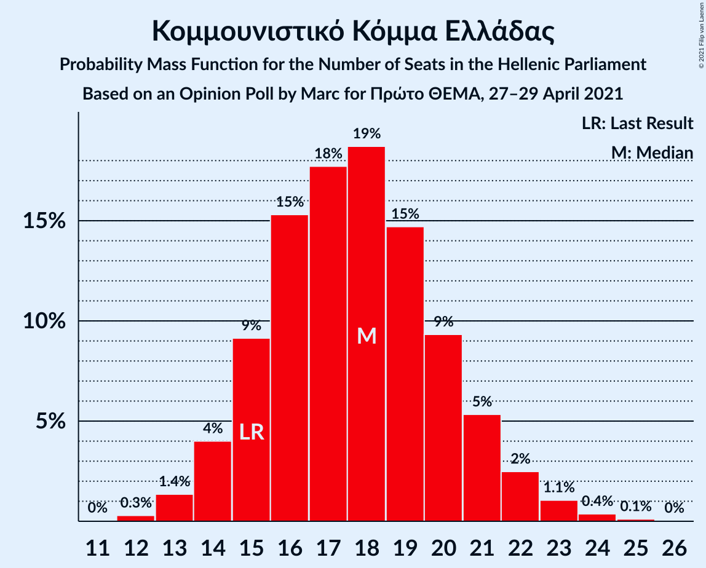
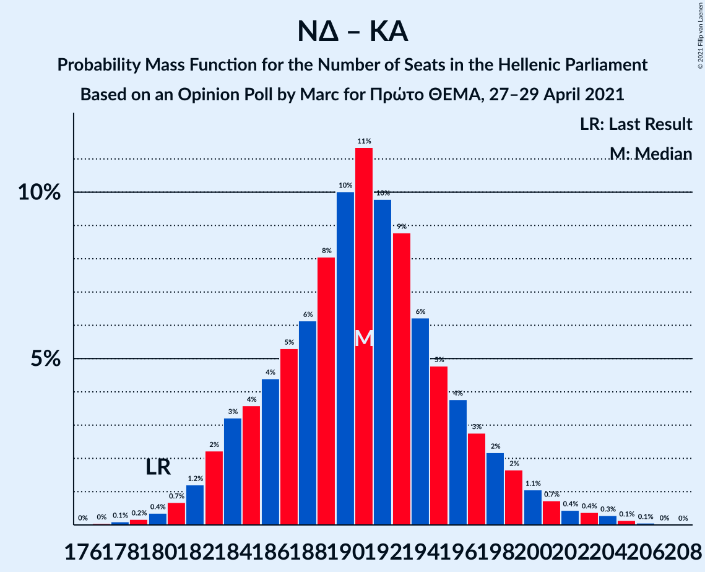

# Opinion Poll by Marc for Πρώτο ΘΕΜΑ, 27–29 April 2021

<a href="#voting-intentions">Voting Intentions</a> | <a href="#seats">Seats</a> | <a href="#coalitions">Coalitions</a> | <a href="#technical-information">Technical Information</a>

## Voting Intentions

### Confidence Intervals

| Party | Last Result | Poll Result | 80% Confidence Interval | 90% Confidence Interval | 95% Confidence Interval | 99% Confidence Interval |
|:-----:|:-----------:|:-----------:|:-----------------------:|:-----------------------:|:-----------------------:|:-----------------------:|
| Νέα Δημοκρατία | 39.8% | 44.7% | 42.7–46.7% |42.1–47.3% |41.6–47.8% |40.7–48.8% |
| Συνασπισμός Ριζοσπαστικής Αριστεράς | 31.5% | 25.8% | 24.1–27.6% |23.6–28.2% |23.2–28.6% |22.4–29.5% |
| Κίνημα Αλλαγής | 8.1% | 8.4% | 7.4–9.6% |7.1–10.0% |6.8–10.3% |6.4–10.9% |
| Κομμουνιστικό Κόμμα Ελλάδας | 5.3% | 6.6% | 5.7–7.7% |5.4–8.0% |5.2–8.3% |4.8–8.9% |
| Ελληνική Λύση | 3.7% | 5.3% | 4.5–6.3% |4.3–6.6% |4.1–6.9% |3.7–7.4% |
| Μέτωπο Ευρωπαϊκής Ρεαλιστικής Ανυπακοής | 3.4% | 3.6% | 2.9–4.5% |2.8–4.7% |2.6–5.0% |2.3–5.4% |

*Note:* The poll result column reflects the actual value used in the calculations. Published results may vary slightly, and in addition be rounded to fewer digits.

## Seats

### Confidence Intervals

| Party | Last Result | Median | 80% Confidence Interval | 90% Confidence Interval | 95% Confidence Interval | 99% Confidence Interval |
|:-----:|:-----------:|:------:|:-----------------------:|:-----------------------:|:-----------------------:|:-----------------------:|
| <a href="#νέα-δημοκρατία">Νέα Δημοκρατία</a> | 158 | 169 | 163–174 |162–176 |160–177 |157–181 |
| <a href="#συνασπισμός-ριζοσπαστικής-αριστεράς">Συνασπισμός Ριζοσπαστικής Αριστεράς</a> | 86 | 68 | 63–73 |62–75 |61–77 |59–79 |
| <a href="#κίνημα-αλλαγής">Κίνημα Αλλαγής</a> | 22 | 23 | 19–26 |19–27 |18–27 |17–29 |
| <a href="#κομμουνιστικό-κόμμα-ελλάδας">Κομμουνιστικό Κόμμα Ελλάδας</a> | 15 | 17 | 15–20 |14–21 |14–22 |12–24 |
| <a href="#ελληνική-λύση">Ελληνική Λύση</a> | 10 | 14 | 12–17 |11–18 |10–18 |10–20 |
| <a href="#μέτωπο-ευρωπαϊκής-ρεαλιστικής-ανυπακοής">Μέτωπο Ευρωπαϊκής Ρεαλιστικής Ανυπακοής</a> | 9 | 10 | 0–12 |0–13 |0–13 |0–14 |

### Νέα Δημοκρατία

*For a full overview of the results for this party, see the [Νέα Δημοκρατία](party-νέαδημοκρατία.html) page.*

| Number of Seats | Probability | Accumulated | Special Marks |
|:---------------:|:-----------:|:-----------:|:-------------:|
| 154 | 0% | 100% |  |
| 155 | 0.1% | 99.9% |  |
| 156 | 0.2% | 99.9% |  |
| 157 | 0.3% | 99.7% |  |
| 158 | 0.5% | 99.4% | Last Result |
| 159 | 1.2% | 98.9% |  |
| 160 | 1.1% | 98% |  |
| 161 | 2% | 97% |  |
| 162 | 3% | 95% |  |
| 163 | 3% | 92% |  |
| 164 | 6% | 89% |  |
| 165 | 6% | 83% |  |
| 166 | 6% | 78% |  |
| 167 | 10% | 71% |  |
| 168 | 9% | 61% |  |
| 169 | 9% | 52% | Median |
| 170 | 12% | 43% |  |
| 171 | 5% | 31% |  |
| 172 | 7% | 26% |  |
| 173 | 6% | 19% |  |
| 174 | 4% | 13% |  |
| 175 | 3% | 9% |  |
| 176 | 2% | 6% |  |
| 177 | 0.8% | 3% |  |
| 178 | 1.0% | 2% |  |
| 179 | 0.7% | 1.4% |  |
| 180 | 0.2% | 0.7% |  |
| 181 | 0.3% | 0.6% |  |
| 182 | 0.1% | 0.3% |  |
| 183 | 0% | 0.1% |  |
| 184 | 0.1% | 0.1% |  |
| 185 | 0% | 0% |  |

### Συνασπισμός Ριζοσπαστικής Αριστεράς

*For a full overview of the results for this party, see the [Συνασπισμός Ριζοσπαστικής Αριστεράς](party-συνασπισμόςριζοσπαστικήςαριστεράς.html) page.*

| Number of Seats | Probability | Accumulated | Special Marks |
|:---------------:|:-----------:|:-----------:|:-------------:|
| 56 | 0% | 100% |  |
| 57 | 0.1% | 99.9% |  |
| 58 | 0.2% | 99.9% |  |
| 59 | 0.7% | 99.6% |  |
| 60 | 1.2% | 99.0% |  |
| 61 | 2% | 98% |  |
| 62 | 4% | 96% |  |
| 63 | 4% | 92% |  |
| 64 | 7% | 87% |  |
| 65 | 8% | 80% |  |
| 66 | 10% | 72% |  |
| 67 | 12% | 62% |  |
| 68 | 7% | 50% | Median |
| 69 | 10% | 43% |  |
| 70 | 8% | 33% |  |
| 71 | 6% | 25% |  |
| 72 | 5% | 19% |  |
| 73 | 4% | 14% |  |
| 74 | 2% | 10% |  |
| 75 | 3% | 8% |  |
| 76 | 2% | 4% |  |
| 77 | 1.2% | 3% |  |
| 78 | 0.6% | 1.4% |  |
| 79 | 0.4% | 0.8% |  |
| 80 | 0.2% | 0.4% |  |
| 81 | 0.1% | 0.2% |  |
| 82 | 0.1% | 0.1% |  |
| 83 | 0% | 0% |  |
| 84 | 0% | 0% |  |
| 85 | 0% | 0% |  |
| 86 | 0% | 0% | Last Result |

### Κίνημα Αλλαγής

*For a full overview of the results for this party, see the [Κίνημα Αλλαγής](party-κίνημααλλαγής.html) page.*

| Number of Seats | Probability | Accumulated | Special Marks |
|:---------------:|:-----------:|:-----------:|:-------------:|
| 15 | 0% | 100% |  |
| 16 | 0.2% | 99.9% |  |
| 17 | 0.8% | 99.7% |  |
| 18 | 2% | 98.9% |  |
| 19 | 7% | 97% |  |
| 20 | 10% | 90% |  |
| 21 | 12% | 80% |  |
| 22 | 18% | 68% | Last Result |
| 23 | 15% | 50% | Median |
| 24 | 14% | 35% |  |
| 25 | 10% | 21% |  |
| 26 | 6% | 11% |  |
| 27 | 3% | 5% |  |
| 28 | 1.4% | 2% |  |
| 29 | 0.7% | 1.0% |  |
| 30 | 0.2% | 0.3% |  |
| 31 | 0.1% | 0.1% |  |
| 32 | 0% | 0% |  |

### Κομμουνιστικό Κόμμα Ελλάδας

*For a full overview of the results for this party, see the [Κομμουνιστικό Κόμμα Ελλάδας](party-κομμουνιστικόκόμμαελλάδας.html) page.*

| Number of Seats | Probability | Accumulated | Special Marks |
|:---------------:|:-----------:|:-----------:|:-------------:|
| 11 | 0.1% | 100% |  |
| 12 | 0.5% | 99.9% |  |
| 13 | 2% | 99.5% |  |
| 14 | 5% | 98% |  |
| 15 | 10% | 92% | Last Result |
| 16 | 17% | 82% |  |
| 17 | 20% | 65% | Median |
| 18 | 15% | 45% |  |
| 19 | 14% | 30% |  |
| 20 | 7% | 16% |  |
| 21 | 4% | 9% |  |
| 22 | 3% | 5% |  |
| 23 | 1.2% | 2% |  |
| 24 | 0.4% | 0.6% |  |
| 25 | 0.2% | 0.2% |  |
| 26 | 0% | 0.1% |  |
| 27 | 0% | 0% |  |

### Ελληνική Λύση

*For a full overview of the results for this party, see the [Ελληνική Λύση](party-ελληνικήλύση.html) page.*

| Number of Seats | Probability | Accumulated | Special Marks |
|:---------------:|:-----------:|:-----------:|:-------------:|
| 9 | 0.5% | 100% |  |
| 10 | 2% | 99.5% | Last Result |
| 11 | 5% | 97% |  |
| 12 | 12% | 92% |  |
| 13 | 22% | 80% |  |
| 14 | 16% | 58% | Median |
| 15 | 17% | 42% |  |
| 16 | 13% | 25% |  |
| 17 | 6% | 12% |  |
| 18 | 4% | 6% |  |
| 19 | 2% | 2% |  |
| 20 | 0.5% | 0.6% |  |
| 21 | 0.1% | 0.2% |  |
| 22 | 0% | 0.1% |  |
| 23 | 0% | 0% |  |

### Μέτωπο Ευρωπαϊκής Ρεαλιστικής Ανυπακοής

*For a full overview of the results for this party, see the [Μέτωπο Ευρωπαϊκής Ρεαλιστικής Ανυπακοής](party-μέτωποευρωπαϊκήςρεαλιστικήςανυπακοής.html) page.*

| Number of Seats | Probability | Accumulated | Special Marks |
|:---------------:|:-----------:|:-----------:|:-------------:|
| 0 | 13% | 100% |  |
| 1 | 0% | 87% |  |
| 2 | 0% | 87% |  |
| 3 | 0% | 87% |  |
| 4 | 0% | 87% |  |
| 5 | 0% | 87% |  |
| 6 | 0% | 87% |  |
| 7 | 0% | 87% |  |
| 8 | 6% | 87% |  |
| 9 | 18% | 81% | Last Result |
| 10 | 21% | 64% | Median |
| 11 | 22% | 42% |  |
| 12 | 12% | 20% |  |
| 13 | 6% | 8% |  |
| 14 | 1.4% | 2% |  |
| 15 | 0.3% | 0.4% |  |
| 16 | 0.1% | 0.1% |  |
| 17 | 0% | 0% |  |

## Coalitions

### Confidence Intervals

| Coalition | Last Result | Median | Majority? | 80% Confidence Interval | 90% Confidence Interval | 95% Confidence Interval | 99% Confidence Interval |
|:---------:|:-----------:|:------:|:---------:|:-----------------------:|:-----------------------:|:-----------------------:|:-----------------------:|
| Νέα Δημοκρατία – Κίνημα Αλλαγής | 180 | 191 | 100% | 185–197 | 183–198 | 182–199 | 180–205 |
| Νέα Δημοκρατία | 158 | 169 | 100% | 163–174 | 162–176 | 160–177 | 157–181 |
| Συνασπισμός Ριζοσπαστικής Αριστεράς – Μέτωπο Ευρωπαϊκής Ρεαλιστικής Ανυπακοής | 95 | 77 | 0% | 72–82 | 70–84 | 68–85 | 64–88 |
| Συνασπισμός Ριζοσπαστικής Αριστεράς | 86 | 68 | 0% | 63–73 | 62–75 | 61–77 | 59–79 |

### Νέα Δημοκρατία – Κίνημα Αλλαγής

| Number of Seats | Probability | Accumulated | Special Marks |
|:---------------:|:-----------:|:-----------:|:-------------:|
| 177 | 0.1% | 100% |  |
| 178 | 0.2% | 99.9% |  |
| 179 | 0.2% | 99.7% |  |
| 180 | 0.7% | 99.5% | Last Result |
| 181 | 0.9% | 98.9% |  |
| 182 | 1.3% | 98% |  |
| 183 | 3% | 97% |  |
| 184 | 2% | 93% |  |
| 185 | 3% | 91% |  |
| 186 | 5% | 88% |  |
| 187 | 3% | 83% |  |
| 188 | 5% | 80% |  |
| 189 | 6% | 76% |  |
| 190 | 8% | 70% |  |
| 191 | 14% | 62% |  |
| 192 | 7% | 48% | Median |
| 193 | 10% | 41% |  |
| 194 | 7% | 30% |  |
| 195 | 6% | 23% |  |
| 196 | 5% | 17% |  |
| 197 | 4% | 11% |  |
| 198 | 3% | 7% |  |
| 199 | 2% | 4% |  |
| 200 | 0.5% | 2% |  |
| 201 | 0.4% | 2% |  |
| 202 | 0.1% | 2% |  |
| 203 | 0.7% | 1.5% |  |
| 204 | 0.3% | 0.8% |  |
| 205 | 0.3% | 0.5% |  |
| 206 | 0.1% | 0.2% |  |
| 207 | 0% | 0.1% |  |
| 208 | 0% | 0.1% |  |
| 209 | 0% | 0% |  |

### Νέα Δημοκρατία

| Number of Seats | Probability | Accumulated | Special Marks |
|:---------------:|:-----------:|:-----------:|:-------------:|
| 154 | 0% | 100% |  |
| 155 | 0.1% | 99.9% |  |
| 156 | 0.2% | 99.9% |  |
| 157 | 0.3% | 99.7% |  |
| 158 | 0.5% | 99.4% | Last Result |
| 159 | 1.2% | 98.9% |  |
| 160 | 1.1% | 98% |  |
| 161 | 2% | 97% |  |
| 162 | 3% | 95% |  |
| 163 | 3% | 92% |  |
| 164 | 6% | 89% |  |
| 165 | 6% | 83% |  |
| 166 | 6% | 78% |  |
| 167 | 10% | 71% |  |
| 168 | 9% | 61% |  |
| 169 | 9% | 52% | Median |
| 170 | 12% | 43% |  |
| 171 | 5% | 31% |  |
| 172 | 7% | 26% |  |
| 173 | 6% | 19% |  |
| 174 | 4% | 13% |  |
| 175 | 3% | 9% |  |
| 176 | 2% | 6% |  |
| 177 | 0.8% | 3% |  |
| 178 | 1.0% | 2% |  |
| 179 | 0.7% | 1.4% |  |
| 180 | 0.2% | 0.7% |  |
| 181 | 0.3% | 0.6% |  |
| 182 | 0.1% | 0.3% |  |
| 183 | 0% | 0.1% |  |
| 184 | 0.1% | 0.1% |  |
| 185 | 0% | 0% |  |

### Συνασπισμός Ριζοσπαστικής Αριστεράς – Μέτωπο Ευρωπαϊκής Ρεαλιστικής Ανυπακοής

| Number of Seats | Probability | Accumulated | Special Marks |
|:---------------:|:-----------:|:-----------:|:-------------:|
| 61 | 0% | 100% |  |
| 62 | 0.1% | 99.9% |  |
| 63 | 0.1% | 99.9% |  |
| 64 | 0.3% | 99.7% |  |
| 65 | 0.2% | 99.5% |  |
| 66 | 0.7% | 99.3% |  |
| 67 | 0.6% | 98.6% |  |
| 68 | 0.7% | 98% |  |
| 69 | 2% | 97% |  |
| 70 | 2% | 95% |  |
| 71 | 3% | 94% |  |
| 72 | 5% | 90% |  |
| 73 | 4% | 85% |  |
| 74 | 7% | 81% |  |
| 75 | 9% | 74% |  |
| 76 | 8% | 65% |  |
| 77 | 9% | 57% |  |
| 78 | 9% | 49% | Median |
| 79 | 11% | 40% |  |
| 80 | 6% | 28% |  |
| 81 | 7% | 22% |  |
| 82 | 6% | 16% |  |
| 83 | 4% | 10% |  |
| 84 | 2% | 6% |  |
| 85 | 2% | 4% |  |
| 86 | 0.9% | 2% |  |
| 87 | 0.5% | 1.1% |  |
| 88 | 0.3% | 0.6% |  |
| 89 | 0.2% | 0.3% |  |
| 90 | 0.1% | 0.1% |  |
| 91 | 0% | 0.1% |  |
| 92 | 0% | 0% |  |
| 93 | 0% | 0% |  |
| 94 | 0% | 0% |  |
| 95 | 0% | 0% | Last Result |

### Συνασπισμός Ριζοσπαστικής Αριστεράς

| Number of Seats | Probability | Accumulated | Special Marks |
|:---------------:|:-----------:|:-----------:|:-------------:|
| 56 | 0% | 100% |  |
| 57 | 0.1% | 99.9% |  |
| 58 | 0.2% | 99.9% |  |
| 59 | 0.7% | 99.6% |  |
| 60 | 1.2% | 99.0% |  |
| 61 | 2% | 98% |  |
| 62 | 4% | 96% |  |
| 63 | 4% | 92% |  |
| 64 | 7% | 87% |  |
| 65 | 8% | 80% |  |
| 66 | 10% | 72% |  |
| 67 | 12% | 62% |  |
| 68 | 7% | 50% | Median |
| 69 | 10% | 43% |  |
| 70 | 8% | 33% |  |
| 71 | 6% | 25% |  |
| 72 | 5% | 19% |  |
| 73 | 4% | 14% |  |
| 74 | 2% | 10% |  |
| 75 | 3% | 8% |  |
| 76 | 2% | 4% |  |
| 77 | 1.2% | 3% |  |
| 78 | 0.6% | 1.4% |  |
| 79 | 0.4% | 0.8% |  |
| 80 | 0.2% | 0.4% |  |
| 81 | 0.1% | 0.2% |  |
| 82 | 0.1% | 0.1% |  |
| 83 | 0% | 0% |  |
| 84 | 0% | 0% |  |
| 85 | 0% | 0% |  |
| 86 | 0% | 0% | Last Result |

## Technical Information

### Opinion Poll

+ **Polling firm:** Marc
+ **Commissioner(s):** Πρώτο ΘΕΜΑ
+ **Fieldwork period:** 27–29 April 2021

### Calculations

+ **Sample size:** 1000
+ **Simulations done:** 131,072
+ **Error estimate:** 0.55%

