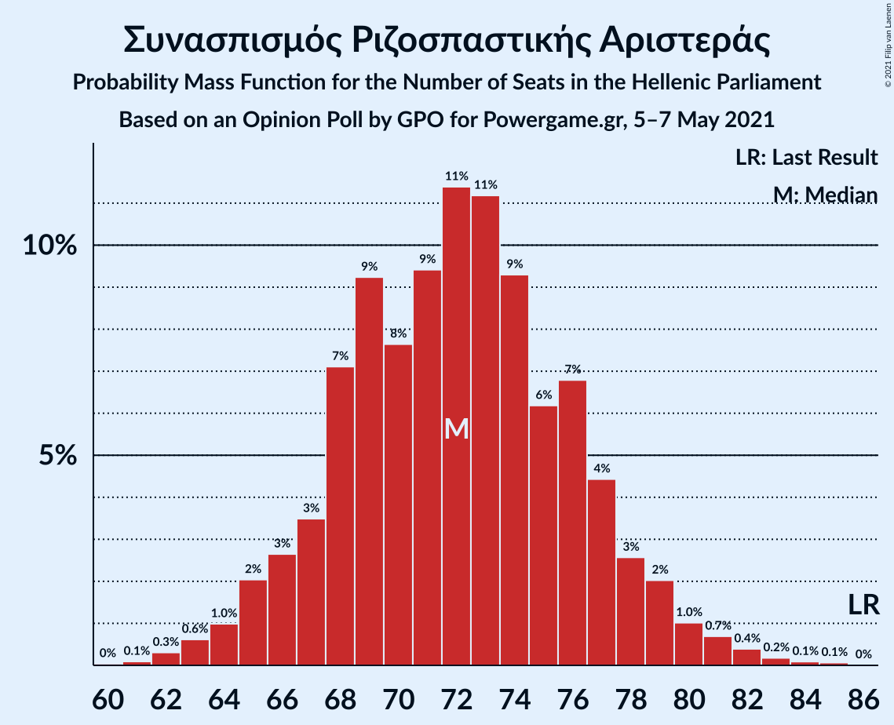
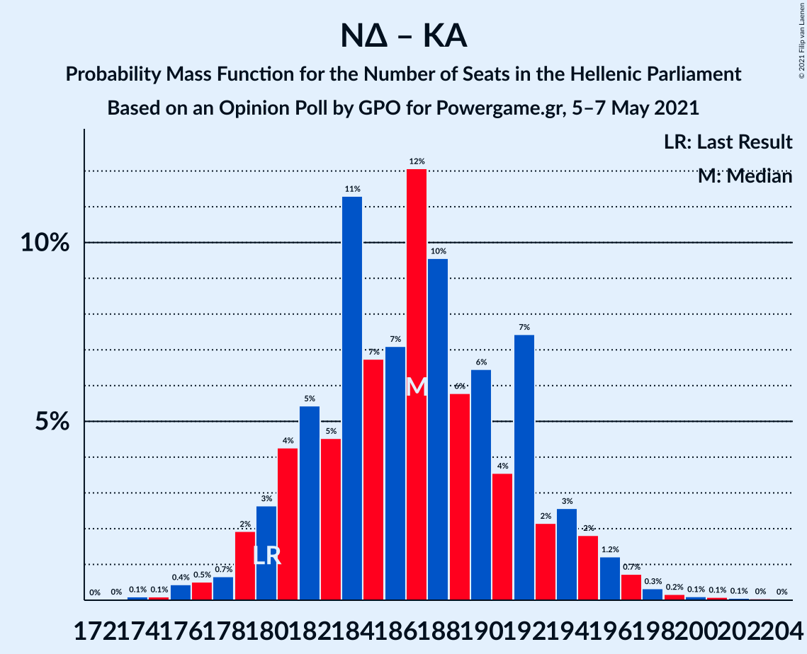
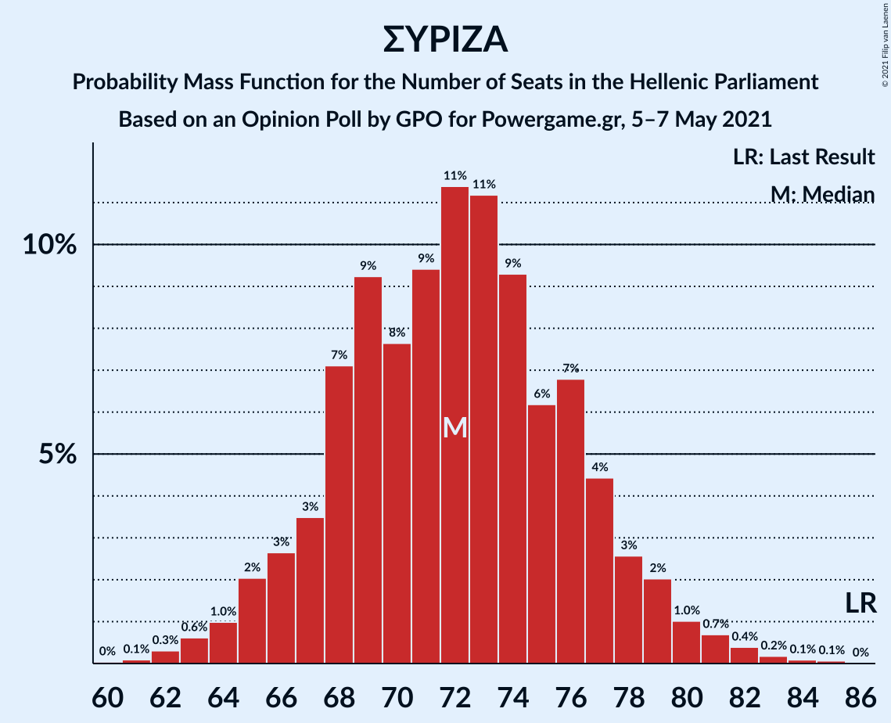

# Opinion Poll by GPO for ANT1, 5–7 May 2021

<a href="#voting-intentions">Voting Intentions</a> | <a href="#seats">Seats</a> | <a href="#coalitions">Coalitions</a> | <a href="#technical-information">Technical Information</a>

## Voting Intentions

### Confidence Intervals

| Party | Last Result | Poll Result | 80% Confidence Interval | 90% Confidence Interval | 95% Confidence Interval | 99% Confidence Interval |
|:-----:|:-----------:|:-----------:|:-----------------------:|:-----------------------:|:-----------------------:|:-----------------------:|
| Νέα Δημοκρατία | 39.8% | 43.4% | 41.4–45.4% |40.8–46.0% |40.3–46.5% |39.4–47.5% |
| Συνασπισμός Ριζοσπαστικής Αριστεράς | 31.5% | 27.3% | 25.5–29.2% |25.0–29.7% |24.6–30.1% |23.8–31.1% |
| Κίνημα Αλλαγής | 8.1% | 8.5% | 7.5–9.7% |7.2–10.1% |6.9–10.4% |6.4–11.0% |
| Κομμουνιστικό Κόμμα Ελλάδας | 5.3% | 7.2% | 6.2–8.4% |6.0–8.7% |5.7–9.0% |5.3–9.6% |
| Ελληνική Λύση | 3.7% | 4.6% | 3.9–5.6% |3.6–5.9% |3.5–6.1% |3.1–6.6% |
| Μέτωπο Ευρωπαϊκής Ρεαλιστικής Ανυπακοής | 3.4% | 3.8% | 3.1–4.7% |2.9–5.0% |2.8–5.2% |2.5–5.6% |

*Note:* The poll result column reflects the actual value used in the calculations. Published results may vary slightly, and in addition be rounded to fewer digits.

## Seats

### Confidence Intervals

| Party | Last Result | Median | 80% Confidence Interval | 90% Confidence Interval | 95% Confidence Interval | 99% Confidence Interval |
|:-----:|:-----------:|:------:|:-----------------------:|:-----------------------:|:-----------------------:|:-----------------------:|
| <a href="#νέα-δημοκρατία">Νέα Δημοκρατία</a> | 158 | 164 | 159–170 |157–171 |156–173 |154–176 |
| <a href="#συνασπισμός-ριζοσπαστικής-αριστεράς">Συνασπισμός Ριζοσπαστικής Αριστεράς</a> | 86 | 72 | 67–77 |66–78 |65–79 |63–82 |
| <a href="#κίνημα-αλλαγής">Κίνημα Αλλαγής</a> | 22 | 23 | 20–26 |19–27 |18–27 |17–29 |
| <a href="#κομμουνιστικό-κόμμα-ελλάδας">Κομμουνιστικό Κόμμα Ελλάδας</a> | 15 | 19 | 17–22 |16–23 |15–24 |14–25 |
| <a href="#ελληνική-λύση">Ελληνική Λύση</a> | 10 | 12 | 10–15 |10–15 |9–16 |8–17 |
| <a href="#μέτωπο-ευρωπαϊκής-ρεαλιστικής-ανυπακοής">Μέτωπο Ευρωπαϊκής Ρεαλιστικής Ανυπακοής</a> | 9 | 10 | 8–12 |0–13 |0–14 |0–15 |

### Νέα Δημοκρατία

*For a full overview of the results for this party, see the [Νέα Δημοκρατία](party-νέαδημοκρατία.html) page.*

| Number of Seats | Probability | Accumulated | Special Marks |
|:---------------:|:-----------:|:-----------:|:-------------:|
| 151 | 0.1% | 100% | Majority |
| 152 | 0.1% | 99.9% |  |
| 153 | 0.2% | 99.8% |  |
| 154 | 0.4% | 99.6% |  |
| 155 | 0.8% | 99.1% |  |
| 156 | 1.4% | 98% |  |
| 157 | 2% | 97% |  |
| 158 | 3% | 95% | Last Result |
| 159 | 5% | 92% |  |
| 160 | 6% | 87% |  |
| 161 | 7% | 81% |  |
| 162 | 8% | 74% |  |
| 163 | 10% | 66% |  |
| 164 | 9% | 56% | Median |
| 165 | 10% | 47% |  |
| 166 | 9% | 38% |  |
| 167 | 7% | 29% |  |
| 168 | 6% | 22% |  |
| 169 | 5% | 16% |  |
| 170 | 4% | 11% |  |
| 171 | 3% | 7% |  |
| 172 | 2% | 4% |  |
| 173 | 1.0% | 3% |  |
| 174 | 0.7% | 2% |  |
| 175 | 0.5% | 1.1% |  |
| 176 | 0.3% | 0.6% |  |
| 177 | 0.1% | 0.3% |  |
| 178 | 0.1% | 0.2% |  |
| 179 | 0% | 0.1% |  |
| 180 | 0% | 0% |  |

### Συνασπισμός Ριζοσπαστικής Αριστεράς

*For a full overview of the results for this party, see the [Συνασπισμός Ριζοσπαστικής Αριστεράς](party-συνασπισμόςριζοσπαστικήςαριστεράς.html) page.*

| Number of Seats | Probability | Accumulated | Special Marks |
|:---------------:|:-----------:|:-----------:|:-------------:|
| 60 | 0% | 100% |  |
| 61 | 0.1% | 99.9% |  |
| 62 | 0.3% | 99.8% |  |
| 63 | 0.5% | 99.5% |  |
| 64 | 1.1% | 99.0% |  |
| 65 | 2% | 98% |  |
| 66 | 3% | 96% |  |
| 67 | 5% | 93% |  |
| 68 | 6% | 88% |  |
| 69 | 8% | 82% |  |
| 70 | 10% | 74% |  |
| 71 | 10% | 64% |  |
| 72 | 10% | 54% | Median |
| 73 | 10% | 44% |  |
| 74 | 9% | 33% |  |
| 75 | 7% | 24% |  |
| 76 | 6% | 17% |  |
| 77 | 4% | 11% |  |
| 78 | 3% | 7% |  |
| 79 | 2% | 4% |  |
| 80 | 1.1% | 2% |  |
| 81 | 0.7% | 1.4% |  |
| 82 | 0.3% | 0.7% |  |
| 83 | 0.2% | 0.3% |  |
| 84 | 0.1% | 0.2% |  |
| 85 | 0% | 0.1% |  |
| 86 | 0% | 0% | Last Result |

### Κίνημα Αλλαγής

*For a full overview of the results for this party, see the [Κίνημα Αλλαγής](party-κίνημααλλαγής.html) page.*

| Number of Seats | Probability | Accumulated | Special Marks |
|:---------------:|:-----------:|:-----------:|:-------------:|
| 16 | 0.2% | 100% |  |
| 17 | 0.8% | 99.8% |  |
| 18 | 2% | 99.0% |  |
| 19 | 5% | 97% |  |
| 20 | 11% | 91% |  |
| 21 | 14% | 81% |  |
| 22 | 16% | 67% | Last Result |
| 23 | 18% | 51% | Median |
| 24 | 13% | 33% |  |
| 25 | 10% | 21% |  |
| 26 | 6% | 11% |  |
| 27 | 3% | 5% |  |
| 28 | 1.2% | 2% |  |
| 29 | 0.6% | 0.9% |  |
| 30 | 0.2% | 0.3% |  |
| 31 | 0.1% | 0.1% |  |
| 32 | 0% | 0% |  |

### Κομμουνιστικό Κόμμα Ελλάδας

*For a full overview of the results for this party, see the [Κομμουνιστικό Κόμμα Ελλάδας](party-κομμουνιστικόκόμμαελλάδας.html) page.*

| Number of Seats | Probability | Accumulated | Special Marks |
|:---------------:|:-----------:|:-----------:|:-------------:|
| 13 | 0.1% | 100% |  |
| 14 | 0.8% | 99.8% |  |
| 15 | 3% | 99.0% | Last Result |
| 16 | 5% | 96% |  |
| 17 | 14% | 91% |  |
| 18 | 17% | 77% |  |
| 19 | 15% | 60% | Median |
| 20 | 20% | 45% |  |
| 21 | 12% | 25% |  |
| 22 | 6% | 14% |  |
| 23 | 5% | 7% |  |
| 24 | 2% | 3% |  |
| 25 | 0.6% | 1.0% |  |
| 26 | 0.3% | 0.4% |  |
| 27 | 0.1% | 0.1% |  |
| 28 | 0% | 0% |  |

### Ελληνική Λύση

*For a full overview of the results for this party, see the [Ελληνική Λύση](party-ελληνικήλύση.html) page.*

| Number of Seats | Probability | Accumulated | Special Marks |
|:---------------:|:-----------:|:-----------:|:-------------:|
| 0 | 0.2% | 100% |  |
| 1 | 0% | 99.8% |  |
| 2 | 0% | 99.8% |  |
| 3 | 0% | 99.8% |  |
| 4 | 0% | 99.8% |  |
| 5 | 0% | 99.8% |  |
| 6 | 0% | 99.8% |  |
| 7 | 0% | 99.8% |  |
| 8 | 0.6% | 99.8% |  |
| 9 | 4% | 99.2% |  |
| 10 | 10% | 96% | Last Result |
| 11 | 20% | 85% |  |
| 12 | 21% | 66% | Median |
| 13 | 19% | 44% |  |
| 14 | 14% | 25% |  |
| 15 | 7% | 11% |  |
| 16 | 3% | 4% |  |
| 17 | 1.0% | 1.4% |  |
| 18 | 0.3% | 0.4% |  |
| 19 | 0.1% | 0.1% |  |
| 20 | 0% | 0% |  |

### Μέτωπο Ευρωπαϊκής Ρεαλιστικής Ανυπακοής

*For a full overview of the results for this party, see the [Μέτωπο Ευρωπαϊκής Ρεαλιστικής Ανυπακοής](party-μέτωποευρωπαϊκήςρεαλιστικήςανυπακοής.html) page.*

| Number of Seats | Probability | Accumulated | Special Marks |
|:---------------:|:-----------:|:-----------:|:-------------:|
| 0 | 7% | 100% |  |
| 1 | 0% | 93% |  |
| 2 | 0% | 93% |  |
| 3 | 0% | 93% |  |
| 4 | 0% | 93% |  |
| 5 | 0% | 93% |  |
| 6 | 0% | 93% |  |
| 7 | 0% | 93% |  |
| 8 | 7% | 93% |  |
| 9 | 21% | 87% | Last Result |
| 10 | 24% | 66% | Median |
| 11 | 21% | 42% |  |
| 12 | 13% | 21% |  |
| 13 | 6% | 8% |  |
| 14 | 2% | 3% |  |
| 15 | 0.6% | 0.8% |  |
| 16 | 0.1% | 0.2% |  |
| 17 | 0% | 0% |  |

## Coalitions

### Confidence Intervals

| Coalition | Last Result | Median | Majority? | 80% Confidence Interval | 90% Confidence Interval | 95% Confidence Interval | 99% Confidence Interval |
|:---------:|:-----------:|:------:|:---------:|:-----------------------:|:-----------------------:|:-----------------------:|:-----------------------:|
| Νέα Δημοκρατία – Κίνημα Αλλαγής | 180 | 187 | 100% | 181–192 | 180–194 | 179–196 | 176–199 |
| Νέα Δημοκρατία | 158 | 164 | 100% | 159–170 | 157–171 | 156–173 | 154–176 |
| Συνασπισμός Ριζοσπαστικής Αριστεράς – Μέτωπο Ευρωπαϊκής Ρεαλιστικής Ανυπακοής | 95 | 82 | 0% | 76–87 | 75–88 | 73–89 | 69–92 |
| Συνασπισμός Ριζοσπαστικής Αριστεράς | 86 | 72 | 0% | 67–77 | 66–78 | 65–79 | 63–82 |

### Νέα Δημοκρατία – Κίνημα Αλλαγής

| Number of Seats | Probability | Accumulated | Special Marks |
|:---------------:|:-----------:|:-----------:|:-------------:|
| 173 | 0% | 100% |  |
| 174 | 0.1% | 99.9% |  |
| 175 | 0.2% | 99.8% |  |
| 176 | 0.3% | 99.7% |  |
| 177 | 0.6% | 99.3% |  |
| 178 | 1.0% | 98.8% |  |
| 179 | 2% | 98% |  |
| 180 | 3% | 96% | Last Result |
| 181 | 4% | 93% |  |
| 182 | 5% | 89% |  |
| 183 | 5% | 84% |  |
| 184 | 8% | 79% |  |
| 185 | 9% | 71% |  |
| 186 | 11% | 62% |  |
| 187 | 9% | 51% | Median |
| 188 | 8% | 42% |  |
| 189 | 7% | 34% |  |
| 190 | 7% | 26% |  |
| 191 | 6% | 20% |  |
| 192 | 4% | 14% |  |
| 193 | 3% | 9% |  |
| 194 | 2% | 6% |  |
| 195 | 1.3% | 4% |  |
| 196 | 1.0% | 3% |  |
| 197 | 0.7% | 2% |  |
| 198 | 0.4% | 1.0% |  |
| 199 | 0.3% | 0.6% |  |
| 200 | 0.1% | 0.3% |  |
| 201 | 0.1% | 0.2% |  |
| 202 | 0.1% | 0.1% |  |
| 203 | 0% | 0.1% |  |
| 204 | 0% | 0% |  |

### Νέα Δημοκρατία

| Number of Seats | Probability | Accumulated | Special Marks |
|:---------------:|:-----------:|:-----------:|:-------------:|
| 151 | 0.1% | 100% | Majority |
| 152 | 0.1% | 99.9% |  |
| 153 | 0.2% | 99.8% |  |
| 154 | 0.4% | 99.6% |  |
| 155 | 0.8% | 99.1% |  |
| 156 | 1.4% | 98% |  |
| 157 | 2% | 97% |  |
| 158 | 3% | 95% | Last Result |
| 159 | 5% | 92% |  |
| 160 | 6% | 87% |  |
| 161 | 7% | 81% |  |
| 162 | 8% | 74% |  |
| 163 | 10% | 66% |  |
| 164 | 9% | 56% | Median |
| 165 | 10% | 47% |  |
| 166 | 9% | 38% |  |
| 167 | 7% | 29% |  |
| 168 | 6% | 22% |  |
| 169 | 5% | 16% |  |
| 170 | 4% | 11% |  |
| 171 | 3% | 7% |  |
| 172 | 2% | 4% |  |
| 173 | 1.0% | 3% |  |
| 174 | 0.7% | 2% |  |
| 175 | 0.5% | 1.1% |  |
| 176 | 0.3% | 0.6% |  |
| 177 | 0.1% | 0.3% |  |
| 178 | 0.1% | 0.2% |  |
| 179 | 0% | 0.1% |  |
| 180 | 0% | 0% |  |

### Συνασπισμός Ριζοσπαστικής Αριστεράς – Μέτωπο Ευρωπαϊκής Ρεαλιστικής Ανυπακοής

| Number of Seats | Probability | Accumulated | Special Marks |
|:---------------:|:-----------:|:-----------:|:-------------:|
| 66 | 0% | 100% |  |
| 67 | 0.1% | 99.9% |  |
| 68 | 0.1% | 99.8% |  |
| 69 | 0.3% | 99.7% |  |
| 70 | 0.4% | 99.5% |  |
| 71 | 0.6% | 99.1% |  |
| 72 | 0.7% | 98% |  |
| 73 | 1.1% | 98% |  |
| 74 | 2% | 97% |  |
| 75 | 2% | 95% |  |
| 76 | 3% | 93% |  |
| 77 | 4% | 90% |  |
| 78 | 6% | 85% |  |
| 79 | 8% | 79% |  |
| 80 | 8% | 71% |  |
| 81 | 9% | 63% |  |
| 82 | 10% | 54% | Median |
| 83 | 10% | 44% |  |
| 84 | 9% | 33% |  |
| 85 | 7% | 25% |  |
| 86 | 6% | 18% |  |
| 87 | 4% | 12% |  |
| 88 | 3% | 8% |  |
| 89 | 2% | 4% |  |
| 90 | 1.1% | 2% |  |
| 91 | 0.7% | 1.4% |  |
| 92 | 0.4% | 0.7% |  |
| 93 | 0.2% | 0.4% |  |
| 94 | 0.1% | 0.2% |  |
| 95 | 0% | 0.1% | Last Result |
| 96 | 0% | 0% |  |

### Συνασπισμός Ριζοσπαστικής Αριστεράς

| Number of Seats | Probability | Accumulated | Special Marks |
|:---------------:|:-----------:|:-----------:|:-------------:|
| 60 | 0% | 100% |  |
| 61 | 0.1% | 99.9% |  |
| 62 | 0.3% | 99.8% |  |
| 63 | 0.5% | 99.5% |  |
| 64 | 1.1% | 99.0% |  |
| 65 | 2% | 98% |  |
| 66 | 3% | 96% |  |
| 67 | 5% | 93% |  |
| 68 | 6% | 88% |  |
| 69 | 8% | 82% |  |
| 70 | 10% | 74% |  |
| 71 | 10% | 64% |  |
| 72 | 10% | 54% | Median |
| 73 | 10% | 44% |  |
| 74 | 9% | 33% |  |
| 75 | 7% | 24% |  |
| 76 | 6% | 17% |  |
| 77 | 4% | 11% |  |
| 78 | 3% | 7% |  |
| 79 | 2% | 4% |  |
| 80 | 1.1% | 2% |  |
| 81 | 0.7% | 1.4% |  |
| 82 | 0.3% | 0.7% |  |
| 83 | 0.2% | 0.3% |  |
| 84 | 0.1% | 0.2% |  |
| 85 | 0% | 0.1% |  |
| 86 | 0% | 0% | Last Result |

## Technical Information

### Opinion Poll

+ **Polling firm:** GPO
+ **Commissioner(s):** ANT1
+ **Fieldwork period:** 5–7 May 2021

### Calculations

+ **Sample size:** 1000
+ **Simulations done:** 1,048,576
+ **Error estimate:** 0.85%

