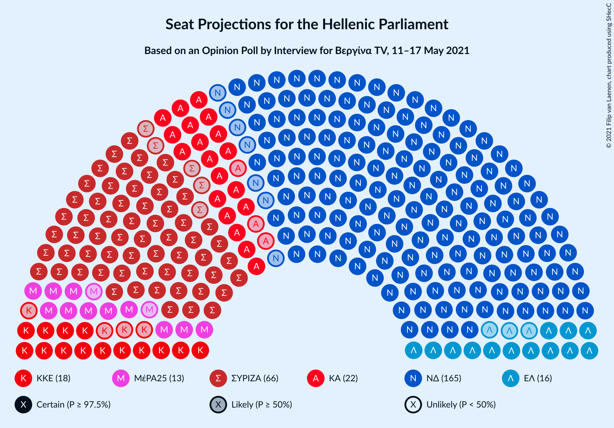
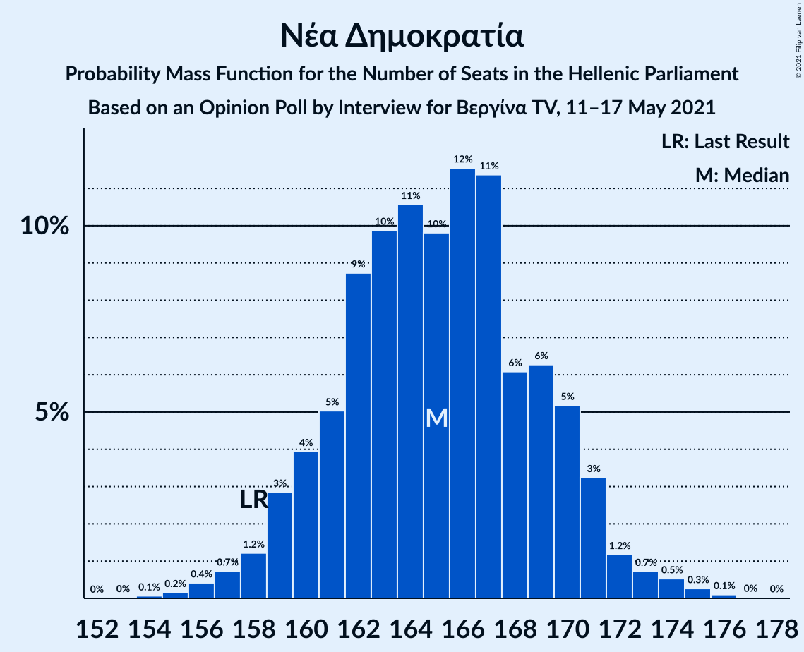
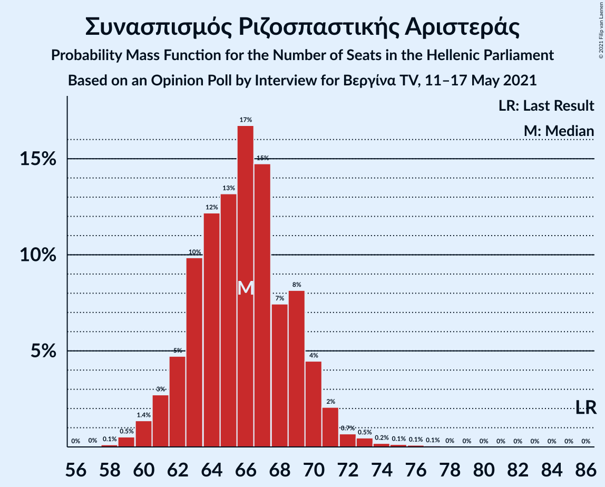

# Opinion Poll by Interview for Βεργίνα TV, 11–17 May 2021

<a href="#voting-intentions">Voting Intentions</a> | <a href="#seats">Seats</a> | <a href="#coalitions">Coalitions</a> | <a href="#technical-information">Technical Information</a>

## Voting Intentions

### Confidence Intervals

| Party | Last Result | Poll Result | 80% Confidence Interval | 90% Confidence Interval | 95% Confidence Interval | 99% Confidence Interval |
|:-----:|:-----------:|:-----------:|:-----------------------:|:-----------------------:|:-----------------------:|:-----------------------:|
| Νέα Δημοκρατία | 39.8% | 42.0% | 40.3–43.7% |39.8–44.2% |39.4–44.6% |38.6–45.4% |
| Συνασπισμός Ριζοσπαστικής Αριστεράς | 31.5% | 24.4% | 23.0–25.9% |22.6–26.4% |22.2–26.7% |21.6–27.5% |
| Κίνημα Αλλαγής | 8.1% | 8.1% | 7.2–9.1% |7.0–9.4% |6.8–9.7% |6.4–10.2% |
| Κομμουνιστικό Κόμμα Ελλάδας | 5.3% | 6.4% | 5.6–7.3% |5.4–7.6% |5.2–7.8% |4.9–8.3% |
| Ελληνική Λύση | 3.7% | 5.8% | 5.0–6.6% |4.8–6.9% |4.7–7.1% |4.3–7.6% |
| Μέτωπο Ευρωπαϊκής Ρεαλιστικής Ανυπακοής | 3.4% | 4.2% | 3.6–5.0% |3.4–5.2% |3.3–5.4% |3.0–5.8% |

*Note:* The poll result column reflects the actual value used in the calculations. Published results may vary slightly, and in addition be rounded to fewer digits.

## Seats

### Confidence Intervals

| Party | Last Result | Median | 80% Confidence Interval | 90% Confidence Interval | 95% Confidence Interval | 99% Confidence Interval |
|:-----:|:-----------:|:------:|:-----------------------:|:-----------------------:|:-----------------------:|:-----------------------:|
| <a href="#νέα-δημοκρατία">Νέα Δημοκρατία</a> | 158 | 165 | 161–170 |159–171 |158–172 |156–174 |
| <a href="#συνασπισμός-ριζοσπαστικής-αριστεράς">Συνασπισμός Ριζοσπαστικής Αριστεράς</a> | 86 | 66 | 63–69 |62–70 |61–71 |59–74 |
| <a href="#κίνημα-αλλαγής">Κίνημα Αλλαγής</a> | 22 | 22 | 20–25 |19–26 |19–26 |17–28 |
| <a href="#κομμουνιστικό-κόμμα-ελλάδας">Κομμουνιστικό Κόμμα Ελλάδας</a> | 15 | 18 | 16–20 |15–21 |14–21 |13–23 |
| <a href="#ελληνική-λύση">Ελληνική Λύση</a> | 10 | 16 | 14–19 |14–19 |13–20 |12–21 |
| <a href="#μέτωπο-ευρωπαϊκής-ρεαλιστικής-ανυπακοής">Μέτωπο Ευρωπαϊκής Ρεαλιστικής Ανυπακοής</a> | 9 | 13 | 11–14 |11–14 |11–14 |9–15 |

### Νέα Δημοκρατία

*For a full overview of the results for this party, see the [Νέα Δημοκρατία](party-νέαδημοκρατία.html) page.*

| Number of Seats | Probability | Accumulated | Special Marks |
|:---------------:|:-----------:|:-----------:|:-------------:|
| 154 | 0.1% | 100% |  |
| 155 | 0.2% | 99.9% |  |
| 156 | 0.4% | 99.7% |  |
| 157 | 0.7% | 99.3% |  |
| 158 | 1.2% | 98.6% | Last Result |
| 159 | 3% | 97% |  |
| 160 | 4% | 95% |  |
| 161 | 5% | 91% |  |
| 162 | 9% | 86% |  |
| 163 | 10% | 77% |  |
| 164 | 11% | 67% |  |
| 165 | 10% | 56% | Median |
| 166 | 12% | 47% |  |
| 167 | 11% | 35% |  |
| 168 | 6% | 24% |  |
| 169 | 6% | 18% |  |
| 170 | 5% | 11% |  |
| 171 | 3% | 6% |  |
| 172 | 1.2% | 3% |  |
| 173 | 0.7% | 2% |  |
| 174 | 0.5% | 0.9% |  |
| 175 | 0.3% | 0.4% |  |
| 176 | 0.1% | 0.2% |  |
| 177 | 0% | 0.1% |  |
| 178 | 0% | 0% |  |

### Συνασπισμός Ριζοσπαστικής Αριστεράς

*For a full overview of the results for this party, see the [Συνασπισμός Ριζοσπαστικής Αριστεράς](party-συνασπισμόςριζοσπαστικήςαριστεράς.html) page.*

| Number of Seats | Probability | Accumulated | Special Marks |
|:---------------:|:-----------:|:-----------:|:-------------:|
| 57 | 0% | 100% |  |
| 58 | 0.1% | 99.9% |  |
| 59 | 0.5% | 99.8% |  |
| 60 | 1.4% | 99.3% |  |
| 61 | 3% | 98% |  |
| 62 | 5% | 95% |  |
| 63 | 10% | 91% |  |
| 64 | 12% | 81% |  |
| 65 | 13% | 68% |  |
| 66 | 17% | 55% | Median |
| 67 | 15% | 39% |  |
| 68 | 7% | 24% |  |
| 69 | 8% | 16% |  |
| 70 | 4% | 8% |  |
| 71 | 2% | 4% |  |
| 72 | 0.7% | 2% |  |
| 73 | 0.5% | 1.0% |  |
| 74 | 0.2% | 0.5% |  |
| 75 | 0.1% | 0.3% |  |
| 76 | 0.1% | 0.2% |  |
| 77 | 0.1% | 0.1% |  |
| 78 | 0% | 0.1% |  |
| 79 | 0% | 0% |  |
| 80 | 0% | 0% |  |
| 81 | 0% | 0% |  |
| 82 | 0% | 0% |  |
| 83 | 0% | 0% |  |
| 84 | 0% | 0% |  |
| 85 | 0% | 0% |  |
| 86 | 0% | 0% | Last Result |

### Κίνημα Αλλαγής

*For a full overview of the results for this party, see the [Κίνημα Αλλαγής](party-κίνημααλλαγής.html) page.*

| Number of Seats | Probability | Accumulated | Special Marks |
|:---------------:|:-----------:|:-----------:|:-------------:|
| 16 | 0.1% | 100% |  |
| 17 | 0.4% | 99.9% |  |
| 18 | 2% | 99.5% |  |
| 19 | 5% | 98% |  |
| 20 | 11% | 93% |  |
| 21 | 16% | 83% |  |
| 22 | 21% | 67% | Last Result, Median |
| 23 | 18% | 46% |  |
| 24 | 12% | 28% |  |
| 25 | 9% | 15% |  |
| 26 | 4% | 7% |  |
| 27 | 2% | 2% |  |
| 28 | 0.6% | 0.9% |  |
| 29 | 0.2% | 0.3% |  |
| 30 | 0% | 0.1% |  |
| 31 | 0% | 0% |  |

### Κομμουνιστικό Κόμμα Ελλάδας

*For a full overview of the results for this party, see the [Κομμουνιστικό Κόμμα Ελλάδας](party-κομμουνιστικόκόμμαελλάδας.html) page.*

| Number of Seats | Probability | Accumulated | Special Marks |
|:---------------:|:-----------:|:-----------:|:-------------:|
| 12 | 0.1% | 100% |  |
| 13 | 0.5% | 99.9% |  |
| 14 | 2% | 99.4% |  |
| 15 | 7% | 97% | Last Result |
| 16 | 14% | 90% |  |
| 17 | 26% | 77% |  |
| 18 | 19% | 50% | Median |
| 19 | 15% | 32% |  |
| 20 | 11% | 17% |  |
| 21 | 4% | 6% |  |
| 22 | 1.5% | 2% |  |
| 23 | 0.5% | 0.6% |  |
| 24 | 0.1% | 0.1% |  |
| 25 | 0% | 0% |  |

### Ελληνική Λύση

*For a full overview of the results for this party, see the [Ελληνική Λύση](party-ελληνικήλύση.html) page.*

| Number of Seats | Probability | Accumulated | Special Marks |
|:---------------:|:-----------:|:-----------:|:-------------:|
| 10 | 0% | 100% | Last Result |
| 11 | 0.1% | 100% |  |
| 12 | 0.6% | 99.9% |  |
| 13 | 3% | 99.3% |  |
| 14 | 9% | 97% |  |
| 15 | 15% | 88% |  |
| 16 | 25% | 73% | Median |
| 17 | 24% | 48% |  |
| 18 | 13% | 24% |  |
| 19 | 7% | 11% |  |
| 20 | 3% | 4% |  |
| 21 | 0.7% | 0.9% |  |
| 22 | 0.1% | 0.2% |  |
| 23 | 0% | 0% |  |

### Μέτωπο Ευρωπαϊκής Ρεαλιστικής Ανυπακοής

*For a full overview of the results for this party, see the [Μέτωπο Ευρωπαϊκής Ρεαλιστικής Ανυπακοής](party-μέτωποευρωπαϊκήςρεαλιστικήςανυπακοής.html) page.*

| Number of Seats | Probability | Accumulated | Special Marks |
|:---------------:|:-----------:|:-----------:|:-------------:|
| 0 | 0.3% | 100% |  |
| 1 | 0% | 99.7% |  |
| 2 | 0% | 99.7% |  |
| 3 | 0% | 99.7% |  |
| 4 | 0% | 99.7% |  |
| 5 | 0% | 99.7% |  |
| 6 | 0% | 99.7% |  |
| 7 | 0% | 99.7% |  |
| 8 | 0.1% | 99.7% |  |
| 9 | 0.3% | 99.6% | Last Result |
| 10 | 2% | 99.4% |  |
| 11 | 9% | 98% |  |
| 12 | 37% | 89% |  |
| 13 | 38% | 51% | Median |
| 14 | 12% | 13% |  |
| 15 | 1.4% | 2% |  |
| 16 | 0.1% | 0.1% |  |
| 17 | 0% | 0% |  |

## Coalitions

### Confidence Intervals

| Coalition | Last Result | Median | Majority? | 80% Confidence Interval | 90% Confidence Interval | 95% Confidence Interval | 99% Confidence Interval |
|:---------:|:-----------:|:------:|:---------:|:-----------------------:|:-----------------------:|:-----------------------:|:-----------------------:|
| Νέα Δημοκρατία – Κίνημα Αλλαγής | 180 | 187 | 100% | 183–192 | 182–193 | 180–194 | 178–197 |
| Νέα Δημοκρατία | 158 | 165 | 100% | 161–170 | 159–171 | 158–172 | 156–174 |
| Συνασπισμός Ριζοσπαστικής Αριστεράς – Μέτωπο Ευρωπαϊκής Ρεαλιστικής Ανυπακοής | 95 | 78 | 0% | 74–82 | 73–84 | 72–85 | 70–87 |
| Συνασπισμός Ριζοσπαστικής Αριστεράς | 86 | 66 | 0% | 63–69 | 62–70 | 61–71 | 59–74 |

### Νέα Δημοκρατία – Κίνημα Αλλαγής

| Number of Seats | Probability | Accumulated | Special Marks |
|:---------------:|:-----------:|:-----------:|:-------------:|
| 176 | 0% | 100% |  |
| 177 | 0.1% | 99.9% |  |
| 178 | 0.4% | 99.8% |  |
| 179 | 0.2% | 99.4% |  |
| 180 | 2% | 99.2% | Last Result |
| 181 | 1.3% | 97% |  |
| 182 | 4% | 96% |  |
| 183 | 4% | 92% |  |
| 184 | 6% | 88% |  |
| 185 | 14% | 82% |  |
| 186 | 3% | 69% |  |
| 187 | 19% | 66% | Median |
| 188 | 6% | 47% |  |
| 189 | 12% | 40% |  |
| 190 | 11% | 28% |  |
| 191 | 4% | 18% |  |
| 192 | 7% | 14% |  |
| 193 | 2% | 7% |  |
| 194 | 2% | 4% |  |
| 195 | 0.9% | 2% |  |
| 196 | 0.5% | 1.1% |  |
| 197 | 0.4% | 0.5% |  |
| 198 | 0.1% | 0.2% |  |
| 199 | 0.1% | 0.1% |  |
| 200 | 0% | 0% |  |

### Νέα Δημοκρατία

| Number of Seats | Probability | Accumulated | Special Marks |
|:---------------:|:-----------:|:-----------:|:-------------:|
| 154 | 0.1% | 100% |  |
| 155 | 0.2% | 99.9% |  |
| 156 | 0.4% | 99.7% |  |
| 157 | 0.7% | 99.3% |  |
| 158 | 1.2% | 98.6% | Last Result |
| 159 | 3% | 97% |  |
| 160 | 4% | 95% |  |
| 161 | 5% | 91% |  |
| 162 | 9% | 86% |  |
| 163 | 10% | 77% |  |
| 164 | 11% | 67% |  |
| 165 | 10% | 56% | Median |
| 166 | 12% | 47% |  |
| 167 | 11% | 35% |  |
| 168 | 6% | 24% |  |
| 169 | 6% | 18% |  |
| 170 | 5% | 11% |  |
| 171 | 3% | 6% |  |
| 172 | 1.2% | 3% |  |
| 173 | 0.7% | 2% |  |
| 174 | 0.5% | 0.9% |  |
| 175 | 0.3% | 0.4% |  |
| 176 | 0.1% | 0.2% |  |
| 177 | 0% | 0.1% |  |
| 178 | 0% | 0% |  |

### Συνασπισμός Ριζοσπαστικής Αριστεράς – Μέτωπο Ευρωπαϊκής Ρεαλιστικής Ανυπακοής

| Number of Seats | Probability | Accumulated | Special Marks |
|:---------------:|:-----------:|:-----------:|:-------------:|
| 68 | 0.1% | 100% |  |
| 69 | 0.2% | 99.9% |  |
| 70 | 0.4% | 99.7% |  |
| 71 | 1.1% | 99.3% |  |
| 72 | 2% | 98% |  |
| 73 | 3% | 96% |  |
| 74 | 4% | 93% |  |
| 75 | 8% | 89% |  |
| 76 | 9% | 81% |  |
| 77 | 10% | 72% |  |
| 78 | 13% | 61% |  |
| 79 | 15% | 48% | Median |
| 80 | 9% | 33% |  |
| 81 | 7% | 24% |  |
| 82 | 7% | 17% |  |
| 83 | 5% | 10% |  |
| 84 | 2% | 5% |  |
| 85 | 2% | 3% |  |
| 86 | 0.8% | 1.5% |  |
| 87 | 0.4% | 0.6% |  |
| 88 | 0.1% | 0.2% |  |
| 89 | 0.1% | 0.1% |  |
| 90 | 0% | 0% |  |
| 91 | 0% | 0% |  |
| 92 | 0% | 0% |  |
| 93 | 0% | 0% |  |
| 94 | 0% | 0% |  |
| 95 | 0% | 0% | Last Result |

### Συνασπισμός Ριζοσπαστικής Αριστεράς

| Number of Seats | Probability | Accumulated | Special Marks |
|:---------------:|:-----------:|:-----------:|:-------------:|
| 57 | 0% | 100% |  |
| 58 | 0.1% | 99.9% |  |
| 59 | 0.5% | 99.8% |  |
| 60 | 1.4% | 99.3% |  |
| 61 | 3% | 98% |  |
| 62 | 5% | 95% |  |
| 63 | 10% | 91% |  |
| 64 | 12% | 81% |  |
| 65 | 13% | 68% |  |
| 66 | 17% | 55% | Median |
| 67 | 15% | 39% |  |
| 68 | 7% | 24% |  |
| 69 | 8% | 16% |  |
| 70 | 4% | 8% |  |
| 71 | 2% | 4% |  |
| 72 | 0.7% | 2% |  |
| 73 | 0.5% | 1.0% |  |
| 74 | 0.2% | 0.5% |  |
| 75 | 0.1% | 0.3% |  |
| 76 | 0.1% | 0.2% |  |
| 77 | 0.1% | 0.1% |  |
| 78 | 0% | 0.1% |  |
| 79 | 0% | 0% |  |
| 80 | 0% | 0% |  |
| 81 | 0% | 0% |  |
| 82 | 0% | 0% |  |
| 83 | 0% | 0% |  |
| 84 | 0% | 0% |  |
| 85 | 0% | 0% |  |
| 86 | 0% | 0% | Last Result |

## Technical Information

### Opinion Poll

+ **Polling firm:** Interview
+ **Commissioner(s):** Βεργίνα TV
+ **Fieldwork period:** 11–17 May 2021

### Calculations

+ **Sample size:** 1405
+ **Simulations done:** 131,072
+ **Error estimate:** 0.35%

