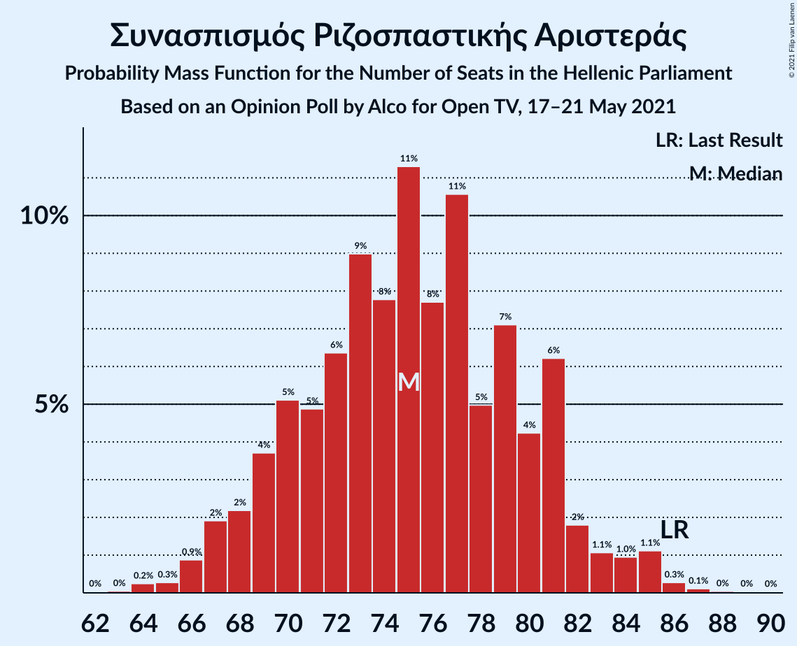
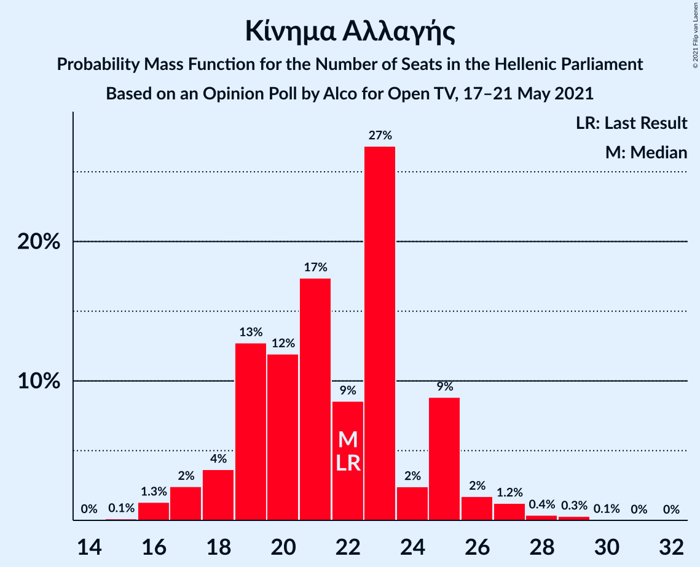
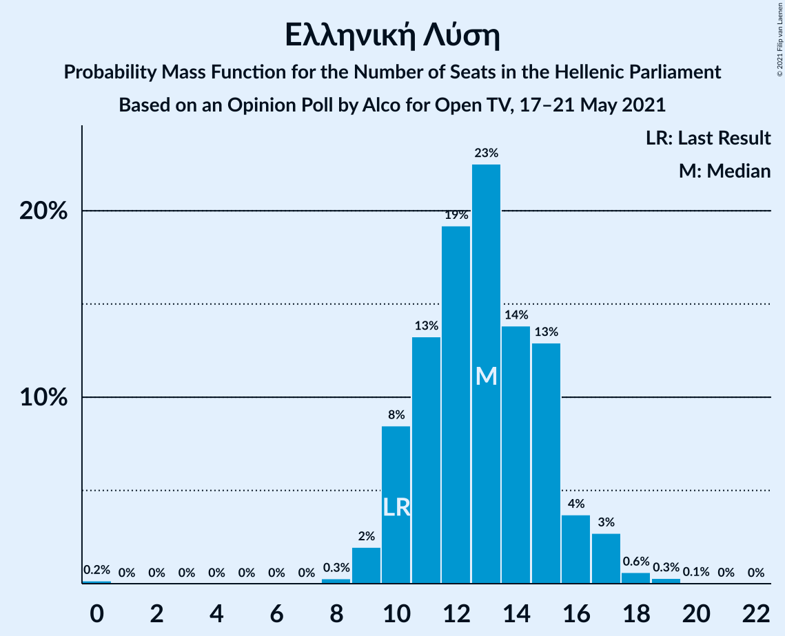
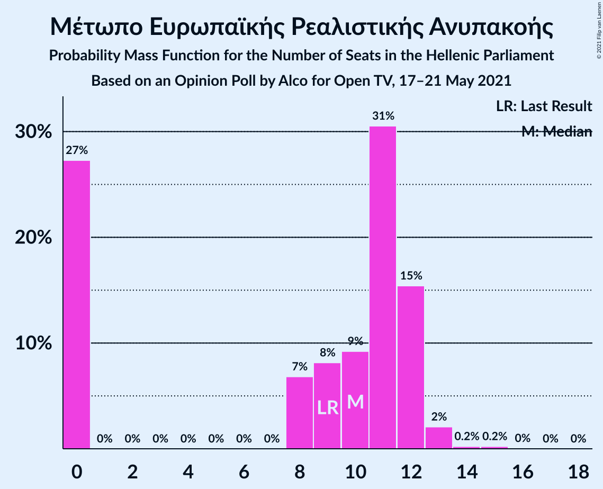

# Opinion Poll by Alco for Open TV, 17–21 May 2021

<a href="#voting-intentions">Voting Intentions</a> | <a href="#seats">Seats</a> | <a href="#coalitions">Coalitions</a> | <a href="#technical-information">Technical Information</a>

## Voting Intentions

### Confidence Intervals

| Party | Last Result | Poll Result | 80% Confidence Interval | 90% Confidence Interval | 95% Confidence Interval | 99% Confidence Interval |
|:-----:|:-----------:|:-----------:|:-----------------------:|:-----------------------:|:-----------------------:|:-----------------------:|
| Νέα Δημοκρατία | 39.8% | 43.3% | 41.3–45.3% |40.7–45.9% |40.3–46.4% |39.3–47.4% |
| Συνασπισμός Ριζοσπαστικής Αριστεράς | 31.5% | 27.9% | 26.1–29.8% |25.6–30.3% |25.2–30.8% |24.4–31.7% |
| Κίνημα Αλλαγής | 8.1% | 7.9% | 6.9–9.1% |6.6–9.4% |6.4–9.7% |5.9–10.3% |
| Κομμουνιστικό Κόμμα Ελλάδας | 5.3% | 6.0% | 5.1–7.1% |4.9–7.4% |4.7–7.7% |4.3–8.2% |
| Ελληνική Λύση | 3.7% | 4.7% | 3.9–5.7% |3.7–6.0% |3.6–6.2% |3.2–6.7% |
| Μέτωπο Ευρωπαϊκής Ρεαλιστικής Ανυπακοής | 3.4% | 3.4% | 2.8–4.3% |2.6–4.5% |2.4–4.7% |2.2–5.2% |
| Πλεύση Ελευθερίας | 1.5% | 1.3% | 0.9–1.9% |0.8–2.1% |0.8–2.2% |0.6–2.5% |

*Note:* The poll result column reflects the actual value used in the calculations. Published results may vary slightly, and in addition be rounded to fewer digits.

## Seats

### Confidence Intervals

| Party | Last Result | Median | 80% Confidence Interval | 90% Confidence Interval | 95% Confidence Interval | 99% Confidence Interval |
|:-----:|:-----------:|:------:|:-----------------------:|:-----------------------:|:-----------------------:|:-----------------------:|
| <a href="#νέα-δημοκρατία">Νέα Δημοκρατία</a> | 158 | 167 | 161–172 |159–174 |158–176 |155–178 |
| <a href="#συνασπισμός-ριζοσπαστικής-αριστεράς">Συνασπισμός Ριζοσπαστικής Αριστεράς</a> | 86 | 75 | 70–81 |68–82 |67–84 |65–86 |
| <a href="#κίνημα-αλλαγής">Κίνημα Αλλαγής</a> | 22 | 22 | 19–25 |18–25 |17–26 |16–28 |
| <a href="#κομμουνιστικό-κόμμα-ελλάδας">Κομμουνιστικό Κόμμα Ελλάδας</a> | 15 | 16 | 13–18 |13–19 |12–20 |11–21 |
| <a href="#ελληνική-λύση">Ελληνική Λύση</a> | 10 | 13 | 10–15 |10–16 |10–17 |9–18 |
| <a href="#μέτωπο-ευρωπαϊκής-ρεαλιστικής-ανυπακοής">Μέτωπο Ευρωπαϊκής Ρεαλιστικής Ανυπακοής</a> | 9 | 10 | 0–12 |0–12 |0–13 |0–14 |
| <a href="#πλεύση-ελευθερίας">Πλεύση Ελευθερίας</a> | 0 | 0 | 0 |0 |0 |0 |

### Νέα Δημοκρατία

*For a full overview of the results for this party, see the [Νέα Δημοκρατία](party-νέαδημοκρατία.html) page.*

| Number of Seats | Probability | Accumulated | Special Marks |
|:---------------:|:-----------:|:-----------:|:-------------:|
| 152 | 0% | 100% |  |
| 153 | 0.1% | 99.9% |  |
| 154 | 0.1% | 99.9% |  |
| 155 | 0.3% | 99.7% |  |
| 156 | 0.5% | 99.5% |  |
| 157 | 1.4% | 99.0% |  |
| 158 | 1.0% | 98% | Last Result |
| 159 | 2% | 97% |  |
| 160 | 2% | 94% |  |
| 161 | 6% | 92% |  |
| 162 | 4% | 86% |  |
| 163 | 7% | 82% |  |
| 164 | 6% | 75% |  |
| 165 | 7% | 69% |  |
| 166 | 11% | 62% |  |
| 167 | 8% | 52% | Median |
| 168 | 10% | 44% |  |
| 169 | 4% | 34% |  |
| 170 | 7% | 30% |  |
| 171 | 5% | 23% |  |
| 172 | 8% | 17% |  |
| 173 | 3% | 9% |  |
| 174 | 3% | 6% |  |
| 175 | 0.8% | 4% |  |
| 176 | 1.2% | 3% |  |
| 177 | 0.6% | 2% |  |
| 178 | 0.5% | 1.0% |  |
| 179 | 0.2% | 0.4% |  |
| 180 | 0.2% | 0.3% |  |
| 181 | 0% | 0.1% |  |
| 182 | 0% | 0.1% |  |
| 183 | 0% | 0% |  |

### Συνασπισμός Ριζοσπαστικής Αριστεράς

*For a full overview of the results for this party, see the [Συνασπισμός Ριζοσπαστικής Αριστεράς](party-συνασπισμόςριζοσπαστικήςαριστεράς.html) page.*

| Number of Seats | Probability | Accumulated | Special Marks |
|:---------------:|:-----------:|:-----------:|:-------------:|
| 63 | 0% | 100% |  |
| 64 | 0.2% | 99.9% |  |
| 65 | 0.3% | 99.7% |  |
| 66 | 0.9% | 99.4% |  |
| 67 | 2% | 98.5% |  |
| 68 | 2% | 97% |  |
| 69 | 4% | 94% |  |
| 70 | 5% | 91% |  |
| 71 | 5% | 86% |  |
| 72 | 6% | 81% |  |
| 73 | 9% | 74% |  |
| 74 | 8% | 65% |  |
| 75 | 11% | 58% | Median |
| 76 | 8% | 46% |  |
| 77 | 11% | 39% |  |
| 78 | 5% | 28% |  |
| 79 | 7% | 23% |  |
| 80 | 4% | 16% |  |
| 81 | 6% | 12% |  |
| 82 | 2% | 5% |  |
| 83 | 1.1% | 4% |  |
| 84 | 1.0% | 3% |  |
| 85 | 1.1% | 2% |  |
| 86 | 0.3% | 0.5% | Last Result |
| 87 | 0.1% | 0.2% |  |
| 88 | 0% | 0.1% |  |
| 89 | 0% | 0.1% |  |
| 90 | 0% | 0% |  |

### Κίνημα Αλλαγής

*For a full overview of the results for this party, see the [Κίνημα Αλλαγής](party-κίνημααλλαγής.html) page.*

| Number of Seats | Probability | Accumulated | Special Marks |
|:---------------:|:-----------:|:-----------:|:-------------:|
| 14 | 0% | 100% |  |
| 15 | 0.1% | 99.9% |  |
| 16 | 1.3% | 99.8% |  |
| 17 | 2% | 98.5% |  |
| 18 | 4% | 96% |  |
| 19 | 13% | 92% |  |
| 20 | 12% | 80% |  |
| 21 | 17% | 68% |  |
| 22 | 9% | 50% | Last Result, Median |
| 23 | 27% | 42% |  |
| 24 | 2% | 15% |  |
| 25 | 9% | 13% |  |
| 26 | 2% | 4% |  |
| 27 | 1.2% | 2% |  |
| 28 | 0.4% | 0.8% |  |
| 29 | 0.3% | 0.4% |  |
| 30 | 0.1% | 0.1% |  |
| 31 | 0% | 0% |  |

### Κομμουνιστικό Κόμμα Ελλάδας

*For a full overview of the results for this party, see the [Κομμουνιστικό Κόμμα Ελλάδας](party-κομμουνιστικόκόμμαελλάδας.html) page.*

| Number of Seats | Probability | Accumulated | Special Marks |
|:---------------:|:-----------:|:-----------:|:-------------:|
| 10 | 0.1% | 100% |  |
| 11 | 0.7% | 99.9% |  |
| 12 | 3% | 99.2% |  |
| 13 | 8% | 96% |  |
| 14 | 13% | 88% |  |
| 15 | 17% | 74% | Last Result |
| 16 | 21% | 57% | Median |
| 17 | 17% | 36% |  |
| 18 | 12% | 19% |  |
| 19 | 4% | 7% |  |
| 20 | 2% | 3% |  |
| 21 | 0.8% | 1.3% |  |
| 22 | 0.2% | 0.5% |  |
| 23 | 0.2% | 0.2% |  |
| 24 | 0.1% | 0.1% |  |
| 25 | 0% | 0% |  |

### Ελληνική Λύση

*For a full overview of the results for this party, see the [Ελληνική Λύση](party-ελληνικήλύση.html) page.*

| Number of Seats | Probability | Accumulated | Special Marks |
|:---------------:|:-----------:|:-----------:|:-------------:|
| 0 | 0.2% | 100% |  |
| 1 | 0% | 99.8% |  |
| 2 | 0% | 99.8% |  |
| 3 | 0% | 99.8% |  |
| 4 | 0% | 99.8% |  |
| 5 | 0% | 99.8% |  |
| 6 | 0% | 99.8% |  |
| 7 | 0% | 99.8% |  |
| 8 | 0.3% | 99.8% |  |
| 9 | 2% | 99.6% |  |
| 10 | 8% | 98% | Last Result |
| 11 | 13% | 89% |  |
| 12 | 19% | 76% |  |
| 13 | 23% | 57% | Median |
| 14 | 14% | 34% |  |
| 15 | 13% | 20% |  |
| 16 | 4% | 7% |  |
| 17 | 3% | 4% |  |
| 18 | 0.6% | 1.0% |  |
| 19 | 0.3% | 0.4% |  |
| 20 | 0.1% | 0.1% |  |
| 21 | 0% | 0% |  |

### Μέτωπο Ευρωπαϊκής Ρεαλιστικής Ανυπακοής

*For a full overview of the results for this party, see the [Μέτωπο Ευρωπαϊκής Ρεαλιστικής Ανυπακοής](party-μέτωποευρωπαϊκήςρεαλιστικήςανυπακοής.html) page.*

| Number of Seats | Probability | Accumulated | Special Marks |
|:---------------:|:-----------:|:-----------:|:-------------:|
| 0 | 27% | 100% |  |
| 1 | 0% | 73% |  |
| 2 | 0% | 73% |  |
| 3 | 0% | 73% |  |
| 4 | 0% | 73% |  |
| 5 | 0% | 73% |  |
| 6 | 0% | 73% |  |
| 7 | 0% | 73% |  |
| 8 | 7% | 73% |  |
| 9 | 8% | 66% | Last Result |
| 10 | 9% | 58% | Median |
| 11 | 31% | 49% |  |
| 12 | 15% | 18% |  |
| 13 | 2% | 3% |  |
| 14 | 0.2% | 0.5% |  |
| 15 | 0.2% | 0.3% |  |
| 16 | 0% | 0.1% |  |
| 17 | 0% | 0% |  |

### Πλεύση Ελευθερίας

*For a full overview of the results for this party, see the [Πλεύση Ελευθερίας](party-πλεύσηελευθερίας.html) page.*

| Number of Seats | Probability | Accumulated | Special Marks |
|:---------------:|:-----------:|:-----------:|:-------------:|
| 0 | 100% | 100% | Last Result, Median |

## Coalitions

### Confidence Intervals

| Coalition | Last Result | Median | Majority? | 80% Confidence Interval | 90% Confidence Interval | 95% Confidence Interval | 99% Confidence Interval |
|:---------:|:-----------:|:------:|:---------:|:-----------------------:|:-----------------------:|:-----------------------:|:-----------------------:|
| Νέα Δημοκρατία – Κίνημα Αλλαγής | 180 | 188 | 100% | 182–195 | 180–195 | 179–197 | 177–200 |
| Νέα Δημοκρατία | 158 | 167 | 100% | 161–172 | 159–174 | 158–176 | 155–178 |
| Συνασπισμός Ριζοσπαστικής Αριστεράς – Μέτωπο Ευρωπαϊκής Ρεαλιστικής Ανυπακοής | 95 | 84 | 0% | 77–89 | 75–91 | 74–92 | 71–95 |
| Συνασπισμός Ριζοσπαστικής Αριστεράς | 86 | 75 | 0% | 70–81 | 68–82 | 67–84 | 65–86 |

### Νέα Δημοκρατία – Κίνημα Αλλαγής

| Number of Seats | Probability | Accumulated | Special Marks |
|:---------------:|:-----------:|:-----------:|:-------------:|
| 173 | 0% | 100% |  |
| 174 | 0.1% | 99.9% |  |
| 175 | 0.2% | 99.9% |  |
| 176 | 0.2% | 99.7% |  |
| 177 | 0.4% | 99.5% |  |
| 178 | 0.9% | 99.1% |  |
| 179 | 2% | 98% |  |
| 180 | 2% | 96% | Last Result |
| 181 | 2% | 94% |  |
| 182 | 5% | 93% |  |
| 183 | 3% | 88% |  |
| 184 | 7% | 85% |  |
| 185 | 8% | 78% |  |
| 186 | 7% | 70% |  |
| 187 | 8% | 63% |  |
| 188 | 7% | 55% |  |
| 189 | 5% | 49% | Median |
| 190 | 5% | 44% |  |
| 191 | 12% | 39% |  |
| 192 | 5% | 26% |  |
| 193 | 8% | 22% |  |
| 194 | 3% | 14% |  |
| 195 | 6% | 11% |  |
| 196 | 1.4% | 5% |  |
| 197 | 2% | 4% |  |
| 198 | 0.4% | 2% |  |
| 199 | 0.6% | 1.2% |  |
| 200 | 0.2% | 0.6% |  |
| 201 | 0.2% | 0.3% |  |
| 202 | 0% | 0.2% |  |
| 203 | 0.1% | 0.1% |  |
| 204 | 0% | 0% |  |

### Νέα Δημοκρατία

| Number of Seats | Probability | Accumulated | Special Marks |
|:---------------:|:-----------:|:-----------:|:-------------:|
| 152 | 0% | 100% |  |
| 153 | 0.1% | 99.9% |  |
| 154 | 0.1% | 99.9% |  |
| 155 | 0.3% | 99.7% |  |
| 156 | 0.5% | 99.5% |  |
| 157 | 1.4% | 99.0% |  |
| 158 | 1.0% | 98% | Last Result |
| 159 | 2% | 97% |  |
| 160 | 2% | 94% |  |
| 161 | 6% | 92% |  |
| 162 | 4% | 86% |  |
| 163 | 7% | 82% |  |
| 164 | 6% | 75% |  |
| 165 | 7% | 69% |  |
| 166 | 11% | 62% |  |
| 167 | 8% | 52% | Median |
| 168 | 10% | 44% |  |
| 169 | 4% | 34% |  |
| 170 | 7% | 30% |  |
| 171 | 5% | 23% |  |
| 172 | 8% | 17% |  |
| 173 | 3% | 9% |  |
| 174 | 3% | 6% |  |
| 175 | 0.8% | 4% |  |
| 176 | 1.2% | 3% |  |
| 177 | 0.6% | 2% |  |
| 178 | 0.5% | 1.0% |  |
| 179 | 0.2% | 0.4% |  |
| 180 | 0.2% | 0.3% |  |
| 181 | 0% | 0.1% |  |
| 182 | 0% | 0.1% |  |
| 183 | 0% | 0% |  |

### Συνασπισμός Ριζοσπαστικής Αριστεράς – Μέτωπο Ευρωπαϊκής Ρεαλιστικής Ανυπακοής

| Number of Seats | Probability | Accumulated | Special Marks |
|:---------------:|:-----------:|:-----------:|:-------------:|
| 68 | 0.1% | 100% |  |
| 69 | 0.1% | 99.9% |  |
| 70 | 0.2% | 99.8% |  |
| 71 | 0.4% | 99.6% |  |
| 72 | 0.4% | 99.3% |  |
| 73 | 1.2% | 98.9% |  |
| 74 | 0.7% | 98% |  |
| 75 | 4% | 97% |  |
| 76 | 2% | 93% |  |
| 77 | 5% | 92% |  |
| 78 | 4% | 86% |  |
| 79 | 7% | 82% |  |
| 80 | 8% | 75% |  |
| 81 | 7% | 68% |  |
| 82 | 7% | 61% |  |
| 83 | 4% | 54% |  |
| 84 | 13% | 50% |  |
| 85 | 7% | 37% | Median |
| 86 | 7% | 30% |  |
| 87 | 5% | 23% |  |
| 88 | 6% | 18% |  |
| 89 | 4% | 13% |  |
| 90 | 3% | 9% |  |
| 91 | 3% | 6% |  |
| 92 | 2% | 3% |  |
| 93 | 0.5% | 2% |  |
| 94 | 0.6% | 1.1% |  |
| 95 | 0.3% | 0.5% | Last Result |
| 96 | 0.1% | 0.2% |  |
| 97 | 0.1% | 0.1% |  |
| 98 | 0% | 0% |  |

### Συνασπισμός Ριζοσπαστικής Αριστεράς

| Number of Seats | Probability | Accumulated | Special Marks |
|:---------------:|:-----------:|:-----------:|:-------------:|
| 63 | 0% | 100% |  |
| 64 | 0.2% | 99.9% |  |
| 65 | 0.3% | 99.7% |  |
| 66 | 0.9% | 99.4% |  |
| 67 | 2% | 98.5% |  |
| 68 | 2% | 97% |  |
| 69 | 4% | 94% |  |
| 70 | 5% | 91% |  |
| 71 | 5% | 86% |  |
| 72 | 6% | 81% |  |
| 73 | 9% | 74% |  |
| 74 | 8% | 65% |  |
| 75 | 11% | 58% | Median |
| 76 | 8% | 46% |  |
| 77 | 11% | 39% |  |
| 78 | 5% | 28% |  |
| 79 | 7% | 23% |  |
| 80 | 4% | 16% |  |
| 81 | 6% | 12% |  |
| 82 | 2% | 5% |  |
| 83 | 1.1% | 4% |  |
| 84 | 1.0% | 3% |  |
| 85 | 1.1% | 2% |  |
| 86 | 0.3% | 0.5% | Last Result |
| 87 | 0.1% | 0.2% |  |
| 88 | 0% | 0.1% |  |
| 89 | 0% | 0.1% |  |
| 90 | 0% | 0% |  |

## Technical Information

### Opinion Poll

+ **Polling firm:** Alco
+ **Commissioner(s):** Open TV
+ **Fieldwork period:** 17–21 May 2021

### Calculations

+ **Sample size:** 1000
+ **Simulations done:** 131,072
+ **Error estimate:** 1.94%

