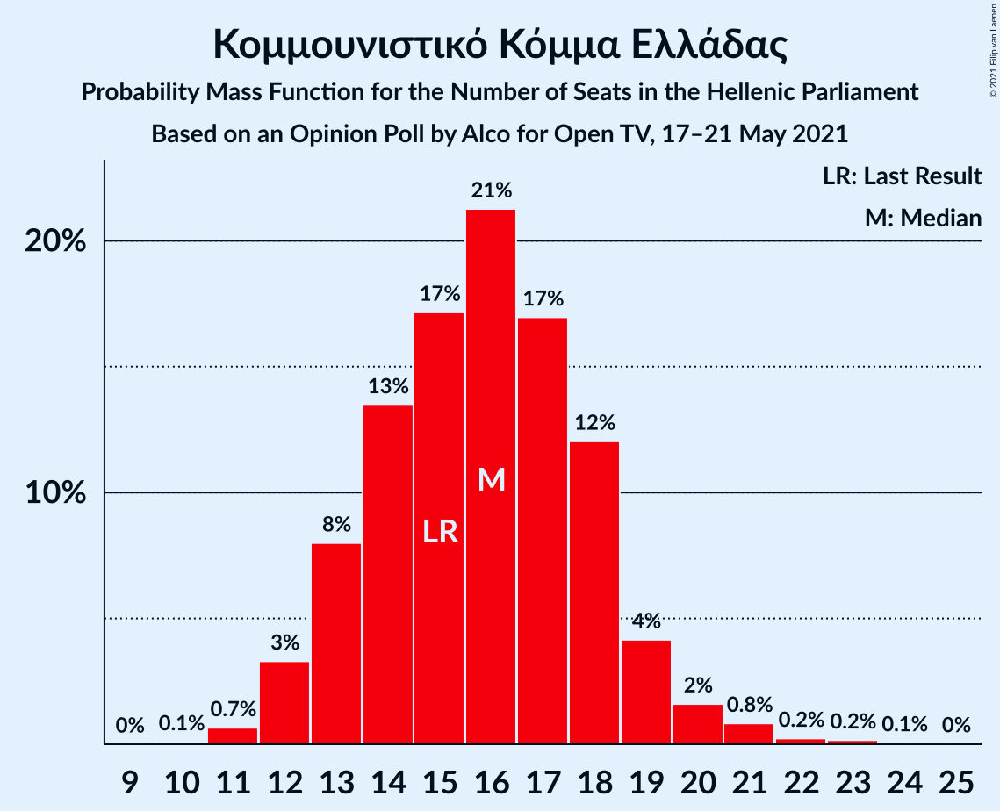

# Opinion Poll by Alco for Open TV, 17–21 May 2021

<a href="#voting-intentions">Voting Intentions</a> | <a href="#seats">Seats</a> | <a href="#coalitions">Coalitions</a> | <a href="#technical-information">Technical Information</a>

## Voting Intentions

### Confidence Intervals

| Party | Last Result | Poll Result | 80% Confidence Interval | 90% Confidence Interval | 95% Confidence Interval | 99% Confidence Interval |
|:-----:|:-----------:|:-----------:|:-----------------------:|:-----------------------:|:-----------------------:|:-----------------------:|
| Νέα Δημοκρατία | 39.8% | 45.8% | 43.7–47.8% |43.2–48.4% |42.7–48.9% |41.7–49.8% |
| Συνασπισμός Ριζοσπαστικής Αριστεράς | 31.5% | 29.6% | 27.8–31.5% |27.3–32.0% |26.8–32.5% |26.0–33.4% |
| Κίνημα Αλλαγής | 8.1% | 8.4% | 7.4–9.6% |7.1–10.0% |6.8–10.3% |6.4–10.9% |
| Κομμουνιστικό Κόμμα Ελλάδας | 5.3% | 6.4% | 5.5–7.5% |5.2–7.8% |5.0–8.1% |4.6–8.7% |
| Ελληνική Λύση | 3.7% | 4.9% | 4.1–5.9% |3.9–6.2% |3.7–6.4% |3.4–6.9% |
| Μέτωπο Ευρωπαϊκής Ρεαλιστικής Ανυπακοής | 3.4% | 3.6% | 2.9–4.5% |2.8–4.7% |2.6–5.0% |2.3–5.4% |
| Πλεύση Ελευθερίας | 1.5% | 1.4% | 1.0–2.0% |0.9–2.2% |0.8–2.3% |0.7–2.7% |

*Note:* The poll result column reflects the actual value used in the calculations. Published results may vary slightly, and in addition be rounded to fewer digits.

## Seats

### Confidence Intervals

| Party | Last Result | Median | 80% Confidence Interval | 90% Confidence Interval | 95% Confidence Interval | 99% Confidence Interval |
|:-----:|:-----------:|:------:|:-----------------------:|:-----------------------:|:-----------------------:|:-----------------------:|
| <a href="#νέα-δημοκρατία">Νέα Δημοκρατία</a> | 158 | 166 | 161–171 |159–172 |158–175 |156–177 |
| <a href="#συνασπισμός-ριζοσπαστικής-αριστεράς">Συνασπισμός Ριζοσπαστικής Αριστεράς</a> | 86 | 74 | 71–80 |70–81 |68–83 |65–85 |
| <a href="#κίνημα-αλλαγής">Κίνημα Αλλαγής</a> | 22 | 22 | 19–24 |18–25 |17–26 |16–27 |
| <a href="#κομμουνιστικό-κόμμα-ελλάδας">Κομμουνιστικό Κόμμα Ελλάδας</a> | 15 | 16 | 14–19 |13–20 |13–21 |12–22 |
| <a href="#ελληνική-λύση">Ελληνική Λύση</a> | 10 | 13 | 11–15 |10–16 |10–16 |9–18 |
| <a href="#μέτωπο-ευρωπαϊκής-ρεαλιστικής-ανυπακοής">Μέτωπο Ευρωπαϊκής Ρεαλιστικής Ανυπακοής</a> | 9 | 9 | 0–12 |0–12 |0–13 |0–14 |
| <a href="#πλεύση-ελευθερίας">Πλεύση Ελευθερίας</a> | 0 | 0 | 0 |0 |0 |0 |

### Νέα Δημοκρατία

*For a full overview of the results for this party, see the [Νέα Δημοκρατία](party-νέαδημοκρατία.html) page.*

| Number of Seats | Probability | Accumulated | Special Marks |
|:---------------:|:-----------:|:-----------:|:-------------:|
| 153 | 0.1% | 100% |  |
| 154 | 0.1% | 99.9% |  |
| 155 | 0.3% | 99.8% |  |
| 156 | 0.4% | 99.5% |  |
| 157 | 0.7% | 99.2% |  |
| 158 | 2% | 98% | Last Result |
| 159 | 2% | 97% |  |
| 160 | 4% | 95% |  |
| 161 | 4% | 91% |  |
| 162 | 5% | 86% |  |
| 163 | 6% | 81% |  |
| 164 | 8% | 75% |  |
| 165 | 6% | 67% |  |
| 166 | 14% | 61% | Median |
| 167 | 7% | 46% |  |
| 168 | 15% | 40% |  |
| 169 | 7% | 25% |  |
| 170 | 6% | 18% |  |
| 171 | 3% | 12% |  |
| 172 | 4% | 9% |  |
| 173 | 1.5% | 5% |  |
| 174 | 0.7% | 3% |  |
| 175 | 1.1% | 3% |  |
| 176 | 0.9% | 2% |  |
| 177 | 0.3% | 0.7% |  |
| 178 | 0.3% | 0.5% |  |
| 179 | 0.1% | 0.2% |  |
| 180 | 0% | 0.1% |  |
| 181 | 0% | 0.1% |  |
| 182 | 0% | 0% |  |

### Συνασπισμός Ριζοσπαστικής Αριστεράς

*For a full overview of the results for this party, see the [Συνασπισμός Ριζοσπαστικής Αριστεράς](party-συνασπισμόςριζοσπαστικήςαριστεράς.html) page.*

| Number of Seats | Probability | Accumulated | Special Marks |
|:---------------:|:-----------:|:-----------:|:-------------:|
| 63 | 0.1% | 100% |  |
| 64 | 0.1% | 99.9% |  |
| 65 | 0.4% | 99.8% |  |
| 66 | 0.9% | 99.4% |  |
| 67 | 1.0% | 98.6% |  |
| 68 | 1.1% | 98% |  |
| 69 | 1.2% | 97% |  |
| 70 | 2% | 95% |  |
| 71 | 13% | 93% |  |
| 72 | 6% | 80% |  |
| 73 | 6% | 74% |  |
| 74 | 20% | 69% | Median |
| 75 | 15% | 49% |  |
| 76 | 10% | 34% |  |
| 77 | 4% | 24% |  |
| 78 | 3% | 21% |  |
| 79 | 6% | 18% |  |
| 80 | 4% | 12% |  |
| 81 | 4% | 8% |  |
| 82 | 0.8% | 4% |  |
| 83 | 1.0% | 3% |  |
| 84 | 1.0% | 2% |  |
| 85 | 1.1% | 1.4% |  |
| 86 | 0.2% | 0.3% | Last Result |
| 87 | 0% | 0.1% |  |
| 88 | 0% | 0.1% |  |
| 89 | 0% | 0% |  |

### Κίνημα Αλλαγής

*For a full overview of the results for this party, see the [Κίνημα Αλλαγής](party-κίνημααλλαγής.html) page.*

| Number of Seats | Probability | Accumulated | Special Marks |
|:---------------:|:-----------:|:-----------:|:-------------:|
| 15 | 0.1% | 100% |  |
| 16 | 0.9% | 99.8% |  |
| 17 | 2% | 99.0% |  |
| 18 | 6% | 97% |  |
| 19 | 7% | 91% |  |
| 20 | 13% | 84% |  |
| 21 | 11% | 71% |  |
| 22 | 27% | 60% | Last Result, Median |
| 23 | 14% | 34% |  |
| 24 | 13% | 20% |  |
| 25 | 3% | 7% |  |
| 26 | 2% | 3% |  |
| 27 | 0.8% | 1.3% |  |
| 28 | 0.2% | 0.5% |  |
| 29 | 0.2% | 0.2% |  |
| 30 | 0% | 0.1% |  |
| 31 | 0% | 0% |  |

### Κομμουνιστικό Κόμμα Ελλάδας

*For a full overview of the results for this party, see the [Κομμουνιστικό Κόμμα Ελλάδας](party-κομμουνιστικόκόμμαελλάδας.html) page.*

| Number of Seats | Probability | Accumulated | Special Marks |
|:---------------:|:-----------:|:-----------:|:-------------:|
| 11 | 0.2% | 100% |  |
| 12 | 1.2% | 99.8% |  |
| 13 | 4% | 98.5% |  |
| 14 | 12% | 94% |  |
| 15 | 24% | 82% | Last Result |
| 16 | 18% | 58% | Median |
| 17 | 18% | 40% |  |
| 18 | 9% | 23% |  |
| 19 | 6% | 14% |  |
| 20 | 5% | 7% |  |
| 21 | 2% | 3% |  |
| 22 | 0.6% | 0.7% |  |
| 23 | 0.1% | 0.2% |  |
| 24 | 0% | 0% |  |

### Ελληνική Λύση

*For a full overview of the results for this party, see the [Ελληνική Λύση](party-ελληνικήλύση.html) page.*

| Number of Seats | Probability | Accumulated | Special Marks |
|:---------------:|:-----------:|:-----------:|:-------------:|
| 8 | 0.4% | 100% |  |
| 9 | 2% | 99.5% |  |
| 10 | 7% | 98% | Last Result |
| 11 | 12% | 91% |  |
| 12 | 20% | 79% |  |
| 13 | 26% | 59% | Median |
| 14 | 12% | 32% |  |
| 15 | 13% | 20% |  |
| 16 | 4% | 7% |  |
| 17 | 2% | 2% |  |
| 18 | 0.4% | 0.5% |  |
| 19 | 0.1% | 0.1% |  |
| 20 | 0% | 0% |  |

### Μέτωπο Ευρωπαϊκής Ρεαλιστικής Ανυπακοής

*For a full overview of the results for this party, see the [Μέτωπο Ευρωπαϊκής Ρεαλιστικής Ανυπακοής](party-μέτωποευρωπαϊκήςρεαλιστικήςανυπακοής.html) page.*

| Number of Seats | Probability | Accumulated | Special Marks |
|:---------------:|:-----------:|:-----------:|:-------------:|
| 0 | 13% | 100% |  |
| 1 | 0% | 87% |  |
| 2 | 0% | 87% |  |
| 3 | 0% | 87% |  |
| 4 | 0% | 87% |  |
| 5 | 0% | 87% |  |
| 6 | 0% | 87% |  |
| 7 | 0% | 87% |  |
| 8 | 26% | 87% |  |
| 9 | 25% | 61% | Last Result, Median |
| 10 | 15% | 36% |  |
| 11 | 10% | 21% |  |
| 12 | 9% | 11% |  |
| 13 | 2% | 3% |  |
| 14 | 0.4% | 0.5% |  |
| 15 | 0.1% | 0.1% |  |
| 16 | 0% | 0% |  |

### Πλεύση Ελευθερίας

*For a full overview of the results for this party, see the [Πλεύση Ελευθερίας](party-πλεύσηελευθερίας.html) page.*

| Number of Seats | Probability | Accumulated | Special Marks |
|:---------------:|:-----------:|:-----------:|:-------------:|
| 0 | 99.9% | 100% | Last Result, Median |
| 1 | 0% | 0.1% |  |
| 2 | 0% | 0.1% |  |
| 3 | 0% | 0.1% |  |
| 4 | 0% | 0.1% |  |
| 5 | 0% | 0.1% |  |
| 6 | 0% | 0.1% |  |
| 7 | 0% | 0.1% |  |
| 8 | 0% | 0.1% |  |
| 9 | 0% | 0% |  |

## Coalitions

### Confidence Intervals

| Coalition | Last Result | Median | Majority? | 80% Confidence Interval | 90% Confidence Interval | 95% Confidence Interval | 99% Confidence Interval |
|:---------:|:-----------:|:------:|:---------:|:-----------------------:|:-----------------------:|:-----------------------:|:-----------------------:|
| Νέα Δημοκρατία – Κίνημα Αλλαγής | 180 | 188 | 100% | 182–192 | 181–196 | 179–197 | 177–199 |
| Νέα Δημοκρατία | 158 | 166 | 100% | 161–171 | 159–172 | 158–175 | 156–177 |
| Συνασπισμός Ριζοσπαστικής Αριστεράς – Μέτωπο Ευρωπαϊκής Ρεαλιστικής Ανυπακοής | 95 | 83 | 0% | 79–88 | 76–89 | 75–91 | 72–94 |
| Συνασπισμός Ριζοσπαστικής Αριστεράς | 86 | 74 | 0% | 71–80 | 70–81 | 68–83 | 65–85 |

### Νέα Δημοκρατία – Κίνημα Αλλαγής

| Number of Seats | Probability | Accumulated | Special Marks |
|:---------------:|:-----------:|:-----------:|:-------------:|
| 174 | 0% | 100% |  |
| 175 | 0.1% | 99.9% |  |
| 176 | 0.2% | 99.8% |  |
| 177 | 0.3% | 99.6% |  |
| 178 | 0.5% | 99.3% |  |
| 179 | 2% | 98.8% |  |
| 180 | 1.4% | 97% | Last Result |
| 181 | 2% | 96% |  |
| 182 | 5% | 93% |  |
| 183 | 5% | 88% |  |
| 184 | 5% | 84% |  |
| 185 | 6% | 78% |  |
| 186 | 7% | 72% |  |
| 187 | 6% | 65% |  |
| 188 | 10% | 58% | Median |
| 189 | 9% | 48% |  |
| 190 | 19% | 39% |  |
| 191 | 6% | 19% |  |
| 192 | 4% | 13% |  |
| 193 | 2% | 9% |  |
| 194 | 0.8% | 7% |  |
| 195 | 0.8% | 6% |  |
| 196 | 2% | 5% |  |
| 197 | 0.9% | 3% |  |
| 198 | 1.1% | 2% |  |
| 199 | 0.7% | 1.0% |  |
| 200 | 0.2% | 0.3% |  |
| 201 | 0.1% | 0.1% |  |
| 202 | 0% | 0.1% |  |
| 203 | 0% | 0% |  |

### Νέα Δημοκρατία

| Number of Seats | Probability | Accumulated | Special Marks |
|:---------------:|:-----------:|:-----------:|:-------------:|
| 153 | 0.1% | 100% |  |
| 154 | 0.1% | 99.9% |  |
| 155 | 0.3% | 99.8% |  |
| 156 | 0.4% | 99.5% |  |
| 157 | 0.7% | 99.2% |  |
| 158 | 2% | 98% | Last Result |
| 159 | 2% | 97% |  |
| 160 | 4% | 95% |  |
| 161 | 4% | 91% |  |
| 162 | 5% | 86% |  |
| 163 | 6% | 81% |  |
| 164 | 8% | 75% |  |
| 165 | 6% | 67% |  |
| 166 | 14% | 61% | Median |
| 167 | 7% | 46% |  |
| 168 | 15% | 40% |  |
| 169 | 7% | 25% |  |
| 170 | 6% | 18% |  |
| 171 | 3% | 12% |  |
| 172 | 4% | 9% |  |
| 173 | 1.5% | 5% |  |
| 174 | 0.7% | 3% |  |
| 175 | 1.1% | 3% |  |
| 176 | 0.9% | 2% |  |
| 177 | 0.3% | 0.7% |  |
| 178 | 0.3% | 0.5% |  |
| 179 | 0.1% | 0.2% |  |
| 180 | 0% | 0.1% |  |
| 181 | 0% | 0.1% |  |
| 182 | 0% | 0% |  |

### Συνασπισμός Ριζοσπαστικής Αριστεράς – Μέτωπο Ευρωπαϊκής Ρεαλιστικής Ανυπακοής

| Number of Seats | Probability | Accumulated | Special Marks |
|:---------------:|:-----------:|:-----------:|:-------------:|
| 68 | 0% | 100% |  |
| 69 | 0% | 99.9% |  |
| 70 | 0.1% | 99.9% |  |
| 71 | 0.1% | 99.8% |  |
| 72 | 0.7% | 99.7% |  |
| 73 | 0.6% | 99.0% |  |
| 74 | 0.6% | 98% |  |
| 75 | 1.3% | 98% |  |
| 76 | 3% | 97% |  |
| 77 | 1.5% | 93% |  |
| 78 | 1.2% | 92% |  |
| 79 | 6% | 91% |  |
| 80 | 7% | 85% |  |
| 81 | 10% | 78% |  |
| 82 | 17% | 68% |  |
| 83 | 7% | 50% | Median |
| 84 | 10% | 43% |  |
| 85 | 5% | 33% |  |
| 86 | 5% | 28% |  |
| 87 | 11% | 23% |  |
| 88 | 3% | 13% |  |
| 89 | 5% | 10% |  |
| 90 | 2% | 5% |  |
| 91 | 0.9% | 3% |  |
| 92 | 1.0% | 2% |  |
| 93 | 0.3% | 1.2% |  |
| 94 | 0.5% | 0.9% |  |
| 95 | 0.1% | 0.3% | Last Result |
| 96 | 0.2% | 0.2% |  |
| 97 | 0% | 0% |  |

### Συνασπισμός Ριζοσπαστικής Αριστεράς

| Number of Seats | Probability | Accumulated | Special Marks |
|:---------------:|:-----------:|:-----------:|:-------------:|
| 63 | 0.1% | 100% |  |
| 64 | 0.1% | 99.9% |  |
| 65 | 0.4% | 99.8% |  |
| 66 | 0.9% | 99.4% |  |
| 67 | 1.0% | 98.6% |  |
| 68 | 1.1% | 98% |  |
| 69 | 1.2% | 97% |  |
| 70 | 2% | 95% |  |
| 71 | 13% | 93% |  |
| 72 | 6% | 80% |  |
| 73 | 6% | 74% |  |
| 74 | 20% | 69% | Median |
| 75 | 15% | 49% |  |
| 76 | 10% | 34% |  |
| 77 | 4% | 24% |  |
| 78 | 3% | 21% |  |
| 79 | 6% | 18% |  |
| 80 | 4% | 12% |  |
| 81 | 4% | 8% |  |
| 82 | 0.8% | 4% |  |
| 83 | 1.0% | 3% |  |
| 84 | 1.0% | 2% |  |
| 85 | 1.1% | 1.4% |  |
| 86 | 0.2% | 0.3% | Last Result |
| 87 | 0% | 0.1% |  |
| 88 | 0% | 0.1% |  |
| 89 | 0% | 0% |  |

## Technical Information

### Opinion Poll

+ **Polling firm:** Alco
+ **Commissioner(s):** Open TV
+ **Fieldwork period:** 17–21 May 2021

### Calculations

+ **Sample size:** 1001
+ **Simulations done:** 1,048,576
+ **Error estimate:** 1.13%

