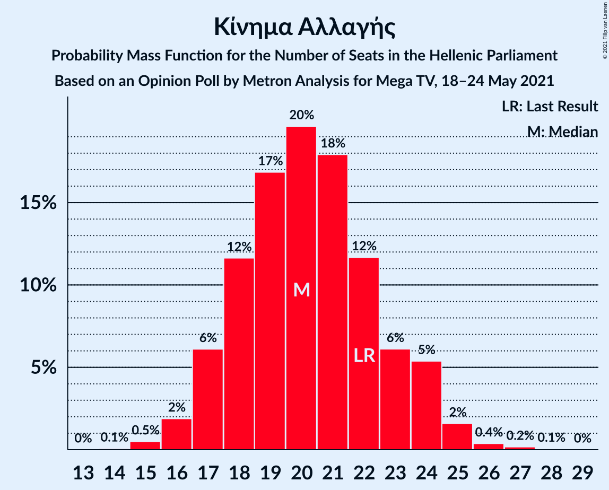
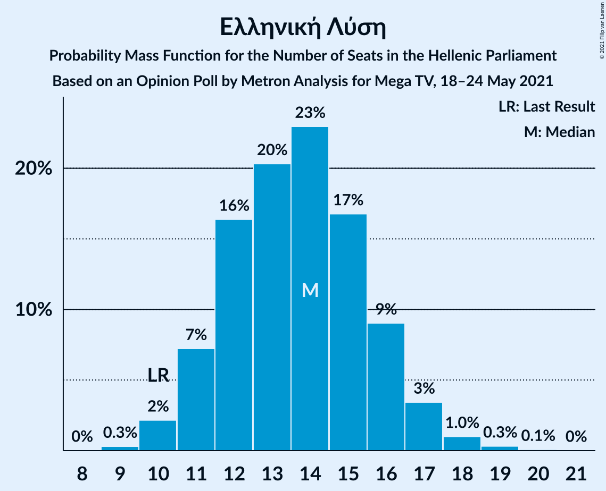

# Opinion Poll by Metron Analysis for Mega, 18–24 May 2021

<a href="#voting-intentions">Voting Intentions</a> | <a href="#seats">Seats</a> | <a href="#coalitions">Coalitions</a> | <a href="#technical-information">Technical Information</a>

## Voting Intentions

### Confidence Intervals

| Party | Last Result | Poll Result | 80% Confidence Interval | 90% Confidence Interval | 95% Confidence Interval | 99% Confidence Interval |
|:-----:|:-----------:|:-----------:|:-----------------------:|:-----------------------:|:-----------------------:|:-----------------------:|
| Νέα Δημοκρατία | 39.8% | 43.1% | 41.1–45.1% |40.5–45.7% |40.1–46.2% |39.1–47.2% |
| Συνασπισμός Ριζοσπαστικής Αριστεράς | 31.5% | 25.5% | 23.8–27.3% |23.3–27.8% |22.9–28.3% |22.1–29.2% |
| Κίνημα Αλλαγής | 8.1% | 7.6% | 6.6–8.8% |6.3–9.1% |6.1–9.4% |5.7–10.0% |
| Κομμουνιστικό Κόμμα Ελλάδας | 5.3% | 6.7% | 5.8–7.8% |5.5–8.2% |5.3–8.4% |4.9–9.0% |
| Μέτωπο Ευρωπαϊκής Ρεαλιστικής Ανυπακοής | 3.4% | 6.0% | 5.1–7.1% |4.9–7.4% |4.7–7.7% |4.3–8.2% |
| Ελληνική Λύση | 3.7% | 5.1% | 4.3–6.1% |4.1–6.4% |3.9–6.6% |3.6–7.2% |

*Note:* The poll result column reflects the actual value used in the calculations. Published results may vary slightly, and in addition be rounded to fewer digits.

## Seats

### Confidence Intervals

| Party | Last Result | Median | 80% Confidence Interval | 90% Confidence Interval | 95% Confidence Interval | 99% Confidence Interval |
|:-----:|:-----------:|:------:|:-----------------------:|:-----------------------:|:-----------------------:|:-----------------------:|
| <a href="#νέα-δημοκρατία">Νέα Δημοκρατία</a> | 158 | 164 | 159–169 |157–171 |156–172 |154–175 |
| <a href="#συνασπισμός-ριζοσπαστικής-αριστεράς">Συνασπισμός Ριζοσπαστικής Αριστεράς</a> | 86 | 68 | 63–72 |62–74 |61–75 |59–77 |
| <a href="#κίνημα-αλλαγής">Κίνημα Αλλαγής</a> | 22 | 20 | 18–23 |17–24 |16–25 |15–27 |
| <a href="#κομμουνιστικό-κόμμα-ελλάδας">Κομμουνιστικό Κόμμα Ελλάδας</a> | 15 | 18 | 15–21 |15–22 |14–22 |13–24 |
| <a href="#μέτωπο-ευρωπαϊκής-ρεαλιστικής-ανυπακοής">Μέτωπο Ευρωπαϊκής Ρεαλιστικής Ανυπακοής</a> | 9 | 16 | 14–19 |13–20 |12–20 |11–22 |
| <a href="#ελληνική-λύση">Ελληνική Λύση</a> | 10 | 14 | 11–16 |11–17 |10–18 |9–19 |

### Νέα Δημοκρατία

*For a full overview of the results for this party, see the [Νέα Δημοκρατία](party-νέαδημοκρατία.html) page.*

| Number of Seats | Probability | Accumulated | Special Marks |
|:---------------:|:-----------:|:-----------:|:-------------:|
| 151 | 0.1% | 100% | Majority |
| 152 | 0.1% | 99.9% |  |
| 153 | 0.2% | 99.8% |  |
| 154 | 0.4% | 99.6% |  |
| 155 | 0.7% | 99.2% |  |
| 156 | 1.4% | 98% |  |
| 157 | 2% | 97% |  |
| 158 | 3% | 95% | Last Result |
| 159 | 4% | 92% |  |
| 160 | 6% | 88% |  |
| 161 | 7% | 82% |  |
| 162 | 8% | 74% |  |
| 163 | 10% | 66% |  |
| 164 | 10% | 56% | Median |
| 165 | 9% | 46% |  |
| 166 | 9% | 37% |  |
| 167 | 8% | 28% |  |
| 168 | 6% | 20% |  |
| 169 | 5% | 14% |  |
| 170 | 3% | 9% |  |
| 171 | 3% | 6% |  |
| 172 | 1.5% | 3% |  |
| 173 | 0.9% | 2% |  |
| 174 | 0.6% | 1.1% |  |
| 175 | 0.3% | 0.5% |  |
| 176 | 0.1% | 0.3% |  |
| 177 | 0.1% | 0.1% |  |
| 178 | 0% | 0.1% |  |
| 179 | 0% | 0% |  |

### Συνασπισμός Ριζοσπαστικής Αριστεράς

*For a full overview of the results for this party, see the [Συνασπισμός Ριζοσπαστικής Αριστεράς](party-συνασπισμόςριζοσπαστικήςαριστεράς.html) page.*

| Number of Seats | Probability | Accumulated | Special Marks |
|:---------------:|:-----------:|:-----------:|:-------------:|
| 56 | 0% | 100% |  |
| 57 | 0.1% | 99.9% |  |
| 58 | 0.3% | 99.8% |  |
| 59 | 0.6% | 99.5% |  |
| 60 | 1.1% | 98.9% |  |
| 61 | 2% | 98% |  |
| 62 | 3% | 96% |  |
| 63 | 5% | 92% |  |
| 64 | 7% | 88% |  |
| 65 | 8% | 81% |  |
| 66 | 11% | 73% |  |
| 67 | 11% | 62% |  |
| 68 | 11% | 51% | Median |
| 69 | 10% | 40% |  |
| 70 | 9% | 31% |  |
| 71 | 7% | 21% |  |
| 72 | 6% | 15% |  |
| 73 | 3% | 9% |  |
| 74 | 3% | 6% |  |
| 75 | 1.3% | 3% |  |
| 76 | 0.8% | 2% |  |
| 77 | 0.4% | 0.8% |  |
| 78 | 0.2% | 0.4% |  |
| 79 | 0.1% | 0.2% |  |
| 80 | 0% | 0.1% |  |
| 81 | 0% | 0% |  |
| 82 | 0% | 0% |  |
| 83 | 0% | 0% |  |
| 84 | 0% | 0% |  |
| 85 | 0% | 0% |  |
| 86 | 0% | 0% | Last Result |

### Κίνημα Αλλαγής

*For a full overview of the results for this party, see the [Κίνημα Αλλαγής](party-κίνημααλλαγής.html) page.*

| Number of Seats | Probability | Accumulated | Special Marks |
|:---------------:|:-----------:|:-----------:|:-------------:|
| 14 | 0.2% | 100% |  |
| 15 | 0.8% | 99.8% |  |
| 16 | 2% | 99.0% |  |
| 17 | 6% | 97% |  |
| 18 | 12% | 90% |  |
| 19 | 14% | 79% |  |
| 20 | 19% | 65% | Median |
| 21 | 17% | 46% |  |
| 22 | 11% | 29% | Last Result |
| 23 | 9% | 17% |  |
| 24 | 5% | 8% |  |
| 25 | 2% | 3% |  |
| 26 | 0.9% | 1.4% |  |
| 27 | 0.4% | 0.5% |  |
| 28 | 0.1% | 0.1% |  |
| 29 | 0% | 0% |  |

### Κομμουνιστικό Κόμμα Ελλάδας

*For a full overview of the results for this party, see the [Κομμουνιστικό Κόμμα Ελλάδας](party-κομμουνιστικόκόμμαελλάδας.html) page.*

| Number of Seats | Probability | Accumulated | Special Marks |
|:---------------:|:-----------:|:-----------:|:-------------:|
| 12 | 0.2% | 100% |  |
| 13 | 0.9% | 99.8% |  |
| 14 | 3% | 98.9% |  |
| 15 | 7% | 96% | Last Result |
| 16 | 13% | 89% |  |
| 17 | 18% | 75% |  |
| 18 | 18% | 58% | Median |
| 19 | 16% | 39% |  |
| 20 | 11% | 23% |  |
| 21 | 7% | 12% |  |
| 22 | 3% | 5% |  |
| 23 | 1.3% | 2% |  |
| 24 | 0.5% | 0.7% |  |
| 25 | 0.2% | 0.2% |  |
| 26 | 0% | 0.1% |  |
| 27 | 0% | 0% |  |

### Μέτωπο Ευρωπαϊκής Ρεαλιστικής Ανυπακοής

*For a full overview of the results for this party, see the [Μέτωπο Ευρωπαϊκής Ρεαλιστικής Ανυπακοής](party-μέτωποευρωπαϊκήςρεαλιστικήςανυπακοής.html) page.*

| Number of Seats | Probability | Accumulated | Special Marks |
|:---------------:|:-----------:|:-----------:|:-------------:|
| 9 | 0% | 100% | Last Result |
| 10 | 0.1% | 100% |  |
| 11 | 0.5% | 99.9% |  |
| 12 | 2% | 99.4% |  |
| 13 | 6% | 97% |  |
| 14 | 12% | 91% |  |
| 15 | 18% | 79% |  |
| 16 | 20% | 61% | Median |
| 17 | 17% | 41% |  |
| 18 | 12% | 24% |  |
| 19 | 7% | 12% |  |
| 20 | 3% | 5% |  |
| 21 | 1.4% | 2% |  |
| 22 | 0.4% | 0.6% |  |
| 23 | 0.1% | 0.2% |  |
| 24 | 0% | 0% |  |

### Ελληνική Λύση

*For a full overview of the results for this party, see the [Ελληνική Λύση](party-ελληνικήλύση.html) page.*

| Number of Seats | Probability | Accumulated | Special Marks |
|:---------------:|:-----------:|:-----------:|:-------------:|
| 8 | 0% | 100% |  |
| 9 | 0.5% | 99.9% |  |
| 10 | 3% | 99.4% | Last Result |
| 11 | 8% | 97% |  |
| 12 | 15% | 89% |  |
| 13 | 21% | 74% |  |
| 14 | 20% | 53% | Median |
| 15 | 16% | 33% |  |
| 16 | 9% | 17% |  |
| 17 | 5% | 7% |  |
| 18 | 2% | 3% |  |
| 19 | 0.6% | 0.9% |  |
| 20 | 0.2% | 0.2% |  |
| 21 | 0% | 0.1% |  |
| 22 | 0% | 0% |  |

## Coalitions

### Confidence Intervals

| Coalition | Last Result | Median | Majority? | 80% Confidence Interval | 90% Confidence Interval | 95% Confidence Interval | 99% Confidence Interval |
|:---------:|:-----------:|:------:|:---------:|:-----------------------:|:-----------------------:|:-----------------------:|:-----------------------:|
| Νέα Δημοκρατία – Κίνημα Αλλαγής | 180 | 184 | 100% | 179–190 | 178–191 | 177–192 | 174–195 |
| Νέα Δημοκρατία | 158 | 164 | 100% | 159–169 | 157–171 | 156–172 | 154–175 |
| Συνασπισμός Ριζοσπαστικής Αριστεράς – Μέτωπο Ευρωπαϊκής Ρεαλιστικής Ανυπακοής | 95 | 84 | 0% | 79–89 | 78–90 | 76–91 | 74–94 |
| Συνασπισμός Ριζοσπαστικής Αριστεράς | 86 | 68 | 0% | 63–72 | 62–74 | 61–75 | 59–77 |

### Νέα Δημοκρατία – Κίνημα Αλλαγής

| Number of Seats | Probability | Accumulated | Special Marks |
|:---------------:|:-----------:|:-----------:|:-------------:|
| 171 | 0% | 100% |  |
| 172 | 0.1% | 99.9% |  |
| 173 | 0.2% | 99.8% |  |
| 174 | 0.4% | 99.7% |  |
| 175 | 0.6% | 99.3% |  |
| 176 | 1.1% | 98.7% |  |
| 177 | 2% | 98% |  |
| 178 | 3% | 96% |  |
| 179 | 4% | 93% |  |
| 180 | 6% | 89% | Last Result |
| 181 | 7% | 84% |  |
| 182 | 8% | 77% |  |
| 183 | 9% | 69% |  |
| 184 | 10% | 60% | Median |
| 185 | 10% | 50% |  |
| 186 | 9% | 40% |  |
| 187 | 8% | 31% |  |
| 188 | 7% | 23% |  |
| 189 | 5% | 16% |  |
| 190 | 4% | 11% |  |
| 191 | 3% | 7% |  |
| 192 | 2% | 4% |  |
| 193 | 1.1% | 2% |  |
| 194 | 0.6% | 1.3% |  |
| 195 | 0.4% | 0.7% |  |
| 196 | 0.2% | 0.3% |  |
| 197 | 0.1% | 0.1% |  |
| 198 | 0% | 0.1% |  |
| 199 | 0% | 0% |  |

### Νέα Δημοκρατία

| Number of Seats | Probability | Accumulated | Special Marks |
|:---------------:|:-----------:|:-----------:|:-------------:|
| 151 | 0.1% | 100% | Majority |
| 152 | 0.1% | 99.9% |  |
| 153 | 0.2% | 99.8% |  |
| 154 | 0.4% | 99.6% |  |
| 155 | 0.7% | 99.2% |  |
| 156 | 1.4% | 98% |  |
| 157 | 2% | 97% |  |
| 158 | 3% | 95% | Last Result |
| 159 | 4% | 92% |  |
| 160 | 6% | 88% |  |
| 161 | 7% | 82% |  |
| 162 | 8% | 74% |  |
| 163 | 10% | 66% |  |
| 164 | 10% | 56% | Median |
| 165 | 9% | 46% |  |
| 166 | 9% | 37% |  |
| 167 | 8% | 28% |  |
| 168 | 6% | 20% |  |
| 169 | 5% | 14% |  |
| 170 | 3% | 9% |  |
| 171 | 3% | 6% |  |
| 172 | 1.5% | 3% |  |
| 173 | 0.9% | 2% |  |
| 174 | 0.6% | 1.1% |  |
| 175 | 0.3% | 0.5% |  |
| 176 | 0.1% | 0.3% |  |
| 177 | 0.1% | 0.1% |  |
| 178 | 0% | 0.1% |  |
| 179 | 0% | 0% |  |

### Συνασπισμός Ριζοσπαστικής Αριστεράς – Μέτωπο Ευρωπαϊκής Ρεαλιστικής Ανυπακοής

| Number of Seats | Probability | Accumulated | Special Marks |
|:---------------:|:-----------:|:-----------:|:-------------:|
| 71 | 0% | 100% |  |
| 72 | 0.1% | 99.9% |  |
| 73 | 0.2% | 99.9% |  |
| 74 | 0.4% | 99.7% |  |
| 75 | 0.7% | 99.3% |  |
| 76 | 1.3% | 98.6% |  |
| 77 | 2% | 97% |  |
| 78 | 3% | 95% |  |
| 79 | 5% | 92% |  |
| 80 | 6% | 87% |  |
| 81 | 8% | 81% |  |
| 82 | 10% | 72% |  |
| 83 | 10% | 63% |  |
| 84 | 10% | 52% | Median |
| 85 | 10% | 42% |  |
| 86 | 9% | 33% |  |
| 87 | 7% | 24% |  |
| 88 | 6% | 17% |  |
| 89 | 4% | 11% |  |
| 90 | 3% | 7% |  |
| 91 | 2% | 4% |  |
| 92 | 1.2% | 2% |  |
| 93 | 0.5% | 1.2% |  |
| 94 | 0.3% | 0.6% |  |
| 95 | 0.2% | 0.3% | Last Result |
| 96 | 0.1% | 0.1% |  |
| 97 | 0% | 0.1% |  |
| 98 | 0% | 0% |  |

### Συνασπισμός Ριζοσπαστικής Αριστεράς

| Number of Seats | Probability | Accumulated | Special Marks |
|:---------------:|:-----------:|:-----------:|:-------------:|
| 56 | 0% | 100% |  |
| 57 | 0.1% | 99.9% |  |
| 58 | 0.3% | 99.8% |  |
| 59 | 0.6% | 99.5% |  |
| 60 | 1.1% | 98.9% |  |
| 61 | 2% | 98% |  |
| 62 | 3% | 96% |  |
| 63 | 5% | 92% |  |
| 64 | 7% | 88% |  |
| 65 | 8% | 81% |  |
| 66 | 11% | 73% |  |
| 67 | 11% | 62% |  |
| 68 | 11% | 51% | Median |
| 69 | 10% | 40% |  |
| 70 | 9% | 31% |  |
| 71 | 7% | 21% |  |
| 72 | 6% | 15% |  |
| 73 | 3% | 9% |  |
| 74 | 3% | 6% |  |
| 75 | 1.3% | 3% |  |
| 76 | 0.8% | 2% |  |
| 77 | 0.4% | 0.8% |  |
| 78 | 0.2% | 0.4% |  |
| 79 | 0.1% | 0.2% |  |
| 80 | 0% | 0.1% |  |
| 81 | 0% | 0% |  |
| 82 | 0% | 0% |  |
| 83 | 0% | 0% |  |
| 84 | 0% | 0% |  |
| 85 | 0% | 0% |  |
| 86 | 0% | 0% | Last Result |

## Technical Information

### Opinion Poll

+ **Polling firm:** Metron Analysis
+ **Commissioner(s):** Mega
+ **Fieldwork period:** 18–24 May 2021

### Calculations

+ **Sample size:** 1000
+ **Simulations done:** 1,048,576
+ **Error estimate:** 1.66%

