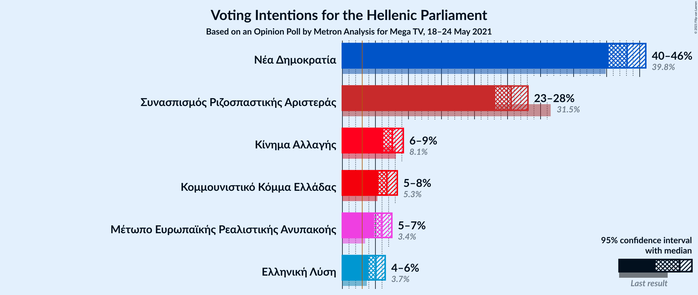
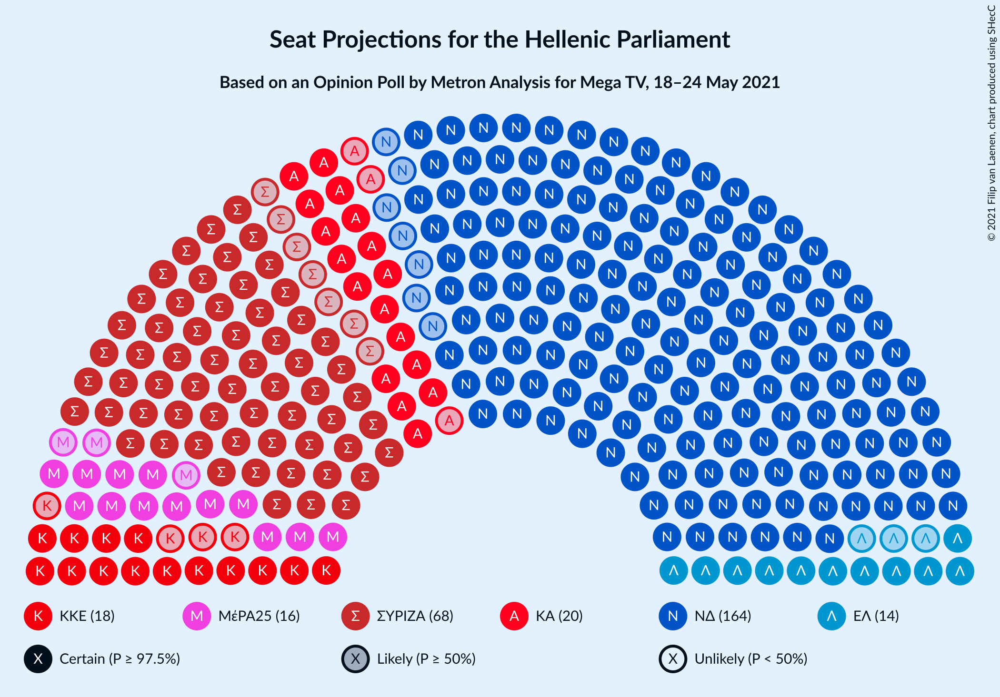
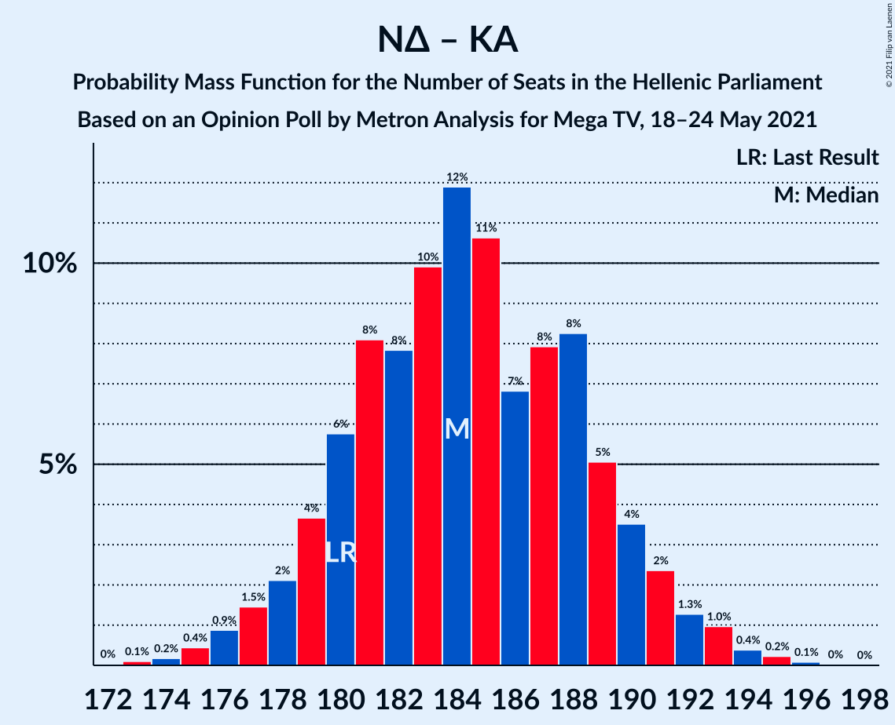

# Opinion Poll by Metron Analysis for Mega TV, 18–24 May 2021

<a href="#voting-intentions">Voting Intentions</a> | <a href="#seats">Seats</a> | <a href="#coalitions">Coalitions</a> | <a href="#technical-information">Technical Information</a>

## Voting Intentions

### Confidence Intervals

| Party | Last Result | Poll Result | 80% Confidence Interval | 90% Confidence Interval | 95% Confidence Interval | 99% Confidence Interval |
|:-----:|:-----------:|:-----------:|:-----------------------:|:-----------------------:|:-----------------------:|:-----------------------:|
| Νέα Δημοκρατία | 39.8% | 43.1% | 41.3–44.9% |40.8–45.5% |40.3–45.9% |39.4–46.8% |
| Συνασπισμός Ριζοσπαστικής Αριστεράς | 31.5% | 25.5% | 24.0–27.2% |23.5–27.7% |23.2–28.1% |22.4–28.9% |
| Κίνημα Αλλαγής | 8.1% | 7.6% | 6.7–8.6% |6.4–8.9% |6.2–9.2% |5.8–9.8% |
| Κομμουνιστικό Κόμμα Ελλάδας | 5.3% | 6.7% | 5.9–7.8% |5.7–8.0% |5.5–8.3% |5.1–8.8% |
| Μέτωπο Ευρωπαϊκής Ρεαλιστικής Ανυπακοής | 3.4% | 6.0% | 5.2–7.0% |5.0–7.2% |4.8–7.5% |4.4–8.0% |
| Ελληνική Λύση | 3.7% | 5.1% | 4.3–6.0% |4.1–6.2% |4.0–6.5% |3.6–6.9% |

*Note:* The poll result column reflects the actual value used in the calculations. Published results may vary slightly, and in addition be rounded to fewer digits.

## Seats

### Confidence Intervals

| Party | Last Result | Median | 80% Confidence Interval | 90% Confidence Interval | 95% Confidence Interval | 99% Confidence Interval |
|:-----:|:-----------:|:------:|:-----------------------:|:-----------------------:|:-----------------------:|:-----------------------:|
| <a href="#νέα-δημοκρατία">Νέα Δημοκρατία</a> | 158 | 164 | 159–169 |158–170 |157–172 |155–174 |
| <a href="#συνασπισμός-ριζοσπαστικής-αριστεράς">Συνασπισμός Ριζοσπαστικής Αριστεράς</a> | 86 | 68 | 64–72 |62–73 |61–74 |60–76 |
| <a href="#κίνημα-αλλαγής">Κίνημα Αλλαγής</a> | 22 | 20 | 18–23 |17–24 |17–24 |15–26 |
| <a href="#κομμουνιστικό-κόμμα-ελλάδας">Κομμουνιστικό Κόμμα Ελλάδας</a> | 15 | 18 | 16–21 |15–21 |14–22 |13–23 |
| <a href="#μέτωπο-ευρωπαϊκής-ρεαλιστικής-ανυπακοής">Μέτωπο Ευρωπαϊκής Ρεαλιστικής Ανυπακοής</a> | 9 | 16 | 14–18 |13–19 |13–20 |12–21 |
| <a href="#ελληνική-λύση">Ελληνική Λύση</a> | 10 | 14 | 12–16 |11–16 |11–17 |10–18 |

### Νέα Δημοκρατία

*For a full overview of the results for this party, see the [Νέα Δημοκρατία](party-νέαδημοκρατία.html) page.*

| Number of Seats | Probability | Accumulated | Special Marks |
|:---------------:|:-----------:|:-----------:|:-------------:|
| 152 | 0% | 100% |  |
| 153 | 0.1% | 99.9% |  |
| 154 | 0.2% | 99.8% |  |
| 155 | 0.5% | 99.6% |  |
| 156 | 0.8% | 99.1% |  |
| 157 | 2% | 98% |  |
| 158 | 3% | 97% | Last Result |
| 159 | 4% | 94% |  |
| 160 | 7% | 90% |  |
| 161 | 7% | 83% |  |
| 162 | 10% | 76% |  |
| 163 | 9% | 67% |  |
| 164 | 14% | 58% | Median |
| 165 | 8% | 44% |  |
| 166 | 8% | 35% |  |
| 167 | 9% | 28% |  |
| 168 | 4% | 18% |  |
| 169 | 7% | 15% |  |
| 170 | 3% | 8% |  |
| 171 | 2% | 5% |  |
| 172 | 1.3% | 3% |  |
| 173 | 0.7% | 1.3% |  |
| 174 | 0.3% | 0.6% |  |
| 175 | 0.2% | 0.3% |  |
| 176 | 0.1% | 0.1% |  |
| 177 | 0% | 0% |  |

### Συνασπισμός Ριζοσπαστικής Αριστεράς

*For a full overview of the results for this party, see the [Συνασπισμός Ριζοσπαστικής Αριστεράς](party-συνασπισμόςριζοσπαστικήςαριστεράς.html) page.*

| Number of Seats | Probability | Accumulated | Special Marks |
|:---------------:|:-----------:|:-----------:|:-------------:|
| 57 | 0% | 100% |  |
| 58 | 0.1% | 99.9% |  |
| 59 | 0.3% | 99.8% |  |
| 60 | 0.8% | 99.5% |  |
| 61 | 1.5% | 98.7% |  |
| 62 | 2% | 97% |  |
| 63 | 5% | 95% |  |
| 64 | 6% | 90% |  |
| 65 | 8% | 84% |  |
| 66 | 13% | 76% |  |
| 67 | 11% | 64% |  |
| 68 | 11% | 53% | Median |
| 69 | 11% | 41% |  |
| 70 | 11% | 31% |  |
| 71 | 7% | 19% |  |
| 72 | 4% | 12% |  |
| 73 | 3% | 8% |  |
| 74 | 2% | 4% |  |
| 75 | 1.0% | 2% |  |
| 76 | 0.6% | 1.1% |  |
| 77 | 0.2% | 0.5% |  |
| 78 | 0.1% | 0.2% |  |
| 79 | 0% | 0.1% |  |
| 80 | 0% | 0% |  |
| 81 | 0% | 0% |  |
| 82 | 0% | 0% |  |
| 83 | 0% | 0% |  |
| 84 | 0% | 0% |  |
| 85 | 0% | 0% |  |
| 86 | 0% | 0% | Last Result |

### Κίνημα Αλλαγής

*For a full overview of the results for this party, see the [Κίνημα Αλλαγής](party-κίνημααλλαγής.html) page.*

| Number of Seats | Probability | Accumulated | Special Marks |
|:---------------:|:-----------:|:-----------:|:-------------:|
| 14 | 0.1% | 100% |  |
| 15 | 0.5% | 99.9% |  |
| 16 | 2% | 99.4% |  |
| 17 | 6% | 98% |  |
| 18 | 12% | 91% |  |
| 19 | 17% | 80% |  |
| 20 | 20% | 63% | Median |
| 21 | 18% | 43% |  |
| 22 | 12% | 25% | Last Result |
| 23 | 6% | 14% |  |
| 24 | 5% | 8% |  |
| 25 | 2% | 2% |  |
| 26 | 0.4% | 0.6% |  |
| 27 | 0.2% | 0.2% |  |
| 28 | 0.1% | 0.1% |  |
| 29 | 0% | 0% |  |

### Κομμουνιστικό Κόμμα Ελλάδας

*For a full overview of the results for this party, see the [Κομμουνιστικό Κόμμα Ελλάδας](party-κομμουνιστικόκόμμαελλάδας.html) page.*

| Number of Seats | Probability | Accumulated | Special Marks |
|:---------------:|:-----------:|:-----------:|:-------------:|
| 12 | 0.1% | 100% |  |
| 13 | 0.4% | 99.9% |  |
| 14 | 2% | 99.5% |  |
| 15 | 7% | 97% | Last Result |
| 16 | 12% | 90% |  |
| 17 | 19% | 78% |  |
| 18 | 18% | 59% | Median |
| 19 | 17% | 41% |  |
| 20 | 13% | 25% |  |
| 21 | 7% | 11% |  |
| 22 | 3% | 5% |  |
| 23 | 0.9% | 1.4% |  |
| 24 | 0.3% | 0.5% |  |
| 25 | 0.1% | 0.1% |  |
| 26 | 0% | 0% |  |

### Μέτωπο Ευρωπαϊκής Ρεαλιστικής Ανυπακοής

*For a full overview of the results for this party, see the [Μέτωπο Ευρωπαϊκής Ρεαλιστικής Ανυπακοής](party-μέτωποευρωπαϊκήςρεαλιστικήςανυπακοής.html) page.*

| Number of Seats | Probability | Accumulated | Special Marks |
|:---------------:|:-----------:|:-----------:|:-------------:|
| 9 | 0% | 100% | Last Result |
| 10 | 0% | 100% |  |
| 11 | 0.3% | 100% |  |
| 12 | 2% | 99.7% |  |
| 13 | 7% | 98% |  |
| 14 | 12% | 91% |  |
| 15 | 18% | 79% |  |
| 16 | 21% | 61% | Median |
| 17 | 17% | 41% |  |
| 18 | 13% | 23% |  |
| 19 | 6% | 10% |  |
| 20 | 2% | 4% |  |
| 21 | 0.8% | 1.1% |  |
| 22 | 0.2% | 0.3% |  |
| 23 | 0.1% | 0.1% |  |
| 24 | 0% | 0% |  |

### Ελληνική Λύση

*For a full overview of the results for this party, see the [Ελληνική Λύση](party-ελληνικήλύση.html) page.*

| Number of Seats | Probability | Accumulated | Special Marks |
|:---------------:|:-----------:|:-----------:|:-------------:|
| 9 | 0.3% | 100% |  |
| 10 | 2% | 99.7% | Last Result |
| 11 | 7% | 98% |  |
| 12 | 16% | 90% |  |
| 13 | 20% | 74% |  |
| 14 | 23% | 54% | Median |
| 15 | 17% | 31% |  |
| 16 | 9% | 14% |  |
| 17 | 3% | 5% |  |
| 18 | 1.0% | 1.4% |  |
| 19 | 0.3% | 0.4% |  |
| 20 | 0.1% | 0.1% |  |
| 21 | 0% | 0% |  |

## Coalitions

### Confidence Intervals

| Coalition | Last Result | Median | Majority? | 80% Confidence Interval | 90% Confidence Interval | 95% Confidence Interval | 99% Confidence Interval |
|:---------:|:-----------:|:------:|:---------:|:-----------------------:|:-----------------------:|:-----------------------:|:-----------------------:|
| Νέα Δημοκρατία – Κίνημα Αλλαγής | 180 | 184 | 100% | 180–189 | 178–191 | 177–192 | 175–194 |
| Νέα Δημοκρατία | 158 | 164 | 100% | 159–169 | 158–170 | 157–172 | 155–174 |
| Συνασπισμός Ριζοσπαστικής Αριστεράς – Μέτωπο Ευρωπαϊκής Ρεαλιστικής Ανυπακοής | 95 | 84 | 0% | 79–89 | 78–90 | 77–91 | 75–93 |
| Συνασπισμός Ριζοσπαστικής Αριστεράς | 86 | 68 | 0% | 64–72 | 62–73 | 61–74 | 60–76 |

### Νέα Δημοκρατία – Κίνημα Αλλαγής

| Number of Seats | Probability | Accumulated | Special Marks |
|:---------------:|:-----------:|:-----------:|:-------------:|
| 172 | 0% | 100% |  |
| 173 | 0.1% | 99.9% |  |
| 174 | 0.2% | 99.8% |  |
| 175 | 0.4% | 99.7% |  |
| 176 | 0.9% | 99.2% |  |
| 177 | 1.5% | 98% |  |
| 178 | 2% | 97% |  |
| 179 | 4% | 95% |  |
| 180 | 6% | 91% | Last Result |
| 181 | 8% | 85% |  |
| 182 | 8% | 77% |  |
| 183 | 10% | 69% |  |
| 184 | 12% | 59% | Median |
| 185 | 11% | 48% |  |
| 186 | 7% | 37% |  |
| 187 | 8% | 30% |  |
| 188 | 8% | 22% |  |
| 189 | 5% | 14% |  |
| 190 | 4% | 9% |  |
| 191 | 2% | 5% |  |
| 192 | 1.3% | 3% |  |
| 193 | 1.0% | 2% |  |
| 194 | 0.4% | 0.7% |  |
| 195 | 0.2% | 0.4% |  |
| 196 | 0.1% | 0.1% |  |
| 197 | 0% | 0% |  |

### Νέα Δημοκρατία

| Number of Seats | Probability | Accumulated | Special Marks |
|:---------------:|:-----------:|:-----------:|:-------------:|
| 152 | 0% | 100% |  |
| 153 | 0.1% | 99.9% |  |
| 154 | 0.2% | 99.8% |  |
| 155 | 0.5% | 99.6% |  |
| 156 | 0.8% | 99.1% |  |
| 157 | 2% | 98% |  |
| 158 | 3% | 97% | Last Result |
| 159 | 4% | 94% |  |
| 160 | 7% | 90% |  |
| 161 | 7% | 83% |  |
| 162 | 10% | 76% |  |
| 163 | 9% | 67% |  |
| 164 | 14% | 58% | Median |
| 165 | 8% | 44% |  |
| 166 | 8% | 35% |  |
| 167 | 9% | 28% |  |
| 168 | 4% | 18% |  |
| 169 | 7% | 15% |  |
| 170 | 3% | 8% |  |
| 171 | 2% | 5% |  |
| 172 | 1.3% | 3% |  |
| 173 | 0.7% | 1.3% |  |
| 174 | 0.3% | 0.6% |  |
| 175 | 0.2% | 0.3% |  |
| 176 | 0.1% | 0.1% |  |
| 177 | 0% | 0% |  |

### Συνασπισμός Ριζοσπαστικής Αριστεράς – Μέτωπο Ευρωπαϊκής Ρεαλιστικής Ανυπακοής

| Number of Seats | Probability | Accumulated | Special Marks |
|:---------------:|:-----------:|:-----------:|:-------------:|
| 73 | 0.1% | 100% |  |
| 74 | 0.2% | 99.9% |  |
| 75 | 0.5% | 99.7% |  |
| 76 | 0.8% | 99.2% |  |
| 77 | 2% | 98% |  |
| 78 | 3% | 97% |  |
| 79 | 4% | 93% |  |
| 80 | 6% | 89% |  |
| 81 | 8% | 83% |  |
| 82 | 12% | 74% |  |
| 83 | 8% | 63% |  |
| 84 | 12% | 54% | Median |
| 85 | 10% | 42% |  |
| 86 | 9% | 33% |  |
| 87 | 9% | 23% |  |
| 88 | 4% | 14% |  |
| 89 | 5% | 10% |  |
| 90 | 2% | 6% |  |
| 91 | 2% | 3% |  |
| 92 | 0.7% | 1.5% |  |
| 93 | 0.4% | 0.7% |  |
| 94 | 0.2% | 0.3% |  |
| 95 | 0.1% | 0.2% | Last Result |
| 96 | 0% | 0.1% |  |
| 97 | 0% | 0% |  |

### Συνασπισμός Ριζοσπαστικής Αριστεράς

| Number of Seats | Probability | Accumulated | Special Marks |
|:---------------:|:-----------:|:-----------:|:-------------:|
| 57 | 0% | 100% |  |
| 58 | 0.1% | 99.9% |  |
| 59 | 0.3% | 99.8% |  |
| 60 | 0.8% | 99.5% |  |
| 61 | 1.5% | 98.7% |  |
| 62 | 2% | 97% |  |
| 63 | 5% | 95% |  |
| 64 | 6% | 90% |  |
| 65 | 8% | 84% |  |
| 66 | 13% | 76% |  |
| 67 | 11% | 64% |  |
| 68 | 11% | 53% | Median |
| 69 | 11% | 41% |  |
| 70 | 11% | 31% |  |
| 71 | 7% | 19% |  |
| 72 | 4% | 12% |  |
| 73 | 3% | 8% |  |
| 74 | 2% | 4% |  |
| 75 | 1.0% | 2% |  |
| 76 | 0.6% | 1.1% |  |
| 77 | 0.2% | 0.5% |  |
| 78 | 0.1% | 0.2% |  |
| 79 | 0% | 0.1% |  |
| 80 | 0% | 0% |  |
| 81 | 0% | 0% |  |
| 82 | 0% | 0% |  |
| 83 | 0% | 0% |  |
| 84 | 0% | 0% |  |
| 85 | 0% | 0% |  |
| 86 | 0% | 0% | Last Result |

## Technical Information

### Opinion Poll

+ **Polling firm:** Metron Analysis
+ **Commissioner(s):** Mega TV
+ **Fieldwork period:** 18–24 May 2021

### Calculations

+ **Sample size:** 1202
+ **Simulations done:** 131,072
+ **Error estimate:** 1.83%

