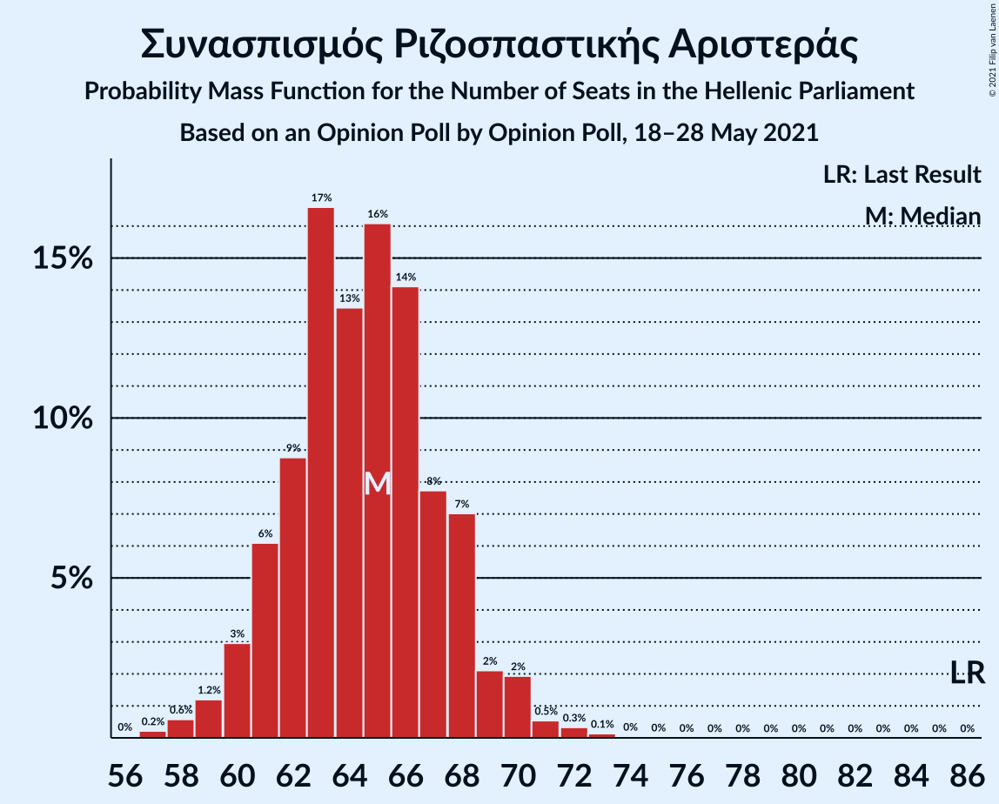
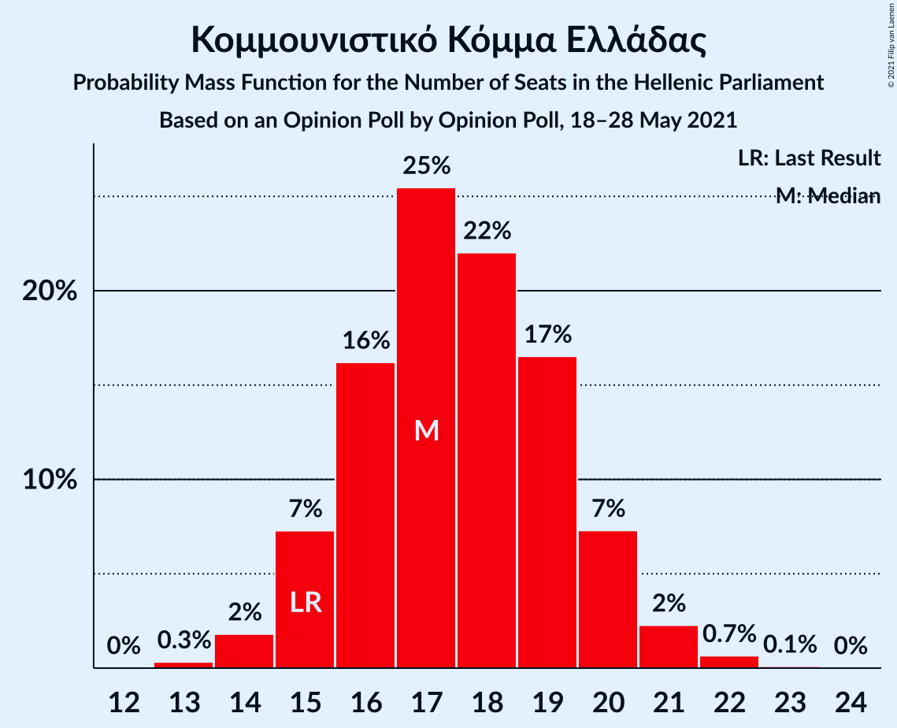

# Opinion Poll by Opinion Poll, 18–28 May 2021

<a href="#voting-intentions">Voting Intentions</a> | <a href="#seats">Seats</a> | <a href="#coalitions">Coalitions</a> | <a href="#technical-information">Technical Information</a>

## Voting Intentions

### Confidence Intervals

| Party | Last Result | Poll Result | 80% Confidence Interval | 90% Confidence Interval | 95% Confidence Interval | 99% Confidence Interval |
|:-----:|:-----------:|:-----------:|:-----------------------:|:-----------------------:|:-----------------------:|:-----------------------:|
| Νέα Δημοκρατία | 39.8% | 46.6% | 45.0–48.2% |44.6–48.7% |44.2–49.1% |43.4–49.8% |
| Συνασπισμός Ριζοσπαστικής Αριστεράς | 31.5% | 24.8% | 23.4–26.2% |23.1–26.6% |22.7–27.0% |22.1–27.7% |
| Κίνημα Αλλαγής | 8.1% | 8.4% | 7.6–9.4% |7.3–9.6% |7.1–9.9% |6.8–10.3% |
| Κομμουνιστικό Κόμμα Ελλάδας | 5.3% | 6.6% | 5.9–7.5% |5.7–7.7% |5.5–7.9% |5.2–8.4% |
| Ελληνική Λύση | 3.7% | 5.2% | 4.5–6.0% |4.3–6.2% |4.2–6.4% |3.9–6.8% |
| Μέτωπο Ευρωπαϊκής Ρεαλιστικής Ανυπακοής | 3.4% | 3.9% | 3.4–4.6% |3.2–4.8% |3.1–5.0% |2.8–5.3% |

*Note:* The poll result column reflects the actual value used in the calculations. Published results may vary slightly, and in addition be rounded to fewer digits.

## Seats

### Confidence Intervals

| Party | Last Result | Median | 80% Confidence Interval | 90% Confidence Interval | 95% Confidence Interval | 99% Confidence Interval |
|:-----:|:-----------:|:------:|:-----------------------:|:-----------------------:|:-----------------------:|:-----------------------:|
| <a href="#νέα-δημοκρατία">Νέα Δημοκρατία</a> | 158 | 172 | 169–176 |168–177 |167–177 |165–180 |
| <a href="#συνασπισμός-ριζοσπαστικής-αριστεράς">Συνασπισμός Ριζοσπαστικής Αριστεράς</a> | 86 | 65 | 61–68 |60–69 |60–70 |58–72 |
| <a href="#κίνημα-αλλαγής">Κίνημα Αλλαγής</a> | 22 | 22 | 20–25 |19–25 |19–26 |18–27 |
| <a href="#κομμουνιστικό-κόμμα-ελλάδας">Κομμουνιστικό Κόμμα Ελλάδας</a> | 15 | 17 | 16–20 |15–20 |15–21 |14–22 |
| <a href="#ελληνική-λύση">Ελληνική Λύση</a> | 10 | 13 | 12–15 |11–16 |11–16 |10–17 |
| <a href="#μέτωπο-ευρωπαϊκής-ρεαλιστικής-ανυπακοής">Μέτωπο Ευρωπαϊκής Ρεαλιστικής Ανυπακοής</a> | 9 | 10 | 9–12 |8–12 |8–13 |0–14 |

### Νέα Δημοκρατία

*For a full overview of the results for this party, see the [Νέα Δημοκρατία](party-νέαδημοκρατία.html) page.*

| Number of Seats | Probability | Accumulated | Special Marks |
|:---------------:|:-----------:|:-----------:|:-------------:|
| 158 | 0% | 100% | Last Result |
| 159 | 0% | 100% |  |
| 160 | 0% | 100% |  |
| 161 | 0% | 100% |  |
| 162 | 0.1% | 99.9% |  |
| 163 | 0.2% | 99.9% |  |
| 164 | 0.2% | 99.7% |  |
| 165 | 0.5% | 99.5% |  |
| 166 | 1.2% | 99.0% |  |
| 167 | 2% | 98% |  |
| 168 | 4% | 95% |  |
| 169 | 8% | 92% |  |
| 170 | 10% | 84% |  |
| 171 | 12% | 74% |  |
| 172 | 15% | 61% | Median |
| 173 | 14% | 46% |  |
| 174 | 12% | 32% |  |
| 175 | 10% | 21% |  |
| 176 | 5% | 11% |  |
| 177 | 4% | 6% |  |
| 178 | 0.9% | 2% |  |
| 179 | 0.8% | 1.4% |  |
| 180 | 0.4% | 0.6% |  |
| 181 | 0.1% | 0.1% |  |
| 182 | 0% | 0.1% |  |
| 183 | 0% | 0% |  |

### Συνασπισμός Ριζοσπαστικής Αριστεράς

*For a full overview of the results for this party, see the [Συνασπισμός Ριζοσπαστικής Αριστεράς](party-συνασπισμόςριζοσπαστικήςαριστεράς.html) page.*

| Number of Seats | Probability | Accumulated | Special Marks |
|:---------------:|:-----------:|:-----------:|:-------------:|
| 56 | 0% | 100% |  |
| 57 | 0.2% | 99.9% |  |
| 58 | 0.6% | 99.7% |  |
| 59 | 1.2% | 99.1% |  |
| 60 | 3% | 98% |  |
| 61 | 6% | 95% |  |
| 62 | 9% | 89% |  |
| 63 | 17% | 80% |  |
| 64 | 13% | 64% |  |
| 65 | 16% | 50% | Median |
| 66 | 14% | 34% |  |
| 67 | 8% | 20% |  |
| 68 | 7% | 12% |  |
| 69 | 2% | 5% |  |
| 70 | 2% | 3% |  |
| 71 | 0.5% | 1.1% |  |
| 72 | 0.3% | 0.5% |  |
| 73 | 0.1% | 0.2% |  |
| 74 | 0% | 0.1% |  |
| 75 | 0% | 0% |  |
| 76 | 0% | 0% |  |
| 77 | 0% | 0% |  |
| 78 | 0% | 0% |  |
| 79 | 0% | 0% |  |
| 80 | 0% | 0% |  |
| 81 | 0% | 0% |  |
| 82 | 0% | 0% |  |
| 83 | 0% | 0% |  |
| 84 | 0% | 0% |  |
| 85 | 0% | 0% |  |
| 86 | 0% | 0% | Last Result |

### Κίνημα Αλλαγής

*For a full overview of the results for this party, see the [Κίνημα Αλλαγής](party-κίνημααλλαγής.html) page.*

| Number of Seats | Probability | Accumulated | Special Marks |
|:---------------:|:-----------:|:-----------:|:-------------:|
| 17 | 0.3% | 100% |  |
| 18 | 2% | 99.6% |  |
| 19 | 5% | 98% |  |
| 20 | 11% | 93% |  |
| 21 | 18% | 81% |  |
| 22 | 22% | 63% | Last Result, Median |
| 23 | 20% | 41% |  |
| 24 | 11% | 21% |  |
| 25 | 6% | 10% |  |
| 26 | 3% | 4% |  |
| 27 | 0.7% | 1.0% |  |
| 28 | 0.2% | 0.3% |  |
| 29 | 0% | 0% |  |

### Κομμουνιστικό Κόμμα Ελλάδας

*For a full overview of the results for this party, see the [Κομμουνιστικό Κόμμα Ελλάδας](party-κομμουνιστικόκόμμαελλάδας.html) page.*

| Number of Seats | Probability | Accumulated | Special Marks |
|:---------------:|:-----------:|:-----------:|:-------------:|
| 13 | 0.3% | 100% |  |
| 14 | 2% | 99.6% |  |
| 15 | 7% | 98% | Last Result |
| 16 | 16% | 91% |  |
| 17 | 25% | 74% | Median |
| 18 | 22% | 49% |  |
| 19 | 17% | 27% |  |
| 20 | 7% | 10% |  |
| 21 | 2% | 3% |  |
| 22 | 0.7% | 0.8% |  |
| 23 | 0.1% | 0.1% |  |
| 24 | 0% | 0% |  |

### Ελληνική Λύση

*For a full overview of the results for this party, see the [Ελληνική Λύση](party-ελληνικήλύση.html) page.*

| Number of Seats | Probability | Accumulated | Special Marks |
|:---------------:|:-----------:|:-----------:|:-------------:|
| 9 | 0.1% | 100% |  |
| 10 | 0.9% | 99.9% | Last Result |
| 11 | 6% | 99.0% |  |
| 12 | 16% | 93% |  |
| 13 | 27% | 77% | Median |
| 14 | 27% | 50% |  |
| 15 | 16% | 23% |  |
| 16 | 5% | 7% |  |
| 17 | 2% | 2% |  |
| 18 | 0.3% | 0.4% |  |
| 19 | 0% | 0.1% |  |
| 20 | 0% | 0% |  |

### Μέτωπο Ευρωπαϊκής Ρεαλιστικής Ανυπακοής

*For a full overview of the results for this party, see the [Μέτωπο Ευρωπαϊκής Ρεαλιστικής Ανυπακοής](party-μέτωποευρωπαϊκήςρεαλιστικήςανυπακοής.html) page.*

| Number of Seats | Probability | Accumulated | Special Marks |
|:---------------:|:-----------:|:-----------:|:-------------:|
| 0 | 2% | 100% |  |
| 1 | 0% | 98% |  |
| 2 | 0% | 98% |  |
| 3 | 0% | 98% |  |
| 4 | 0% | 98% |  |
| 5 | 0% | 98% |  |
| 6 | 0% | 98% |  |
| 7 | 0% | 98% |  |
| 8 | 5% | 98% |  |
| 9 | 23% | 94% | Last Result |
| 10 | 31% | 71% | Median |
| 11 | 24% | 40% |  |
| 12 | 12% | 16% |  |
| 13 | 3% | 3% |  |
| 14 | 0.5% | 0.6% |  |
| 15 | 0.1% | 0.1% |  |
| 16 | 0% | 0% |  |

## Coalitions

### Confidence Intervals

| Coalition | Last Result | Median | Majority? | 80% Confidence Interval | 90% Confidence Interval | 95% Confidence Interval | 99% Confidence Interval |
|:---------:|:-----------:|:------:|:---------:|:-----------------------:|:-----------------------:|:-----------------------:|:-----------------------:|
| Νέα Δημοκρατία – Κίνημα Αλλαγής | 180 | 194 | 100% | 191–198 | 190–199 | 189–200 | 187–202 |
| Νέα Δημοκρατία | 158 | 172 | 100% | 169–176 | 168–177 | 167–177 | 165–180 |
| Συνασπισμός Ριζοσπαστικής Αριστεράς – Μέτωπο Ευρωπαϊκής Ρεαλιστικής Ανυπακοής | 95 | 74 | 0% | 72–78 | 71–79 | 70–79 | 67–82 |
| Συνασπισμός Ριζοσπαστικής Αριστεράς | 86 | 65 | 0% | 61–68 | 60–69 | 60–70 | 58–72 |

### Νέα Δημοκρατία – Κίνημα Αλλαγής

| Number of Seats | Probability | Accumulated | Special Marks |
|:---------------:|:-----------:|:-----------:|:-------------:|
| 180 | 0% | 100% | Last Result |
| 181 | 0% | 100% |  |
| 182 | 0% | 100% |  |
| 183 | 0% | 100% |  |
| 184 | 0.1% | 100% |  |
| 185 | 0.1% | 99.9% |  |
| 186 | 0.2% | 99.7% |  |
| 187 | 0.5% | 99.5% |  |
| 188 | 0.7% | 99.0% |  |
| 189 | 2% | 98% |  |
| 190 | 3% | 96% |  |
| 191 | 8% | 93% |  |
| 192 | 10% | 85% |  |
| 193 | 11% | 75% |  |
| 194 | 20% | 64% | Median |
| 195 | 8% | 44% |  |
| 196 | 17% | 37% |  |
| 197 | 8% | 20% |  |
| 198 | 6% | 12% |  |
| 199 | 3% | 6% |  |
| 200 | 1.3% | 3% |  |
| 201 | 0.8% | 1.5% |  |
| 202 | 0.4% | 0.7% |  |
| 203 | 0.2% | 0.3% |  |
| 204 | 0.1% | 0.1% |  |
| 205 | 0.1% | 0.1% |  |
| 206 | 0% | 0% |  |

### Νέα Δημοκρατία

| Number of Seats | Probability | Accumulated | Special Marks |
|:---------------:|:-----------:|:-----------:|:-------------:|
| 158 | 0% | 100% | Last Result |
| 159 | 0% | 100% |  |
| 160 | 0% | 100% |  |
| 161 | 0% | 100% |  |
| 162 | 0.1% | 99.9% |  |
| 163 | 0.2% | 99.9% |  |
| 164 | 0.2% | 99.7% |  |
| 165 | 0.5% | 99.5% |  |
| 166 | 1.2% | 99.0% |  |
| 167 | 2% | 98% |  |
| 168 | 4% | 95% |  |
| 169 | 8% | 92% |  |
| 170 | 10% | 84% |  |
| 171 | 12% | 74% |  |
| 172 | 15% | 61% | Median |
| 173 | 14% | 46% |  |
| 174 | 12% | 32% |  |
| 175 | 10% | 21% |  |
| 176 | 5% | 11% |  |
| 177 | 4% | 6% |  |
| 178 | 0.9% | 2% |  |
| 179 | 0.8% | 1.4% |  |
| 180 | 0.4% | 0.6% |  |
| 181 | 0.1% | 0.1% |  |
| 182 | 0% | 0.1% |  |
| 183 | 0% | 0% |  |

### Συνασπισμός Ριζοσπαστικής Αριστεράς – Μέτωπο Ευρωπαϊκής Ρεαλιστικής Ανυπακοής

| Number of Seats | Probability | Accumulated | Special Marks |
|:---------------:|:-----------:|:-----------:|:-------------:|
| 64 | 0.1% | 100% |  |
| 65 | 0.1% | 99.9% |  |
| 66 | 0.2% | 99.8% |  |
| 67 | 0.2% | 99.6% |  |
| 68 | 0.7% | 99.4% |  |
| 69 | 0.7% | 98.7% |  |
| 70 | 3% | 98% |  |
| 71 | 5% | 95% |  |
| 72 | 8% | 91% |  |
| 73 | 14% | 83% |  |
| 74 | 20% | 69% |  |
| 75 | 12% | 49% | Median |
| 76 | 15% | 37% |  |
| 77 | 10% | 21% |  |
| 78 | 6% | 12% |  |
| 79 | 3% | 6% |  |
| 80 | 1.2% | 2% |  |
| 81 | 0.4% | 1.2% |  |
| 82 | 0.4% | 0.8% |  |
| 83 | 0.2% | 0.4% |  |
| 84 | 0.1% | 0.2% |  |
| 85 | 0% | 0.1% |  |
| 86 | 0% | 0% |  |
| 87 | 0% | 0% |  |
| 88 | 0% | 0% |  |
| 89 | 0% | 0% |  |
| 90 | 0% | 0% |  |
| 91 | 0% | 0% |  |
| 92 | 0% | 0% |  |
| 93 | 0% | 0% |  |
| 94 | 0% | 0% |  |
| 95 | 0% | 0% | Last Result |

### Συνασπισμός Ριζοσπαστικής Αριστεράς

| Number of Seats | Probability | Accumulated | Special Marks |
|:---------------:|:-----------:|:-----------:|:-------------:|
| 56 | 0% | 100% |  |
| 57 | 0.2% | 99.9% |  |
| 58 | 0.6% | 99.7% |  |
| 59 | 1.2% | 99.1% |  |
| 60 | 3% | 98% |  |
| 61 | 6% | 95% |  |
| 62 | 9% | 89% |  |
| 63 | 17% | 80% |  |
| 64 | 13% | 64% |  |
| 65 | 16% | 50% | Median |
| 66 | 14% | 34% |  |
| 67 | 8% | 20% |  |
| 68 | 7% | 12% |  |
| 69 | 2% | 5% |  |
| 70 | 2% | 3% |  |
| 71 | 0.5% | 1.1% |  |
| 72 | 0.3% | 0.5% |  |
| 73 | 0.1% | 0.2% |  |
| 74 | 0% | 0.1% |  |
| 75 | 0% | 0% |  |
| 76 | 0% | 0% |  |
| 77 | 0% | 0% |  |
| 78 | 0% | 0% |  |
| 79 | 0% | 0% |  |
| 80 | 0% | 0% |  |
| 81 | 0% | 0% |  |
| 82 | 0% | 0% |  |
| 83 | 0% | 0% |  |
| 84 | 0% | 0% |  |
| 85 | 0% | 0% |  |
| 86 | 0% | 0% | Last Result |

## Technical Information

### Opinion Poll

+ **Polling firm:** Opinion Poll
+ **Commissioner(s):** —
+ **Fieldwork period:** 18–28 May 2021

### Calculations

+ **Sample size:** 1605
+ **Simulations done:** 131,072
+ **Error estimate:** 2.03%

