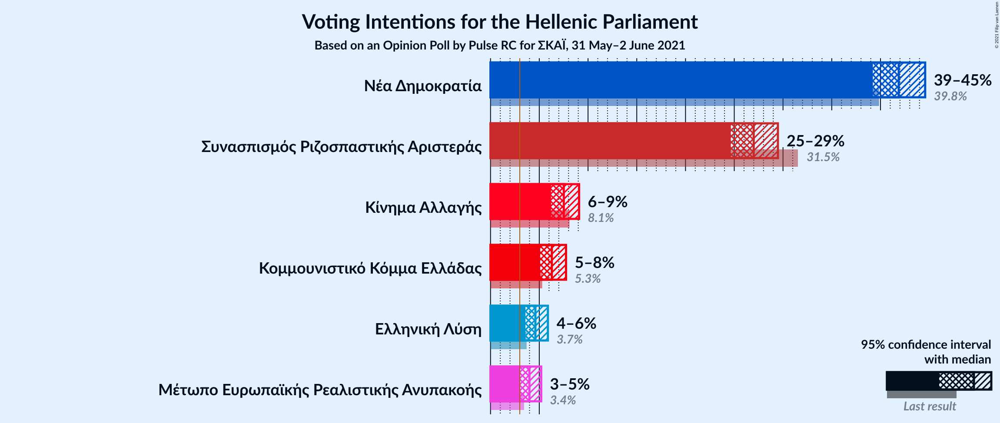
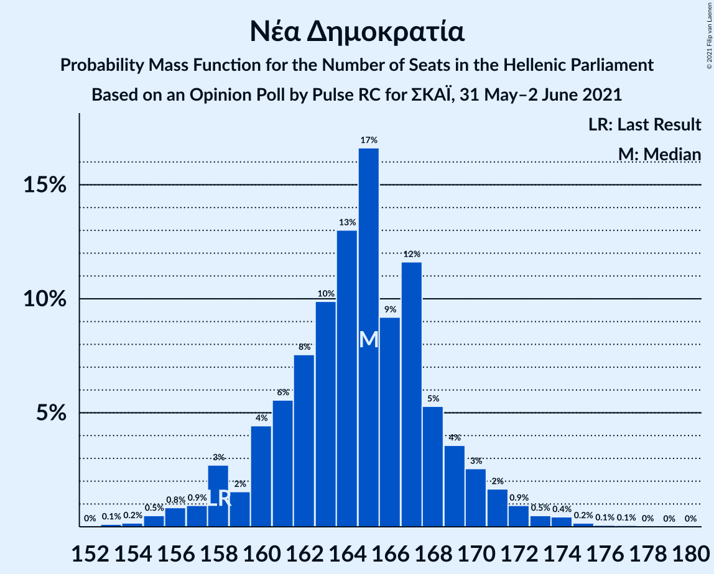
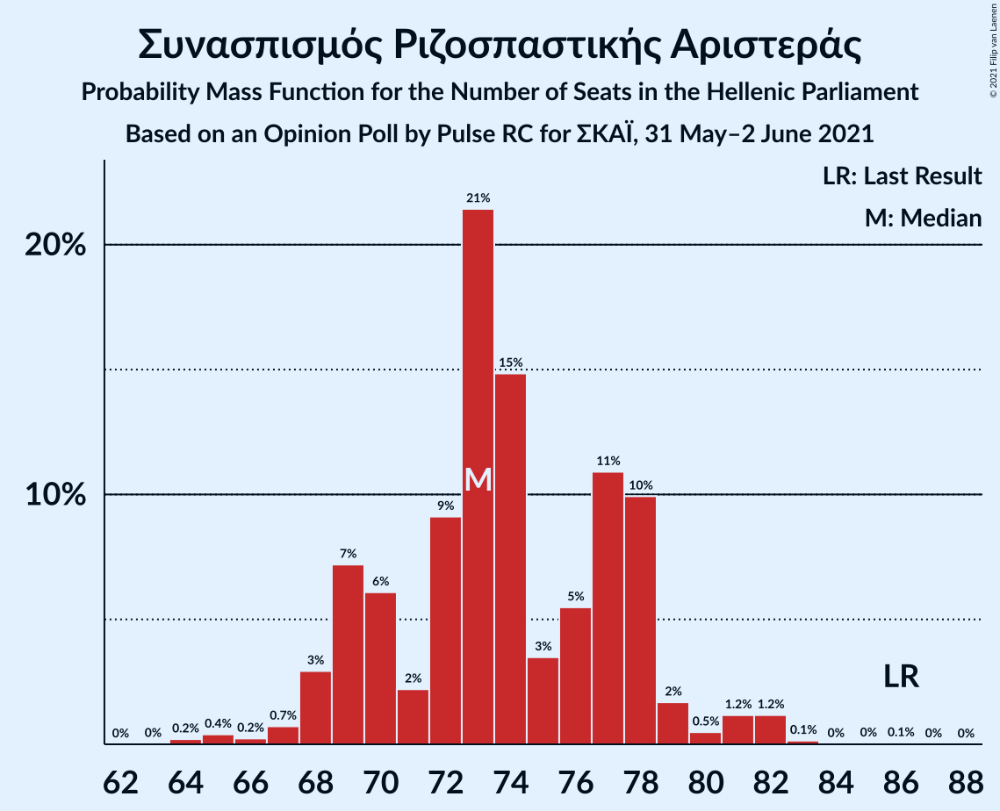
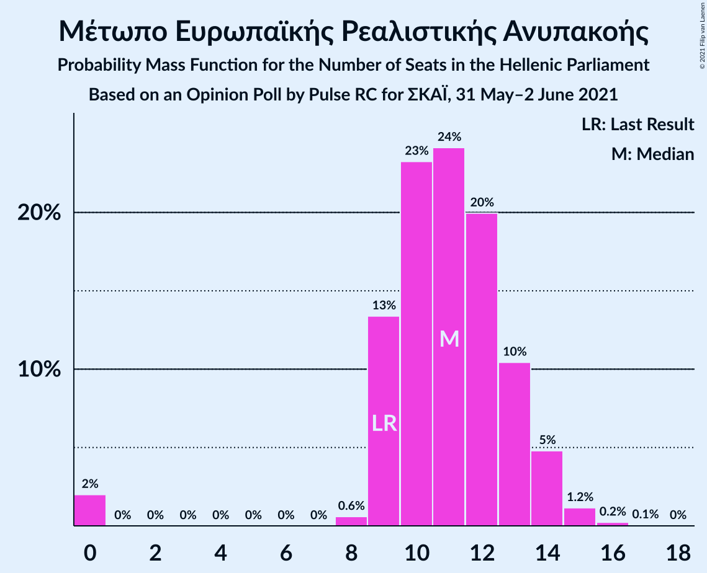
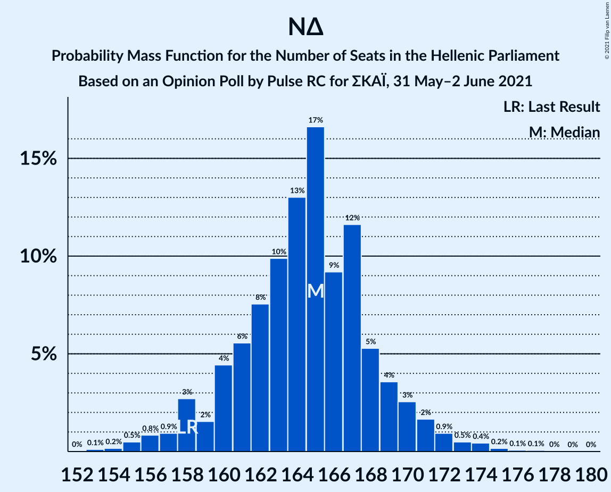

# Opinion Poll by Pulse RC for ΣΚΑΪ, 31 May–2 June 2021

<a href="#voting-intentions">Voting Intentions</a> | <a href="#seats">Seats</a> | <a href="#coalitions">Coalitions</a> | <a href="#technical-information">Technical Information</a>

## Voting Intentions

### Confidence Intervals

| Party | Last Result | Poll Result | 80% Confidence Interval | 90% Confidence Interval | 95% Confidence Interval | 99% Confidence Interval |
|:-----:|:-----------:|:-----------:|:-----------------------:|:-----------------------:|:-----------------------:|:-----------------------:|
| Νέα Δημοκρατία | 39.8% | 42.3% | 40.6–44.1% |40.1–44.6% |39.7–45.0% |38.8–45.9% |
| Συνασπισμός Ριζοσπαστικής Αριστεράς | 31.5% | 26.9% | 25.4–28.5% |25.0–29.0% |24.6–29.4% |23.9–30.2% |
| Κίνημα Αλλαγής | 8.1% | 7.7% | 6.8–8.7% |6.6–9.0% |6.3–9.3% |5.9–9.8% |
| Κομμουνιστικό Κόμμα Ελλάδας | 5.3% | 6.0% | 5.2–6.9% |5.0–7.2% |4.8–7.4% |4.5–7.9% |
| Ελληνική Λύση | 3.7% | 4.4% | 3.7–5.2% |3.5–5.4% |3.4–5.6% |3.1–6.1% |
| Μέτωπο Ευρωπαϊκής Ρεαλιστικής Ανυπακοής | 3.4% | 3.8% | 3.2–4.6% |3.1–4.8% |2.9–5.0% |2.7–5.4% |

*Note:* The poll result column reflects the actual value used in the calculations. Published results may vary slightly, and in addition be rounded to fewer digits.

## Seats

### Confidence Intervals

| Party | Last Result | Median | 80% Confidence Interval | 90% Confidence Interval | 95% Confidence Interval | 99% Confidence Interval |
|:-----:|:-----------:|:------:|:-----------------------:|:-----------------------:|:-----------------------:|:-----------------------:|
| <a href="#νέα-δημοκρατία">Νέα Δημοκρατία</a> | 158 | 166 | 161–171 |160–172 |159–174 |157–176 |
| <a href="#συνασπισμός-ριζοσπαστικής-αριστεράς">Συνασπισμός Ριζοσπαστικής Αριστεράς</a> | 86 | 74 | 70–78 |68–79 |67–81 |65–83 |
| <a href="#κίνημα-αλλαγής">Κίνημα Αλλαγής</a> | 22 | 21 | 19–24 |18–25 |17–25 |16–27 |
| <a href="#κομμουνιστικό-κόμμα-ελλάδας">Κομμουνιστικό Κόμμα Ελλάδας</a> | 15 | 17 | 14–19 |14–20 |13–20 |12–22 |
| <a href="#ελληνική-λύση">Ελληνική Λύση</a> | 10 | 12 | 10–14 |10–15 |9–15 |8–17 |
| <a href="#μέτωπο-ευρωπαϊκής-ρεαλιστικής-ανυπακοής">Μέτωπο Ευρωπαϊκής Ρεαλιστικής Ανυπακοής</a> | 9 | 11 | 9–13 |8–13 |0–14 |0–15 |

### Νέα Δημοκρατία

*For a full overview of the results for this party, see the [Νέα Δημοκρατία](party-νέαδημοκρατία.html) page.*

| Number of Seats | Probability | Accumulated | Special Marks |
|:---------------:|:-----------:|:-----------:|:-------------:|
| 154 | 0.1% | 100% |  |
| 155 | 0.1% | 99.9% |  |
| 156 | 0.3% | 99.8% |  |
| 157 | 0.6% | 99.5% |  |
| 158 | 1.1% | 98.9% | Last Result |
| 159 | 2% | 98% |  |
| 160 | 3% | 96% |  |
| 161 | 5% | 93% |  |
| 162 | 6% | 88% |  |
| 163 | 7% | 82% |  |
| 164 | 9% | 75% |  |
| 165 | 11% | 66% |  |
| 166 | 11% | 55% | Median |
| 167 | 11% | 44% |  |
| 168 | 9% | 33% |  |
| 169 | 7% | 24% |  |
| 170 | 6% | 16% |  |
| 171 | 4% | 11% |  |
| 172 | 2% | 7% |  |
| 173 | 2% | 5% |  |
| 174 | 1.1% | 3% |  |
| 175 | 0.9% | 2% |  |
| 176 | 0.5% | 0.9% |  |
| 177 | 0.2% | 0.4% |  |
| 178 | 0.1% | 0.2% |  |
| 179 | 0% | 0.1% |  |
| 180 | 0% | 0% |  |

### Συνασπισμός Ριζοσπαστικής Αριστεράς

*For a full overview of the results for this party, see the [Συνασπισμός Ριζοσπαστικής Αριστεράς](party-συνασπισμόςριζοσπαστικήςαριστεράς.html) page.*

| Number of Seats | Probability | Accumulated | Special Marks |
|:---------------:|:-----------:|:-----------:|:-------------:|
| 63 | 0% | 100% |  |
| 64 | 0.1% | 99.9% |  |
| 65 | 0.4% | 99.8% |  |
| 66 | 0.8% | 99.4% |  |
| 67 | 2% | 98.6% |  |
| 68 | 2% | 97% |  |
| 69 | 4% | 95% |  |
| 70 | 7% | 90% |  |
| 71 | 9% | 84% |  |
| 72 | 11% | 74% |  |
| 73 | 11% | 63% |  |
| 74 | 12% | 52% | Median |
| 75 | 10% | 41% |  |
| 76 | 10% | 31% |  |
| 77 | 8% | 21% |  |
| 78 | 5% | 13% |  |
| 79 | 4% | 8% |  |
| 80 | 2% | 5% |  |
| 81 | 1.2% | 3% |  |
| 82 | 0.6% | 1.3% |  |
| 83 | 0.4% | 0.7% |  |
| 84 | 0.2% | 0.3% |  |
| 85 | 0.1% | 0.1% |  |
| 86 | 0% | 0.1% | Last Result |
| 87 | 0% | 0% |  |

### Κίνημα Αλλαγής

*For a full overview of the results for this party, see the [Κίνημα Αλλαγής](party-κίνημααλλαγής.html) page.*

| Number of Seats | Probability | Accumulated | Special Marks |
|:---------------:|:-----------:|:-----------:|:-------------:|
| 15 | 0.1% | 100% |  |
| 16 | 0.6% | 99.9% |  |
| 17 | 2% | 99.3% |  |
| 18 | 6% | 97% |  |
| 19 | 12% | 91% |  |
| 20 | 16% | 79% |  |
| 21 | 19% | 63% | Median |
| 22 | 18% | 43% | Last Result |
| 23 | 13% | 25% |  |
| 24 | 7% | 13% |  |
| 25 | 3% | 6% |  |
| 26 | 1.4% | 2% |  |
| 27 | 0.4% | 0.6% |  |
| 28 | 0.1% | 0.2% |  |
| 29 | 0% | 0.1% |  |
| 30 | 0% | 0% |  |

### Κομμουνιστικό Κόμμα Ελλάδας

*For a full overview of the results for this party, see the [Κομμουνιστικό Κόμμα Ελλάδας](party-κομμουνιστικόκόμμαελλάδας.html) page.*

| Number of Seats | Probability | Accumulated | Special Marks |
|:---------------:|:-----------:|:-----------:|:-------------:|
| 11 | 0.1% | 100% |  |
| 12 | 0.7% | 99.9% |  |
| 13 | 3% | 99.2% |  |
| 14 | 9% | 96% |  |
| 15 | 16% | 87% | Last Result |
| 16 | 21% | 72% |  |
| 17 | 21% | 50% | Median |
| 18 | 15% | 29% |  |
| 19 | 9% | 14% |  |
| 20 | 4% | 6% |  |
| 21 | 1.4% | 2% |  |
| 22 | 0.4% | 0.5% |  |
| 23 | 0.1% | 0.1% |  |
| 24 | 0% | 0% |  |

### Ελληνική Λύση

*For a full overview of the results for this party, see the [Ελληνική Λύση](party-ελληνικήλύση.html) page.*

| Number of Seats | Probability | Accumulated | Special Marks |
|:---------------:|:-----------:|:-----------:|:-------------:|
| 0 | 0.3% | 100% |  |
| 1 | 0% | 99.7% |  |
| 2 | 0% | 99.7% |  |
| 3 | 0% | 99.7% |  |
| 4 | 0% | 99.7% |  |
| 5 | 0% | 99.7% |  |
| 6 | 0% | 99.7% |  |
| 7 | 0% | 99.7% |  |
| 8 | 0.3% | 99.7% |  |
| 9 | 3% | 99.5% |  |
| 10 | 10% | 96% | Last Result |
| 11 | 22% | 86% |  |
| 12 | 26% | 65% | Median |
| 13 | 20% | 39% |  |
| 14 | 12% | 19% |  |
| 15 | 5% | 7% |  |
| 16 | 2% | 2% |  |
| 17 | 0.4% | 0.5% |  |
| 18 | 0.1% | 0.1% |  |
| 19 | 0% | 0% |  |

### Μέτωπο Ευρωπαϊκής Ρεαλιστικής Ανυπακοής

*For a full overview of the results for this party, see the [Μέτωπο Ευρωπαϊκής Ρεαλιστικής Ανυπακοής](party-μέτωποευρωπαϊκήςρεαλιστικήςανυπακοής.html) page.*

| Number of Seats | Probability | Accumulated | Special Marks |
|:---------------:|:-----------:|:-----------:|:-------------:|
| 0 | 4% | 100% |  |
| 1 | 0% | 96% |  |
| 2 | 0% | 96% |  |
| 3 | 0% | 96% |  |
| 4 | 0% | 96% |  |
| 5 | 0% | 96% |  |
| 6 | 0% | 96% |  |
| 7 | 0% | 96% |  |
| 8 | 2% | 96% |  |
| 9 | 16% | 94% | Last Result |
| 10 | 25% | 78% |  |
| 11 | 25% | 53% | Median |
| 12 | 17% | 28% |  |
| 13 | 8% | 11% |  |
| 14 | 3% | 3% |  |
| 15 | 0.6% | 0.8% |  |
| 16 | 0.1% | 0.2% |  |
| 17 | 0% | 0% |  |

## Coalitions

### Confidence Intervals

| Coalition | Last Result | Median | Majority? | 80% Confidence Interval | 90% Confidence Interval | 95% Confidence Interval | 99% Confidence Interval |
|:---------:|:-----------:|:------:|:---------:|:-----------------------:|:-----------------------:|:-----------------------:|:-----------------------:|
| Νέα Δημοκρατία – Κίνημα Αλλαγής | 180 | 187 | 100% | 182–192 | 181–193 | 180–195 | 178–198 |
| Νέα Δημοκρατία | 158 | 166 | 100% | 161–171 | 160–172 | 159–174 | 157–176 |
| Συνασπισμός Ριζοσπαστικής Αριστεράς – Μέτωπο Ευρωπαϊκής Ρεαλιστικής Ανυπακοής | 95 | 84 | 0% | 79–89 | 78–90 | 76–91 | 73–93 |
| Συνασπισμός Ριζοσπαστικής Αριστεράς | 86 | 74 | 0% | 70–78 | 68–79 | 67–81 | 65–83 |

### Νέα Δημοκρατία – Κίνημα Αλλαγής

| Number of Seats | Probability | Accumulated | Special Marks |
|:---------------:|:-----------:|:-----------:|:-------------:|
| 175 | 0% | 100% |  |
| 176 | 0.1% | 99.9% |  |
| 177 | 0.3% | 99.8% |  |
| 178 | 0.5% | 99.6% |  |
| 179 | 0.9% | 99.0% |  |
| 180 | 2% | 98% | Last Result |
| 181 | 3% | 96% |  |
| 182 | 4% | 93% |  |
| 183 | 6% | 89% |  |
| 184 | 8% | 83% |  |
| 185 | 8% | 75% |  |
| 186 | 10% | 67% |  |
| 187 | 12% | 57% | Median |
| 188 | 10% | 45% |  |
| 189 | 10% | 36% |  |
| 190 | 7% | 25% |  |
| 191 | 6% | 18% |  |
| 192 | 5% | 12% |  |
| 193 | 3% | 8% |  |
| 194 | 2% | 5% |  |
| 195 | 1.0% | 3% |  |
| 196 | 0.8% | 2% |  |
| 197 | 0.5% | 1.2% |  |
| 198 | 0.4% | 0.8% |  |
| 199 | 0.2% | 0.4% |  |
| 200 | 0.1% | 0.2% |  |
| 201 | 0.1% | 0.1% |  |
| 202 | 0% | 0% |  |

### Νέα Δημοκρατία

| Number of Seats | Probability | Accumulated | Special Marks |
|:---------------:|:-----------:|:-----------:|:-------------:|
| 154 | 0.1% | 100% |  |
| 155 | 0.1% | 99.9% |  |
| 156 | 0.3% | 99.8% |  |
| 157 | 0.6% | 99.5% |  |
| 158 | 1.1% | 98.9% | Last Result |
| 159 | 2% | 98% |  |
| 160 | 3% | 96% |  |
| 161 | 5% | 93% |  |
| 162 | 6% | 88% |  |
| 163 | 7% | 82% |  |
| 164 | 9% | 75% |  |
| 165 | 11% | 66% |  |
| 166 | 11% | 55% | Median |
| 167 | 11% | 44% |  |
| 168 | 9% | 33% |  |
| 169 | 7% | 24% |  |
| 170 | 6% | 16% |  |
| 171 | 4% | 11% |  |
| 172 | 2% | 7% |  |
| 173 | 2% | 5% |  |
| 174 | 1.1% | 3% |  |
| 175 | 0.9% | 2% |  |
| 176 | 0.5% | 0.9% |  |
| 177 | 0.2% | 0.4% |  |
| 178 | 0.1% | 0.2% |  |
| 179 | 0% | 0.1% |  |
| 180 | 0% | 0% |  |

### Συνασπισμός Ριζοσπαστικής Αριστεράς – Μέτωπο Ευρωπαϊκής Ρεαλιστικής Ανυπακοής

| Number of Seats | Probability | Accumulated | Special Marks |
|:---------------:|:-----------:|:-----------:|:-------------:|
| 70 | 0.1% | 100% |  |
| 71 | 0.2% | 99.9% |  |
| 72 | 0.2% | 99.7% |  |
| 73 | 0.2% | 99.6% |  |
| 74 | 0.4% | 99.3% |  |
| 75 | 0.7% | 98.9% |  |
| 76 | 0.8% | 98% |  |
| 77 | 1.5% | 97% |  |
| 78 | 2% | 96% |  |
| 79 | 4% | 94% |  |
| 80 | 5% | 90% |  |
| 81 | 8% | 85% |  |
| 82 | 9% | 78% |  |
| 83 | 11% | 69% |  |
| 84 | 12% | 58% |  |
| 85 | 10% | 46% | Median |
| 86 | 10% | 36% |  |
| 87 | 8% | 26% |  |
| 88 | 6% | 18% |  |
| 89 | 5% | 12% |  |
| 90 | 3% | 7% |  |
| 91 | 2% | 4% |  |
| 92 | 1.0% | 2% |  |
| 93 | 0.5% | 1.0% |  |
| 94 | 0.3% | 0.5% |  |
| 95 | 0.1% | 0.2% | Last Result |
| 96 | 0.1% | 0.1% |  |
| 97 | 0% | 0% |  |

### Συνασπισμός Ριζοσπαστικής Αριστεράς

| Number of Seats | Probability | Accumulated | Special Marks |
|:---------------:|:-----------:|:-----------:|:-------------:|
| 63 | 0% | 100% |  |
| 64 | 0.1% | 99.9% |  |
| 65 | 0.4% | 99.8% |  |
| 66 | 0.8% | 99.4% |  |
| 67 | 2% | 98.6% |  |
| 68 | 2% | 97% |  |
| 69 | 4% | 95% |  |
| 70 | 7% | 90% |  |
| 71 | 9% | 84% |  |
| 72 | 11% | 74% |  |
| 73 | 11% | 63% |  |
| 74 | 12% | 52% | Median |
| 75 | 10% | 41% |  |
| 76 | 10% | 31% |  |
| 77 | 8% | 21% |  |
| 78 | 5% | 13% |  |
| 79 | 4% | 8% |  |
| 80 | 2% | 5% |  |
| 81 | 1.2% | 3% |  |
| 82 | 0.6% | 1.3% |  |
| 83 | 0.4% | 0.7% |  |
| 84 | 0.2% | 0.3% |  |
| 85 | 0.1% | 0.1% |  |
| 86 | 0% | 0.1% | Last Result |
| 87 | 0% | 0% |  |

## Technical Information

### Opinion Poll

+ **Polling firm:** Pulse RC
+ **Commissioner(s):** ΣΚΑΪ
+ **Fieldwork period:** 31 May–2 June 2021

### Calculations

+ **Sample size:** 1304
+ **Simulations done:** 1,048,576
+ **Error estimate:** 0.55%

