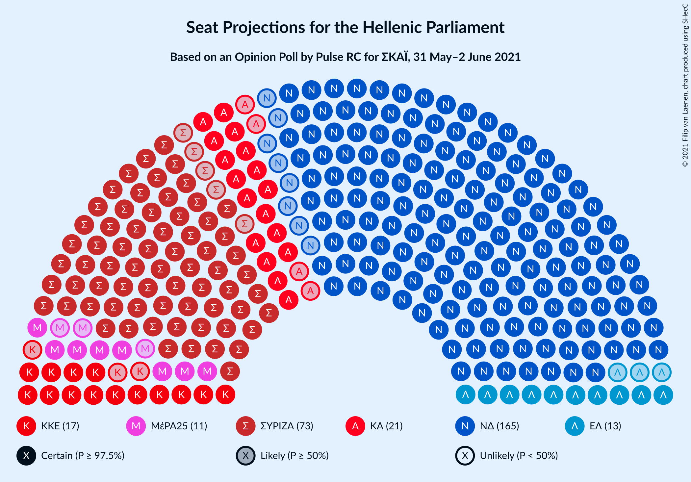
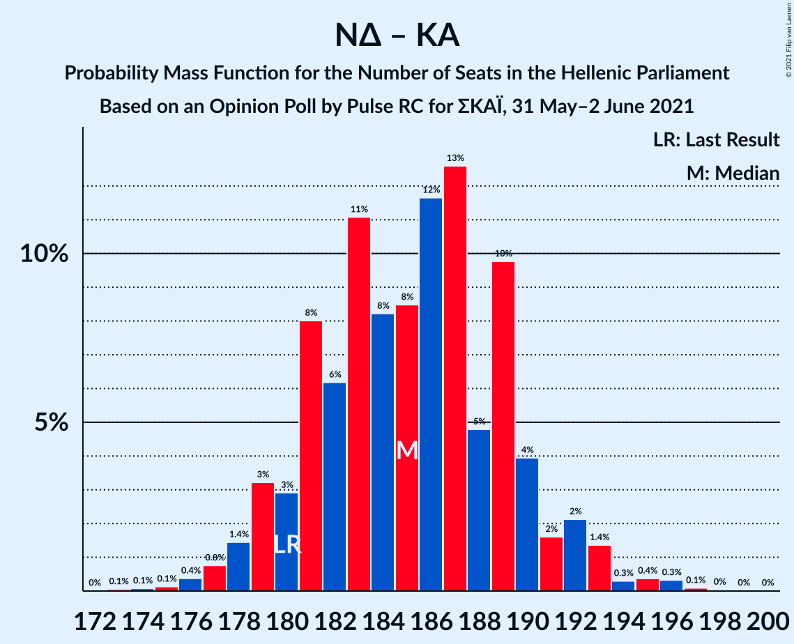
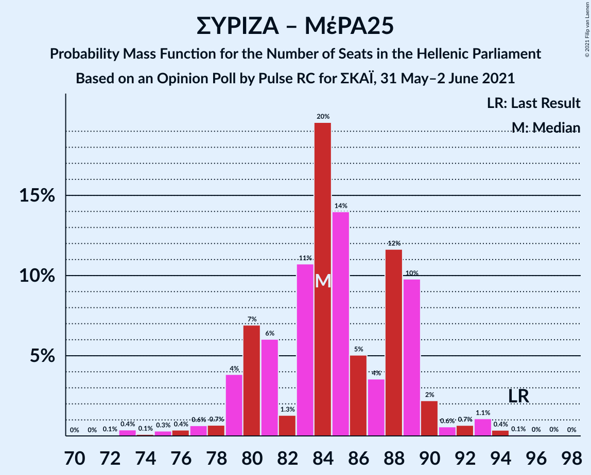

# Opinion Poll by Pulse RC for ΣΚΑΪ, 31 May–2 June 2021

<a href="#voting-intentions">Voting Intentions</a> | <a href="#seats">Seats</a> | <a href="#coalitions">Coalitions</a> | <a href="#technical-information">Technical Information</a>

## Voting Intentions

### Confidence Intervals

| Party | Last Result | Poll Result | 80% Confidence Interval | 90% Confidence Interval | 95% Confidence Interval | 99% Confidence Interval |
|:-----:|:-----------:|:-----------:|:-----------------------:|:-----------------------:|:-----------------------:|:-----------------------:|
| Νέα Δημοκρατία | 39.8% | 41.9% | 40.1–43.6% |39.6–44.1% |39.2–44.6% |38.4–45.4% |
| Συνασπισμός Ριζοσπαστικής Αριστεράς | 31.5% | 27.0% | 25.5–28.6% |25.0–29.1% |24.6–29.5% |23.9–30.3% |
| Κίνημα Αλλαγής | 8.1% | 7.5% | 6.6–8.5% |6.4–8.8% |6.2–9.1% |5.8–9.6% |
| Κομμουνιστικό Κόμμα Ελλάδας | 5.3% | 6.3% | 5.5–7.2% |5.3–7.5% |5.1–7.7% |4.7–8.2% |
| Ελληνική Λύση | 3.7% | 4.6% | 3.9–5.4% |3.7–5.7% |3.6–5.9% |3.3–6.3% |
| Μέτωπο Ευρωπαϊκής Ρεαλιστικής Ανυπακοής | 3.4% | 4.0% | 3.4–4.8% |3.2–5.0% |3.0–5.2% |2.8–5.6% |

*Note:* The poll result column reflects the actual value used in the calculations. Published results may vary slightly, and in addition be rounded to fewer digits.

## Seats

### Confidence Intervals

| Party | Last Result | Median | 80% Confidence Interval | 90% Confidence Interval | 95% Confidence Interval | 99% Confidence Interval |
|:-----:|:-----------:|:------:|:-----------------------:|:-----------------------:|:-----------------------:|:-----------------------:|
| <a href="#νέα-δημοκρατία">Νέα Δημοκρατία</a> | 158 | 165 | 160–169 |158–170 |157–171 |155–174 |
| <a href="#συνασπισμός-ριζοσπαστικής-αριστεράς">Συνασπισμός Ριζοσπαστικής Αριστεράς</a> | 86 | 73 | 69–78 |69–78 |68–81 |65–82 |
| <a href="#κίνημα-αλλαγής">Κίνημα Αλλαγής</a> | 22 | 21 | 18–23 |18–24 |17–25 |16–26 |
| <a href="#κομμουνιστικό-κόμμα-ελλάδας">Κομμουνιστικό Κόμμα Ελλάδας</a> | 15 | 17 | 15–20 |14–21 |14–21 |13–22 |
| <a href="#ελληνική-λύση">Ελληνική Λύση</a> | 10 | 13 | 11–15 |10–15 |10–16 |9–17 |
| <a href="#μέτωπο-ευρωπαϊκής-ρεαλιστικής-ανυπακοής">Μέτωπο Ευρωπαϊκής Ρεαλιστικής Ανυπακοής</a> | 9 | 11 | 9–13 |9–14 |8–14 |0–15 |

### Νέα Δημοκρατία

*For a full overview of the results for this party, see the [Νέα Δημοκρατία](party-νέαδημοκρατία.html) page.*

| Number of Seats | Probability | Accumulated | Special Marks |
|:---------------:|:-----------:|:-----------:|:-------------:|
| 153 | 0.1% | 100% |  |
| 154 | 0.2% | 99.8% |  |
| 155 | 0.5% | 99.7% |  |
| 156 | 0.8% | 99.2% |  |
| 157 | 0.9% | 98% |  |
| 158 | 3% | 97% | Last Result |
| 159 | 2% | 95% |  |
| 160 | 4% | 93% |  |
| 161 | 6% | 89% |  |
| 162 | 8% | 83% |  |
| 163 | 10% | 76% |  |
| 164 | 13% | 66% |  |
| 165 | 17% | 53% | Median |
| 166 | 9% | 36% |  |
| 167 | 12% | 27% |  |
| 168 | 5% | 15% |  |
| 169 | 4% | 10% |  |
| 170 | 3% | 6% |  |
| 171 | 2% | 4% |  |
| 172 | 0.9% | 2% |  |
| 173 | 0.5% | 1.3% |  |
| 174 | 0.4% | 0.8% |  |
| 175 | 0.2% | 0.4% |  |
| 176 | 0.1% | 0.2% |  |
| 177 | 0.1% | 0.1% |  |
| 178 | 0% | 0.1% |  |
| 179 | 0% | 0% |  |

### Συνασπισμός Ριζοσπαστικής Αριστεράς

*For a full overview of the results for this party, see the [Συνασπισμός Ριζοσπαστικής Αριστεράς](party-συνασπισμόςριζοσπαστικήςαριστεράς.html) page.*

| Number of Seats | Probability | Accumulated | Special Marks |
|:---------------:|:-----------:|:-----------:|:-------------:|
| 64 | 0.2% | 100% |  |
| 65 | 0.4% | 99.8% |  |
| 66 | 0.2% | 99.4% |  |
| 67 | 0.7% | 99.1% |  |
| 68 | 3% | 98% |  |
| 69 | 7% | 95% |  |
| 70 | 6% | 88% |  |
| 71 | 2% | 82% |  |
| 72 | 9% | 80% |  |
| 73 | 21% | 71% | Median |
| 74 | 15% | 49% |  |
| 75 | 3% | 35% |  |
| 76 | 5% | 31% |  |
| 77 | 11% | 26% |  |
| 78 | 10% | 15% |  |
| 79 | 2% | 5% |  |
| 80 | 0.5% | 3% |  |
| 81 | 1.2% | 3% |  |
| 82 | 1.2% | 1.4% |  |
| 83 | 0.1% | 0.3% |  |
| 84 | 0% | 0.1% |  |
| 85 | 0% | 0.1% |  |
| 86 | 0.1% | 0.1% | Last Result |
| 87 | 0% | 0% |  |

### Κίνημα Αλλαγής

*For a full overview of the results for this party, see the [Κίνημα Αλλαγής](party-κίνημααλλαγής.html) page.*

| Number of Seats | Probability | Accumulated | Special Marks |
|:---------------:|:-----------:|:-----------:|:-------------:|
| 15 | 0.2% | 100% |  |
| 16 | 1.0% | 99.8% |  |
| 17 | 3% | 98.8% |  |
| 18 | 8% | 95% |  |
| 19 | 14% | 88% |  |
| 20 | 19% | 74% |  |
| 21 | 21% | 54% | Median |
| 22 | 18% | 33% | Last Result |
| 23 | 9% | 15% |  |
| 24 | 4% | 6% |  |
| 25 | 2% | 3% |  |
| 26 | 0.7% | 1.0% |  |
| 27 | 0.2% | 0.3% |  |
| 28 | 0.1% | 0.1% |  |
| 29 | 0% | 0% |  |

### Κομμουνιστικό Κόμμα Ελλάδας

*For a full overview of the results for this party, see the [Κομμουνιστικό Κόμμα Ελλάδας](party-κομμουνιστικόκόμμαελλάδας.html) page.*

| Number of Seats | Probability | Accumulated | Special Marks |
|:---------------:|:-----------:|:-----------:|:-------------:|
| 12 | 0.1% | 100% |  |
| 13 | 1.1% | 99.9% |  |
| 14 | 5% | 98.7% |  |
| 15 | 10% | 94% | Last Result |
| 16 | 15% | 84% |  |
| 17 | 22% | 69% | Median |
| 18 | 23% | 47% |  |
| 19 | 11% | 24% |  |
| 20 | 7% | 13% |  |
| 21 | 4% | 6% |  |
| 22 | 1.4% | 2% |  |
| 23 | 0.3% | 0.4% |  |
| 24 | 0.1% | 0.1% |  |
| 25 | 0% | 0% |  |

### Ελληνική Λύση

*For a full overview of the results for this party, see the [Ελληνική Λύση](party-ελληνικήλύση.html) page.*

| Number of Seats | Probability | Accumulated | Special Marks |
|:---------------:|:-----------:|:-----------:|:-------------:|
| 8 | 0.1% | 100% |  |
| 9 | 1.4% | 99.9% |  |
| 10 | 6% | 98.5% | Last Result |
| 11 | 13% | 93% |  |
| 12 | 23% | 80% |  |
| 13 | 29% | 57% | Median |
| 14 | 16% | 28% |  |
| 15 | 8% | 12% |  |
| 16 | 3% | 4% |  |
| 17 | 0.8% | 1.1% |  |
| 18 | 0.2% | 0.3% |  |
| 19 | 0.1% | 0.1% |  |
| 20 | 0% | 0% |  |

### Μέτωπο Ευρωπαϊκής Ρεαλιστικής Ανυπακοής

*For a full overview of the results for this party, see the [Μέτωπο Ευρωπαϊκής Ρεαλιστικής Ανυπακοής](party-μέτωποευρωπαϊκήςρεαλιστικήςανυπακοής.html) page.*

| Number of Seats | Probability | Accumulated | Special Marks |
|:---------------:|:-----------:|:-----------:|:-------------:|
| 0 | 2% | 100% |  |
| 1 | 0% | 98% |  |
| 2 | 0% | 98% |  |
| 3 | 0% | 98% |  |
| 4 | 0% | 98% |  |
| 5 | 0% | 98% |  |
| 6 | 0% | 98% |  |
| 7 | 0% | 98% |  |
| 8 | 0.6% | 98% |  |
| 9 | 13% | 97% | Last Result |
| 10 | 23% | 84% |  |
| 11 | 24% | 61% | Median |
| 12 | 20% | 37% |  |
| 13 | 10% | 17% |  |
| 14 | 5% | 6% |  |
| 15 | 1.2% | 1.4% |  |
| 16 | 0.2% | 0.3% |  |
| 17 | 0.1% | 0.1% |  |
| 18 | 0% | 0% |  |

## Coalitions

### Confidence Intervals

| Coalition | Last Result | Median | Majority? | 80% Confidence Interval | 90% Confidence Interval | 95% Confidence Interval | 99% Confidence Interval |
|:---------:|:-----------:|:------:|:---------:|:-----------------------:|:-----------------------:|:-----------------------:|:-----------------------:|
| Νέα Δημοκρατία – Κίνημα Αλλαγής | 180 | 185 | 100% | 181–190 | 179–191 | 178–193 | 176–195 |
| Νέα Δημοκρατία | 158 | 165 | 100% | 160–169 | 158–170 | 157–171 | 155–174 |
| Συνασπισμός Ριζοσπαστικής Αριστεράς – Μέτωπο Ευρωπαϊκής Ρεαλιστικής Ανυπακοής | 95 | 84 | 0% | 80–89 | 79–90 | 78–91 | 74–94 |
| Συνασπισμός Ριζοσπαστικής Αριστεράς | 86 | 73 | 0% | 69–78 | 69–78 | 68–81 | 65–82 |

### Νέα Δημοκρατία – Κίνημα Αλλαγής

| Number of Seats | Probability | Accumulated | Special Marks |
|:---------------:|:-----------:|:-----------:|:-------------:|
| 173 | 0.1% | 100% |  |
| 174 | 0.1% | 99.9% |  |
| 175 | 0.1% | 99.8% |  |
| 176 | 0.4% | 99.7% |  |
| 177 | 0.8% | 99.3% |  |
| 178 | 1.4% | 98.6% |  |
| 179 | 3% | 97% |  |
| 180 | 3% | 94% | Last Result |
| 181 | 8% | 91% |  |
| 182 | 6% | 83% |  |
| 183 | 11% | 77% |  |
| 184 | 8% | 66% |  |
| 185 | 8% | 58% |  |
| 186 | 12% | 49% | Median |
| 187 | 13% | 37% |  |
| 188 | 5% | 25% |  |
| 189 | 10% | 20% |  |
| 190 | 4% | 10% |  |
| 191 | 2% | 6% |  |
| 192 | 2% | 5% |  |
| 193 | 1.4% | 3% |  |
| 194 | 0.3% | 1.2% |  |
| 195 | 0.4% | 0.9% |  |
| 196 | 0.3% | 0.5% |  |
| 197 | 0.1% | 0.2% |  |
| 198 | 0% | 0.1% |  |
| 199 | 0% | 0% |  |

### Νέα Δημοκρατία

| Number of Seats | Probability | Accumulated | Special Marks |
|:---------------:|:-----------:|:-----------:|:-------------:|
| 153 | 0.1% | 100% |  |
| 154 | 0.2% | 99.8% |  |
| 155 | 0.5% | 99.7% |  |
| 156 | 0.8% | 99.2% |  |
| 157 | 0.9% | 98% |  |
| 158 | 3% | 97% | Last Result |
| 159 | 2% | 95% |  |
| 160 | 4% | 93% |  |
| 161 | 6% | 89% |  |
| 162 | 8% | 83% |  |
| 163 | 10% | 76% |  |
| 164 | 13% | 66% |  |
| 165 | 17% | 53% | Median |
| 166 | 9% | 36% |  |
| 167 | 12% | 27% |  |
| 168 | 5% | 15% |  |
| 169 | 4% | 10% |  |
| 170 | 3% | 6% |  |
| 171 | 2% | 4% |  |
| 172 | 0.9% | 2% |  |
| 173 | 0.5% | 1.3% |  |
| 174 | 0.4% | 0.8% |  |
| 175 | 0.2% | 0.4% |  |
| 176 | 0.1% | 0.2% |  |
| 177 | 0.1% | 0.1% |  |
| 178 | 0% | 0.1% |  |
| 179 | 0% | 0% |  |

### Συνασπισμός Ριζοσπαστικής Αριστεράς – Μέτωπο Ευρωπαϊκής Ρεαλιστικής Ανυπακοής

| Number of Seats | Probability | Accumulated | Special Marks |
|:---------------:|:-----------:|:-----------:|:-------------:|
| 72 | 0.1% | 100% |  |
| 73 | 0.4% | 99.9% |  |
| 74 | 0.1% | 99.5% |  |
| 75 | 0.3% | 99.4% |  |
| 76 | 0.4% | 99.1% |  |
| 77 | 0.6% | 98.7% |  |
| 78 | 0.7% | 98% |  |
| 79 | 4% | 97% |  |
| 80 | 7% | 94% |  |
| 81 | 6% | 87% |  |
| 82 | 1.3% | 81% |  |
| 83 | 11% | 79% |  |
| 84 | 20% | 69% | Median |
| 85 | 14% | 49% |  |
| 86 | 5% | 35% |  |
| 87 | 4% | 30% |  |
| 88 | 12% | 26% |  |
| 89 | 10% | 15% |  |
| 90 | 2% | 5% |  |
| 91 | 0.6% | 3% |  |
| 92 | 0.7% | 2% |  |
| 93 | 1.1% | 2% |  |
| 94 | 0.4% | 0.5% |  |
| 95 | 0.1% | 0.2% | Last Result |
| 96 | 0% | 0.1% |  |
| 97 | 0% | 0.1% |  |
| 98 | 0% | 0% |  |

### Συνασπισμός Ριζοσπαστικής Αριστεράς

| Number of Seats | Probability | Accumulated | Special Marks |
|:---------------:|:-----------:|:-----------:|:-------------:|
| 64 | 0.2% | 100% |  |
| 65 | 0.4% | 99.8% |  |
| 66 | 0.2% | 99.4% |  |
| 67 | 0.7% | 99.1% |  |
| 68 | 3% | 98% |  |
| 69 | 7% | 95% |  |
| 70 | 6% | 88% |  |
| 71 | 2% | 82% |  |
| 72 | 9% | 80% |  |
| 73 | 21% | 71% | Median |
| 74 | 15% | 49% |  |
| 75 | 3% | 35% |  |
| 76 | 5% | 31% |  |
| 77 | 11% | 26% |  |
| 78 | 10% | 15% |  |
| 79 | 2% | 5% |  |
| 80 | 0.5% | 3% |  |
| 81 | 1.2% | 3% |  |
| 82 | 1.2% | 1.4% |  |
| 83 | 0.1% | 0.3% |  |
| 84 | 0% | 0.1% |  |
| 85 | 0% | 0.1% |  |
| 86 | 0.1% | 0.1% | Last Result |
| 87 | 0% | 0% |  |

## Technical Information

### Opinion Poll

+ **Polling firm:** Pulse RC
+ **Commissioner(s):** ΣΚΑΪ
+ **Fieldwork period:** 31 May–2 June 2021

### Calculations

+ **Sample size:** 1304
+ **Simulations done:** 131,072
+ **Error estimate:** 0.64%

