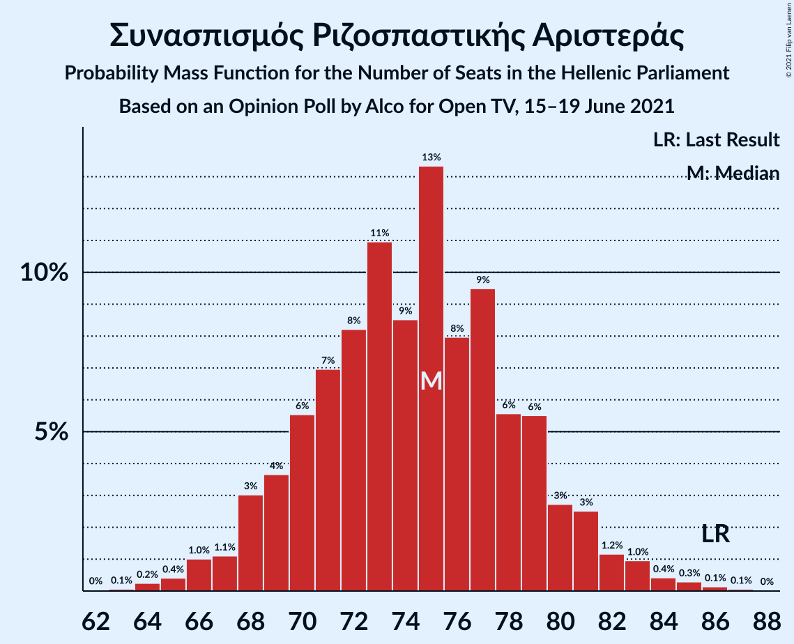
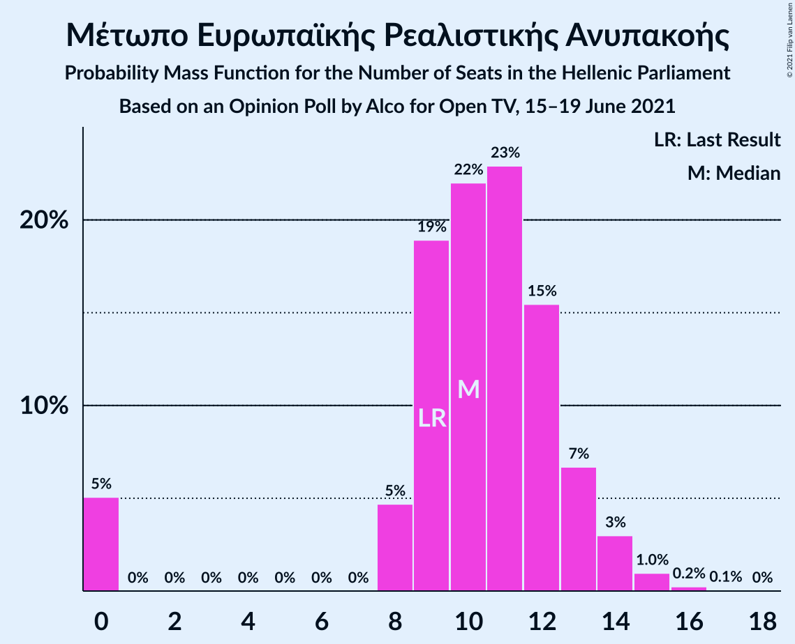
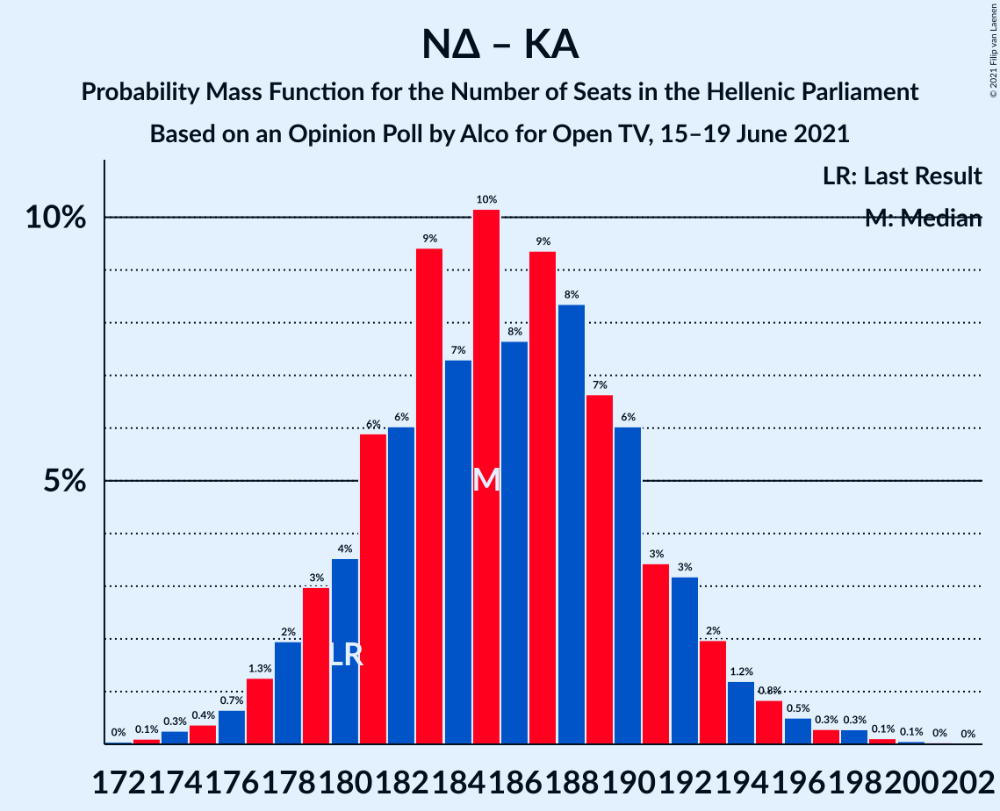

# Opinion Poll by Alco for Open TV, 15–19 June 2021

<a href="#voting-intentions">Voting Intentions</a> | <a href="#seats">Seats</a> | <a href="#coalitions">Coalitions</a> | <a href="#technical-information">Technical Information</a>

## Voting Intentions

### Confidence Intervals

| Party | Last Result | Poll Result | 80% Confidence Interval | 90% Confidence Interval | 95% Confidence Interval | 99% Confidence Interval |
|:-----:|:-----------:|:-----------:|:-----------------------:|:-----------------------:|:-----------------------:|:-----------------------:|
| Νέα Δημοκρατία | 39.8% | 43.2% | 41.2–45.2% |40.6–45.8% |40.2–46.3% |39.2–47.3% |
| Συνασπισμός Ριζοσπαστικής Αριστεράς | 31.5% | 28.1% | 26.3–30.0% |25.8–30.5% |25.4–31.0% |24.6–31.9% |
| Κίνημα Αλλαγής | 8.1% | 8.0% | 7.0–9.2% |6.7–9.6% |6.5–9.9% |6.0–10.5% |
| Κομμουνιστικό Κόμμα Ελλάδας | 5.3% | 6.4% | 5.5–7.5% |5.3–7.8% |5.0–8.1% |4.6–8.7% |
| Ελληνική Λύση | 3.7% | 4.7% | 3.9–5.7% |3.7–6.0% |3.6–6.2% |3.2–6.7% |
| Μέτωπο Ευρωπαϊκής Ρεαλιστικής Ανυπακοής | 3.4% | 3.9% | 3.2–4.8% |3.0–5.1% |2.9–5.3% |2.6–5.8% |
| Πλεύση Ελευθερίας | 1.5% | 1.8% | 1.4–2.5% |1.2–2.7% |1.1–2.8% |1.0–3.2% |

*Note:* The poll result column reflects the actual value used in the calculations. Published results may vary slightly, and in addition be rounded to fewer digits.

## Seats

### Confidence Intervals

| Party | Last Result | Median | 80% Confidence Interval | 90% Confidence Interval | 95% Confidence Interval | 99% Confidence Interval |
|:-----:|:-----------:|:------:|:-----------------------:|:-----------------------:|:-----------------------:|:-----------------------:|
| <a href="#νέα-δημοκρατία">Νέα Δημοκρατία</a> | 158 | 164 | 159–170 |158–171 |156–173 |154–176 |
| <a href="#συνασπισμός-ριζοσπαστικής-αριστεράς">Συνασπισμός Ριζοσπαστικής Αριστεράς</a> | 86 | 75 | 70–79 |68–81 |67–82 |65–85 |
| <a href="#κίνημα-αλλαγής">Κίνημα Αλλαγής</a> | 22 | 21 | 19–24 |18–25 |17–26 |16–28 |
| <a href="#κομμουνιστικό-κόμμα-ελλάδας">Κομμουνιστικό Κόμμα Ελλάδας</a> | 15 | 17 | 15–20 |14–21 |13–21 |12–23 |
| <a href="#ελληνική-λύση">Ελληνική Λύση</a> | 10 | 13 | 10–15 |10–16 |9–16 |8–18 |
| <a href="#μέτωπο-ευρωπαϊκής-ρεαλιστικής-ανυπακοής">Μέτωπο Ευρωπαϊκής Ρεαλιστικής Ανυπακοής</a> | 9 | 10 | 9–13 |0–13 |0–14 |0–15 |
| <a href="#πλεύση-ελευθερίας">Πλεύση Ελευθερίας</a> | 0 | 0 | 0 |0 |0 |0–8 |

### Νέα Δημοκρατία

*For a full overview of the results for this party, see the [Νέα Δημοκρατία](party-νέαδημοκρατία.html) page.*

| Number of Seats | Probability | Accumulated | Special Marks |
|:---------------:|:-----------:|:-----------:|:-------------:|
| 151 | 0.1% | 100% | Majority |
| 152 | 0.1% | 99.9% |  |
| 153 | 0.3% | 99.8% |  |
| 154 | 0.5% | 99.5% |  |
| 155 | 0.8% | 99.1% |  |
| 156 | 1.4% | 98% |  |
| 157 | 2% | 97% |  |
| 158 | 4% | 95% | Last Result |
| 159 | 4% | 91% |  |
| 160 | 6% | 87% |  |
| 161 | 8% | 81% |  |
| 162 | 7% | 73% |  |
| 163 | 9% | 66% |  |
| 164 | 9% | 57% | Median |
| 165 | 10% | 48% |  |
| 166 | 10% | 38% |  |
| 167 | 7% | 28% |  |
| 168 | 7% | 22% |  |
| 169 | 4% | 15% |  |
| 170 | 3% | 10% |  |
| 171 | 3% | 7% |  |
| 172 | 1.5% | 4% |  |
| 173 | 1.1% | 3% |  |
| 174 | 0.8% | 2% |  |
| 175 | 0.4% | 0.9% |  |
| 176 | 0.2% | 0.5% |  |
| 177 | 0.2% | 0.3% |  |
| 178 | 0.1% | 0.1% |  |
| 179 | 0% | 0.1% |  |
| 180 | 0% | 0% |  |

### Συνασπισμός Ριζοσπαστικής Αριστεράς

*For a full overview of the results for this party, see the [Συνασπισμός Ριζοσπαστικής Αριστεράς](party-συνασπισμόςριζοσπαστικήςαριστεράς.html) page.*

| Number of Seats | Probability | Accumulated | Special Marks |
|:---------------:|:-----------:|:-----------:|:-------------:|
| 62 | 0% | 100% |  |
| 63 | 0.1% | 99.9% |  |
| 64 | 0.2% | 99.9% |  |
| 65 | 0.4% | 99.6% |  |
| 66 | 1.0% | 99.2% |  |
| 67 | 1.1% | 98% |  |
| 68 | 3% | 97% |  |
| 69 | 4% | 94% |  |
| 70 | 6% | 90% |  |
| 71 | 7% | 85% |  |
| 72 | 8% | 78% |  |
| 73 | 11% | 70% |  |
| 74 | 9% | 59% |  |
| 75 | 13% | 50% | Median |
| 76 | 8% | 37% |  |
| 77 | 9% | 29% |  |
| 78 | 6% | 19% |  |
| 79 | 6% | 14% |  |
| 80 | 3% | 8% |  |
| 81 | 3% | 6% |  |
| 82 | 1.2% | 3% |  |
| 83 | 1.0% | 2% |  |
| 84 | 0.4% | 1.0% |  |
| 85 | 0.3% | 0.5% |  |
| 86 | 0.1% | 0.2% | Last Result |
| 87 | 0.1% | 0.1% |  |
| 88 | 0% | 0% |  |

### Κίνημα Αλλαγής

*For a full overview of the results for this party, see the [Κίνημα Αλλαγής](party-κίνημααλλαγής.html) page.*

| Number of Seats | Probability | Accumulated | Special Marks |
|:---------------:|:-----------:|:-----------:|:-------------:|
| 15 | 0.2% | 100% |  |
| 16 | 0.8% | 99.7% |  |
| 17 | 3% | 98.9% |  |
| 18 | 6% | 96% |  |
| 19 | 11% | 90% |  |
| 20 | 16% | 79% |  |
| 21 | 18% | 64% | Median |
| 22 | 15% | 46% | Last Result |
| 23 | 13% | 31% |  |
| 24 | 9% | 18% |  |
| 25 | 5% | 9% |  |
| 26 | 3% | 4% |  |
| 27 | 1.0% | 2% |  |
| 28 | 0.4% | 0.6% |  |
| 29 | 0.1% | 0.2% |  |
| 30 | 0% | 0.1% |  |
| 31 | 0% | 0% |  |

### Κομμουνιστικό Κόμμα Ελλάδας

*For a full overview of the results for this party, see the [Κομμουνιστικό Κόμμα Ελλάδας](party-κομμουνιστικόκόμμαελλάδας.html) page.*

| Number of Seats | Probability | Accumulated | Special Marks |
|:---------------:|:-----------:|:-----------:|:-------------:|
| 11 | 0.1% | 100% |  |
| 12 | 0.6% | 99.9% |  |
| 13 | 2% | 99.3% |  |
| 14 | 6% | 97% |  |
| 15 | 12% | 91% | Last Result |
| 16 | 18% | 78% |  |
| 17 | 19% | 60% | Median |
| 18 | 17% | 42% |  |
| 19 | 12% | 25% |  |
| 20 | 7% | 13% |  |
| 21 | 4% | 6% |  |
| 22 | 2% | 2% |  |
| 23 | 0.5% | 0.7% |  |
| 24 | 0.2% | 0.2% |  |
| 25 | 0% | 0.1% |  |
| 26 | 0% | 0% |  |

### Ελληνική Λύση

*For a full overview of the results for this party, see the [Ελληνική Λύση](party-ελληνικήλύση.html) page.*

| Number of Seats | Probability | Accumulated | Special Marks |
|:---------------:|:-----------:|:-----------:|:-------------:|
| 0 | 0.1% | 100% |  |
| 1 | 0% | 99.9% |  |
| 2 | 0% | 99.9% |  |
| 3 | 0% | 99.9% |  |
| 4 | 0% | 99.9% |  |
| 5 | 0% | 99.9% |  |
| 6 | 0% | 99.9% |  |
| 7 | 0% | 99.9% |  |
| 8 | 0.4% | 99.9% |  |
| 9 | 3% | 99.5% |  |
| 10 | 8% | 97% | Last Result |
| 11 | 14% | 89% |  |
| 12 | 24% | 75% |  |
| 13 | 21% | 51% | Median |
| 14 | 15% | 30% |  |
| 15 | 9% | 15% |  |
| 16 | 4% | 6% |  |
| 17 | 2% | 2% |  |
| 18 | 0.5% | 0.6% |  |
| 19 | 0.1% | 0.2% |  |
| 20 | 0% | 0% |  |

### Μέτωπο Ευρωπαϊκής Ρεαλιστικής Ανυπακοής

*For a full overview of the results for this party, see the [Μέτωπο Ευρωπαϊκής Ρεαλιστικής Ανυπακοής](party-μέτωποευρωπαϊκήςρεαλιστικήςανυπακοής.html) page.*

| Number of Seats | Probability | Accumulated | Special Marks |
|:---------------:|:-----------:|:-----------:|:-------------:|
| 0 | 5% | 100% |  |
| 1 | 0% | 95% |  |
| 2 | 0% | 95% |  |
| 3 | 0% | 95% |  |
| 4 | 0% | 95% |  |
| 5 | 0% | 95% |  |
| 6 | 0% | 95% |  |
| 7 | 0% | 95% |  |
| 8 | 5% | 95% |  |
| 9 | 19% | 90% | Last Result |
| 10 | 22% | 71% | Median |
| 11 | 23% | 49% |  |
| 12 | 15% | 26% |  |
| 13 | 7% | 11% |  |
| 14 | 3% | 4% |  |
| 15 | 1.0% | 1.3% |  |
| 16 | 0.2% | 0.3% |  |
| 17 | 0.1% | 0.1% |  |
| 18 | 0% | 0% |  |

### Πλεύση Ελευθερίας

*For a full overview of the results for this party, see the [Πλεύση Ελευθερίας](party-πλεύσηελευθερίας.html) page.*

| Number of Seats | Probability | Accumulated | Special Marks |
|:---------------:|:-----------:|:-----------:|:-------------:|
| 0 | 98.9% | 100% | Last Result, Median |
| 1 | 0% | 1.1% |  |
| 2 | 0% | 1.1% |  |
| 3 | 0% | 1.1% |  |
| 4 | 0% | 1.1% |  |
| 5 | 0% | 1.1% |  |
| 6 | 0% | 1.1% |  |
| 7 | 0% | 1.1% |  |
| 8 | 0.7% | 1.1% |  |
| 9 | 0.3% | 0.3% |  |
| 10 | 0% | 0% |  |

## Coalitions

### Confidence Intervals

| Coalition | Last Result | Median | Majority? | 80% Confidence Interval | 90% Confidence Interval | 95% Confidence Interval | 99% Confidence Interval |
|:---------:|:-----------:|:------:|:---------:|:-----------------------:|:-----------------------:|:-----------------------:|:-----------------------:|
| Νέα Δημοκρατία – Κίνημα Αλλαγής | 180 | 185 | 100% | 180–191 | 179–193 | 177–194 | 175–198 |
| Νέα Δημοκρατία | 158 | 164 | 100% | 159–170 | 158–171 | 156–173 | 154–176 |
| Συνασπισμός Ριζοσπαστικής Αριστεράς – Μέτωπο Ευρωπαϊκής Ρεαλιστικής Ανυπακοής | 95 | 85 | 0% | 79–90 | 78–91 | 76–92 | 72–95 |
| Συνασπισμός Ριζοσπαστικής Αριστεράς | 86 | 75 | 0% | 70–79 | 68–81 | 67–82 | 65–85 |

### Νέα Δημοκρατία – Κίνημα Αλλαγής

| Number of Seats | Probability | Accumulated | Special Marks |
|:---------------:|:-----------:|:-----------:|:-------------:|
| 172 | 0% | 100% |  |
| 173 | 0.1% | 99.9% |  |
| 174 | 0.3% | 99.8% |  |
| 175 | 0.4% | 99.6% |  |
| 176 | 0.7% | 99.2% |  |
| 177 | 1.3% | 98.5% |  |
| 178 | 2% | 97% |  |
| 179 | 3% | 95% |  |
| 180 | 4% | 92% | Last Result |
| 181 | 6% | 89% |  |
| 182 | 6% | 83% |  |
| 183 | 9% | 77% |  |
| 184 | 7% | 67% |  |
| 185 | 10% | 60% | Median |
| 186 | 8% | 50% |  |
| 187 | 9% | 42% |  |
| 188 | 8% | 33% |  |
| 189 | 7% | 25% |  |
| 190 | 6% | 18% |  |
| 191 | 3% | 12% |  |
| 192 | 3% | 9% |  |
| 193 | 2% | 5% |  |
| 194 | 1.2% | 3% |  |
| 195 | 0.8% | 2% |  |
| 196 | 0.5% | 1.3% |  |
| 197 | 0.3% | 0.8% |  |
| 198 | 0.3% | 0.5% |  |
| 199 | 0.1% | 0.2% |  |
| 200 | 0.1% | 0.1% |  |
| 201 | 0% | 0.1% |  |
| 202 | 0% | 0% |  |

### Νέα Δημοκρατία

| Number of Seats | Probability | Accumulated | Special Marks |
|:---------------:|:-----------:|:-----------:|:-------------:|
| 151 | 0.1% | 100% | Majority |
| 152 | 0.1% | 99.9% |  |
| 153 | 0.3% | 99.8% |  |
| 154 | 0.5% | 99.5% |  |
| 155 | 0.8% | 99.1% |  |
| 156 | 1.4% | 98% |  |
| 157 | 2% | 97% |  |
| 158 | 4% | 95% | Last Result |
| 159 | 4% | 91% |  |
| 160 | 6% | 87% |  |
| 161 | 8% | 81% |  |
| 162 | 7% | 73% |  |
| 163 | 9% | 66% |  |
| 164 | 9% | 57% | Median |
| 165 | 10% | 48% |  |
| 166 | 10% | 38% |  |
| 167 | 7% | 28% |  |
| 168 | 7% | 22% |  |
| 169 | 4% | 15% |  |
| 170 | 3% | 10% |  |
| 171 | 3% | 7% |  |
| 172 | 1.5% | 4% |  |
| 173 | 1.1% | 3% |  |
| 174 | 0.8% | 2% |  |
| 175 | 0.4% | 0.9% |  |
| 176 | 0.2% | 0.5% |  |
| 177 | 0.2% | 0.3% |  |
| 178 | 0.1% | 0.1% |  |
| 179 | 0% | 0.1% |  |
| 180 | 0% | 0% |  |

### Συνασπισμός Ριζοσπαστικής Αριστεράς – Μέτωπο Ευρωπαϊκής Ρεαλιστικής Ανυπακοής

| Number of Seats | Probability | Accumulated | Special Marks |
|:---------------:|:-----------:|:-----------:|:-------------:|
| 69 | 0% | 100% |  |
| 70 | 0.1% | 99.9% |  |
| 71 | 0.1% | 99.8% |  |
| 72 | 0.3% | 99.7% |  |
| 73 | 0.3% | 99.4% |  |
| 74 | 0.5% | 99.2% |  |
| 75 | 0.7% | 98.7% |  |
| 76 | 1.4% | 98% |  |
| 77 | 1.4% | 97% |  |
| 78 | 3% | 95% |  |
| 79 | 4% | 93% |  |
| 80 | 5% | 89% |  |
| 81 | 6% | 84% |  |
| 82 | 8% | 78% |  |
| 83 | 9% | 71% |  |
| 84 | 9% | 62% |  |
| 85 | 11% | 52% | Median |
| 86 | 11% | 41% |  |
| 87 | 7% | 30% |  |
| 88 | 6% | 24% |  |
| 89 | 6% | 17% |  |
| 90 | 4% | 11% |  |
| 91 | 3% | 7% |  |
| 92 | 2% | 4% |  |
| 93 | 1.0% | 2% |  |
| 94 | 0.7% | 1.4% |  |
| 95 | 0.3% | 0.7% | Last Result |
| 96 | 0.2% | 0.3% |  |
| 97 | 0.1% | 0.2% |  |
| 98 | 0% | 0.1% |  |
| 99 | 0% | 0% |  |

### Συνασπισμός Ριζοσπαστικής Αριστεράς

| Number of Seats | Probability | Accumulated | Special Marks |
|:---------------:|:-----------:|:-----------:|:-------------:|
| 62 | 0% | 100% |  |
| 63 | 0.1% | 99.9% |  |
| 64 | 0.2% | 99.9% |  |
| 65 | 0.4% | 99.6% |  |
| 66 | 1.0% | 99.2% |  |
| 67 | 1.1% | 98% |  |
| 68 | 3% | 97% |  |
| 69 | 4% | 94% |  |
| 70 | 6% | 90% |  |
| 71 | 7% | 85% |  |
| 72 | 8% | 78% |  |
| 73 | 11% | 70% |  |
| 74 | 9% | 59% |  |
| 75 | 13% | 50% | Median |
| 76 | 8% | 37% |  |
| 77 | 9% | 29% |  |
| 78 | 6% | 19% |  |
| 79 | 6% | 14% |  |
| 80 | 3% | 8% |  |
| 81 | 3% | 6% |  |
| 82 | 1.2% | 3% |  |
| 83 | 1.0% | 2% |  |
| 84 | 0.4% | 1.0% |  |
| 85 | 0.3% | 0.5% |  |
| 86 | 0.1% | 0.2% | Last Result |
| 87 | 0.1% | 0.1% |  |
| 88 | 0% | 0% |  |

## Technical Information

### Opinion Poll

+ **Polling firm:** Alco
+ **Commissioner(s):** Open TV
+ **Fieldwork period:** 15–19 June 2021

### Calculations

+ **Sample size:** 1000
+ **Simulations done:** 1,048,576
+ **Error estimate:** 0.59%

