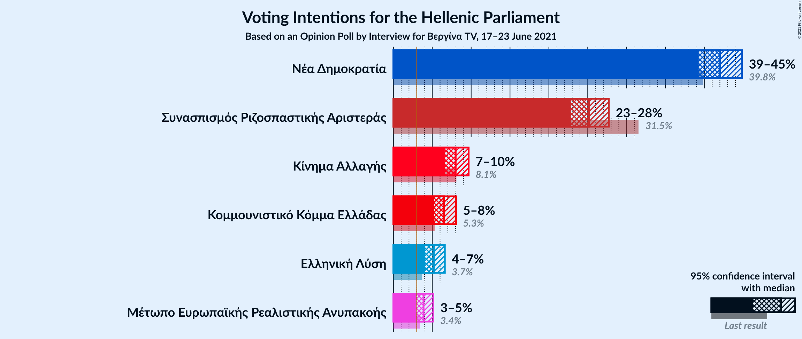
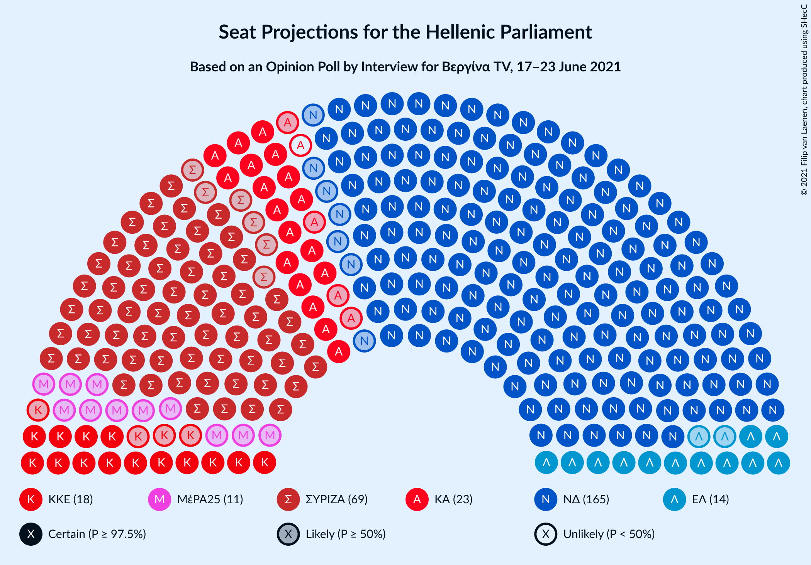
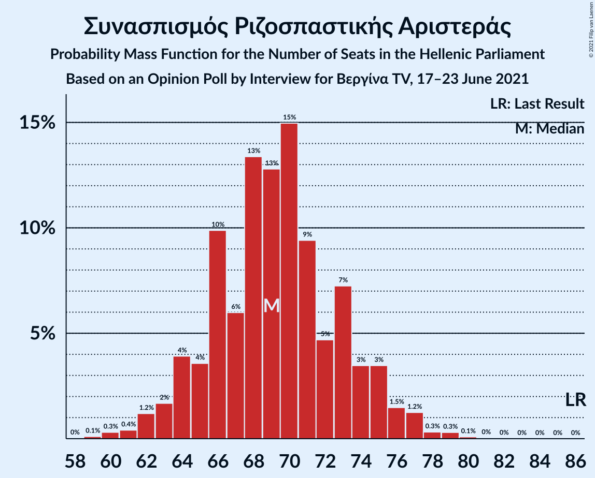
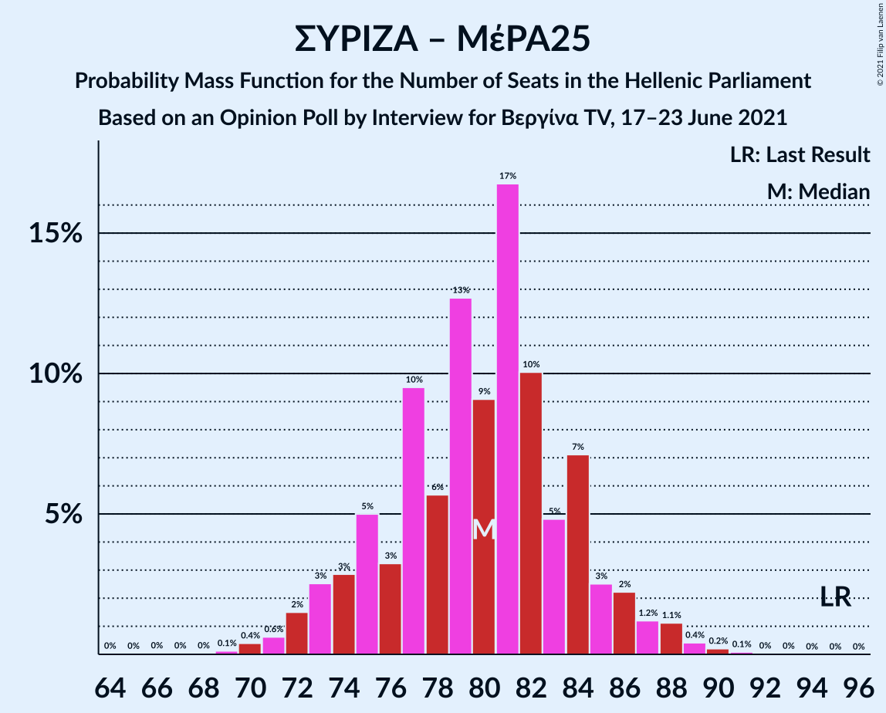
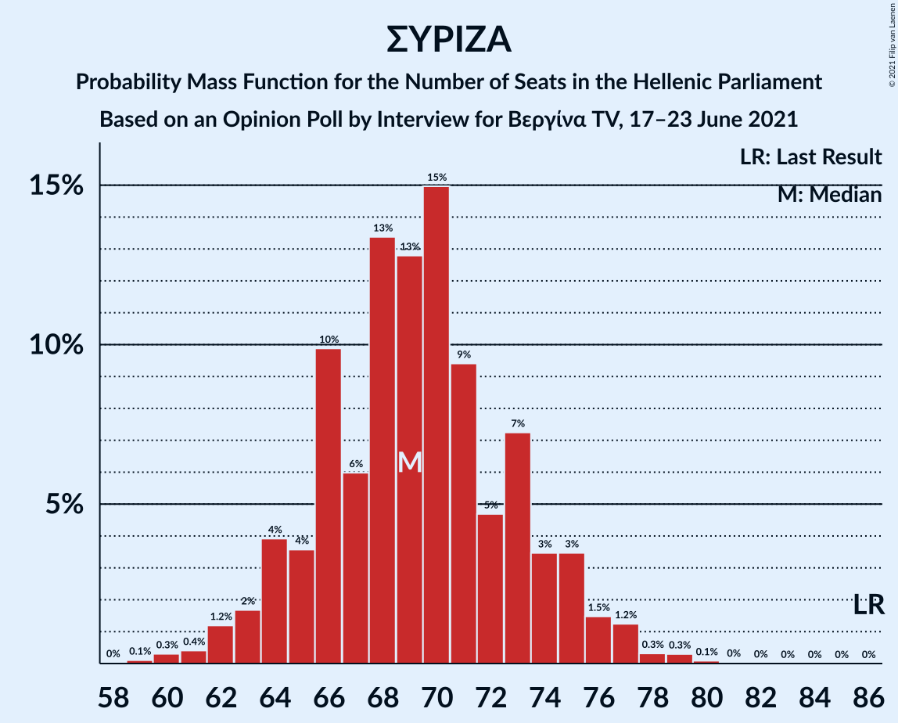

# Opinion Poll by Interview for Βεργίνα TV, 17–23 June 2021

<a href="#voting-intentions">Voting Intentions</a> | <a href="#seats">Seats</a> | <a href="#coalitions">Coalitions</a> | <a href="#technical-information">Technical Information</a>

## Voting Intentions

### Confidence Intervals

| Party | Last Result | Poll Result | 80% Confidence Interval | 90% Confidence Interval | 95% Confidence Interval | 99% Confidence Interval |
|:-----:|:-----------:|:-----------:|:-----------------------:|:-----------------------:|:-----------------------:|:-----------------------:|
| Νέα Δημοκρατία | 39.8% | 42.0% | 40.1–43.9% |39.6–44.5% |39.1–44.9% |38.2–45.9% |
| Συνασπισμός Ριζοσπαστικής Αριστεράς | 31.5% | 25.2% | 23.5–26.9% |23.1–27.4% |22.7–27.8% |21.9–28.7% |
| Κίνημα Αλλαγής | 8.1% | 8.0% | 7.0–9.1% |6.8–9.5% |6.5–9.8% |6.1–10.3% |
| Κομμουνιστικό Κόμμα Ελλάδας | 5.3% | 6.5% | 5.7–7.6% |5.4–7.9% |5.2–8.2% |4.8–8.7% |
| Ελληνική Λύση | 3.7% | 5.2% | 4.4–6.1% |4.2–6.4% |4.0–6.7% |3.7–7.1% |
| Μέτωπο Ευρωπαϊκής Ρεαλιστικής Ανυπακοής | 3.4% | 3.9% | 3.2–4.8% |3.1–5.0% |2.9–5.2% |2.6–5.7% |

*Note:* The poll result column reflects the actual value used in the calculations. Published results may vary slightly, and in addition be rounded to fewer digits.

## Seats

### Confidence Intervals

| Party | Last Result | Median | 80% Confidence Interval | 90% Confidence Interval | 95% Confidence Interval | 99% Confidence Interval |
|:-----:|:-----------:|:------:|:-----------------------:|:-----------------------:|:-----------------------:|:-----------------------:|
| <a href="#νέα-δημοκρατία">Νέα Δημοκρατία</a> | 158 | 165 | 160–171 |159–172 |158–173 |155–176 |
| <a href="#συνασπισμός-ριζοσπαστικής-αριστεράς">Συνασπισμός Ριζοσπαστικής Αριστεράς</a> | 86 | 69 | 64–74 |63–75 |62–77 |60–79 |
| <a href="#κίνημα-αλλαγής">Κίνημα Αλλαγής</a> | 22 | 22 | 19–25 |18–26 |18–27 |17–29 |
| <a href="#κομμουνιστικό-κόμμα-ελλάδας">Κομμουνιστικό Κόμμα Ελλάδας</a> | 15 | 18 | 16–21 |15–22 |14–22 |13–24 |
| <a href="#ελληνική-λύση">Ελληνική Λύση</a> | 10 | 14 | 12–17 |11–17 |11–18 |10–20 |
| <a href="#μέτωπο-ευρωπαϊκής-ρεαλιστικής-ανυπακοής">Μέτωπο Ευρωπαϊκής Ρεαλιστικής Ανυπακοής</a> | 9 | 11 | 9–13 |0–14 |0–14 |0–16 |

### Νέα Δημοκρατία

*For a full overview of the results for this party, see the [Νέα Δημοκρατία](party-νέαδημοκρατία.html) page.*

| Number of Seats | Probability | Accumulated | Special Marks |
|:---------------:|:-----------:|:-----------:|:-------------:|
| 152 | 0.1% | 100% |  |
| 153 | 0.1% | 99.9% |  |
| 154 | 0.2% | 99.8% |  |
| 155 | 0.4% | 99.6% |  |
| 156 | 0.6% | 99.3% |  |
| 157 | 1.0% | 98.7% |  |
| 158 | 2% | 98% | Last Result |
| 159 | 4% | 96% |  |
| 160 | 3% | 92% |  |
| 161 | 9% | 89% |  |
| 162 | 4% | 80% |  |
| 163 | 11% | 76% |  |
| 164 | 5% | 66% |  |
| 165 | 13% | 61% | Median |
| 166 | 6% | 48% |  |
| 167 | 12% | 42% |  |
| 168 | 6% | 30% |  |
| 169 | 9% | 24% |  |
| 170 | 4% | 14% |  |
| 171 | 4% | 11% |  |
| 172 | 3% | 6% |  |
| 173 | 1.5% | 4% |  |
| 174 | 1.2% | 2% |  |
| 175 | 0.5% | 1.0% |  |
| 176 | 0.3% | 0.6% |  |
| 177 | 0.1% | 0.3% |  |
| 178 | 0.1% | 0.1% |  |
| 179 | 0% | 0.1% |  |
| 180 | 0% | 0% |  |

### Συνασπισμός Ριζοσπαστικής Αριστεράς

*For a full overview of the results for this party, see the [Συνασπισμός Ριζοσπαστικής Αριστεράς](party-συνασπισμόςριζοσπαστικήςαριστεράς.html) page.*

| Number of Seats | Probability | Accumulated | Special Marks |
|:---------------:|:-----------:|:-----------:|:-------------:|
| 58 | 0.1% | 100% |  |
| 59 | 0.1% | 99.9% |  |
| 60 | 0.4% | 99.8% |  |
| 61 | 1.0% | 99.5% |  |
| 62 | 2% | 98.5% |  |
| 63 | 2% | 97% |  |
| 64 | 5% | 94% |  |
| 65 | 6% | 90% |  |
| 66 | 9% | 83% |  |
| 67 | 9% | 74% |  |
| 68 | 7% | 66% |  |
| 69 | 9% | 59% | Median |
| 70 | 10% | 50% |  |
| 71 | 10% | 40% |  |
| 72 | 12% | 30% |  |
| 73 | 6% | 18% |  |
| 74 | 5% | 12% |  |
| 75 | 3% | 7% |  |
| 76 | 2% | 5% |  |
| 77 | 1.4% | 3% |  |
| 78 | 0.5% | 1.2% |  |
| 79 | 0.4% | 0.7% |  |
| 80 | 0.2% | 0.3% |  |
| 81 | 0.1% | 0.2% |  |
| 82 | 0.1% | 0.1% |  |
| 83 | 0% | 0% |  |
| 84 | 0% | 0% |  |
| 85 | 0% | 0% |  |
| 86 | 0% | 0% | Last Result |

### Κίνημα Αλλαγής

*For a full overview of the results for this party, see the [Κίνημα Αλλαγής](party-κίνημααλλαγής.html) page.*

| Number of Seats | Probability | Accumulated | Special Marks |
|:---------------:|:-----------:|:-----------:|:-------------:|
| 16 | 0.2% | 100% |  |
| 17 | 2% | 99.7% |  |
| 18 | 3% | 98% |  |
| 19 | 7% | 95% |  |
| 20 | 10% | 88% |  |
| 21 | 18% | 78% |  |
| 22 | 17% | 60% | Last Result, Median |
| 23 | 16% | 44% |  |
| 24 | 13% | 28% |  |
| 25 | 9% | 15% |  |
| 26 | 3% | 6% |  |
| 27 | 1.1% | 3% |  |
| 28 | 1.1% | 2% |  |
| 29 | 0.4% | 0.6% |  |
| 30 | 0.1% | 0.1% |  |
| 31 | 0% | 0% |  |

### Κομμουνιστικό Κόμμα Ελλάδας

*For a full overview of the results for this party, see the [Κομμουνιστικό Κόμμα Ελλάδας](party-κομμουνιστικόκόμμαελλάδας.html) page.*

| Number of Seats | Probability | Accumulated | Special Marks |
|:---------------:|:-----------:|:-----------:|:-------------:|
| 12 | 0.1% | 100% |  |
| 13 | 0.6% | 99.9% |  |
| 14 | 2% | 99.3% |  |
| 15 | 7% | 97% | Last Result |
| 16 | 11% | 90% |  |
| 17 | 17% | 79% |  |
| 18 | 18% | 62% | Median |
| 19 | 17% | 44% |  |
| 20 | 13% | 27% |  |
| 21 | 7% | 14% |  |
| 22 | 5% | 7% |  |
| 23 | 1.2% | 2% |  |
| 24 | 0.7% | 0.9% |  |
| 25 | 0.2% | 0.2% |  |
| 26 | 0.1% | 0.1% |  |
| 27 | 0% | 0% |  |

### Ελληνική Λύση

*For a full overview of the results for this party, see the [Ελληνική Λύση](party-ελληνικήλύση.html) page.*

| Number of Seats | Probability | Accumulated | Special Marks |
|:---------------:|:-----------:|:-----------:|:-------------:|
| 9 | 0.1% | 100% |  |
| 10 | 1.2% | 99.9% | Last Result |
| 11 | 5% | 98.6% |  |
| 12 | 5% | 94% |  |
| 13 | 25% | 89% |  |
| 14 | 25% | 64% | Median |
| 15 | 6% | 38% |  |
| 16 | 15% | 32% |  |
| 17 | 13% | 17% |  |
| 18 | 3% | 5% |  |
| 19 | 1.2% | 2% |  |
| 20 | 0.5% | 0.7% |  |
| 21 | 0.1% | 0.1% |  |
| 22 | 0% | 0% |  |

### Μέτωπο Ευρωπαϊκής Ρεαλιστικής Ανυπακοής

*For a full overview of the results for this party, see the [Μέτωπο Ευρωπαϊκής Ρεαλιστικής Ανυπακοής](party-μέτωποευρωπαϊκήςρεαλιστικήςανυπακοής.html) page.*

| Number of Seats | Probability | Accumulated | Special Marks |
|:---------------:|:-----------:|:-----------:|:-------------:|
| 0 | 5% | 100% |  |
| 1 | 0% | 95% |  |
| 2 | 0% | 95% |  |
| 3 | 0% | 95% |  |
| 4 | 0% | 95% |  |
| 5 | 0% | 95% |  |
| 6 | 0% | 95% |  |
| 7 | 0% | 95% |  |
| 8 | 0.8% | 95% |  |
| 9 | 11% | 94% | Last Result |
| 10 | 24% | 83% |  |
| 11 | 23% | 59% | Median |
| 12 | 17% | 35% |  |
| 13 | 12% | 18% |  |
| 14 | 5% | 6% |  |
| 15 | 0.8% | 1.5% |  |
| 16 | 0.5% | 0.6% |  |
| 17 | 0.2% | 0.2% |  |
| 18 | 0% | 0% |  |

## Coalitions

### Confidence Intervals

| Coalition | Last Result | Median | Majority? | 80% Confidence Interval | 90% Confidence Interval | 95% Confidence Interval | 99% Confidence Interval |
|:---------:|:-----------:|:------:|:---------:|:-----------------------:|:-----------------------:|:-----------------------:|:-----------------------:|
| Νέα Δημοκρατία – Κίνημα Αλλαγής | 180 | 188 | 100% | 182–193 | 181–195 | 179–195 | 177–198 |
| Νέα Δημοκρατία | 158 | 165 | 100% | 160–171 | 159–172 | 158–173 | 155–176 |
| Συνασπισμός Ριζοσπαστικής Αριστεράς – Μέτωπο Ευρωπαϊκής Ρεαλιστικής Ανυπακοής | 95 | 80 | 0% | 75–85 | 73–86 | 72–87 | 69–90 |
| Συνασπισμός Ριζοσπαστικής Αριστεράς | 86 | 69 | 0% | 64–74 | 63–75 | 62–77 | 60–79 |

### Νέα Δημοκρατία – Κίνημα Αλλαγής

| Number of Seats | Probability | Accumulated | Special Marks |
|:---------------:|:-----------:|:-----------:|:-------------:|
| 174 | 0% | 100% |  |
| 175 | 0% | 99.9% |  |
| 176 | 0.3% | 99.9% |  |
| 177 | 0.3% | 99.6% |  |
| 178 | 0.4% | 99.3% |  |
| 179 | 2% | 98.9% |  |
| 180 | 1.2% | 97% | Last Result |
| 181 | 3% | 96% |  |
| 182 | 7% | 93% |  |
| 183 | 2% | 86% |  |
| 184 | 7% | 84% |  |
| 185 | 10% | 77% |  |
| 186 | 7% | 67% |  |
| 187 | 10% | 60% | Median |
| 188 | 9% | 51% |  |
| 189 | 10% | 42% |  |
| 190 | 9% | 32% |  |
| 191 | 5% | 23% |  |
| 192 | 7% | 18% |  |
| 193 | 4% | 12% |  |
| 194 | 2% | 8% |  |
| 195 | 3% | 6% |  |
| 196 | 1.0% | 2% |  |
| 197 | 0.5% | 1.5% |  |
| 198 | 0.7% | 1.0% |  |
| 199 | 0.1% | 0.3% |  |
| 200 | 0.1% | 0.2% |  |
| 201 | 0.1% | 0.1% |  |
| 202 | 0% | 0.1% |  |
| 203 | 0% | 0% |  |

### Νέα Δημοκρατία

| Number of Seats | Probability | Accumulated | Special Marks |
|:---------------:|:-----------:|:-----------:|:-------------:|
| 152 | 0.1% | 100% |  |
| 153 | 0.1% | 99.9% |  |
| 154 | 0.2% | 99.8% |  |
| 155 | 0.4% | 99.6% |  |
| 156 | 0.6% | 99.3% |  |
| 157 | 1.0% | 98.7% |  |
| 158 | 2% | 98% | Last Result |
| 159 | 4% | 96% |  |
| 160 | 3% | 92% |  |
| 161 | 9% | 89% |  |
| 162 | 4% | 80% |  |
| 163 | 11% | 76% |  |
| 164 | 5% | 66% |  |
| 165 | 13% | 61% | Median |
| 166 | 6% | 48% |  |
| 167 | 12% | 42% |  |
| 168 | 6% | 30% |  |
| 169 | 9% | 24% |  |
| 170 | 4% | 14% |  |
| 171 | 4% | 11% |  |
| 172 | 3% | 6% |  |
| 173 | 1.5% | 4% |  |
| 174 | 1.2% | 2% |  |
| 175 | 0.5% | 1.0% |  |
| 176 | 0.3% | 0.6% |  |
| 177 | 0.1% | 0.3% |  |
| 178 | 0.1% | 0.1% |  |
| 179 | 0% | 0.1% |  |
| 180 | 0% | 0% |  |

### Συνασπισμός Ριζοσπαστικής Αριστεράς – Μέτωπο Ευρωπαϊκής Ρεαλιστικής Ανυπακοής

| Number of Seats | Probability | Accumulated | Special Marks |
|:---------------:|:-----------:|:-----------:|:-------------:|
| 65 | 0.1% | 100% |  |
| 66 | 0% | 99.9% |  |
| 67 | 0.1% | 99.9% |  |
| 68 | 0.1% | 99.8% |  |
| 69 | 0.2% | 99.7% |  |
| 70 | 0.5% | 99.4% |  |
| 71 | 1.2% | 98.9% |  |
| 72 | 2% | 98% |  |
| 73 | 3% | 96% |  |
| 74 | 3% | 93% |  |
| 75 | 5% | 91% |  |
| 76 | 7% | 86% |  |
| 77 | 8% | 79% |  |
| 78 | 8% | 71% |  |
| 79 | 7% | 63% |  |
| 80 | 11% | 55% | Median |
| 81 | 11% | 44% |  |
| 82 | 6% | 33% |  |
| 83 | 8% | 27% |  |
| 84 | 7% | 20% |  |
| 85 | 5% | 13% |  |
| 86 | 3% | 7% |  |
| 87 | 2% | 4% |  |
| 88 | 0.9% | 2% |  |
| 89 | 0.7% | 1.4% |  |
| 90 | 0.4% | 0.7% |  |
| 91 | 0.2% | 0.3% |  |
| 92 | 0.1% | 0.1% |  |
| 93 | 0% | 0% |  |
| 94 | 0% | 0% |  |
| 95 | 0% | 0% | Last Result |

### Συνασπισμός Ριζοσπαστικής Αριστεράς

| Number of Seats | Probability | Accumulated | Special Marks |
|:---------------:|:-----------:|:-----------:|:-------------:|
| 58 | 0.1% | 100% |  |
| 59 | 0.1% | 99.9% |  |
| 60 | 0.4% | 99.8% |  |
| 61 | 1.0% | 99.5% |  |
| 62 | 2% | 98.5% |  |
| 63 | 2% | 97% |  |
| 64 | 5% | 94% |  |
| 65 | 6% | 90% |  |
| 66 | 9% | 83% |  |
| 67 | 9% | 74% |  |
| 68 | 7% | 66% |  |
| 69 | 9% | 59% | Median |
| 70 | 10% | 50% |  |
| 71 | 10% | 40% |  |
| 72 | 12% | 30% |  |
| 73 | 6% | 18% |  |
| 74 | 5% | 12% |  |
| 75 | 3% | 7% |  |
| 76 | 2% | 5% |  |
| 77 | 1.4% | 3% |  |
| 78 | 0.5% | 1.2% |  |
| 79 | 0.4% | 0.7% |  |
| 80 | 0.2% | 0.3% |  |
| 81 | 0.1% | 0.2% |  |
| 82 | 0.1% | 0.1% |  |
| 83 | 0% | 0% |  |
| 84 | 0% | 0% |  |
| 85 | 0% | 0% |  |
| 86 | 0% | 0% | Last Result |

## Technical Information

### Opinion Poll

+ **Polling firm:** Interview
+ **Commissioner(s):** Βεργίνα TV
+ **Fieldwork period:** 17–23 June 2021

### Calculations

+ **Sample size:** 1100
+ **Simulations done:** 131,072
+ **Error estimate:** 1.07%

