# Opinion Poll by Marc for Πρώτο ΘΕΜΑ, 18–24 June 2021

<a href="#voting-intentions">Voting Intentions</a> | <a href="#seats">Seats</a> | <a href="#coalitions">Coalitions</a> | <a href="#technical-information">Technical Information</a>

## Voting Intentions

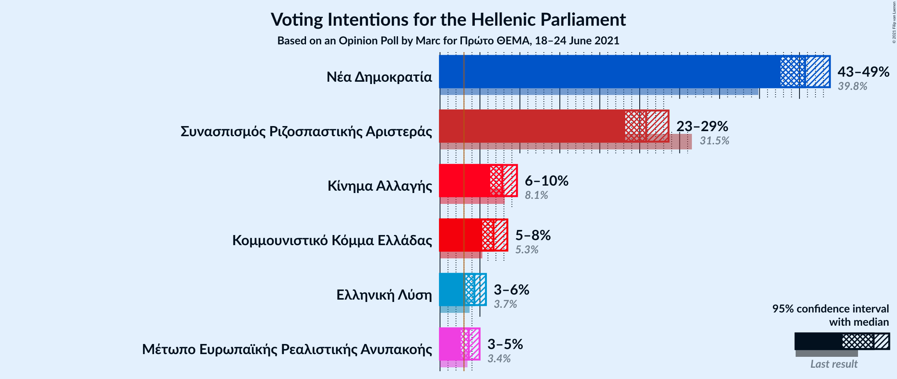

### Confidence Intervals

| Party | Last Result | Poll Result | 80% Confidence Interval | 90% Confidence Interval | 95% Confidence Interval | 99% Confidence Interval |
|:-----:|:-----------:|:-----------:|:-----------------------:|:-----------------------:|:-----------------------:|:-----------------------:|
| Νέα Δημοκρατία | 39.8% | 45.7% | 43.7–47.7% |43.1–48.3% |42.6–48.8% |41.7–49.8% |
| Συνασπισμός Ριζοσπαστικής Αριστεράς | 31.5% | 25.8% | 24.1–27.6% |23.6–28.2% |23.2–28.6% |22.4–29.5% |
| Κίνημα Αλλαγής | 8.1% | 7.8% | 6.8–9.0% |6.5–9.3% |6.3–9.6% |5.8–10.2% |
| Κομμουνιστικό Κόμμα Ελλάδας | 5.3% | 6.7% | 5.8–7.8% |5.5–8.2% |5.3–8.4% |4.9–9.0% |
| Ελληνική Λύση | 3.7% | 4.3% | 3.6–5.2% |3.4–5.5% |3.2–5.7% |2.9–6.2% |
| Μέτωπο Ευρωπαϊκής Ρεαλιστικής Ανυπακοής | 3.4% | 3.6% | 2.9–4.5% |2.8–4.7% |2.6–5.0% |2.3–5.4% |

*Note:* The poll result column reflects the actual value used in the calculations. Published results may vary slightly, and in addition be rounded to fewer digits.

## Seats

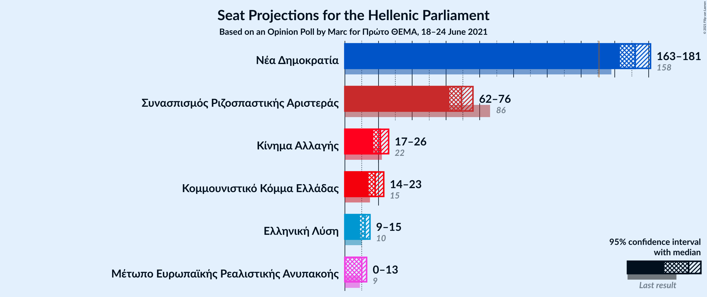

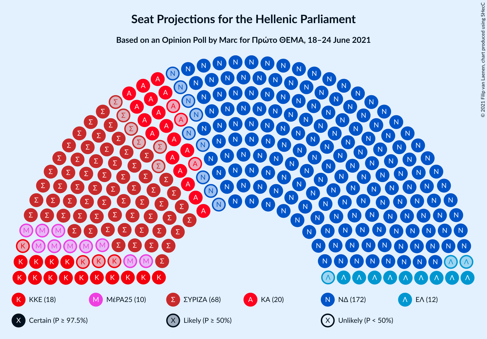

### Confidence Intervals

| Party | Last Result | Median | 80% Confidence Interval | 90% Confidence Interval | 95% Confidence Interval | 99% Confidence Interval |
|:-----:|:-----------:|:------:|:-----------------------:|:-----------------------:|:-----------------------:|:-----------------------:|
| <a href="#νέα-δημοκρατία">Νέα Δημοκρατία</a> | 158 | 172 | 166–178 |165–179 |163–181 |161–184 |
| <a href="#συνασπισμός-ριζοσπαστικής-αριστεράς">Συνασπισμός Ριζοσπαστικής Αριστεράς</a> | 86 | 69 | 64–73 |63–75 |62–76 |59–79 |
| <a href="#κίνημα-αλλαγής">Κίνημα Αλλαγής</a> | 22 | 21 | 18–24 |17–25 |17–26 |16–27 |
| <a href="#κομμουνιστικό-κόμμα-ελλάδας">Κομμουνιστικό Κόμμα Ελλάδας</a> | 15 | 18 | 16–21 |15–22 |14–23 |13–24 |
| <a href="#ελληνική-λύση">Ελληνική Λύση</a> | 10 | 12 | 10–14 |9–15 |9–15 |0–17 |
| <a href="#μέτωπο-ευρωπαϊκής-ρεαλιστικής-ανυπακοής">Μέτωπο Ευρωπαϊκής Ρεαλιστικής Ανυπακοής</a> | 9 | 10 | 0–12 |0–13 |0–13 |0–14 |

### Νέα Δημοκρατία

*For a full overview of the results for this party, see the [Νέα Δημοκρατία](party-νέαδημοκρατία.html) page.*

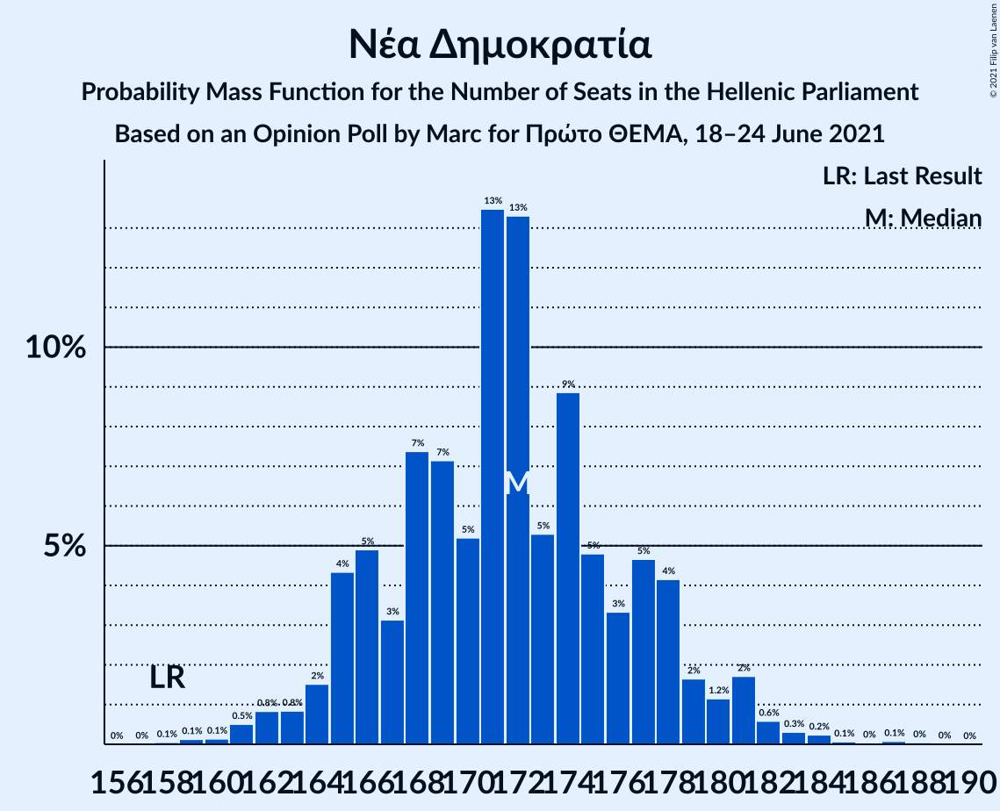

| Number of Seats | Probability | Accumulated | Special Marks |
|:---------------:|:-----------:|:-----------:|:-------------:|
| 158 | 0.1% | 100% | Last Result |
| 159 | 0.1% | 99.9% |  |
| 160 | 0.1% | 99.8% |  |
| 161 | 0.5% | 99.6% |  |
| 162 | 0.8% | 99.1% |  |
| 163 | 0.8% | 98% |  |
| 164 | 2% | 97% |  |
| 165 | 4% | 96% |  |
| 166 | 5% | 92% |  |
| 167 | 3% | 87% |  |
| 168 | 7% | 84% |  |
| 169 | 7% | 76% |  |
| 170 | 5% | 69% |  |
| 171 | 13% | 64% |  |
| 172 | 13% | 50% | Median |
| 173 | 5% | 37% |  |
| 174 | 9% | 32% |  |
| 175 | 5% | 23% |  |
| 176 | 3% | 18% |  |
| 177 | 5% | 15% |  |
| 178 | 4% | 10% |  |
| 179 | 2% | 6% |  |
| 180 | 1.2% | 4% |  |
| 181 | 2% | 3% |  |
| 182 | 0.6% | 1.4% |  |
| 183 | 0.3% | 0.8% |  |
| 184 | 0.2% | 0.5% |  |
| 185 | 0.1% | 0.3% |  |
| 186 | 0% | 0.2% |  |
| 187 | 0.1% | 0.2% |  |
| 188 | 0% | 0.1% |  |
| 189 | 0% | 0% |  |

### Συνασπισμός Ριζοσπαστικής Αριστεράς

*For a full overview of the results for this party, see the [Συνασπισμός Ριζοσπαστικής Αριστεράς](party-συνασπισμόςριζοσπαστικήςαριστεράς.html) page.*

| Number of Seats | Probability | Accumulated | Special Marks |
|:---------------:|:-----------:|:-----------:|:-------------:|
| 57 | 0.1% | 100% |  |
| 58 | 0.1% | 99.9% |  |
| 59 | 0.3% | 99.8% |  |
| 60 | 0.6% | 99.5% |  |
| 61 | 1.0% | 98.9% |  |
| 62 | 2% | 98% |  |
| 63 | 3% | 95% |  |
| 64 | 5% | 92% |  |
| 65 | 6% | 87% |  |
| 66 | 7% | 81% |  |
| 67 | 11% | 74% |  |
| 68 | 11% | 63% |  |
| 69 | 11% | 52% | Median |
| 70 | 11% | 41% |  |
| 71 | 7% | 30% |  |
| 72 | 7% | 23% |  |
| 73 | 6% | 16% |  |
| 74 | 3% | 10% |  |
| 75 | 3% | 7% |  |
| 76 | 2% | 4% |  |
| 77 | 0.9% | 2% |  |
| 78 | 0.7% | 1.4% |  |
| 79 | 0.4% | 0.7% |  |
| 80 | 0.2% | 0.3% |  |
| 81 | 0.1% | 0.1% |  |
| 82 | 0% | 0.1% |  |
| 83 | 0% | 0% |  |
| 84 | 0% | 0% |  |
| 85 | 0% | 0% |  |
| 86 | 0% | 0% | Last Result |

### Κίνημα Αλλαγής

*For a full overview of the results for this party, see the [Κίνημα Αλλαγής](party-κίνημααλλαγής.html) page.*

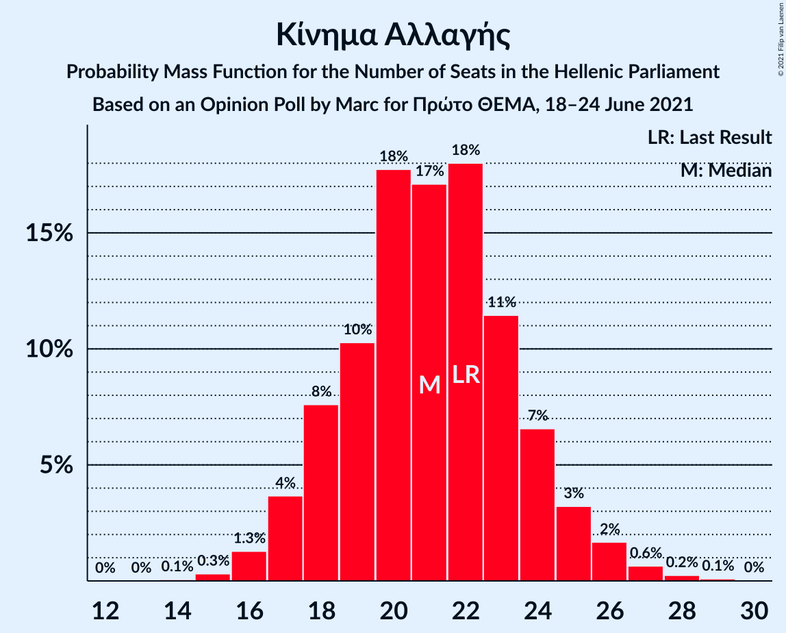

| Number of Seats | Probability | Accumulated | Special Marks |
|:---------------:|:-----------:|:-----------:|:-------------:|
| 14 | 0.1% | 100% |  |
| 15 | 0.3% | 99.9% |  |
| 16 | 1.3% | 99.6% |  |
| 17 | 4% | 98% |  |
| 18 | 8% | 95% |  |
| 19 | 10% | 87% |  |
| 20 | 18% | 77% |  |
| 21 | 17% | 59% | Median |
| 22 | 18% | 42% | Last Result |
| 23 | 11% | 24% |  |
| 24 | 7% | 12% |  |
| 25 | 3% | 6% |  |
| 26 | 2% | 3% |  |
| 27 | 0.6% | 1.0% |  |
| 28 | 0.2% | 0.4% |  |
| 29 | 0.1% | 0.1% |  |
| 30 | 0% | 0% |  |

### Κομμουνιστικό Κόμμα Ελλάδας

*For a full overview of the results for this party, see the [Κομμουνιστικό Κόμμα Ελλάδας](party-κομμουνιστικόκόμμαελλάδας.html) page.*

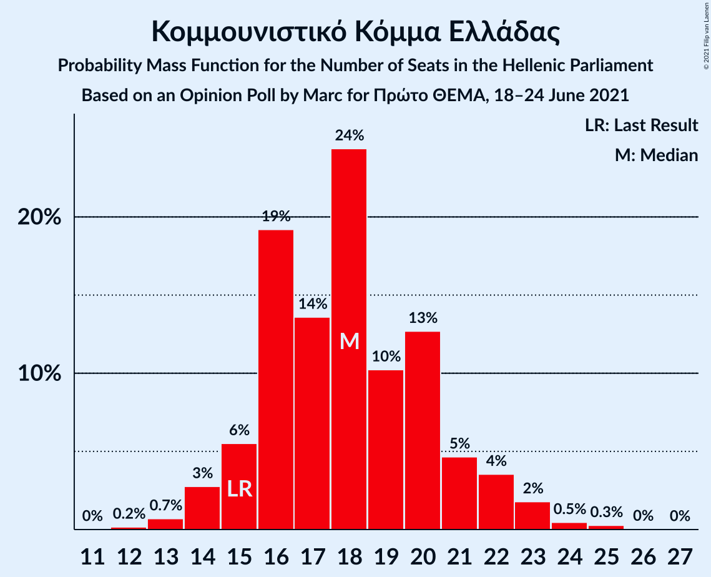

| Number of Seats | Probability | Accumulated | Special Marks |
|:---------------:|:-----------:|:-----------:|:-------------:|
| 12 | 0.2% | 100% |  |
| 13 | 0.7% | 99.8% |  |
| 14 | 3% | 99.1% |  |
| 15 | 6% | 96% | Last Result |
| 16 | 19% | 91% |  |
| 17 | 14% | 72% |  |
| 18 | 24% | 58% | Median |
| 19 | 10% | 34% |  |
| 20 | 13% | 23% |  |
| 21 | 5% | 11% |  |
| 22 | 4% | 6% |  |
| 23 | 2% | 3% |  |
| 24 | 0.5% | 0.8% |  |
| 25 | 0.3% | 0.3% |  |
| 26 | 0% | 0.1% |  |
| 27 | 0% | 0% |  |

### Ελληνική Λύση

*For a full overview of the results for this party, see the [Ελληνική Λύση](party-ελληνικήλύση.html) page.*

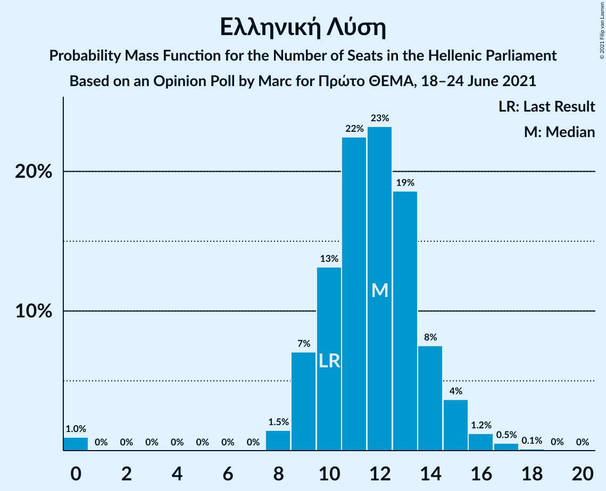

| Number of Seats | Probability | Accumulated | Special Marks |
|:---------------:|:-----------:|:-----------:|:-------------:|
| 0 | 1.0% | 100% |  |
| 1 | 0% | 99.0% |  |
| 2 | 0% | 99.0% |  |
| 3 | 0% | 99.0% |  |
| 4 | 0% | 99.0% |  |
| 5 | 0% | 99.0% |  |
| 6 | 0% | 99.0% |  |
| 7 | 0% | 99.0% |  |
| 8 | 1.5% | 99.0% |  |
| 9 | 7% | 98% |  |
| 10 | 13% | 91% | Last Result |
| 11 | 22% | 77% |  |
| 12 | 23% | 55% | Median |
| 13 | 19% | 32% |  |
| 14 | 8% | 13% |  |
| 15 | 4% | 6% |  |
| 16 | 1.2% | 2% |  |
| 17 | 0.5% | 0.7% |  |
| 18 | 0.1% | 0.2% |  |
| 19 | 0% | 0% |  |

### Μέτωπο Ευρωπαϊκής Ρεαλιστικής Ανυπακοής

*For a full overview of the results for this party, see the [Μέτωπο Ευρωπαϊκής Ρεαλιστικής Ανυπακοής](party-μέτωποευρωπαϊκήςρεαλιστικήςανυπακοής.html) page.*

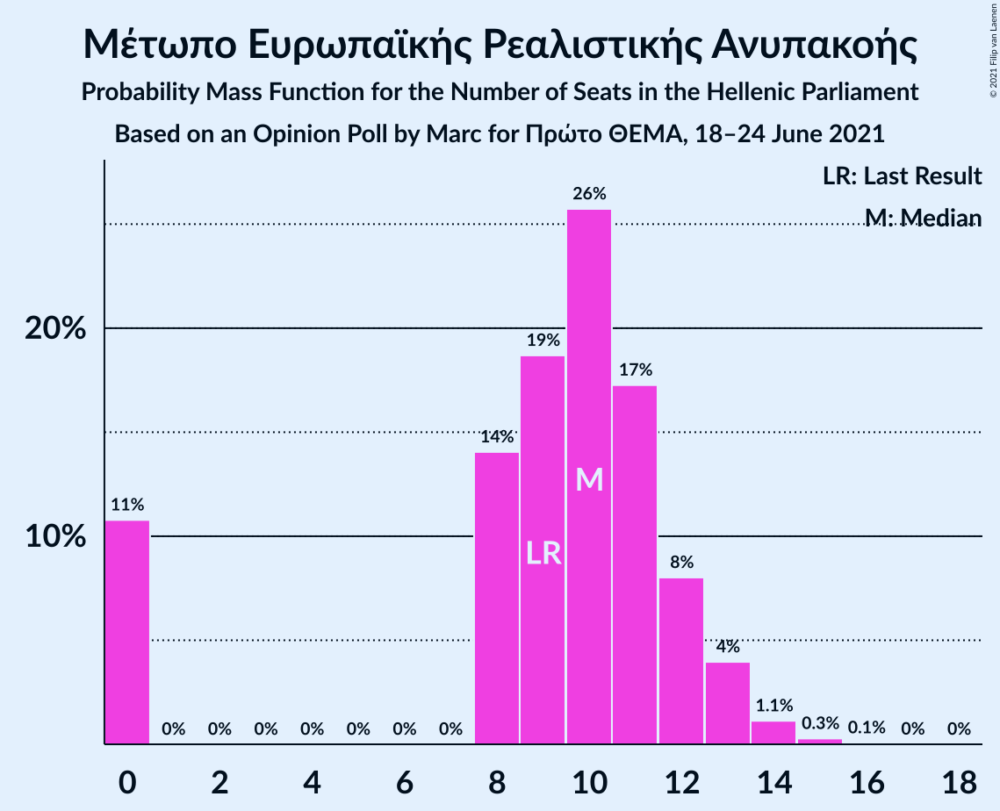

| Number of Seats | Probability | Accumulated | Special Marks |
|:---------------:|:-----------:|:-----------:|:-------------:|
| 0 | 11% | 100% |  |
| 1 | 0% | 89% |  |
| 2 | 0% | 89% |  |
| 3 | 0% | 89% |  |
| 4 | 0% | 89% |  |
| 5 | 0% | 89% |  |
| 6 | 0% | 89% |  |
| 7 | 0% | 89% |  |
| 8 | 14% | 89% |  |
| 9 | 19% | 75% | Last Result |
| 10 | 26% | 56% | Median |
| 11 | 17% | 31% |  |
| 12 | 8% | 13% |  |
| 13 | 4% | 5% |  |
| 14 | 1.1% | 1.5% |  |
| 15 | 0.3% | 0.4% |  |
| 16 | 0.1% | 0.1% |  |
| 17 | 0% | 0% |  |

## Coalitions

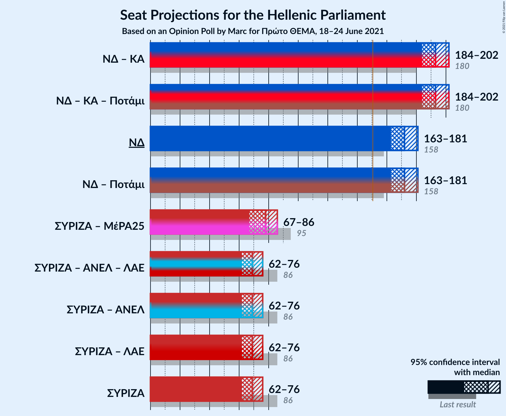

### Confidence Intervals

| Coalition | Last Result | Median | Majority? | 80% Confidence Interval | 90% Confidence Interval | 95% Confidence Interval | 99% Confidence Interval |
|:---------:|:-----------:|:------:|:---------:|:-----------------------:|:-----------------------:|:-----------------------:|:-----------------------:|
| Νέα Δημοκρατία – Κίνημα Αλλαγής | 180 | 193 | 100% | 187–198 | 185–200 | 184–202 | 182–205 |
| Νέα Δημοκρατία | 158 | 172 | 100% | 166–178 | 165–179 | 163–181 | 161–184 |
| Συνασπισμός Ριζοσπαστικής Αριστεράς – Μέτωπο Ευρωπαϊκής Ρεαλιστικής Ανυπακοής | 95 | 78 | 0% | 72–83 | 70–85 | 67–86 | 65–88 |
| Συνασπισμός Ριζοσπαστικής Αριστεράς | 86 | 69 | 0% | 64–73 | 63–75 | 62–76 | 59–79 |

### Νέα Δημοκρατία – Κίνημα Αλλαγής

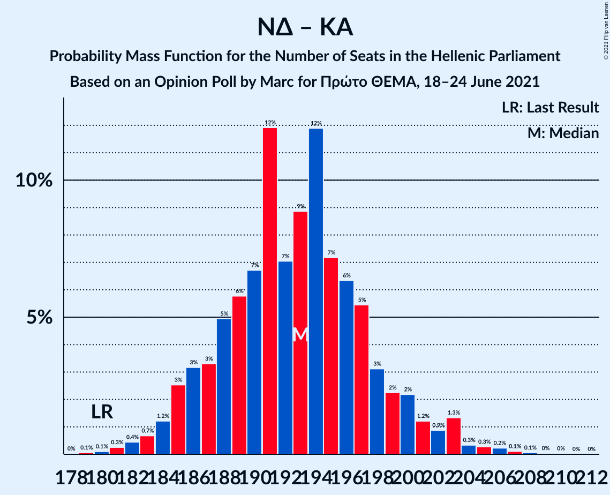

| Number of Seats | Probability | Accumulated | Special Marks |
|:---------------:|:-----------:|:-----------:|:-------------:|
| 179 | 0.1% | 100% |  |
| 180 | 0.1% | 99.9% | Last Result |
| 181 | 0.3% | 99.8% |  |
| 182 | 0.4% | 99.5% |  |
| 183 | 0.7% | 99.1% |  |
| 184 | 1.2% | 98% |  |
| 185 | 3% | 97% |  |
| 186 | 3% | 95% |  |
| 187 | 3% | 92% |  |
| 188 | 5% | 88% |  |
| 189 | 6% | 83% |  |
| 190 | 7% | 77% |  |
| 191 | 12% | 71% |  |
| 192 | 7% | 59% |  |
| 193 | 9% | 52% | Median |
| 194 | 12% | 43% |  |
| 195 | 7% | 31% |  |
| 196 | 6% | 24% |  |
| 197 | 5% | 18% |  |
| 198 | 3% | 12% |  |
| 199 | 2% | 9% |  |
| 200 | 2% | 7% |  |
| 201 | 1.2% | 5% |  |
| 202 | 0.9% | 3% |  |
| 203 | 1.3% | 2% |  |
| 204 | 0.3% | 1.1% |  |
| 205 | 0.3% | 0.8% |  |
| 206 | 0.2% | 0.5% |  |
| 207 | 0.1% | 0.3% |  |
| 208 | 0.1% | 0.1% |  |
| 209 | 0% | 0.1% |  |
| 210 | 0% | 0.1% |  |
| 211 | 0% | 0% |  |

### Νέα Δημοκρατία

| Number of Seats | Probability | Accumulated | Special Marks |
|:---------------:|:-----------:|:-----------:|:-------------:|
| 158 | 0.1% | 100% | Last Result |
| 159 | 0.1% | 99.9% |  |
| 160 | 0.1% | 99.8% |  |
| 161 | 0.5% | 99.6% |  |
| 162 | 0.8% | 99.1% |  |
| 163 | 0.8% | 98% |  |
| 164 | 2% | 97% |  |
| 165 | 4% | 96% |  |
| 166 | 5% | 92% |  |
| 167 | 3% | 87% |  |
| 168 | 7% | 84% |  |
| 169 | 7% | 76% |  |
| 170 | 5% | 69% |  |
| 171 | 13% | 64% |  |
| 172 | 13% | 50% | Median |
| 173 | 5% | 37% |  |
| 174 | 9% | 32% |  |
| 175 | 5% | 23% |  |
| 176 | 3% | 18% |  |
| 177 | 5% | 15% |  |
| 178 | 4% | 10% |  |
| 179 | 2% | 6% |  |
| 180 | 1.2% | 4% |  |
| 181 | 2% | 3% |  |
| 182 | 0.6% | 1.4% |  |
| 183 | 0.3% | 0.8% |  |
| 184 | 0.2% | 0.5% |  |
| 185 | 0.1% | 0.3% |  |
| 186 | 0% | 0.2% |  |
| 187 | 0.1% | 0.2% |  |
| 188 | 0% | 0.1% |  |
| 189 | 0% | 0% |  |

### Συνασπισμός Ριζοσπαστικής Αριστεράς – Μέτωπο Ευρωπαϊκής Ρεαλιστικής Ανυπακοής

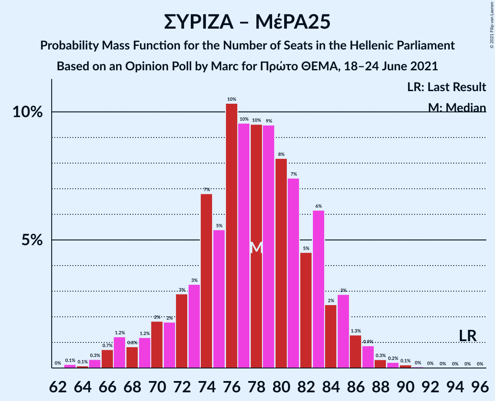

| Number of Seats | Probability | Accumulated | Special Marks |
|:---------------:|:-----------:|:-----------:|:-------------:|
| 62 | 0% | 100% |  |
| 63 | 0.1% | 99.9% |  |
| 64 | 0.1% | 99.8% |  |
| 65 | 0.3% | 99.7% |  |
| 66 | 0.7% | 99.4% |  |
| 67 | 1.2% | 98.6% |  |
| 68 | 0.8% | 97% |  |
| 69 | 1.2% | 97% |  |
| 70 | 2% | 95% |  |
| 71 | 2% | 94% |  |
| 72 | 3% | 92% |  |
| 73 | 3% | 89% |  |
| 74 | 7% | 86% |  |
| 75 | 5% | 79% |  |
| 76 | 10% | 73% |  |
| 77 | 10% | 63% |  |
| 78 | 10% | 54% |  |
| 79 | 9% | 44% | Median |
| 80 | 8% | 35% |  |
| 81 | 7% | 26% |  |
| 82 | 5% | 19% |  |
| 83 | 6% | 14% |  |
| 84 | 2% | 8% |  |
| 85 | 3% | 6% |  |
| 86 | 1.3% | 3% |  |
| 87 | 0.9% | 2% |  |
| 88 | 0.3% | 0.8% |  |
| 89 | 0.2% | 0.4% |  |
| 90 | 0.1% | 0.2% |  |
| 91 | 0% | 0.1% |  |
| 92 | 0% | 0% |  |
| 93 | 0% | 0% |  |
| 94 | 0% | 0% |  |
| 95 | 0% | 0% | Last Result |

### Συνασπισμός Ριζοσπαστικής Αριστεράς

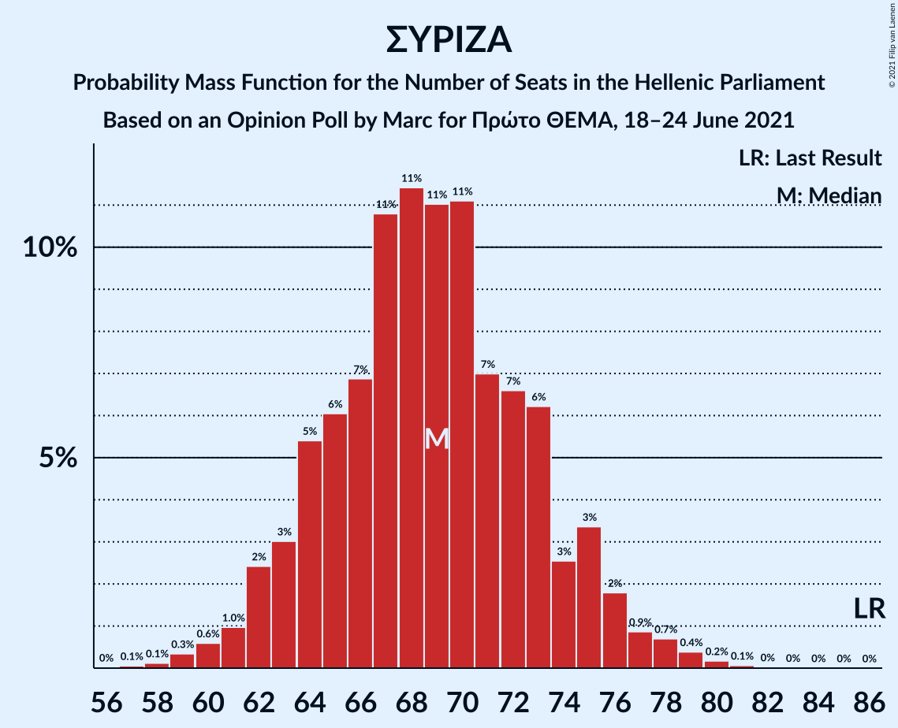

| Number of Seats | Probability | Accumulated | Special Marks |
|:---------------:|:-----------:|:-----------:|:-------------:|
| 57 | 0.1% | 100% |  |
| 58 | 0.1% | 99.9% |  |
| 59 | 0.3% | 99.8% |  |
| 60 | 0.6% | 99.5% |  |
| 61 | 1.0% | 98.9% |  |
| 62 | 2% | 98% |  |
| 63 | 3% | 95% |  |
| 64 | 5% | 92% |  |
| 65 | 6% | 87% |  |
| 66 | 7% | 81% |  |
| 67 | 11% | 74% |  |
| 68 | 11% | 63% |  |
| 69 | 11% | 52% | Median |
| 70 | 11% | 41% |  |
| 71 | 7% | 30% |  |
| 72 | 7% | 23% |  |
| 73 | 6% | 16% |  |
| 74 | 3% | 10% |  |
| 75 | 3% | 7% |  |
| 76 | 2% | 4% |  |
| 77 | 0.9% | 2% |  |
| 78 | 0.7% | 1.4% |  |
| 79 | 0.4% | 0.7% |  |
| 80 | 0.2% | 0.3% |  |
| 81 | 0.1% | 0.1% |  |
| 82 | 0% | 0.1% |  |
| 83 | 0% | 0% |  |
| 84 | 0% | 0% |  |
| 85 | 0% | 0% |  |
| 86 | 0% | 0% | Last Result |

## Technical Information

### Opinion Poll

+ **Polling firm:** Marc
+ **Commissioner(s):** Πρώτο ΘΕΜΑ
+ **Fieldwork period:** 18–24 June 2021

### Calculations

+ **Sample size:** 1000
+ **Simulations done:** 131,072
+ **Error estimate:** 0.99%

