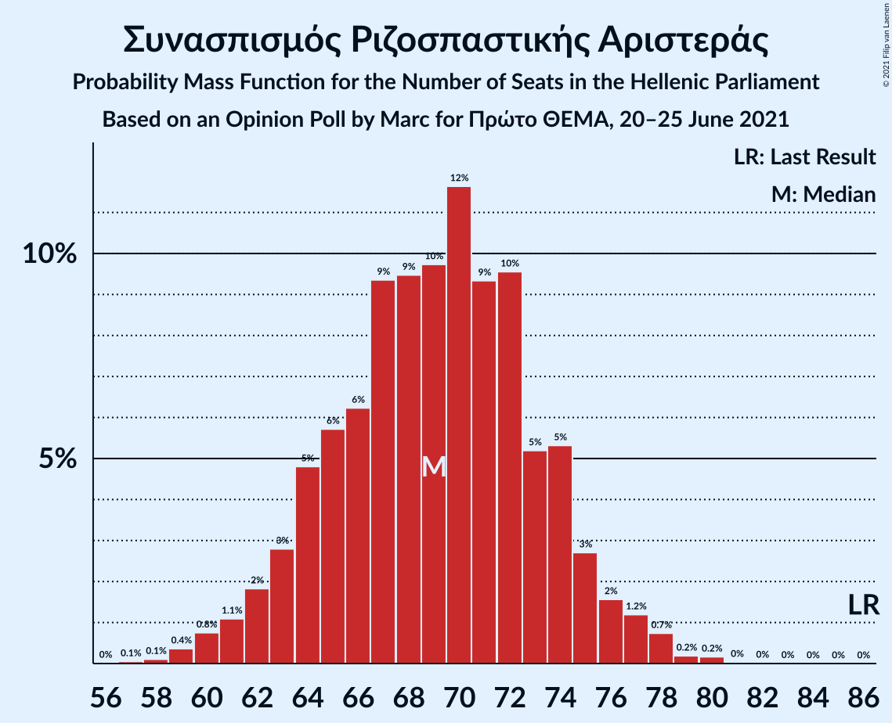
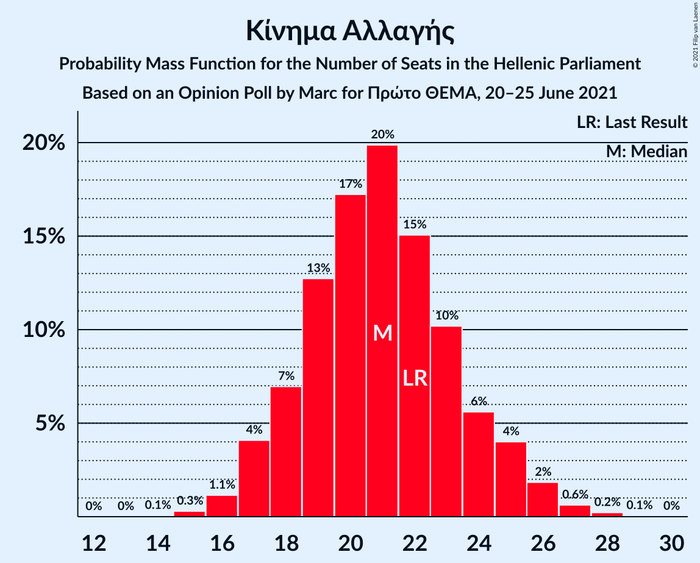
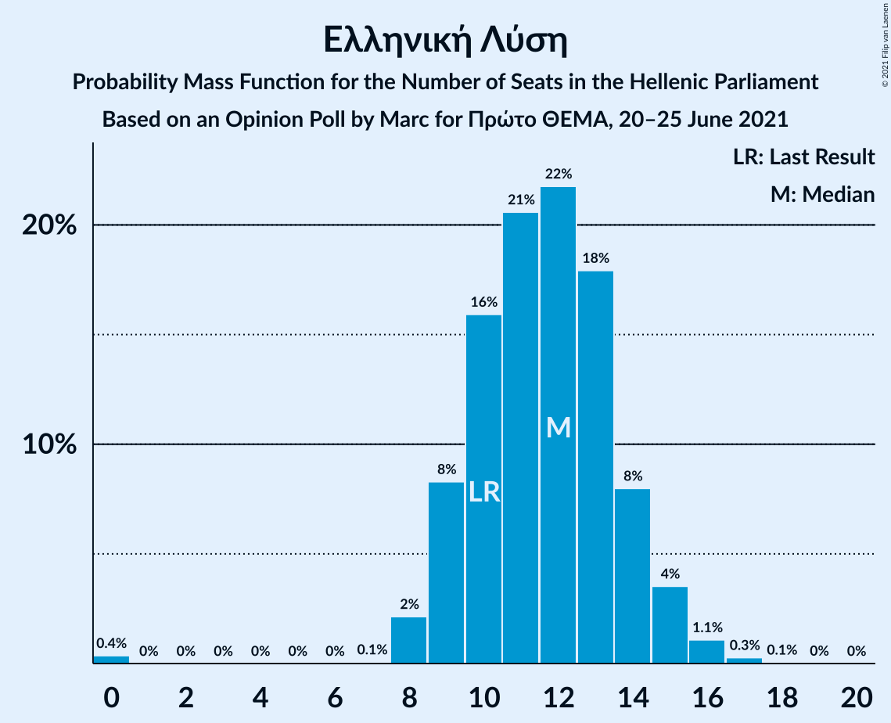
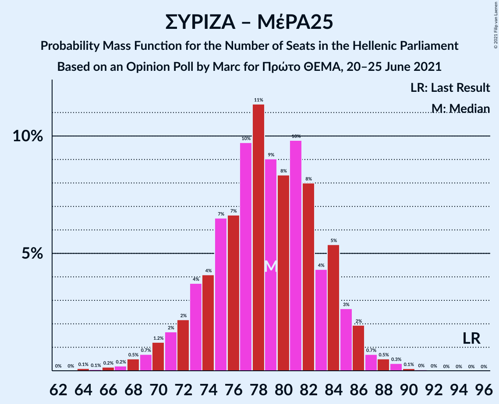

# Opinion Poll by Marc for Πρώτο ΘΕΜΑ, 20–25 June 2021

<a href="#voting-intentions">Voting Intentions</a> | <a href="#seats">Seats</a> | <a href="#coalitions">Coalitions</a> | <a href="#technical-information">Technical Information</a>

## Voting Intentions

### Confidence Intervals

| Party | Last Result | Poll Result | 80% Confidence Interval | 90% Confidence Interval | 95% Confidence Interval | 99% Confidence Interval |
|:-----:|:-----------:|:-----------:|:-----------------------:|:-----------------------:|:-----------------------:|:-----------------------:|
| Νέα Δημοκρατία | 39.8% | 48.7% | 46.7–50.7% |46.1–51.3% |45.6–51.8% |44.6–52.8% |
| Συνασπισμός Ριζοσπαστικής Αριστεράς | 31.5% | 27.5% | 25.7–29.4% |25.2–29.9% |24.8–30.4% |24.0–31.3% |
| Κίνημα Αλλαγής | 8.1% | 8.3% | 7.3–9.5% |7.0–9.9% |6.7–10.2% |6.3–10.8% |
| Κομμουνιστικό Κόμμα Ελλάδας | 5.3% | 7.1% | 6.2–8.3% |5.9–8.6% |5.7–8.9% |5.2–9.4% |
| Ελληνική Λύση | 3.7% | 4.5% | 3.8–5.5% |3.6–5.7% |3.4–6.0% |3.0–6.5% |
| Μέτωπο Ευρωπαϊκής Ρεαλιστικής Ανυπακοής | 3.4% | 3.9% | 3.2–4.8% |3.0–5.1% |2.9–5.3% |2.6–5.8% |

*Note:* The poll result column reflects the actual value used in the calculations. Published results may vary slightly, and in addition be rounded to fewer digits.

## Seats

### Confidence Intervals

| Party | Last Result | Median | 80% Confidence Interval | 90% Confidence Interval | 95% Confidence Interval | 99% Confidence Interval |
|:-----:|:-----------:|:------:|:-----------------------:|:-----------------------:|:-----------------------:|:-----------------------:|
| <a href="#νέα-δημοκρατία">Νέα Δημοκρατία</a> | 158 | 170 | 166–178 |164–179 |163–180 |162–182 |
| <a href="#συνασπισμός-ριζοσπαστικής-αριστεράς">Συνασπισμός Ριζοσπαστικής Αριστεράς</a> | 86 | 69 | 63–74 |63–77 |61–77 |60–78 |
| <a href="#κίνημα-αλλαγής">Κίνημα Αλλαγής</a> | 22 | 21 | 18–24 |17–25 |17–26 |16–27 |
| <a href="#κομμουνιστικό-κόμμα-ελλάδας">Κομμουνιστικό Κόμμα Ελλάδας</a> | 15 | 18 | 15–21 |14–22 |14–22 |13–24 |
| <a href="#ελληνική-λύση">Ελληνική Λύση</a> | 10 | 12 | 9–14 |9–15 |8–15 |7–16 |
| <a href="#μέτωπο-ευρωπαϊκής-ρεαλιστικής-ανυπακοής">Μέτωπο Ευρωπαϊκής Ρεαλιστικής Ανυπακοής</a> | 9 | 10 | 8–12 |0–13 |0–13 |0–14 |

### Νέα Δημοκρατία

*For a full overview of the results for this party, see the [Νέα Δημοκρατία](party-νέαδημοκρατία.html) page.*

| Number of Seats | Probability | Accumulated | Special Marks |
|:---------------:|:-----------:|:-----------:|:-------------:|
| 158 | 0% | 100% | Last Result |
| 159 | 0% | 100% |  |
| 160 | 0.1% | 99.9% |  |
| 161 | 0.2% | 99.9% |  |
| 162 | 0.3% | 99.7% |  |
| 163 | 3% | 99.4% |  |
| 164 | 2% | 97% |  |
| 165 | 3% | 95% |  |
| 166 | 6% | 92% |  |
| 167 | 5% | 85% |  |
| 168 | 10% | 80% |  |
| 169 | 13% | 70% |  |
| 170 | 9% | 57% | Median |
| 171 | 7% | 49% |  |
| 172 | 5% | 41% |  |
| 173 | 4% | 36% |  |
| 174 | 3% | 32% |  |
| 175 | 3% | 29% |  |
| 176 | 12% | 26% |  |
| 177 | 3% | 14% |  |
| 178 | 5% | 11% |  |
| 179 | 0.9% | 6% |  |
| 180 | 3% | 5% |  |
| 181 | 1.1% | 2% |  |
| 182 | 0.3% | 0.7% |  |
| 183 | 0.1% | 0.4% |  |
| 184 | 0.2% | 0.3% |  |
| 185 | 0% | 0.1% |  |
| 186 | 0% | 0.1% |  |
| 187 | 0.1% | 0.1% |  |
| 188 | 0% | 0% |  |

### Συνασπισμός Ριζοσπαστικής Αριστεράς

*For a full overview of the results for this party, see the [Συνασπισμός Ριζοσπαστικής Αριστεράς](party-συνασπισμόςριζοσπαστικήςαριστεράς.html) page.*

| Number of Seats | Probability | Accumulated | Special Marks |
|:---------------:|:-----------:|:-----------:|:-------------:|
| 58 | 0.2% | 100% |  |
| 59 | 0.2% | 99.8% |  |
| 60 | 0.6% | 99.6% |  |
| 61 | 2% | 99.0% |  |
| 62 | 1.4% | 97% |  |
| 63 | 7% | 96% |  |
| 64 | 3% | 89% |  |
| 65 | 5% | 86% |  |
| 66 | 5% | 81% |  |
| 67 | 20% | 77% |  |
| 68 | 5% | 57% |  |
| 69 | 10% | 52% | Median |
| 70 | 11% | 42% |  |
| 71 | 4% | 32% |  |
| 72 | 12% | 28% |  |
| 73 | 4% | 16% |  |
| 74 | 2% | 12% |  |
| 75 | 3% | 10% |  |
| 76 | 1.3% | 7% |  |
| 77 | 5% | 6% |  |
| 78 | 0.7% | 1.0% |  |
| 79 | 0.1% | 0.3% |  |
| 80 | 0.1% | 0.2% |  |
| 81 | 0.1% | 0.1% |  |
| 82 | 0% | 0% |  |
| 83 | 0% | 0% |  |
| 84 | 0% | 0% |  |
| 85 | 0% | 0% |  |
| 86 | 0% | 0% | Last Result |

### Κίνημα Αλλαγής

*For a full overview of the results for this party, see the [Κίνημα Αλλαγής](party-κίνημααλλαγής.html) page.*

| Number of Seats | Probability | Accumulated | Special Marks |
|:---------------:|:-----------:|:-----------:|:-------------:|
| 15 | 0.1% | 100% |  |
| 16 | 1.0% | 99.8% |  |
| 17 | 6% | 98.8% |  |
| 18 | 4% | 93% |  |
| 19 | 13% | 89% |  |
| 20 | 22% | 76% |  |
| 21 | 13% | 54% | Median |
| 22 | 20% | 41% | Last Result |
| 23 | 8% | 21% |  |
| 24 | 5% | 13% |  |
| 25 | 4% | 8% |  |
| 26 | 3% | 4% |  |
| 27 | 0.6% | 0.8% |  |
| 28 | 0.2% | 0.3% |  |
| 29 | 0.1% | 0.1% |  |
| 30 | 0% | 0% |  |

### Κομμουνιστικό Κόμμα Ελλάδας

*For a full overview of the results for this party, see the [Κομμουνιστικό Κόμμα Ελλάδας](party-κομμουνιστικόκόμμαελλάδας.html) page.*

| Number of Seats | Probability | Accumulated | Special Marks |
|:---------------:|:-----------:|:-----------:|:-------------:|
| 12 | 0.2% | 100% |  |
| 13 | 0.5% | 99.8% |  |
| 14 | 8% | 99.3% |  |
| 15 | 9% | 91% | Last Result |
| 16 | 10% | 82% |  |
| 17 | 10% | 72% |  |
| 18 | 26% | 62% | Median |
| 19 | 16% | 36% |  |
| 20 | 4% | 20% |  |
| 21 | 10% | 16% |  |
| 22 | 4% | 6% |  |
| 23 | 0.6% | 1.4% |  |
| 24 | 0.6% | 0.8% |  |
| 25 | 0.1% | 0.2% |  |
| 26 | 0% | 0% |  |

### Ελληνική Λύση

*For a full overview of the results for this party, see the [Ελληνική Λύση](party-ελληνικήλύση.html) page.*

| Number of Seats | Probability | Accumulated | Special Marks |
|:---------------:|:-----------:|:-----------:|:-------------:|
| 0 | 0.3% | 100% |  |
| 1 | 0% | 99.7% |  |
| 2 | 0% | 99.7% |  |
| 3 | 0% | 99.7% |  |
| 4 | 0% | 99.7% |  |
| 5 | 0% | 99.7% |  |
| 6 | 0% | 99.7% |  |
| 7 | 0.3% | 99.7% |  |
| 8 | 2% | 99.4% |  |
| 9 | 10% | 97% |  |
| 10 | 9% | 88% | Last Result |
| 11 | 27% | 79% |  |
| 12 | 25% | 52% | Median |
| 13 | 13% | 27% |  |
| 14 | 6% | 14% |  |
| 15 | 6% | 7% |  |
| 16 | 1.0% | 1.1% |  |
| 17 | 0.1% | 0.2% |  |
| 18 | 0% | 0.1% |  |
| 19 | 0% | 0% |  |

### Μέτωπο Ευρωπαϊκής Ρεαλιστικής Ανυπακοής

*For a full overview of the results for this party, see the [Μέτωπο Ευρωπαϊκής Ρεαλιστικής Ανυπακοής](party-μέτωποευρωπαϊκήςρεαλιστικήςανυπακοής.html) page.*

| Number of Seats | Probability | Accumulated | Special Marks |
|:---------------:|:-----------:|:-----------:|:-------------:|
| 0 | 5% | 100% |  |
| 1 | 0% | 95% |  |
| 2 | 0% | 95% |  |
| 3 | 0% | 95% |  |
| 4 | 0% | 95% |  |
| 5 | 0% | 95% |  |
| 6 | 0% | 95% |  |
| 7 | 0.1% | 95% |  |
| 8 | 12% | 95% |  |
| 9 | 26% | 83% | Last Result |
| 10 | 31% | 56% | Median |
| 11 | 14% | 25% |  |
| 12 | 5% | 11% |  |
| 13 | 4% | 6% |  |
| 14 | 2% | 2% |  |
| 15 | 0.2% | 0.2% |  |
| 16 | 0% | 0% |  |

## Coalitions

### Confidence Intervals

| Coalition | Last Result | Median | Majority? | 80% Confidence Interval | 90% Confidence Interval | 95% Confidence Interval | 99% Confidence Interval |
|:---------:|:-----------:|:------:|:---------:|:-----------------------:|:-----------------------:|:-----------------------:|:-----------------------:|
| Νέα Δημοκρατία – Κίνημα Αλλαγής | 180 | 192 | 100% | 187–198 | 185–200 | 184–202 | 182–203 |
| Νέα Δημοκρατία | 158 | 170 | 100% | 166–178 | 164–179 | 163–180 | 162–182 |
| Συνασπισμός Ριζοσπαστικής Αριστεράς – Μέτωπο Ευρωπαϊκής Ρεαλιστικής Ανυπακοής | 95 | 78 | 0% | 73–84 | 72–85 | 70–86 | 68–89 |
| Συνασπισμός Ριζοσπαστικής Αριστεράς | 86 | 69 | 0% | 63–74 | 63–77 | 61–77 | 60–78 |

### Νέα Δημοκρατία – Κίνημα Αλλαγής

| Number of Seats | Probability | Accumulated | Special Marks |
|:---------------:|:-----------:|:-----------:|:-------------:|
| 180 | 0.1% | 100% | Last Result |
| 181 | 0.2% | 99.9% |  |
| 182 | 0.2% | 99.7% |  |
| 183 | 0.6% | 99.5% |  |
| 184 | 3% | 98.9% |  |
| 185 | 2% | 96% |  |
| 186 | 4% | 94% |  |
| 187 | 4% | 90% |  |
| 188 | 12% | 86% |  |
| 189 | 11% | 74% |  |
| 190 | 5% | 64% |  |
| 191 | 3% | 58% | Median |
| 192 | 13% | 55% |  |
| 193 | 4% | 42% |  |
| 194 | 5% | 38% |  |
| 195 | 2% | 33% |  |
| 196 | 7% | 31% |  |
| 197 | 7% | 24% |  |
| 198 | 8% | 17% |  |
| 199 | 2% | 8% |  |
| 200 | 2% | 6% |  |
| 201 | 2% | 5% |  |
| 202 | 2% | 3% |  |
| 203 | 0.2% | 0.6% |  |
| 204 | 0.1% | 0.4% |  |
| 205 | 0.1% | 0.3% |  |
| 206 | 0.1% | 0.2% |  |
| 207 | 0% | 0.1% |  |
| 208 | 0% | 0.1% |  |
| 209 | 0% | 0% |  |

### Νέα Δημοκρατία

| Number of Seats | Probability | Accumulated | Special Marks |
|:---------------:|:-----------:|:-----------:|:-------------:|
| 158 | 0% | 100% | Last Result |
| 159 | 0% | 100% |  |
| 160 | 0.1% | 99.9% |  |
| 161 | 0.2% | 99.9% |  |
| 162 | 0.3% | 99.7% |  |
| 163 | 3% | 99.4% |  |
| 164 | 2% | 97% |  |
| 165 | 3% | 95% |  |
| 166 | 6% | 92% |  |
| 167 | 5% | 85% |  |
| 168 | 10% | 80% |  |
| 169 | 13% | 70% |  |
| 170 | 9% | 57% | Median |
| 171 | 7% | 49% |  |
| 172 | 5% | 41% |  |
| 173 | 4% | 36% |  |
| 174 | 3% | 32% |  |
| 175 | 3% | 29% |  |
| 176 | 12% | 26% |  |
| 177 | 3% | 14% |  |
| 178 | 5% | 11% |  |
| 179 | 0.9% | 6% |  |
| 180 | 3% | 5% |  |
| 181 | 1.1% | 2% |  |
| 182 | 0.3% | 0.7% |  |
| 183 | 0.1% | 0.4% |  |
| 184 | 0.2% | 0.3% |  |
| 185 | 0% | 0.1% |  |
| 186 | 0% | 0.1% |  |
| 187 | 0.1% | 0.1% |  |
| 188 | 0% | 0% |  |

### Συνασπισμός Ριζοσπαστικής Αριστεράς – Μέτωπο Ευρωπαϊκής Ρεαλιστικής Ανυπακοής

| Number of Seats | Probability | Accumulated | Special Marks |
|:---------------:|:-----------:|:-----------:|:-------------:|
| 65 | 0.1% | 100% |  |
| 66 | 0.1% | 99.9% |  |
| 67 | 0.3% | 99.8% |  |
| 68 | 0.5% | 99.5% |  |
| 69 | 0.6% | 99.0% |  |
| 70 | 1.3% | 98% |  |
| 71 | 1.2% | 97% |  |
| 72 | 2% | 96% |  |
| 73 | 7% | 94% |  |
| 74 | 3% | 87% |  |
| 75 | 6% | 83% |  |
| 76 | 4% | 78% |  |
| 77 | 21% | 74% |  |
| 78 | 12% | 53% |  |
| 79 | 6% | 41% | Median |
| 80 | 3% | 35% |  |
| 81 | 13% | 32% |  |
| 82 | 4% | 19% |  |
| 83 | 3% | 14% |  |
| 84 | 4% | 11% |  |
| 85 | 5% | 8% |  |
| 86 | 1.1% | 3% |  |
| 87 | 0.3% | 2% |  |
| 88 | 1.1% | 2% |  |
| 89 | 0.5% | 0.6% |  |
| 90 | 0.1% | 0.2% |  |
| 91 | 0.1% | 0.1% |  |
| 92 | 0% | 0% |  |
| 93 | 0% | 0% |  |
| 94 | 0% | 0% |  |
| 95 | 0% | 0% | Last Result |

### Συνασπισμός Ριζοσπαστικής Αριστεράς

| Number of Seats | Probability | Accumulated | Special Marks |
|:---------------:|:-----------:|:-----------:|:-------------:|
| 58 | 0.2% | 100% |  |
| 59 | 0.2% | 99.8% |  |
| 60 | 0.6% | 99.6% |  |
| 61 | 2% | 99.0% |  |
| 62 | 1.4% | 97% |  |
| 63 | 7% | 96% |  |
| 64 | 3% | 89% |  |
| 65 | 5% | 86% |  |
| 66 | 5% | 81% |  |
| 67 | 20% | 77% |  |
| 68 | 5% | 57% |  |
| 69 | 10% | 52% | Median |
| 70 | 11% | 42% |  |
| 71 | 4% | 32% |  |
| 72 | 12% | 28% |  |
| 73 | 4% | 16% |  |
| 74 | 2% | 12% |  |
| 75 | 3% | 10% |  |
| 76 | 1.3% | 7% |  |
| 77 | 5% | 6% |  |
| 78 | 0.7% | 1.0% |  |
| 79 | 0.1% | 0.3% |  |
| 80 | 0.1% | 0.2% |  |
| 81 | 0.1% | 0.1% |  |
| 82 | 0% | 0% |  |
| 83 | 0% | 0% |  |
| 84 | 0% | 0% |  |
| 85 | 0% | 0% |  |
| 86 | 0% | 0% | Last Result |

## Technical Information

### Opinion Poll

+ **Polling firm:** Marc
+ **Commissioner(s):** Πρώτο ΘΕΜΑ
+ **Fieldwork period:** 20–25 June 2021

### Calculations

+ **Sample size:** 1000
+ **Simulations done:** 131,072
+ **Error estimate:** 2.65%

