# Opinion Poll by GPO for Τα Νέα, 26–29 June 2021

<a href="#voting-intentions">Voting Intentions</a> | <a href="#seats">Seats</a> | <a href="#coalitions">Coalitions</a> | <a href="#technical-information">Technical Information</a>

## Voting Intentions

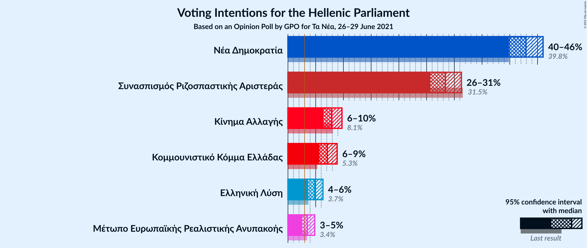

### Confidence Intervals

| Party | Last Result | Poll Result | 80% Confidence Interval | 90% Confidence Interval | 95% Confidence Interval | 99% Confidence Interval |
|:-----:|:-----------:|:-----------:|:-----------------------:|:-----------------------:|:-----------------------:|:-----------------------:|
| Νέα Δημοκρατία | 39.8% | 42.9% | 40.9–44.9% |40.3–45.5% |39.9–46.0% |38.9–47.0% |
| Συνασπισμός Ριζοσπαστικής Αριστεράς | 31.5% | 28.4% | 26.6–30.3% |26.1–30.8% |25.7–31.3% |24.8–32.2% |
| Κίνημα Αλλαγής | 8.1% | 7.9% | 6.9–9.1% |6.6–9.4% |6.4–9.7% |5.9–10.3% |
| Κομμουνιστικό Κόμμα Ελλάδας | 5.3% | 7.1% | 6.2–8.3% |5.9–8.6% |5.7–8.9% |5.2–9.4% |
| Ελληνική Λύση | 3.7% | 4.8% | 4.0–5.8% |3.8–6.1% |3.6–6.3% |3.3–6.8% |
| Μέτωπο Ευρωπαϊκής Ρεαλιστικής Ανυπακοής | 3.4% | 3.5% | 2.9–4.4% |2.7–4.6% |2.5–4.8% |2.2–5.3% |

*Note:* The poll result column reflects the actual value used in the calculations. Published results may vary slightly, and in addition be rounded to fewer digits.

## Seats

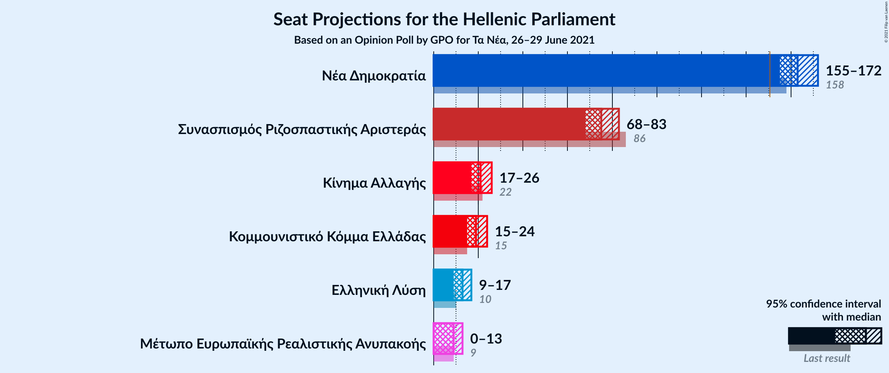

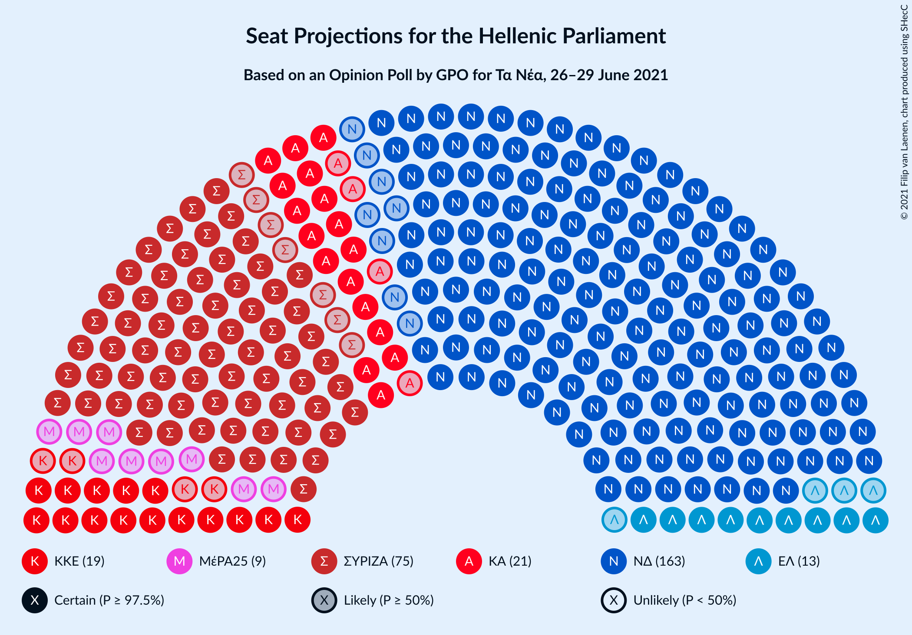

### Confidence Intervals

| Party | Last Result | Median | 80% Confidence Interval | 90% Confidence Interval | 95% Confidence Interval | 99% Confidence Interval |
|:-----:|:-----------:|:------:|:-----------------------:|:-----------------------:|:-----------------------:|:-----------------------:|
| <a href="#νέα-δημοκρατία">Νέα Δημοκρατία</a> | 158 | 163 | 158–169 |157–171 |155–172 |153–176 |
| <a href="#συνασπισμός-ριζοσπαστικής-αριστεράς">Συνασπισμός Ριζοσπαστικής Αριστεράς</a> | 86 | 75 | 71–80 |69–82 |68–83 |66–85 |
| <a href="#κίνημα-αλλαγής">Κίνημα Αλλαγής</a> | 22 | 21 | 18–24 |18–25 |17–26 |16–27 |
| <a href="#κομμουνιστικό-κόμμα-ελλάδας">Κομμουνιστικό Κόμμα Ελλάδας</a> | 15 | 19 | 17–22 |16–22 |15–24 |14–25 |
| <a href="#ελληνική-λύση">Ελληνική Λύση</a> | 10 | 13 | 11–16 |10–16 |9–17 |8–18 |
| <a href="#μέτωπο-ευρωπαϊκής-ρεαλιστικής-ανυπακοής">Μέτωπο Ευρωπαϊκής Ρεαλιστικής Ανυπακοής</a> | 9 | 9 | 0–12 |0–12 |0–13 |0–14 |

### Νέα Δημοκρατία

*For a full overview of the results for this party, see the [Νέα Δημοκρατία](party-νέαδημοκρατία.html) page.*

| Number of Seats | Probability | Accumulated | Special Marks |
|:---------------:|:-----------:|:-----------:|:-------------:|
| 150 | 0% | 100% |  |
| 151 | 0.1% | 99.9% | Majority |
| 152 | 0.2% | 99.8% |  |
| 153 | 0.4% | 99.6% |  |
| 154 | 0.7% | 99.2% |  |
| 155 | 2% | 98.5% |  |
| 156 | 2% | 97% |  |
| 157 | 3% | 95% |  |
| 158 | 3% | 92% | Last Result |
| 159 | 6% | 88% |  |
| 160 | 8% | 83% |  |
| 161 | 9% | 74% |  |
| 162 | 9% | 65% |  |
| 163 | 8% | 56% | Median |
| 164 | 9% | 48% |  |
| 165 | 10% | 39% |  |
| 166 | 10% | 29% |  |
| 167 | 4% | 19% |  |
| 168 | 3% | 15% |  |
| 169 | 2% | 12% |  |
| 170 | 4% | 10% |  |
| 171 | 3% | 6% |  |
| 172 | 1.2% | 3% |  |
| 173 | 0.3% | 2% |  |
| 174 | 0.2% | 1.2% |  |
| 175 | 0.3% | 1.0% |  |
| 176 | 0.2% | 0.7% |  |
| 177 | 0.3% | 0.5% |  |
| 178 | 0.2% | 0.2% |  |
| 179 | 0% | 0.1% |  |
| 180 | 0% | 0% |  |

### Συνασπισμός Ριζοσπαστικής Αριστεράς

*For a full overview of the results for this party, see the [Συνασπισμός Ριζοσπαστικής Αριστεράς](party-συνασπισμόςριζοσπαστικήςαριστεράς.html) page.*

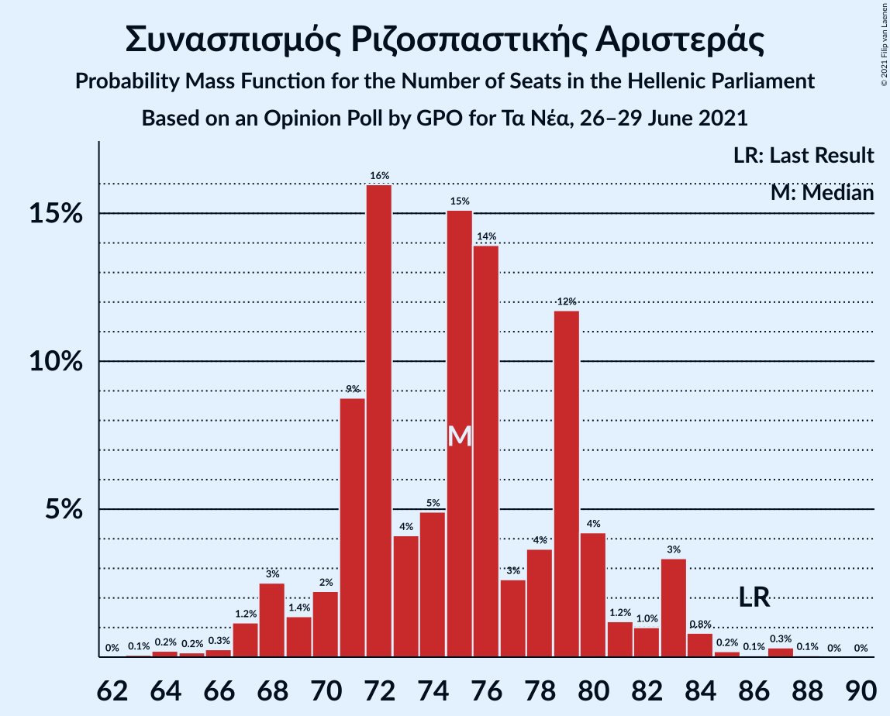

| Number of Seats | Probability | Accumulated | Special Marks |
|:---------------:|:-----------:|:-----------:|:-------------:|
| 63 | 0.1% | 100% |  |
| 64 | 0.2% | 99.9% |  |
| 65 | 0.2% | 99.7% |  |
| 66 | 0.3% | 99.6% |  |
| 67 | 1.2% | 99.3% |  |
| 68 | 3% | 98% |  |
| 69 | 1.4% | 96% |  |
| 70 | 2% | 94% |  |
| 71 | 9% | 92% |  |
| 72 | 16% | 83% |  |
| 73 | 4% | 67% |  |
| 74 | 5% | 63% |  |
| 75 | 15% | 58% | Median |
| 76 | 14% | 43% |  |
| 77 | 3% | 29% |  |
| 78 | 4% | 27% |  |
| 79 | 12% | 23% |  |
| 80 | 4% | 11% |  |
| 81 | 1.2% | 7% |  |
| 82 | 1.0% | 6% |  |
| 83 | 3% | 5% |  |
| 84 | 0.8% | 1.5% |  |
| 85 | 0.2% | 0.6% |  |
| 86 | 0.1% | 0.5% | Last Result |
| 87 | 0.3% | 0.4% |  |
| 88 | 0.1% | 0.1% |  |
| 89 | 0% | 0% |  |

### Κίνημα Αλλαγής

*For a full overview of the results for this party, see the [Κίνημα Αλλαγής](party-κίνημααλλαγής.html) page.*

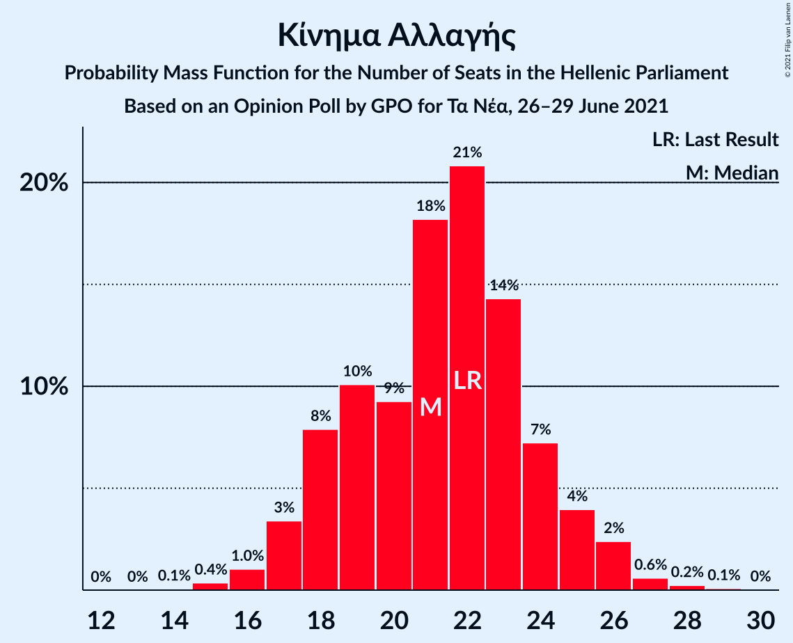

| Number of Seats | Probability | Accumulated | Special Marks |
|:---------------:|:-----------:|:-----------:|:-------------:|
| 14 | 0.1% | 100% |  |
| 15 | 0.4% | 99.9% |  |
| 16 | 1.0% | 99.6% |  |
| 17 | 3% | 98.5% |  |
| 18 | 8% | 95% |  |
| 19 | 10% | 87% |  |
| 20 | 9% | 77% |  |
| 21 | 18% | 68% | Median |
| 22 | 21% | 50% | Last Result |
| 23 | 14% | 29% |  |
| 24 | 7% | 15% |  |
| 25 | 4% | 7% |  |
| 26 | 2% | 3% |  |
| 27 | 0.6% | 1.0% |  |
| 28 | 0.2% | 0.4% |  |
| 29 | 0.1% | 0.1% |  |
| 30 | 0% | 0% |  |

### Κομμουνιστικό Κόμμα Ελλάδας

*For a full overview of the results for this party, see the [Κομμουνιστικό Κόμμα Ελλάδας](party-κομμουνιστικόκόμμαελλάδας.html) page.*

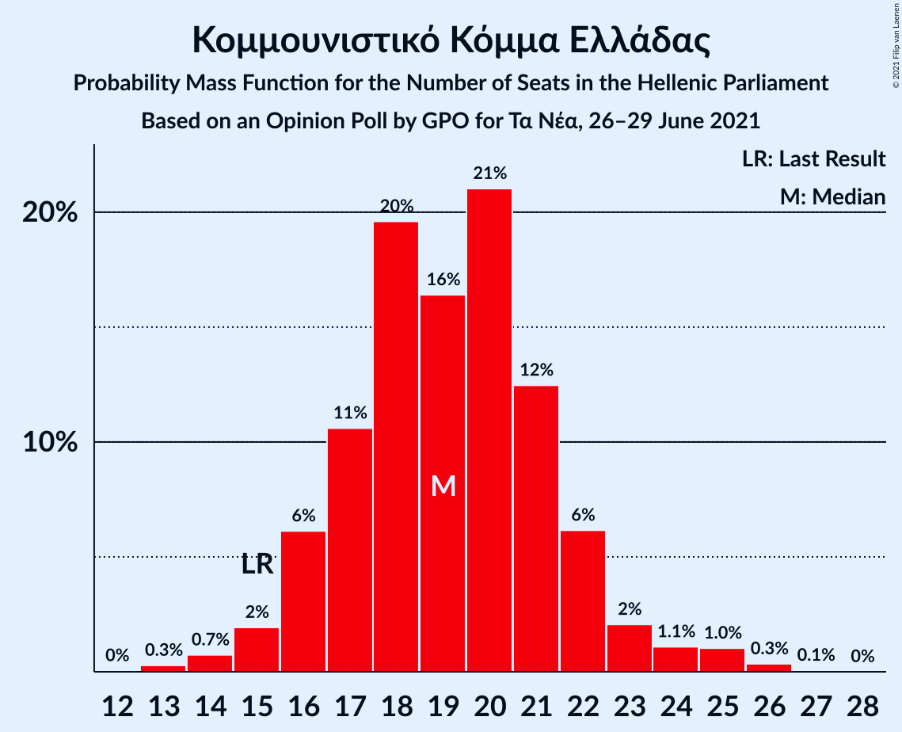

| Number of Seats | Probability | Accumulated | Special Marks |
|:---------------:|:-----------:|:-----------:|:-------------:|
| 12 | 0% | 100% |  |
| 13 | 0.3% | 99.9% |  |
| 14 | 0.7% | 99.7% |  |
| 15 | 2% | 98.9% | Last Result |
| 16 | 6% | 97% |  |
| 17 | 11% | 91% |  |
| 18 | 20% | 80% |  |
| 19 | 16% | 61% | Median |
| 20 | 21% | 44% |  |
| 21 | 12% | 23% |  |
| 22 | 6% | 11% |  |
| 23 | 2% | 5% |  |
| 24 | 1.1% | 3% |  |
| 25 | 1.0% | 1.5% |  |
| 26 | 0.3% | 0.4% |  |
| 27 | 0.1% | 0.1% |  |
| 28 | 0% | 0% |  |

### Ελληνική Λύση

*For a full overview of the results for this party, see the [Ελληνική Λύση](party-ελληνικήλύση.html) page.*

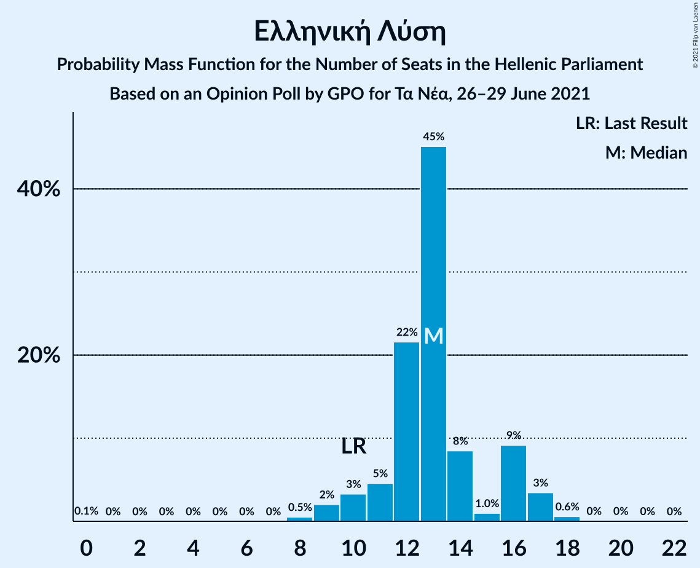

| Number of Seats | Probability | Accumulated | Special Marks |
|:---------------:|:-----------:|:-----------:|:-------------:|
| 0 | 0.1% | 100% |  |
| 1 | 0% | 99.9% |  |
| 2 | 0% | 99.9% |  |
| 3 | 0% | 99.9% |  |
| 4 | 0% | 99.9% |  |
| 5 | 0% | 99.9% |  |
| 6 | 0% | 99.9% |  |
| 7 | 0% | 99.9% |  |
| 8 | 0.5% | 99.9% |  |
| 9 | 2% | 99.4% |  |
| 10 | 3% | 97% | Last Result |
| 11 | 5% | 94% |  |
| 12 | 22% | 89% |  |
| 13 | 45% | 68% | Median |
| 14 | 8% | 23% |  |
| 15 | 1.0% | 14% |  |
| 16 | 9% | 13% |  |
| 17 | 3% | 4% |  |
| 18 | 0.6% | 0.7% |  |
| 19 | 0% | 0.1% |  |
| 20 | 0% | 0.1% |  |
| 21 | 0% | 0% |  |

### Μέτωπο Ευρωπαϊκής Ρεαλιστικής Ανυπακοής

*For a full overview of the results for this party, see the [Μέτωπο Ευρωπαϊκής Ρεαλιστικής Ανυπακοής](party-μέτωποευρωπαϊκήςρεαλιστικήςανυπακοής.html) page.*

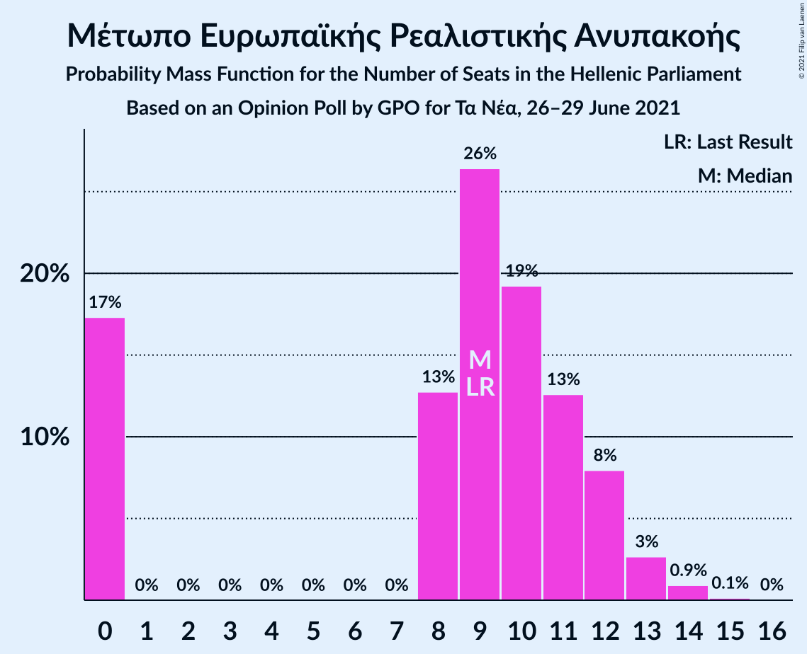

| Number of Seats | Probability | Accumulated | Special Marks |
|:---------------:|:-----------:|:-----------:|:-------------:|
| 0 | 17% | 100% |  |
| 1 | 0% | 83% |  |
| 2 | 0% | 83% |  |
| 3 | 0% | 83% |  |
| 4 | 0% | 83% |  |
| 5 | 0% | 83% |  |
| 6 | 0% | 83% |  |
| 7 | 0% | 83% |  |
| 8 | 13% | 83% |  |
| 9 | 26% | 70% | Last Result, Median |
| 10 | 19% | 44% |  |
| 11 | 13% | 24% |  |
| 12 | 8% | 12% |  |
| 13 | 3% | 4% |  |
| 14 | 0.9% | 1.1% |  |
| 15 | 0.1% | 0.2% |  |
| 16 | 0% | 0% |  |

## Coalitions

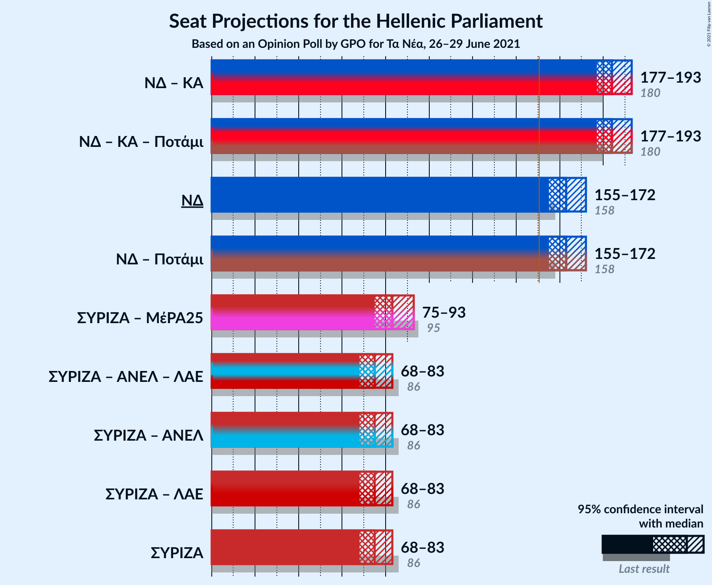

### Confidence Intervals

| Coalition | Last Result | Median | Majority? | 80% Confidence Interval | 90% Confidence Interval | 95% Confidence Interval | 99% Confidence Interval |
|:---------:|:-----------:|:------:|:---------:|:-----------------------:|:-----------------------:|:-----------------------:|:-----------------------:|
| Νέα Δημοκρατία – Κίνημα Αλλαγής | 180 | 184 | 100% | 179–191 | 178–192 | 177–193 | 174–198 |
| Νέα Δημοκρατία | 158 | 163 | 99.9% | 158–169 | 157–171 | 155–172 | 153–176 |
| Συνασπισμός Ριζοσπαστικής Αριστεράς – Μέτωπο Ευρωπαϊκής Ρεαλιστικής Ανυπακοής | 95 | 83 | 0% | 77–90 | 75–90 | 75–93 | 71–94 |
| Συνασπισμός Ριζοσπαστικής Αριστεράς | 86 | 75 | 0% | 71–80 | 69–82 | 68–83 | 66–85 |

### Νέα Δημοκρατία – Κίνημα Αλλαγής

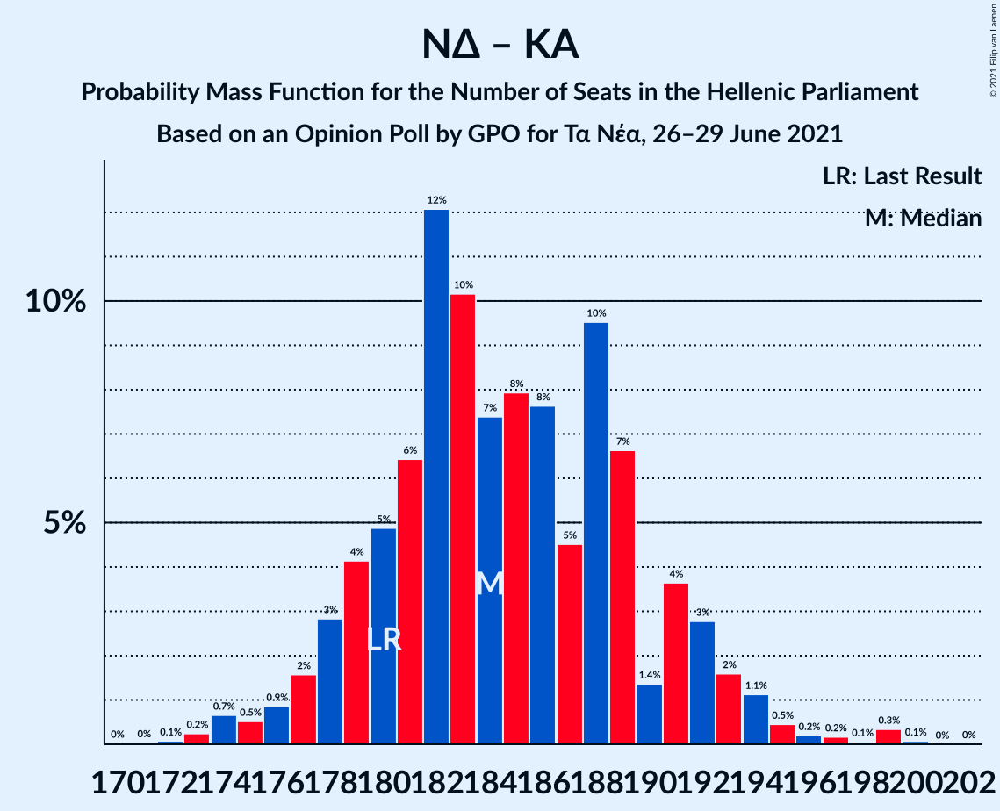

| Number of Seats | Probability | Accumulated | Special Marks |
|:---------------:|:-----------:|:-----------:|:-------------:|
| 171 | 0% | 100% |  |
| 172 | 0.1% | 99.9% |  |
| 173 | 0.2% | 99.8% |  |
| 174 | 0.7% | 99.6% |  |
| 175 | 0.5% | 98.9% |  |
| 176 | 0.9% | 98% |  |
| 177 | 2% | 98% |  |
| 178 | 3% | 96% |  |
| 179 | 4% | 93% |  |
| 180 | 5% | 89% | Last Result |
| 181 | 6% | 84% |  |
| 182 | 12% | 78% |  |
| 183 | 10% | 66% |  |
| 184 | 7% | 55% | Median |
| 185 | 8% | 48% |  |
| 186 | 8% | 40% |  |
| 187 | 5% | 33% |  |
| 188 | 10% | 28% |  |
| 189 | 7% | 18% |  |
| 190 | 1.4% | 12% |  |
| 191 | 4% | 10% |  |
| 192 | 3% | 7% |  |
| 193 | 2% | 4% |  |
| 194 | 1.1% | 2% |  |
| 195 | 0.5% | 1.3% |  |
| 196 | 0.2% | 0.9% |  |
| 197 | 0.2% | 0.7% |  |
| 198 | 0.1% | 0.5% |  |
| 199 | 0.3% | 0.4% |  |
| 200 | 0.1% | 0.1% |  |
| 201 | 0% | 0% |  |

### Νέα Δημοκρατία

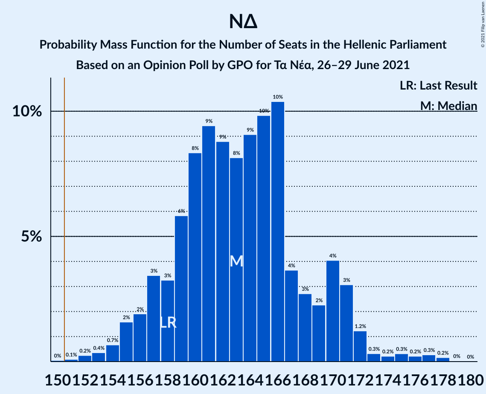

| Number of Seats | Probability | Accumulated | Special Marks |
|:---------------:|:-----------:|:-----------:|:-------------:|
| 150 | 0% | 100% |  |
| 151 | 0.1% | 99.9% | Majority |
| 152 | 0.2% | 99.8% |  |
| 153 | 0.4% | 99.6% |  |
| 154 | 0.7% | 99.2% |  |
| 155 | 2% | 98.5% |  |
| 156 | 2% | 97% |  |
| 157 | 3% | 95% |  |
| 158 | 3% | 92% | Last Result |
| 159 | 6% | 88% |  |
| 160 | 8% | 83% |  |
| 161 | 9% | 74% |  |
| 162 | 9% | 65% |  |
| 163 | 8% | 56% | Median |
| 164 | 9% | 48% |  |
| 165 | 10% | 39% |  |
| 166 | 10% | 29% |  |
| 167 | 4% | 19% |  |
| 168 | 3% | 15% |  |
| 169 | 2% | 12% |  |
| 170 | 4% | 10% |  |
| 171 | 3% | 6% |  |
| 172 | 1.2% | 3% |  |
| 173 | 0.3% | 2% |  |
| 174 | 0.2% | 1.2% |  |
| 175 | 0.3% | 1.0% |  |
| 176 | 0.2% | 0.7% |  |
| 177 | 0.3% | 0.5% |  |
| 178 | 0.2% | 0.2% |  |
| 179 | 0% | 0.1% |  |
| 180 | 0% | 0% |  |

### Συνασπισμός Ριζοσπαστικής Αριστεράς – Μέτωπο Ευρωπαϊκής Ρεαλιστικής Ανυπακοής

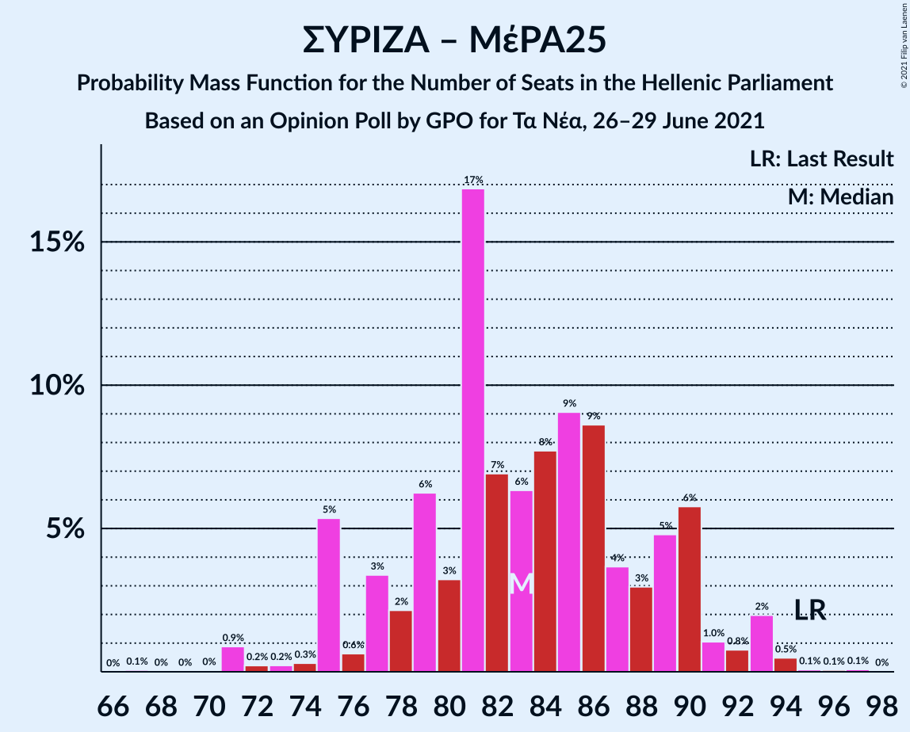

| Number of Seats | Probability | Accumulated | Special Marks |
|:---------------:|:-----------:|:-----------:|:-------------:|
| 67 | 0.1% | 100% |  |
| 68 | 0% | 99.9% |  |
| 69 | 0% | 99.9% |  |
| 70 | 0% | 99.9% |  |
| 71 | 0.9% | 99.8% |  |
| 72 | 0.2% | 99.0% |  |
| 73 | 0.2% | 98.7% |  |
| 74 | 0.3% | 98.5% |  |
| 75 | 5% | 98% |  |
| 76 | 0.6% | 93% |  |
| 77 | 3% | 92% |  |
| 78 | 2% | 89% |  |
| 79 | 6% | 87% |  |
| 80 | 3% | 80% |  |
| 81 | 17% | 77% |  |
| 82 | 7% | 60% |  |
| 83 | 6% | 53% |  |
| 84 | 8% | 47% | Median |
| 85 | 9% | 39% |  |
| 86 | 9% | 30% |  |
| 87 | 4% | 22% |  |
| 88 | 3% | 18% |  |
| 89 | 5% | 15% |  |
| 90 | 6% | 10% |  |
| 91 | 1.0% | 5% |  |
| 92 | 0.8% | 3% |  |
| 93 | 2% | 3% |  |
| 94 | 0.5% | 0.7% |  |
| 95 | 0.1% | 0.3% | Last Result |
| 96 | 0.1% | 0.2% |  |
| 97 | 0.1% | 0.1% |  |
| 98 | 0% | 0% |  |

### Συνασπισμός Ριζοσπαστικής Αριστεράς

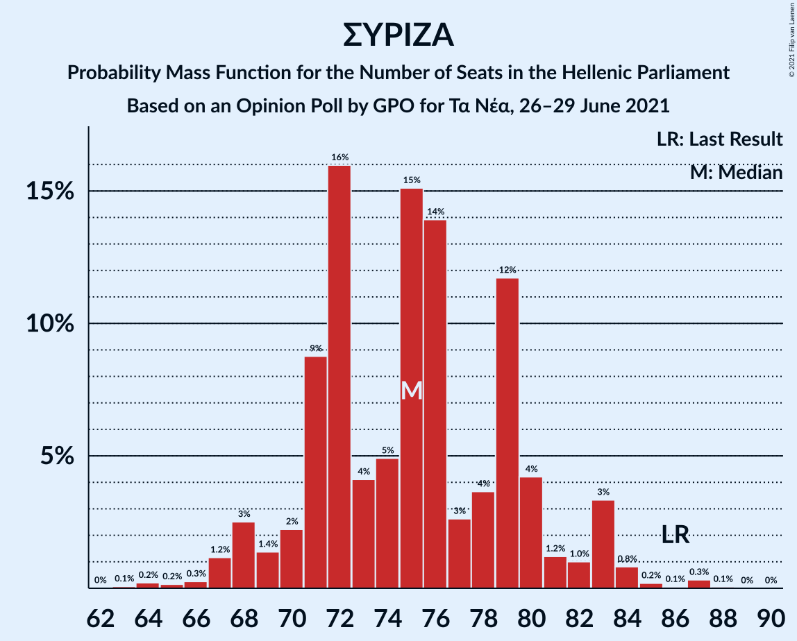

| Number of Seats | Probability | Accumulated | Special Marks |
|:---------------:|:-----------:|:-----------:|:-------------:|
| 63 | 0.1% | 100% |  |
| 64 | 0.2% | 99.9% |  |
| 65 | 0.2% | 99.7% |  |
| 66 | 0.3% | 99.6% |  |
| 67 | 1.2% | 99.3% |  |
| 68 | 3% | 98% |  |
| 69 | 1.4% | 96% |  |
| 70 | 2% | 94% |  |
| 71 | 9% | 92% |  |
| 72 | 16% | 83% |  |
| 73 | 4% | 67% |  |
| 74 | 5% | 63% |  |
| 75 | 15% | 58% | Median |
| 76 | 14% | 43% |  |
| 77 | 3% | 29% |  |
| 78 | 4% | 27% |  |
| 79 | 12% | 23% |  |
| 80 | 4% | 11% |  |
| 81 | 1.2% | 7% |  |
| 82 | 1.0% | 6% |  |
| 83 | 3% | 5% |  |
| 84 | 0.8% | 1.5% |  |
| 85 | 0.2% | 0.6% |  |
| 86 | 0.1% | 0.5% | Last Result |
| 87 | 0.3% | 0.4% |  |
| 88 | 0.1% | 0.1% |  |
| 89 | 0% | 0% |  |

## Technical Information

### Opinion Poll

+ **Polling firm:** GPO
+ **Commissioner(s):** Τα Νέα
+ **Fieldwork period:** 26–29 June 2021

### Calculations

+ **Sample size:** 1000
+ **Simulations done:** 131,072
+ **Error estimate:** 1.75%

