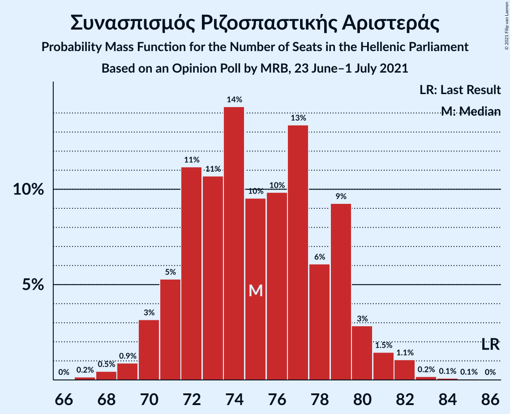
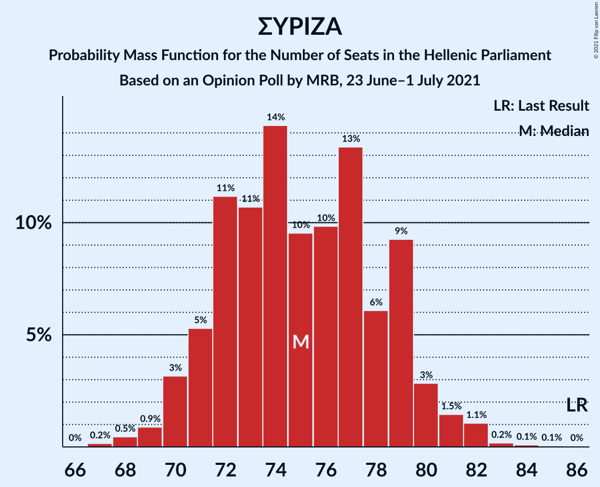

# Opinion Poll by MRB, 23 June–1 July 2021

<a href="#voting-intentions">Voting Intentions</a> | <a href="#seats">Seats</a> | <a href="#coalitions">Coalitions</a> | <a href="#technical-information">Technical Information</a>

## Voting Intentions

### Confidence Intervals

| Party | Last Result | Poll Result | 80% Confidence Interval | 90% Confidence Interval | 95% Confidence Interval | 99% Confidence Interval |
|:-----:|:-----------:|:-----------:|:-----------------------:|:-----------------------:|:-----------------------:|:-----------------------:|
| Νέα Δημοκρατία | 39.8% | 43.6% | 42.2–45.0% |41.8–45.4% |41.4–45.8% |40.8–46.5% |
| Συνασπισμός Ριζοσπαστικής Αριστεράς | 31.5% | 28.3% | 27.0–29.6% |26.7–30.0% |26.4–30.3% |25.8–31.0% |
| Κίνημα Αλλαγής | 8.1% | 8.4% | 7.7–9.3% |7.4–9.5% |7.3–9.7% |6.9–10.1% |
| Κομμουνιστικό Κόμμα Ελλάδας | 5.3% | 6.2% | 5.5–7.0% |5.4–7.2% |5.2–7.3% |4.9–7.7% |
| Ελληνική Λύση | 3.7% | 4.2% | 3.7–4.8% |3.5–5.0% |3.4–5.2% |3.2–5.5% |
| Μέτωπο Ευρωπαϊκής Ρεαλιστικής Ανυπακοής | 3.4% | 3.6% | 3.1–4.2% |3.0–4.4% |2.9–4.5% |2.7–4.8% |
| Χρυσή Αυγή | 2.9% | 1.4% | 1.1–1.8% |1.0–1.9% |1.0–2.0% |0.8–2.2% |

*Note:* The poll result column reflects the actual value used in the calculations. Published results may vary slightly, and in addition be rounded to fewer digits.

## Seats

### Confidence Intervals

| Party | Last Result | Median | 80% Confidence Interval | 90% Confidence Interval | 95% Confidence Interval | 99% Confidence Interval |
|:-----:|:-----------:|:------:|:-----------------------:|:-----------------------:|:-----------------------:|:-----------------------:|
| <a href="#νέα-δημοκρατία">Νέα Δημοκρατία</a> | 158 | 166 | 162–170 |161–171 |160–172 |158–174 |
| <a href="#συνασπισμός-ριζοσπαστικής-αριστεράς">Συνασπισμός Ριζοσπαστικής Αριστεράς</a> | 86 | 75 | 72–79 |71–80 |70–81 |68–82 |
| <a href="#κίνημα-αλλαγής">Κίνημα Αλλαγής</a> | 22 | 22 | 20–25 |20–25 |19–26 |19–27 |
| <a href="#κομμουνιστικό-κόμμα-ελλάδας">Κομμουνιστικό Κόμμα Ελλάδας</a> | 15 | 16 | 15–18 |14–19 |14–19 |13–21 |
| <a href="#ελληνική-λύση">Ελληνική Λύση</a> | 10 | 11 | 10–13 |9–13 |9–14 |8–14 |
| <a href="#μέτωπο-ευρωπαϊκής-ρεαλιστικής-ανυπακοής">Μέτωπο Ευρωπαϊκής Ρεαλιστικής Ανυπακοής</a> | 9 | 10 | 8–11 |0–12 |0–12 |0–13 |
| <a href="#χρυσή-αυγή">Χρυσή Αυγή</a> | 0 | 0 | 0 |0 |0 |0 |

### Νέα Δημοκρατία

*For a full overview of the results for this party, see the [Νέα Δημοκρατία](party-νέαδημοκρατία.html) page.*

| Number of Seats | Probability | Accumulated | Special Marks |
|:---------------:|:-----------:|:-----------:|:-------------:|
| 156 | 0% | 100% |  |
| 157 | 0.3% | 99.9% |  |
| 158 | 0.4% | 99.7% | Last Result |
| 159 | 1.1% | 99.3% |  |
| 160 | 1.5% | 98% |  |
| 161 | 6% | 97% |  |
| 162 | 5% | 91% |  |
| 163 | 16% | 86% |  |
| 164 | 7% | 70% |  |
| 165 | 13% | 63% |  |
| 166 | 12% | 50% | Median |
| 167 | 9% | 39% |  |
| 168 | 14% | 29% |  |
| 169 | 4% | 16% |  |
| 170 | 5% | 12% |  |
| 171 | 4% | 7% |  |
| 172 | 1.0% | 3% |  |
| 173 | 2% | 2% |  |
| 174 | 0.4% | 0.7% |  |
| 175 | 0.1% | 0.3% |  |
| 176 | 0.1% | 0.2% |  |
| 177 | 0% | 0.1% |  |
| 178 | 0% | 0% |  |

### Συνασπισμός Ριζοσπαστικής Αριστεράς

*For a full overview of the results for this party, see the [Συνασπισμός Ριζοσπαστικής Αριστεράς](party-συνασπισμόςριζοσπαστικήςαριστεράς.html) page.*

| Number of Seats | Probability | Accumulated | Special Marks |
|:---------------:|:-----------:|:-----------:|:-------------:|
| 66 | 0% | 100% |  |
| 67 | 0.2% | 99.9% |  |
| 68 | 0.5% | 99.8% |  |
| 69 | 0.9% | 99.3% |  |
| 70 | 3% | 98% |  |
| 71 | 5% | 95% |  |
| 72 | 11% | 90% |  |
| 73 | 11% | 79% |  |
| 74 | 14% | 68% |  |
| 75 | 10% | 54% | Median |
| 76 | 10% | 44% |  |
| 77 | 13% | 34% |  |
| 78 | 6% | 21% |  |
| 79 | 9% | 15% |  |
| 80 | 3% | 6% |  |
| 81 | 1.5% | 3% |  |
| 82 | 1.1% | 1.4% |  |
| 83 | 0.2% | 0.4% |  |
| 84 | 0.1% | 0.2% |  |
| 85 | 0.1% | 0.1% |  |
| 86 | 0% | 0% | Last Result |

### Κίνημα Αλλαγής

*For a full overview of the results for this party, see the [Κίνημα Αλλαγής](party-κίνημααλλαγής.html) page.*

| Number of Seats | Probability | Accumulated | Special Marks |
|:---------------:|:-----------:|:-----------:|:-------------:|
| 17 | 0.1% | 100% |  |
| 18 | 0.4% | 99.9% |  |
| 19 | 4% | 99.5% |  |
| 20 | 9% | 96% |  |
| 21 | 14% | 87% |  |
| 22 | 31% | 73% | Last Result, Median |
| 23 | 18% | 42% |  |
| 24 | 12% | 24% |  |
| 25 | 9% | 12% |  |
| 26 | 3% | 3% |  |
| 27 | 0.6% | 0.7% |  |
| 28 | 0.1% | 0.2% |  |
| 29 | 0% | 0% |  |

### Κομμουνιστικό Κόμμα Ελλάδας

*For a full overview of the results for this party, see the [Κομμουνιστικό Κόμμα Ελλάδας](party-κομμουνιστικόκόμμαελλάδας.html) page.*

| Number of Seats | Probability | Accumulated | Special Marks |
|:---------------:|:-----------:|:-----------:|:-------------:|
| 12 | 0.1% | 100% |  |
| 13 | 1.2% | 99.9% |  |
| 14 | 7% | 98.7% |  |
| 15 | 17% | 92% | Last Result |
| 16 | 25% | 75% | Median |
| 17 | 24% | 50% |  |
| 18 | 16% | 26% |  |
| 19 | 7% | 10% |  |
| 20 | 2% | 2% |  |
| 21 | 0.4% | 0.5% |  |
| 22 | 0.1% | 0.1% |  |
| 23 | 0% | 0% |  |

### Ελληνική Λύση

*For a full overview of the results for this party, see the [Ελληνική Λύση](party-ελληνικήλύση.html) page.*

| Number of Seats | Probability | Accumulated | Special Marks |
|:---------------:|:-----------:|:-----------:|:-------------:|
| 0 | 0.2% | 100% |  |
| 1 | 0% | 99.8% |  |
| 2 | 0% | 99.8% |  |
| 3 | 0% | 99.8% |  |
| 4 | 0% | 99.8% |  |
| 5 | 0% | 99.8% |  |
| 6 | 0% | 99.8% |  |
| 7 | 0% | 99.8% |  |
| 8 | 0.4% | 99.8% |  |
| 9 | 7% | 99.4% |  |
| 10 | 19% | 93% | Last Result |
| 11 | 34% | 73% | Median |
| 12 | 23% | 39% |  |
| 13 | 13% | 16% |  |
| 14 | 3% | 3% |  |
| 15 | 0.4% | 0.5% |  |
| 16 | 0.1% | 0.1% |  |
| 17 | 0% | 0% |  |

### Μέτωπο Ευρωπαϊκής Ρεαλιστικής Ανυπακοής

*For a full overview of the results for this party, see the [Μέτωπο Ευρωπαϊκής Ρεαλιστικής Ανυπακοής](party-μέτωποευρωπαϊκήςρεαλιστικήςανυπακοής.html) page.*

| Number of Seats | Probability | Accumulated | Special Marks |
|:---------------:|:-----------:|:-----------:|:-------------:|
| 0 | 7% | 100% |  |
| 1 | 0% | 93% |  |
| 2 | 0% | 93% |  |
| 3 | 0% | 93% |  |
| 4 | 0% | 93% |  |
| 5 | 0% | 93% |  |
| 6 | 0% | 93% |  |
| 7 | 0% | 93% |  |
| 8 | 9% | 93% |  |
| 9 | 29% | 84% | Last Result |
| 10 | 31% | 55% | Median |
| 11 | 18% | 24% |  |
| 12 | 4% | 6% |  |
| 13 | 1.2% | 1.3% |  |
| 14 | 0.1% | 0.1% |  |
| 15 | 0% | 0% |  |

### Χρυσή Αυγή

*For a full overview of the results for this party, see the [Χρυσή Αυγή](party-χρυσήαυγή.html) page.*

| Number of Seats | Probability | Accumulated | Special Marks |
|:---------------:|:-----------:|:-----------:|:-------------:|
| 0 | 100% | 100% | Last Result, Median |

## Coalitions

### Confidence Intervals

| Coalition | Last Result | Median | Majority? | 80% Confidence Interval | 90% Confidence Interval | 95% Confidence Interval | 99% Confidence Interval |
|:---------:|:-----------:|:------:|:---------:|:-----------------------:|:-----------------------:|:-----------------------:|:-----------------------:|
| Νέα Δημοκρατία – Κίνημα Αλλαγής | 180 | 188 | 100% | 184–192 | 183–193 | 182–195 | 180–197 |
| Νέα Δημοκρατία | 158 | 166 | 100% | 162–170 | 161–171 | 160–172 | 158–174 |
| Συνασπισμός Ριζοσπαστικής Αριστεράς – Μέτωπο Ευρωπαϊκής Ρεαλιστικής Ανυπακοής | 95 | 84 | 0% | 80–88 | 79–89 | 77–90 | 75–91 |
| Συνασπισμός Ριζοσπαστικής Αριστεράς | 86 | 75 | 0% | 72–79 | 71–80 | 70–81 | 68–82 |

### Νέα Δημοκρατία – Κίνημα Αλλαγής

| Number of Seats | Probability | Accumulated | Special Marks |
|:---------------:|:-----------:|:-----------:|:-------------:|
| 178 | 0.1% | 100% |  |
| 179 | 0.1% | 99.9% |  |
| 180 | 0.4% | 99.8% | Last Result |
| 181 | 0.7% | 99.4% |  |
| 182 | 3% | 98.7% |  |
| 183 | 3% | 96% |  |
| 184 | 7% | 93% |  |
| 185 | 13% | 86% |  |
| 186 | 7% | 73% |  |
| 187 | 7% | 66% |  |
| 188 | 14% | 59% | Median |
| 189 | 10% | 45% |  |
| 190 | 14% | 35% |  |
| 191 | 7% | 21% |  |
| 192 | 7% | 14% |  |
| 193 | 2% | 7% |  |
| 194 | 2% | 5% |  |
| 195 | 2% | 3% |  |
| 196 | 0.3% | 1.0% |  |
| 197 | 0.4% | 0.7% |  |
| 198 | 0.1% | 0.4% |  |
| 199 | 0.1% | 0.2% |  |
| 200 | 0.1% | 0.1% |  |
| 201 | 0% | 0% |  |

### Νέα Δημοκρατία

| Number of Seats | Probability | Accumulated | Special Marks |
|:---------------:|:-----------:|:-----------:|:-------------:|
| 156 | 0% | 100% |  |
| 157 | 0.3% | 99.9% |  |
| 158 | 0.4% | 99.7% | Last Result |
| 159 | 1.1% | 99.3% |  |
| 160 | 1.5% | 98% |  |
| 161 | 6% | 97% |  |
| 162 | 5% | 91% |  |
| 163 | 16% | 86% |  |
| 164 | 7% | 70% |  |
| 165 | 13% | 63% |  |
| 166 | 12% | 50% | Median |
| 167 | 9% | 39% |  |
| 168 | 14% | 29% |  |
| 169 | 4% | 16% |  |
| 170 | 5% | 12% |  |
| 171 | 4% | 7% |  |
| 172 | 1.0% | 3% |  |
| 173 | 2% | 2% |  |
| 174 | 0.4% | 0.7% |  |
| 175 | 0.1% | 0.3% |  |
| 176 | 0.1% | 0.2% |  |
| 177 | 0% | 0.1% |  |
| 178 | 0% | 0% |  |

### Συνασπισμός Ριζοσπαστικής Αριστεράς – Μέτωπο Ευρωπαϊκής Ρεαλιστικής Ανυπακοής

| Number of Seats | Probability | Accumulated | Special Marks |
|:---------------:|:-----------:|:-----------:|:-------------:|
| 71 | 0% | 100% |  |
| 72 | 0% | 99.9% |  |
| 73 | 0.1% | 99.9% |  |
| 74 | 0.2% | 99.8% |  |
| 75 | 0.2% | 99.6% |  |
| 76 | 0.4% | 99.4% |  |
| 77 | 2% | 98.9% |  |
| 78 | 2% | 97% |  |
| 79 | 3% | 96% |  |
| 80 | 6% | 93% |  |
| 81 | 3% | 86% |  |
| 82 | 13% | 83% |  |
| 83 | 12% | 70% |  |
| 84 | 12% | 58% |  |
| 85 | 8% | 46% | Median |
| 86 | 11% | 38% |  |
| 87 | 10% | 27% |  |
| 88 | 10% | 17% |  |
| 89 | 5% | 8% |  |
| 90 | 1.4% | 3% |  |
| 91 | 1.4% | 2% |  |
| 92 | 0.2% | 0.4% |  |
| 93 | 0.1% | 0.2% |  |
| 94 | 0% | 0.1% |  |
| 95 | 0% | 0% | Last Result |

### Συνασπισμός Ριζοσπαστικής Αριστεράς

| Number of Seats | Probability | Accumulated | Special Marks |
|:---------------:|:-----------:|:-----------:|:-------------:|
| 66 | 0% | 100% |  |
| 67 | 0.2% | 99.9% |  |
| 68 | 0.5% | 99.8% |  |
| 69 | 0.9% | 99.3% |  |
| 70 | 3% | 98% |  |
| 71 | 5% | 95% |  |
| 72 | 11% | 90% |  |
| 73 | 11% | 79% |  |
| 74 | 14% | 68% |  |
| 75 | 10% | 54% | Median |
| 76 | 10% | 44% |  |
| 77 | 13% | 34% |  |
| 78 | 6% | 21% |  |
| 79 | 9% | 15% |  |
| 80 | 3% | 6% |  |
| 81 | 1.5% | 3% |  |
| 82 | 1.1% | 1.4% |  |
| 83 | 0.2% | 0.4% |  |
| 84 | 0.1% | 0.2% |  |
| 85 | 0.1% | 0.1% |  |
| 86 | 0% | 0% | Last Result |

## Technical Information

### Opinion Poll

+ **Polling firm:** MRB
+ **Commissioner(s):** —
+ **Fieldwork period:** 23 June–1 July 2021

### Calculations

+ **Sample size:** 2000
+ **Simulations done:** 131,072
+ **Error estimate:** 2.01%

