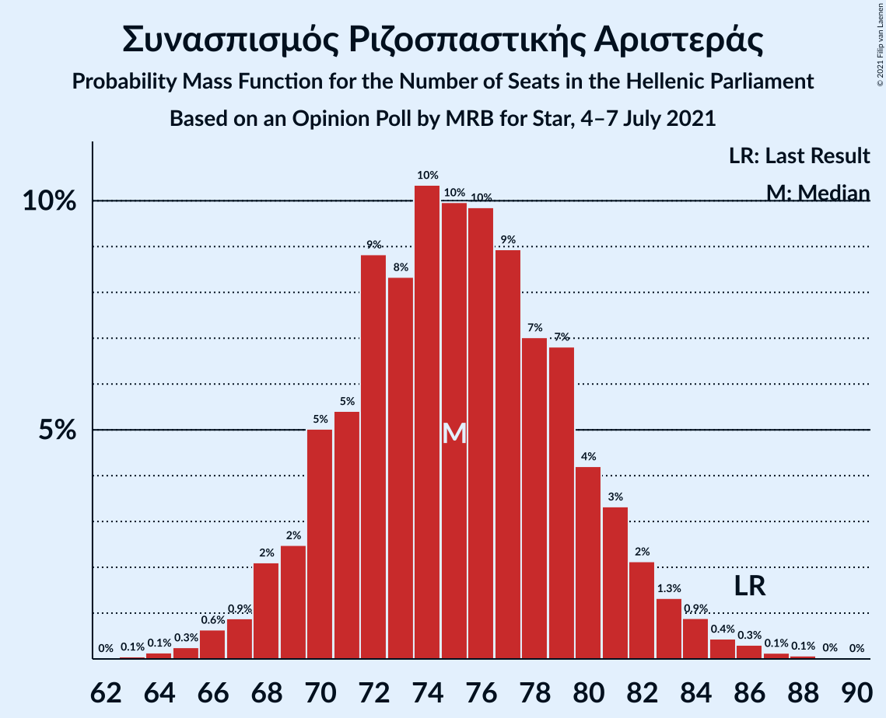
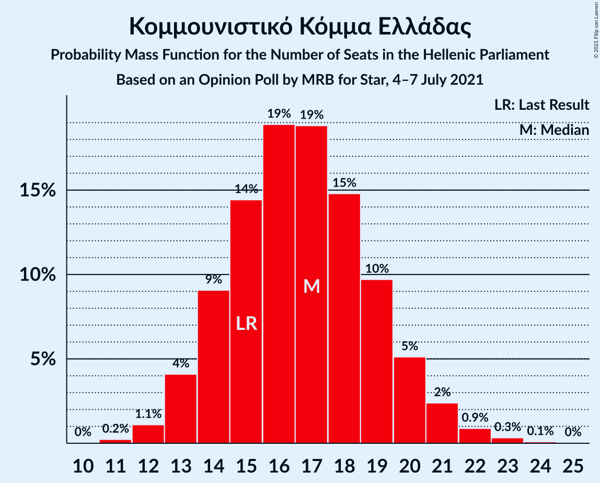
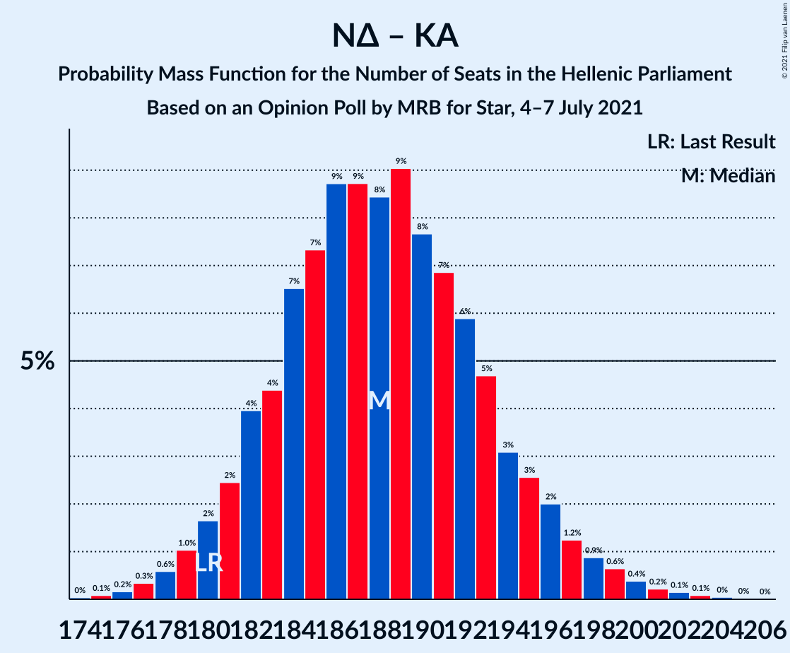

# Opinion Poll by MRB for Star, 4–7 July 2021

<a href="#voting-intentions">Voting Intentions</a> | <a href="#seats">Seats</a> | <a href="#coalitions">Coalitions</a> | <a href="#technical-information">Technical Information</a>

## Voting Intentions

### Confidence Intervals

| Party | Last Result | Poll Result | 80% Confidence Interval | 90% Confidence Interval | 95% Confidence Interval | 99% Confidence Interval |
|:-----:|:-----------:|:-----------:|:-----------------------:|:-----------------------:|:-----------------------:|:-----------------------:|
| Νέα Δημοκρατία | 39.8% | 43.6% | 41.6–45.6% |41.0–46.2% |40.5–46.7% |39.6–47.7% |
| Συνασπισμός Ριζοσπαστικής Αριστεράς | 31.5% | 28.3% | 26.5–30.2% |26.0–30.7% |25.6–31.2% |24.8–32.1% |
| Κίνημα Αλλαγής | 8.1% | 8.4% | 7.4–9.6% |7.1–10.0% |6.8–10.3% |6.4–10.9% |
| Κομμουνιστικό Κόμμα Ελλάδας | 5.3% | 6.2% | 5.3–7.3% |5.1–7.6% |4.9–7.9% |4.5–8.4% |
| Ελληνική Λύση | 3.7% | 4.2% | 3.5–5.1% |3.3–5.4% |3.1–5.6% |2.8–6.1% |
| Μέτωπο Ευρωπαϊκής Ρεαλιστικής Ανυπακοής | 3.4% | 3.6% | 2.9–4.5% |2.8–4.7% |2.6–5.0% |2.3–5.4% |

*Note:* The poll result column reflects the actual value used in the calculations. Published results may vary slightly, and in addition be rounded to fewer digits.

## Seats

### Confidence Intervals

| Party | Last Result | Median | 80% Confidence Interval | 90% Confidence Interval | 95% Confidence Interval | 99% Confidence Interval |
|:-----:|:-----------:|:------:|:-----------------------:|:-----------------------:|:-----------------------:|:-----------------------:|
| <a href="#νέα-δημοκρατία">Νέα Δημοκρατία</a> | 158 | 165 | 160–171 |159–173 |157–175 |155–178 |
| <a href="#συνασπισμός-ριζοσπαστικής-αριστεράς">Συνασπισμός Ριζοσπαστικής Αριστεράς</a> | 86 | 75 | 70–80 |69–82 |68–83 |66–86 |
| <a href="#κίνημα-αλλαγής">Κίνημα Αλλαγής</a> | 22 | 22 | 20–26 |19–26 |18–27 |17–29 |
| <a href="#κομμουνιστικό-κόμμα-ελλάδας">Κομμουνιστικό Κόμμα Ελλάδας</a> | 15 | 17 | 14–19 |13–20 |13–21 |12–22 |
| <a href="#ελληνική-λύση">Ελληνική Λύση</a> | 10 | 11 | 9–14 |9–14 |8–15 |0–16 |
| <a href="#μέτωπο-ευρωπαϊκής-ρεαλιστικής-ανυπακοής">Μέτωπο Ευρωπαϊκής Ρεαλιστικής Ανυπακοής</a> | 9 | 10 | 0–12 |0–12 |0–13 |0–14 |

### Νέα Δημοκρατία

*For a full overview of the results for this party, see the [Νέα Δημοκρατία](party-νέαδημοκρατία.html) page.*

| Number of Seats | Probability | Accumulated | Special Marks |
|:---------------:|:-----------:|:-----------:|:-------------:|
| 152 | 0.1% | 100% |  |
| 153 | 0.1% | 99.9% |  |
| 154 | 0.2% | 99.8% |  |
| 155 | 0.4% | 99.6% |  |
| 156 | 0.7% | 99.2% |  |
| 157 | 1.3% | 98% |  |
| 158 | 2% | 97% | Last Result |
| 159 | 3% | 95% |  |
| 160 | 4% | 92% |  |
| 161 | 6% | 88% |  |
| 162 | 6% | 83% |  |
| 163 | 9% | 76% |  |
| 164 | 8% | 68% |  |
| 165 | 10% | 60% | Median |
| 166 | 8% | 50% |  |
| 167 | 9% | 41% |  |
| 168 | 8% | 33% |  |
| 169 | 7% | 25% |  |
| 170 | 5% | 18% |  |
| 171 | 4% | 13% |  |
| 172 | 3% | 9% |  |
| 173 | 2% | 6% |  |
| 174 | 2% | 4% |  |
| 175 | 1.0% | 3% |  |
| 176 | 0.6% | 2% |  |
| 177 | 0.4% | 0.9% |  |
| 178 | 0.2% | 0.5% |  |
| 179 | 0.1% | 0.3% |  |
| 180 | 0.1% | 0.2% |  |
| 181 | 0% | 0.1% |  |
| 182 | 0% | 0% |  |

### Συνασπισμός Ριζοσπαστικής Αριστεράς

*For a full overview of the results for this party, see the [Συνασπισμός Ριζοσπαστικής Αριστεράς](party-συνασπισμόςριζοσπαστικήςαριστεράς.html) page.*

| Number of Seats | Probability | Accumulated | Special Marks |
|:---------------:|:-----------:|:-----------:|:-------------:|
| 63 | 0.1% | 100% |  |
| 64 | 0.1% | 99.9% |  |
| 65 | 0.3% | 99.8% |  |
| 66 | 0.6% | 99.5% |  |
| 67 | 0.9% | 98.9% |  |
| 68 | 2% | 98% |  |
| 69 | 2% | 96% |  |
| 70 | 5% | 93% |  |
| 71 | 5% | 88% |  |
| 72 | 9% | 83% |  |
| 73 | 8% | 74% |  |
| 74 | 10% | 66% |  |
| 75 | 10% | 55% | Median |
| 76 | 10% | 46% |  |
| 77 | 9% | 36% |  |
| 78 | 7% | 27% |  |
| 79 | 7% | 20% |  |
| 80 | 4% | 13% |  |
| 81 | 3% | 9% |  |
| 82 | 2% | 5% |  |
| 83 | 1.3% | 3% |  |
| 84 | 0.9% | 2% |  |
| 85 | 0.4% | 1.0% |  |
| 86 | 0.3% | 0.6% | Last Result |
| 87 | 0.1% | 0.3% |  |
| 88 | 0.1% | 0.1% |  |
| 89 | 0% | 0.1% |  |
| 90 | 0% | 0% |  |

### Κίνημα Αλλαγής

*For a full overview of the results for this party, see the [Κίνημα Αλλαγής](party-κίνημααλλαγής.html) page.*

| Number of Seats | Probability | Accumulated | Special Marks |
|:---------------:|:-----------:|:-----------:|:-------------:|
| 15 | 0% | 100% |  |
| 16 | 0.2% | 99.9% |  |
| 17 | 0.9% | 99.7% |  |
| 18 | 3% | 98.8% |  |
| 19 | 6% | 96% |  |
| 20 | 11% | 90% |  |
| 21 | 14% | 80% |  |
| 22 | 17% | 65% | Last Result, Median |
| 23 | 16% | 48% |  |
| 24 | 13% | 32% |  |
| 25 | 9% | 19% |  |
| 26 | 5% | 10% |  |
| 27 | 3% | 5% |  |
| 28 | 1.3% | 2% |  |
| 29 | 0.6% | 0.8% |  |
| 30 | 0.2% | 0.3% |  |
| 31 | 0.1% | 0.1% |  |
| 32 | 0% | 0% |  |

### Κομμουνιστικό Κόμμα Ελλάδας

*For a full overview of the results for this party, see the [Κομμουνιστικό Κόμμα Ελλάδας](party-κομμουνιστικόκόμμαελλάδας.html) page.*

| Number of Seats | Probability | Accumulated | Special Marks |
|:---------------:|:-----------:|:-----------:|:-------------:|
| 11 | 0.2% | 100% |  |
| 12 | 1.1% | 99.7% |  |
| 13 | 4% | 98.6% |  |
| 14 | 9% | 95% |  |
| 15 | 14% | 85% | Last Result |
| 16 | 19% | 71% |  |
| 17 | 19% | 52% | Median |
| 18 | 15% | 33% |  |
| 19 | 10% | 19% |  |
| 20 | 5% | 9% |  |
| 21 | 2% | 4% |  |
| 22 | 0.9% | 1.3% |  |
| 23 | 0.3% | 0.4% |  |
| 24 | 0.1% | 0.1% |  |
| 25 | 0% | 0% |  |

### Ελληνική Λύση

*For a full overview of the results for this party, see the [Ελληνική Λύση](party-ελληνικήλύση.html) page.*

| Number of Seats | Probability | Accumulated | Special Marks |
|:---------------:|:-----------:|:-----------:|:-------------:|
| 0 | 2% | 100% |  |
| 1 | 0% | 98% |  |
| 2 | 0% | 98% |  |
| 3 | 0% | 98% |  |
| 4 | 0% | 98% |  |
| 5 | 0% | 98% |  |
| 6 | 0% | 98% |  |
| 7 | 0% | 98% |  |
| 8 | 2% | 98% |  |
| 9 | 9% | 96% |  |
| 10 | 18% | 87% | Last Result |
| 11 | 24% | 69% | Median |
| 12 | 21% | 45% |  |
| 13 | 13% | 24% |  |
| 14 | 7% | 11% |  |
| 15 | 3% | 4% |  |
| 16 | 0.9% | 1.2% |  |
| 17 | 0.3% | 0.3% |  |
| 18 | 0.1% | 0.1% |  |
| 19 | 0% | 0% |  |

### Μέτωπο Ευρωπαϊκής Ρεαλιστικής Ανυπακοής

*For a full overview of the results for this party, see the [Μέτωπο Ευρωπαϊκής Ρεαλιστικής Ανυπακοής](party-μέτωποευρωπαϊκήςρεαλιστικήςανυπακοής.html) page.*

| Number of Seats | Probability | Accumulated | Special Marks |
|:---------------:|:-----------:|:-----------:|:-------------:|
| 0 | 13% | 100% |  |
| 1 | 0% | 87% |  |
| 2 | 0% | 87% |  |
| 3 | 0% | 87% |  |
| 4 | 0% | 87% |  |
| 5 | 0% | 87% |  |
| 6 | 0% | 87% |  |
| 7 | 0% | 87% |  |
| 8 | 10% | 87% |  |
| 9 | 23% | 78% | Last Result |
| 10 | 24% | 54% | Median |
| 11 | 17% | 30% |  |
| 12 | 9% | 14% |  |
| 13 | 4% | 5% |  |
| 14 | 1.0% | 1.4% |  |
| 15 | 0.3% | 0.4% |  |
| 16 | 0.1% | 0.1% |  |
| 17 | 0% | 0% |  |

## Coalitions

### Confidence Intervals

| Coalition | Last Result | Median | Majority? | 80% Confidence Interval | 90% Confidence Interval | 95% Confidence Interval | 99% Confidence Interval |
|:---------:|:-----------:|:------:|:---------:|:-----------------------:|:-----------------------:|:-----------------------:|:-----------------------:|
| Νέα Δημοκρατία – Κίνημα Αλλαγής | 180 | 188 | 100% | 182–194 | 181–196 | 180–197 | 177–201 |
| Νέα Δημοκρατία | 158 | 165 | 100% | 160–171 | 159–173 | 157–175 | 155–178 |
| Συνασπισμός Ριζοσπαστικής Αριστεράς – Μέτωπο Ευρωπαϊκής Ρεαλιστικής Ανυπακοής | 95 | 84 | 0% | 78–89 | 76–91 | 75–92 | 71–95 |
| Συνασπισμός Ριζοσπαστικής Αριστεράς | 86 | 75 | 0% | 70–80 | 69–82 | 68–83 | 66–86 |

### Νέα Δημοκρατία – Κίνημα Αλλαγής

| Number of Seats | Probability | Accumulated | Special Marks |
|:---------------:|:-----------:|:-----------:|:-------------:|
| 174 | 0% | 100% |  |
| 175 | 0.1% | 99.9% |  |
| 176 | 0.2% | 99.8% |  |
| 177 | 0.3% | 99.7% |  |
| 178 | 0.6% | 99.3% |  |
| 179 | 1.0% | 98.8% |  |
| 180 | 2% | 98% | Last Result |
| 181 | 2% | 96% |  |
| 182 | 4% | 94% |  |
| 183 | 4% | 90% |  |
| 184 | 7% | 85% |  |
| 185 | 7% | 79% |  |
| 186 | 9% | 71% |  |
| 187 | 9% | 63% | Median |
| 188 | 8% | 54% |  |
| 189 | 9% | 46% |  |
| 190 | 8% | 36% |  |
| 191 | 7% | 29% |  |
| 192 | 6% | 22% |  |
| 193 | 5% | 16% |  |
| 194 | 3% | 11% |  |
| 195 | 3% | 8% |  |
| 196 | 2% | 6% |  |
| 197 | 1.2% | 4% |  |
| 198 | 0.9% | 2% |  |
| 199 | 0.6% | 2% |  |
| 200 | 0.4% | 0.9% |  |
| 201 | 0.2% | 0.6% |  |
| 202 | 0.1% | 0.3% |  |
| 203 | 0.1% | 0.2% |  |
| 204 | 0% | 0.1% |  |
| 205 | 0% | 0.1% |  |
| 206 | 0% | 0% |  |

### Νέα Δημοκρατία

| Number of Seats | Probability | Accumulated | Special Marks |
|:---------------:|:-----------:|:-----------:|:-------------:|
| 152 | 0.1% | 100% |  |
| 153 | 0.1% | 99.9% |  |
| 154 | 0.2% | 99.8% |  |
| 155 | 0.4% | 99.6% |  |
| 156 | 0.7% | 99.2% |  |
| 157 | 1.3% | 98% |  |
| 158 | 2% | 97% | Last Result |
| 159 | 3% | 95% |  |
| 160 | 4% | 92% |  |
| 161 | 6% | 88% |  |
| 162 | 6% | 83% |  |
| 163 | 9% | 76% |  |
| 164 | 8% | 68% |  |
| 165 | 10% | 60% | Median |
| 166 | 8% | 50% |  |
| 167 | 9% | 41% |  |
| 168 | 8% | 33% |  |
| 169 | 7% | 25% |  |
| 170 | 5% | 18% |  |
| 171 | 4% | 13% |  |
| 172 | 3% | 9% |  |
| 173 | 2% | 6% |  |
| 174 | 2% | 4% |  |
| 175 | 1.0% | 3% |  |
| 176 | 0.6% | 2% |  |
| 177 | 0.4% | 0.9% |  |
| 178 | 0.2% | 0.5% |  |
| 179 | 0.1% | 0.3% |  |
| 180 | 0.1% | 0.2% |  |
| 181 | 0% | 0.1% |  |
| 182 | 0% | 0% |  |

### Συνασπισμός Ριζοσπαστικής Αριστεράς – Μέτωπο Ευρωπαϊκής Ρεαλιστικής Ανυπακοής

| Number of Seats | Probability | Accumulated | Special Marks |
|:---------------:|:-----------:|:-----------:|:-------------:|
| 68 | 0% | 100% |  |
| 69 | 0.1% | 99.9% |  |
| 70 | 0.1% | 99.8% |  |
| 71 | 0.4% | 99.7% |  |
| 72 | 0.3% | 99.3% |  |
| 73 | 0.8% | 99.0% |  |
| 74 | 0.8% | 98% |  |
| 75 | 2% | 98% |  |
| 76 | 2% | 96% |  |
| 77 | 2% | 94% |  |
| 78 | 3% | 92% |  |
| 79 | 5% | 89% |  |
| 80 | 5% | 85% |  |
| 81 | 7% | 79% |  |
| 82 | 7% | 72% |  |
| 83 | 9% | 65% |  |
| 84 | 9% | 56% |  |
| 85 | 10% | 47% | Median |
| 86 | 8% | 37% |  |
| 87 | 8% | 29% |  |
| 88 | 6% | 21% |  |
| 89 | 5% | 15% |  |
| 90 | 4% | 10% |  |
| 91 | 2% | 6% |  |
| 92 | 2% | 4% |  |
| 93 | 0.9% | 2% |  |
| 94 | 0.6% | 1.2% |  |
| 95 | 0.3% | 0.6% | Last Result |
| 96 | 0.1% | 0.3% |  |
| 97 | 0.1% | 0.1% |  |
| 98 | 0% | 0.1% |  |
| 99 | 0% | 0% |  |

### Συνασπισμός Ριζοσπαστικής Αριστεράς

| Number of Seats | Probability | Accumulated | Special Marks |
|:---------------:|:-----------:|:-----------:|:-------------:|
| 63 | 0.1% | 100% |  |
| 64 | 0.1% | 99.9% |  |
| 65 | 0.3% | 99.8% |  |
| 66 | 0.6% | 99.5% |  |
| 67 | 0.9% | 98.9% |  |
| 68 | 2% | 98% |  |
| 69 | 2% | 96% |  |
| 70 | 5% | 93% |  |
| 71 | 5% | 88% |  |
| 72 | 9% | 83% |  |
| 73 | 8% | 74% |  |
| 74 | 10% | 66% |  |
| 75 | 10% | 55% | Median |
| 76 | 10% | 46% |  |
| 77 | 9% | 36% |  |
| 78 | 7% | 27% |  |
| 79 | 7% | 20% |  |
| 80 | 4% | 13% |  |
| 81 | 3% | 9% |  |
| 82 | 2% | 5% |  |
| 83 | 1.3% | 3% |  |
| 84 | 0.9% | 2% |  |
| 85 | 0.4% | 1.0% |  |
| 86 | 0.3% | 0.6% | Last Result |
| 87 | 0.1% | 0.3% |  |
| 88 | 0.1% | 0.1% |  |
| 89 | 0% | 0.1% |  |
| 90 | 0% | 0% |  |

## Technical Information

### Opinion Poll

+ **Polling firm:** MRB
+ **Commissioner(s):** Star
+ **Fieldwork period:** 4–7 July 2021

### Calculations

+ **Sample size:** 1000
+ **Simulations done:** 1,048,576
+ **Error estimate:** 0.37%

