# Opinion Poll by Opinion Poll for tomanifesto.gr, 30 June–7 July 2021

<a href="#voting-intentions">Voting Intentions</a> | <a href="#seats">Seats</a> | <a href="#coalitions">Coalitions</a> | <a href="#technical-information">Technical Information</a>

## Voting Intentions

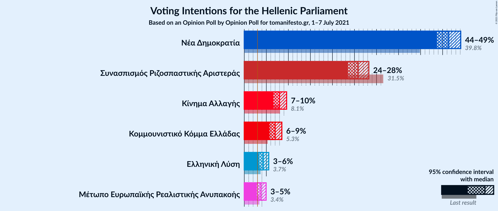

### Confidence Intervals

| Party | Last Result | Poll Result | 80% Confidence Interval | 90% Confidence Interval | 95% Confidence Interval | 99% Confidence Interval |
|:-----:|:-----------:|:-----------:|:-----------------------:|:-----------------------:|:-----------------------:|:-----------------------:|
| Νέα Δημοκρατία | 39.8% | 46.4% | 44.4–48.4% |43.8–49.0% |43.3–49.5% |42.4–50.5% |
| Συνασπισμός Ριζοσπαστικής Αριστεράς | 31.5% | 25.8% | 24.1–27.7% |23.6–28.2% |23.2–28.7% |22.4–29.6% |
| Κίνημα Αλλαγής | 8.1% | 8.0% | 7.0–9.2% |6.7–9.5% |6.5–9.8% |6.0–10.4% |
| Κομμουνιστικό Κόμμα Ελλάδας | 5.3% | 7.0% | 6.1–8.1% |5.8–8.5% |5.6–8.7% |5.1–9.3% |
| Ελληνική Λύση | 3.7% | 4.3% | 3.6–5.2% |3.4–5.5% |3.2–5.7% |2.9–6.2% |
| Μέτωπο Ευρωπαϊκής Ρεαλιστικής Ανυπακοής | 3.4% | 3.8% | 3.1–4.7% |2.9–4.9% |2.8–5.2% |2.5–5.6% |

*Note:* The poll result column reflects the actual value used in the calculations. Published results may vary slightly, and in addition be rounded to fewer digits.

## Seats

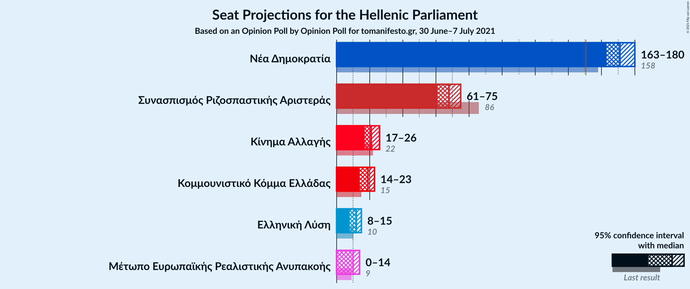

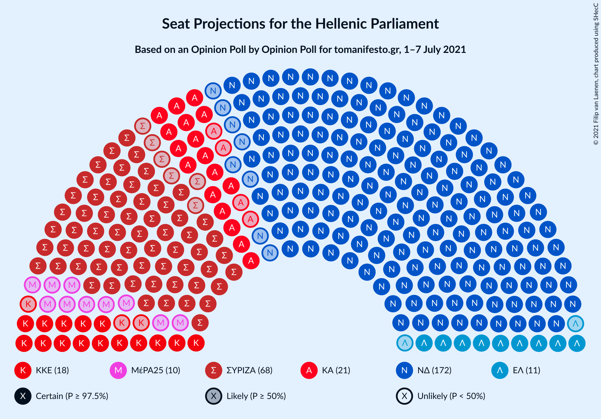

### Confidence Intervals

| Party | Last Result | Median | 80% Confidence Interval | 90% Confidence Interval | 95% Confidence Interval | 99% Confidence Interval |
|:-----:|:-----------:|:------:|:-----------------------:|:-----------------------:|:-----------------------:|:-----------------------:|
| <a href="#νέα-δημοκρατία">Νέα Δημοκρατία</a> | 158 | 171 | 166–177 |165–179 |163–180 |161–183 |
| <a href="#συνασπισμός-ριζοσπαστικής-αριστεράς">Συνασπισμός Ριζοσπαστικής Αριστεράς</a> | 86 | 68 | 63–73 |62–74 |61–75 |59–78 |
| <a href="#κίνημα-αλλαγής">Κίνημα Αλλαγής</a> | 22 | 21 | 18–24 |18–25 |17–26 |16–27 |
| <a href="#κομμουνιστικό-κόμμα-ελλάδας">Κομμουνιστικό Κόμμα Ελλάδας</a> | 15 | 19 | 16–21 |15–22 |14–23 |14–25 |
| <a href="#ελληνική-λύση">Ελληνική Λύση</a> | 10 | 12 | 9–13 |9–14 |8–15 |0–16 |
| <a href="#μέτωπο-ευρωπαϊκής-ρεαλιστικής-ανυπακοής">Μέτωπο Ευρωπαϊκής Ρεαλιστικής Ανυπακοής</a> | 9 | 10 | 8–12 |0–13 |0–14 |0–15 |

### Νέα Δημοκρατία

*For a full overview of the results for this party, see the [Νέα Δημοκρατία](party-νέαδημοκρατία.html) page.*

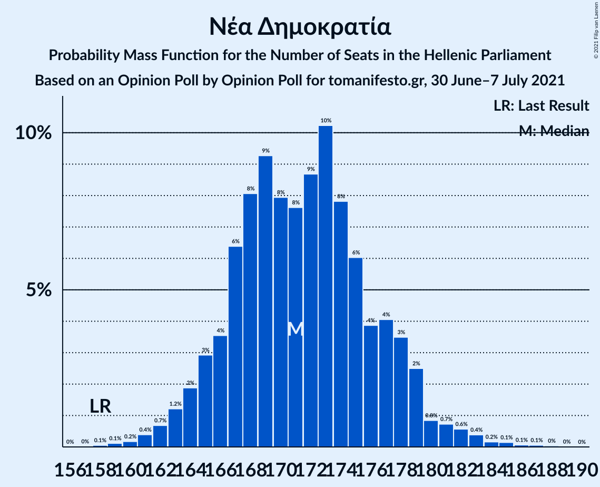

| Number of Seats | Probability | Accumulated | Special Marks |
|:---------------:|:-----------:|:-----------:|:-------------:|
| 158 | 0.1% | 100% | Last Result |
| 159 | 0.1% | 99.9% |  |
| 160 | 0.2% | 99.8% |  |
| 161 | 0.4% | 99.6% |  |
| 162 | 0.7% | 99.2% |  |
| 163 | 1.2% | 98.6% |  |
| 164 | 2% | 97% |  |
| 165 | 3% | 95% |  |
| 166 | 4% | 93% |  |
| 167 | 6% | 89% |  |
| 168 | 8% | 83% |  |
| 169 | 9% | 75% |  |
| 170 | 8% | 65% |  |
| 171 | 8% | 57% | Median |
| 172 | 9% | 50% |  |
| 173 | 10% | 41% |  |
| 174 | 8% | 31% |  |
| 175 | 6% | 23% |  |
| 176 | 4% | 17% |  |
| 177 | 4% | 13% |  |
| 178 | 3% | 9% |  |
| 179 | 2% | 6% |  |
| 180 | 0.8% | 3% |  |
| 181 | 0.7% | 2% |  |
| 182 | 0.6% | 1.4% |  |
| 183 | 0.4% | 0.9% |  |
| 184 | 0.2% | 0.5% |  |
| 185 | 0.1% | 0.3% |  |
| 186 | 0.1% | 0.2% |  |
| 187 | 0.1% | 0.1% |  |
| 188 | 0% | 0.1% |  |
| 189 | 0% | 0% |  |

### Συνασπισμός Ριζοσπαστικής Αριστεράς

*For a full overview of the results for this party, see the [Συνασπισμός Ριζοσπαστικής Αριστεράς](party-συνασπισμόςριζοσπαστικήςαριστεράς.html) page.*

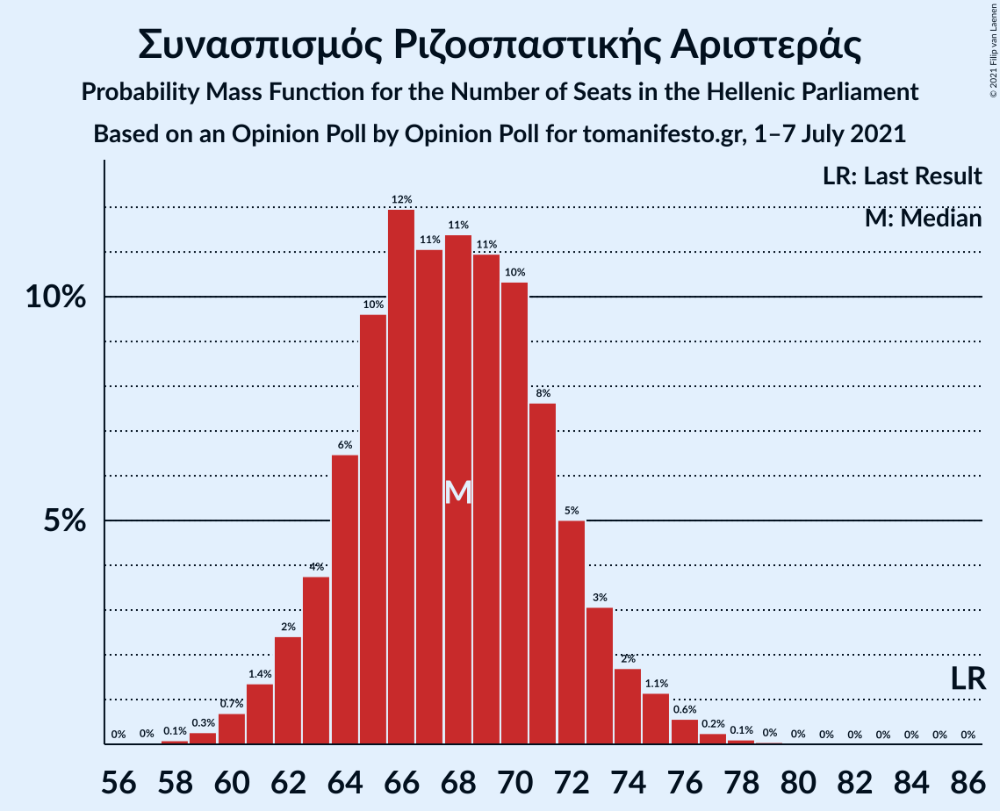

| Number of Seats | Probability | Accumulated | Special Marks |
|:---------------:|:-----------:|:-----------:|:-------------:|
| 56 | 0% | 100% |  |
| 57 | 0.1% | 99.9% |  |
| 58 | 0.3% | 99.8% |  |
| 59 | 0.5% | 99.6% |  |
| 60 | 1.1% | 99.0% |  |
| 61 | 2% | 98% |  |
| 62 | 3% | 96% |  |
| 63 | 6% | 92% |  |
| 64 | 7% | 87% |  |
| 65 | 8% | 80% |  |
| 66 | 9% | 72% |  |
| 67 | 11% | 63% |  |
| 68 | 9% | 51% | Median |
| 69 | 11% | 43% |  |
| 70 | 10% | 32% |  |
| 71 | 6% | 22% |  |
| 72 | 5% | 16% |  |
| 73 | 5% | 11% |  |
| 74 | 2% | 6% |  |
| 75 | 2% | 4% |  |
| 76 | 1.0% | 2% |  |
| 77 | 0.5% | 1.1% |  |
| 78 | 0.3% | 0.6% |  |
| 79 | 0.1% | 0.3% |  |
| 80 | 0.1% | 0.1% |  |
| 81 | 0% | 0.1% |  |
| 82 | 0% | 0% |  |
| 83 | 0% | 0% |  |
| 84 | 0% | 0% |  |
| 85 | 0% | 0% |  |
| 86 | 0% | 0% | Last Result |

### Κίνημα Αλλαγής

*For a full overview of the results for this party, see the [Κίνημα Αλλαγής](party-κίνημααλλαγής.html) page.*

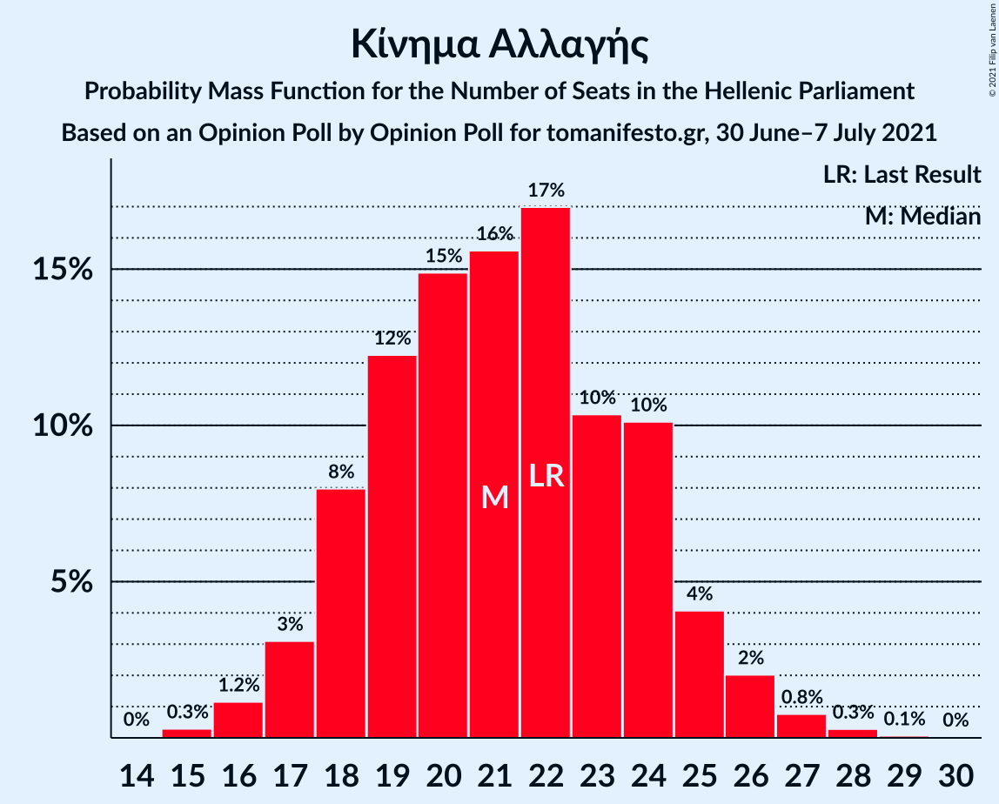

| Number of Seats | Probability | Accumulated | Special Marks |
|:---------------:|:-----------:|:-----------:|:-------------:|
| 14 | 0% | 100% |  |
| 15 | 0.3% | 99.9% |  |
| 16 | 1.2% | 99.7% |  |
| 17 | 3% | 98.5% |  |
| 18 | 8% | 95% |  |
| 19 | 12% | 87% |  |
| 20 | 15% | 75% |  |
| 21 | 16% | 60% | Median |
| 22 | 17% | 45% | Last Result |
| 23 | 10% | 28% |  |
| 24 | 10% | 17% |  |
| 25 | 4% | 7% |  |
| 26 | 2% | 3% |  |
| 27 | 0.8% | 1.2% |  |
| 28 | 0.3% | 0.4% |  |
| 29 | 0.1% | 0.1% |  |
| 30 | 0% | 0% |  |

### Κομμουνιστικό Κόμμα Ελλάδας

*For a full overview of the results for this party, see the [Κομμουνιστικό Κόμμα Ελλάδας](party-κομμουνιστικόκόμμαελλάδας.html) page.*

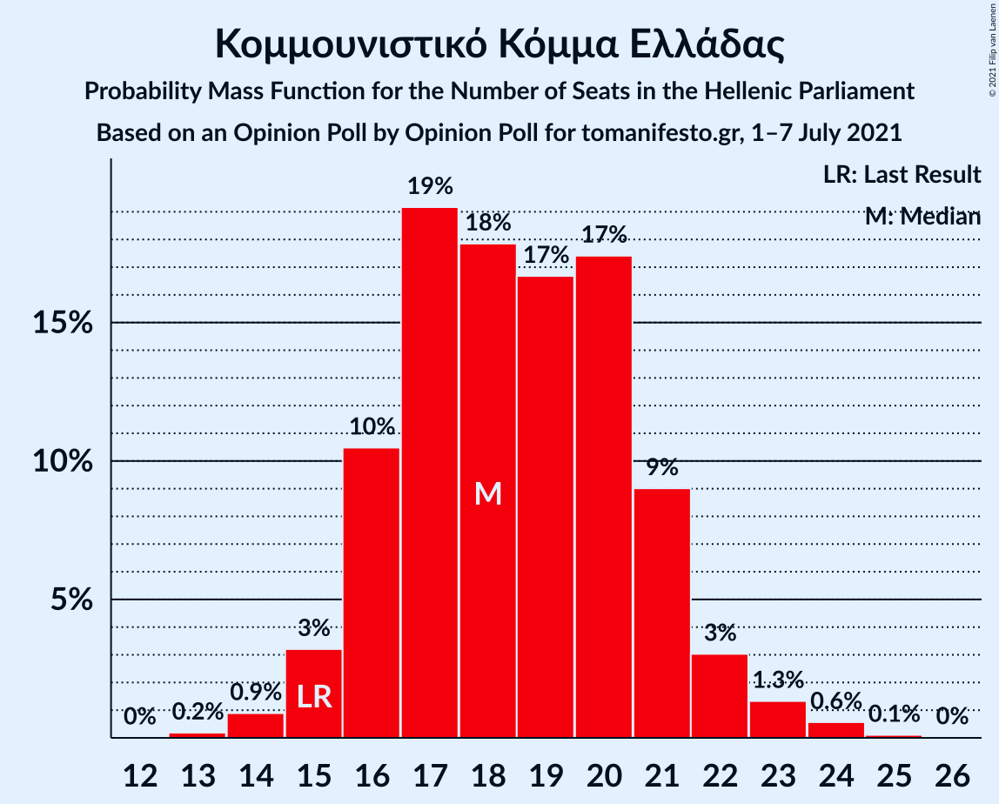

| Number of Seats | Probability | Accumulated | Special Marks |
|:---------------:|:-----------:|:-----------:|:-------------:|
| 12 | 0.1% | 100% |  |
| 13 | 0.4% | 99.9% |  |
| 14 | 2% | 99.5% |  |
| 15 | 5% | 97% | Last Result |
| 16 | 10% | 92% |  |
| 17 | 14% | 82% |  |
| 18 | 17% | 68% |  |
| 19 | 16% | 51% | Median |
| 20 | 16% | 35% |  |
| 21 | 10% | 18% |  |
| 22 | 5% | 9% |  |
| 23 | 2% | 4% |  |
| 24 | 0.9% | 1.4% |  |
| 25 | 0.3% | 0.5% |  |
| 26 | 0.1% | 0.2% |  |
| 27 | 0% | 0% |  |

### Ελληνική Λύση

*For a full overview of the results for this party, see the [Ελληνική Λύση](party-ελληνικήλύση.html) page.*

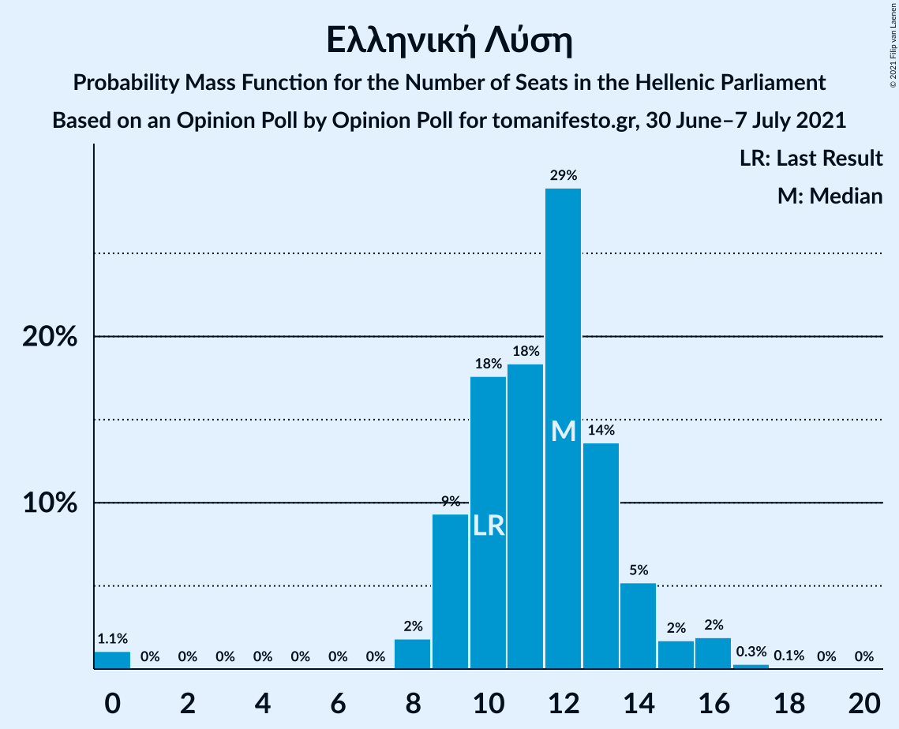

| Number of Seats | Probability | Accumulated | Special Marks |
|:---------------:|:-----------:|:-----------:|:-------------:|
| 0 | 1.1% | 100% |  |
| 1 | 0% | 98.9% |  |
| 2 | 0% | 98.9% |  |
| 3 | 0% | 98.9% |  |
| 4 | 0% | 98.9% |  |
| 5 | 0% | 98.9% |  |
| 6 | 0% | 98.9% |  |
| 7 | 0% | 98.9% |  |
| 8 | 2% | 98.9% |  |
| 9 | 9% | 97% |  |
| 10 | 18% | 88% | Last Result |
| 11 | 18% | 70% |  |
| 12 | 29% | 52% | Median |
| 13 | 14% | 23% |  |
| 14 | 5% | 9% |  |
| 15 | 2% | 4% |  |
| 16 | 2% | 2% |  |
| 17 | 0.3% | 0.4% |  |
| 18 | 0.1% | 0.1% |  |
| 19 | 0% | 0% |  |

### Μέτωπο Ευρωπαϊκής Ρεαλιστικής Ανυπακοής

*For a full overview of the results for this party, see the [Μέτωπο Ευρωπαϊκής Ρεαλιστικής Ανυπακοής](party-μέτωποευρωπαϊκήςρεαλιστικήςανυπακοής.html) page.*

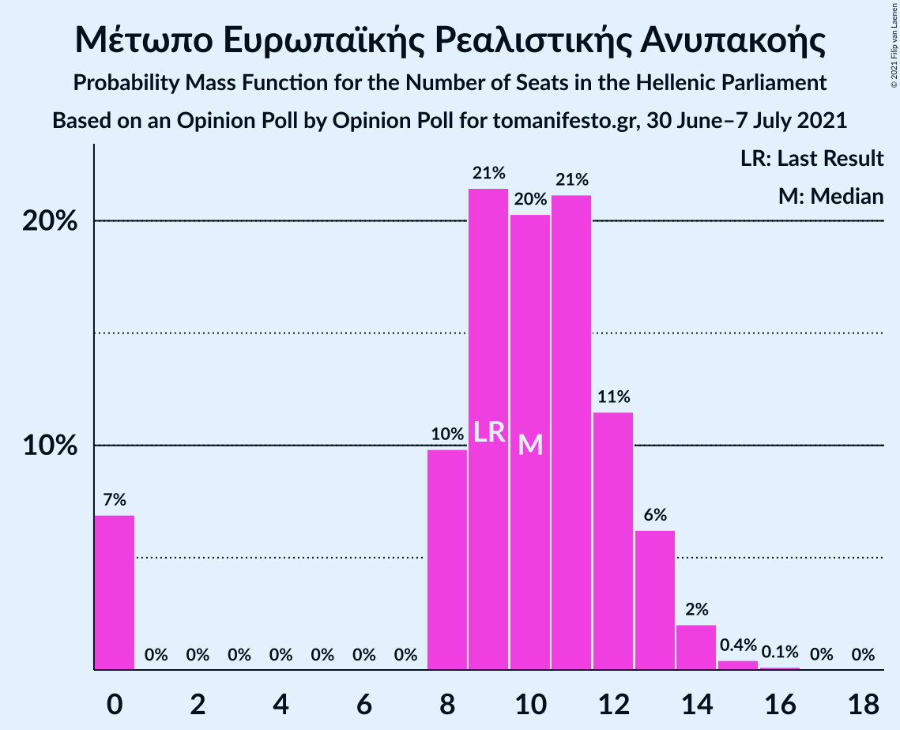

| Number of Seats | Probability | Accumulated | Special Marks |
|:---------------:|:-----------:|:-----------:|:-------------:|
| 0 | 7% | 100% |  |
| 1 | 0% | 93% |  |
| 2 | 0% | 93% |  |
| 3 | 0% | 93% |  |
| 4 | 0% | 93% |  |
| 5 | 0% | 93% |  |
| 6 | 0% | 93% |  |
| 7 | 0% | 93% |  |
| 8 | 10% | 93% |  |
| 9 | 21% | 83% | Last Result |
| 10 | 20% | 62% | Median |
| 11 | 21% | 42% |  |
| 12 | 11% | 20% |  |
| 13 | 6% | 9% |  |
| 14 | 2% | 3% |  |
| 15 | 0.4% | 0.6% |  |
| 16 | 0.1% | 0.2% |  |
| 17 | 0% | 0% |  |

## Coalitions

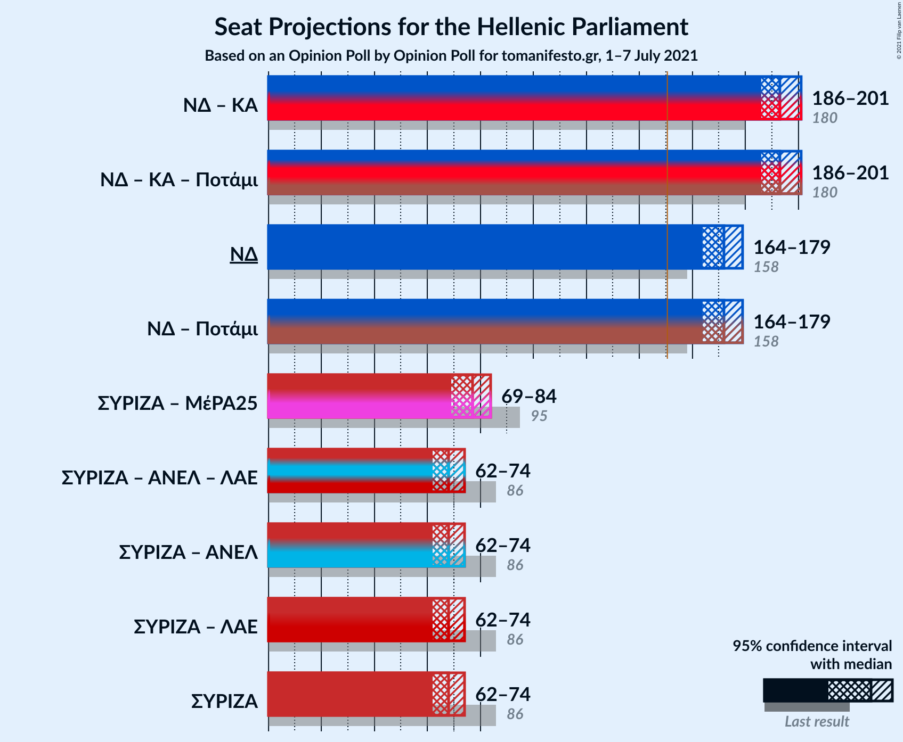

### Confidence Intervals

| Coalition | Last Result | Median | Majority? | 80% Confidence Interval | 90% Confidence Interval | 95% Confidence Interval | 99% Confidence Interval |
|:---------:|:-----------:|:------:|:---------:|:-----------------------:|:-----------------------:|:-----------------------:|:-----------------------:|
| Νέα Δημοκρατία – Κίνημα Αλλαγής | 180 | 192 | 100% | 187–198 | 186–201 | 184–202 | 182–204 |
| Νέα Δημοκρατία | 158 | 171 | 100% | 166–177 | 165–179 | 163–180 | 161–183 |
| Συνασπισμός Ριζοσπαστικής Αριστεράς – Μέτωπο Ευρωπαϊκής Ρεαλιστικής Ανυπακοής | 95 | 77 | 0% | 72–83 | 70–84 | 69–85 | 66–88 |
| Συνασπισμός Ριζοσπαστικής Αριστεράς | 86 | 68 | 0% | 63–73 | 62–74 | 61–75 | 59–78 |

### Νέα Δημοκρατία – Κίνημα Αλλαγής

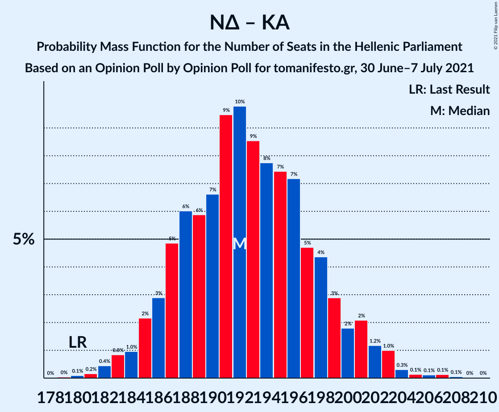

| Number of Seats | Probability | Accumulated | Special Marks |
|:---------------:|:-----------:|:-----------:|:-------------:|
| 179 | 0% | 100% |  |
| 180 | 0.1% | 99.9% | Last Result |
| 181 | 0.2% | 99.8% |  |
| 182 | 0.4% | 99.7% |  |
| 183 | 0.8% | 99.2% |  |
| 184 | 1.0% | 98% |  |
| 185 | 2% | 97% |  |
| 186 | 3% | 95% |  |
| 187 | 5% | 92% |  |
| 188 | 6% | 88% |  |
| 189 | 6% | 81% |  |
| 190 | 7% | 76% |  |
| 191 | 9% | 69% |  |
| 192 | 10% | 60% | Median |
| 193 | 9% | 50% |  |
| 194 | 8% | 41% |  |
| 195 | 7% | 33% |  |
| 196 | 7% | 26% |  |
| 197 | 5% | 19% |  |
| 198 | 4% | 14% |  |
| 199 | 3% | 10% |  |
| 200 | 2% | 7% |  |
| 201 | 2% | 5% |  |
| 202 | 1.2% | 3% |  |
| 203 | 1.0% | 2% |  |
| 204 | 0.3% | 0.8% |  |
| 205 | 0.1% | 0.5% |  |
| 206 | 0.1% | 0.4% |  |
| 207 | 0.1% | 0.2% |  |
| 208 | 0.1% | 0.1% |  |
| 209 | 0% | 0.1% |  |
| 210 | 0% | 0% |  |

### Νέα Δημοκρατία

| Number of Seats | Probability | Accumulated | Special Marks |
|:---------------:|:-----------:|:-----------:|:-------------:|
| 158 | 0.1% | 100% | Last Result |
| 159 | 0.1% | 99.9% |  |
| 160 | 0.2% | 99.8% |  |
| 161 | 0.4% | 99.6% |  |
| 162 | 0.7% | 99.2% |  |
| 163 | 1.2% | 98.6% |  |
| 164 | 2% | 97% |  |
| 165 | 3% | 95% |  |
| 166 | 4% | 93% |  |
| 167 | 6% | 89% |  |
| 168 | 8% | 83% |  |
| 169 | 9% | 75% |  |
| 170 | 8% | 65% |  |
| 171 | 8% | 57% | Median |
| 172 | 9% | 50% |  |
| 173 | 10% | 41% |  |
| 174 | 8% | 31% |  |
| 175 | 6% | 23% |  |
| 176 | 4% | 17% |  |
| 177 | 4% | 13% |  |
| 178 | 3% | 9% |  |
| 179 | 2% | 6% |  |
| 180 | 0.8% | 3% |  |
| 181 | 0.7% | 2% |  |
| 182 | 0.6% | 1.4% |  |
| 183 | 0.4% | 0.9% |  |
| 184 | 0.2% | 0.5% |  |
| 185 | 0.1% | 0.3% |  |
| 186 | 0.1% | 0.2% |  |
| 187 | 0.1% | 0.1% |  |
| 188 | 0% | 0.1% |  |
| 189 | 0% | 0% |  |

### Συνασπισμός Ριζοσπαστικής Αριστεράς – Μέτωπο Ευρωπαϊκής Ρεαλιστικής Ανυπακοής

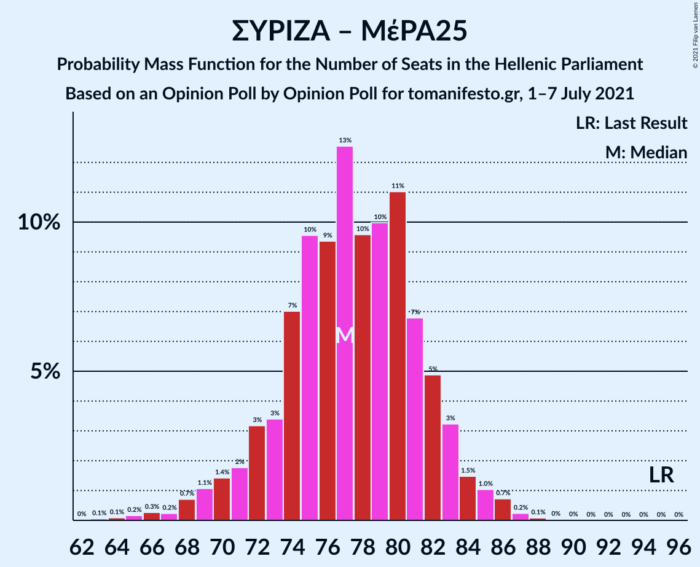

| Number of Seats | Probability | Accumulated | Special Marks |
|:---------------:|:-----------:|:-----------:|:-------------:|
| 62 | 0.1% | 100% |  |
| 63 | 0.1% | 99.9% |  |
| 64 | 0.1% | 99.8% |  |
| 65 | 0.2% | 99.8% |  |
| 66 | 0.2% | 99.5% |  |
| 67 | 0.3% | 99.4% |  |
| 68 | 0.8% | 99.0% |  |
| 69 | 2% | 98% |  |
| 70 | 2% | 97% |  |
| 71 | 3% | 94% |  |
| 72 | 4% | 92% |  |
| 73 | 7% | 88% |  |
| 74 | 7% | 81% |  |
| 75 | 8% | 75% |  |
| 76 | 9% | 66% |  |
| 77 | 9% | 57% |  |
| 78 | 8% | 48% | Median |
| 79 | 6% | 40% |  |
| 80 | 9% | 34% |  |
| 81 | 9% | 25% |  |
| 82 | 3% | 16% |  |
| 83 | 5% | 13% |  |
| 84 | 4% | 8% |  |
| 85 | 2% | 4% |  |
| 86 | 1.0% | 2% |  |
| 87 | 0.7% | 1.3% |  |
| 88 | 0.3% | 0.6% |  |
| 89 | 0.2% | 0.3% |  |
| 90 | 0.1% | 0.1% |  |
| 91 | 0% | 0.1% |  |
| 92 | 0% | 0% |  |
| 93 | 0% | 0% |  |
| 94 | 0% | 0% |  |
| 95 | 0% | 0% | Last Result |

### Συνασπισμός Ριζοσπαστικής Αριστεράς

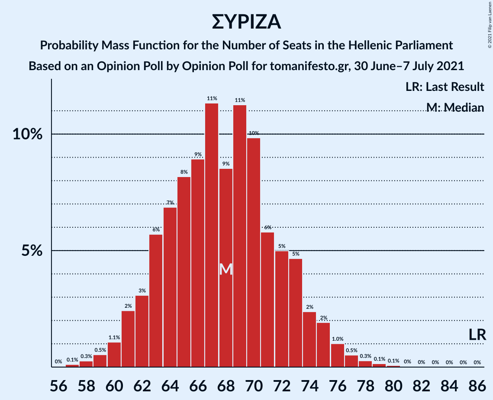

| Number of Seats | Probability | Accumulated | Special Marks |
|:---------------:|:-----------:|:-----------:|:-------------:|
| 56 | 0% | 100% |  |
| 57 | 0.1% | 99.9% |  |
| 58 | 0.3% | 99.8% |  |
| 59 | 0.5% | 99.6% |  |
| 60 | 1.1% | 99.0% |  |
| 61 | 2% | 98% |  |
| 62 | 3% | 96% |  |
| 63 | 6% | 92% |  |
| 64 | 7% | 87% |  |
| 65 | 8% | 80% |  |
| 66 | 9% | 72% |  |
| 67 | 11% | 63% |  |
| 68 | 9% | 51% | Median |
| 69 | 11% | 43% |  |
| 70 | 10% | 32% |  |
| 71 | 6% | 22% |  |
| 72 | 5% | 16% |  |
| 73 | 5% | 11% |  |
| 74 | 2% | 6% |  |
| 75 | 2% | 4% |  |
| 76 | 1.0% | 2% |  |
| 77 | 0.5% | 1.1% |  |
| 78 | 0.3% | 0.6% |  |
| 79 | 0.1% | 0.3% |  |
| 80 | 0.1% | 0.1% |  |
| 81 | 0% | 0.1% |  |
| 82 | 0% | 0% |  |
| 83 | 0% | 0% |  |
| 84 | 0% | 0% |  |
| 85 | 0% | 0% |  |
| 86 | 0% | 0% | Last Result |

## Technical Information

### Opinion Poll

+ **Polling firm:** Opinion Poll
+ **Commissioner(s):** tomanifesto.gr
+ **Fieldwork period:** 30 June–7 July 2021

### Calculations

+ **Sample size:** 1002
+ **Simulations done:** 131,072
+ **Error estimate:** 0.96%

