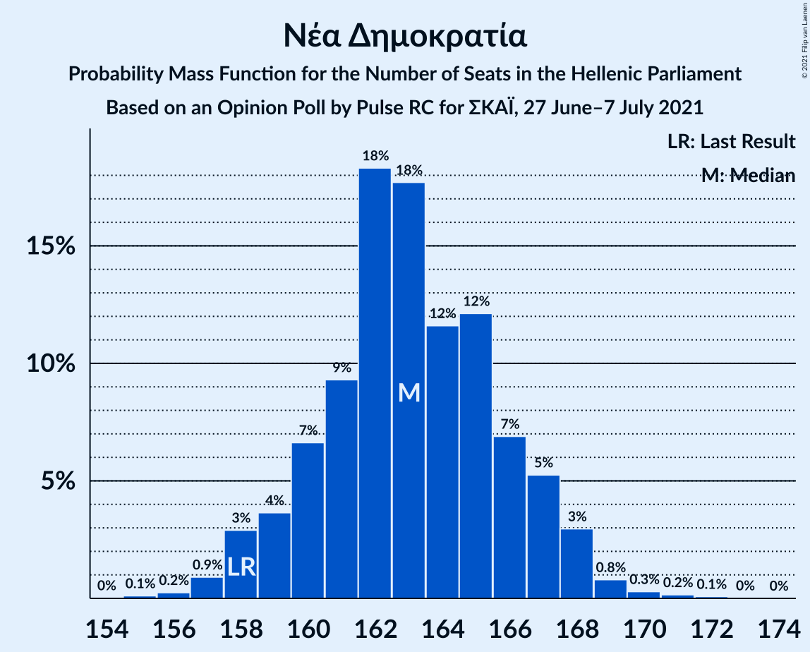
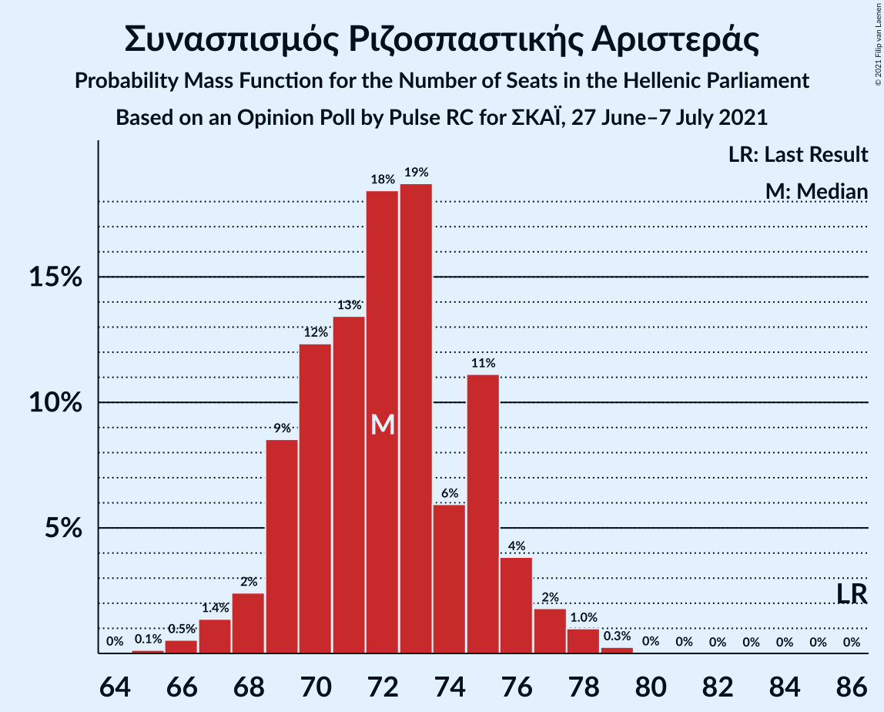
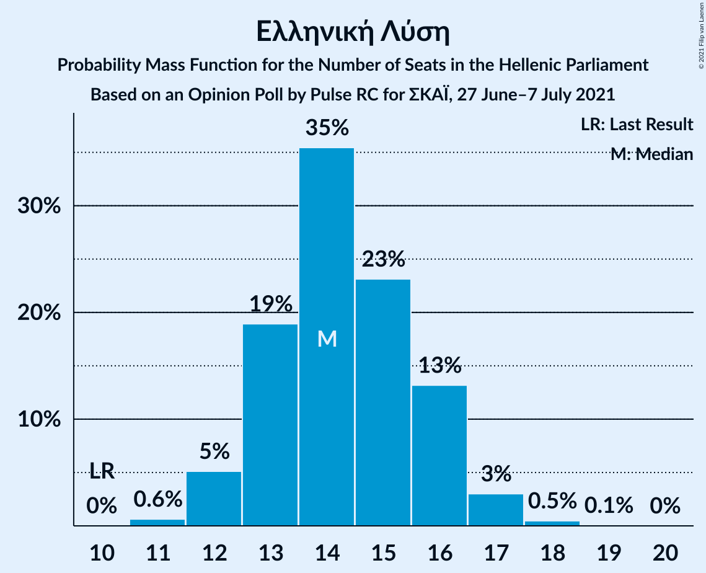
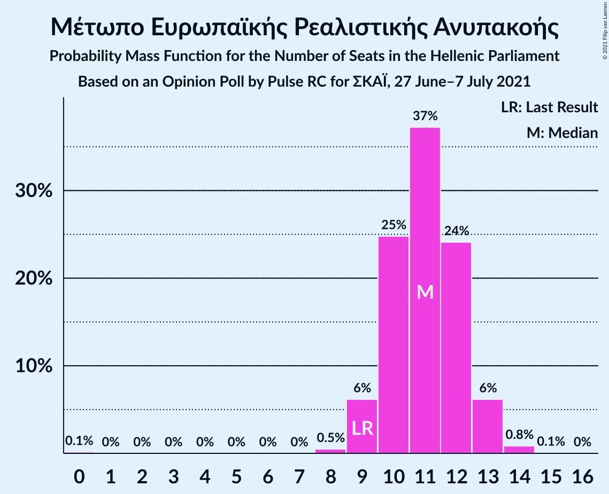
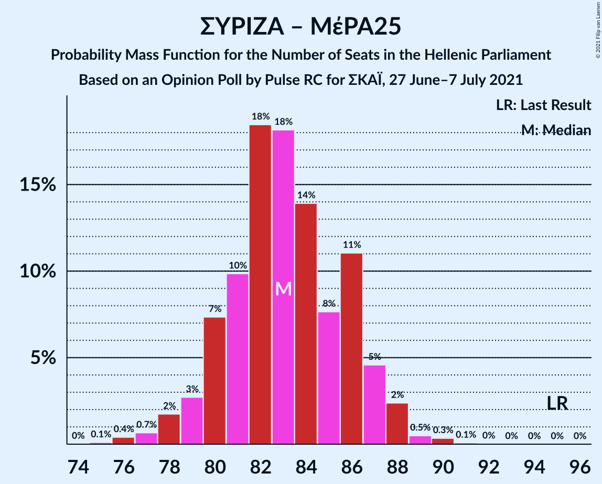
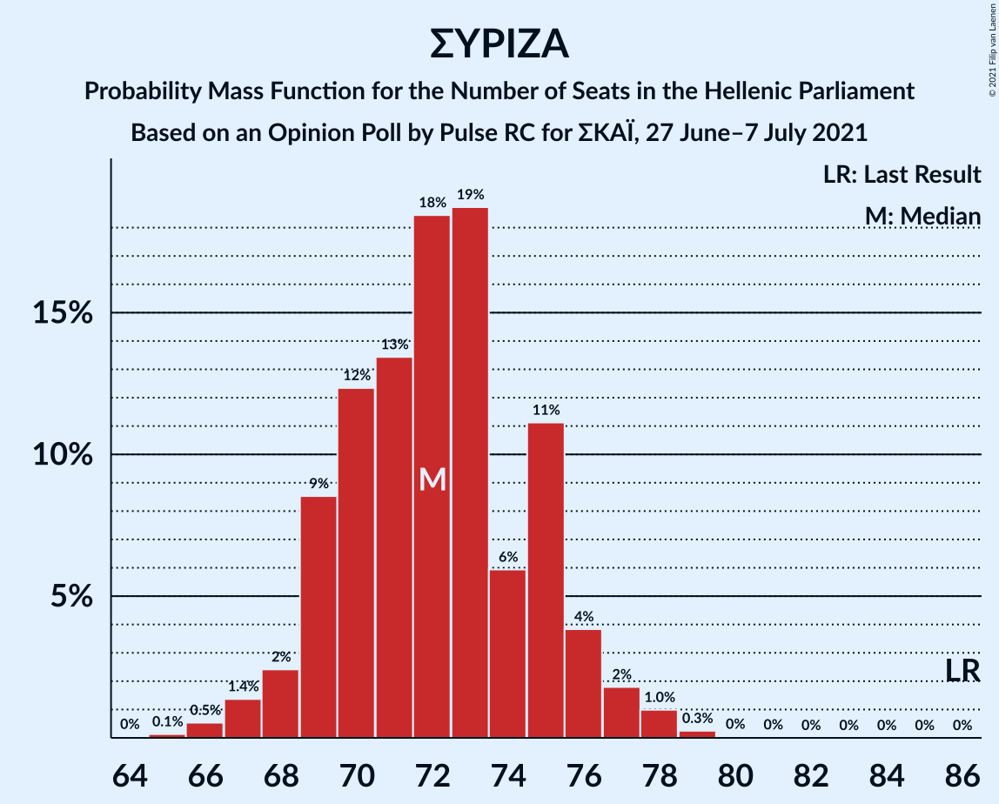

# Opinion Poll by Pulse RC for ΣΚΑΪ, 27 June–7 July 2021

<a href="#voting-intentions">Voting Intentions</a> | <a href="#seats">Seats</a> | <a href="#coalitions">Coalitions</a> | <a href="#technical-information">Technical Information</a>

## Voting Intentions

### Confidence Intervals

| Party | Last Result | Poll Result | 80% Confidence Interval | 90% Confidence Interval | 95% Confidence Interval | 99% Confidence Interval |
|:-----:|:-----------:|:-----------:|:-----------------------:|:-----------------------:|:-----------------------:|:-----------------------:|
| Νέα Δημοκρατία | 39.8% | 41.4% | 40.2–42.6% |39.8–43.0% |39.5–43.3% |38.9–43.9% |
| Συνασπισμός Ριζοσπαστικής Αριστεράς | 31.5% | 26.4% | 25.3–27.5% |25.0–27.8% |24.7–28.1% |24.2–28.7% |
| Κίνημα Αλλαγής | 8.1% | 7.5% | 6.9–8.2% |6.7–8.4% |6.6–8.6% |6.3–8.9% |
| Κομμουνιστικό Κόμμα Ελλάδας | 5.3% | 6.9% | 6.3–7.6% |6.1–7.8% |6.0–7.9% |5.7–8.3% |
| Ελληνική Λύση | 3.7% | 5.2% | 4.7–5.8% |4.5–6.0% |4.4–6.1% |4.2–6.4% |
| Μέτωπο Ευρωπαϊκής Ρεαλιστικής Ανυπακοής | 3.4% | 4.0% | 3.5–4.5% |3.4–4.7% |3.3–4.8% |3.1–5.1% |

*Note:* The poll result column reflects the actual value used in the calculations. Published results may vary slightly, and in addition be rounded to fewer digits.

## Seats

### Confidence Intervals

| Party | Last Result | Median | 80% Confidence Interval | 90% Confidence Interval | 95% Confidence Interval | 99% Confidence Interval |
|:-----:|:-----------:|:------:|:-----------------------:|:-----------------------:|:-----------------------:|:-----------------------:|
| <a href="#νέα-δημοκρατία">Νέα Δημοκρατία</a> | 158 | 163 | 160–166 |159–167 |158–168 |157–170 |
| <a href="#συνασπισμός-ριζοσπαστικής-αριστεράς">Συνασπισμός Ριζοσπαστικής Αριστεράς</a> | 86 | 72 | 69–75 |69–76 |68–77 |66–78 |
| <a href="#κίνημα-αλλαγής">Κίνημα Αλλαγής</a> | 22 | 21 | 19–22 |18–23 |18–23 |17–24 |
| <a href="#κομμουνιστικό-κόμμα-ελλάδας">Κομμουνιστικό Κόμμα Ελλάδας</a> | 15 | 19 | 17–21 |17–21 |16–22 |16–22 |
| <a href="#ελληνική-λύση">Ελληνική Λύση</a> | 10 | 14 | 13–16 |12–16 |12–17 |11–18 |
| <a href="#μέτωπο-ευρωπαϊκής-ρεαλιστικής-ανυπακοής">Μέτωπο Ευρωπαϊκής Ρεαλιστικής Ανυπακοής</a> | 9 | 11 | 10–12 |9–13 |9–13 |8–14 |

### Νέα Δημοκρατία

*For a full overview of the results for this party, see the [Νέα Δημοκρατία](party-νέαδημοκρατία.html) page.*

| Number of Seats | Probability | Accumulated | Special Marks |
|:---------------:|:-----------:|:-----------:|:-------------:|
| 155 | 0.1% | 100% |  |
| 156 | 0.2% | 99.9% |  |
| 157 | 0.9% | 99.6% |  |
| 158 | 3% | 98.7% | Last Result |
| 159 | 4% | 96% |  |
| 160 | 7% | 92% |  |
| 161 | 9% | 86% |  |
| 162 | 18% | 76% |  |
| 163 | 18% | 58% | Median |
| 164 | 12% | 40% |  |
| 165 | 12% | 29% |  |
| 166 | 7% | 16% |  |
| 167 | 5% | 10% |  |
| 168 | 3% | 4% |  |
| 169 | 0.8% | 1.4% |  |
| 170 | 0.3% | 0.6% |  |
| 171 | 0.2% | 0.3% |  |
| 172 | 0.1% | 0.1% |  |
| 173 | 0% | 0% |  |

### Συνασπισμός Ριζοσπαστικής Αριστεράς

*For a full overview of the results for this party, see the [Συνασπισμός Ριζοσπαστικής Αριστεράς](party-συνασπισμόςριζοσπαστικήςαριστεράς.html) page.*

| Number of Seats | Probability | Accumulated | Special Marks |
|:---------------:|:-----------:|:-----------:|:-------------:|
| 65 | 0.1% | 100% |  |
| 66 | 0.5% | 99.8% |  |
| 67 | 1.4% | 99.3% |  |
| 68 | 2% | 98% |  |
| 69 | 9% | 95% |  |
| 70 | 12% | 87% |  |
| 71 | 13% | 75% |  |
| 72 | 18% | 61% | Median |
| 73 | 19% | 43% |  |
| 74 | 6% | 24% |  |
| 75 | 11% | 18% |  |
| 76 | 4% | 7% |  |
| 77 | 2% | 3% |  |
| 78 | 1.0% | 1.3% |  |
| 79 | 0.3% | 0.3% |  |
| 80 | 0% | 0.1% |  |
| 81 | 0% | 0% |  |
| 82 | 0% | 0% |  |
| 83 | 0% | 0% |  |
| 84 | 0% | 0% |  |
| 85 | 0% | 0% |  |
| 86 | 0% | 0% | Last Result |

### Κίνημα Αλλαγής

*For a full overview of the results for this party, see the [Κίνημα Αλλαγής](party-κίνημααλλαγής.html) page.*

| Number of Seats | Probability | Accumulated | Special Marks |
|:---------------:|:-----------:|:-----------:|:-------------:|
| 16 | 0.1% | 100% |  |
| 17 | 0.9% | 99.9% |  |
| 18 | 6% | 99.0% |  |
| 19 | 14% | 93% |  |
| 20 | 25% | 79% |  |
| 21 | 32% | 53% | Median |
| 22 | 12% | 21% | Last Result |
| 23 | 7% | 9% |  |
| 24 | 2% | 2% |  |
| 25 | 0.3% | 0.3% |  |
| 26 | 0.1% | 0.1% |  |
| 27 | 0% | 0% |  |

### Κομμουνιστικό Κόμμα Ελλάδας

*For a full overview of the results for this party, see the [Κομμουνιστικό Κόμμα Ελλάδας](party-κομμουνιστικόκόμμαελλάδας.html) page.*

| Number of Seats | Probability | Accumulated | Special Marks |
|:---------------:|:-----------:|:-----------:|:-------------:|
| 15 | 0.4% | 100% | Last Result |
| 16 | 3% | 99.6% |  |
| 17 | 11% | 96% |  |
| 18 | 21% | 85% |  |
| 19 | 29% | 64% | Median |
| 20 | 22% | 34% |  |
| 21 | 9% | 13% |  |
| 22 | 3% | 3% |  |
| 23 | 0.4% | 0.5% |  |
| 24 | 0.1% | 0.1% |  |
| 25 | 0% | 0% |  |

### Ελληνική Λύση

*For a full overview of the results for this party, see the [Ελληνική Λύση](party-ελληνικήλύση.html) page.*

| Number of Seats | Probability | Accumulated | Special Marks |
|:---------------:|:-----------:|:-----------:|:-------------:|
| 10 | 0% | 100% | Last Result |
| 11 | 0.6% | 100% |  |
| 12 | 5% | 99.3% |  |
| 13 | 19% | 94% |  |
| 14 | 35% | 75% | Median |
| 15 | 23% | 40% |  |
| 16 | 13% | 17% |  |
| 17 | 3% | 4% |  |
| 18 | 0.5% | 0.5% |  |
| 19 | 0.1% | 0.1% |  |
| 20 | 0% | 0% |  |

### Μέτωπο Ευρωπαϊκής Ρεαλιστικής Ανυπακοής

*For a full overview of the results for this party, see the [Μέτωπο Ευρωπαϊκής Ρεαλιστικής Ανυπακοής](party-μέτωποευρωπαϊκήςρεαλιστικήςανυπακοής.html) page.*

| Number of Seats | Probability | Accumulated | Special Marks |
|:---------------:|:-----------:|:-----------:|:-------------:|
| 0 | 0.1% | 100% |  |
| 1 | 0% | 99.9% |  |
| 2 | 0% | 99.9% |  |
| 3 | 0% | 99.9% |  |
| 4 | 0% | 99.9% |  |
| 5 | 0% | 99.9% |  |
| 6 | 0% | 99.9% |  |
| 7 | 0% | 99.9% |  |
| 8 | 0.5% | 99.9% |  |
| 9 | 6% | 99.4% | Last Result |
| 10 | 25% | 93% |  |
| 11 | 37% | 68% | Median |
| 12 | 24% | 31% |  |
| 13 | 6% | 7% |  |
| 14 | 0.8% | 0.9% |  |
| 15 | 0.1% | 0.1% |  |
| 16 | 0% | 0% |  |

## Coalitions

### Confidence Intervals

| Coalition | Last Result | Median | Majority? | 80% Confidence Interval | 90% Confidence Interval | 95% Confidence Interval | 99% Confidence Interval |
|:---------:|:-----------:|:------:|:---------:|:-----------------------:|:-----------------------:|:-----------------------:|:-----------------------:|
| Νέα Δημοκρατία – Κίνημα Αλλαγής | 180 | 183 | 100% | 180–187 | 179–188 | 179–189 | 177–191 |
| Νέα Δημοκρατία | 158 | 163 | 100% | 160–166 | 159–167 | 158–168 | 157–170 |
| Συνασπισμός Ριζοσπαστικής Αριστεράς – Μέτωπο Ευρωπαϊκής Ρεαλιστικής Ανυπακοής | 95 | 83 | 0% | 80–86 | 79–87 | 78–88 | 76–89 |
| Συνασπισμός Ριζοσπαστικής Αριστεράς | 86 | 72 | 0% | 69–75 | 69–76 | 68–77 | 66–78 |

### Νέα Δημοκρατία – Κίνημα Αλλαγής

| Number of Seats | Probability | Accumulated | Special Marks |
|:---------------:|:-----------:|:-----------:|:-------------:|
| 175 | 0% | 100% |  |
| 176 | 0.2% | 99.9% |  |
| 177 | 0.5% | 99.7% |  |
| 178 | 0.5% | 99.2% |  |
| 179 | 4% | 98.7% |  |
| 180 | 6% | 94% | Last Result |
| 181 | 4% | 88% |  |
| 182 | 19% | 85% |  |
| 183 | 18% | 66% |  |
| 184 | 7% | 47% | Median |
| 185 | 20% | 40% |  |
| 186 | 8% | 20% |  |
| 187 | 4% | 12% |  |
| 188 | 5% | 8% |  |
| 189 | 3% | 3% |  |
| 190 | 0.3% | 0.8% |  |
| 191 | 0.3% | 0.6% |  |
| 192 | 0.2% | 0.2% |  |
| 193 | 0% | 0% |  |

### Νέα Δημοκρατία

| Number of Seats | Probability | Accumulated | Special Marks |
|:---------------:|:-----------:|:-----------:|:-------------:|
| 155 | 0.1% | 100% |  |
| 156 | 0.2% | 99.9% |  |
| 157 | 0.9% | 99.6% |  |
| 158 | 3% | 98.7% | Last Result |
| 159 | 4% | 96% |  |
| 160 | 7% | 92% |  |
| 161 | 9% | 86% |  |
| 162 | 18% | 76% |  |
| 163 | 18% | 58% | Median |
| 164 | 12% | 40% |  |
| 165 | 12% | 29% |  |
| 166 | 7% | 16% |  |
| 167 | 5% | 10% |  |
| 168 | 3% | 4% |  |
| 169 | 0.8% | 1.4% |  |
| 170 | 0.3% | 0.6% |  |
| 171 | 0.2% | 0.3% |  |
| 172 | 0.1% | 0.1% |  |
| 173 | 0% | 0% |  |

### Συνασπισμός Ριζοσπαστικής Αριστεράς – Μέτωπο Ευρωπαϊκής Ρεαλιστικής Ανυπακοής

| Number of Seats | Probability | Accumulated | Special Marks |
|:---------------:|:-----------:|:-----------:|:-------------:|
| 74 | 0% | 100% |  |
| 75 | 0.1% | 99.9% |  |
| 76 | 0.4% | 99.8% |  |
| 77 | 0.7% | 99.4% |  |
| 78 | 2% | 98.8% |  |
| 79 | 3% | 97% |  |
| 80 | 7% | 94% |  |
| 81 | 10% | 87% |  |
| 82 | 18% | 77% |  |
| 83 | 18% | 59% | Median |
| 84 | 14% | 41% |  |
| 85 | 8% | 27% |  |
| 86 | 11% | 19% |  |
| 87 | 5% | 8% |  |
| 88 | 2% | 3% |  |
| 89 | 0.5% | 0.9% |  |
| 90 | 0.3% | 0.5% |  |
| 91 | 0.1% | 0.1% |  |
| 92 | 0% | 0% |  |
| 93 | 0% | 0% |  |
| 94 | 0% | 0% |  |
| 95 | 0% | 0% | Last Result |

### Συνασπισμός Ριζοσπαστικής Αριστεράς

| Number of Seats | Probability | Accumulated | Special Marks |
|:---------------:|:-----------:|:-----------:|:-------------:|
| 65 | 0.1% | 100% |  |
| 66 | 0.5% | 99.8% |  |
| 67 | 1.4% | 99.3% |  |
| 68 | 2% | 98% |  |
| 69 | 9% | 95% |  |
| 70 | 12% | 87% |  |
| 71 | 13% | 75% |  |
| 72 | 18% | 61% | Median |
| 73 | 19% | 43% |  |
| 74 | 6% | 24% |  |
| 75 | 11% | 18% |  |
| 76 | 4% | 7% |  |
| 77 | 2% | 3% |  |
| 78 | 1.0% | 1.3% |  |
| 79 | 0.3% | 0.3% |  |
| 80 | 0% | 0.1% |  |
| 81 | 0% | 0% |  |
| 82 | 0% | 0% |  |
| 83 | 0% | 0% |  |
| 84 | 0% | 0% |  |
| 85 | 0% | 0% |  |
| 86 | 0% | 0% | Last Result |

## Technical Information

### Opinion Poll

+ **Polling firm:** Pulse RC
+ **Commissioner(s):** ΣΚΑΪ
+ **Fieldwork period:** 27 June–7 July 2021

### Calculations

+ **Sample size:** 2611
+ **Simulations done:** 131,072
+ **Error estimate:** 0.34%

