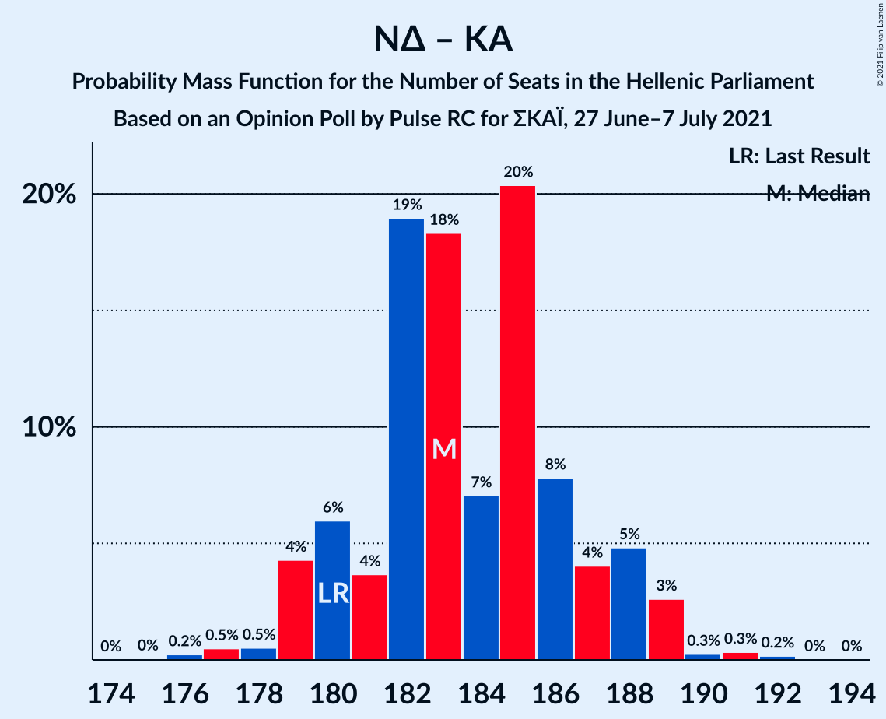

# Opinion Poll by Pulse RC for ΣΚΑΪ, 27 June–7 July 2021

<a href="#voting-intentions">Voting Intentions</a> | <a href="#seats">Seats</a> | <a href="#coalitions">Coalitions</a> | <a href="#technical-information">Technical Information</a>

## Voting Intentions

### Confidence Intervals

| Party | Last Result | Poll Result | 80% Confidence Interval | 90% Confidence Interval | 95% Confidence Interval | 99% Confidence Interval |
|:-----:|:-----------:|:-----------:|:-----------------------:|:-----------------------:|:-----------------------:|:-----------------------:|
| Νέα Δημοκρατία | 39.8% | 41.4% | 39.6–43.1% |39.2–43.7% |38.7–44.1% |37.9–44.9% |
| Συνασπισμός Ριζοσπαστικής Αριστεράς | 31.5% | 26.4% | 24.9–28.0% |24.5–28.5% |24.1–28.9% |23.4–29.7% |
| Κίνημα Αλλαγής | 8.1% | 7.5% | 6.6–8.5% |6.4–8.8% |6.2–9.1% |5.8–9.6% |
| Κομμουνιστικό Κόμμα Ελλάδας | 5.3% | 6.9% | 6.1–7.9% |5.8–8.2% |5.6–8.4% |5.3–8.9% |
| Ελληνική Λύση | 3.7% | 5.2% | 4.5–6.1% |4.3–6.3% |4.1–6.6% |3.8–7.0% |
| Μέτωπο Ευρωπαϊκής Ρεαλιστικής Ανυπακοής | 3.4% | 4.0% | 3.4–4.8% |3.2–5.0% |3.0–5.2% |2.8–5.6% |

*Note:* The poll result column reflects the actual value used in the calculations. Published results may vary slightly, and in addition be rounded to fewer digits.

## Seats

### Confidence Intervals

| Party | Last Result | Median | 80% Confidence Interval | 90% Confidence Interval | 95% Confidence Interval | 99% Confidence Interval |
|:-----:|:-----------:|:------:|:-----------------------:|:-----------------------:|:-----------------------:|:-----------------------:|
| <a href="#νέα-δημοκρατία">Νέα Δημοκρατία</a> | 158 | 163 | 158–168 |157–169 |156–170 |154–173 |
| <a href="#συνασπισμός-ριζοσπαστικής-αριστεράς">Συνασπισμός Ριζοσπαστικής Αριστεράς</a> | 86 | 72 | 68–76 |67–78 |66–79 |64–81 |
| <a href="#κίνημα-αλλαγής">Κίνημα Αλλαγής</a> | 22 | 21 | 18–23 |17–24 |17–25 |16–26 |
| <a href="#κομμουνιστικό-κόμμα-ελλάδας">Κομμουνιστικό Κόμμα Ελλάδας</a> | 15 | 19 | 17–21 |16–22 |15–23 |14–24 |
| <a href="#ελληνική-λύση">Ελληνική Λύση</a> | 10 | 14 | 12–17 |12–17 |11–18 |10–19 |
| <a href="#μέτωπο-ευρωπαϊκής-ρεαλιστικής-ανυπακοής">Μέτωπο Ευρωπαϊκής Ρεαλιστικής Ανυπακοής</a> | 9 | 11 | 9–13 |9–14 |8–14 |0–15 |

### Νέα Δημοκρατία

*For a full overview of the results for this party, see the [Νέα Δημοκρατία](party-νέαδημοκρατία.html) page.*

| Number of Seats | Probability | Accumulated | Special Marks |
|:---------------:|:-----------:|:-----------:|:-------------:|
| 151 | 0% | 100% | Majority |
| 152 | 0.1% | 99.9% |  |
| 153 | 0.3% | 99.8% |  |
| 154 | 0.5% | 99.5% |  |
| 155 | 1.0% | 99.0% |  |
| 156 | 2% | 98% |  |
| 157 | 3% | 96% |  |
| 158 | 5% | 93% | Last Result |
| 159 | 6% | 88% |  |
| 160 | 8% | 82% |  |
| 161 | 9% | 74% |  |
| 162 | 10% | 64% |  |
| 163 | 11% | 54% | Median |
| 164 | 10% | 44% |  |
| 165 | 10% | 34% |  |
| 166 | 8% | 23% |  |
| 167 | 5% | 16% |  |
| 168 | 4% | 10% |  |
| 169 | 3% | 6% |  |
| 170 | 2% | 4% |  |
| 171 | 1.0% | 2% |  |
| 172 | 0.6% | 1.2% |  |
| 173 | 0.3% | 0.5% |  |
| 174 | 0.1% | 0.3% |  |
| 175 | 0.1% | 0.1% |  |
| 176 | 0% | 0.1% |  |
| 177 | 0% | 0% |  |

### Συνασπισμός Ριζοσπαστικής Αριστεράς

*For a full overview of the results for this party, see the [Συνασπισμός Ριζοσπαστικής Αριστεράς](party-συνασπισμόςριζοσπαστικήςαριστεράς.html) page.*

| Number of Seats | Probability | Accumulated | Special Marks |
|:---------------:|:-----------:|:-----------:|:-------------:|
| 62 | 0.1% | 100% |  |
| 63 | 0.2% | 99.9% |  |
| 64 | 0.5% | 99.6% |  |
| 65 | 1.1% | 99.2% |  |
| 66 | 2% | 98% |  |
| 67 | 3% | 96% |  |
| 68 | 6% | 92% |  |
| 69 | 8% | 87% |  |
| 70 | 10% | 79% |  |
| 71 | 12% | 69% |  |
| 72 | 13% | 57% | Median |
| 73 | 11% | 45% |  |
| 74 | 9% | 34% |  |
| 75 | 8% | 24% |  |
| 76 | 6% | 16% |  |
| 77 | 4% | 10% |  |
| 78 | 3% | 6% |  |
| 79 | 1.4% | 3% |  |
| 80 | 0.9% | 2% |  |
| 81 | 0.4% | 0.7% |  |
| 82 | 0.2% | 0.3% |  |
| 83 | 0.1% | 0.1% |  |
| 84 | 0% | 0.1% |  |
| 85 | 0% | 0% |  |
| 86 | 0% | 0% | Last Result |

### Κίνημα Αλλαγής

*For a full overview of the results for this party, see the [Κίνημα Αλλαγής](party-κίνημααλλαγής.html) page.*

| Number of Seats | Probability | Accumulated | Special Marks |
|:---------------:|:-----------:|:-----------:|:-------------:|
| 15 | 0.2% | 100% |  |
| 16 | 1.1% | 99.7% |  |
| 17 | 4% | 98.6% |  |
| 18 | 9% | 95% |  |
| 19 | 15% | 86% |  |
| 20 | 19% | 71% |  |
| 21 | 20% | 52% | Median |
| 22 | 15% | 33% | Last Result |
| 23 | 10% | 18% |  |
| 24 | 5% | 8% |  |
| 25 | 2% | 3% |  |
| 26 | 0.7% | 1.0% |  |
| 27 | 0.2% | 0.3% |  |
| 28 | 0.1% | 0.1% |  |
| 29 | 0% | 0% |  |

### Κομμουνιστικό Κόμμα Ελλάδας

*For a full overview of the results for this party, see the [Κομμουνιστικό Κόμμα Ελλάδας](party-κομμουνιστικόκόμμαελλάδας.html) page.*

| Number of Seats | Probability | Accumulated | Special Marks |
|:---------------:|:-----------:|:-----------:|:-------------:|
| 13 | 0.1% | 100% |  |
| 14 | 0.6% | 99.9% |  |
| 15 | 2% | 99.4% | Last Result |
| 16 | 6% | 97% |  |
| 17 | 13% | 91% |  |
| 18 | 20% | 78% |  |
| 19 | 19% | 58% | Median |
| 20 | 17% | 39% |  |
| 21 | 12% | 22% |  |
| 22 | 6% | 10% |  |
| 23 | 2% | 4% |  |
| 24 | 1.0% | 1.3% |  |
| 25 | 0.3% | 0.4% |  |
| 26 | 0.1% | 0.1% |  |
| 27 | 0% | 0% |  |

### Ελληνική Λύση

*For a full overview of the results for this party, see the [Ελληνική Λύση](party-ελληνικήλύση.html) page.*

| Number of Seats | Probability | Accumulated | Special Marks |
|:---------------:|:-----------:|:-----------:|:-------------:|
| 9 | 0.1% | 100% |  |
| 10 | 0.5% | 99.9% | Last Result |
| 11 | 3% | 99.4% |  |
| 12 | 9% | 96% |  |
| 13 | 18% | 87% |  |
| 14 | 23% | 69% | Median |
| 15 | 21% | 46% |  |
| 16 | 14% | 25% |  |
| 17 | 7% | 11% |  |
| 18 | 3% | 4% |  |
| 19 | 0.9% | 1.1% |  |
| 20 | 0.2% | 0.3% |  |
| 21 | 0% | 0.1% |  |
| 22 | 0% | 0% |  |

### Μέτωπο Ευρωπαϊκής Ρεαλιστικής Ανυπακοής

*For a full overview of the results for this party, see the [Μέτωπο Ευρωπαϊκής Ρεαλιστικής Ανυπακοής](party-μέτωποευρωπαϊκήςρεαλιστικήςανυπακοής.html) page.*

| Number of Seats | Probability | Accumulated | Special Marks |
|:---------------:|:-----------:|:-----------:|:-------------:|
| 0 | 2% | 100% |  |
| 1 | 0% | 98% |  |
| 2 | 0% | 98% |  |
| 3 | 0% | 98% |  |
| 4 | 0% | 98% |  |
| 5 | 0% | 98% |  |
| 6 | 0% | 98% |  |
| 7 | 0% | 98% |  |
| 8 | 1.3% | 98% |  |
| 9 | 12% | 97% | Last Result |
| 10 | 22% | 85% |  |
| 11 | 26% | 63% | Median |
| 12 | 20% | 37% |  |
| 13 | 11% | 17% |  |
| 14 | 4% | 6% |  |
| 15 | 1.1% | 1.5% |  |
| 16 | 0.3% | 0.3% |  |
| 17 | 0% | 0.1% |  |
| 18 | 0% | 0% |  |

## Coalitions

### Confidence Intervals

| Coalition | Last Result | Median | Majority? | 80% Confidence Interval | 90% Confidence Interval | 95% Confidence Interval | 99% Confidence Interval |
|:---------:|:-----------:|:------:|:---------:|:-----------------------:|:-----------------------:|:-----------------------:|:-----------------------:|
| Νέα Δημοκρατία – Κίνημα Αλλαγής | 180 | 184 | 100% | 179–188 | 178–190 | 176–191 | 174–194 |
| Νέα Δημοκρατία | 158 | 163 | 100% | 158–168 | 157–169 | 156–170 | 154–173 |
| Συνασπισμός Ριζοσπαστικής Αριστεράς – Μέτωπο Ευρωπαϊκής Ρεαλιστικής Ανυπακοής | 95 | 83 | 0% | 79–88 | 77–89 | 76–90 | 73–92 |
| Συνασπισμός Ριζοσπαστικής Αριστεράς | 86 | 72 | 0% | 68–76 | 67–78 | 66–79 | 64–81 |

### Νέα Δημοκρατία – Κίνημα Αλλαγής

| Number of Seats | Probability | Accumulated | Special Marks |
|:---------------:|:-----------:|:-----------:|:-------------:|
| 172 | 0.1% | 100% |  |
| 173 | 0.2% | 99.9% |  |
| 174 | 0.4% | 99.7% |  |
| 175 | 0.7% | 99.3% |  |
| 176 | 1.4% | 98.6% |  |
| 177 | 2% | 97% |  |
| 178 | 4% | 95% |  |
| 179 | 5% | 91% |  |
| 180 | 7% | 86% | Last Result |
| 181 | 9% | 80% |  |
| 182 | 10% | 71% |  |
| 183 | 10% | 61% |  |
| 184 | 11% | 50% | Median |
| 185 | 10% | 40% |  |
| 186 | 9% | 30% |  |
| 187 | 7% | 21% |  |
| 188 | 5% | 14% |  |
| 189 | 4% | 9% |  |
| 190 | 2% | 6% |  |
| 191 | 1.3% | 3% |  |
| 192 | 0.9% | 2% |  |
| 193 | 0.5% | 1.0% |  |
| 194 | 0.3% | 0.5% |  |
| 195 | 0.1% | 0.3% |  |
| 196 | 0.1% | 0.2% |  |
| 197 | 0% | 0.1% |  |
| 198 | 0% | 0% |  |

### Νέα Δημοκρατία

| Number of Seats | Probability | Accumulated | Special Marks |
|:---------------:|:-----------:|:-----------:|:-------------:|
| 151 | 0% | 100% | Majority |
| 152 | 0.1% | 99.9% |  |
| 153 | 0.3% | 99.8% |  |
| 154 | 0.5% | 99.5% |  |
| 155 | 1.0% | 99.0% |  |
| 156 | 2% | 98% |  |
| 157 | 3% | 96% |  |
| 158 | 5% | 93% | Last Result |
| 159 | 6% | 88% |  |
| 160 | 8% | 82% |  |
| 161 | 9% | 74% |  |
| 162 | 10% | 64% |  |
| 163 | 11% | 54% | Median |
| 164 | 10% | 44% |  |
| 165 | 10% | 34% |  |
| 166 | 8% | 23% |  |
| 167 | 5% | 16% |  |
| 168 | 4% | 10% |  |
| 169 | 3% | 6% |  |
| 170 | 2% | 4% |  |
| 171 | 1.0% | 2% |  |
| 172 | 0.6% | 1.2% |  |
| 173 | 0.3% | 0.5% |  |
| 174 | 0.1% | 0.3% |  |
| 175 | 0.1% | 0.1% |  |
| 176 | 0% | 0.1% |  |
| 177 | 0% | 0% |  |

### Συνασπισμός Ριζοσπαστικής Αριστεράς – Μέτωπο Ευρωπαϊκής Ρεαλιστικής Ανυπακοής

| Number of Seats | Probability | Accumulated | Special Marks |
|:---------------:|:-----------:|:-----------:|:-------------:|
| 69 | 0% | 100% |  |
| 70 | 0.1% | 99.9% |  |
| 71 | 0.1% | 99.9% |  |
| 72 | 0.2% | 99.8% |  |
| 73 | 0.3% | 99.6% |  |
| 74 | 0.5% | 99.3% |  |
| 75 | 0.9% | 98.8% |  |
| 76 | 1.4% | 98% |  |
| 77 | 2% | 97% |  |
| 78 | 4% | 94% |  |
| 79 | 6% | 90% |  |
| 80 | 8% | 85% |  |
| 81 | 10% | 77% |  |
| 82 | 11% | 67% |  |
| 83 | 11% | 57% | Median |
| 84 | 11% | 45% |  |
| 85 | 10% | 34% |  |
| 86 | 8% | 24% |  |
| 87 | 6% | 17% |  |
| 88 | 4% | 10% |  |
| 89 | 3% | 6% |  |
| 90 | 2% | 3% |  |
| 91 | 0.9% | 2% |  |
| 92 | 0.5% | 0.8% |  |
| 93 | 0.2% | 0.4% |  |
| 94 | 0.1% | 0.2% |  |
| 95 | 0% | 0.1% | Last Result |
| 96 | 0% | 0% |  |

### Συνασπισμός Ριζοσπαστικής Αριστεράς

| Number of Seats | Probability | Accumulated | Special Marks |
|:---------------:|:-----------:|:-----------:|:-------------:|
| 62 | 0.1% | 100% |  |
| 63 | 0.2% | 99.9% |  |
| 64 | 0.5% | 99.6% |  |
| 65 | 1.1% | 99.2% |  |
| 66 | 2% | 98% |  |
| 67 | 3% | 96% |  |
| 68 | 6% | 92% |  |
| 69 | 8% | 87% |  |
| 70 | 10% | 79% |  |
| 71 | 12% | 69% |  |
| 72 | 13% | 57% | Median |
| 73 | 11% | 45% |  |
| 74 | 9% | 34% |  |
| 75 | 8% | 24% |  |
| 76 | 6% | 16% |  |
| 77 | 4% | 10% |  |
| 78 | 3% | 6% |  |
| 79 | 1.4% | 3% |  |
| 80 | 0.9% | 2% |  |
| 81 | 0.4% | 0.7% |  |
| 82 | 0.2% | 0.3% |  |
| 83 | 0.1% | 0.1% |  |
| 84 | 0% | 0.1% |  |
| 85 | 0% | 0% |  |
| 86 | 0% | 0% | Last Result |

## Technical Information

### Opinion Poll

+ **Polling firm:** Pulse RC
+ **Commissioner(s):** ΣΚΑΪ
+ **Fieldwork period:** 27 June–7 July 2021

### Calculations

+ **Sample size:** 1305
+ **Simulations done:** 1,048,576
+ **Error estimate:** 0.35%

