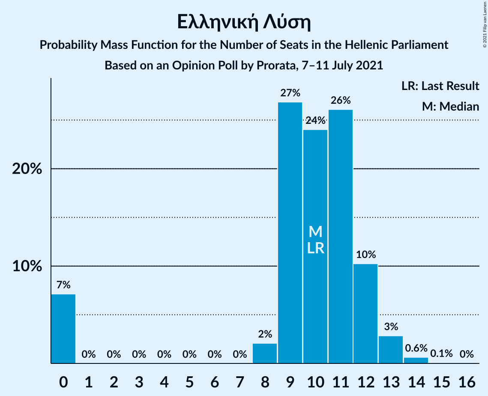

# Opinion Poll by Prorata for Η Εφημερίδα των Συντακτών, 7–11 July 2021

<a href="#voting-intentions">Voting Intentions</a> | <a href="#seats">Seats</a> | <a href="#coalitions">Coalitions</a> | <a href="#technical-information">Technical Information</a>

## Voting Intentions

### Confidence Intervals

| Party | Last Result | Poll Result | 80% Confidence Interval | 90% Confidence Interval | 95% Confidence Interval | 99% Confidence Interval |
|:-----:|:-----------:|:-----------:|:-----------------------:|:-----------------------:|:-----------------------:|:-----------------------:|
| Νέα Δημοκρατία | 39.8% | 41.3% | 39.8–42.9% |39.4–43.3% |39.0–43.7% |38.3–44.4% |
| Συνασπισμός Ριζοσπαστικής Αριστεράς | 31.5% | 29.3% | 27.9–30.7% |27.5–31.1% |27.2–31.5% |26.5–32.2% |
| Κίνημα Αλλαγής | 8.1% | 8.4% | 7.6–9.3% |7.4–9.6% |7.2–9.8% |6.8–10.3% |
| Κομμουνιστικό Κόμμα Ελλάδας | 5.3% | 4.8% | 4.2–5.5% |4.0–5.7% |3.9–5.9% |3.6–6.3% |
| Ελληνική Λύση | 3.7% | 3.6% | 3.1–4.2% |2.9–4.4% |2.8–4.6% |2.6–4.9% |
| Μέτωπο Ευρωπαϊκής Ρεαλιστικής Ανυπακοής | 3.4% | 3.0% | 2.5–3.6% |2.4–3.8% |2.3–3.9% |2.1–4.2% |

*Note:* The poll result column reflects the actual value used in the calculations. Published results may vary slightly, and in addition be rounded to fewer digits.

## Seats

### Confidence Intervals

| Party | Last Result | Median | 80% Confidence Interval | 90% Confidence Interval | 95% Confidence Interval | 99% Confidence Interval |
|:-----:|:-----------:|:------:|:-----------------------:|:-----------------------:|:-----------------------:|:-----------------------:|
| <a href="#νέα-δημοκρατία">Νέα Δημοκρατία</a> | 158 | 166 | 161–171 |159–173 |158–175 |157–177 |
| <a href="#συνασπισμός-ριζοσπαστικής-αριστεράς">Συνασπισμός Ριζοσπαστικής Αριστεράς</a> | 86 | 82 | 78–87 |77–88 |76–89 |74–91 |
| <a href="#κίνημα-αλλαγής">Κίνημα Αλλαγής</a> | 22 | 24 | 21–26 |21–27 |20–28 |19–29 |
| <a href="#κομμουνιστικό-κόμμα-ελλάδας">Κομμουνιστικό Κόμμα Ελλάδας</a> | 15 | 13 | 12–16 |11–16 |11–17 |10–18 |
| <a href="#ελληνική-λύση">Ελληνική Λύση</a> | 10 | 10 | 9–12 |0–12 |0–13 |0–14 |
| <a href="#μέτωπο-ευρωπαϊκής-ρεαλιστικής-ανυπακοής">Μέτωπο Ευρωπαϊκής Ρεαλιστικής Ανυπακοής</a> | 9 | 8 | 0–10 |0–10 |0–11 |0–12 |

### Νέα Δημοκρατία

*For a full overview of the results for this party, see the [Νέα Δημοκρατία](party-νέαδημοκρατία.html) page.*

| Number of Seats | Probability | Accumulated | Special Marks |
|:---------------:|:-----------:|:-----------:|:-------------:|
| 154 | 0.1% | 100% |  |
| 155 | 0.1% | 99.9% |  |
| 156 | 0.2% | 99.8% |  |
| 157 | 0.7% | 99.5% |  |
| 158 | 2% | 98.8% | Last Result |
| 159 | 2% | 97% |  |
| 160 | 3% | 95% |  |
| 161 | 4% | 92% |  |
| 162 | 7% | 88% |  |
| 163 | 13% | 81% |  |
| 164 | 7% | 69% |  |
| 165 | 6% | 62% |  |
| 166 | 12% | 56% | Median |
| 167 | 12% | 44% |  |
| 168 | 8% | 32% |  |
| 169 | 5% | 24% |  |
| 170 | 6% | 19% |  |
| 171 | 4% | 13% |  |
| 172 | 4% | 9% |  |
| 173 | 2% | 5% |  |
| 174 | 0.8% | 4% |  |
| 175 | 0.9% | 3% |  |
| 176 | 1.4% | 2% |  |
| 177 | 0.3% | 0.7% |  |
| 178 | 0% | 0.4% |  |
| 179 | 0.1% | 0.3% |  |
| 180 | 0.2% | 0.2% |  |
| 181 | 0% | 0% |  |

### Συνασπισμός Ριζοσπαστικής Αριστεράς

*For a full overview of the results for this party, see the [Συνασπισμός Ριζοσπαστικής Αριστεράς](party-συνασπισμόςριζοσπαστικήςαριστεράς.html) page.*

| Number of Seats | Probability | Accumulated | Special Marks |
|:---------------:|:-----------:|:-----------:|:-------------:|
| 72 | 0.1% | 100% |  |
| 73 | 0.3% | 99.9% |  |
| 74 | 0.8% | 99.6% |  |
| 75 | 0.7% | 98.8% |  |
| 76 | 2% | 98% |  |
| 77 | 4% | 96% |  |
| 78 | 5% | 91% |  |
| 79 | 10% | 86% |  |
| 80 | 7% | 76% |  |
| 81 | 11% | 69% |  |
| 82 | 11% | 58% | Median |
| 83 | 11% | 47% |  |
| 84 | 11% | 36% |  |
| 85 | 5% | 25% |  |
| 86 | 9% | 20% | Last Result |
| 87 | 4% | 10% |  |
| 88 | 3% | 6% |  |
| 89 | 2% | 4% |  |
| 90 | 0.8% | 2% |  |
| 91 | 0.7% | 1.1% |  |
| 92 | 0.2% | 0.4% |  |
| 93 | 0.1% | 0.2% |  |
| 94 | 0% | 0.1% |  |
| 95 | 0% | 0% |  |

### Κίνημα Αλλαγής

*For a full overview of the results for this party, see the [Κίνημα Αλλαγής](party-κίνημααλλαγής.html) page.*

| Number of Seats | Probability | Accumulated | Special Marks |
|:---------------:|:-----------:|:-----------:|:-------------:|
| 18 | 0.2% | 100% |  |
| 19 | 0.9% | 99.8% |  |
| 20 | 3% | 98.9% |  |
| 21 | 8% | 95% |  |
| 22 | 14% | 88% | Last Result |
| 23 | 23% | 74% |  |
| 24 | 16% | 51% | Median |
| 25 | 16% | 34% |  |
| 26 | 10% | 18% |  |
| 27 | 5% | 8% |  |
| 28 | 2% | 3% |  |
| 29 | 0.6% | 1.0% |  |
| 30 | 0.3% | 0.4% |  |
| 31 | 0.1% | 0.1% |  |
| 32 | 0% | 0% |  |

### Κομμουνιστικό Κόμμα Ελλάδας

*For a full overview of the results for this party, see the [Κομμουνιστικό Κόμμα Ελλάδας](party-κομμουνιστικόκόμμαελλάδας.html) page.*

| Number of Seats | Probability | Accumulated | Special Marks |
|:---------------:|:-----------:|:-----------:|:-------------:|
| 9 | 0.1% | 100% |  |
| 10 | 1.1% | 99.9% |  |
| 11 | 6% | 98.8% |  |
| 12 | 16% | 93% |  |
| 13 | 28% | 77% | Median |
| 14 | 21% | 49% |  |
| 15 | 18% | 28% | Last Result |
| 16 | 7% | 10% |  |
| 17 | 2% | 3% |  |
| 18 | 0.7% | 0.8% |  |
| 19 | 0.1% | 0.2% |  |
| 20 | 0% | 0% |  |

### Ελληνική Λύση

*For a full overview of the results for this party, see the [Ελληνική Λύση](party-ελληνικήλύση.html) page.*

| Number of Seats | Probability | Accumulated | Special Marks |
|:---------------:|:-----------:|:-----------:|:-------------:|
| 0 | 7% | 100% |  |
| 1 | 0% | 93% |  |
| 2 | 0% | 93% |  |
| 3 | 0% | 93% |  |
| 4 | 0% | 93% |  |
| 5 | 0% | 93% |  |
| 6 | 0% | 93% |  |
| 7 | 0% | 93% |  |
| 8 | 2% | 93% |  |
| 9 | 27% | 91% |  |
| 10 | 24% | 64% | Last Result, Median |
| 11 | 26% | 40% |  |
| 12 | 10% | 14% |  |
| 13 | 3% | 4% |  |
| 14 | 0.6% | 0.7% |  |
| 15 | 0.1% | 0.1% |  |
| 16 | 0% | 0% |  |

### Μέτωπο Ευρωπαϊκής Ρεαλιστικής Ανυπακοής

*For a full overview of the results for this party, see the [Μέτωπο Ευρωπαϊκής Ρεαλιστικής Ανυπακοής](party-μέτωποευρωπαϊκήςρεαλιστικήςανυπακοής.html) page.*

| Number of Seats | Probability | Accumulated | Special Marks |
|:---------------:|:-----------:|:-----------:|:-------------:|
| 0 | 47% | 100% |  |
| 1 | 0% | 53% |  |
| 2 | 0% | 53% |  |
| 3 | 0% | 53% |  |
| 4 | 0% | 53% |  |
| 5 | 0% | 53% |  |
| 6 | 0% | 53% |  |
| 7 | 0% | 53% |  |
| 8 | 6% | 53% | Median |
| 9 | 28% | 47% | Last Result |
| 10 | 14% | 19% |  |
| 11 | 4% | 5% |  |
| 12 | 0.7% | 0.7% |  |
| 13 | 0.1% | 0.1% |  |
| 14 | 0% | 0% |  |

## Coalitions

### Confidence Intervals

| Coalition | Last Result | Median | Majority? | 80% Confidence Interval | 90% Confidence Interval | 95% Confidence Interval | 99% Confidence Interval |
|:---------:|:-----------:|:------:|:---------:|:-----------------------:|:-----------------------:|:-----------------------:|:-----------------------:|
| Νέα Δημοκρατία – Κίνημα Αλλαγής | 180 | 189 | 100% | 184–195 | 183–197 | 182–199 | 179–202 |
| Νέα Δημοκρατία | 158 | 166 | 100% | 161–171 | 159–173 | 158–175 | 157–177 |
| Συνασπισμός Ριζοσπαστικής Αριστεράς – Μέτωπο Ευρωπαϊκής Ρεαλιστικής Ανυπακοής | 95 | 87 | 0% | 81–93 | 80–94 | 79–96 | 77–97 |
| Συνασπισμός Ριζοσπαστικής Αριστεράς | 86 | 82 | 0% | 78–87 | 77–88 | 76–89 | 74–91 |

### Νέα Δημοκρατία – Κίνημα Αλλαγής

| Number of Seats | Probability | Accumulated | Special Marks |
|:---------------:|:-----------:|:-----------:|:-------------:|
| 177 | 0% | 100% |  |
| 178 | 0.2% | 99.9% |  |
| 179 | 0.4% | 99.8% |  |
| 180 | 0.4% | 99.3% | Last Result |
| 181 | 1.1% | 99.0% |  |
| 182 | 2% | 98% |  |
| 183 | 2% | 96% |  |
| 184 | 4% | 94% |  |
| 185 | 6% | 90% |  |
| 186 | 8% | 83% |  |
| 187 | 10% | 75% |  |
| 188 | 7% | 66% |  |
| 189 | 11% | 59% |  |
| 190 | 9% | 48% | Median |
| 191 | 6% | 39% |  |
| 192 | 10% | 34% |  |
| 193 | 5% | 24% |  |
| 194 | 5% | 19% |  |
| 195 | 4% | 14% |  |
| 196 | 2% | 10% |  |
| 197 | 2% | 7% |  |
| 198 | 2% | 5% |  |
| 199 | 0.8% | 3% |  |
| 200 | 1.1% | 2% |  |
| 201 | 0.5% | 1.1% |  |
| 202 | 0.3% | 0.7% |  |
| 203 | 0.1% | 0.4% |  |
| 204 | 0.1% | 0.3% |  |
| 205 | 0.1% | 0.2% |  |
| 206 | 0% | 0.1% |  |
| 207 | 0% | 0% |  |

### Νέα Δημοκρατία

| Number of Seats | Probability | Accumulated | Special Marks |
|:---------------:|:-----------:|:-----------:|:-------------:|
| 154 | 0.1% | 100% |  |
| 155 | 0.1% | 99.9% |  |
| 156 | 0.2% | 99.8% |  |
| 157 | 0.7% | 99.5% |  |
| 158 | 2% | 98.8% | Last Result |
| 159 | 2% | 97% |  |
| 160 | 3% | 95% |  |
| 161 | 4% | 92% |  |
| 162 | 7% | 88% |  |
| 163 | 13% | 81% |  |
| 164 | 7% | 69% |  |
| 165 | 6% | 62% |  |
| 166 | 12% | 56% | Median |
| 167 | 12% | 44% |  |
| 168 | 8% | 32% |  |
| 169 | 5% | 24% |  |
| 170 | 6% | 19% |  |
| 171 | 4% | 13% |  |
| 172 | 4% | 9% |  |
| 173 | 2% | 5% |  |
| 174 | 0.8% | 4% |  |
| 175 | 0.9% | 3% |  |
| 176 | 1.4% | 2% |  |
| 177 | 0.3% | 0.7% |  |
| 178 | 0% | 0.4% |  |
| 179 | 0.1% | 0.3% |  |
| 180 | 0.2% | 0.2% |  |
| 181 | 0% | 0% |  |

### Συνασπισμός Ριζοσπαστικής Αριστεράς – Μέτωπο Ευρωπαϊκής Ρεαλιστικής Ανυπακοής

| Number of Seats | Probability | Accumulated | Special Marks |
|:---------------:|:-----------:|:-----------:|:-------------:|
| 74 | 0% | 100% |  |
| 75 | 0.1% | 99.9% |  |
| 76 | 0.2% | 99.9% |  |
| 77 | 0.7% | 99.6% |  |
| 78 | 1.3% | 99.0% |  |
| 79 | 1.3% | 98% |  |
| 80 | 2% | 96% |  |
| 81 | 5% | 94% |  |
| 82 | 5% | 90% |  |
| 83 | 8% | 85% |  |
| 84 | 6% | 77% |  |
| 85 | 5% | 71% |  |
| 86 | 11% | 66% |  |
| 87 | 8% | 56% |  |
| 88 | 10% | 48% |  |
| 89 | 5% | 37% |  |
| 90 | 7% | 32% | Median |
| 91 | 6% | 25% |  |
| 92 | 9% | 19% |  |
| 93 | 4% | 10% |  |
| 94 | 2% | 6% |  |
| 95 | 1.4% | 4% | Last Result |
| 96 | 1.5% | 3% |  |
| 97 | 0.7% | 1.2% |  |
| 98 | 0.2% | 0.4% |  |
| 99 | 0% | 0.2% |  |
| 100 | 0.1% | 0.1% |  |
| 101 | 0% | 0.1% |  |
| 102 | 0% | 0% |  |

### Συνασπισμός Ριζοσπαστικής Αριστεράς

| Number of Seats | Probability | Accumulated | Special Marks |
|:---------------:|:-----------:|:-----------:|:-------------:|
| 72 | 0.1% | 100% |  |
| 73 | 0.3% | 99.9% |  |
| 74 | 0.8% | 99.6% |  |
| 75 | 0.7% | 98.8% |  |
| 76 | 2% | 98% |  |
| 77 | 4% | 96% |  |
| 78 | 5% | 91% |  |
| 79 | 10% | 86% |  |
| 80 | 7% | 76% |  |
| 81 | 11% | 69% |  |
| 82 | 11% | 58% | Median |
| 83 | 11% | 47% |  |
| 84 | 11% | 36% |  |
| 85 | 5% | 25% |  |
| 86 | 9% | 20% | Last Result |
| 87 | 4% | 10% |  |
| 88 | 3% | 6% |  |
| 89 | 2% | 4% |  |
| 90 | 0.8% | 2% |  |
| 91 | 0.7% | 1.1% |  |
| 92 | 0.2% | 0.4% |  |
| 93 | 0.1% | 0.2% |  |
| 94 | 0% | 0.1% |  |
| 95 | 0% | 0% |  |

## Technical Information

### Opinion Poll

+ **Polling firm:** Prorata
+ **Commissioner(s):** Η Εφημερίδα των Συντακτών
+ **Fieldwork period:** 7–11 July 2021

### Calculations

+ **Sample size:** 1735
+ **Simulations done:** 131,072
+ **Error estimate:** 1.34%

