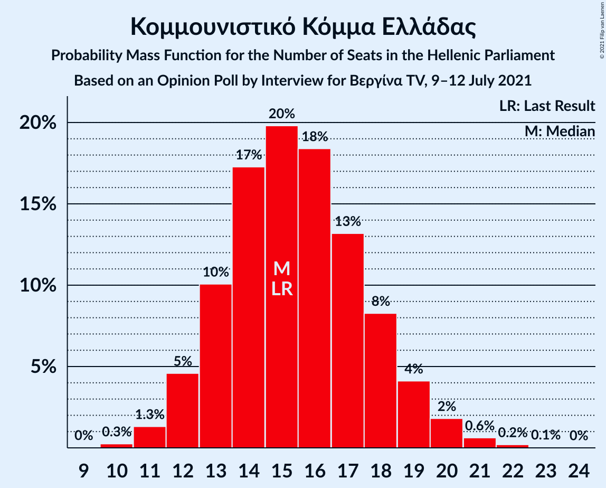

# Opinion Poll by Interview for Βεργίνα TV, 9–12 July 2021

<a href="#voting-intentions">Voting Intentions</a> | <a href="#seats">Seats</a> | <a href="#coalitions">Coalitions</a> | <a href="#technical-information">Technical Information</a>

## Voting Intentions

### Confidence Intervals

| Party | Last Result | Poll Result | 80% Confidence Interval | 90% Confidence Interval | 95% Confidence Interval | 99% Confidence Interval |
|:-----:|:-----------:|:-----------:|:-----------------------:|:-----------------------:|:-----------------------:|:-----------------------:|
| Νέα Δημοκρατία | 39.8% | 43.1% | 41.1–45.1% |40.5–45.7% |40.1–46.2% |39.1–47.2% |
| Συνασπισμός Ριζοσπαστικής Αριστεράς | 31.5% | 22.2% | 20.6–24.0% |20.1–24.4% |19.7–24.9% |19.0–25.7% |
| Κίνημα Αλλαγής | 8.1% | 9.7% | 8.6–11.0% |8.3–11.4% |8.0–11.7% |7.5–12.3% |
| Ελληνική Λύση | 3.7% | 6.9% | 6.0–8.0% |5.7–8.4% |5.5–8.7% |5.1–9.2% |
| Κομμουνιστικό Κόμμα Ελλάδας | 5.3% | 5.6% | 4.8–6.6% |4.5–7.0% |4.3–7.2% |4.0–7.7% |
| Μέτωπο Ευρωπαϊκής Ρεαλιστικής Ανυπακοής | 3.4% | 4.2% | 3.5–5.1% |3.3–5.4% |3.1–5.6% |2.8–6.1% |

*Note:* The poll result column reflects the actual value used in the calculations. Published results may vary slightly, and in addition be rounded to fewer digits.

## Seats

### Confidence Intervals

| Party | Last Result | Median | 80% Confidence Interval | 90% Confidence Interval | 95% Confidence Interval | 99% Confidence Interval |
|:-----:|:-----------:|:------:|:-----------------------:|:-----------------------:|:-----------------------:|:-----------------------:|
| <a href="#νέα-δημοκρατία">Νέα Δημοκρατία</a> | 158 | 167 | 162–172 |160–174 |159–175 |156–178 |
| <a href="#συνασπισμός-ριζοσπαστικής-αριστεράς">Συνασπισμός Ριζοσπαστικής Αριστεράς</a> | 86 | 60 | 56–65 |55–66 |54–68 |52–70 |
| <a href="#κίνημα-αλλαγής">Κίνημα Αλλαγής</a> | 22 | 27 | 23–30 |22–31 |22–32 |20–33 |
| <a href="#ελληνική-λύση">Ελληνική Λύση</a> | 10 | 19 | 16–22 |16–23 |15–23 |14–25 |
| <a href="#κομμουνιστικό-κόμμα-ελλάδας">Κομμουνιστικό Κόμμα Ελλάδας</a> | 15 | 15 | 13–18 |12–19 |12–20 |11–21 |
| <a href="#μέτωπο-ευρωπαϊκής-ρεαλιστικής-ανυπακοής">Μέτωπο Ευρωπαϊκής Ρεαλιστικής Ανυπακοής</a> | 9 | 12 | 9–14 |9–15 |8–15 |0–17 |

### Νέα Δημοκρατία

*For a full overview of the results for this party, see the [Νέα Δημοκρατία](party-νέαδημοκρατία.html) page.*

| Number of Seats | Probability | Accumulated | Special Marks |
|:---------------:|:-----------:|:-----------:|:-------------:|
| 154 | 0.1% | 100% |  |
| 155 | 0.1% | 99.9% |  |
| 156 | 0.3% | 99.7% |  |
| 157 | 0.5% | 99.5% |  |
| 158 | 0.9% | 99.0% | Last Result |
| 159 | 2% | 98% |  |
| 160 | 2% | 97% |  |
| 161 | 4% | 94% |  |
| 162 | 5% | 91% |  |
| 163 | 6% | 86% |  |
| 164 | 8% | 80% |  |
| 165 | 9% | 72% |  |
| 166 | 9% | 64% |  |
| 167 | 9% | 55% | Median |
| 168 | 9% | 45% |  |
| 169 | 9% | 36% |  |
| 170 | 8% | 28% |  |
| 171 | 6% | 20% |  |
| 172 | 5% | 14% |  |
| 173 | 3% | 9% |  |
| 174 | 2% | 6% |  |
| 175 | 1.4% | 4% |  |
| 176 | 1.0% | 2% |  |
| 177 | 0.6% | 1.3% |  |
| 178 | 0.3% | 0.7% |  |
| 179 | 0.2% | 0.4% |  |
| 180 | 0.1% | 0.2% |  |
| 181 | 0.1% | 0.1% |  |
| 182 | 0% | 0% |  |

### Συνασπισμός Ριζοσπαστικής Αριστεράς

*For a full overview of the results for this party, see the [Συνασπισμός Ριζοσπαστικής Αριστεράς](party-συνασπισμόςριζοσπαστικήςαριστεράς.html) page.*

| Number of Seats | Probability | Accumulated | Special Marks |
|:---------------:|:-----------:|:-----------:|:-------------:|
| 49 | 0% | 100% |  |
| 50 | 0.1% | 99.9% |  |
| 51 | 0.3% | 99.8% |  |
| 52 | 0.6% | 99.5% |  |
| 53 | 1.2% | 98.9% |  |
| 54 | 2% | 98% |  |
| 55 | 4% | 95% |  |
| 56 | 6% | 92% |  |
| 57 | 7% | 86% |  |
| 58 | 9% | 79% |  |
| 59 | 10% | 70% |  |
| 60 | 11% | 60% | Median |
| 61 | 11% | 48% |  |
| 62 | 10% | 37% |  |
| 63 | 9% | 27% |  |
| 64 | 6% | 19% |  |
| 65 | 5% | 12% |  |
| 66 | 3% | 8% |  |
| 67 | 2% | 5% |  |
| 68 | 1.2% | 3% |  |
| 69 | 0.7% | 1.3% |  |
| 70 | 0.4% | 0.6% |  |
| 71 | 0.2% | 0.3% |  |
| 72 | 0.1% | 0.1% |  |
| 73 | 0% | 0.1% |  |
| 74 | 0% | 0% |  |
| 75 | 0% | 0% |  |
| 76 | 0% | 0% |  |
| 77 | 0% | 0% |  |
| 78 | 0% | 0% |  |
| 79 | 0% | 0% |  |
| 80 | 0% | 0% |  |
| 81 | 0% | 0% |  |
| 82 | 0% | 0% |  |
| 83 | 0% | 0% |  |
| 84 | 0% | 0% |  |
| 85 | 0% | 0% |  |
| 86 | 0% | 0% | Last Result |

### Κίνημα Αλλαγής

*For a full overview of the results for this party, see the [Κίνημα Αλλαγής](party-κίνημααλλαγής.html) page.*

| Number of Seats | Probability | Accumulated | Special Marks |
|:---------------:|:-----------:|:-----------:|:-------------:|
| 19 | 0.1% | 100% |  |
| 20 | 0.5% | 99.9% |  |
| 21 | 2% | 99.4% |  |
| 22 | 4% | 98% | Last Result |
| 23 | 7% | 94% |  |
| 24 | 9% | 87% |  |
| 25 | 13% | 78% |  |
| 26 | 12% | 65% |  |
| 27 | 14% | 53% | Median |
| 28 | 13% | 39% |  |
| 29 | 11% | 26% |  |
| 30 | 6% | 15% |  |
| 31 | 5% | 8% |  |
| 32 | 2% | 3% |  |
| 33 | 0.8% | 1.2% |  |
| 34 | 0.3% | 0.4% |  |
| 35 | 0.1% | 0.2% |  |
| 36 | 0% | 0% |  |

### Ελληνική Λύση

*For a full overview of the results for this party, see the [Ελληνική Λύση](party-ελληνικήλύση.html) page.*

| Number of Seats | Probability | Accumulated | Special Marks |
|:---------------:|:-----------:|:-----------:|:-------------:|
| 10 | 0% | 100% | Last Result |
| 11 | 0% | 100% |  |
| 12 | 0% | 100% |  |
| 13 | 0.3% | 100% |  |
| 14 | 1.1% | 99.7% |  |
| 15 | 3% | 98.5% |  |
| 16 | 8% | 95% |  |
| 17 | 13% | 88% |  |
| 18 | 17% | 74% |  |
| 19 | 18% | 57% | Median |
| 20 | 15% | 39% |  |
| 21 | 12% | 24% |  |
| 22 | 7% | 12% |  |
| 23 | 4% | 6% |  |
| 24 | 1.4% | 2% |  |
| 25 | 0.6% | 0.9% |  |
| 26 | 0.2% | 0.3% |  |
| 27 | 0.1% | 0.1% |  |
| 28 | 0% | 0% |  |

### Κομμουνιστικό Κόμμα Ελλάδας

*For a full overview of the results for this party, see the [Κομμουνιστικό Κόμμα Ελλάδας](party-κομμουνιστικόκόμμαελλάδας.html) page.*

| Number of Seats | Probability | Accumulated | Special Marks |
|:---------------:|:-----------:|:-----------:|:-------------:|
| 10 | 0.3% | 100% |  |
| 11 | 1.3% | 99.7% |  |
| 12 | 5% | 98% |  |
| 13 | 10% | 94% |  |
| 14 | 17% | 84% |  |
| 15 | 20% | 66% | Last Result, Median |
| 16 | 18% | 47% |  |
| 17 | 13% | 28% |  |
| 18 | 8% | 15% |  |
| 19 | 4% | 7% |  |
| 20 | 2% | 3% |  |
| 21 | 0.6% | 0.9% |  |
| 22 | 0.2% | 0.3% |  |
| 23 | 0.1% | 0.1% |  |
| 24 | 0% | 0% |  |

### Μέτωπο Ευρωπαϊκής Ρεαλιστικής Ανυπακοής

*For a full overview of the results for this party, see the [Μέτωπο Ευρωπαϊκής Ρεαλιστικής Ανυπακοής](party-μέτωποευρωπαϊκήςρεαλιστικήςανυπακοής.html) page.*

| Number of Seats | Probability | Accumulated | Special Marks |
|:---------------:|:-----------:|:-----------:|:-------------:|
| 0 | 2% | 100% |  |
| 1 | 0% | 98% |  |
| 2 | 0% | 98% |  |
| 3 | 0% | 98% |  |
| 4 | 0% | 98% |  |
| 5 | 0% | 98% |  |
| 6 | 0% | 98% |  |
| 7 | 0% | 98% |  |
| 8 | 1.2% | 98% |  |
| 9 | 8% | 97% | Last Result |
| 10 | 17% | 89% |  |
| 11 | 21% | 72% |  |
| 12 | 22% | 52% | Median |
| 13 | 15% | 30% |  |
| 14 | 8% | 15% |  |
| 15 | 4% | 6% |  |
| 16 | 2% | 2% |  |
| 17 | 0.4% | 0.6% |  |
| 18 | 0.1% | 0.2% |  |
| 19 | 0% | 0% |  |

## Coalitions

### Confidence Intervals

| Coalition | Last Result | Median | Majority? | 80% Confidence Interval | 90% Confidence Interval | 95% Confidence Interval | 99% Confidence Interval |
|:---------:|:-----------:|:------:|:---------:|:-----------------------:|:-----------------------:|:-----------------------:|:-----------------------:|
| Νέα Δημοκρατία – Κίνημα Αλλαγής | 180 | 194 | 100% | 188–199 | 187–201 | 186–202 | 183–205 |
| Νέα Δημοκρατία | 158 | 167 | 100% | 162–172 | 160–174 | 159–175 | 156–178 |
| Συνασπισμός Ριζοσπαστικής Αριστεράς – Μέτωπο Ευρωπαϊκής Ρεαλιστικής Ανυπακοής | 95 | 72 | 0% | 67–77 | 65–78 | 64–80 | 61–82 |
| Συνασπισμός Ριζοσπαστικής Αριστεράς | 86 | 60 | 0% | 56–65 | 55–66 | 54–68 | 52–70 |

### Νέα Δημοκρατία – Κίνημα Αλλαγής

| Number of Seats | Probability | Accumulated | Special Marks |
|:---------------:|:-----------:|:-----------:|:-------------:|
| 180 | 0% | 100% | Last Result |
| 181 | 0.1% | 99.9% |  |
| 182 | 0.2% | 99.8% |  |
| 183 | 0.4% | 99.6% |  |
| 184 | 0.6% | 99.3% |  |
| 185 | 1.1% | 98.6% |  |
| 186 | 2% | 98% |  |
| 187 | 3% | 96% |  |
| 188 | 3% | 93% |  |
| 189 | 5% | 90% |  |
| 190 | 6% | 84% |  |
| 191 | 8% | 78% |  |
| 192 | 9% | 70% |  |
| 193 | 9% | 61% |  |
| 194 | 9% | 52% | Median |
| 195 | 9% | 42% |  |
| 196 | 8% | 33% |  |
| 197 | 7% | 25% |  |
| 198 | 6% | 18% |  |
| 199 | 4% | 12% |  |
| 200 | 3% | 8% |  |
| 201 | 2% | 5% |  |
| 202 | 1.3% | 3% |  |
| 203 | 0.8% | 2% |  |
| 204 | 0.5% | 1.1% |  |
| 205 | 0.3% | 0.6% |  |
| 206 | 0.2% | 0.3% |  |
| 207 | 0.1% | 0.2% |  |
| 208 | 0.1% | 0.1% |  |
| 209 | 0% | 0.1% |  |
| 210 | 0% | 0% |  |

### Νέα Δημοκρατία

| Number of Seats | Probability | Accumulated | Special Marks |
|:---------------:|:-----------:|:-----------:|:-------------:|
| 154 | 0.1% | 100% |  |
| 155 | 0.1% | 99.9% |  |
| 156 | 0.3% | 99.7% |  |
| 157 | 0.5% | 99.5% |  |
| 158 | 0.9% | 99.0% | Last Result |
| 159 | 2% | 98% |  |
| 160 | 2% | 97% |  |
| 161 | 4% | 94% |  |
| 162 | 5% | 91% |  |
| 163 | 6% | 86% |  |
| 164 | 8% | 80% |  |
| 165 | 9% | 72% |  |
| 166 | 9% | 64% |  |
| 167 | 9% | 55% | Median |
| 168 | 9% | 45% |  |
| 169 | 9% | 36% |  |
| 170 | 8% | 28% |  |
| 171 | 6% | 20% |  |
| 172 | 5% | 14% |  |
| 173 | 3% | 9% |  |
| 174 | 2% | 6% |  |
| 175 | 1.4% | 4% |  |
| 176 | 1.0% | 2% |  |
| 177 | 0.6% | 1.3% |  |
| 178 | 0.3% | 0.7% |  |
| 179 | 0.2% | 0.4% |  |
| 180 | 0.1% | 0.2% |  |
| 181 | 0.1% | 0.1% |  |
| 182 | 0% | 0% |  |

### Συνασπισμός Ριζοσπαστικής Αριστεράς – Μέτωπο Ευρωπαϊκής Ρεαλιστικής Ανυπακοής

| Number of Seats | Probability | Accumulated | Special Marks |
|:---------------:|:-----------:|:-----------:|:-------------:|
| 57 | 0% | 100% |  |
| 58 | 0.1% | 99.9% |  |
| 59 | 0.1% | 99.8% |  |
| 60 | 0.2% | 99.7% |  |
| 61 | 0.3% | 99.6% |  |
| 62 | 0.4% | 99.3% |  |
| 63 | 0.7% | 98.9% |  |
| 64 | 1.2% | 98% |  |
| 65 | 2% | 97% |  |
| 66 | 3% | 95% |  |
| 67 | 5% | 92% |  |
| 68 | 7% | 87% |  |
| 69 | 8% | 81% |  |
| 70 | 8% | 73% |  |
| 71 | 10% | 65% |  |
| 72 | 12% | 55% | Median |
| 73 | 9% | 43% |  |
| 74 | 9% | 35% |  |
| 75 | 8% | 25% |  |
| 76 | 6% | 18% |  |
| 77 | 4% | 12% |  |
| 78 | 4% | 8% |  |
| 79 | 2% | 4% |  |
| 80 | 1.1% | 3% |  |
| 81 | 0.7% | 1.4% |  |
| 82 | 0.4% | 0.7% |  |
| 83 | 0.2% | 0.3% |  |
| 84 | 0.1% | 0.1% |  |
| 85 | 0% | 0.1% |  |
| 86 | 0% | 0% |  |
| 87 | 0% | 0% |  |
| 88 | 0% | 0% |  |
| 89 | 0% | 0% |  |
| 90 | 0% | 0% |  |
| 91 | 0% | 0% |  |
| 92 | 0% | 0% |  |
| 93 | 0% | 0% |  |
| 94 | 0% | 0% |  |
| 95 | 0% | 0% | Last Result |

### Συνασπισμός Ριζοσπαστικής Αριστεράς

| Number of Seats | Probability | Accumulated | Special Marks |
|:---------------:|:-----------:|:-----------:|:-------------:|
| 49 | 0% | 100% |  |
| 50 | 0.1% | 99.9% |  |
| 51 | 0.3% | 99.8% |  |
| 52 | 0.6% | 99.5% |  |
| 53 | 1.2% | 98.9% |  |
| 54 | 2% | 98% |  |
| 55 | 4% | 95% |  |
| 56 | 6% | 92% |  |
| 57 | 7% | 86% |  |
| 58 | 9% | 79% |  |
| 59 | 10% | 70% |  |
| 60 | 11% | 60% | Median |
| 61 | 11% | 48% |  |
| 62 | 10% | 37% |  |
| 63 | 9% | 27% |  |
| 64 | 6% | 19% |  |
| 65 | 5% | 12% |  |
| 66 | 3% | 8% |  |
| 67 | 2% | 5% |  |
| 68 | 1.2% | 3% |  |
| 69 | 0.7% | 1.3% |  |
| 70 | 0.4% | 0.6% |  |
| 71 | 0.2% | 0.3% |  |
| 72 | 0.1% | 0.1% |  |
| 73 | 0% | 0.1% |  |
| 74 | 0% | 0% |  |
| 75 | 0% | 0% |  |
| 76 | 0% | 0% |  |
| 77 | 0% | 0% |  |
| 78 | 0% | 0% |  |
| 79 | 0% | 0% |  |
| 80 | 0% | 0% |  |
| 81 | 0% | 0% |  |
| 82 | 0% | 0% |  |
| 83 | 0% | 0% |  |
| 84 | 0% | 0% |  |
| 85 | 0% | 0% |  |
| 86 | 0% | 0% | Last Result |

## Technical Information

### Opinion Poll

+ **Polling firm:** Interview
+ **Commissioner(s):** Βεργίνα TV
+ **Fieldwork period:** 9–12 July 2021

### Calculations

+ **Sample size:** 1000
+ **Simulations done:** 1,048,576
+ **Error estimate:** 1.39%

