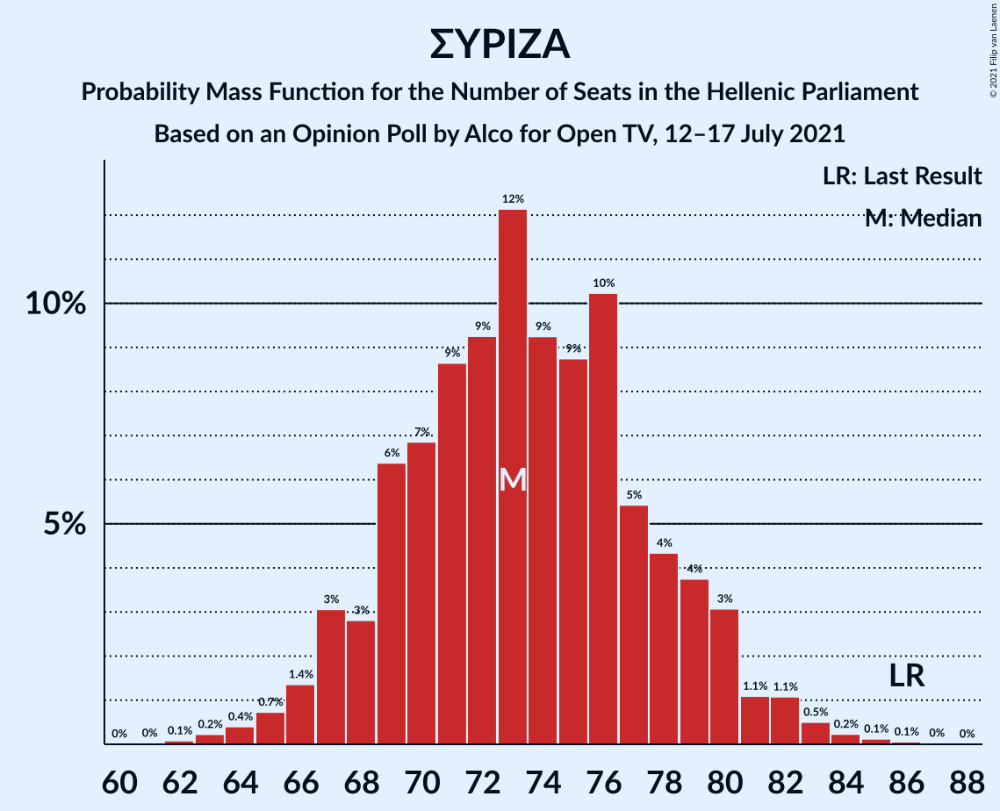

# Opinion Poll by Alco for Open TV, 12–17 July 2021

<a href="#voting-intentions">Voting Intentions</a> | <a href="#seats">Seats</a> | <a href="#coalitions">Coalitions</a> | <a href="#technical-information">Technical Information</a>

## Voting Intentions

### Confidence Intervals

| Party | Last Result | Poll Result | 80% Confidence Interval | 90% Confidence Interval | 95% Confidence Interval | 99% Confidence Interval |
|:-----:|:-----------:|:-----------:|:-----------------------:|:-----------------------:|:-----------------------:|:-----------------------:|
| Νέα Δημοκρατία | 39.8% | 41.7% | 39.7–43.7% |39.2–44.3% |38.7–44.8% |37.7–45.8% |
| Συνασπισμός Ριζοσπαστικής Αριστεράς | 31.5% | 27.2% | 25.5–29.1% |25.0–29.6% |24.5–30.1% |23.7–31.0% |
| Κίνημα Αλλαγής | 8.1% | 7.9% | 6.9–9.1% |6.6–9.4% |6.4–9.7% |5.9–10.3% |
| Κομμουνιστικό Κόμμα Ελλάδας | 5.3% | 6.2% | 5.3–7.3% |5.1–7.6% |4.9–7.9% |4.5–8.4% |
| Ελληνική Λύση | 3.7% | 5.2% | 4.4–6.2% |4.2–6.5% |4.0–6.8% |3.6–7.3% |
| Μέτωπο Ευρωπαϊκής Ρεαλιστικής Ανυπακοής | 3.4% | 4.1% | 3.4–5.0% |3.2–5.3% |3.0–5.5% |2.7–6.0% |
| Πλεύση Ελευθερίας | 1.5% | 1.8% | 1.4–2.5% |1.2–2.7% |1.1–2.8% |1.0–3.2% |

*Note:* The poll result column reflects the actual value used in the calculations. Published results may vary slightly, and in addition be rounded to fewer digits.

## Seats

### Confidence Intervals

| Party | Last Result | Median | 80% Confidence Interval | 90% Confidence Interval | 95% Confidence Interval | 99% Confidence Interval |
|:-----:|:-----------:|:------:|:-----------------------:|:-----------------------:|:-----------------------:|:-----------------------:|
| <a href="#νέα-δημοκρατία">Νέα Δημοκρατία</a> | 158 | 163 | 157–168 |156–169 |154–171 |152–174 |
| <a href="#συνασπισμός-ριζοσπαστικής-αριστεράς">Συνασπισμός Ριζοσπαστικής Αριστεράς</a> | 86 | 73 | 69–78 |67–80 |66–81 |64–83 |
| <a href="#κίνημα-αλλαγής">Κίνημα Αλλαγής</a> | 22 | 22 | 19–25 |18–26 |17–26 |16–28 |
| <a href="#κομμουνιστικό-κόμμα-ελλάδας">Κομμουνιστικό Κόμμα Ελλάδας</a> | 15 | 17 | 14–20 |14–20 |13–21 |12–23 |
| <a href="#ελληνική-λύση">Ελληνική Λύση</a> | 10 | 14 | 12–17 |11–18 |11–18 |10–20 |
| <a href="#μέτωπο-ευρωπαϊκής-ρεαλιστικής-ανυπακοής">Μέτωπο Ευρωπαϊκής Ρεαλιστικής Ανυπακοής</a> | 9 | 11 | 9–13 |9–14 |0–15 |0–16 |
| <a href="#πλεύση-ελευθερίας">Πλεύση Ελευθερίας</a> | 0 | 0 | 0 |0 |0 |0–8 |

### Νέα Δημοκρατία

*For a full overview of the results for this party, see the [Νέα Δημοκρατία](party-νέαδημοκρατία.html) page.*

| Number of Seats | Probability | Accumulated | Special Marks |
|:---------------:|:-----------:|:-----------:|:-------------:|
| 149 | 0% | 100% |  |
| 150 | 0.1% | 99.9% |  |
| 151 | 0.2% | 99.8% | Majority |
| 152 | 0.4% | 99.6% |  |
| 153 | 0.6% | 99.2% |  |
| 154 | 1.2% | 98.6% |  |
| 155 | 2% | 97% |  |
| 156 | 3% | 96% |  |
| 157 | 3% | 92% |  |
| 158 | 6% | 89% | Last Result |
| 159 | 6% | 83% |  |
| 160 | 8% | 77% |  |
| 161 | 9% | 68% |  |
| 162 | 10% | 60% |  |
| 163 | 8% | 50% | Median |
| 164 | 10% | 42% |  |
| 165 | 8% | 32% |  |
| 166 | 7% | 24% |  |
| 167 | 6% | 17% |  |
| 168 | 3% | 12% |  |
| 169 | 3% | 8% |  |
| 170 | 2% | 5% |  |
| 171 | 1.0% | 3% |  |
| 172 | 0.8% | 2% |  |
| 173 | 0.4% | 1.0% |  |
| 174 | 0.3% | 0.6% |  |
| 175 | 0.2% | 0.3% |  |
| 176 | 0.1% | 0.2% |  |
| 177 | 0% | 0.1% |  |
| 178 | 0% | 0% |  |

### Συνασπισμός Ριζοσπαστικής Αριστεράς

*For a full overview of the results for this party, see the [Συνασπισμός Ριζοσπαστικής Αριστεράς](party-συνασπισμόςριζοσπαστικήςαριστεράς.html) page.*

| Number of Seats | Probability | Accumulated | Special Marks |
|:---------------:|:-----------:|:-----------:|:-------------:|
| 61 | 0% | 100% |  |
| 62 | 0.1% | 99.9% |  |
| 63 | 0.2% | 99.9% |  |
| 64 | 0.4% | 99.6% |  |
| 65 | 0.7% | 99.2% |  |
| 66 | 1.4% | 98% |  |
| 67 | 3% | 97% |  |
| 68 | 3% | 94% |  |
| 69 | 6% | 91% |  |
| 70 | 7% | 85% |  |
| 71 | 9% | 78% |  |
| 72 | 9% | 69% |  |
| 73 | 12% | 60% | Median |
| 74 | 9% | 48% |  |
| 75 | 9% | 39% |  |
| 76 | 10% | 30% |  |
| 77 | 5% | 20% |  |
| 78 | 4% | 14% |  |
| 79 | 4% | 10% |  |
| 80 | 3% | 6% |  |
| 81 | 1.1% | 3% |  |
| 82 | 1.1% | 2% |  |
| 83 | 0.5% | 1.0% |  |
| 84 | 0.2% | 0.5% |  |
| 85 | 0.1% | 0.2% |  |
| 86 | 0.1% | 0.1% | Last Result |
| 87 | 0% | 0.1% |  |
| 88 | 0% | 0% |  |

### Κίνημα Αλλαγής

*For a full overview of the results for this party, see the [Κίνημα Αλλαγής](party-κίνημααλλαγής.html) page.*

| Number of Seats | Probability | Accumulated | Special Marks |
|:---------------:|:-----------:|:-----------:|:-------------:|
| 15 | 0.2% | 100% |  |
| 16 | 0.9% | 99.8% |  |
| 17 | 2% | 98.9% |  |
| 18 | 6% | 96% |  |
| 19 | 9% | 91% |  |
| 20 | 15% | 82% |  |
| 21 | 16% | 67% |  |
| 22 | 18% | 50% | Last Result, Median |
| 23 | 12% | 32% |  |
| 24 | 10% | 20% |  |
| 25 | 5% | 10% |  |
| 26 | 3% | 5% |  |
| 27 | 1.2% | 2% |  |
| 28 | 0.5% | 0.8% |  |
| 29 | 0.2% | 0.2% |  |
| 30 | 0.1% | 0.1% |  |
| 31 | 0% | 0% |  |

### Κομμουνιστικό Κόμμα Ελλάδας

*For a full overview of the results for this party, see the [Κομμουνιστικό Κόμμα Ελλάδας](party-κομμουνιστικόκόμμαελλάδας.html) page.*

| Number of Seats | Probability | Accumulated | Special Marks |
|:---------------:|:-----------:|:-----------:|:-------------:|
| 11 | 0.2% | 100% |  |
| 12 | 0.7% | 99.8% |  |
| 13 | 3% | 99.1% |  |
| 14 | 8% | 96% |  |
| 15 | 13% | 88% | Last Result |
| 16 | 18% | 75% |  |
| 17 | 19% | 57% | Median |
| 18 | 16% | 38% |  |
| 19 | 11% | 22% |  |
| 20 | 6% | 11% |  |
| 21 | 3% | 5% |  |
| 22 | 1.2% | 2% |  |
| 23 | 0.5% | 0.7% |  |
| 24 | 0.1% | 0.2% |  |
| 25 | 0% | 0.1% |  |
| 26 | 0% | 0% |  |

### Ελληνική Λύση

*For a full overview of the results for this party, see the [Ελληνική Λύση](party-ελληνικήλύση.html) page.*

| Number of Seats | Probability | Accumulated | Special Marks |
|:---------------:|:-----------:|:-----------:|:-------------:|
| 9 | 0.2% | 100% |  |
| 10 | 1.5% | 99.7% | Last Result |
| 11 | 5% | 98% |  |
| 12 | 11% | 94% |  |
| 13 | 18% | 83% |  |
| 14 | 21% | 65% | Median |
| 15 | 18% | 44% |  |
| 16 | 13% | 25% |  |
| 17 | 7% | 12% |  |
| 18 | 3% | 5% |  |
| 19 | 1.3% | 2% |  |
| 20 | 0.4% | 0.6% |  |
| 21 | 0.1% | 0.2% |  |
| 22 | 0% | 0% |  |

### Μέτωπο Ευρωπαϊκής Ρεαλιστικής Ανυπακοής

*For a full overview of the results for this party, see the [Μέτωπο Ευρωπαϊκής Ρεαλιστικής Ανυπακοής](party-μέτωποευρωπαϊκήςρεαλιστικήςανυπακοής.html) page.*

| Number of Seats | Probability | Accumulated | Special Marks |
|:---------------:|:-----------:|:-----------:|:-------------:|
| 0 | 3% | 100% |  |
| 1 | 0% | 97% |  |
| 2 | 0% | 97% |  |
| 3 | 0% | 97% |  |
| 4 | 0% | 97% |  |
| 5 | 0% | 97% |  |
| 6 | 0% | 97% |  |
| 7 | 0% | 97% |  |
| 8 | 1.3% | 97% |  |
| 9 | 11% | 96% | Last Result |
| 10 | 15% | 85% |  |
| 11 | 30% | 70% | Median |
| 12 | 15% | 40% |  |
| 13 | 16% | 25% |  |
| 14 | 6% | 10% |  |
| 15 | 3% | 4% |  |
| 16 | 0.8% | 1.1% |  |
| 17 | 0.2% | 0.3% |  |
| 18 | 0.1% | 0.1% |  |
| 19 | 0% | 0% |  |

### Πλεύση Ελευθερίας

*For a full overview of the results for this party, see the [Πλεύση Ελευθερίας](party-πλεύσηελευθερίας.html) page.*

| Number of Seats | Probability | Accumulated | Special Marks |
|:---------------:|:-----------:|:-----------:|:-------------:|
| 0 | 98.8% | 100% | Last Result, Median |
| 1 | 0% | 1.2% |  |
| 2 | 0% | 1.2% |  |
| 3 | 0% | 1.2% |  |
| 4 | 0% | 1.2% |  |
| 5 | 0% | 1.2% |  |
| 6 | 0% | 1.2% |  |
| 7 | 0% | 1.2% |  |
| 8 | 0.7% | 1.2% |  |
| 9 | 0.4% | 0.5% |  |
| 10 | 0.1% | 0.1% |  |
| 11 | 0% | 0% |  |

## Coalitions

### Confidence Intervals

| Coalition | Last Result | Median | Majority? | 80% Confidence Interval | 90% Confidence Interval | 95% Confidence Interval | 99% Confidence Interval |
|:---------:|:-----------:|:------:|:---------:|:-----------------------:|:-----------------------:|:-----------------------:|:-----------------------:|
| Νέα Δημοκρατία – Κίνημα Αλλαγής | 180 | 184 | 100% | 179–189 | 177–191 | 176–193 | 173–196 |
| Νέα Δημοκρατία | 158 | 163 | 99.8% | 157–168 | 156–169 | 154–171 | 152–174 |
| Συνασπισμός Ριζοσπαστικής Αριστεράς – Μέτωπο Ευρωπαϊκής Ρεαλιστικής Ανυπακοής | 95 | 84 | 0% | 80–90 | 78–91 | 76–93 | 73–95 |
| Συνασπισμός Ριζοσπαστικής Αριστεράς | 86 | 73 | 0% | 69–78 | 67–80 | 66–81 | 64–83 |

### Νέα Δημοκρατία – Κίνημα Αλλαγής

| Number of Seats | Probability | Accumulated | Special Marks |
|:---------------:|:-----------:|:-----------:|:-------------:|
| 170 | 0% | 100% |  |
| 171 | 0.1% | 99.9% |  |
| 172 | 0.2% | 99.9% |  |
| 173 | 0.3% | 99.7% |  |
| 174 | 0.5% | 99.4% |  |
| 175 | 1.0% | 98.9% |  |
| 176 | 1.4% | 98% |  |
| 177 | 2% | 96% |  |
| 178 | 3% | 94% |  |
| 179 | 5% | 91% |  |
| 180 | 5% | 86% | Last Result |
| 181 | 7% | 81% |  |
| 182 | 10% | 74% |  |
| 183 | 7% | 64% |  |
| 184 | 10% | 57% |  |
| 185 | 9% | 46% | Median |
| 186 | 8% | 37% |  |
| 187 | 8% | 29% |  |
| 188 | 6% | 21% |  |
| 189 | 5% | 15% |  |
| 190 | 3% | 10% |  |
| 191 | 3% | 7% |  |
| 192 | 1.2% | 4% |  |
| 193 | 1.2% | 3% |  |
| 194 | 0.5% | 1.4% |  |
| 195 | 0.3% | 0.9% |  |
| 196 | 0.2% | 0.5% |  |
| 197 | 0.1% | 0.3% |  |
| 198 | 0.1% | 0.2% |  |
| 199 | 0% | 0.1% |  |
| 200 | 0% | 0% |  |

### Νέα Δημοκρατία

| Number of Seats | Probability | Accumulated | Special Marks |
|:---------------:|:-----------:|:-----------:|:-------------:|
| 149 | 0% | 100% |  |
| 150 | 0.1% | 99.9% |  |
| 151 | 0.2% | 99.8% | Majority |
| 152 | 0.4% | 99.6% |  |
| 153 | 0.6% | 99.2% |  |
| 154 | 1.2% | 98.6% |  |
| 155 | 2% | 97% |  |
| 156 | 3% | 96% |  |
| 157 | 3% | 92% |  |
| 158 | 6% | 89% | Last Result |
| 159 | 6% | 83% |  |
| 160 | 8% | 77% |  |
| 161 | 9% | 68% |  |
| 162 | 10% | 60% |  |
| 163 | 8% | 50% | Median |
| 164 | 10% | 42% |  |
| 165 | 8% | 32% |  |
| 166 | 7% | 24% |  |
| 167 | 6% | 17% |  |
| 168 | 3% | 12% |  |
| 169 | 3% | 8% |  |
| 170 | 2% | 5% |  |
| 171 | 1.0% | 3% |  |
| 172 | 0.8% | 2% |  |
| 173 | 0.4% | 1.0% |  |
| 174 | 0.3% | 0.6% |  |
| 175 | 0.2% | 0.3% |  |
| 176 | 0.1% | 0.2% |  |
| 177 | 0% | 0.1% |  |
| 178 | 0% | 0% |  |

### Συνασπισμός Ριζοσπαστικής Αριστεράς – Μέτωπο Ευρωπαϊκής Ρεαλιστικής Ανυπακοής

| Number of Seats | Probability | Accumulated | Special Marks |
|:---------------:|:-----------:|:-----------:|:-------------:|
| 69 | 0% | 100% |  |
| 70 | 0% | 99.9% |  |
| 71 | 0.1% | 99.9% |  |
| 72 | 0.2% | 99.7% |  |
| 73 | 0.2% | 99.6% |  |
| 74 | 0.5% | 99.4% |  |
| 75 | 0.6% | 98.8% |  |
| 76 | 1.1% | 98% |  |
| 77 | 1.2% | 97% |  |
| 78 | 3% | 96% |  |
| 79 | 3% | 93% |  |
| 80 | 7% | 90% |  |
| 81 | 5% | 84% |  |
| 82 | 9% | 79% |  |
| 83 | 9% | 70% |  |
| 84 | 11% | 61% | Median |
| 85 | 9% | 50% |  |
| 86 | 8% | 41% |  |
| 87 | 10% | 33% |  |
| 88 | 5% | 22% |  |
| 89 | 6% | 17% |  |
| 90 | 3% | 11% |  |
| 91 | 4% | 8% |  |
| 92 | 2% | 4% |  |
| 93 | 1.2% | 3% |  |
| 94 | 0.6% | 1.3% |  |
| 95 | 0.4% | 0.7% | Last Result |
| 96 | 0.2% | 0.4% |  |
| 97 | 0.1% | 0.1% |  |
| 98 | 0% | 0.1% |  |
| 99 | 0% | 0% |  |

### Συνασπισμός Ριζοσπαστικής Αριστεράς

| Number of Seats | Probability | Accumulated | Special Marks |
|:---------------:|:-----------:|:-----------:|:-------------:|
| 61 | 0% | 100% |  |
| 62 | 0.1% | 99.9% |  |
| 63 | 0.2% | 99.9% |  |
| 64 | 0.4% | 99.6% |  |
| 65 | 0.7% | 99.2% |  |
| 66 | 1.4% | 98% |  |
| 67 | 3% | 97% |  |
| 68 | 3% | 94% |  |
| 69 | 6% | 91% |  |
| 70 | 7% | 85% |  |
| 71 | 9% | 78% |  |
| 72 | 9% | 69% |  |
| 73 | 12% | 60% | Median |
| 74 | 9% | 48% |  |
| 75 | 9% | 39% |  |
| 76 | 10% | 30% |  |
| 77 | 5% | 20% |  |
| 78 | 4% | 14% |  |
| 79 | 4% | 10% |  |
| 80 | 3% | 6% |  |
| 81 | 1.1% | 3% |  |
| 82 | 1.1% | 2% |  |
| 83 | 0.5% | 1.0% |  |
| 84 | 0.2% | 0.5% |  |
| 85 | 0.1% | 0.2% |  |
| 86 | 0.1% | 0.1% | Last Result |
| 87 | 0% | 0.1% |  |
| 88 | 0% | 0% |  |

## Technical Information

### Opinion Poll

+ **Polling firm:** Alco
+ **Commissioner(s):** Open TV
+ **Fieldwork period:** 12–17 July 2021

### Calculations

+ **Sample size:** 1000
+ **Simulations done:** 1,048,576
+ **Error estimate:** 1.69%

