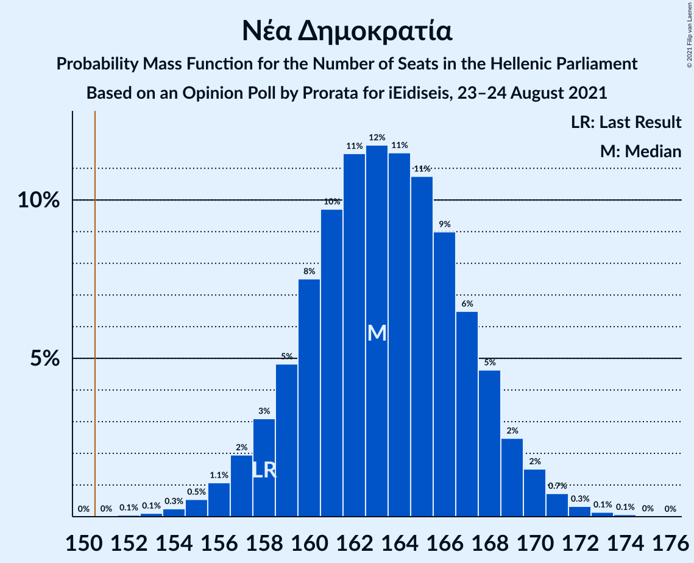
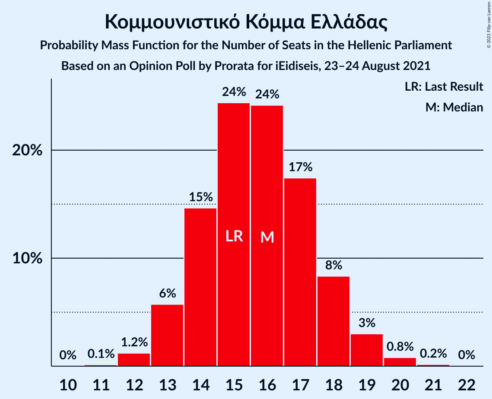
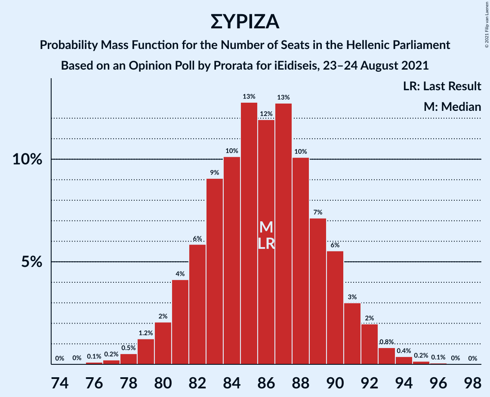

# Opinion Poll by Prorata for iEidiseis, 23–24 August 2021

<a href="#voting-intentions">Voting Intentions</a> | <a href="#seats">Seats</a> | <a href="#coalitions">Coalitions</a> | <a href="#technical-information">Technical Information</a>

## Voting Intentions

### Confidence Intervals

| Party | Last Result | Poll Result | 80% Confidence Interval | 90% Confidence Interval | 95% Confidence Interval | 99% Confidence Interval |
|:-----:|:-----------:|:-----------:|:-----------------------:|:-----------------------:|:-----------------------:|:-----------------------:|
| Νέα Δημοκρατία | 39.8% | 40.0% | 38.5–41.5% |38.1–41.9% |37.8–42.3% |37.1–43.0% |
| Συνασπισμός Ριζοσπαστικής Αριστεράς | 31.5% | 30.3% | 28.9–31.7% |28.5–32.1% |28.2–32.4% |27.5–33.1% |
| Κίνημα Αλλαγής | 8.1% | 7.9% | 7.1–8.8% |6.9–9.0% |6.7–9.2% |6.4–9.7% |
| Κομμουνιστικό Κόμμα Ελλάδας | 5.3% | 5.5% | 4.9–6.3% |4.7–6.5% |4.5–6.7% |4.3–7.0% |
| Ελληνική Λύση | 3.7% | 4.2% | 3.7–4.9% |3.5–5.1% |3.4–5.3% |3.1–5.6% |
| Μέτωπο Ευρωπαϊκής Ρεαλιστικής Ανυπακοής | 3.4% | 2.4% | 2.0–2.9% |1.9–3.1% |1.8–3.2% |1.6–3.5% |

*Note:* The poll result column reflects the actual value used in the calculations. Published results may vary slightly, and in addition be rounded to fewer digits.

## Seats

### Confidence Intervals

| Party | Last Result | Median | 80% Confidence Interval | 90% Confidence Interval | 95% Confidence Interval | 99% Confidence Interval |
|:-----:|:-----------:|:------:|:-----------------------:|:-----------------------:|:-----------------------:|:-----------------------:|
| <a href="#νέα-δημοκρατία">Νέα Δημοκρατία</a> | 158 | 163 | 159–167 |158–169 |157–170 |155–172 |
| <a href="#συνασπισμός-ριζοσπαστικής-αριστεράς">Συνασπισμός Ριζοσπαστικής Αριστεράς</a> | 86 | 86 | 82–90 |81–91 |80–92 |78–94 |
| <a href="#κίνημα-αλλαγής">Κίνημα Αλλαγής</a> | 22 | 22 | 20–25 |20–26 |19–26 |18–27 |
| <a href="#κομμουνιστικό-κόμμα-ελλάδας">Κομμουνιστικό Κόμμα Ελλάδας</a> | 15 | 16 | 14–18 |13–18 |13–19 |12–20 |
| <a href="#ελληνική-λύση">Ελληνική Λύση</a> | 10 | 12 | 10–14 |10–14 |10–15 |9–16 |
| <a href="#μέτωπο-ευρωπαϊκής-ρεαλιστικής-ανυπακοής">Μέτωπο Ευρωπαϊκής Ρεαλιστικής Ανυπακοής</a> | 9 | 0 | 0 |0–8 |0–9 |0–10 |

### Νέα Δημοκρατία

*For a full overview of the results for this party, see the [Νέα Δημοκρατία](party-νέαδημοκρατία.html) page.*

| Number of Seats | Probability | Accumulated | Special Marks |
|:---------------:|:-----------:|:-----------:|:-------------:|
| 152 | 0.1% | 100% |  |
| 153 | 0.1% | 99.9% |  |
| 154 | 0.3% | 99.8% |  |
| 155 | 0.5% | 99.6% |  |
| 156 | 1.1% | 99.0% |  |
| 157 | 2% | 98% |  |
| 158 | 3% | 96% | Last Result |
| 159 | 5% | 93% |  |
| 160 | 8% | 88% |  |
| 161 | 10% | 81% |  |
| 162 | 11% | 71% |  |
| 163 | 12% | 59% | Median |
| 164 | 11% | 48% |  |
| 165 | 11% | 36% |  |
| 166 | 9% | 25% |  |
| 167 | 6% | 16% |  |
| 168 | 5% | 10% |  |
| 169 | 2% | 5% |  |
| 170 | 2% | 3% |  |
| 171 | 0.7% | 1.3% |  |
| 172 | 0.3% | 0.6% |  |
| 173 | 0.1% | 0.2% |  |
| 174 | 0.1% | 0.1% |  |
| 175 | 0% | 0% |  |

### Συνασπισμός Ριζοσπαστικής Αριστεράς

*For a full overview of the results for this party, see the [Συνασπισμός Ριζοσπαστικής Αριστεράς](party-συνασπισμόςριζοσπαστικήςαριστεράς.html) page.*

| Number of Seats | Probability | Accumulated | Special Marks |
|:---------------:|:-----------:|:-----------:|:-------------:|
| 76 | 0.1% | 100% |  |
| 77 | 0.2% | 99.8% |  |
| 78 | 0.5% | 99.6% |  |
| 79 | 1.2% | 99.1% |  |
| 80 | 2% | 98% |  |
| 81 | 4% | 96% |  |
| 82 | 6% | 92% |  |
| 83 | 9% | 86% |  |
| 84 | 10% | 77% |  |
| 85 | 13% | 67% |  |
| 86 | 12% | 54% | Last Result, Median |
| 87 | 13% | 42% |  |
| 88 | 10% | 29% |  |
| 89 | 7% | 19% |  |
| 90 | 6% | 12% |  |
| 91 | 3% | 6% |  |
| 92 | 2% | 3% |  |
| 93 | 0.8% | 1.4% |  |
| 94 | 0.4% | 0.6% |  |
| 95 | 0.2% | 0.2% |  |
| 96 | 0.1% | 0.1% |  |
| 97 | 0% | 0% |  |

### Κίνημα Αλλαγής

*For a full overview of the results for this party, see the [Κίνημα Αλλαγής](party-κίνημααλλαγής.html) page.*

| Number of Seats | Probability | Accumulated | Special Marks |
|:---------------:|:-----------:|:-----------:|:-------------:|
| 17 | 0.2% | 100% |  |
| 18 | 0.9% | 99.8% |  |
| 19 | 3% | 98.9% |  |
| 20 | 9% | 96% |  |
| 21 | 16% | 87% |  |
| 22 | 22% | 70% | Last Result, Median |
| 23 | 20% | 48% |  |
| 24 | 16% | 28% |  |
| 25 | 8% | 13% |  |
| 26 | 4% | 5% |  |
| 27 | 1.2% | 2% |  |
| 28 | 0.3% | 0.4% |  |
| 29 | 0.1% | 0.1% |  |
| 30 | 0% | 0% |  |

### Κομμουνιστικό Κόμμα Ελλάδας

*For a full overview of the results for this party, see the [Κομμουνιστικό Κόμμα Ελλάδας](party-κομμουνιστικόκόμμαελλάδας.html) page.*

| Number of Seats | Probability | Accumulated | Special Marks |
|:---------------:|:-----------:|:-----------:|:-------------:|
| 11 | 0.1% | 100% |  |
| 12 | 1.2% | 99.9% |  |
| 13 | 6% | 98.7% |  |
| 14 | 15% | 93% |  |
| 15 | 24% | 78% | Last Result |
| 16 | 24% | 54% | Median |
| 17 | 17% | 30% |  |
| 18 | 8% | 12% |  |
| 19 | 3% | 4% |  |
| 20 | 0.8% | 1.0% |  |
| 21 | 0.2% | 0.2% |  |
| 22 | 0% | 0% |  |

### Ελληνική Λύση

*For a full overview of the results for this party, see the [Ελληνική Λύση](party-ελληνικήλύση.html) page.*

| Number of Seats | Probability | Accumulated | Special Marks |
|:---------------:|:-----------:|:-----------:|:-------------:|
| 0 | 0.2% | 100% |  |
| 1 | 0% | 99.8% |  |
| 2 | 0% | 99.8% |  |
| 3 | 0% | 99.8% |  |
| 4 | 0% | 99.8% |  |
| 5 | 0% | 99.8% |  |
| 6 | 0% | 99.8% |  |
| 7 | 0% | 99.8% |  |
| 8 | 0% | 99.8% |  |
| 9 | 2% | 99.8% |  |
| 10 | 9% | 98% | Last Result |
| 11 | 22% | 89% |  |
| 12 | 29% | 66% | Median |
| 13 | 23% | 37% |  |
| 14 | 11% | 15% |  |
| 15 | 3% | 4% |  |
| 16 | 0.8% | 1.0% |  |
| 17 | 0.1% | 0.1% |  |
| 18 | 0% | 0% |  |

### Μέτωπο Ευρωπαϊκής Ρεαλιστικής Ανυπακοής

*For a full overview of the results for this party, see the [Μέτωπο Ευρωπαϊκής Ρεαλιστικής Ανυπακοής](party-μέτωποευρωπαϊκήςρεαλιστικήςανυπακοής.html) page.*

| Number of Seats | Probability | Accumulated | Special Marks |
|:---------------:|:-----------:|:-----------:|:-------------:|
| 0 | 93% | 100% | Median |
| 1 | 0% | 7% |  |
| 2 | 0% | 7% |  |
| 3 | 0% | 7% |  |
| 4 | 0% | 7% |  |
| 5 | 0% | 7% |  |
| 6 | 0% | 7% |  |
| 7 | 0% | 7% |  |
| 8 | 2% | 7% |  |
| 9 | 4% | 5% | Last Result |
| 10 | 0.7% | 0.8% |  |
| 11 | 0.1% | 0.1% |  |
| 12 | 0% | 0% |  |

## Coalitions

### Confidence Intervals

| Coalition | Last Result | Median | Majority? | 80% Confidence Interval | 90% Confidence Interval | 95% Confidence Interval | 99% Confidence Interval |
|:---------:|:-----------:|:------:|:---------:|:-----------------------:|:-----------------------:|:-----------------------:|:-----------------------:|
| Νέα Δημοκρατία – Κίνημα Αλλαγής | 180 | 186 | 100% | 181–190 | 180–191 | 179–192 | 177–194 |
| Νέα Δημοκρατία | 158 | 163 | 100% | 159–167 | 158–169 | 157–170 | 155–172 |
| Συνασπισμός Ριζοσπαστικής Αριστεράς – Μέτωπο Ευρωπαϊκής Ρεαλιστικής Ανυπακοής | 95 | 86 | 0% | 82–91 | 81–92 | 80–93 | 79–96 |
| Συνασπισμός Ριζοσπαστικής Αριστεράς | 86 | 86 | 0% | 82–90 | 81–91 | 80–92 | 78–94 |

### Νέα Δημοκρατία – Κίνημα Αλλαγής

| Number of Seats | Probability | Accumulated | Special Marks |
|:---------------:|:-----------:|:-----------:|:-------------:|
| 174 | 0% | 100% |  |
| 175 | 0.1% | 99.9% |  |
| 176 | 0.2% | 99.8% |  |
| 177 | 0.4% | 99.6% |  |
| 178 | 0.9% | 99.2% |  |
| 179 | 2% | 98% |  |
| 180 | 3% | 97% | Last Result |
| 181 | 4% | 94% |  |
| 182 | 5% | 90% |  |
| 183 | 9% | 84% |  |
| 184 | 10% | 76% |  |
| 185 | 12% | 66% | Median |
| 186 | 13% | 54% |  |
| 187 | 10% | 41% |  |
| 188 | 9% | 31% |  |
| 189 | 8% | 22% |  |
| 190 | 6% | 13% |  |
| 191 | 3% | 7% |  |
| 192 | 2% | 4% |  |
| 193 | 1.1% | 2% |  |
| 194 | 0.5% | 0.9% |  |
| 195 | 0.2% | 0.4% |  |
| 196 | 0.1% | 0.2% |  |
| 197 | 0% | 0.1% |  |
| 198 | 0% | 0% |  |

### Νέα Δημοκρατία

| Number of Seats | Probability | Accumulated | Special Marks |
|:---------------:|:-----------:|:-----------:|:-------------:|
| 152 | 0.1% | 100% |  |
| 153 | 0.1% | 99.9% |  |
| 154 | 0.3% | 99.8% |  |
| 155 | 0.5% | 99.6% |  |
| 156 | 1.1% | 99.0% |  |
| 157 | 2% | 98% |  |
| 158 | 3% | 96% | Last Result |
| 159 | 5% | 93% |  |
| 160 | 8% | 88% |  |
| 161 | 10% | 81% |  |
| 162 | 11% | 71% |  |
| 163 | 12% | 59% | Median |
| 164 | 11% | 48% |  |
| 165 | 11% | 36% |  |
| 166 | 9% | 25% |  |
| 167 | 6% | 16% |  |
| 168 | 5% | 10% |  |
| 169 | 2% | 5% |  |
| 170 | 2% | 3% |  |
| 171 | 0.7% | 1.3% |  |
| 172 | 0.3% | 0.6% |  |
| 173 | 0.1% | 0.2% |  |
| 174 | 0.1% | 0.1% |  |
| 175 | 0% | 0% |  |

### Συνασπισμός Ριζοσπαστικής Αριστεράς – Μέτωπο Ευρωπαϊκής Ρεαλιστικής Ανυπακοής

| Number of Seats | Probability | Accumulated | Special Marks |
|:---------------:|:-----------:|:-----------:|:-------------:|
| 76 | 0% | 100% |  |
| 77 | 0.1% | 99.9% |  |
| 78 | 0.3% | 99.8% |  |
| 79 | 0.8% | 99.5% |  |
| 80 | 2% | 98.7% |  |
| 81 | 3% | 97% |  |
| 82 | 5% | 94% |  |
| 83 | 8% | 89% |  |
| 84 | 9% | 81% |  |
| 85 | 12% | 72% |  |
| 86 | 12% | 59% | Median |
| 87 | 13% | 48% |  |
| 88 | 10% | 35% |  |
| 89 | 7% | 25% |  |
| 90 | 6% | 17% |  |
| 91 | 4% | 11% |  |
| 92 | 3% | 7% |  |
| 93 | 1.4% | 4% |  |
| 94 | 1.0% | 2% |  |
| 95 | 0.7% | 1.4% | Last Result |
| 96 | 0.3% | 0.7% |  |
| 97 | 0.2% | 0.4% |  |
| 98 | 0.1% | 0.2% |  |
| 99 | 0% | 0.1% |  |
| 100 | 0% | 0% |  |

### Συνασπισμός Ριζοσπαστικής Αριστεράς

| Number of Seats | Probability | Accumulated | Special Marks |
|:---------------:|:-----------:|:-----------:|:-------------:|
| 76 | 0.1% | 100% |  |
| 77 | 0.2% | 99.8% |  |
| 78 | 0.5% | 99.6% |  |
| 79 | 1.2% | 99.1% |  |
| 80 | 2% | 98% |  |
| 81 | 4% | 96% |  |
| 82 | 6% | 92% |  |
| 83 | 9% | 86% |  |
| 84 | 10% | 77% |  |
| 85 | 13% | 67% |  |
| 86 | 12% | 54% | Last Result, Median |
| 87 | 13% | 42% |  |
| 88 | 10% | 29% |  |
| 89 | 7% | 19% |  |
| 90 | 6% | 12% |  |
| 91 | 3% | 6% |  |
| 92 | 2% | 3% |  |
| 93 | 0.8% | 1.4% |  |
| 94 | 0.4% | 0.6% |  |
| 95 | 0.2% | 0.2% |  |
| 96 | 0.1% | 0.1% |  |
| 97 | 0% | 0% |  |

## Technical Information

### Opinion Poll

+ **Polling firm:** Prorata
+ **Commissioner(s):** iEidiseis
+ **Fieldwork period:** 23–24 August 2021

### Calculations

+ **Sample size:** 1800
+ **Simulations done:** 1,048,576
+ **Error estimate:** 0.27%

