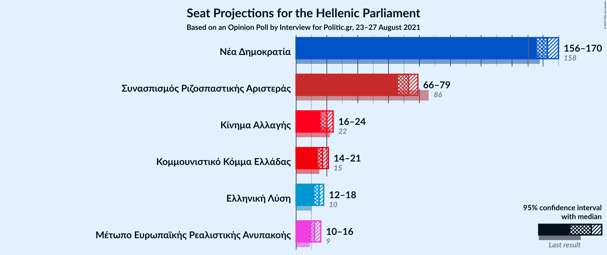
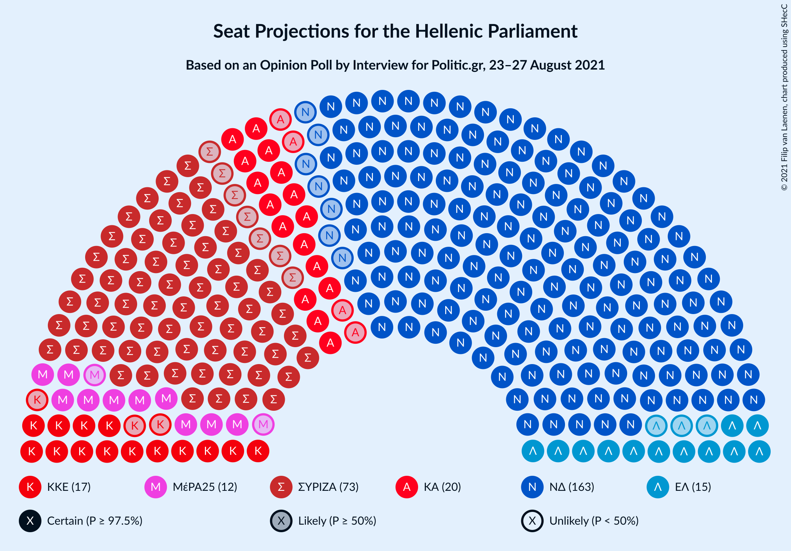
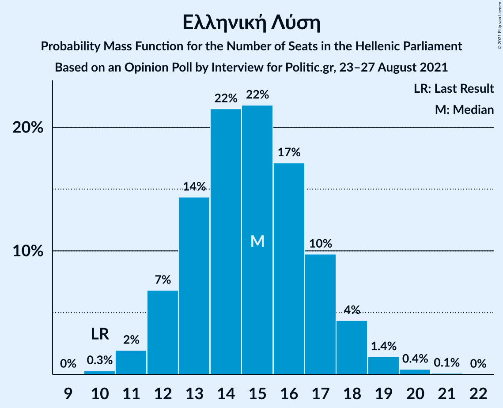
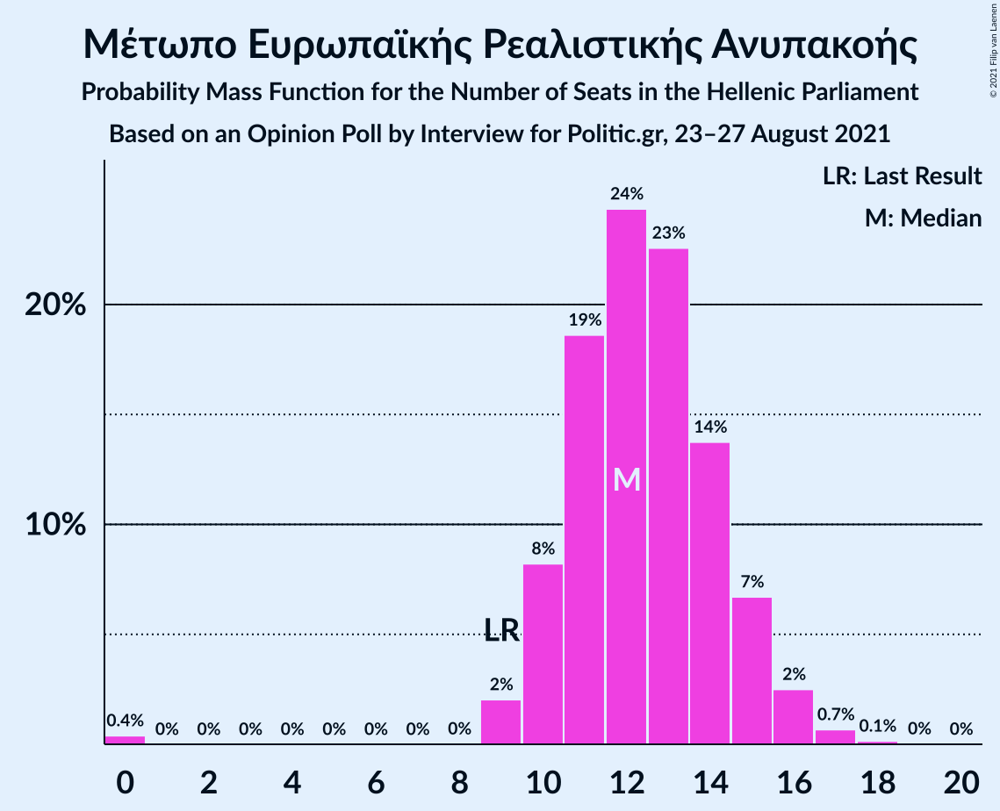
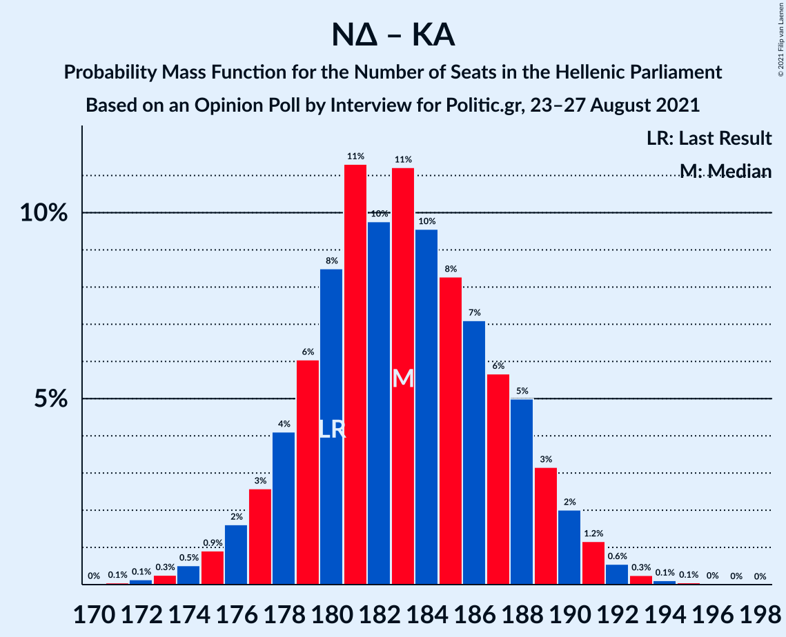
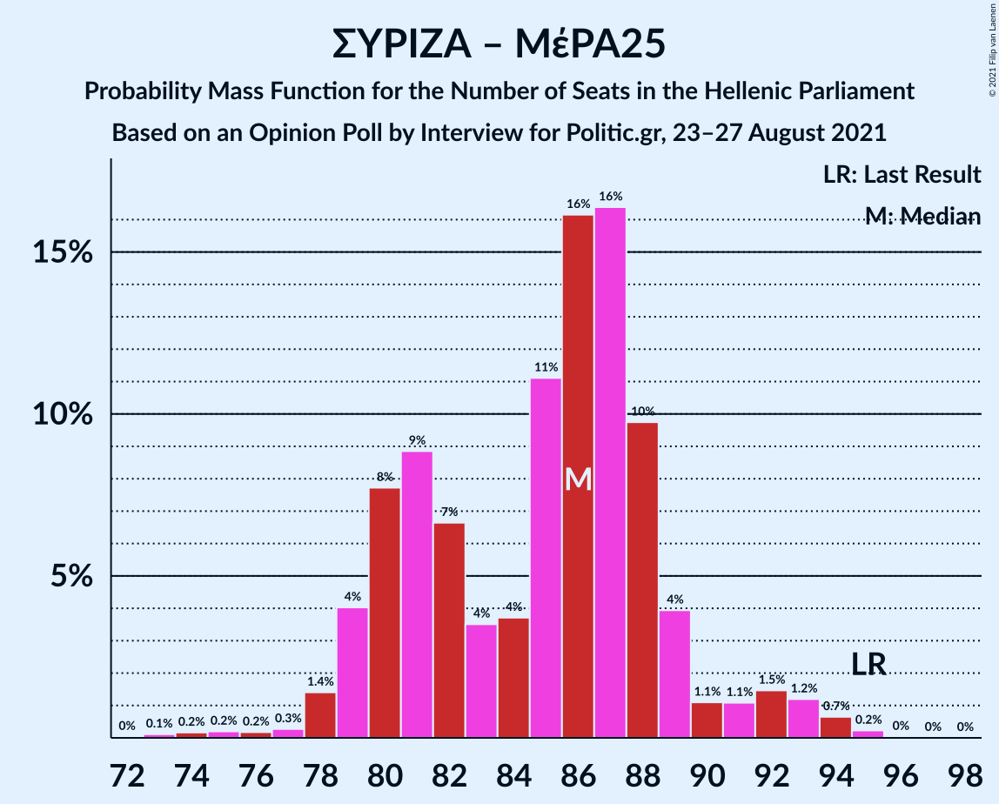

# Opinion Poll by Interview for Politic.gr, 23–27 August 2021

<a href="#voting-intentions">Voting Intentions</a> | <a href="#seats">Seats</a> | <a href="#coalitions">Coalitions</a> | <a href="#technical-information">Technical Information</a>

## Voting Intentions

### Confidence Intervals

| Party | Last Result | Poll Result | 80% Confidence Interval | 90% Confidence Interval | 95% Confidence Interval | 99% Confidence Interval |
|:-----:|:-----------:|:-----------:|:-----------------------:|:-----------------------:|:-----------------------:|:-----------------------:|
| Νέα Δημοκρατία | 39.8% | 39.7% | 38.0–41.4% |37.5–41.9% |37.1–42.4% |36.3–43.2% |
| Συνασπισμός Ριζοσπαστικής Αριστεράς | 31.5% | 25.4% | 23.9–27.0% |23.5–27.5% |23.2–27.9% |22.5–28.6% |
| Κίνημα Αλλαγής | 8.1% | 7.0% | 6.2–8.0% |6.0–8.3% |5.8–8.5% |5.4–9.0% |
| Κομμουνιστικό Κόμμα Ελλάδας | 5.3% | 6.0% | 5.3–7.0% |5.1–7.2% |4.9–7.5% |4.5–7.9% |
| Ελληνική Λύση | 3.7% | 5.1% | 4.4–6.0% |4.2–6.2% |4.1–6.5% |3.7–6.9% |
| Μέτωπο Ευρωπαϊκής Ρεαλιστικής Ανυπακοής | 3.4% | 4.3% | 3.7–5.1% |3.5–5.3% |3.3–5.5% |3.0–5.9% |

*Note:* The poll result column reflects the actual value used in the calculations. Published results may vary slightly, and in addition be rounded to fewer digits.

## Seats

### Confidence Intervals

| Party | Last Result | Median | 80% Confidence Interval | 90% Confidence Interval | 95% Confidence Interval | 99% Confidence Interval |
|:-----:|:-----------:|:------:|:-----------------------:|:-----------------------:|:-----------------------:|:-----------------------:|
| <a href="#νέα-δημοκρατία">Νέα Δημοκρατία</a> | 158 | 163 | 158–168 |157–169 |156–170 |154–172 |
| <a href="#συνασπισμός-ριζοσπαστικής-αριστεράς">Συνασπισμός Ριζοσπαστικής Αριστεράς</a> | 86 | 73 | 68–76 |67–77 |67–78 |64–82 |
| <a href="#κίνημα-αλλαγής">Κίνημα Αλλαγής</a> | 22 | 20 | 18–23 |17–23 |17–24 |15–25 |
| <a href="#κομμουνιστικό-κόμμα-ελλάδας">Κομμουνιστικό Κόμμα Ελλάδας</a> | 15 | 17 | 15–20 |14–20 |14–21 |13–22 |
| <a href="#ελληνική-λύση">Ελληνική Λύση</a> | 10 | 15 | 13–17 |12–18 |12–18 |11–20 |
| <a href="#μέτωπο-ευρωπαϊκής-ρεαλιστικής-ανυπακοής">Μέτωπο Ευρωπαϊκής Ρεαλιστικής Ανυπακοής</a> | 9 | 12 | 11–15 |10–15 |10–16 |9–17 |

### Νέα Δημοκρατία

*For a full overview of the results for this party, see the [Νέα Δημοκρατία](party-νέαδημοκρατία.html) page.*

| Number of Seats | Probability | Accumulated | Special Marks |
|:---------------:|:-----------:|:-----------:|:-------------:|
| 151 | 0% | 100% | Majority |
| 152 | 0.1% | 99.9% |  |
| 153 | 0.3% | 99.8% |  |
| 154 | 0.5% | 99.5% |  |
| 155 | 1.2% | 99.1% |  |
| 156 | 2% | 98% |  |
| 157 | 3% | 96% |  |
| 158 | 5% | 93% | Last Result |
| 159 | 6% | 89% |  |
| 160 | 8% | 82% |  |
| 161 | 11% | 74% |  |
| 162 | 9% | 63% |  |
| 163 | 11% | 54% | Median |
| 164 | 11% | 43% |  |
| 165 | 8% | 32% |  |
| 166 | 7% | 25% |  |
| 167 | 6% | 17% |  |
| 168 | 4% | 11% |  |
| 169 | 3% | 7% |  |
| 170 | 2% | 3% |  |
| 171 | 1.0% | 2% |  |
| 172 | 0.5% | 1.0% |  |
| 173 | 0.2% | 0.4% |  |
| 174 | 0.1% | 0.2% |  |
| 175 | 0% | 0.1% |  |
| 176 | 0% | 0% |  |

### Συνασπισμός Ριζοσπαστικής Αριστεράς

*For a full overview of the results for this party, see the [Συνασπισμός Ριζοσπαστικής Αριστεράς](party-συνασπισμόςριζοσπαστικήςαριστεράς.html) page.*

| Number of Seats | Probability | Accumulated | Special Marks |
|:---------------:|:-----------:|:-----------:|:-------------:|
| 62 | 0.1% | 100% |  |
| 63 | 0.2% | 99.8% |  |
| 64 | 0.4% | 99.6% |  |
| 65 | 0.4% | 99.2% |  |
| 66 | 1.0% | 98.8% |  |
| 67 | 3% | 98% |  |
| 68 | 9% | 95% |  |
| 69 | 11% | 86% |  |
| 70 | 11% | 75% |  |
| 71 | 8% | 64% |  |
| 72 | 4% | 57% |  |
| 73 | 7% | 53% | Median |
| 74 | 12% | 46% |  |
| 75 | 15% | 34% |  |
| 76 | 11% | 19% |  |
| 77 | 4% | 8% |  |
| 78 | 2% | 4% |  |
| 79 | 0.6% | 2% |  |
| 80 | 0.6% | 2% |  |
| 81 | 0.7% | 1.2% |  |
| 82 | 0.4% | 0.6% |  |
| 83 | 0.1% | 0.2% |  |
| 84 | 0% | 0% |  |
| 85 | 0% | 0% |  |
| 86 | 0% | 0% | Last Result |

### Κίνημα Αλλαγής

*For a full overview of the results for this party, see the [Κίνημα Αλλαγής](party-κίνημααλλαγής.html) page.*

| Number of Seats | Probability | Accumulated | Special Marks |
|:---------------:|:-----------:|:-----------:|:-------------:|
| 14 | 0.1% | 100% |  |
| 15 | 0.6% | 99.9% |  |
| 16 | 2% | 99.3% |  |
| 17 | 7% | 98% |  |
| 18 | 11% | 91% |  |
| 19 | 20% | 80% |  |
| 20 | 18% | 60% | Median |
| 21 | 19% | 41% |  |
| 22 | 9% | 22% | Last Result |
| 23 | 8% | 13% |  |
| 24 | 3% | 4% |  |
| 25 | 1.0% | 1.4% |  |
| 26 | 0.4% | 0.5% |  |
| 27 | 0.1% | 0.1% |  |
| 28 | 0% | 0% |  |

### Κομμουνιστικό Κόμμα Ελλάδας

*For a full overview of the results for this party, see the [Κομμουνιστικό Κόμμα Ελλάδας](party-κομμουνιστικόκόμμαελλάδας.html) page.*

| Number of Seats | Probability | Accumulated | Special Marks |
|:---------------:|:-----------:|:-----------:|:-------------:|
| 12 | 0.2% | 100% |  |
| 13 | 0.9% | 99.8% |  |
| 14 | 4% | 98.9% |  |
| 15 | 10% | 95% | Last Result |
| 16 | 18% | 85% |  |
| 17 | 21% | 67% | Median |
| 18 | 20% | 46% |  |
| 19 | 14% | 26% |  |
| 20 | 8% | 13% |  |
| 21 | 3% | 5% |  |
| 22 | 1.2% | 2% |  |
| 23 | 0.3% | 0.4% |  |
| 24 | 0.1% | 0.1% |  |
| 25 | 0% | 0% |  |

### Ελληνική Λύση

*For a full overview of the results for this party, see the [Ελληνική Λύση](party-ελληνικήλύση.html) page.*

| Number of Seats | Probability | Accumulated | Special Marks |
|:---------------:|:-----------:|:-----------:|:-------------:|
| 10 | 0.4% | 100% | Last Result |
| 11 | 2% | 99.6% |  |
| 12 | 7% | 98% |  |
| 13 | 15% | 91% |  |
| 14 | 21% | 76% |  |
| 15 | 19% | 55% | Median |
| 16 | 19% | 36% |  |
| 17 | 11% | 17% |  |
| 18 | 4% | 6% |  |
| 19 | 2% | 2% |  |
| 20 | 0.4% | 0.5% |  |
| 21 | 0.1% | 0.1% |  |
| 22 | 0% | 0% |  |

### Μέτωπο Ευρωπαϊκής Ρεαλιστικής Ανυπακοής

*For a full overview of the results for this party, see the [Μέτωπο Ευρωπαϊκής Ρεαλιστικής Ανυπακοής](party-μέτωποευρωπαϊκήςρεαλιστικήςανυπακοής.html) page.*

| Number of Seats | Probability | Accumulated | Special Marks |
|:---------------:|:-----------:|:-----------:|:-------------:|
| 0 | 0.4% | 100% |  |
| 1 | 0% | 99.6% |  |
| 2 | 0% | 99.6% |  |
| 3 | 0% | 99.6% |  |
| 4 | 0% | 99.6% |  |
| 5 | 0% | 99.6% |  |
| 6 | 0% | 99.6% |  |
| 7 | 0% | 99.6% |  |
| 8 | 0% | 99.6% |  |
| 9 | 2% | 99.6% | Last Result |
| 10 | 7% | 98% |  |
| 11 | 19% | 90% |  |
| 12 | 25% | 71% | Median |
| 13 | 23% | 46% |  |
| 14 | 13% | 24% |  |
| 15 | 7% | 10% |  |
| 16 | 3% | 3% |  |
| 17 | 0.6% | 0.8% |  |
| 18 | 0.1% | 0.2% |  |
| 19 | 0% | 0% |  |

## Coalitions

### Confidence Intervals

| Coalition | Last Result | Median | Majority? | 80% Confidence Interval | 90% Confidence Interval | 95% Confidence Interval | 99% Confidence Interval |
|:---------:|:-----------:|:------:|:---------:|:-----------------------:|:-----------------------:|:-----------------------:|:-----------------------:|
| Νέα Δημοκρατία – Κίνημα Αλλαγής | 180 | 183 | 100% | 178–188 | 177–189 | 176–190 | 173–192 |
| Νέα Δημοκρατία | 158 | 163 | 100% | 158–168 | 157–169 | 156–170 | 154–172 |
| Συνασπισμός Ριζοσπαστικής Αριστεράς – Μέτωπο Ευρωπαϊκής Ρεαλιστικής Ανυπακοής | 95 | 86 | 0% | 80–89 | 80–89 | 79–91 | 75–95 |
| Συνασπισμός Ριζοσπαστικής Αριστεράς | 86 | 73 | 0% | 68–76 | 67–77 | 67–78 | 64–82 |

### Νέα Δημοκρατία – Κίνημα Αλλαγής

| Number of Seats | Probability | Accumulated | Special Marks |
|:---------------:|:-----------:|:-----------:|:-------------:|
| 171 | 0% | 100% |  |
| 172 | 0.2% | 99.9% |  |
| 173 | 0.3% | 99.8% |  |
| 174 | 0.3% | 99.5% |  |
| 175 | 1.2% | 99.2% |  |
| 176 | 1.3% | 98% |  |
| 177 | 3% | 97% |  |
| 178 | 7% | 94% |  |
| 179 | 3% | 87% |  |
| 180 | 10% | 84% | Last Result |
| 181 | 13% | 74% |  |
| 182 | 5% | 61% |  |
| 183 | 13% | 56% | Median |
| 184 | 8% | 43% |  |
| 185 | 6% | 35% |  |
| 186 | 13% | 29% |  |
| 187 | 3% | 16% |  |
| 188 | 5% | 12% |  |
| 189 | 5% | 7% |  |
| 190 | 0.6% | 3% |  |
| 191 | 1.1% | 2% |  |
| 192 | 0.5% | 0.9% |  |
| 193 | 0.2% | 0.4% |  |
| 194 | 0.1% | 0.2% |  |
| 195 | 0% | 0.1% |  |
| 196 | 0% | 0% |  |

### Νέα Δημοκρατία

| Number of Seats | Probability | Accumulated | Special Marks |
|:---------------:|:-----------:|:-----------:|:-------------:|
| 151 | 0% | 100% | Majority |
| 152 | 0.1% | 99.9% |  |
| 153 | 0.3% | 99.8% |  |
| 154 | 0.5% | 99.5% |  |
| 155 | 1.2% | 99.1% |  |
| 156 | 2% | 98% |  |
| 157 | 3% | 96% |  |
| 158 | 5% | 93% | Last Result |
| 159 | 6% | 89% |  |
| 160 | 8% | 82% |  |
| 161 | 11% | 74% |  |
| 162 | 9% | 63% |  |
| 163 | 11% | 54% | Median |
| 164 | 11% | 43% |  |
| 165 | 8% | 32% |  |
| 166 | 7% | 25% |  |
| 167 | 6% | 17% |  |
| 168 | 4% | 11% |  |
| 169 | 3% | 7% |  |
| 170 | 2% | 3% |  |
| 171 | 1.0% | 2% |  |
| 172 | 0.5% | 1.0% |  |
| 173 | 0.2% | 0.4% |  |
| 174 | 0.1% | 0.2% |  |
| 175 | 0% | 0.1% |  |
| 176 | 0% | 0% |  |

### Συνασπισμός Ριζοσπαστικής Αριστεράς – Μέτωπο Ευρωπαϊκής Ρεαλιστικής Ανυπακοής

| Number of Seats | Probability | Accumulated | Special Marks |
|:---------------:|:-----------:|:-----------:|:-------------:|
| 73 | 0.1% | 100% |  |
| 74 | 0.2% | 99.8% |  |
| 75 | 0.4% | 99.6% |  |
| 76 | 0.3% | 99.2% |  |
| 77 | 0.2% | 98.9% |  |
| 78 | 0.3% | 98.7% |  |
| 79 | 2% | 98% |  |
| 80 | 7% | 97% |  |
| 81 | 10% | 89% |  |
| 82 | 17% | 79% |  |
| 83 | 4% | 62% |  |
| 84 | 3% | 58% |  |
| 85 | 2% | 55% | Median |
| 86 | 12% | 53% |  |
| 87 | 12% | 41% |  |
| 88 | 16% | 29% |  |
| 89 | 9% | 13% |  |
| 90 | 2% | 5% |  |
| 91 | 0.6% | 3% |  |
| 92 | 0.3% | 2% |  |
| 93 | 0.9% | 2% |  |
| 94 | 0.5% | 1.1% |  |
| 95 | 0.5% | 0.6% | Last Result |
| 96 | 0.1% | 0.1% |  |
| 97 | 0% | 0% |  |

### Συνασπισμός Ριζοσπαστικής Αριστεράς

| Number of Seats | Probability | Accumulated | Special Marks |
|:---------------:|:-----------:|:-----------:|:-------------:|
| 62 | 0.1% | 100% |  |
| 63 | 0.2% | 99.8% |  |
| 64 | 0.4% | 99.6% |  |
| 65 | 0.4% | 99.2% |  |
| 66 | 1.0% | 98.8% |  |
| 67 | 3% | 98% |  |
| 68 | 9% | 95% |  |
| 69 | 11% | 86% |  |
| 70 | 11% | 75% |  |
| 71 | 8% | 64% |  |
| 72 | 4% | 57% |  |
| 73 | 7% | 53% | Median |
| 74 | 12% | 46% |  |
| 75 | 15% | 34% |  |
| 76 | 11% | 19% |  |
| 77 | 4% | 8% |  |
| 78 | 2% | 4% |  |
| 79 | 0.6% | 2% |  |
| 80 | 0.6% | 2% |  |
| 81 | 0.7% | 1.2% |  |
| 82 | 0.4% | 0.6% |  |
| 83 | 0.1% | 0.2% |  |
| 84 | 0% | 0% |  |
| 85 | 0% | 0% |  |
| 86 | 0% | 0% | Last Result |

## Technical Information

### Opinion Poll

+ **Polling firm:** Interview
+ **Commissioner(s):** Politic.gr
+ **Fieldwork period:** 23–27 August 2021

### Calculations

+ **Sample size:** 1325
+ **Simulations done:** 131,072
+ **Error estimate:** 1.43%

