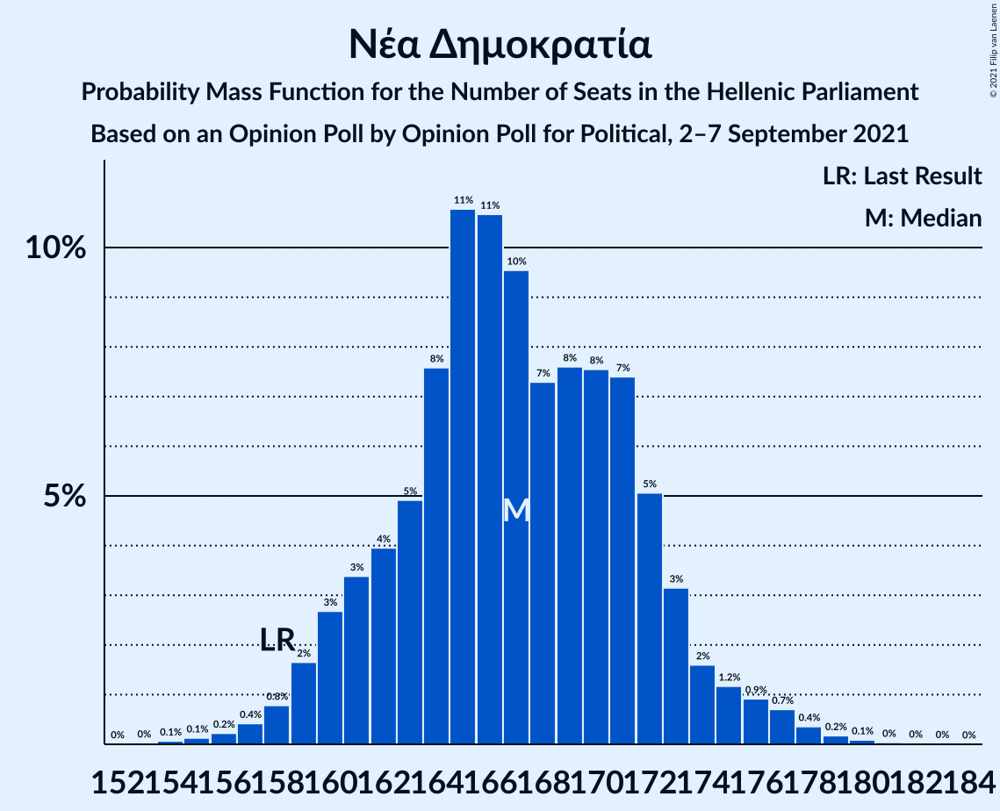
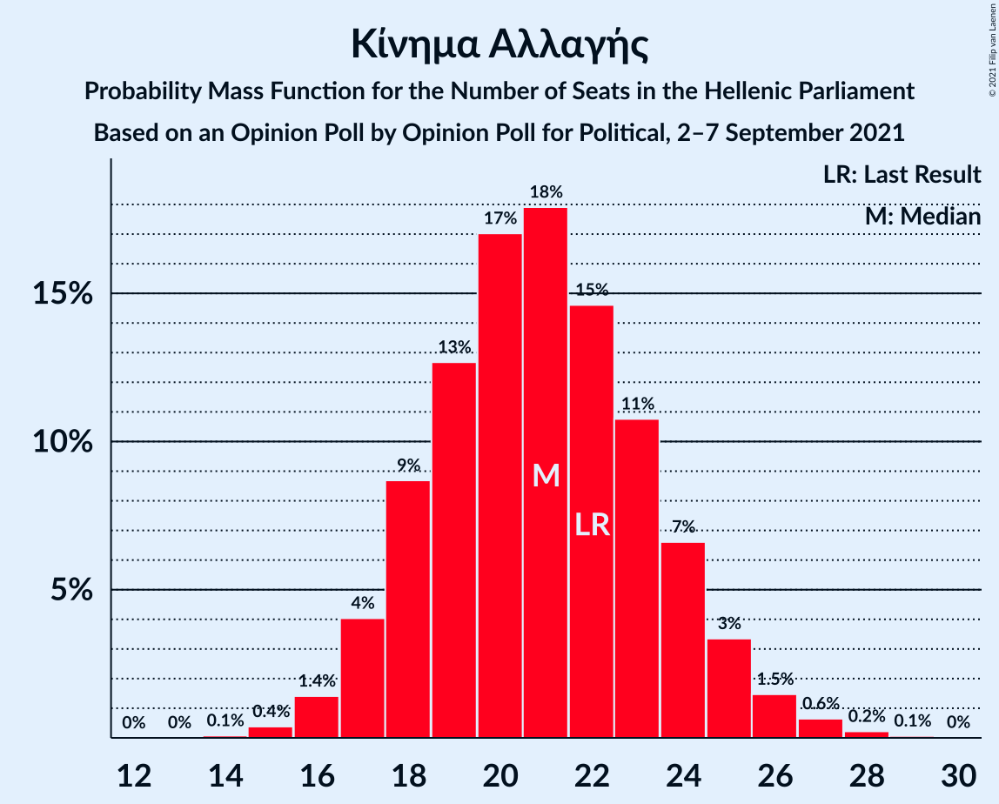
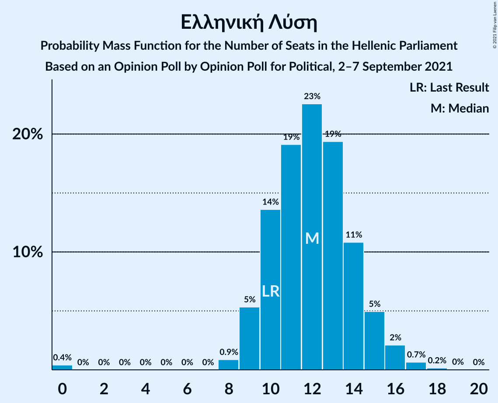

# Opinion Poll by Opinion Poll for Political, 2–7 September 2021

<a href="#voting-intentions">Voting Intentions</a> | <a href="#seats">Seats</a> | <a href="#coalitions">Coalitions</a> | <a href="#technical-information">Technical Information</a>

## Voting Intentions

### Confidence Intervals

| Party | Last Result | Poll Result | 80% Confidence Interval | 90% Confidence Interval | 95% Confidence Interval | 99% Confidence Interval |
|:-----:|:-----------:|:-----------:|:-----------------------:|:-----------------------:|:-----------------------:|:-----------------------:|
| Νέα Δημοκρατία | 39.8% | 44.6% | 42.6–46.6% |42.0–47.2% |41.5–47.7% |40.6–48.7% |
| Συνασπισμός Ριζοσπαστικής Αριστεράς | 31.5% | 26.9% | 25.2–28.8% |24.7–29.3% |24.3–29.8% |23.5–30.7% |
| Κίνημα Αλλαγής | 8.1% | 7.9% | 6.9–9.1% |6.6–9.4% |6.4–9.7% |5.9–10.3% |
| Κομμουνιστικό Κόμμα Ελλάδας | 5.3% | 7.0% | 6.1–8.1% |5.8–8.5% |5.6–8.7% |5.1–9.3% |
| Ελληνική Λύση | 3.7% | 4.5% | 3.7–5.5% |3.5–5.7% |3.4–6.0% |3.0–6.5% |
| Μέτωπο Ευρωπαϊκής Ρεαλιστικής Ανυπακοής | 3.4% | 4.1% | 3.4–5.0% |3.2–5.3% |3.0–5.5% |2.7–6.0% |

*Note:* The poll result column reflects the actual value used in the calculations. Published results may vary slightly, and in addition be rounded to fewer digits.

## Seats

### Confidence Intervals

| Party | Last Result | Median | 80% Confidence Interval | 90% Confidence Interval | 95% Confidence Interval | 99% Confidence Interval |
|:-----:|:-----------:|:------:|:-----------------------:|:-----------------------:|:-----------------------:|:-----------------------:|
| <a href="#νέα-δημοκρατία">Νέα Δημοκρατία</a> | 158 | 167 | 162–172 |160–174 |159–175 |157–178 |
| <a href="#συνασπισμός-ριζοσπαστικής-αριστεράς">Συνασπισμός Ριζοσπαστικής Αριστεράς</a> | 86 | 71 | 66–75 |65–77 |64–78 |62–81 |
| <a href="#κίνημα-αλλαγής">Κίνημα Αλλαγής</a> | 22 | 21 | 18–24 |17–25 |17–25 |16–27 |
| <a href="#κομμουνιστικό-κόμμα-ελλάδας">Κομμουνιστικό Κόμμα Ελλάδας</a> | 15 | 18 | 16–21 |15–22 |15–23 |13–24 |
| <a href="#ελληνική-λύση">Ελληνική Λύση</a> | 10 | 12 | 10–14 |9–15 |9–16 |8–17 |
| <a href="#μέτωπο-ευρωπαϊκής-ρεαλιστικής-ανυπακοής">Μέτωπο Ευρωπαϊκής Ρεαλιστικής Ανυπακοής</a> | 9 | 11 | 9–13 |8–14 |8–14 |0–16 |

### Νέα Δημοκρατία

*For a full overview of the results for this party, see the [Νέα Δημοκρατία](party-νέαδημοκρατία.html) page.*

| Number of Seats | Probability | Accumulated | Special Marks |
|:---------------:|:-----------:|:-----------:|:-------------:|
| 154 | 0.1% | 100% |  |
| 155 | 0.1% | 99.9% |  |
| 156 | 0.2% | 99.8% |  |
| 157 | 0.4% | 99.5% |  |
| 158 | 0.8% | 99.1% | Last Result |
| 159 | 2% | 98% |  |
| 160 | 3% | 97% |  |
| 161 | 3% | 94% |  |
| 162 | 4% | 91% |  |
| 163 | 5% | 87% |  |
| 164 | 8% | 82% |  |
| 165 | 11% | 74% |  |
| 166 | 11% | 63% |  |
| 167 | 10% | 53% | Median |
| 168 | 7% | 43% |  |
| 169 | 8% | 36% |  |
| 170 | 8% | 28% |  |
| 171 | 7% | 21% |  |
| 172 | 5% | 13% |  |
| 173 | 3% | 8% |  |
| 174 | 2% | 5% |  |
| 175 | 1.2% | 4% |  |
| 176 | 0.9% | 2% |  |
| 177 | 0.7% | 1.4% |  |
| 178 | 0.4% | 0.7% |  |
| 179 | 0.2% | 0.4% |  |
| 180 | 0.1% | 0.2% |  |
| 181 | 0% | 0.1% |  |
| 182 | 0% | 0.1% |  |
| 183 | 0% | 0% |  |

### Συνασπισμός Ριζοσπαστικής Αριστεράς

*For a full overview of the results for this party, see the [Συνασπισμός Ριζοσπαστικής Αριστεράς](party-συνασπισμόςριζοσπαστικήςαριστεράς.html) page.*

| Number of Seats | Probability | Accumulated | Special Marks |
|:---------------:|:-----------:|:-----------:|:-------------:|
| 59 | 0% | 100% |  |
| 60 | 0.1% | 99.9% |  |
| 61 | 0.3% | 99.8% |  |
| 62 | 0.6% | 99.5% |  |
| 63 | 0.9% | 98.9% |  |
| 64 | 2% | 98% |  |
| 65 | 4% | 96% |  |
| 66 | 5% | 92% |  |
| 67 | 6% | 87% |  |
| 68 | 8% | 82% |  |
| 69 | 11% | 74% |  |
| 70 | 12% | 63% |  |
| 71 | 11% | 52% | Median |
| 72 | 9% | 41% |  |
| 73 | 9% | 32% |  |
| 74 | 8% | 23% |  |
| 75 | 6% | 15% |  |
| 76 | 3% | 10% |  |
| 77 | 2% | 6% |  |
| 78 | 2% | 4% |  |
| 79 | 1.1% | 2% |  |
| 80 | 0.5% | 1.0% |  |
| 81 | 0.3% | 0.5% |  |
| 82 | 0.1% | 0.2% |  |
| 83 | 0.1% | 0.1% |  |
| 84 | 0% | 0% |  |
| 85 | 0% | 0% |  |
| 86 | 0% | 0% | Last Result |

### Κίνημα Αλλαγής

*For a full overview of the results for this party, see the [Κίνημα Αλλαγής](party-κίνημααλλαγής.html) page.*

| Number of Seats | Probability | Accumulated | Special Marks |
|:---------------:|:-----------:|:-----------:|:-------------:|
| 14 | 0.1% | 100% |  |
| 15 | 0.4% | 99.9% |  |
| 16 | 1.4% | 99.5% |  |
| 17 | 4% | 98% |  |
| 18 | 9% | 94% |  |
| 19 | 13% | 85% |  |
| 20 | 17% | 73% |  |
| 21 | 18% | 56% | Median |
| 22 | 15% | 38% | Last Result |
| 23 | 11% | 23% |  |
| 24 | 7% | 12% |  |
| 25 | 3% | 6% |  |
| 26 | 1.5% | 2% |  |
| 27 | 0.6% | 1.0% |  |
| 28 | 0.2% | 0.3% |  |
| 29 | 0.1% | 0.1% |  |
| 30 | 0% | 0% |  |

### Κομμουνιστικό Κόμμα Ελλάδας

*For a full overview of the results for this party, see the [Κομμουνιστικό Κόμμα Ελλάδας](party-κομμουνιστικόκόμμαελλάδας.html) page.*

| Number of Seats | Probability | Accumulated | Special Marks |
|:---------------:|:-----------:|:-----------:|:-------------:|
| 12 | 0.1% | 100% |  |
| 13 | 0.4% | 99.9% |  |
| 14 | 2% | 99.5% |  |
| 15 | 5% | 98% | Last Result |
| 16 | 10% | 93% |  |
| 17 | 16% | 83% |  |
| 18 | 19% | 68% | Median |
| 19 | 18% | 49% |  |
| 20 | 14% | 31% |  |
| 21 | 9% | 18% |  |
| 22 | 5% | 9% |  |
| 23 | 2% | 4% |  |
| 24 | 0.9% | 1.3% |  |
| 25 | 0.3% | 0.5% |  |
| 26 | 0.1% | 0.1% |  |
| 27 | 0% | 0% |  |

### Ελληνική Λύση

*For a full overview of the results for this party, see the [Ελληνική Λύση](party-ελληνικήλύση.html) page.*

| Number of Seats | Probability | Accumulated | Special Marks |
|:---------------:|:-----------:|:-----------:|:-------------:|
| 0 | 0.4% | 100% |  |
| 1 | 0% | 99.6% |  |
| 2 | 0% | 99.6% |  |
| 3 | 0% | 99.6% |  |
| 4 | 0% | 99.6% |  |
| 5 | 0% | 99.6% |  |
| 6 | 0% | 99.6% |  |
| 7 | 0% | 99.6% |  |
| 8 | 0.9% | 99.6% |  |
| 9 | 5% | 98.7% |  |
| 10 | 14% | 93% | Last Result |
| 11 | 19% | 80% |  |
| 12 | 23% | 61% | Median |
| 13 | 19% | 38% |  |
| 14 | 11% | 19% |  |
| 15 | 5% | 8% |  |
| 16 | 2% | 3% |  |
| 17 | 0.7% | 0.9% |  |
| 18 | 0.2% | 0.2% |  |
| 19 | 0% | 0% |  |

### Μέτωπο Ευρωπαϊκής Ρεαλιστικής Ανυπακοής

*For a full overview of the results for this party, see the [Μέτωπο Ευρωπαϊκής Ρεαλιστικής Ανυπακοής](party-μέτωποευρωπαϊκήςρεαλιστικήςανυπακοής.html) page.*

| Number of Seats | Probability | Accumulated | Special Marks |
|:---------------:|:-----------:|:-----------:|:-------------:|
| 0 | 2% | 100% |  |
| 1 | 0% | 98% |  |
| 2 | 0% | 98% |  |
| 3 | 0% | 98% |  |
| 4 | 0% | 98% |  |
| 5 | 0% | 98% |  |
| 6 | 0% | 98% |  |
| 7 | 0% | 98% |  |
| 8 | 4% | 98% |  |
| 9 | 13% | 94% | Last Result |
| 10 | 21% | 81% |  |
| 11 | 24% | 60% | Median |
| 12 | 18% | 36% |  |
| 13 | 10% | 18% |  |
| 14 | 5% | 7% |  |
| 15 | 2% | 2% |  |
| 16 | 0.5% | 0.6% |  |
| 17 | 0.1% | 0.1% |  |
| 18 | 0% | 0% |  |

## Coalitions

### Confidence Intervals

| Coalition | Last Result | Median | Majority? | 80% Confidence Interval | 90% Confidence Interval | 95% Confidence Interval | 99% Confidence Interval |
|:---------:|:-----------:|:------:|:---------:|:-----------------------:|:-----------------------:|:-----------------------:|:-----------------------:|
| Νέα Δημοκρατία – Κίνημα Αλλαγής | 180 | 188 | 100% | 183–193 | 181–195 | 180–196 | 177–199 |
| Νέα Δημοκρατία | 158 | 167 | 100% | 162–172 | 160–174 | 159–175 | 157–178 |
| Συνασπισμός Ριζοσπαστικής Αριστεράς – Μέτωπο Ευρωπαϊκής Ρεαλιστικής Ανυπακοής | 95 | 82 | 0% | 77–87 | 75–88 | 74–89 | 71–92 |
| Συνασπισμός Ριζοσπαστικής Αριστεράς | 86 | 71 | 0% | 66–75 | 65–77 | 64–78 | 62–81 |

### Νέα Δημοκρατία – Κίνημα Αλλαγής

| Number of Seats | Probability | Accumulated | Special Marks |
|:---------------:|:-----------:|:-----------:|:-------------:|
| 174 | 0% | 100% |  |
| 175 | 0.1% | 99.9% |  |
| 176 | 0.1% | 99.9% |  |
| 177 | 0.3% | 99.7% |  |
| 178 | 0.5% | 99.5% |  |
| 179 | 0.9% | 98.9% |  |
| 180 | 2% | 98% | Last Result |
| 181 | 2% | 96% |  |
| 182 | 3% | 94% |  |
| 183 | 5% | 91% |  |
| 184 | 7% | 86% |  |
| 185 | 8% | 79% |  |
| 186 | 9% | 72% |  |
| 187 | 10% | 63% |  |
| 188 | 10% | 53% | Median |
| 189 | 9% | 43% |  |
| 190 | 8% | 34% |  |
| 191 | 7% | 26% |  |
| 192 | 5% | 19% |  |
| 193 | 4% | 13% |  |
| 194 | 4% | 9% |  |
| 195 | 2% | 6% |  |
| 196 | 1.4% | 4% |  |
| 197 | 0.9% | 2% |  |
| 198 | 0.5% | 1.2% |  |
| 199 | 0.3% | 0.7% |  |
| 200 | 0.2% | 0.4% |  |
| 201 | 0.1% | 0.2% |  |
| 202 | 0% | 0.1% |  |
| 203 | 0% | 0.1% |  |
| 204 | 0% | 0% |  |

### Νέα Δημοκρατία

| Number of Seats | Probability | Accumulated | Special Marks |
|:---------------:|:-----------:|:-----------:|:-------------:|
| 154 | 0.1% | 100% |  |
| 155 | 0.1% | 99.9% |  |
| 156 | 0.2% | 99.8% |  |
| 157 | 0.4% | 99.5% |  |
| 158 | 0.8% | 99.1% | Last Result |
| 159 | 2% | 98% |  |
| 160 | 3% | 97% |  |
| 161 | 3% | 94% |  |
| 162 | 4% | 91% |  |
| 163 | 5% | 87% |  |
| 164 | 8% | 82% |  |
| 165 | 11% | 74% |  |
| 166 | 11% | 63% |  |
| 167 | 10% | 53% | Median |
| 168 | 7% | 43% |  |
| 169 | 8% | 36% |  |
| 170 | 8% | 28% |  |
| 171 | 7% | 21% |  |
| 172 | 5% | 13% |  |
| 173 | 3% | 8% |  |
| 174 | 2% | 5% |  |
| 175 | 1.2% | 4% |  |
| 176 | 0.9% | 2% |  |
| 177 | 0.7% | 1.4% |  |
| 178 | 0.4% | 0.7% |  |
| 179 | 0.2% | 0.4% |  |
| 180 | 0.1% | 0.2% |  |
| 181 | 0% | 0.1% |  |
| 182 | 0% | 0.1% |  |
| 183 | 0% | 0% |  |

### Συνασπισμός Ριζοσπαστικής Αριστεράς – Μέτωπο Ευρωπαϊκής Ρεαλιστικής Ανυπακοής

| Number of Seats | Probability | Accumulated | Special Marks |
|:---------------:|:-----------:|:-----------:|:-------------:|
| 67 | 0% | 100% |  |
| 68 | 0.1% | 99.9% |  |
| 69 | 0.1% | 99.8% |  |
| 70 | 0.2% | 99.7% |  |
| 71 | 0.3% | 99.5% |  |
| 72 | 0.6% | 99.2% |  |
| 73 | 1.0% | 98.6% |  |
| 74 | 1.4% | 98% |  |
| 75 | 2% | 96% |  |
| 76 | 3% | 94% |  |
| 77 | 5% | 91% |  |
| 78 | 6% | 85% |  |
| 79 | 8% | 79% |  |
| 80 | 10% | 71% |  |
| 81 | 10% | 61% |  |
| 82 | 9% | 51% | Median |
| 83 | 10% | 42% |  |
| 84 | 8% | 31% |  |
| 85 | 7% | 23% |  |
| 86 | 6% | 16% |  |
| 87 | 4% | 10% |  |
| 88 | 3% | 6% |  |
| 89 | 2% | 4% |  |
| 90 | 1.0% | 2% |  |
| 91 | 0.5% | 1.1% |  |
| 92 | 0.3% | 0.6% |  |
| 93 | 0.1% | 0.3% |  |
| 94 | 0.1% | 0.1% |  |
| 95 | 0% | 0.1% | Last Result |
| 96 | 0% | 0% |  |

### Συνασπισμός Ριζοσπαστικής Αριστεράς

| Number of Seats | Probability | Accumulated | Special Marks |
|:---------------:|:-----------:|:-----------:|:-------------:|
| 59 | 0% | 100% |  |
| 60 | 0.1% | 99.9% |  |
| 61 | 0.3% | 99.8% |  |
| 62 | 0.6% | 99.5% |  |
| 63 | 0.9% | 98.9% |  |
| 64 | 2% | 98% |  |
| 65 | 4% | 96% |  |
| 66 | 5% | 92% |  |
| 67 | 6% | 87% |  |
| 68 | 8% | 82% |  |
| 69 | 11% | 74% |  |
| 70 | 12% | 63% |  |
| 71 | 11% | 52% | Median |
| 72 | 9% | 41% |  |
| 73 | 9% | 32% |  |
| 74 | 8% | 23% |  |
| 75 | 6% | 15% |  |
| 76 | 3% | 10% |  |
| 77 | 2% | 6% |  |
| 78 | 2% | 4% |  |
| 79 | 1.1% | 2% |  |
| 80 | 0.5% | 1.0% |  |
| 81 | 0.3% | 0.5% |  |
| 82 | 0.1% | 0.2% |  |
| 83 | 0.1% | 0.1% |  |
| 84 | 0% | 0% |  |
| 85 | 0% | 0% |  |
| 86 | 0% | 0% | Last Result |

## Technical Information

### Opinion Poll

+ **Polling firm:** Opinion Poll
+ **Commissioner(s):** Political
+ **Fieldwork period:** 2–7 September 2021

### Calculations

+ **Sample size:** 1002
+ **Simulations done:** 1,048,576
+ **Error estimate:** 0.66%

