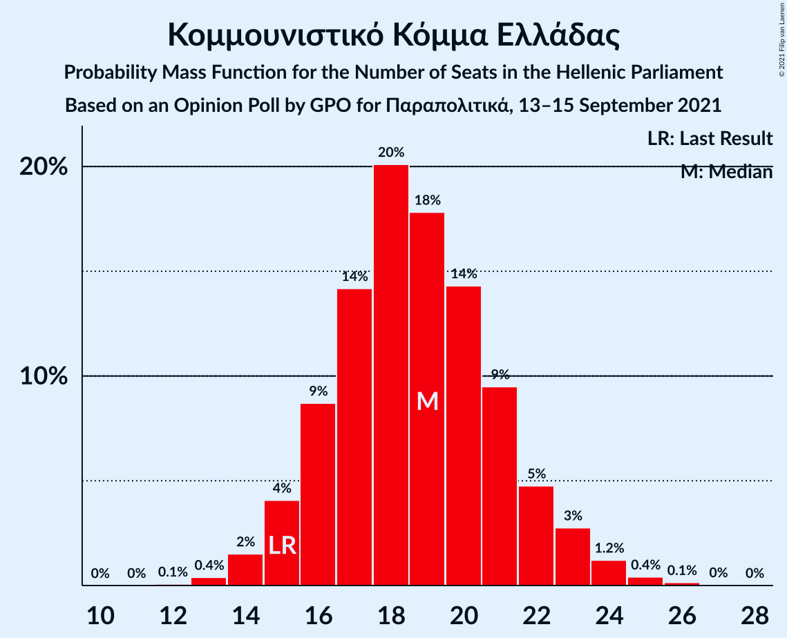
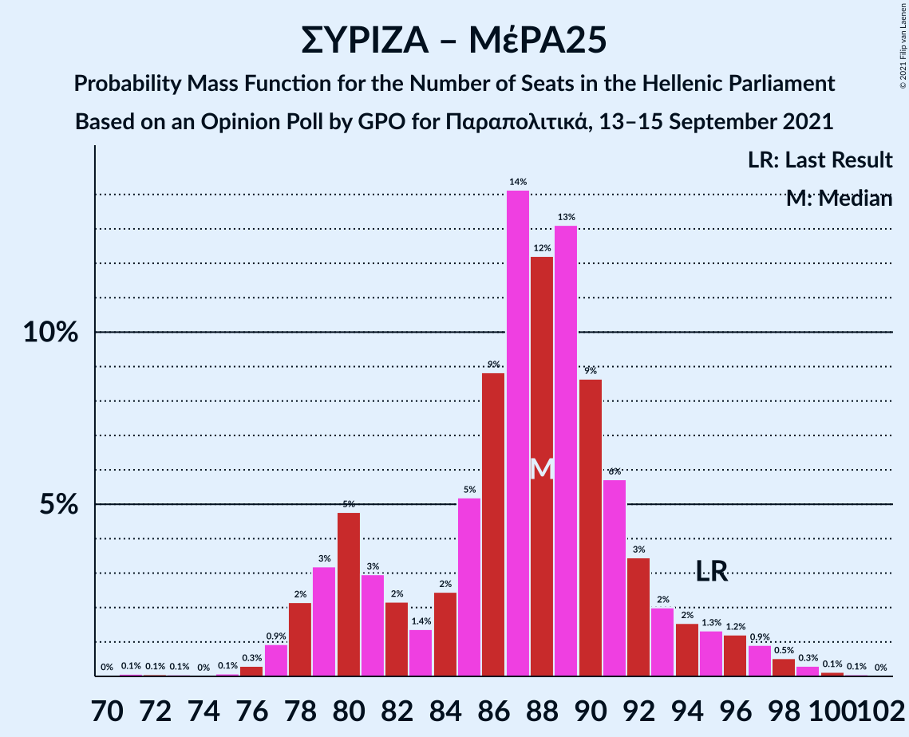
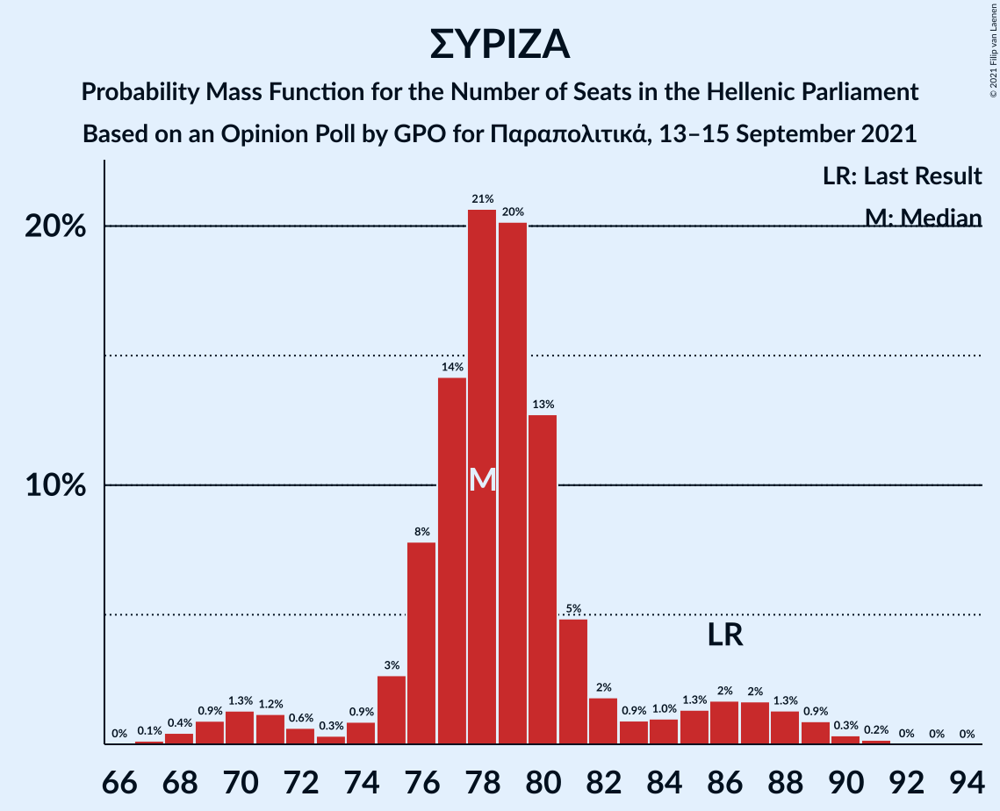

# Opinion Poll by GPO for Παραπολιτικά, 13–15 September 2021

<a href="#voting-intentions">Voting Intentions</a> | <a href="#seats">Seats</a> | <a href="#coalitions">Coalitions</a> | <a href="#technical-information">Technical Information</a>

## Voting Intentions

### Confidence Intervals

| Party | Last Result | Poll Result | 80% Confidence Interval | 90% Confidence Interval | 95% Confidence Interval | 99% Confidence Interval |
|:-----:|:-----------:|:-----------:|:-----------------------:|:-----------------------:|:-----------------------:|:-----------------------:|
| Νέα Δημοκρατία | 39.8% | 41.3% | 39.3–43.3% |38.8–43.9% |38.3–44.4% |37.3–45.4% |
| Συνασπισμός Ριζοσπαστικής Αριστεράς | 31.5% | 29.0% | 27.2–30.9% |26.7–31.4% |26.3–31.9% |25.4–32.8% |
| Κίνημα Αλλαγής | 8.1% | 7.5% | 6.5–8.7% |6.2–9.0% |6.0–9.3% |5.6–9.9% |
| Κομμουνιστικό Κόμμα Ελλάδας | 5.3% | 6.8% | 5.9–7.9% |5.6–8.3% |5.4–8.5% |5.0–9.1% |
| Ελληνική Λύση | 3.7% | 4.2% | 3.5–5.1% |3.3–5.4% |3.1–5.6% |2.8–6.1% |
| Μέτωπο Ευρωπαϊκής Ρεαλιστικής Ανυπακοής | 3.4% | 3.5% | 2.9–4.4% |2.7–4.6% |2.5–4.8% |2.2–5.3% |

*Note:* The poll result column reflects the actual value used in the calculations. Published results may vary slightly, and in addition be rounded to fewer digits.

## Seats

### Confidence Intervals

| Party | Last Result | Median | 80% Confidence Interval | 90% Confidence Interval | 95% Confidence Interval | 99% Confidence Interval |
|:-----:|:-----------:|:------:|:-----------------------:|:-----------------------:|:-----------------------:|:-----------------------:|
| <a href="#νέα-δημοκρατία">Νέα Δημοκρατία</a> | 158 | 162 | 157–168 |155–170 |154–171 |151–174 |
| <a href="#συνασπισμός-ριζοσπαστικής-αριστεράς">Συνασπισμός Ριζοσπαστικής Αριστεράς</a> | 86 | 78 | 76–82 |74–86 |70–88 |68–90 |
| <a href="#κίνημα-αλλαγής">Κίνημα Αλλαγής</a> | 22 | 21 | 18–24 |17–24 |16–25 |15–27 |
| <a href="#κομμουνιστικό-κόμμα-ελλάδας">Κομμουνιστικό Κόμμα Ελλάδας</a> | 15 | 19 | 16–21 |15–22 |15–23 |14–25 |
| <a href="#ελληνική-λύση">Ελληνική Λύση</a> | 10 | 12 | 9–14 |9–15 |8–15 |0–17 |
| <a href="#μέτωπο-ευρωπαϊκής-ρεαλιστικής-ανυπακοής">Μέτωπο Ευρωπαϊκής Ρεαλιστικής Ανυπακοής</a> | 9 | 10 | 0–12 |0–12 |0–13 |0–14 |

### Νέα Δημοκρατία

*For a full overview of the results for this party, see the [Νέα Δημοκρατία](party-νέαδημοκρατία.html) page.*

| Number of Seats | Probability | Accumulated | Special Marks |
|:---------------:|:-----------:|:-----------:|:-------------:|
| 148 | 0% | 100% |  |
| 149 | 0.1% | 99.9% |  |
| 150 | 0.2% | 99.8% |  |
| 151 | 0.3% | 99.7% | Majority |
| 152 | 0.6% | 99.4% |  |
| 153 | 1.0% | 98.8% |  |
| 154 | 1.5% | 98% |  |
| 155 | 2% | 96% |  |
| 156 | 3% | 94% |  |
| 157 | 5% | 91% |  |
| 158 | 6% | 86% | Last Result |
| 159 | 7% | 80% |  |
| 160 | 8% | 73% |  |
| 161 | 11% | 65% |  |
| 162 | 11% | 55% | Median |
| 163 | 9% | 43% |  |
| 164 | 6% | 35% |  |
| 165 | 6% | 28% |  |
| 166 | 7% | 22% |  |
| 167 | 4% | 15% |  |
| 168 | 3% | 11% |  |
| 169 | 2% | 7% |  |
| 170 | 2% | 5% |  |
| 171 | 2% | 4% |  |
| 172 | 0.9% | 2% |  |
| 173 | 0.4% | 1.1% |  |
| 174 | 0.3% | 0.7% |  |
| 175 | 0.2% | 0.4% |  |
| 176 | 0.1% | 0.2% |  |
| 177 | 0% | 0.1% |  |
| 178 | 0% | 0% |  |

### Συνασπισμός Ριζοσπαστικής Αριστεράς

*For a full overview of the results for this party, see the [Συνασπισμός Ριζοσπαστικής Αριστεράς](party-συνασπισμόςριζοσπαστικήςαριστεράς.html) page.*

| Number of Seats | Probability | Accumulated | Special Marks |
|:---------------:|:-----------:|:-----------:|:-------------:|
| 67 | 0.1% | 100% |  |
| 68 | 0.4% | 99.8% |  |
| 69 | 0.9% | 99.4% |  |
| 70 | 1.3% | 98% |  |
| 71 | 1.2% | 97% |  |
| 72 | 0.6% | 96% |  |
| 73 | 0.3% | 95% |  |
| 74 | 0.9% | 95% |  |
| 75 | 3% | 94% |  |
| 76 | 8% | 92% |  |
| 77 | 14% | 84% |  |
| 78 | 21% | 70% | Median |
| 79 | 20% | 49% |  |
| 80 | 13% | 29% |  |
| 81 | 5% | 16% |  |
| 82 | 2% | 11% |  |
| 83 | 0.9% | 9% |  |
| 84 | 1.0% | 8% |  |
| 85 | 1.3% | 7% |  |
| 86 | 2% | 6% | Last Result |
| 87 | 2% | 4% |  |
| 88 | 1.3% | 3% |  |
| 89 | 0.9% | 1.5% |  |
| 90 | 0.3% | 0.6% |  |
| 91 | 0.2% | 0.2% |  |
| 92 | 0% | 0.1% |  |
| 93 | 0% | 0% |  |

### Κίνημα Αλλαγής

*For a full overview of the results for this party, see the [Κίνημα Αλλαγής](party-κίνημααλλαγής.html) page.*

| Number of Seats | Probability | Accumulated | Special Marks |
|:---------------:|:-----------:|:-----------:|:-------------:|
| 14 | 0.1% | 100% |  |
| 15 | 0.6% | 99.8% |  |
| 16 | 2% | 99.2% |  |
| 17 | 5% | 97% |  |
| 18 | 10% | 92% |  |
| 19 | 15% | 82% |  |
| 20 | 17% | 67% |  |
| 21 | 17% | 51% | Median |
| 22 | 14% | 33% | Last Result |
| 23 | 9% | 20% |  |
| 24 | 6% | 10% |  |
| 25 | 3% | 5% |  |
| 26 | 1.2% | 2% |  |
| 27 | 0.5% | 0.7% |  |
| 28 | 0.2% | 0.2% |  |
| 29 | 0.1% | 0.1% |  |
| 30 | 0% | 0% |  |

### Κομμουνιστικό Κόμμα Ελλάδας

*For a full overview of the results for this party, see the [Κομμουνιστικό Κόμμα Ελλάδας](party-κομμουνιστικόκόμμαελλάδας.html) page.*

| Number of Seats | Probability | Accumulated | Special Marks |
|:---------------:|:-----------:|:-----------:|:-------------:|
| 12 | 0.1% | 100% |  |
| 13 | 0.4% | 99.9% |  |
| 14 | 2% | 99.5% |  |
| 15 | 4% | 98% | Last Result |
| 16 | 9% | 94% |  |
| 17 | 14% | 85% |  |
| 18 | 20% | 71% |  |
| 19 | 18% | 51% | Median |
| 20 | 14% | 33% |  |
| 21 | 9% | 19% |  |
| 22 | 5% | 9% |  |
| 23 | 3% | 5% |  |
| 24 | 1.2% | 2% |  |
| 25 | 0.4% | 0.6% |  |
| 26 | 0.1% | 0.2% |  |
| 27 | 0% | 0.1% |  |
| 28 | 0% | 0% |  |

### Ελληνική Λύση

*For a full overview of the results for this party, see the [Ελληνική Λύση](party-ελληνικήλύση.html) page.*

| Number of Seats | Probability | Accumulated | Special Marks |
|:---------------:|:-----------:|:-----------:|:-------------:|
| 0 | 1.4% | 100% |  |
| 1 | 0% | 98.6% |  |
| 2 | 0% | 98.6% |  |
| 3 | 0% | 98.6% |  |
| 4 | 0% | 98.6% |  |
| 5 | 0% | 98.6% |  |
| 6 | 0% | 98.6% |  |
| 7 | 0% | 98.6% |  |
| 8 | 1.2% | 98.6% |  |
| 9 | 8% | 97% |  |
| 10 | 17% | 90% | Last Result |
| 11 | 23% | 73% |  |
| 12 | 21% | 50% | Median |
| 13 | 16% | 29% |  |
| 14 | 8% | 13% |  |
| 15 | 4% | 5% |  |
| 16 | 1.3% | 2% |  |
| 17 | 0.4% | 0.5% |  |
| 18 | 0.1% | 0.1% |  |
| 19 | 0% | 0% |  |

### Μέτωπο Ευρωπαϊκής Ρεαλιστικής Ανυπακοής

*For a full overview of the results for this party, see the [Μέτωπο Ευρωπαϊκής Ρεαλιστικής Ανυπακοής](party-μέτωποευρωπαϊκήςρεαλιστικήςανυπακοής.html) page.*

| Number of Seats | Probability | Accumulated | Special Marks |
|:---------------:|:-----------:|:-----------:|:-------------:|
| 0 | 16% | 100% |  |
| 1 | 0% | 84% |  |
| 2 | 0% | 84% |  |
| 3 | 0% | 84% |  |
| 4 | 0% | 84% |  |
| 5 | 0% | 84% |  |
| 6 | 0% | 84% |  |
| 7 | 0% | 84% |  |
| 8 | 7% | 84% |  |
| 9 | 24% | 77% | Last Result |
| 10 | 24% | 53% | Median |
| 11 | 16% | 29% |  |
| 12 | 8% | 13% |  |
| 13 | 3% | 5% |  |
| 14 | 1.0% | 1.3% |  |
| 15 | 0.2% | 0.3% |  |
| 16 | 0.1% | 0.1% |  |
| 17 | 0% | 0% |  |

## Coalitions

### Confidence Intervals

| Coalition | Last Result | Median | Majority? | 80% Confidence Interval | 90% Confidence Interval | 95% Confidence Interval | 99% Confidence Interval |
|:---------:|:-----------:|:------:|:---------:|:-----------------------:|:-----------------------:|:-----------------------:|:-----------------------:|
| Νέα Δημοκρατία – Κίνημα Αλλαγής | 180 | 182 | 100% | 177–189 | 176–191 | 174–192 | 171–195 |
| Νέα Δημοκρατία | 158 | 162 | 99.7% | 157–168 | 155–170 | 154–171 | 151–174 |
| Συνασπισμός Ριζοσπαστικής Αριστεράς – Μέτωπο Ευρωπαϊκής Ρεαλιστικής Ανυπακοής | 95 | 88 | 0% | 80–92 | 79–94 | 78–96 | 76–99 |
| Συνασπισμός Ριζοσπαστικής Αριστεράς | 86 | 78 | 0% | 76–82 | 74–86 | 70–88 | 68–90 |

### Νέα Δημοκρατία – Κίνημα Αλλαγής

| Number of Seats | Probability | Accumulated | Special Marks |
|:---------------:|:-----------:|:-----------:|:-------------:|
| 168 | 0% | 100% |  |
| 169 | 0.1% | 99.9% |  |
| 170 | 0.1% | 99.9% |  |
| 171 | 0.4% | 99.7% |  |
| 172 | 0.4% | 99.4% |  |
| 173 | 0.9% | 98.9% |  |
| 174 | 1.0% | 98% |  |
| 175 | 2% | 97% |  |
| 176 | 2% | 95% |  |
| 177 | 4% | 93% |  |
| 178 | 4% | 90% |  |
| 179 | 7% | 86% |  |
| 180 | 8% | 78% | Last Result |
| 181 | 10% | 70% |  |
| 182 | 11% | 60% |  |
| 183 | 11% | 49% | Median |
| 184 | 9% | 38% |  |
| 185 | 6% | 30% |  |
| 186 | 5% | 23% |  |
| 187 | 4% | 18% |  |
| 188 | 3% | 14% |  |
| 189 | 3% | 11% |  |
| 190 | 3% | 8% |  |
| 191 | 2% | 5% |  |
| 192 | 1.3% | 3% |  |
| 193 | 0.8% | 2% |  |
| 194 | 0.4% | 1.0% |  |
| 195 | 0.2% | 0.6% |  |
| 196 | 0.1% | 0.3% |  |
| 197 | 0.1% | 0.2% |  |
| 198 | 0% | 0.1% |  |
| 199 | 0% | 0.1% |  |
| 200 | 0% | 0% |  |

### Νέα Δημοκρατία

| Number of Seats | Probability | Accumulated | Special Marks |
|:---------------:|:-----------:|:-----------:|:-------------:|
| 148 | 0% | 100% |  |
| 149 | 0.1% | 99.9% |  |
| 150 | 0.2% | 99.8% |  |
| 151 | 0.3% | 99.7% | Majority |
| 152 | 0.6% | 99.4% |  |
| 153 | 1.0% | 98.8% |  |
| 154 | 1.5% | 98% |  |
| 155 | 2% | 96% |  |
| 156 | 3% | 94% |  |
| 157 | 5% | 91% |  |
| 158 | 6% | 86% | Last Result |
| 159 | 7% | 80% |  |
| 160 | 8% | 73% |  |
| 161 | 11% | 65% |  |
| 162 | 11% | 55% | Median |
| 163 | 9% | 43% |  |
| 164 | 6% | 35% |  |
| 165 | 6% | 28% |  |
| 166 | 7% | 22% |  |
| 167 | 4% | 15% |  |
| 168 | 3% | 11% |  |
| 169 | 2% | 7% |  |
| 170 | 2% | 5% |  |
| 171 | 2% | 4% |  |
| 172 | 0.9% | 2% |  |
| 173 | 0.4% | 1.1% |  |
| 174 | 0.3% | 0.7% |  |
| 175 | 0.2% | 0.4% |  |
| 176 | 0.1% | 0.2% |  |
| 177 | 0% | 0.1% |  |
| 178 | 0% | 0% |  |

### Συνασπισμός Ριζοσπαστικής Αριστεράς – Μέτωπο Ευρωπαϊκής Ρεαλιστικής Ανυπακοής

| Number of Seats | Probability | Accumulated | Special Marks |
|:---------------:|:-----------:|:-----------:|:-------------:|
| 70 | 0% | 100% |  |
| 71 | 0.1% | 99.9% |  |
| 72 | 0.1% | 99.9% |  |
| 73 | 0.1% | 99.8% |  |
| 74 | 0% | 99.8% |  |
| 75 | 0.1% | 99.7% |  |
| 76 | 0.3% | 99.6% |  |
| 77 | 0.9% | 99.3% |  |
| 78 | 2% | 98% |  |
| 79 | 3% | 96% |  |
| 80 | 5% | 93% |  |
| 81 | 3% | 88% |  |
| 82 | 2% | 85% |  |
| 83 | 1.4% | 83% |  |
| 84 | 2% | 82% |  |
| 85 | 5% | 79% |  |
| 86 | 9% | 74% |  |
| 87 | 14% | 65% |  |
| 88 | 12% | 51% | Median |
| 89 | 13% | 39% |  |
| 90 | 9% | 26% |  |
| 91 | 6% | 17% |  |
| 92 | 3% | 12% |  |
| 93 | 2% | 8% |  |
| 94 | 2% | 6% |  |
| 95 | 1.3% | 5% | Last Result |
| 96 | 1.2% | 3% |  |
| 97 | 0.9% | 2% |  |
| 98 | 0.5% | 1.1% |  |
| 99 | 0.3% | 0.5% |  |
| 100 | 0.1% | 0.2% |  |
| 101 | 0.1% | 0.1% |  |
| 102 | 0% | 0% |  |

### Συνασπισμός Ριζοσπαστικής Αριστεράς

| Number of Seats | Probability | Accumulated | Special Marks |
|:---------------:|:-----------:|:-----------:|:-------------:|
| 67 | 0.1% | 100% |  |
| 68 | 0.4% | 99.8% |  |
| 69 | 0.9% | 99.4% |  |
| 70 | 1.3% | 98% |  |
| 71 | 1.2% | 97% |  |
| 72 | 0.6% | 96% |  |
| 73 | 0.3% | 95% |  |
| 74 | 0.9% | 95% |  |
| 75 | 3% | 94% |  |
| 76 | 8% | 92% |  |
| 77 | 14% | 84% |  |
| 78 | 21% | 70% | Median |
| 79 | 20% | 49% |  |
| 80 | 13% | 29% |  |
| 81 | 5% | 16% |  |
| 82 | 2% | 11% |  |
| 83 | 0.9% | 9% |  |
| 84 | 1.0% | 8% |  |
| 85 | 1.3% | 7% |  |
| 86 | 2% | 6% | Last Result |
| 87 | 2% | 4% |  |
| 88 | 1.3% | 3% |  |
| 89 | 0.9% | 1.5% |  |
| 90 | 0.3% | 0.6% |  |
| 91 | 0.2% | 0.2% |  |
| 92 | 0% | 0.1% |  |
| 93 | 0% | 0% |  |

## Technical Information

### Opinion Poll

+ **Polling firm:** GPO
+ **Commissioner(s):** Παραπολιτικά
+ **Fieldwork period:** 13–15 September 2021

### Calculations

+ **Sample size:** 1000
+ **Simulations done:** 1,048,576
+ **Error estimate:** 0.35%

