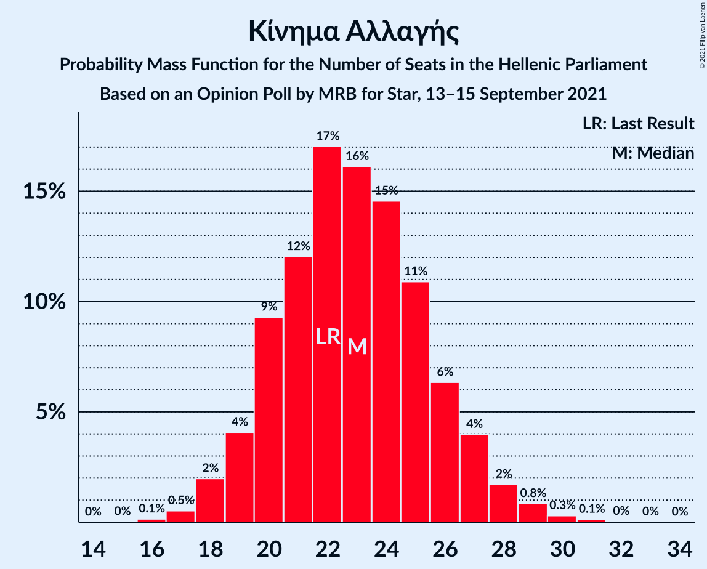
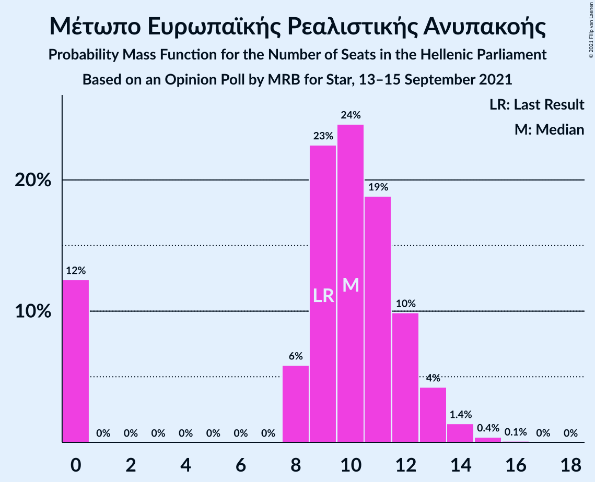

# Opinion Poll by MRB for Star, 13–15 September 2021

<a href="#voting-intentions">Voting Intentions</a> | <a href="#seats">Seats</a> | <a href="#coalitions">Coalitions</a> | <a href="#technical-information">Technical Information</a>

## Voting Intentions

### Confidence Intervals

| Party | Last Result | Poll Result | 80% Confidence Interval | 90% Confidence Interval | 95% Confidence Interval | 99% Confidence Interval |
|:-----:|:-----------:|:-----------:|:-----------------------:|:-----------------------:|:-----------------------:|:-----------------------:|
| Νέα Δημοκρατία | 39.8% | 41.4% | 39.4–43.4% |38.9–44.0% |38.4–44.5% |37.4–45.5% |
| Συνασπισμός Ριζοσπαστικής Αριστεράς | 31.5% | 28.4% | 26.6–30.3% |26.1–30.8% |25.7–31.3% |24.8–32.2% |
| Κίνημα Αλλαγής | 8.1% | 8.4% | 7.4–9.6% |7.1–10.0% |6.8–10.3% |6.4–10.9% |
| Κομμουνιστικό Κόμμα Ελλάδας | 5.3% | 6.3% | 5.4–7.4% |5.2–7.7% |5.0–8.0% |4.6–8.6% |
| Ελληνική Λύση | 3.7% | 4.4% | 3.7–5.3% |3.5–5.6% |3.3–5.9% |3.0–6.4% |
| Μέτωπο Ευρωπαϊκής Ρεαλιστικής Ανυπακοής | 3.4% | 3.6% | 2.9–4.5% |2.8–4.7% |2.6–5.0% |2.3–5.4% |

*Note:* The poll result column reflects the actual value used in the calculations. Published results may vary slightly, and in addition be rounded to fewer digits.

## Seats

### Confidence Intervals

| Party | Last Result | Median | 80% Confidence Interval | 90% Confidence Interval | 95% Confidence Interval | 99% Confidence Interval |
|:-----:|:-----------:|:------:|:-----------------------:|:-----------------------:|:-----------------------:|:-----------------------:|
| <a href="#νέα-δημοκρατία">Νέα Δημοκρατία</a> | 158 | 162 | 157–167 |155–169 |154–170 |151–173 |
| <a href="#συνασπισμός-ριζοσπαστικής-αριστεράς">Συνασπισμός Ριζοσπαστικής Αριστεράς</a> | 86 | 77 | 72–82 |71–83 |69–84 |67–87 |
| <a href="#κίνημα-αλλαγής">Κίνημα Αλλαγής</a> | 22 | 23 | 20–26 |19–27 |19–28 |17–30 |
| <a href="#κομμουνιστικό-κόμμα-ελλάδας">Κομμουνιστικό Κόμμα Ελλάδας</a> | 15 | 17 | 15–20 |14–21 |13–21 |13–23 |
| <a href="#ελληνική-λύση">Ελληνική Λύση</a> | 10 | 12 | 10–14 |9–14 |9–15 |0–17 |
| <a href="#μέτωπο-ευρωπαϊκής-ρεαλιστικής-ανυπακοής">Μέτωπο Ευρωπαϊκής Ρεαλιστικής Ανυπακοής</a> | 9 | 10 | 0–12 |0–13 |0–13 |0–14 |

### Νέα Δημοκρατία

*For a full overview of the results for this party, see the [Νέα Δημοκρατία](party-νέαδημοκρατία.html) page.*

| Number of Seats | Probability | Accumulated | Special Marks |
|:---------------:|:-----------:|:-----------:|:-------------:|
| 148 | 0% | 100% |  |
| 149 | 0.1% | 99.9% |  |
| 150 | 0.2% | 99.9% |  |
| 151 | 0.2% | 99.7% | Majority |
| 152 | 0.5% | 99.5% |  |
| 153 | 1.2% | 99.0% |  |
| 154 | 2% | 98% |  |
| 155 | 2% | 96% |  |
| 156 | 4% | 94% |  |
| 157 | 6% | 91% |  |
| 158 | 8% | 85% | Last Result |
| 159 | 7% | 77% |  |
| 160 | 7% | 69% |  |
| 161 | 11% | 63% |  |
| 162 | 12% | 52% | Median |
| 163 | 7% | 40% |  |
| 164 | 6% | 33% |  |
| 165 | 8% | 27% |  |
| 166 | 5% | 20% |  |
| 167 | 5% | 14% |  |
| 168 | 2% | 9% |  |
| 169 | 3% | 7% |  |
| 170 | 1.4% | 3% |  |
| 171 | 0.8% | 2% |  |
| 172 | 0.5% | 1.3% |  |
| 173 | 0.3% | 0.8% |  |
| 174 | 0.2% | 0.5% |  |
| 175 | 0.1% | 0.2% |  |
| 176 | 0% | 0.2% |  |
| 177 | 0.1% | 0.1% |  |
| 178 | 0% | 0% |  |

### Συνασπισμός Ριζοσπαστικής Αριστεράς

*For a full overview of the results for this party, see the [Συνασπισμός Ριζοσπαστικής Αριστεράς](party-συνασπισμόςριζοσπαστικήςαριστεράς.html) page.*

| Number of Seats | Probability | Accumulated | Special Marks |
|:---------------:|:-----------:|:-----------:|:-------------:|
| 65 | 0% | 100% |  |
| 66 | 0.2% | 99.9% |  |
| 67 | 0.4% | 99.8% |  |
| 68 | 0.5% | 99.4% |  |
| 69 | 1.4% | 98.8% |  |
| 70 | 2% | 97% |  |
| 71 | 4% | 96% |  |
| 72 | 4% | 92% |  |
| 73 | 9% | 88% |  |
| 74 | 5% | 79% |  |
| 75 | 12% | 74% |  |
| 76 | 10% | 62% |  |
| 77 | 10% | 52% | Median |
| 78 | 11% | 42% |  |
| 79 | 9% | 32% |  |
| 80 | 7% | 23% |  |
| 81 | 3% | 15% |  |
| 82 | 4% | 12% |  |
| 83 | 3% | 8% |  |
| 84 | 3% | 5% |  |
| 85 | 0.7% | 2% |  |
| 86 | 0.5% | 1.4% | Last Result |
| 87 | 0.4% | 0.9% |  |
| 88 | 0.3% | 0.4% |  |
| 89 | 0.1% | 0.2% |  |
| 90 | 0% | 0.1% |  |
| 91 | 0% | 0% |  |

### Κίνημα Αλλαγής

*For a full overview of the results for this party, see the [Κίνημα Αλλαγής](party-κίνημααλλαγής.html) page.*

| Number of Seats | Probability | Accumulated | Special Marks |
|:---------------:|:-----------:|:-----------:|:-------------:|
| 16 | 0.1% | 100% |  |
| 17 | 0.4% | 99.8% |  |
| 18 | 2% | 99.5% |  |
| 19 | 5% | 98% |  |
| 20 | 9% | 92% |  |
| 21 | 17% | 83% |  |
| 22 | 10% | 66% | Last Result |
| 23 | 22% | 56% | Median |
| 24 | 8% | 34% |  |
| 25 | 14% | 25% |  |
| 26 | 5% | 11% |  |
| 27 | 4% | 7% |  |
| 28 | 1.5% | 3% |  |
| 29 | 0.7% | 1.2% |  |
| 30 | 0.3% | 0.5% |  |
| 31 | 0.1% | 0.2% |  |
| 32 | 0% | 0.1% |  |
| 33 | 0% | 0% |  |

### Κομμουνιστικό Κόμμα Ελλάδας

*For a full overview of the results for this party, see the [Κομμουνιστικό Κόμμα Ελλάδας](party-κομμουνιστικόκόμμαελλάδας.html) page.*

| Number of Seats | Probability | Accumulated | Special Marks |
|:---------------:|:-----------:|:-----------:|:-------------:|
| 11 | 0.1% | 100% |  |
| 12 | 0.4% | 99.9% |  |
| 13 | 2% | 99.5% |  |
| 14 | 4% | 97% |  |
| 15 | 12% | 94% | Last Result |
| 16 | 15% | 82% |  |
| 17 | 25% | 68% | Median |
| 18 | 17% | 43% |  |
| 19 | 12% | 25% |  |
| 20 | 7% | 13% |  |
| 21 | 3% | 6% |  |
| 22 | 1.4% | 2% |  |
| 23 | 0.7% | 1.0% |  |
| 24 | 0.2% | 0.3% |  |
| 25 | 0.1% | 0.1% |  |
| 26 | 0% | 0% |  |

### Ελληνική Λύση

*For a full overview of the results for this party, see the [Ελληνική Λύση](party-ελληνικήλύση.html) page.*

| Number of Seats | Probability | Accumulated | Special Marks |
|:---------------:|:-----------:|:-----------:|:-------------:|
| 0 | 0.9% | 100% |  |
| 1 | 0% | 99.1% |  |
| 2 | 0% | 99.1% |  |
| 3 | 0% | 99.1% |  |
| 4 | 0% | 99.1% |  |
| 5 | 0% | 99.1% |  |
| 6 | 0% | 99.1% |  |
| 7 | 0% | 99.1% |  |
| 8 | 0.7% | 99.1% |  |
| 9 | 4% | 98% |  |
| 10 | 5% | 94% | Last Result |
| 11 | 12% | 89% |  |
| 12 | 30% | 78% | Median |
| 13 | 34% | 47% |  |
| 14 | 9% | 13% |  |
| 15 | 2% | 4% |  |
| 16 | 1.1% | 2% |  |
| 17 | 0.6% | 1.0% |  |
| 18 | 0.4% | 0.4% |  |
| 19 | 0.1% | 0.1% |  |
| 20 | 0% | 0% |  |

### Μέτωπο Ευρωπαϊκής Ρεαλιστικής Ανυπακοής

*For a full overview of the results for this party, see the [Μέτωπο Ευρωπαϊκής Ρεαλιστικής Ανυπακοής](party-μέτωποευρωπαϊκήςρεαλιστικήςανυπακοής.html) page.*

| Number of Seats | Probability | Accumulated | Special Marks |
|:---------------:|:-----------:|:-----------:|:-------------:|
| 0 | 11% | 100% |  |
| 1 | 0% | 89% |  |
| 2 | 0% | 89% |  |
| 3 | 0% | 89% |  |
| 4 | 0% | 89% |  |
| 5 | 0% | 89% |  |
| 6 | 0% | 89% |  |
| 7 | 0% | 89% |  |
| 8 | 6% | 89% |  |
| 9 | 22% | 82% | Last Result |
| 10 | 25% | 60% | Median |
| 11 | 20% | 36% |  |
| 12 | 10% | 16% |  |
| 13 | 4% | 6% |  |
| 14 | 1.4% | 2% |  |
| 15 | 0.3% | 0.5% |  |
| 16 | 0.1% | 0.1% |  |
| 17 | 0% | 0% |  |

## Coalitions

### Confidence Intervals

| Coalition | Last Result | Median | Majority? | 80% Confidence Interval | 90% Confidence Interval | 95% Confidence Interval | 99% Confidence Interval |
|:---------:|:-----------:|:------:|:---------:|:-----------------------:|:-----------------------:|:-----------------------:|:-----------------------:|
| Νέα Δημοκρατία – Κίνημα Αλλαγής | 180 | 185 | 100% | 179–191 | 178–192 | 177–194 | 174–197 |
| Νέα Δημοκρατία | 158 | 162 | 99.7% | 157–167 | 155–169 | 154–170 | 151–173 |
| Συνασπισμός Ριζοσπαστικής Αριστεράς – Μέτωπο Ευρωπαϊκής Ρεαλιστικής Ανυπακοής | 95 | 86 | 0% | 81–91 | 78–92 | 76–94 | 74–97 |
| Συνασπισμός Ριζοσπαστικής Αριστεράς | 86 | 77 | 0% | 72–82 | 71–83 | 69–84 | 67–87 |

### Νέα Δημοκρατία – Κίνημα Αλλαγής

| Number of Seats | Probability | Accumulated | Special Marks |
|:---------------:|:-----------:|:-----------:|:-------------:|
| 171 | 0% | 100% |  |
| 172 | 0.1% | 99.9% |  |
| 173 | 0.3% | 99.9% |  |
| 174 | 0.2% | 99.6% |  |
| 175 | 0.7% | 99.4% |  |
| 176 | 1.1% | 98.7% |  |
| 177 | 2% | 98% |  |
| 178 | 3% | 96% |  |
| 179 | 5% | 93% |  |
| 180 | 5% | 88% | Last Result |
| 181 | 5% | 83% |  |
| 182 | 11% | 78% |  |
| 183 | 8% | 67% |  |
| 184 | 9% | 59% |  |
| 185 | 11% | 51% | Median |
| 186 | 11% | 40% |  |
| 187 | 6% | 29% |  |
| 188 | 8% | 23% |  |
| 189 | 3% | 15% |  |
| 190 | 2% | 12% |  |
| 191 | 5% | 10% |  |
| 192 | 2% | 5% |  |
| 193 | 0.7% | 4% |  |
| 194 | 1.2% | 3% |  |
| 195 | 0.8% | 2% |  |
| 196 | 0.2% | 0.9% |  |
| 197 | 0.3% | 0.7% |  |
| 198 | 0.1% | 0.4% |  |
| 199 | 0.1% | 0.3% |  |
| 200 | 0.1% | 0.1% |  |
| 201 | 0.1% | 0.1% |  |
| 202 | 0% | 0% |  |

### Νέα Δημοκρατία

| Number of Seats | Probability | Accumulated | Special Marks |
|:---------------:|:-----------:|:-----------:|:-------------:|
| 148 | 0% | 100% |  |
| 149 | 0.1% | 99.9% |  |
| 150 | 0.2% | 99.9% |  |
| 151 | 0.2% | 99.7% | Majority |
| 152 | 0.5% | 99.5% |  |
| 153 | 1.2% | 99.0% |  |
| 154 | 2% | 98% |  |
| 155 | 2% | 96% |  |
| 156 | 4% | 94% |  |
| 157 | 6% | 91% |  |
| 158 | 8% | 85% | Last Result |
| 159 | 7% | 77% |  |
| 160 | 7% | 69% |  |
| 161 | 11% | 63% |  |
| 162 | 12% | 52% | Median |
| 163 | 7% | 40% |  |
| 164 | 6% | 33% |  |
| 165 | 8% | 27% |  |
| 166 | 5% | 20% |  |
| 167 | 5% | 14% |  |
| 168 | 2% | 9% |  |
| 169 | 3% | 7% |  |
| 170 | 1.4% | 3% |  |
| 171 | 0.8% | 2% |  |
| 172 | 0.5% | 1.3% |  |
| 173 | 0.3% | 0.8% |  |
| 174 | 0.2% | 0.5% |  |
| 175 | 0.1% | 0.2% |  |
| 176 | 0% | 0.2% |  |
| 177 | 0.1% | 0.1% |  |
| 178 | 0% | 0% |  |

### Συνασπισμός Ριζοσπαστικής Αριστεράς – Μέτωπο Ευρωπαϊκής Ρεαλιστικής Ανυπακοής

| Number of Seats | Probability | Accumulated | Special Marks |
|:---------------:|:-----------:|:-----------:|:-------------:|
| 70 | 0.1% | 100% |  |
| 71 | 0% | 99.9% |  |
| 72 | 0.2% | 99.8% |  |
| 73 | 0.1% | 99.7% |  |
| 74 | 0.8% | 99.6% |  |
| 75 | 0.4% | 98.7% |  |
| 76 | 0.9% | 98% |  |
| 77 | 0.7% | 97% |  |
| 78 | 3% | 97% |  |
| 79 | 1.4% | 94% |  |
| 80 | 2% | 93% |  |
| 81 | 2% | 90% |  |
| 82 | 7% | 88% |  |
| 83 | 7% | 81% |  |
| 84 | 7% | 74% |  |
| 85 | 13% | 67% |  |
| 86 | 11% | 54% |  |
| 87 | 9% | 44% | Median |
| 88 | 8% | 35% |  |
| 89 | 7% | 27% |  |
| 90 | 5% | 20% |  |
| 91 | 7% | 15% |  |
| 92 | 4% | 9% |  |
| 93 | 2% | 5% |  |
| 94 | 2% | 3% |  |
| 95 | 0.9% | 2% | Last Result |
| 96 | 0.3% | 0.8% |  |
| 97 | 0.3% | 0.6% |  |
| 98 | 0.1% | 0.2% |  |
| 99 | 0.1% | 0.1% |  |
| 100 | 0% | 0.1% |  |
| 101 | 0% | 0% |  |

### Συνασπισμός Ριζοσπαστικής Αριστεράς

| Number of Seats | Probability | Accumulated | Special Marks |
|:---------------:|:-----------:|:-----------:|:-------------:|
| 65 | 0% | 100% |  |
| 66 | 0.2% | 99.9% |  |
| 67 | 0.4% | 99.8% |  |
| 68 | 0.5% | 99.4% |  |
| 69 | 1.4% | 98.8% |  |
| 70 | 2% | 97% |  |
| 71 | 4% | 96% |  |
| 72 | 4% | 92% |  |
| 73 | 9% | 88% |  |
| 74 | 5% | 79% |  |
| 75 | 12% | 74% |  |
| 76 | 10% | 62% |  |
| 77 | 10% | 52% | Median |
| 78 | 11% | 42% |  |
| 79 | 9% | 32% |  |
| 80 | 7% | 23% |  |
| 81 | 3% | 15% |  |
| 82 | 4% | 12% |  |
| 83 | 3% | 8% |  |
| 84 | 3% | 5% |  |
| 85 | 0.7% | 2% |  |
| 86 | 0.5% | 1.4% | Last Result |
| 87 | 0.4% | 0.9% |  |
| 88 | 0.3% | 0.4% |  |
| 89 | 0.1% | 0.2% |  |
| 90 | 0% | 0.1% |  |
| 91 | 0% | 0% |  |

## Technical Information

### Opinion Poll

+ **Polling firm:** MRB
+ **Commissioner(s):** Star
+ **Fieldwork period:** 13–15 September 2021

### Calculations

+ **Sample size:** 1000
+ **Simulations done:** 131,072
+ **Error estimate:** 1.45%

