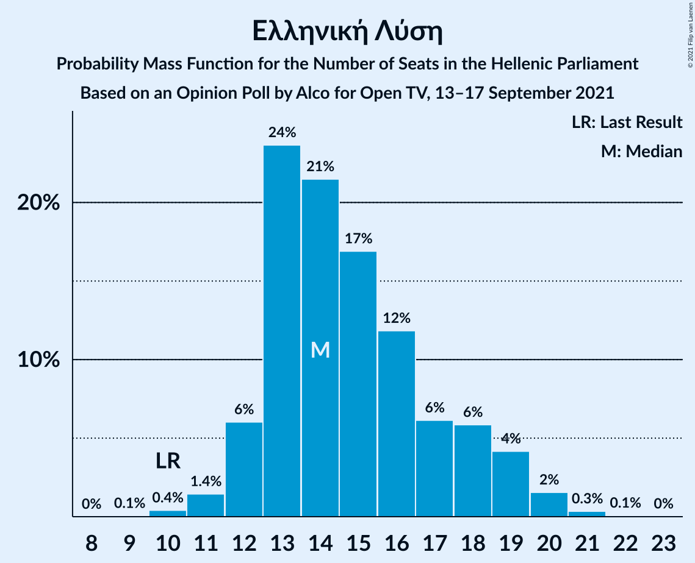

# Opinion Poll by Alco for Open TV, 13–17 September 2021

<a href="#voting-intentions">Voting Intentions</a> | <a href="#seats">Seats</a> | <a href="#coalitions">Coalitions</a> | <a href="#technical-information">Technical Information</a>

## Voting Intentions

### Confidence Intervals

| Party | Last Result | Poll Result | 80% Confidence Interval | 90% Confidence Interval | 95% Confidence Interval | 99% Confidence Interval |
|:-----:|:-----------:|:-----------:|:-----------------------:|:-----------------------:|:-----------------------:|:-----------------------:|
| Νέα Δημοκρατία | 39.8% | 39.1% | 37.1–41.1% |36.6–41.7% |36.1–42.2% |35.2–43.1% |
| Συνασπισμός Ριζοσπαστικής Αριστεράς | 31.5% | 27.4% | 25.6–29.3% |25.1–29.8% |24.7–30.3% |23.9–31.2% |
| Κίνημα Αλλαγής | 8.1% | 8.0% | 7.0–9.2% |6.7–9.6% |6.5–9.9% |6.0–10.5% |
| Κομμουνιστικό Κόμμα Ελλάδας | 5.3% | 6.5% | 5.6–7.6% |5.3–7.9% |5.1–8.2% |4.7–8.8% |
| Ελληνική Λύση | 3.7% | 5.3% | 4.5–6.3% |4.3–6.6% |4.1–6.9% |3.7–7.4% |
| Μέτωπο Ευρωπαϊκής Ρεαλιστικής Ανυπακοής | 3.4% | 3.5% | 2.9–4.4% |2.7–4.6% |2.5–4.8% |2.2–5.3% |
| Πλεύση Ελευθερίας | 1.5% | 1.8% | 1.4–2.5% |1.2–2.7% |1.1–2.8% |1.0–3.2% |
| Χρυσή Αυγή | 2.9% | 1.4% | 1.0–2.0% |0.9–2.2% |0.8–2.3% |0.7–2.7% |

*Note:* The poll result column reflects the actual value used in the calculations. Published results may vary slightly, and in addition be rounded to fewer digits.

## Seats

### Confidence Intervals

| Party | Last Result | Median | 80% Confidence Interval | 90% Confidence Interval | 95% Confidence Interval | 99% Confidence Interval |
|:-----:|:-----------:|:------:|:-----------------------:|:-----------------------:|:-----------------------:|:-----------------------:|
| <a href="#νέα-δημοκρατία">Νέα Δημοκρατία</a> | 158 | 159 | 153–165 |152–167 |151–168 |148–171 |
| <a href="#συνασπισμός-ριζοσπαστικής-αριστεράς">Συνασπισμός Ριζοσπαστικής Αριστεράς</a> | 86 | 77 | 71–82 |70–83 |69–84 |66–87 |
| <a href="#κίνημα-αλλαγής">Κίνημα Αλλαγής</a> | 22 | 22 | 19–26 |19–27 |18–27 |17–29 |
| <a href="#κομμουνιστικό-κόμμα-ελλάδας">Κομμουνιστικό Κόμμα Ελλάδας</a> | 15 | 18 | 16–21 |15–22 |14–23 |13–24 |
| <a href="#ελληνική-λύση">Ελληνική Λύση</a> | 10 | 14 | 13–18 |12–19 |12–19 |11–20 |
| <a href="#μέτωπο-ευρωπαϊκής-ρεαλιστικής-ανυπακοής">Μέτωπο Ευρωπαϊκής Ρεαλιστικής Ανυπακοής</a> | 9 | 10 | 0–12 |0–13 |0–13 |0–15 |
| <a href="#πλεύση-ελευθερίας">Πλεύση Ελευθερίας</a> | 0 | 0 | 0 |0 |0 |0–9 |
| <a href="#χρυσή-αυγή">Χρυσή Αυγή</a> | 0 | 0 | 0 |0 |0 |0 |

### Νέα Δημοκρατία

*For a full overview of the results for this party, see the [Νέα Δημοκρατία](party-νέαδημοκρατία.html) page.*

| Number of Seats | Probability | Accumulated | Special Marks |
|:---------------:|:-----------:|:-----------:|:-------------:|
| 145 | 0.1% | 100% |  |
| 146 | 0.1% | 99.9% |  |
| 147 | 0.2% | 99.8% |  |
| 148 | 0.2% | 99.6% |  |
| 149 | 0.6% | 99.4% |  |
| 150 | 1.1% | 98.8% |  |
| 151 | 2% | 98% | Majority |
| 152 | 3% | 96% |  |
| 153 | 3% | 93% |  |
| 154 | 3% | 90% |  |
| 155 | 5% | 86% |  |
| 156 | 7% | 81% |  |
| 157 | 10% | 74% |  |
| 158 | 10% | 64% | Last Result |
| 159 | 11% | 55% | Median |
| 160 | 9% | 44% |  |
| 161 | 8% | 35% |  |
| 162 | 6% | 27% |  |
| 163 | 7% | 22% |  |
| 164 | 5% | 15% |  |
| 165 | 2% | 10% |  |
| 166 | 2% | 8% |  |
| 167 | 2% | 6% |  |
| 168 | 2% | 4% |  |
| 169 | 0.9% | 2% |  |
| 170 | 0.4% | 1.3% |  |
| 171 | 0.5% | 0.9% |  |
| 172 | 0.3% | 0.4% |  |
| 173 | 0% | 0.1% |  |
| 174 | 0% | 0.1% |  |
| 175 | 0% | 0% |  |

### Συνασπισμός Ριζοσπαστικής Αριστεράς

*For a full overview of the results for this party, see the [Συνασπισμός Ριζοσπαστικής Αριστεράς](party-συνασπισμόςριζοσπαστικήςαριστεράς.html) page.*

| Number of Seats | Probability | Accumulated | Special Marks |
|:---------------:|:-----------:|:-----------:|:-------------:|
| 64 | 0.1% | 100% |  |
| 65 | 0.1% | 99.9% |  |
| 66 | 0.4% | 99.8% |  |
| 67 | 0.5% | 99.4% |  |
| 68 | 0.9% | 98.9% |  |
| 69 | 2% | 98% |  |
| 70 | 3% | 96% |  |
| 71 | 5% | 93% |  |
| 72 | 7% | 88% |  |
| 73 | 5% | 82% |  |
| 74 | 8% | 76% |  |
| 75 | 11% | 69% |  |
| 76 | 8% | 58% |  |
| 77 | 12% | 50% | Median |
| 78 | 11% | 39% |  |
| 79 | 7% | 28% |  |
| 80 | 6% | 21% |  |
| 81 | 4% | 15% |  |
| 82 | 5% | 11% |  |
| 83 | 3% | 6% |  |
| 84 | 1.3% | 4% |  |
| 85 | 0.9% | 2% |  |
| 86 | 0.4% | 1.3% | Last Result |
| 87 | 0.4% | 0.9% |  |
| 88 | 0.2% | 0.5% |  |
| 89 | 0.1% | 0.3% |  |
| 90 | 0.1% | 0.1% |  |
| 91 | 0% | 0% |  |

### Κίνημα Αλλαγής

*For a full overview of the results for this party, see the [Κίνημα Αλλαγής](party-κίνημααλλαγής.html) page.*

| Number of Seats | Probability | Accumulated | Special Marks |
|:---------------:|:-----------:|:-----------:|:-------------:|
| 15 | 0.1% | 100% |  |
| 16 | 0.3% | 99.9% |  |
| 17 | 1.2% | 99.7% |  |
| 18 | 3% | 98.5% |  |
| 19 | 6% | 96% |  |
| 20 | 9% | 90% |  |
| 21 | 15% | 81% |  |
| 22 | 19% | 66% | Last Result, Median |
| 23 | 14% | 47% |  |
| 24 | 12% | 34% |  |
| 25 | 10% | 22% |  |
| 26 | 7% | 12% |  |
| 27 | 3% | 5% |  |
| 28 | 1.5% | 2% |  |
| 29 | 0.5% | 0.9% |  |
| 30 | 0.2% | 0.4% |  |
| 31 | 0.1% | 0.1% |  |
| 32 | 0% | 0% |  |

### Κομμουνιστικό Κόμμα Ελλάδας

*For a full overview of the results for this party, see the [Κομμουνιστικό Κόμμα Ελλάδας](party-κομμουνιστικόκόμμαελλάδας.html) page.*

| Number of Seats | Probability | Accumulated | Special Marks |
|:---------------:|:-----------:|:-----------:|:-------------:|
| 12 | 0.1% | 100% |  |
| 13 | 0.8% | 99.9% |  |
| 14 | 2% | 99.1% |  |
| 15 | 4% | 97% | Last Result |
| 16 | 14% | 93% |  |
| 17 | 9% | 78% |  |
| 18 | 23% | 69% | Median |
| 19 | 14% | 46% |  |
| 20 | 15% | 32% |  |
| 21 | 9% | 16% |  |
| 22 | 3% | 7% |  |
| 23 | 3% | 4% |  |
| 24 | 0.6% | 1.0% |  |
| 25 | 0.3% | 0.5% |  |
| 26 | 0.1% | 0.1% |  |
| 27 | 0% | 0% |  |

### Ελληνική Λύση

*For a full overview of the results for this party, see the [Ελληνική Λύση](party-ελληνικήλύση.html) page.*

| Number of Seats | Probability | Accumulated | Special Marks |
|:---------------:|:-----------:|:-----------:|:-------------:|
| 9 | 0.1% | 100% |  |
| 10 | 0.4% | 99.9% | Last Result |
| 11 | 1.4% | 99.5% |  |
| 12 | 6% | 98% |  |
| 13 | 24% | 92% |  |
| 14 | 21% | 68% | Median |
| 15 | 17% | 47% |  |
| 16 | 12% | 30% |  |
| 17 | 6% | 18% |  |
| 18 | 6% | 12% |  |
| 19 | 4% | 6% |  |
| 20 | 2% | 2% |  |
| 21 | 0.3% | 0.5% |  |
| 22 | 0.1% | 0.1% |  |
| 23 | 0% | 0% |  |

### Μέτωπο Ευρωπαϊκής Ρεαλιστικής Ανυπακοής

*For a full overview of the results for this party, see the [Μέτωπο Ευρωπαϊκής Ρεαλιστικής Ανυπακοής](party-μέτωποευρωπαϊκήςρεαλιστικήςανυπακοής.html) page.*

| Number of Seats | Probability | Accumulated | Special Marks |
|:---------------:|:-----------:|:-----------:|:-------------:|
| 0 | 16% | 100% |  |
| 1 | 0% | 84% |  |
| 2 | 0% | 84% |  |
| 3 | 0% | 84% |  |
| 4 | 0% | 84% |  |
| 5 | 0% | 84% |  |
| 6 | 0% | 84% |  |
| 7 | 0% | 84% |  |
| 8 | 3% | 84% |  |
| 9 | 25% | 81% | Last Result |
| 10 | 21% | 56% | Median |
| 11 | 19% | 35% |  |
| 12 | 11% | 16% |  |
| 13 | 3% | 5% |  |
| 14 | 1.4% | 2% |  |
| 15 | 0.5% | 0.6% |  |
| 16 | 0.1% | 0.1% |  |
| 17 | 0% | 0% |  |

### Πλεύση Ελευθερίας

*For a full overview of the results for this party, see the [Πλεύση Ελευθερίας](party-πλεύσηελευθερίας.html) page.*

| Number of Seats | Probability | Accumulated | Special Marks |
|:---------------:|:-----------:|:-----------:|:-------------:|
| 0 | 99.0% | 100% | Last Result, Median |
| 1 | 0% | 1.0% |  |
| 2 | 0% | 1.0% |  |
| 3 | 0% | 1.0% |  |
| 4 | 0% | 1.0% |  |
| 5 | 0% | 1.0% |  |
| 6 | 0% | 1.0% |  |
| 7 | 0% | 1.0% |  |
| 8 | 0.4% | 1.0% |  |
| 9 | 0.6% | 0.7% |  |
| 10 | 0.1% | 0.1% |  |
| 11 | 0% | 0% |  |

### Χρυσή Αυγή

*For a full overview of the results for this party, see the [Χρυσή Αυγή](party-χρυσήαυγή.html) page.*

| Number of Seats | Probability | Accumulated | Special Marks |
|:---------------:|:-----------:|:-----------:|:-------------:|
| 0 | 99.9% | 100% | Last Result, Median |
| 1 | 0% | 0.1% |  |
| 2 | 0% | 0.1% |  |
| 3 | 0% | 0.1% |  |
| 4 | 0% | 0.1% |  |
| 5 | 0% | 0.1% |  |
| 6 | 0% | 0.1% |  |
| 7 | 0% | 0.1% |  |
| 8 | 0% | 0.1% |  |
| 9 | 0% | 0% |  |

## Coalitions

### Confidence Intervals

| Coalition | Last Result | Median | Majority? | 80% Confidence Interval | 90% Confidence Interval | 95% Confidence Interval | 99% Confidence Interval |
|:---------:|:-----------:|:------:|:---------:|:-----------------------:|:-----------------------:|:-----------------------:|:-----------------------:|
| Νέα Δημοκρατία – Κίνημα Αλλαγής | 180 | 181 | 100% | 176–187 | 174–190 | 173–192 | 170–194 |
| Νέα Δημοκρατία | 158 | 159 | 98% | 153–165 | 152–167 | 151–168 | 148–171 |
| Συνασπισμός Ριζοσπαστικής Αριστεράς – Μέτωπο Ευρωπαϊκής Ρεαλιστικής Ανυπακοής | 95 | 86 | 0% | 79–91 | 77–92 | 75–93 | 71–96 |
| Συνασπισμός Ριζοσπαστικής Αριστεράς | 86 | 77 | 0% | 71–82 | 70–83 | 69–84 | 66–87 |

### Νέα Δημοκρατία – Κίνημα Αλλαγής

| Number of Seats | Probability | Accumulated | Special Marks |
|:---------------:|:-----------:|:-----------:|:-------------:|
| 167 | 0.1% | 100% |  |
| 168 | 0.1% | 99.9% |  |
| 169 | 0.1% | 99.8% |  |
| 170 | 0.2% | 99.7% |  |
| 171 | 0.5% | 99.5% |  |
| 172 | 1.0% | 98.9% |  |
| 173 | 1.3% | 98% |  |
| 174 | 3% | 97% |  |
| 175 | 3% | 93% |  |
| 176 | 3% | 91% |  |
| 177 | 4% | 87% |  |
| 178 | 5% | 83% |  |
| 179 | 6% | 78% |  |
| 180 | 10% | 73% | Last Result |
| 181 | 12% | 62% | Median |
| 182 | 12% | 50% |  |
| 183 | 8% | 38% |  |
| 184 | 5% | 30% |  |
| 185 | 8% | 25% |  |
| 186 | 4% | 17% |  |
| 187 | 5% | 13% |  |
| 188 | 2% | 9% |  |
| 189 | 2% | 7% |  |
| 190 | 1.1% | 5% |  |
| 191 | 2% | 4% |  |
| 192 | 1.3% | 3% |  |
| 193 | 0.9% | 1.5% |  |
| 194 | 0.4% | 0.6% |  |
| 195 | 0.1% | 0.2% |  |
| 196 | 0.1% | 0.1% |  |
| 197 | 0% | 0.1% |  |
| 198 | 0% | 0% |  |

### Νέα Δημοκρατία

| Number of Seats | Probability | Accumulated | Special Marks |
|:---------------:|:-----------:|:-----------:|:-------------:|
| 145 | 0.1% | 100% |  |
| 146 | 0.1% | 99.9% |  |
| 147 | 0.2% | 99.8% |  |
| 148 | 0.2% | 99.6% |  |
| 149 | 0.6% | 99.4% |  |
| 150 | 1.1% | 98.8% |  |
| 151 | 2% | 98% | Majority |
| 152 | 3% | 96% |  |
| 153 | 3% | 93% |  |
| 154 | 3% | 90% |  |
| 155 | 5% | 86% |  |
| 156 | 7% | 81% |  |
| 157 | 10% | 74% |  |
| 158 | 10% | 64% | Last Result |
| 159 | 11% | 55% | Median |
| 160 | 9% | 44% |  |
| 161 | 8% | 35% |  |
| 162 | 6% | 27% |  |
| 163 | 7% | 22% |  |
| 164 | 5% | 15% |  |
| 165 | 2% | 10% |  |
| 166 | 2% | 8% |  |
| 167 | 2% | 6% |  |
| 168 | 2% | 4% |  |
| 169 | 0.9% | 2% |  |
| 170 | 0.4% | 1.3% |  |
| 171 | 0.5% | 0.9% |  |
| 172 | 0.3% | 0.4% |  |
| 173 | 0% | 0.1% |  |
| 174 | 0% | 0.1% |  |
| 175 | 0% | 0% |  |

### Συνασπισμός Ριζοσπαστικής Αριστεράς – Μέτωπο Ευρωπαϊκής Ρεαλιστικής Ανυπακοής

| Number of Seats | Probability | Accumulated | Special Marks |
|:---------------:|:-----------:|:-----------:|:-------------:|
| 69 | 0.1% | 100% |  |
| 70 | 0.1% | 99.9% |  |
| 71 | 0.3% | 99.7% |  |
| 72 | 0.4% | 99.4% |  |
| 73 | 0.5% | 99.0% |  |
| 74 | 0.6% | 98.5% |  |
| 75 | 0.6% | 98% |  |
| 76 | 1.2% | 97% |  |
| 77 | 2% | 96% |  |
| 78 | 2% | 94% |  |
| 79 | 3% | 92% |  |
| 80 | 3% | 89% |  |
| 81 | 5% | 86% |  |
| 82 | 9% | 81% |  |
| 83 | 7% | 72% |  |
| 84 | 6% | 65% |  |
| 85 | 8% | 59% |  |
| 86 | 10% | 50% |  |
| 87 | 13% | 40% | Median |
| 88 | 5% | 28% |  |
| 89 | 6% | 23% |  |
| 90 | 5% | 16% |  |
| 91 | 4% | 11% |  |
| 92 | 3% | 7% |  |
| 93 | 2% | 4% |  |
| 94 | 0.9% | 2% |  |
| 95 | 0.8% | 1.5% | Last Result |
| 96 | 0.3% | 0.7% |  |
| 97 | 0.2% | 0.4% |  |
| 98 | 0.1% | 0.2% |  |
| 99 | 0% | 0.1% |  |
| 100 | 0% | 0% |  |

### Συνασπισμός Ριζοσπαστικής Αριστεράς

| Number of Seats | Probability | Accumulated | Special Marks |
|:---------------:|:-----------:|:-----------:|:-------------:|
| 64 | 0.1% | 100% |  |
| 65 | 0.1% | 99.9% |  |
| 66 | 0.4% | 99.8% |  |
| 67 | 0.5% | 99.4% |  |
| 68 | 0.9% | 98.9% |  |
| 69 | 2% | 98% |  |
| 70 | 3% | 96% |  |
| 71 | 5% | 93% |  |
| 72 | 7% | 88% |  |
| 73 | 5% | 82% |  |
| 74 | 8% | 76% |  |
| 75 | 11% | 69% |  |
| 76 | 8% | 58% |  |
| 77 | 12% | 50% | Median |
| 78 | 11% | 39% |  |
| 79 | 7% | 28% |  |
| 80 | 6% | 21% |  |
| 81 | 4% | 15% |  |
| 82 | 5% | 11% |  |
| 83 | 3% | 6% |  |
| 84 | 1.3% | 4% |  |
| 85 | 0.9% | 2% |  |
| 86 | 0.4% | 1.3% | Last Result |
| 87 | 0.4% | 0.9% |  |
| 88 | 0.2% | 0.5% |  |
| 89 | 0.1% | 0.3% |  |
| 90 | 0.1% | 0.1% |  |
| 91 | 0% | 0% |  |

## Technical Information

### Opinion Poll

+ **Polling firm:** Alco
+ **Commissioner(s):** Open TV
+ **Fieldwork period:** 13–17 September 2021

### Calculations

+ **Sample size:** 1000
+ **Simulations done:** 1,048,576
+ **Error estimate:** 0.93%

