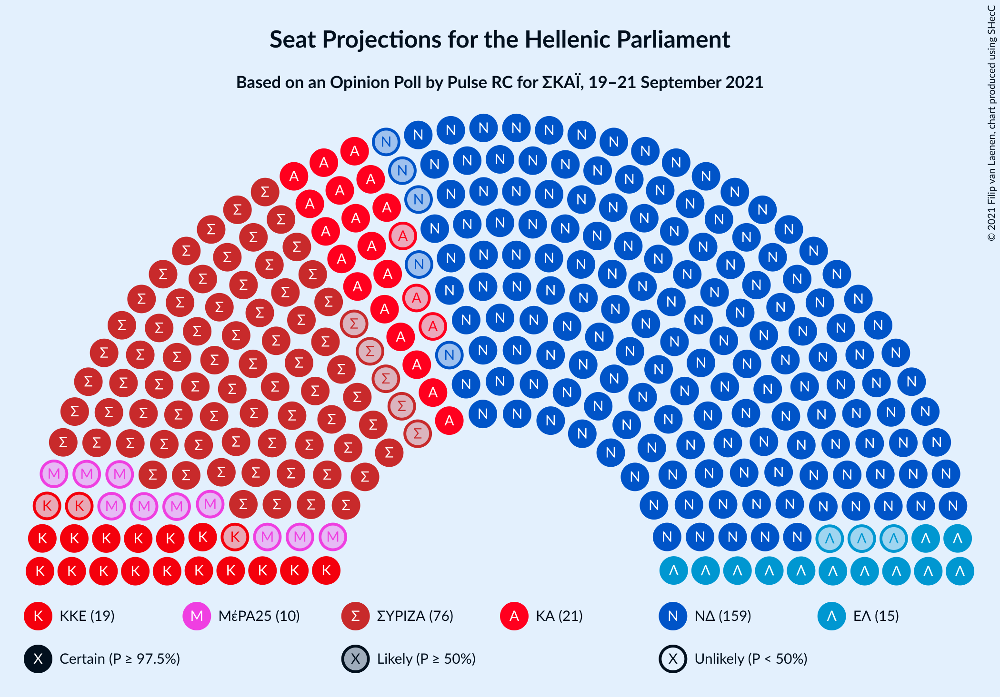
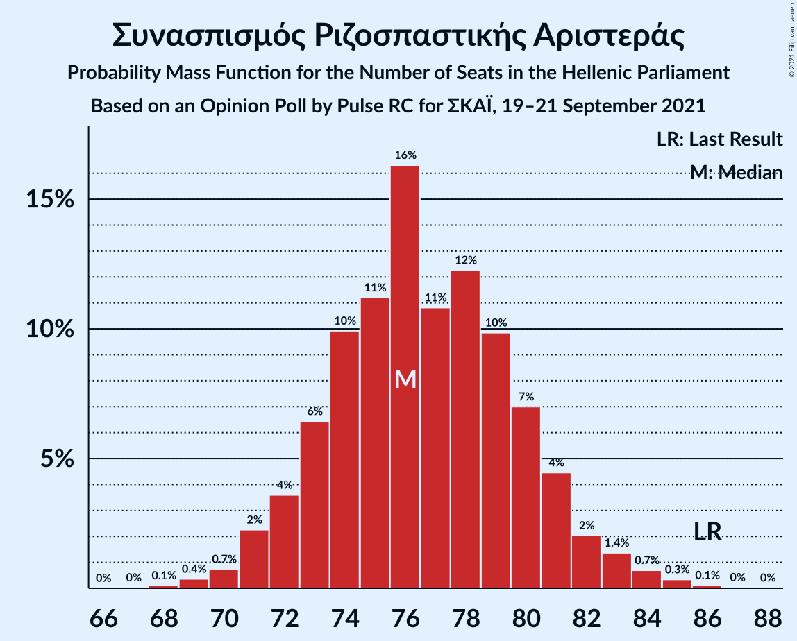

# Opinion Poll by Pulse RC for ΣΚΑΪ, 19–21 September 2021

<a href="#voting-intentions">Voting Intentions</a> | <a href="#seats">Seats</a> | <a href="#coalitions">Coalitions</a> | <a href="#technical-information">Technical Information</a>

## Voting Intentions

### Confidence Intervals

| Party | Last Result | Poll Result | 80% Confidence Interval | 90% Confidence Interval | 95% Confidence Interval | 99% Confidence Interval |
|:-----:|:-----------:|:-----------:|:-----------------------:|:-----------------------:|:-----------------------:|:-----------------------:|
| Νέα Δημοκρατία | 39.8% | 39.7% | 38.3–41.1% |37.9–41.5% |37.6–41.9% |36.9–42.5% |
| Συνασπισμός Ριζοσπαστικής Αριστεράς | 31.5% | 27.6% | 26.4–28.9% |26.0–29.3% |25.7–29.6% |25.1–30.2% |
| Κίνημα Αλλαγής | 8.1% | 7.5% | 6.8–8.3% |6.6–8.5% |6.4–8.7% |6.1–9.1% |
| Κομμουνιστικό Κόμμα Ελλάδας | 5.3% | 6.9% | 6.2–7.7% |6.0–7.9% |5.9–8.1% |5.5–8.5% |
| Ελληνική Λύση | 3.7% | 5.2% | 4.6–5.9% |4.5–6.1% |4.3–6.3% |4.0–6.6% |
| Μέτωπο Ευρωπαϊκής Ρεαλιστικής Ανυπακοής | 3.4% | 3.4% | 2.9–4.0% |2.8–4.2% |2.7–4.3% |2.5–4.6% |

*Note:* The poll result column reflects the actual value used in the calculations. Published results may vary slightly, and in addition be rounded to fewer digits.

## Seats

### Confidence Intervals

| Party | Last Result | Median | 80% Confidence Interval | 90% Confidence Interval | 95% Confidence Interval | 99% Confidence Interval |
|:-----:|:-----------:|:------:|:-----------------------:|:-----------------------:|:-----------------------:|:-----------------------:|
| <a href="#νέα-δημοκρατία">Νέα Δημοκρατία</a> | 158 | 160 | 157–163 |156–165 |155–168 |152–170 |
| <a href="#συνασπισμός-ριζοσπαστικής-αριστεράς">Συνασπισμός Ριζοσπαστικής Αριστεράς</a> | 86 | 76 | 73–80 |72–81 |71–83 |70–85 |
| <a href="#κίνημα-αλλαγής">Κίνημα Αλλαγής</a> | 22 | 21 | 19–23 |18–24 |18–24 |17–26 |
| <a href="#κομμουνιστικό-κόμμα-ελλάδας">Κομμουνιστικό Κόμμα Ελλάδας</a> | 15 | 19 | 17–21 |17–22 |16–23 |15–24 |
| <a href="#ελληνική-λύση">Ελληνική Λύση</a> | 10 | 15 | 13–16 |12–17 |12–17 |11–18 |
| <a href="#μέτωπο-ευρωπαϊκής-ρεαλιστικής-ανυπακοής">Μέτωπο Ευρωπαϊκής Ρεαλιστικής Ανυπακοής</a> | 9 | 9 | 8–11 |0–12 |0–12 |0–13 |

### Νέα Δημοκρατία

*For a full overview of the results for this party, see the [Νέα Δημοκρατία](party-νέαδημοκρατία.html) page.*

| Number of Seats | Probability | Accumulated | Special Marks |
|:---------------:|:-----------:|:-----------:|:-------------:|
| 150 | 0% | 100% |  |
| 151 | 0.2% | 99.9% | Majority |
| 152 | 0.4% | 99.8% |  |
| 153 | 0.7% | 99.4% |  |
| 154 | 1.0% | 98.6% |  |
| 155 | 2% | 98% |  |
| 156 | 3% | 95% |  |
| 157 | 8% | 92% |  |
| 158 | 11% | 84% | Last Result |
| 159 | 16% | 73% |  |
| 160 | 21% | 57% | Median |
| 161 | 14% | 36% |  |
| 162 | 7% | 22% |  |
| 163 | 6% | 15% |  |
| 164 | 3% | 9% |  |
| 165 | 1.3% | 6% |  |
| 166 | 0.6% | 4% |  |
| 167 | 1.0% | 4% |  |
| 168 | 1.0% | 3% |  |
| 169 | 0.9% | 2% |  |
| 170 | 0.5% | 0.9% |  |
| 171 | 0.3% | 0.4% |  |
| 172 | 0.1% | 0.1% |  |
| 173 | 0% | 0% |  |

### Συνασπισμός Ριζοσπαστικής Αριστεράς

*For a full overview of the results for this party, see the [Συνασπισμός Ριζοσπαστικής Αριστεράς](party-συνασπισμόςριζοσπαστικήςαριστεράς.html) page.*

| Number of Seats | Probability | Accumulated | Special Marks |
|:---------------:|:-----------:|:-----------:|:-------------:|
| 68 | 0.2% | 100% |  |
| 69 | 0.3% | 99.8% |  |
| 70 | 1.0% | 99.6% |  |
| 71 | 2% | 98.6% |  |
| 72 | 3% | 96% |  |
| 73 | 7% | 93% |  |
| 74 | 11% | 86% |  |
| 75 | 15% | 75% |  |
| 76 | 14% | 61% | Median |
| 77 | 12% | 47% |  |
| 78 | 9% | 34% |  |
| 79 | 7% | 25% |  |
| 80 | 10% | 19% |  |
| 81 | 4% | 8% |  |
| 82 | 1.4% | 4% |  |
| 83 | 1.3% | 3% |  |
| 84 | 0.9% | 2% |  |
| 85 | 0.5% | 0.7% |  |
| 86 | 0.1% | 0.1% | Last Result |
| 87 | 0% | 0.1% |  |
| 88 | 0.1% | 0.1% |  |
| 89 | 0% | 0% |  |

### Κίνημα Αλλαγής

*For a full overview of the results for this party, see the [Κίνημα Αλλαγής](party-κίνημααλλαγής.html) page.*

| Number of Seats | Probability | Accumulated | Special Marks |
|:---------------:|:-----------:|:-----------:|:-------------:|
| 16 | 0.2% | 100% |  |
| 17 | 1.2% | 99.8% |  |
| 18 | 5% | 98.6% |  |
| 19 | 14% | 93% |  |
| 20 | 19% | 79% |  |
| 21 | 26% | 60% | Median |
| 22 | 19% | 34% | Last Result |
| 23 | 9% | 15% |  |
| 24 | 4% | 6% |  |
| 25 | 2% | 2% |  |
| 26 | 0.5% | 0.6% |  |
| 27 | 0.1% | 0.1% |  |
| 28 | 0% | 0% |  |

### Κομμουνιστικό Κόμμα Ελλάδας

*For a full overview of the results for this party, see the [Κομμουνιστικό Κόμμα Ελλάδας](party-κομμουνιστικόκόμμαελλάδας.html) page.*

| Number of Seats | Probability | Accumulated | Special Marks |
|:---------------:|:-----------:|:-----------:|:-------------:|
| 14 | 0.1% | 100% |  |
| 15 | 0.7% | 99.9% | Last Result |
| 16 | 3% | 99.2% |  |
| 17 | 10% | 96% |  |
| 18 | 17% | 86% |  |
| 19 | 27% | 69% | Median |
| 20 | 19% | 42% |  |
| 21 | 15% | 23% |  |
| 22 | 5% | 8% |  |
| 23 | 2% | 3% |  |
| 24 | 0.6% | 0.7% |  |
| 25 | 0.1% | 0.1% |  |
| 26 | 0% | 0% |  |

### Ελληνική Λύση

*For a full overview of the results for this party, see the [Ελληνική Λύση](party-ελληνικήλύση.html) page.*

| Number of Seats | Probability | Accumulated | Special Marks |
|:---------------:|:-----------:|:-----------:|:-------------:|
| 10 | 0.1% | 100% | Last Result |
| 11 | 0.9% | 99.9% |  |
| 12 | 5% | 99.0% |  |
| 13 | 15% | 94% |  |
| 14 | 26% | 79% |  |
| 15 | 28% | 53% | Median |
| 16 | 17% | 25% |  |
| 17 | 7% | 9% |  |
| 18 | 1.4% | 2% |  |
| 19 | 0.3% | 0.3% |  |
| 20 | 0% | 0.1% |  |
| 21 | 0% | 0% |  |

### Μέτωπο Ευρωπαϊκής Ρεαλιστικής Ανυπακοής

*For a full overview of the results for this party, see the [Μέτωπο Ευρωπαϊκής Ρεαλιστικής Ανυπακοής](party-μέτωποευρωπαϊκήςρεαλιστικήςανυπακοής.html) page.*

| Number of Seats | Probability | Accumulated | Special Marks |
|:---------------:|:-----------:|:-----------:|:-------------:|
| 0 | 10% | 100% |  |
| 1 | 0% | 90% |  |
| 2 | 0% | 90% |  |
| 3 | 0% | 90% |  |
| 4 | 0% | 90% |  |
| 5 | 0% | 90% |  |
| 6 | 0% | 90% |  |
| 7 | 0% | 90% |  |
| 8 | 4% | 90% |  |
| 9 | 39% | 86% | Last Result, Median |
| 10 | 33% | 47% |  |
| 11 | 9% | 14% |  |
| 12 | 4% | 5% |  |
| 13 | 0.9% | 1.0% |  |
| 14 | 0.1% | 0.1% |  |
| 15 | 0% | 0% |  |

## Coalitions

### Confidence Intervals

| Coalition | Last Result | Median | Majority? | 80% Confidence Interval | 90% Confidence Interval | 95% Confidence Interval | 99% Confidence Interval |
|:---------:|:-----------:|:------:|:---------:|:-----------------------:|:-----------------------:|:-----------------------:|:-----------------------:|
| Νέα Δημοκρατία – Κίνημα Αλλαγής | 180 | 181 | 100% | 177–185 | 176–187 | 175–188 | 173–191 |
| Νέα Δημοκρατία | 158 | 160 | 99.9% | 157–163 | 156–165 | 155–168 | 152–170 |
| Συνασπισμός Ριζοσπαστικής Αριστεράς – Μέτωπο Ευρωπαϊκής Ρεαλιστικής Ανυπακοής | 95 | 85 | 0% | 81–89 | 80–90 | 78–91 | 75–93 |
| Συνασπισμός Ριζοσπαστικής Αριστεράς | 86 | 76 | 0% | 73–80 | 72–81 | 71–83 | 70–85 |

### Νέα Δημοκρατία – Κίνημα Αλλαγής

| Number of Seats | Probability | Accumulated | Special Marks |
|:---------------:|:-----------:|:-----------:|:-------------:|
| 171 | 0.1% | 100% |  |
| 172 | 0.1% | 99.9% |  |
| 173 | 0.4% | 99.8% |  |
| 174 | 1.0% | 99.4% |  |
| 175 | 2% | 98% |  |
| 176 | 4% | 97% |  |
| 177 | 6% | 93% |  |
| 178 | 5% | 86% |  |
| 179 | 13% | 81% |  |
| 180 | 17% | 68% | Last Result |
| 181 | 11% | 51% | Median |
| 182 | 15% | 40% |  |
| 183 | 8% | 25% |  |
| 184 | 5% | 16% |  |
| 185 | 4% | 11% |  |
| 186 | 2% | 8% |  |
| 187 | 2% | 5% |  |
| 188 | 2% | 4% |  |
| 189 | 0.6% | 2% |  |
| 190 | 0.7% | 1.4% |  |
| 191 | 0.4% | 0.7% |  |
| 192 | 0.3% | 0.4% |  |
| 193 | 0% | 0.1% |  |
| 194 | 0% | 0% |  |

### Νέα Δημοκρατία

| Number of Seats | Probability | Accumulated | Special Marks |
|:---------------:|:-----------:|:-----------:|:-------------:|
| 150 | 0% | 100% |  |
| 151 | 0.2% | 99.9% | Majority |
| 152 | 0.4% | 99.8% |  |
| 153 | 0.7% | 99.4% |  |
| 154 | 1.0% | 98.6% |  |
| 155 | 2% | 98% |  |
| 156 | 3% | 95% |  |
| 157 | 8% | 92% |  |
| 158 | 11% | 84% | Last Result |
| 159 | 16% | 73% |  |
| 160 | 21% | 57% | Median |
| 161 | 14% | 36% |  |
| 162 | 7% | 22% |  |
| 163 | 6% | 15% |  |
| 164 | 3% | 9% |  |
| 165 | 1.3% | 6% |  |
| 166 | 0.6% | 4% |  |
| 167 | 1.0% | 4% |  |
| 168 | 1.0% | 3% |  |
| 169 | 0.9% | 2% |  |
| 170 | 0.5% | 0.9% |  |
| 171 | 0.3% | 0.4% |  |
| 172 | 0.1% | 0.1% |  |
| 173 | 0% | 0% |  |

### Συνασπισμός Ριζοσπαστικής Αριστεράς – Μέτωπο Ευρωπαϊκής Ρεαλιστικής Ανυπακοής

| Number of Seats | Probability | Accumulated | Special Marks |
|:---------------:|:-----------:|:-----------:|:-------------:|
| 72 | 0.1% | 100% |  |
| 73 | 0.1% | 99.9% |  |
| 74 | 0.1% | 99.8% |  |
| 75 | 0.5% | 99.7% |  |
| 76 | 0.8% | 99.2% |  |
| 77 | 0.8% | 98% |  |
| 78 | 0.9% | 98% |  |
| 79 | 1.4% | 97% |  |
| 80 | 3% | 95% |  |
| 81 | 5% | 92% |  |
| 82 | 5% | 88% |  |
| 83 | 4% | 83% |  |
| 84 | 17% | 78% |  |
| 85 | 15% | 61% | Median |
| 86 | 12% | 46% |  |
| 87 | 8% | 34% |  |
| 88 | 9% | 26% |  |
| 89 | 10% | 17% |  |
| 90 | 3% | 7% |  |
| 91 | 2% | 4% |  |
| 92 | 1.4% | 2% |  |
| 93 | 0.5% | 0.8% |  |
| 94 | 0.2% | 0.3% |  |
| 95 | 0.1% | 0.1% | Last Result |
| 96 | 0% | 0% |  |

### Συνασπισμός Ριζοσπαστικής Αριστεράς

| Number of Seats | Probability | Accumulated | Special Marks |
|:---------------:|:-----------:|:-----------:|:-------------:|
| 68 | 0.2% | 100% |  |
| 69 | 0.3% | 99.8% |  |
| 70 | 1.0% | 99.6% |  |
| 71 | 2% | 98.6% |  |
| 72 | 3% | 96% |  |
| 73 | 7% | 93% |  |
| 74 | 11% | 86% |  |
| 75 | 15% | 75% |  |
| 76 | 14% | 61% | Median |
| 77 | 12% | 47% |  |
| 78 | 9% | 34% |  |
| 79 | 7% | 25% |  |
| 80 | 10% | 19% |  |
| 81 | 4% | 8% |  |
| 82 | 1.4% | 4% |  |
| 83 | 1.3% | 3% |  |
| 84 | 0.9% | 2% |  |
| 85 | 0.5% | 0.7% |  |
| 86 | 0.1% | 0.1% | Last Result |
| 87 | 0% | 0.1% |  |
| 88 | 0.1% | 0.1% |  |
| 89 | 0% | 0% |  |

## Technical Information

### Opinion Poll

+ **Polling firm:** Pulse RC
+ **Commissioner(s):** ΣΚΑΪ
+ **Fieldwork period:** 19–21 September 2021

### Calculations

+ **Sample size:** 2018
+ **Simulations done:** 131,072
+ **Error estimate:** 0.50%

