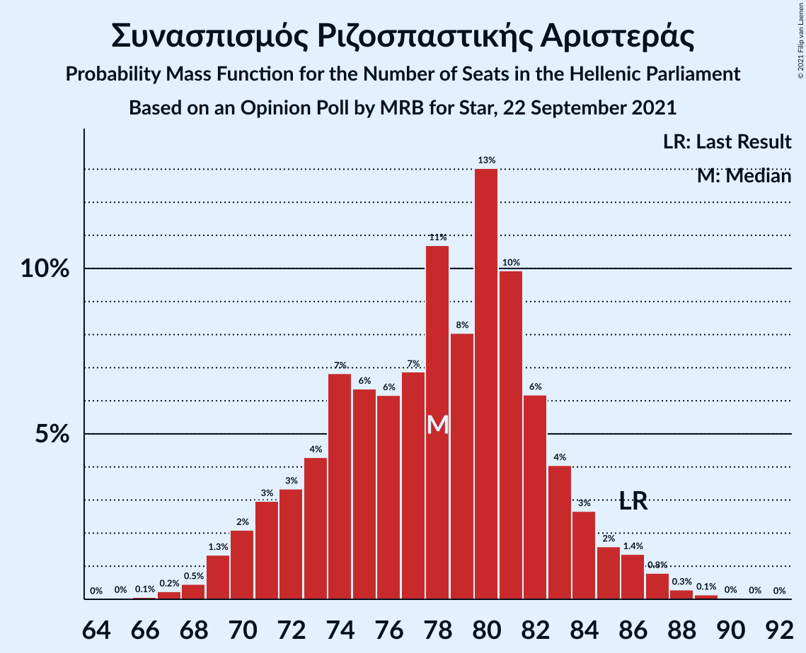
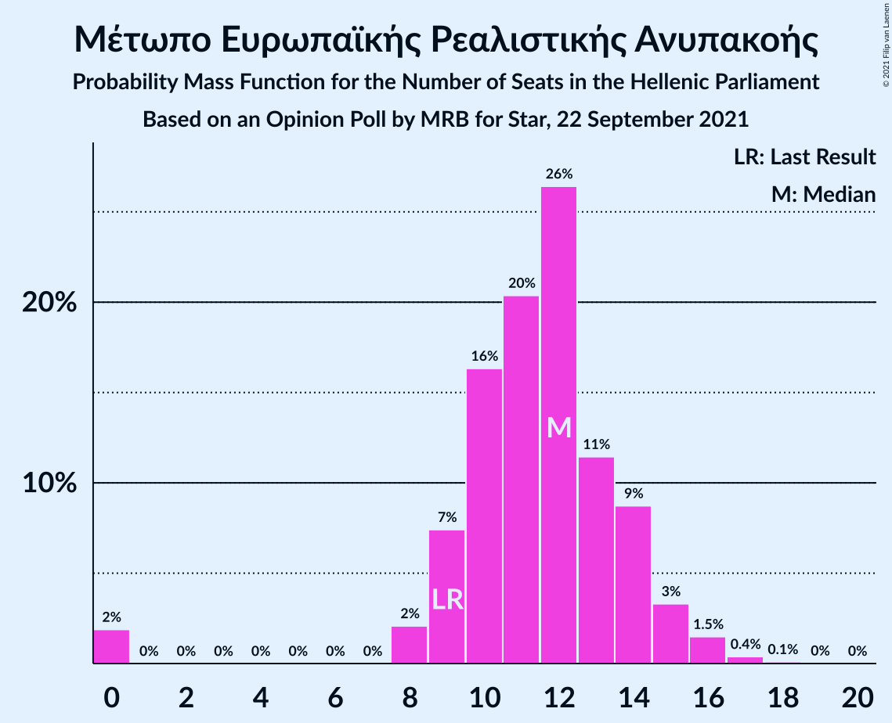
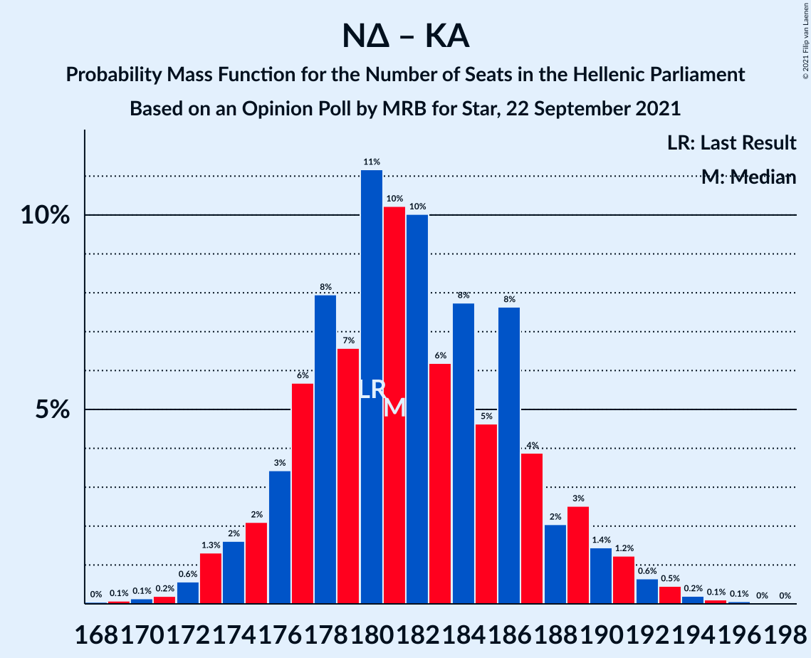
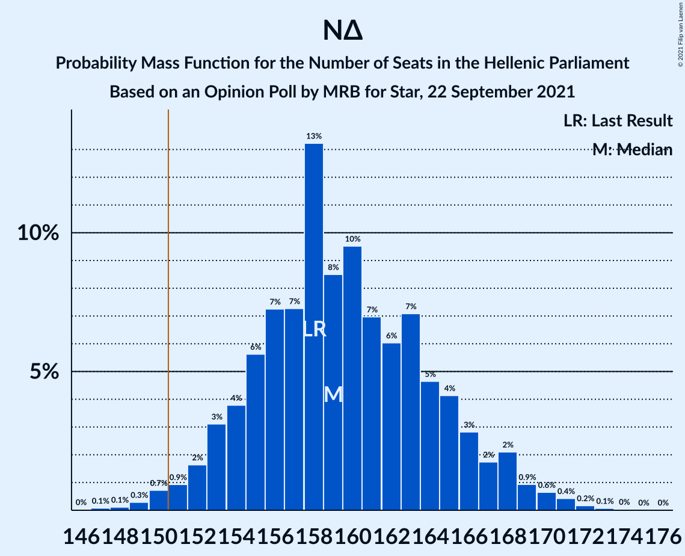
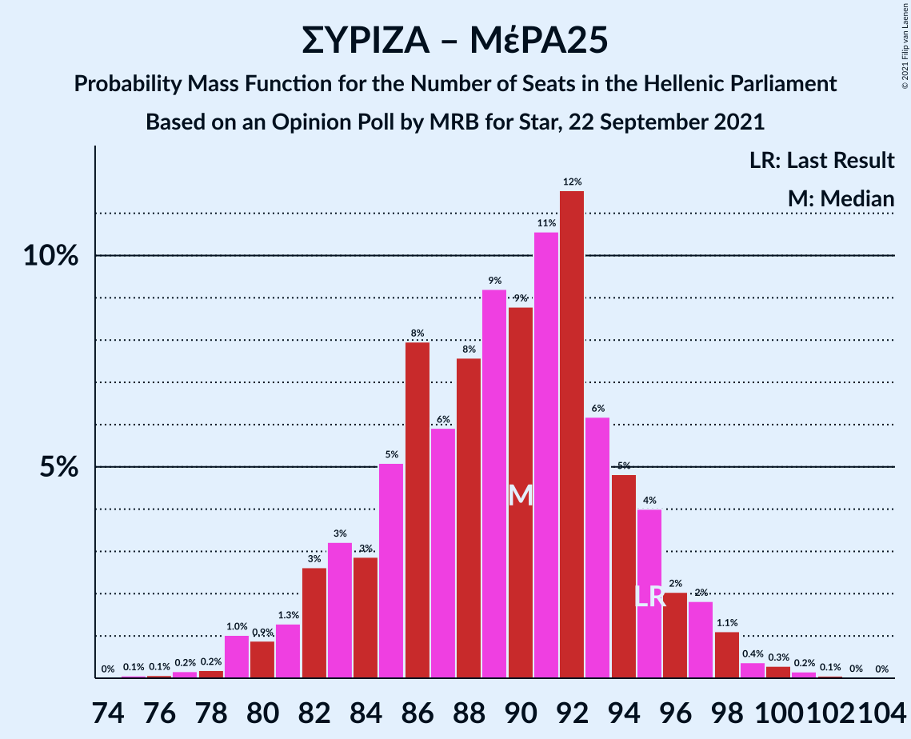
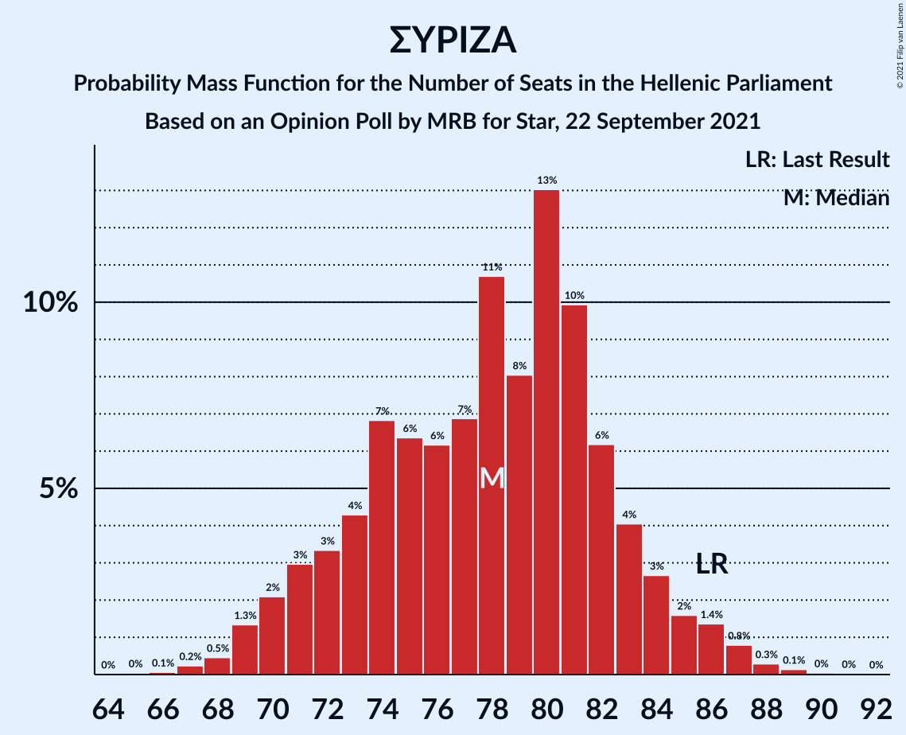

# Opinion Poll by MRB for Star, 22 September 2021

<a href="#voting-intentions">Voting Intentions</a> | <a href="#seats">Seats</a> | <a href="#coalitions">Coalitions</a> | <a href="#technical-information">Technical Information</a>

## Voting Intentions

### Confidence Intervals

| Party | Last Result | Poll Result | 80% Confidence Interval | 90% Confidence Interval | 95% Confidence Interval | 99% Confidence Interval |
|:-----:|:-----------:|:-----------:|:-----------------------:|:-----------------------:|:-----------------------:|:-----------------------:|
| Νέα Δημοκρατία | 39.8% | 40.6% | 38.6–42.6% |38.1–43.2% |37.6–43.7% |36.7–44.7% |
| Συνασπισμός Ριζοσπαστικής Αριστεράς | 31.5% | 28.6% | 26.8–30.5% |26.3–31.0% |25.9–31.5% |25.0–32.4% |
| Κίνημα Αλλαγής | 8.1% | 8.1% | 7.1–9.3% |6.8–9.7% |6.6–10.0% |6.1–10.6% |
| Κομμουνιστικό Κόμμα Ελλάδας | 5.3% | 5.9% | 5.0–7.0% |4.8–7.3% |4.6–7.5% |4.2–8.1% |
| Ελληνική Λύση | 3.7% | 4.6% | 3.9–5.6% |3.6–5.9% |3.5–6.1% |3.1–6.6% |
| Μέτωπο Ευρωπαϊκής Ρεαλιστικής Ανυπακοής | 3.4% | 4.2% | 3.5–5.1% |3.3–5.4% |3.1–5.6% |2.8–6.1% |
| Πλεύση Ελευθερίας | 1.5% | 1.3% | 0.9–1.9% |0.8–2.1% |0.8–2.2% |0.6–2.5% |
| Χρυσή Αυγή | 2.9% | 1.2% | 0.9–1.8% |0.8–1.9% |0.7–2.1% |0.5–2.4% |

*Note:* The poll result column reflects the actual value used in the calculations. Published results may vary slightly, and in addition be rounded to fewer digits.

## Seats

### Confidence Intervals

| Party | Last Result | Median | 80% Confidence Interval | 90% Confidence Interval | 95% Confidence Interval | 99% Confidence Interval |
|:-----:|:-----------:|:------:|:-----------------------:|:-----------------------:|:-----------------------:|:-----------------------:|
| <a href="#νέα-δημοκρατία">Νέα Δημοκρατία</a> | 158 | 160 | 154–166 |153–168 |151–168 |149–171 |
| <a href="#συνασπισμός-ριζοσπαστικής-αριστεράς">Συνασπισμός Ριζοσπαστικής Αριστεράς</a> | 86 | 76 | 73–84 |71–86 |70–87 |68–88 |
| <a href="#κίνημα-αλλαγής">Κίνημα Αλλαγής</a> | 22 | 22 | 19–26 |19–26 |18–27 |16–28 |
| <a href="#κομμουνιστικό-κόμμα-ελλάδας">Κομμουνιστικό Κόμμα Ελλάδας</a> | 15 | 17 | 14–19 |13–19 |12–21 |11–22 |
| <a href="#ελληνική-λύση">Ελληνική Λύση</a> | 10 | 13 | 10–15 |10–16 |10–17 |9–18 |
| <a href="#μέτωπο-ευρωπαϊκής-ρεαλιστικής-ανυπακοής">Μέτωπο Ευρωπαϊκής Ρεαλιστικής Ανυπακοής</a> | 9 | 12 | 10–14 |9–15 |9–15 |0–17 |
| <a href="#πλεύση-ελευθερίας">Πλεύση Ελευθερίας</a> | 0 | 0 | 0 |0 |0 |0 |
| <a href="#χρυσή-αυγή">Χρυσή Αυγή</a> | 0 | 0 | 0 |0 |0 |0 |

### Νέα Δημοκρατία

*For a full overview of the results for this party, see the [Νέα Δημοκρατία](party-νέαδημοκρατία.html) page.*

| Number of Seats | Probability | Accumulated | Special Marks |
|:---------------:|:-----------:|:-----------:|:-------------:|
| 147 | 0.2% | 100% |  |
| 148 | 0.1% | 99.8% |  |
| 149 | 0.4% | 99.7% |  |
| 150 | 0.1% | 99.3% |  |
| 151 | 2% | 99.2% | Majority |
| 152 | 1.4% | 97% |  |
| 153 | 3% | 96% |  |
| 154 | 5% | 92% |  |
| 155 | 4% | 87% |  |
| 156 | 9% | 83% |  |
| 157 | 4% | 74% |  |
| 158 | 3% | 69% | Last Result |
| 159 | 12% | 66% |  |
| 160 | 10% | 54% | Median |
| 161 | 11% | 44% |  |
| 162 | 6% | 33% |  |
| 163 | 14% | 27% |  |
| 164 | 2% | 13% |  |
| 165 | 0.7% | 11% |  |
| 166 | 1.1% | 10% |  |
| 167 | 3% | 9% |  |
| 168 | 5% | 6% |  |
| 169 | 0.3% | 2% |  |
| 170 | 0.6% | 1.3% |  |
| 171 | 0.5% | 0.7% |  |
| 172 | 0.1% | 0.2% |  |
| 173 | 0% | 0.1% |  |
| 174 | 0% | 0% |  |

### Συνασπισμός Ριζοσπαστικής Αριστεράς

*For a full overview of the results for this party, see the [Συνασπισμός Ριζοσπαστικής Αριστεράς](party-συνασπισμόςριζοσπαστικήςαριστεράς.html) page.*

| Number of Seats | Probability | Accumulated | Special Marks |
|:---------------:|:-----------:|:-----------:|:-------------:|
| 65 | 0% | 100% |  |
| 66 | 0.1% | 99.9% |  |
| 67 | 0.2% | 99.9% |  |
| 68 | 0.4% | 99.7% |  |
| 69 | 1.3% | 99.3% |  |
| 70 | 2% | 98% |  |
| 71 | 2% | 96% |  |
| 72 | 2% | 94% |  |
| 73 | 5% | 92% |  |
| 74 | 20% | 87% |  |
| 75 | 12% | 67% |  |
| 76 | 12% | 55% | Median |
| 77 | 6% | 43% |  |
| 78 | 10% | 37% |  |
| 79 | 6% | 27% |  |
| 80 | 2% | 21% |  |
| 81 | 3% | 19% |  |
| 82 | 3% | 16% |  |
| 83 | 2% | 13% |  |
| 84 | 4% | 11% |  |
| 85 | 2% | 7% |  |
| 86 | 2% | 5% | Last Result |
| 87 | 2% | 3% |  |
| 88 | 0.5% | 0.8% |  |
| 89 | 0.3% | 0.4% |  |
| 90 | 0% | 0.1% |  |
| 91 | 0% | 0% |  |

### Κίνημα Αλλαγής

*For a full overview of the results for this party, see the [Κίνημα Αλλαγής](party-κίνημααλλαγής.html) page.*

| Number of Seats | Probability | Accumulated | Special Marks |
|:---------------:|:-----------:|:-----------:|:-------------:|
| 15 | 0.1% | 100% |  |
| 16 | 0.4% | 99.9% |  |
| 17 | 2% | 99.5% |  |
| 18 | 2% | 98% |  |
| 19 | 8% | 96% |  |
| 20 | 13% | 88% |  |
| 21 | 22% | 75% |  |
| 22 | 18% | 54% | Last Result, Median |
| 23 | 6% | 36% |  |
| 24 | 11% | 30% |  |
| 25 | 9% | 19% |  |
| 26 | 6% | 10% |  |
| 27 | 2% | 4% |  |
| 28 | 1.2% | 2% |  |
| 29 | 0.2% | 0.3% |  |
| 30 | 0% | 0.1% |  |
| 31 | 0% | 0.1% |  |
| 32 | 0% | 0% |  |

### Κομμουνιστικό Κόμμα Ελλάδας

*For a full overview of the results for this party, see the [Κομμουνιστικό Κόμμα Ελλάδας](party-κομμουνιστικόκόμμαελλάδας.html) page.*

| Number of Seats | Probability | Accumulated | Special Marks |
|:---------------:|:-----------:|:-----------:|:-------------:|
| 10 | 0.1% | 100% |  |
| 11 | 0.5% | 99.9% |  |
| 12 | 3% | 99.5% |  |
| 13 | 3% | 96% |  |
| 14 | 13% | 93% |  |
| 15 | 20% | 80% | Last Result |
| 16 | 9% | 60% |  |
| 17 | 25% | 51% | Median |
| 18 | 6% | 26% |  |
| 19 | 15% | 20% |  |
| 20 | 2% | 5% |  |
| 21 | 1.0% | 3% |  |
| 22 | 1.4% | 2% |  |
| 23 | 0.1% | 0.2% |  |
| 24 | 0.1% | 0.1% |  |
| 25 | 0% | 0% |  |

### Ελληνική Λύση

*For a full overview of the results for this party, see the [Ελληνική Λύση](party-ελληνικήλύση.html) page.*

| Number of Seats | Probability | Accumulated | Special Marks |
|:---------------:|:-----------:|:-----------:|:-------------:|
| 0 | 0.2% | 100% |  |
| 1 | 0% | 99.8% |  |
| 2 | 0% | 99.8% |  |
| 3 | 0% | 99.8% |  |
| 4 | 0% | 99.8% |  |
| 5 | 0% | 99.8% |  |
| 6 | 0% | 99.8% |  |
| 7 | 0% | 99.8% |  |
| 8 | 0.1% | 99.8% |  |
| 9 | 0.6% | 99.7% |  |
| 10 | 12% | 99.1% | Last Result |
| 11 | 7% | 87% |  |
| 12 | 11% | 81% |  |
| 13 | 27% | 70% | Median |
| 14 | 27% | 42% |  |
| 15 | 7% | 15% |  |
| 16 | 4% | 9% |  |
| 17 | 4% | 4% |  |
| 18 | 0.5% | 0.7% |  |
| 19 | 0.2% | 0.2% |  |
| 20 | 0.1% | 0.1% |  |
| 21 | 0% | 0% |  |

### Μέτωπο Ευρωπαϊκής Ρεαλιστικής Ανυπακοής

*For a full overview of the results for this party, see the [Μέτωπο Ευρωπαϊκής Ρεαλιστικής Ανυπακοής](party-μέτωποευρωπαϊκήςρεαλιστικήςανυπακοής.html) page.*

| Number of Seats | Probability | Accumulated | Special Marks |
|:---------------:|:-----------:|:-----------:|:-------------:|
| 0 | 1.4% | 100% |  |
| 1 | 0% | 98.6% |  |
| 2 | 0% | 98.6% |  |
| 3 | 0% | 98.6% |  |
| 4 | 0% | 98.6% |  |
| 5 | 0% | 98.6% |  |
| 6 | 0% | 98.6% |  |
| 7 | 0% | 98.6% |  |
| 8 | 0.1% | 98.6% |  |
| 9 | 6% | 98% | Last Result |
| 10 | 15% | 93% |  |
| 11 | 10% | 77% |  |
| 12 | 36% | 67% | Median |
| 13 | 13% | 31% |  |
| 14 | 11% | 18% |  |
| 15 | 6% | 7% |  |
| 16 | 0.7% | 1.3% |  |
| 17 | 0.4% | 0.6% |  |
| 18 | 0.2% | 0.2% |  |
| 19 | 0% | 0% |  |

### Πλεύση Ελευθερίας

*For a full overview of the results for this party, see the [Πλεύση Ελευθερίας](party-πλεύσηελευθερίας.html) page.*

| Number of Seats | Probability | Accumulated | Special Marks |
|:---------------:|:-----------:|:-----------:|:-------------:|
| 0 | 100% | 100% | Last Result, Median |

### Χρυσή Αυγή

*For a full overview of the results for this party, see the [Χρυσή Αυγή](party-χρυσήαυγή.html) page.*

| Number of Seats | Probability | Accumulated | Special Marks |
|:---------------:|:-----------:|:-----------:|:-------------:|
| 0 | 100% | 100% | Last Result, Median |

## Coalitions

### Confidence Intervals

| Coalition | Last Result | Median | Majority? | 80% Confidence Interval | 90% Confidence Interval | 95% Confidence Interval | 99% Confidence Interval |
|:---------:|:-----------:|:------:|:---------:|:-----------------------:|:-----------------------:|:-----------------------:|:-----------------------:|
| Νέα Δημοκρατία – Κίνημα Αλλαγής | 180 | 182 | 100% | 176–187 | 174–188 | 173–190 | 172–193 |
| Νέα Δημοκρατία | 158 | 160 | 99.2% | 154–166 | 153–168 | 151–168 | 149–171 |
| Συνασπισμός Ριζοσπαστικής Αριστεράς – Μέτωπο Ευρωπαϊκής Ρεαλιστικής Ανυπακοής | 95 | 89 | 0% | 85–95 | 83–97 | 80–98 | 79–99 |
| Συνασπισμός Ριζοσπαστικής Αριστεράς | 86 | 76 | 0% | 73–84 | 71–86 | 70–87 | 68–88 |

### Νέα Δημοκρατία – Κίνημα Αλλαγής

| Number of Seats | Probability | Accumulated | Special Marks |
|:---------------:|:-----------:|:-----------:|:-------------:|
| 168 | 0% | 100% |  |
| 169 | 0.1% | 99.9% |  |
| 170 | 0% | 99.8% |  |
| 171 | 0.1% | 99.8% |  |
| 172 | 0.4% | 99.7% |  |
| 173 | 2% | 99.3% |  |
| 174 | 3% | 97% |  |
| 175 | 3% | 94% |  |
| 176 | 2% | 91% |  |
| 177 | 3% | 89% |  |
| 178 | 5% | 86% |  |
| 179 | 5% | 81% |  |
| 180 | 7% | 76% | Last Result |
| 181 | 15% | 70% |  |
| 182 | 17% | 55% | Median |
| 183 | 5% | 38% |  |
| 184 | 9% | 33% |  |
| 185 | 6% | 24% |  |
| 186 | 2% | 18% |  |
| 187 | 9% | 16% |  |
| 188 | 3% | 7% |  |
| 189 | 1.3% | 5% |  |
| 190 | 2% | 3% |  |
| 191 | 0.4% | 1.3% |  |
| 192 | 0.3% | 0.9% |  |
| 193 | 0.3% | 0.6% |  |
| 194 | 0.1% | 0.3% |  |
| 195 | 0.1% | 0.2% |  |
| 196 | 0.1% | 0.2% |  |
| 197 | 0% | 0% |  |

### Νέα Δημοκρατία

| Number of Seats | Probability | Accumulated | Special Marks |
|:---------------:|:-----------:|:-----------:|:-------------:|
| 147 | 0.2% | 100% |  |
| 148 | 0.1% | 99.8% |  |
| 149 | 0.4% | 99.7% |  |
| 150 | 0.1% | 99.3% |  |
| 151 | 2% | 99.2% | Majority |
| 152 | 1.4% | 97% |  |
| 153 | 3% | 96% |  |
| 154 | 5% | 92% |  |
| 155 | 4% | 87% |  |
| 156 | 9% | 83% |  |
| 157 | 4% | 74% |  |
| 158 | 3% | 69% | Last Result |
| 159 | 12% | 66% |  |
| 160 | 10% | 54% | Median |
| 161 | 11% | 44% |  |
| 162 | 6% | 33% |  |
| 163 | 14% | 27% |  |
| 164 | 2% | 13% |  |
| 165 | 0.7% | 11% |  |
| 166 | 1.1% | 10% |  |
| 167 | 3% | 9% |  |
| 168 | 5% | 6% |  |
| 169 | 0.3% | 2% |  |
| 170 | 0.6% | 1.3% |  |
| 171 | 0.5% | 0.7% |  |
| 172 | 0.1% | 0.2% |  |
| 173 | 0% | 0.1% |  |
| 174 | 0% | 0% |  |

### Συνασπισμός Ριζοσπαστικής Αριστεράς – Μέτωπο Ευρωπαϊκής Ρεαλιστικής Ανυπακοής

| Number of Seats | Probability | Accumulated | Special Marks |
|:---------------:|:-----------:|:-----------:|:-------------:|
| 75 | 0.1% | 100% |  |
| 76 | 0.1% | 99.9% |  |
| 77 | 0.1% | 99.8% |  |
| 78 | 0.2% | 99.7% |  |
| 79 | 0.4% | 99.5% |  |
| 80 | 2% | 99.1% |  |
| 81 | 0.3% | 97% |  |
| 82 | 2% | 97% |  |
| 83 | 4% | 95% |  |
| 84 | 1.2% | 91% |  |
| 85 | 2% | 90% |  |
| 86 | 22% | 88% |  |
| 87 | 10% | 66% |  |
| 88 | 5% | 56% | Median |
| 89 | 14% | 52% |  |
| 90 | 14% | 38% |  |
| 91 | 3% | 23% |  |
| 92 | 3% | 20% |  |
| 93 | 3% | 17% |  |
| 94 | 3% | 13% |  |
| 95 | 1.0% | 10% | Last Result |
| 96 | 2% | 9% |  |
| 97 | 3% | 7% |  |
| 98 | 3% | 4% |  |
| 99 | 0.3% | 0.7% |  |
| 100 | 0.2% | 0.4% |  |
| 101 | 0.1% | 0.2% |  |
| 102 | 0% | 0% |  |

### Συνασπισμός Ριζοσπαστικής Αριστεράς

| Number of Seats | Probability | Accumulated | Special Marks |
|:---------------:|:-----------:|:-----------:|:-------------:|
| 65 | 0% | 100% |  |
| 66 | 0.1% | 99.9% |  |
| 67 | 0.2% | 99.9% |  |
| 68 | 0.4% | 99.7% |  |
| 69 | 1.3% | 99.3% |  |
| 70 | 2% | 98% |  |
| 71 | 2% | 96% |  |
| 72 | 2% | 94% |  |
| 73 | 5% | 92% |  |
| 74 | 20% | 87% |  |
| 75 | 12% | 67% |  |
| 76 | 12% | 55% | Median |
| 77 | 6% | 43% |  |
| 78 | 10% | 37% |  |
| 79 | 6% | 27% |  |
| 80 | 2% | 21% |  |
| 81 | 3% | 19% |  |
| 82 | 3% | 16% |  |
| 83 | 2% | 13% |  |
| 84 | 4% | 11% |  |
| 85 | 2% | 7% |  |
| 86 | 2% | 5% | Last Result |
| 87 | 2% | 3% |  |
| 88 | 0.5% | 0.8% |  |
| 89 | 0.3% | 0.4% |  |
| 90 | 0% | 0.1% |  |
| 91 | 0% | 0% |  |

## Technical Information

### Opinion Poll

+ **Polling firm:** MRB
+ **Commissioner(s):** Star
+ **Fieldwork period:** 22 September 2021

### Calculations

+ **Sample size:** 1000
+ **Simulations done:** 131,072
+ **Error estimate:** 1.48%

