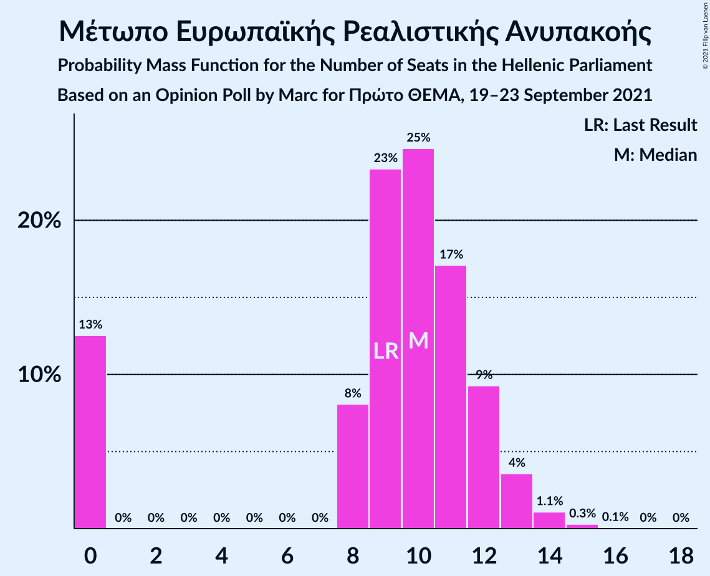

# Opinion Poll by Marc for Πρώτο ΘΕΜΑ, 19–23 September 2021

<a href="#voting-intentions">Voting Intentions</a> | <a href="#seats">Seats</a> | <a href="#coalitions">Coalitions</a> | <a href="#technical-information">Technical Information</a>

## Voting Intentions

### Confidence Intervals

| Party | Last Result | Poll Result | 80% Confidence Interval | 90% Confidence Interval | 95% Confidence Interval | 99% Confidence Interval |
|:-----:|:-----------:|:-----------:|:-----------------------:|:-----------------------:|:-----------------------:|:-----------------------:|
| Νέα Δημοκρατία | 39.8% | 42.2% | 40.2–44.2% |39.7–44.7% |39.2–45.2% |38.3–46.2% |
| Συνασπισμός Ριζοσπαστικής Αριστεράς | 31.5% | 28.2% | 26.4–30.0% |25.9–30.6% |25.5–31.0% |24.7–31.9% |
| Κίνημα Αλλαγής | 8.1% | 7.4% | 6.4–8.5% |6.2–8.9% |5.9–9.2% |5.5–9.7% |
| Κομμουνιστικό Κόμμα Ελλάδας | 5.3% | 6.6% | 5.7–7.7% |5.5–8.0% |5.2–8.3% |4.8–8.9% |
| Ελληνική Λύση | 3.7% | 5.5% | 4.7–6.6% |4.5–6.9% |4.3–7.1% |3.9–7.6% |
| Μέτωπο Ευρωπαϊκής Ρεαλιστικής Ανυπακοής | 3.4% | 3.6% | 2.9–4.5% |2.8–4.7% |2.6–4.9% |2.3–5.4% |

*Note:* The poll result column reflects the actual value used in the calculations. Published results may vary slightly, and in addition be rounded to fewer digits.

## Seats

### Confidence Intervals

| Party | Last Result | Median | 80% Confidence Interval | 90% Confidence Interval | 95% Confidence Interval | 99% Confidence Interval |
|:-----:|:-----------:|:------:|:-----------------------:|:-----------------------:|:-----------------------:|:-----------------------:|
| <a href="#νέα-δημοκρατία">Νέα Δημοκρατία</a> | 158 | 163 | 157–168 |156–170 |155–171 |152–174 |
| <a href="#συνασπισμός-ριζοσπαστικής-αριστεράς">Συνασπισμός Ριζοσπαστικής Αριστεράς</a> | 86 | 75 | 71–80 |69–82 |68–83 |66–86 |
| <a href="#κίνημα-αλλαγής">Κίνημα Αλλαγής</a> | 22 | 20 | 17–23 |16–24 |16–24 |15–26 |
| <a href="#κομμουνιστικό-κόμμα-ελλάδας">Κομμουνιστικό Κόμμα Ελλάδας</a> | 15 | 18 | 15–21 |15–21 |14–22 |13–24 |
| <a href="#ελληνική-λύση">Ελληνική Λύση</a> | 10 | 15 | 12–17 |12–19 |12–19 |10–20 |
| <a href="#μέτωπο-ευρωπαϊκής-ρεαλιστικής-ανυπακοής">Μέτωπο Ευρωπαϊκής Ρεαλιστικής Ανυπακοής</a> | 9 | 10 | 0–12 |0–13 |0–13 |0–14 |

### Νέα Δημοκρατία

*For a full overview of the results for this party, see the [Νέα Δημοκρατία](party-νέαδημοκρατία.html) page.*

| Number of Seats | Probability | Accumulated | Special Marks |
|:---------------:|:-----------:|:-----------:|:-------------:|
| 149 | 0% | 100% |  |
| 150 | 0.1% | 99.9% |  |
| 151 | 0.2% | 99.9% | Majority |
| 152 | 0.3% | 99.7% |  |
| 153 | 0.6% | 99.3% |  |
| 154 | 0.9% | 98.7% |  |
| 155 | 2% | 98% |  |
| 156 | 2% | 96% |  |
| 157 | 4% | 93% |  |
| 158 | 5% | 89% | Last Result |
| 159 | 6% | 84% |  |
| 160 | 8% | 78% |  |
| 161 | 10% | 71% |  |
| 162 | 9% | 61% |  |
| 163 | 10% | 52% | Median |
| 164 | 8% | 42% |  |
| 165 | 8% | 34% |  |
| 166 | 7% | 26% |  |
| 167 | 5% | 19% |  |
| 168 | 4% | 14% |  |
| 169 | 3% | 9% |  |
| 170 | 2% | 6% |  |
| 171 | 1.5% | 4% |  |
| 172 | 0.8% | 2% |  |
| 173 | 0.6% | 2% |  |
| 174 | 0.4% | 0.9% |  |
| 175 | 0.2% | 0.5% |  |
| 176 | 0.1% | 0.3% |  |
| 177 | 0.1% | 0.1% |  |
| 178 | 0% | 0.1% |  |
| 179 | 0% | 0% |  |

### Συνασπισμός Ριζοσπαστικής Αριστεράς

*For a full overview of the results for this party, see the [Συνασπισμός Ριζοσπαστικής Αριστεράς](party-συνασπισμόςριζοσπαστικήςαριστεράς.html) page.*

| Number of Seats | Probability | Accumulated | Special Marks |
|:---------------:|:-----------:|:-----------:|:-------------:|
| 63 | 0% | 100% |  |
| 64 | 0.1% | 99.9% |  |
| 65 | 0.2% | 99.9% |  |
| 66 | 0.5% | 99.7% |  |
| 67 | 0.7% | 99.1% |  |
| 68 | 1.5% | 98% |  |
| 69 | 3% | 97% |  |
| 70 | 4% | 94% |  |
| 71 | 5% | 90% |  |
| 72 | 8% | 86% |  |
| 73 | 9% | 78% |  |
| 74 | 9% | 68% |  |
| 75 | 11% | 60% | Median |
| 76 | 11% | 49% |  |
| 77 | 8% | 38% |  |
| 78 | 8% | 29% |  |
| 79 | 7% | 22% |  |
| 80 | 5% | 14% |  |
| 81 | 3% | 9% |  |
| 82 | 2% | 6% |  |
| 83 | 2% | 4% |  |
| 84 | 0.9% | 2% |  |
| 85 | 0.5% | 1.1% |  |
| 86 | 0.3% | 0.6% | Last Result |
| 87 | 0.1% | 0.3% |  |
| 88 | 0.1% | 0.2% |  |
| 89 | 0% | 0.1% |  |
| 90 | 0% | 0% |  |

### Κίνημα Αλλαγής

*For a full overview of the results for this party, see the [Κίνημα Αλλαγής](party-κίνημααλλαγής.html) page.*

| Number of Seats | Probability | Accumulated | Special Marks |
|:---------------:|:-----------:|:-----------:|:-------------:|
| 13 | 0% | 100% |  |
| 14 | 0.3% | 99.9% |  |
| 15 | 1.2% | 99.6% |  |
| 16 | 4% | 98% |  |
| 17 | 8% | 95% |  |
| 18 | 13% | 87% |  |
| 19 | 17% | 74% |  |
| 20 | 18% | 57% | Median |
| 21 | 16% | 39% |  |
| 22 | 11% | 24% | Last Result |
| 23 | 7% | 13% |  |
| 24 | 4% | 6% |  |
| 25 | 1.5% | 2% |  |
| 26 | 0.6% | 0.9% |  |
| 27 | 0.2% | 0.3% |  |
| 28 | 0.1% | 0.1% |  |
| 29 | 0% | 0% |  |

### Κομμουνιστικό Κόμμα Ελλάδας

*For a full overview of the results for this party, see the [Κομμουνιστικό Κόμμα Ελλάδας](party-κομμουνιστικόκόμμαελλάδας.html) page.*

| Number of Seats | Probability | Accumulated | Special Marks |
|:---------------:|:-----------:|:-----------:|:-------------:|
| 12 | 0.2% | 100% |  |
| 13 | 1.1% | 99.8% |  |
| 14 | 3% | 98.7% |  |
| 15 | 7% | 95% | Last Result |
| 16 | 14% | 88% |  |
| 17 | 19% | 74% |  |
| 18 | 18% | 55% | Median |
| 19 | 15% | 37% |  |
| 20 | 11% | 22% |  |
| 21 | 6% | 11% |  |
| 22 | 3% | 5% |  |
| 23 | 1.1% | 2% |  |
| 24 | 0.4% | 0.6% |  |
| 25 | 0.1% | 0.2% |  |
| 26 | 0% | 0.1% |  |
| 27 | 0% | 0% |  |

### Ελληνική Λύση

*For a full overview of the results for this party, see the [Ελληνική Λύση](party-ελληνικήλύση.html) page.*

| Number of Seats | Probability | Accumulated | Special Marks |
|:---------------:|:-----------:|:-----------:|:-------------:|
| 10 | 0.5% | 100% | Last Result |
| 11 | 1.3% | 99.4% |  |
| 12 | 9% | 98% |  |
| 13 | 9% | 89% |  |
| 14 | 21% | 80% |  |
| 15 | 22% | 59% | Median |
| 16 | 12% | 37% |  |
| 17 | 17% | 25% |  |
| 18 | 3% | 8% |  |
| 19 | 4% | 5% |  |
| 20 | 0.8% | 1.3% |  |
| 21 | 0.3% | 0.5% |  |
| 22 | 0.1% | 0.1% |  |
| 23 | 0% | 0% |  |

### Μέτωπο Ευρωπαϊκής Ρεαλιστικής Ανυπακοής

*For a full overview of the results for this party, see the [Μέτωπο Ευρωπαϊκής Ρεαλιστικής Ανυπακοής](party-μέτωποευρωπαϊκήςρεαλιστικήςανυπακοής.html) page.*

| Number of Seats | Probability | Accumulated | Special Marks |
|:---------------:|:-----------:|:-----------:|:-------------:|
| 0 | 13% | 100% |  |
| 1 | 0% | 87% |  |
| 2 | 0% | 87% |  |
| 3 | 0% | 87% |  |
| 4 | 0% | 87% |  |
| 5 | 0% | 87% |  |
| 6 | 0% | 87% |  |
| 7 | 0% | 87% |  |
| 8 | 8% | 87% |  |
| 9 | 23% | 79% | Last Result |
| 10 | 25% | 56% | Median |
| 11 | 17% | 31% |  |
| 12 | 9% | 14% |  |
| 13 | 4% | 5% |  |
| 14 | 1.1% | 1.4% |  |
| 15 | 0.3% | 0.4% |  |
| 16 | 0.1% | 0.1% |  |
| 17 | 0% | 0% |  |

## Coalitions

### Confidence Intervals

| Coalition | Last Result | Median | Majority? | 80% Confidence Interval | 90% Confidence Interval | 95% Confidence Interval | 99% Confidence Interval |
|:---------:|:-----------:|:------:|:---------:|:-----------------------:|:-----------------------:|:-----------------------:|:-----------------------:|
| Νέα Δημοκρατία – Κίνημα Αλλαγής | 180 | 183 | 100% | 177–188 | 176–190 | 174–192 | 172–195 |
| Νέα Δημοκρατία | 158 | 163 | 99.9% | 157–168 | 156–170 | 155–171 | 152–174 |
| Συνασπισμός Ριζοσπαστικής Αριστεράς – Μέτωπο Ευρωπαϊκής Ρεαλιστικής Ανυπακοής | 95 | 85 | 0% | 79–90 | 77–91 | 75–92 | 72–95 |
| Συνασπισμός Ριζοσπαστικής Αριστεράς | 86 | 75 | 0% | 71–80 | 69–82 | 68–83 | 66–86 |

### Νέα Δημοκρατία – Κίνημα Αλλαγής

| Number of Seats | Probability | Accumulated | Special Marks |
|:---------------:|:-----------:|:-----------:|:-------------:|
| 169 | 0% | 100% |  |
| 170 | 0.1% | 99.9% |  |
| 171 | 0.2% | 99.8% |  |
| 172 | 0.4% | 99.6% |  |
| 173 | 0.7% | 99.3% |  |
| 174 | 1.2% | 98.6% |  |
| 175 | 2% | 97% |  |
| 176 | 3% | 95% |  |
| 177 | 4% | 93% |  |
| 178 | 5% | 89% |  |
| 179 | 7% | 84% |  |
| 180 | 8% | 77% | Last Result |
| 181 | 8% | 69% |  |
| 182 | 9% | 61% |  |
| 183 | 9% | 52% | Median |
| 184 | 8% | 42% |  |
| 185 | 8% | 34% |  |
| 186 | 7% | 26% |  |
| 187 | 6% | 20% |  |
| 188 | 4% | 14% |  |
| 189 | 4% | 10% |  |
| 190 | 2% | 6% |  |
| 191 | 1.4% | 4% |  |
| 192 | 1.0% | 3% |  |
| 193 | 0.7% | 2% |  |
| 194 | 0.5% | 1.1% |  |
| 195 | 0.3% | 0.6% |  |
| 196 | 0.2% | 0.3% |  |
| 197 | 0.1% | 0.2% |  |
| 198 | 0% | 0.1% |  |
| 199 | 0% | 0% |  |

### Νέα Δημοκρατία

| Number of Seats | Probability | Accumulated | Special Marks |
|:---------------:|:-----------:|:-----------:|:-------------:|
| 149 | 0% | 100% |  |
| 150 | 0.1% | 99.9% |  |
| 151 | 0.2% | 99.9% | Majority |
| 152 | 0.3% | 99.7% |  |
| 153 | 0.6% | 99.3% |  |
| 154 | 0.9% | 98.7% |  |
| 155 | 2% | 98% |  |
| 156 | 2% | 96% |  |
| 157 | 4% | 93% |  |
| 158 | 5% | 89% | Last Result |
| 159 | 6% | 84% |  |
| 160 | 8% | 78% |  |
| 161 | 10% | 71% |  |
| 162 | 9% | 61% |  |
| 163 | 10% | 52% | Median |
| 164 | 8% | 42% |  |
| 165 | 8% | 34% |  |
| 166 | 7% | 26% |  |
| 167 | 5% | 19% |  |
| 168 | 4% | 14% |  |
| 169 | 3% | 9% |  |
| 170 | 2% | 6% |  |
| 171 | 1.5% | 4% |  |
| 172 | 0.8% | 2% |  |
| 173 | 0.6% | 2% |  |
| 174 | 0.4% | 0.9% |  |
| 175 | 0.2% | 0.5% |  |
| 176 | 0.1% | 0.3% |  |
| 177 | 0.1% | 0.1% |  |
| 178 | 0% | 0.1% |  |
| 179 | 0% | 0% |  |

### Συνασπισμός Ριζοσπαστικής Αριστεράς – Μέτωπο Ευρωπαϊκής Ρεαλιστικής Ανυπακοής

| Number of Seats | Probability | Accumulated | Special Marks |
|:---------------:|:-----------:|:-----------:|:-------------:|
| 69 | 0.1% | 100% |  |
| 70 | 0.1% | 99.9% |  |
| 71 | 0.2% | 99.8% |  |
| 72 | 0.3% | 99.5% |  |
| 73 | 0.5% | 99.2% |  |
| 74 | 0.7% | 98.7% |  |
| 75 | 1.2% | 98% |  |
| 76 | 1.4% | 97% |  |
| 77 | 2% | 95% |  |
| 78 | 3% | 93% |  |
| 79 | 4% | 90% |  |
| 80 | 5% | 86% |  |
| 81 | 6% | 81% |  |
| 82 | 7% | 75% |  |
| 83 | 8% | 68% |  |
| 84 | 9% | 60% |  |
| 85 | 10% | 51% | Median |
| 86 | 9% | 41% |  |
| 87 | 9% | 32% |  |
| 88 | 7% | 23% |  |
| 89 | 5% | 17% |  |
| 90 | 4% | 11% |  |
| 91 | 3% | 7% |  |
| 92 | 2% | 4% |  |
| 93 | 1.1% | 2% |  |
| 94 | 0.7% | 1.3% |  |
| 95 | 0.3% | 0.7% | Last Result |
| 96 | 0.2% | 0.3% |  |
| 97 | 0.1% | 0.1% |  |
| 98 | 0% | 0.1% |  |
| 99 | 0% | 0% |  |

### Συνασπισμός Ριζοσπαστικής Αριστεράς

| Number of Seats | Probability | Accumulated | Special Marks |
|:---------------:|:-----------:|:-----------:|:-------------:|
| 63 | 0% | 100% |  |
| 64 | 0.1% | 99.9% |  |
| 65 | 0.2% | 99.9% |  |
| 66 | 0.5% | 99.7% |  |
| 67 | 0.7% | 99.1% |  |
| 68 | 1.5% | 98% |  |
| 69 | 3% | 97% |  |
| 70 | 4% | 94% |  |
| 71 | 5% | 90% |  |
| 72 | 8% | 86% |  |
| 73 | 9% | 78% |  |
| 74 | 9% | 68% |  |
| 75 | 11% | 60% | Median |
| 76 | 11% | 49% |  |
| 77 | 8% | 38% |  |
| 78 | 8% | 29% |  |
| 79 | 7% | 22% |  |
| 80 | 5% | 14% |  |
| 81 | 3% | 9% |  |
| 82 | 2% | 6% |  |
| 83 | 2% | 4% |  |
| 84 | 0.9% | 2% |  |
| 85 | 0.5% | 1.1% |  |
| 86 | 0.3% | 0.6% | Last Result |
| 87 | 0.1% | 0.3% |  |
| 88 | 0.1% | 0.2% |  |
| 89 | 0% | 0.1% |  |
| 90 | 0% | 0% |  |

## Technical Information

### Opinion Poll

+ **Polling firm:** Marc
+ **Commissioner(s):** Πρώτο ΘΕΜΑ
+ **Fieldwork period:** 19–23 September 2021

### Calculations

+ **Sample size:** 1029
+ **Simulations done:** 1,048,576
+ **Error estimate:** 1.05%

