# Opinion Poll by Metron Analysis for Mega TV, 21–27 September 2021

<a href="#voting-intentions">Voting Intentions</a> | <a href="#seats">Seats</a> | <a href="#coalitions">Coalitions</a> | <a href="#technical-information">Technical Information</a>

## Voting Intentions

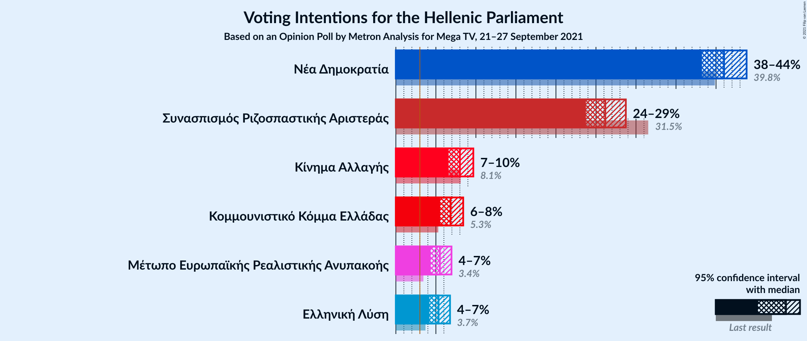

### Confidence Intervals

| Party | Last Result | Poll Result | 80% Confidence Interval | 90% Confidence Interval | 95% Confidence Interval | 99% Confidence Interval |
|:-----:|:-----------:|:-----------:|:-----------------------:|:-----------------------:|:-----------------------:|:-----------------------:|
| Νέα Δημοκρατία | 39.8% | 41.0% | 39.2–42.8% |38.7–43.4% |38.2–43.8% |37.4–44.7% |
| Συνασπισμός Ριζοσπαστικής Αριστεράς | 31.5% | 26.2% | 24.6–27.8% |24.1–28.3% |23.7–28.7% |23.0–29.6% |
| Κίνημα Αλλαγής | 8.1% | 8.0% | 7.1–9.1% |6.8–9.4% |6.6–9.7% |6.2–10.2% |
| Κομμουνιστικό Κόμμα Ελλάδας | 5.3% | 6.8% | 6.0–7.9% |5.7–8.2% |5.5–8.4% |5.2–8.9% |
| Μέτωπο Ευρωπαϊκής Ρεαλιστικής Ανυπακοής | 3.4% | 5.5% | 4.7–6.4% |4.5–6.7% |4.3–7.0% |4.0–7.4% |
| Ελληνική Λύση | 3.7% | 5.3% | 4.6–6.3% |4.4–6.5% |4.2–6.8% |3.9–7.2% |

*Note:* The poll result column reflects the actual value used in the calculations. Published results may vary slightly, and in addition be rounded to fewer digits.

## Seats

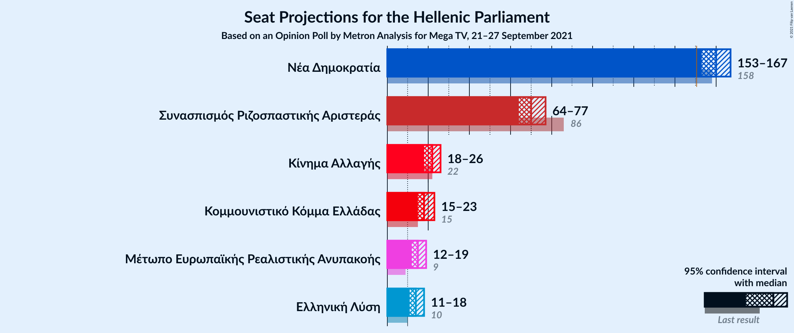

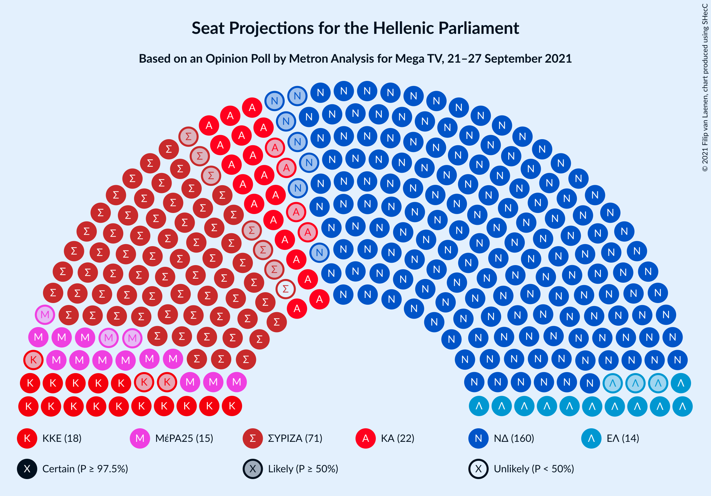

### Confidence Intervals

| Party | Last Result | Median | 80% Confidence Interval | 90% Confidence Interval | 95% Confidence Interval | 99% Confidence Interval |
|:-----:|:-----------:|:------:|:-----------------------:|:-----------------------:|:-----------------------:|:-----------------------:|
| <a href="#νέα-δημοκρατία">Νέα Δημοκρατία</a> | 158 | 160 | 155–165 |154–166 |153–167 |151–170 |
| <a href="#συνασπισμός-ριζοσπαστικής-αριστεράς">Συνασπισμός Ριζοσπαστικής Αριστεράς</a> | 86 | 70 | 66–75 |65–76 |64–77 |62–79 |
| <a href="#κίνημα-αλλαγής">Κίνημα Αλλαγής</a> | 22 | 22 | 19–24 |18–25 |18–26 |17–27 |
| <a href="#κομμουνιστικό-κόμμα-ελλάδας">Κομμουνιστικό Κόμμα Ελλάδας</a> | 15 | 18 | 16–21 |15–22 |15–23 |14–24 |
| <a href="#μέτωπο-ευρωπαϊκής-ρεαλιστικής-ανυπακοής">Μέτωπο Ευρωπαϊκής Ρεαλιστικής Ανυπακοής</a> | 9 | 15 | 13–17 |12–18 |12–19 |11–20 |
| <a href="#ελληνική-λύση">Ελληνική Λύση</a> | 10 | 14 | 12–17 |12–17 |11–18 |10–19 |

### Νέα Δημοκρατία

*For a full overview of the results for this party, see the [Νέα Δημοκρατία](party-νέαδημοκρατία.html) page.*

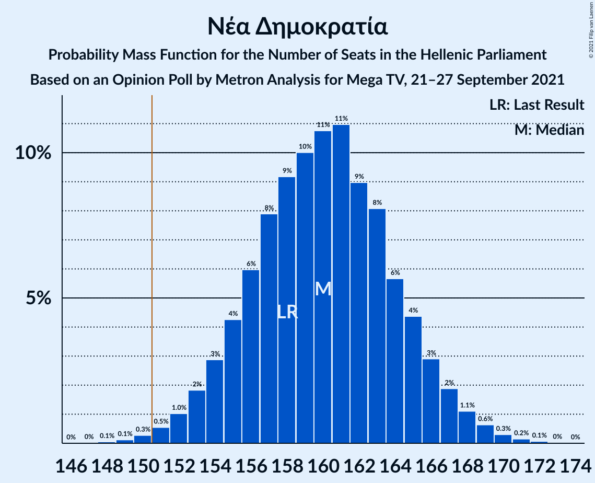

| Number of Seats | Probability | Accumulated | Special Marks |
|:---------------:|:-----------:|:-----------:|:-------------:|
| 148 | 0.1% | 100% |  |
| 149 | 0.1% | 99.9% |  |
| 150 | 0.3% | 99.8% |  |
| 151 | 0.5% | 99.5% | Majority |
| 152 | 1.0% | 99.0% |  |
| 153 | 2% | 98% |  |
| 154 | 3% | 96% |  |
| 155 | 4% | 93% |  |
| 156 | 6% | 89% |  |
| 157 | 8% | 83% |  |
| 158 | 9% | 75% | Last Result |
| 159 | 10% | 66% |  |
| 160 | 11% | 56% | Median |
| 161 | 11% | 45% |  |
| 162 | 9% | 34% |  |
| 163 | 8% | 25% |  |
| 164 | 6% | 17% |  |
| 165 | 4% | 11% |  |
| 166 | 3% | 7% |  |
| 167 | 2% | 4% |  |
| 168 | 1.1% | 2% |  |
| 169 | 0.6% | 1.2% |  |
| 170 | 0.3% | 0.6% |  |
| 171 | 0.2% | 0.3% |  |
| 172 | 0.1% | 0.1% |  |
| 173 | 0% | 0% |  |

### Συνασπισμός Ριζοσπαστικής Αριστεράς

*For a full overview of the results for this party, see the [Συνασπισμός Ριζοσπαστικής Αριστεράς](party-συνασπισμόςριζοσπαστικήςαριστεράς.html) page.*

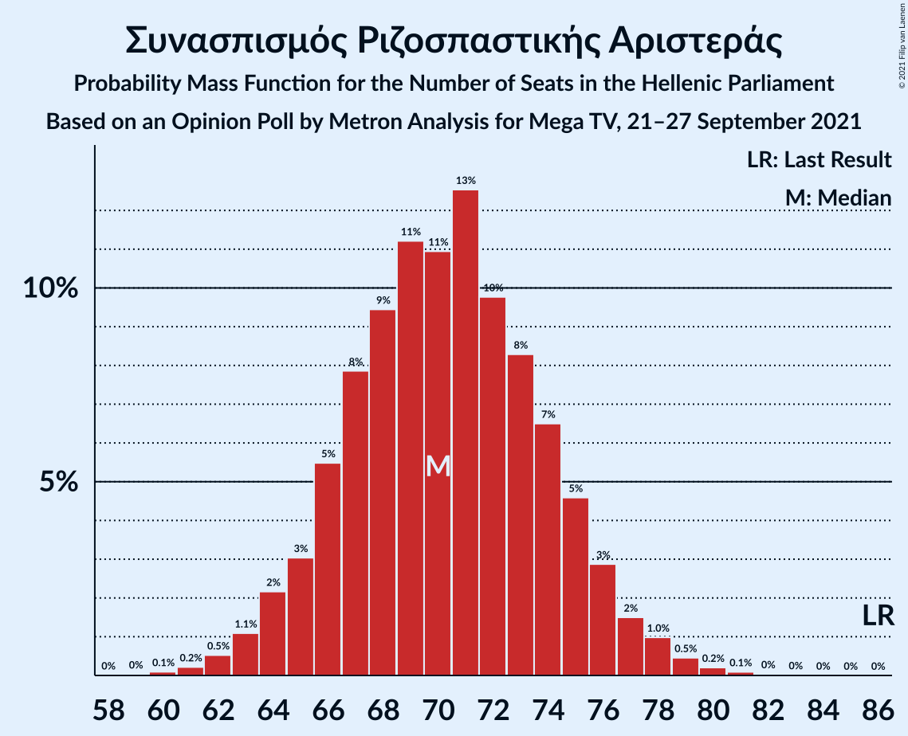

| Number of Seats | Probability | Accumulated | Special Marks |
|:---------------:|:-----------:|:-----------:|:-------------:|
| 60 | 0.1% | 100% |  |
| 61 | 0.2% | 99.9% |  |
| 62 | 0.5% | 99.6% |  |
| 63 | 1.1% | 99.1% |  |
| 64 | 2% | 98% |  |
| 65 | 3% | 96% |  |
| 66 | 5% | 93% |  |
| 67 | 8% | 87% |  |
| 68 | 9% | 79% |  |
| 69 | 11% | 70% |  |
| 70 | 11% | 59% | Median |
| 71 | 13% | 48% |  |
| 72 | 10% | 35% |  |
| 73 | 8% | 26% |  |
| 74 | 7% | 17% |  |
| 75 | 5% | 11% |  |
| 76 | 3% | 6% |  |
| 77 | 2% | 3% |  |
| 78 | 1.0% | 2% |  |
| 79 | 0.5% | 0.8% |  |
| 80 | 0.2% | 0.4% |  |
| 81 | 0.1% | 0.2% |  |
| 82 | 0% | 0.1% |  |
| 83 | 0% | 0% |  |
| 84 | 0% | 0% |  |
| 85 | 0% | 0% |  |
| 86 | 0% | 0% | Last Result |

### Κίνημα Αλλαγής

*For a full overview of the results for this party, see the [Κίνημα Αλλαγής](party-κίνημααλλαγής.html) page.*

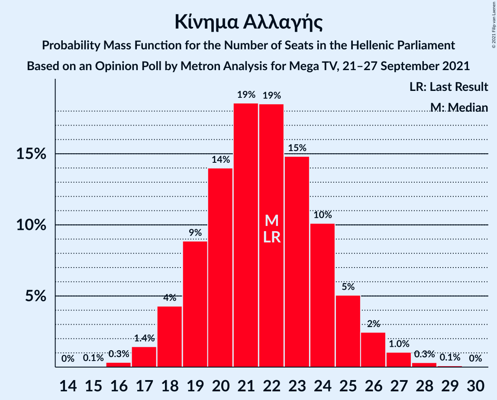

| Number of Seats | Probability | Accumulated | Special Marks |
|:---------------:|:-----------:|:-----------:|:-------------:|
| 15 | 0.1% | 100% |  |
| 16 | 0.3% | 99.9% |  |
| 17 | 1.4% | 99.6% |  |
| 18 | 4% | 98% |  |
| 19 | 9% | 94% |  |
| 20 | 14% | 85% |  |
| 21 | 19% | 71% |  |
| 22 | 19% | 52% | Last Result, Median |
| 23 | 15% | 34% |  |
| 24 | 10% | 19% |  |
| 25 | 5% | 9% |  |
| 26 | 2% | 4% |  |
| 27 | 1.0% | 1.5% |  |
| 28 | 0.3% | 0.4% |  |
| 29 | 0.1% | 0.1% |  |
| 30 | 0% | 0% |  |

### Κομμουνιστικό Κόμμα Ελλάδας

*For a full overview of the results for this party, see the [Κομμουνιστικό Κόμμα Ελλάδας](party-κομμουνιστικόκόμμαελλάδας.html) page.*

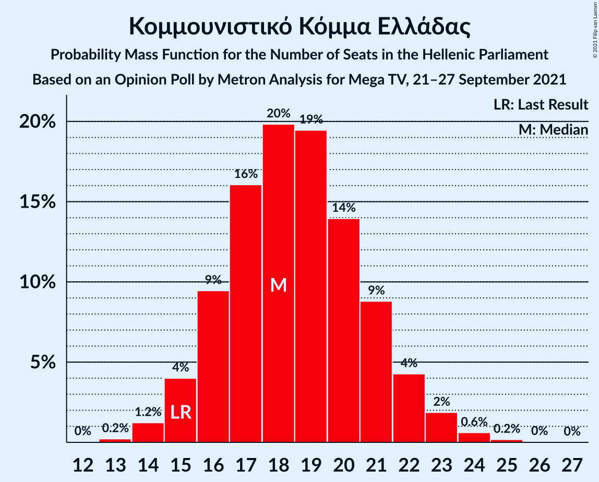

| Number of Seats | Probability | Accumulated | Special Marks |
|:---------------:|:-----------:|:-----------:|:-------------:|
| 13 | 0.2% | 100% |  |
| 14 | 1.2% | 99.7% |  |
| 15 | 4% | 98.5% | Last Result |
| 16 | 9% | 95% |  |
| 17 | 16% | 85% |  |
| 18 | 20% | 69% | Median |
| 19 | 19% | 49% |  |
| 20 | 14% | 30% |  |
| 21 | 9% | 16% |  |
| 22 | 4% | 7% |  |
| 23 | 2% | 3% |  |
| 24 | 0.6% | 0.8% |  |
| 25 | 0.2% | 0.2% |  |
| 26 | 0% | 0.1% |  |
| 27 | 0% | 0% |  |

### Μέτωπο Ευρωπαϊκής Ρεαλιστικής Ανυπακοής

*For a full overview of the results for this party, see the [Μέτωπο Ευρωπαϊκής Ρεαλιστικής Ανυπακοής](party-μέτωποευρωπαϊκήςρεαλιστικήςανυπακοής.html) page.*

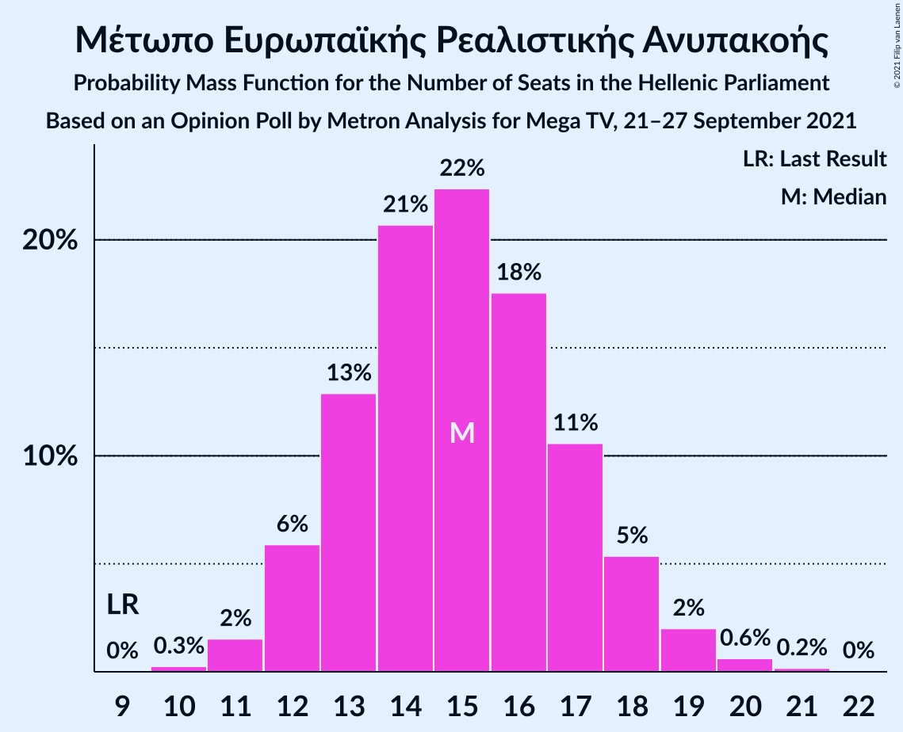

| Number of Seats | Probability | Accumulated | Special Marks |
|:---------------:|:-----------:|:-----------:|:-------------:|
| 9 | 0% | 100% | Last Result |
| 10 | 0.3% | 100% |  |
| 11 | 2% | 99.7% |  |
| 12 | 6% | 98% |  |
| 13 | 13% | 92% |  |
| 14 | 21% | 79% |  |
| 15 | 22% | 59% | Median |
| 16 | 18% | 36% |  |
| 17 | 11% | 19% |  |
| 18 | 5% | 8% |  |
| 19 | 2% | 3% |  |
| 20 | 0.6% | 0.8% |  |
| 21 | 0.2% | 0.2% |  |
| 22 | 0% | 0% |  |

### Ελληνική Λύση

*For a full overview of the results for this party, see the [Ελληνική Λύση](party-ελληνικήλύση.html) page.*

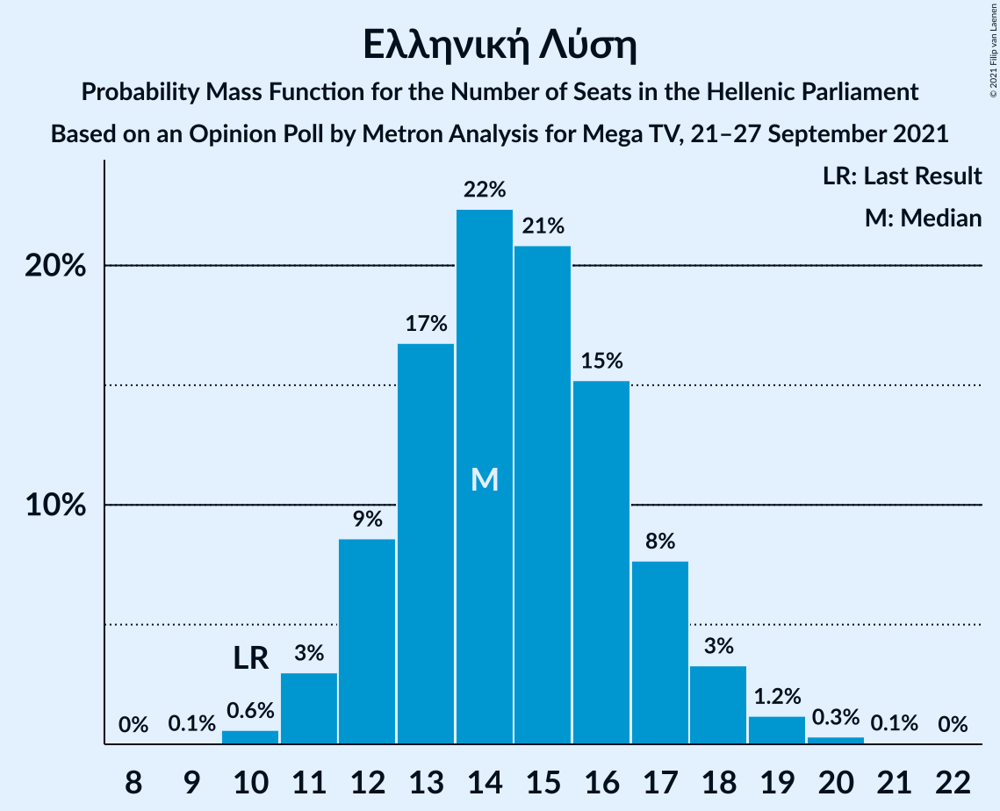

| Number of Seats | Probability | Accumulated | Special Marks |
|:---------------:|:-----------:|:-----------:|:-------------:|
| 9 | 0.1% | 100% |  |
| 10 | 0.6% | 99.9% | Last Result |
| 11 | 3% | 99.3% |  |
| 12 | 9% | 96% |  |
| 13 | 17% | 88% |  |
| 14 | 22% | 71% | Median |
| 15 | 21% | 49% |  |
| 16 | 15% | 28% |  |
| 17 | 8% | 13% |  |
| 18 | 3% | 5% |  |
| 19 | 1.2% | 2% |  |
| 20 | 0.3% | 0.4% |  |
| 21 | 0.1% | 0.1% |  |
| 22 | 0% | 0% |  |

## Coalitions

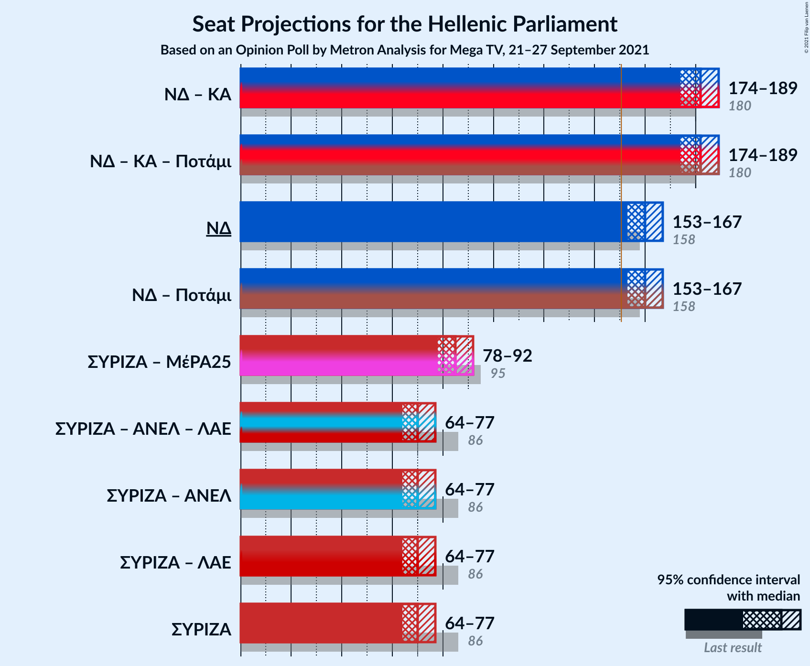

### Confidence Intervals

| Coalition | Last Result | Median | Majority? | 80% Confidence Interval | 90% Confidence Interval | 95% Confidence Interval | 99% Confidence Interval |
|:---------:|:-----------:|:------:|:---------:|:-----------------------:|:-----------------------:|:-----------------------:|:-----------------------:|
| Νέα Δημοκρατία – Κίνημα Αλλαγής | 180 | 182 | 100% | 177–186 | 176–188 | 174–189 | 172–191 |
| Νέα Δημοκρατία | 158 | 160 | 99.5% | 155–165 | 154–166 | 153–167 | 151–170 |
| Συνασπισμός Ριζοσπαστικής Αριστεράς – Μέτωπο Ευρωπαϊκής Ρεαλιστικής Ανυπακοής | 95 | 85 | 0% | 81–90 | 80–91 | 78–92 | 76–95 |
| Συνασπισμός Ριζοσπαστικής Αριστεράς | 86 | 70 | 0% | 66–75 | 65–76 | 64–77 | 62–79 |

### Νέα Δημοκρατία – Κίνημα Αλλαγής

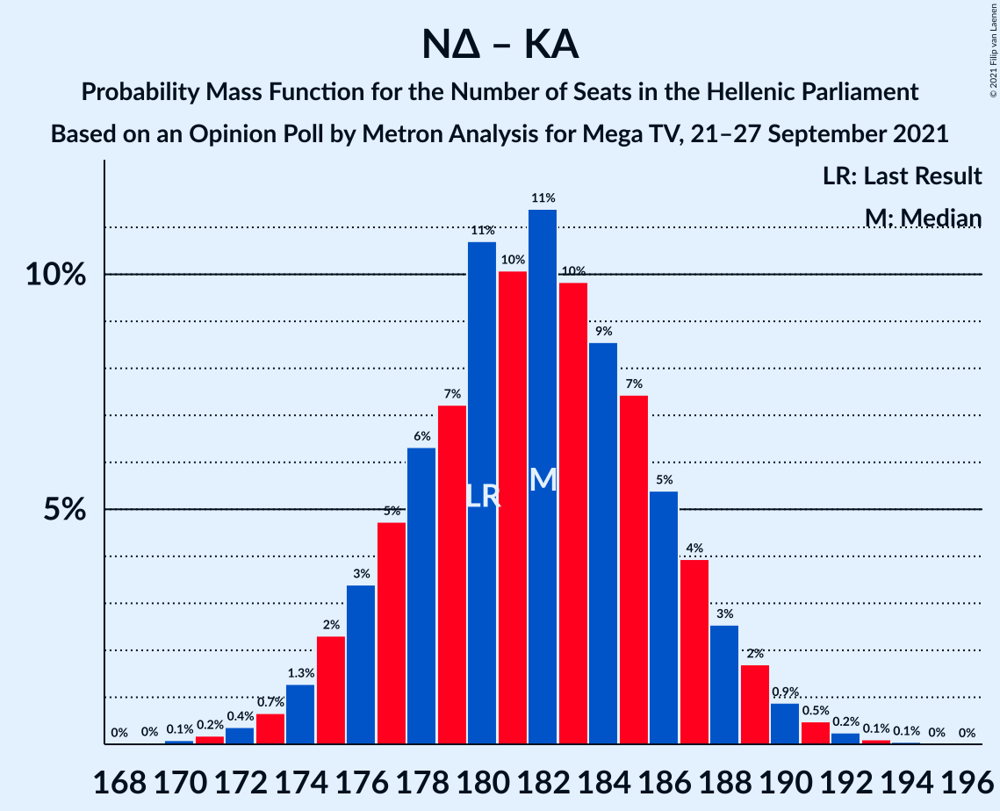

| Number of Seats | Probability | Accumulated | Special Marks |
|:---------------:|:-----------:|:-----------:|:-------------:|
| 169 | 0% | 100% |  |
| 170 | 0.1% | 99.9% |  |
| 171 | 0.2% | 99.9% |  |
| 172 | 0.4% | 99.7% |  |
| 173 | 0.7% | 99.3% |  |
| 174 | 1.3% | 98.6% |  |
| 175 | 2% | 97% |  |
| 176 | 3% | 95% |  |
| 177 | 5% | 92% |  |
| 178 | 6% | 87% |  |
| 179 | 7% | 81% |  |
| 180 | 11% | 73% | Last Result |
| 181 | 10% | 63% |  |
| 182 | 11% | 53% | Median |
| 183 | 10% | 41% |  |
| 184 | 9% | 31% |  |
| 185 | 7% | 23% |  |
| 186 | 5% | 15% |  |
| 187 | 4% | 10% |  |
| 188 | 3% | 6% |  |
| 189 | 2% | 3% |  |
| 190 | 0.9% | 2% |  |
| 191 | 0.5% | 0.9% |  |
| 192 | 0.2% | 0.4% |  |
| 193 | 0.1% | 0.2% |  |
| 194 | 0.1% | 0.1% |  |
| 195 | 0% | 0% |  |

### Νέα Δημοκρατία

| Number of Seats | Probability | Accumulated | Special Marks |
|:---------------:|:-----------:|:-----------:|:-------------:|
| 148 | 0.1% | 100% |  |
| 149 | 0.1% | 99.9% |  |
| 150 | 0.3% | 99.8% |  |
| 151 | 0.5% | 99.5% | Majority |
| 152 | 1.0% | 99.0% |  |
| 153 | 2% | 98% |  |
| 154 | 3% | 96% |  |
| 155 | 4% | 93% |  |
| 156 | 6% | 89% |  |
| 157 | 8% | 83% |  |
| 158 | 9% | 75% | Last Result |
| 159 | 10% | 66% |  |
| 160 | 11% | 56% | Median |
| 161 | 11% | 45% |  |
| 162 | 9% | 34% |  |
| 163 | 8% | 25% |  |
| 164 | 6% | 17% |  |
| 165 | 4% | 11% |  |
| 166 | 3% | 7% |  |
| 167 | 2% | 4% |  |
| 168 | 1.1% | 2% |  |
| 169 | 0.6% | 1.2% |  |
| 170 | 0.3% | 0.6% |  |
| 171 | 0.2% | 0.3% |  |
| 172 | 0.1% | 0.1% |  |
| 173 | 0% | 0% |  |

### Συνασπισμός Ριζοσπαστικής Αριστεράς – Μέτωπο Ευρωπαϊκής Ρεαλιστικής Ανυπακοής

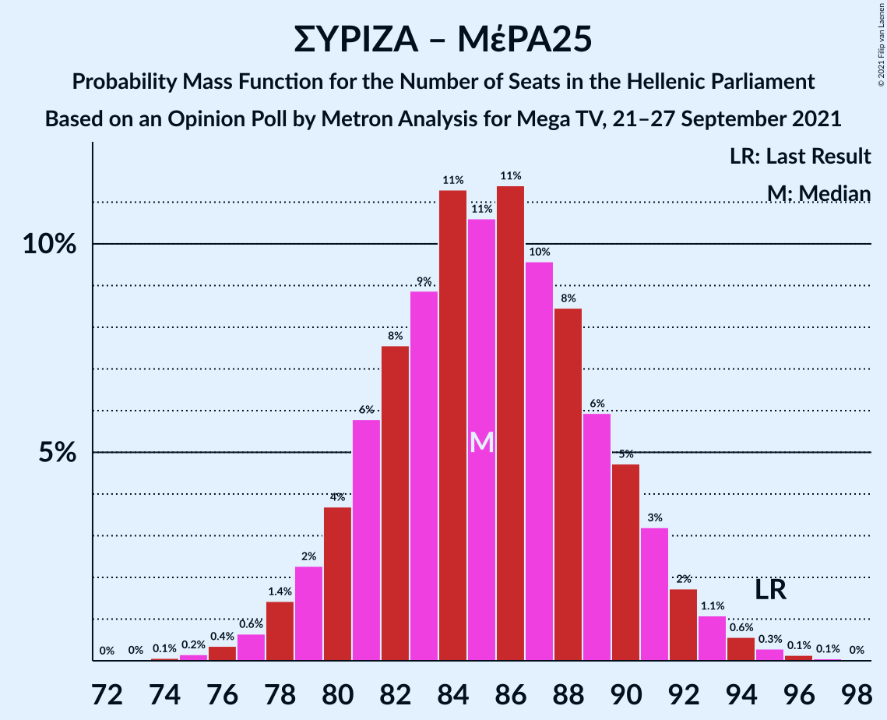

| Number of Seats | Probability | Accumulated | Special Marks |
|:---------------:|:-----------:|:-----------:|:-------------:|
| 74 | 0.1% | 100% |  |
| 75 | 0.2% | 99.9% |  |
| 76 | 0.4% | 99.7% |  |
| 77 | 0.6% | 99.4% |  |
| 78 | 1.4% | 98.7% |  |
| 79 | 2% | 97% |  |
| 80 | 4% | 95% |  |
| 81 | 6% | 91% |  |
| 82 | 8% | 86% |  |
| 83 | 9% | 78% |  |
| 84 | 11% | 69% |  |
| 85 | 11% | 58% | Median |
| 86 | 11% | 47% |  |
| 87 | 10% | 36% |  |
| 88 | 8% | 26% |  |
| 89 | 6% | 18% |  |
| 90 | 5% | 12% |  |
| 91 | 3% | 7% |  |
| 92 | 2% | 4% |  |
| 93 | 1.1% | 2% |  |
| 94 | 0.6% | 1.1% |  |
| 95 | 0.3% | 0.5% | Last Result |
| 96 | 0.1% | 0.2% |  |
| 97 | 0.1% | 0.1% |  |
| 98 | 0% | 0% |  |

### Συνασπισμός Ριζοσπαστικής Αριστεράς

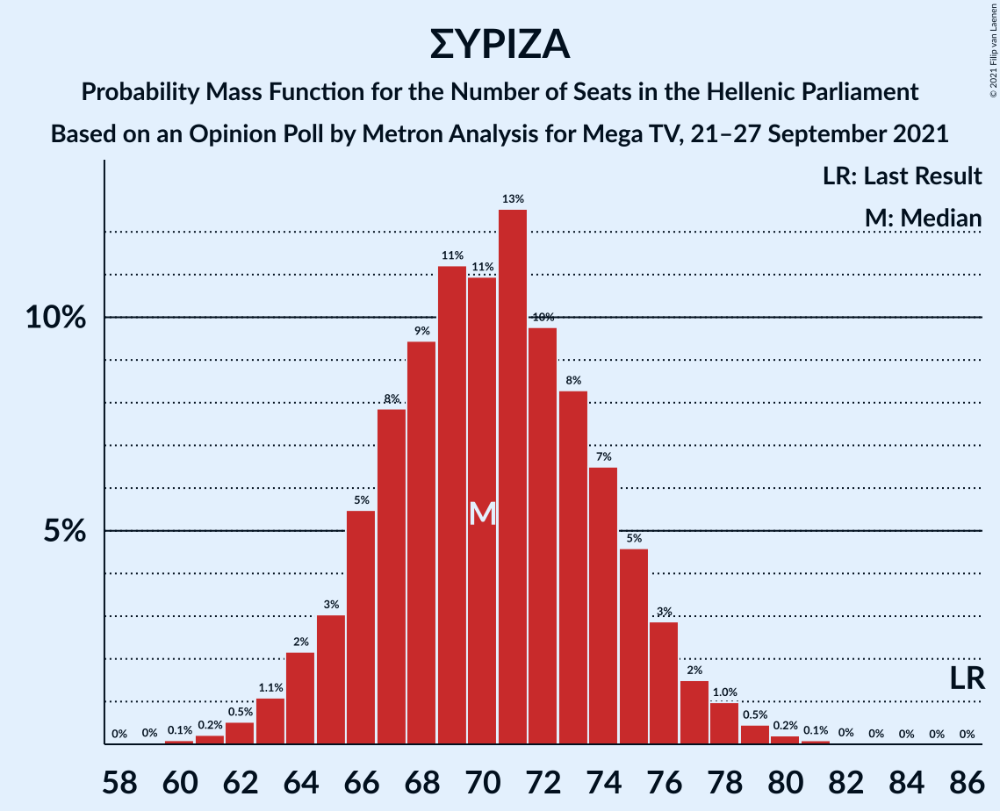

| Number of Seats | Probability | Accumulated | Special Marks |
|:---------------:|:-----------:|:-----------:|:-------------:|
| 60 | 0.1% | 100% |  |
| 61 | 0.2% | 99.9% |  |
| 62 | 0.5% | 99.6% |  |
| 63 | 1.1% | 99.1% |  |
| 64 | 2% | 98% |  |
| 65 | 3% | 96% |  |
| 66 | 5% | 93% |  |
| 67 | 8% | 87% |  |
| 68 | 9% | 79% |  |
| 69 | 11% | 70% |  |
| 70 | 11% | 59% | Median |
| 71 | 13% | 48% |  |
| 72 | 10% | 35% |  |
| 73 | 8% | 26% |  |
| 74 | 7% | 17% |  |
| 75 | 5% | 11% |  |
| 76 | 3% | 6% |  |
| 77 | 2% | 3% |  |
| 78 | 1.0% | 2% |  |
| 79 | 0.5% | 0.8% |  |
| 80 | 0.2% | 0.4% |  |
| 81 | 0.1% | 0.2% |  |
| 82 | 0% | 0.1% |  |
| 83 | 0% | 0% |  |
| 84 | 0% | 0% |  |
| 85 | 0% | 0% |  |
| 86 | 0% | 0% | Last Result |

## Technical Information

### Opinion Poll

+ **Polling firm:** Metron Analysis
+ **Commissioner(s):** Mega TV
+ **Fieldwork period:** 21–27 September 2021

### Calculations

+ **Sample size:** 1200
+ **Simulations done:** 1,048,576
+ **Error estimate:** 1.16%

