# Opinion Poll by Interview for Politic.gr, 27–30 September 2021

<a href="#voting-intentions">Voting Intentions</a> | <a href="#seats">Seats</a> | <a href="#coalitions">Coalitions</a> | <a href="#technical-information">Technical Information</a>

## Voting Intentions

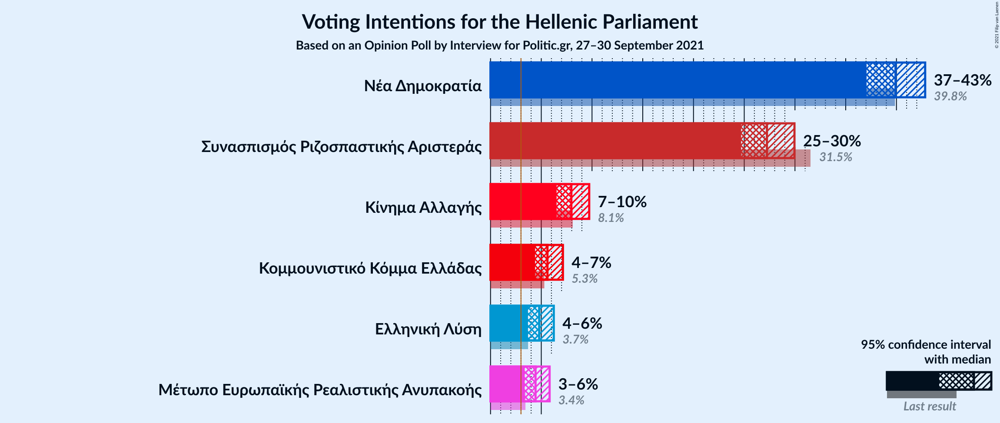

### Confidence Intervals

| Party | Last Result | Poll Result | 80% Confidence Interval | 90% Confidence Interval | 95% Confidence Interval | 99% Confidence Interval |
|:-----:|:-----------:|:-----------:|:-----------------------:|:-----------------------:|:-----------------------:|:-----------------------:|
| Νέα Δημοκρατία | 39.8% | 39.9% | 38.0–41.8% |37.5–42.4% |37.1–42.8% |36.2–43.8% |
| Συνασπισμός Ριζοσπαστικής Αριστεράς | 31.5% | 27.2% | 25.6–29.0% |25.1–29.5% |24.7–29.9% |23.9–30.8% |
| Κίνημα Αλλαγής | 8.1% | 8.0% | 7.0–9.1% |6.7–9.4% |6.5–9.7% |6.1–10.3% |
| Κομμουνιστικό Κόμμα Ελλάδας | 5.3% | 5.6% | 4.8–6.6% |4.6–6.9% |4.4–7.1% |4.0–7.6% |
| Ελληνική Λύση | 3.7% | 4.8% | 4.1–5.7% |3.9–6.0% |3.7–6.2% |3.4–6.7% |
| Μέτωπο Ευρωπαϊκής Ρεαλιστικής Ανυπακοής | 3.4% | 4.4% | 3.7–5.3% |3.5–5.6% |3.4–5.8% |3.1–6.3% |

*Note:* The poll result column reflects the actual value used in the calculations. Published results may vary slightly, and in addition be rounded to fewer digits.

## Seats

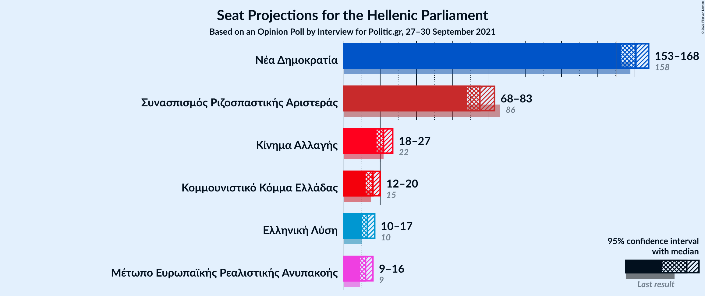

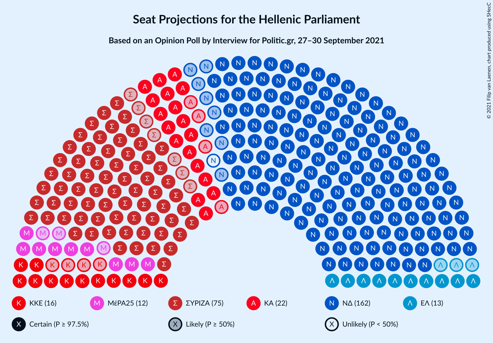

### Confidence Intervals

| Party | Last Result | Median | 80% Confidence Interval | 90% Confidence Interval | 95% Confidence Interval | 99% Confidence Interval |
|:-----:|:-----------:|:------:|:-----------------------:|:-----------------------:|:-----------------------:|:-----------------------:|
| <a href="#νέα-δημοκρατία">Νέα Δημοκρατία</a> | 158 | 161 | 156–166 |154–167 |153–168 |150–171 |
| <a href="#συνασπισμός-ριζοσπαστικής-αριστεράς">Συνασπισμός Ριζοσπαστικής Αριστεράς</a> | 86 | 75 | 71–80 |70–82 |68–83 |66–85 |
| <a href="#κίνημα-αλλαγής">Κίνημα Αλλαγής</a> | 22 | 22 | 19–25 |19–26 |18–27 |17–28 |
| <a href="#κομμουνιστικό-κόμμα-ελλάδας">Κομμουνιστικό Κόμμα Ελλάδας</a> | 15 | 16 | 13–18 |13–19 |12–20 |11–21 |
| <a href="#ελληνική-λύση">Ελληνική Λύση</a> | 10 | 13 | 11–16 |11–17 |10–17 |9–19 |
| <a href="#μέτωπο-ευρωπαϊκής-ρεαλιστικής-ανυπακοής">Μέτωπο Ευρωπαϊκής Ρεαλιστικής Ανυπακοής</a> | 9 | 12 | 10–15 |10–16 |9–16 |8–17 |

### Νέα Δημοκρατία

*For a full overview of the results for this party, see the [Νέα Δημοκρατία](party-νέαδημοκρατία.html) page.*

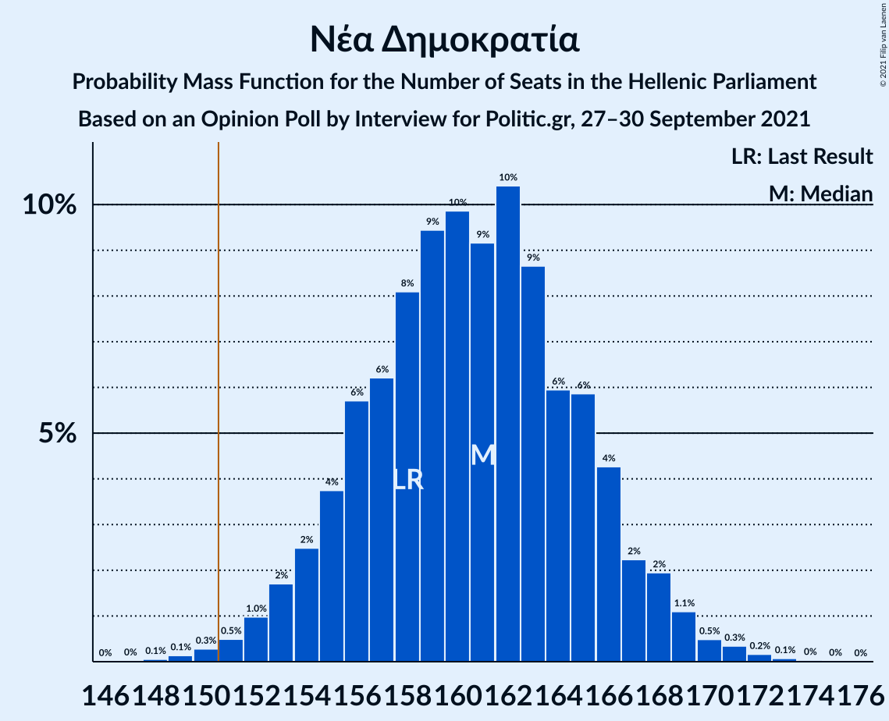

| Number of Seats | Probability | Accumulated | Special Marks |
|:---------------:|:-----------:|:-----------:|:-------------:|
| 148 | 0.1% | 100% |  |
| 149 | 0.1% | 99.9% |  |
| 150 | 0.3% | 99.8% |  |
| 151 | 0.5% | 99.5% | Majority |
| 152 | 1.0% | 99.0% |  |
| 153 | 2% | 98% |  |
| 154 | 2% | 96% |  |
| 155 | 4% | 94% |  |
| 156 | 6% | 90% |  |
| 157 | 6% | 84% |  |
| 158 | 8% | 78% | Last Result |
| 159 | 9% | 70% |  |
| 160 | 10% | 61% |  |
| 161 | 9% | 51% | Median |
| 162 | 10% | 42% |  |
| 163 | 9% | 31% |  |
| 164 | 6% | 23% |  |
| 165 | 6% | 17% |  |
| 166 | 4% | 11% |  |
| 167 | 2% | 6% |  |
| 168 | 2% | 4% |  |
| 169 | 1.1% | 2% |  |
| 170 | 0.5% | 1.1% |  |
| 171 | 0.3% | 0.6% |  |
| 172 | 0.2% | 0.3% |  |
| 173 | 0.1% | 0.1% |  |
| 174 | 0% | 0.1% |  |
| 175 | 0% | 0% |  |

### Συνασπισμός Ριζοσπαστικής Αριστεράς

*For a full overview of the results for this party, see the [Συνασπισμός Ριζοσπαστικής Αριστεράς](party-συνασπισμόςριζοσπαστικήςαριστεράς.html) page.*

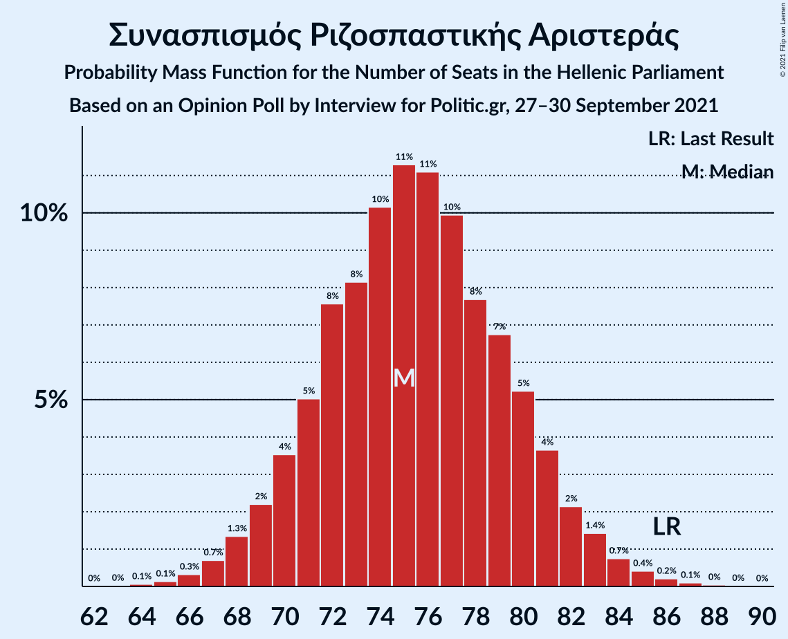

| Number of Seats | Probability | Accumulated | Special Marks |
|:---------------:|:-----------:|:-----------:|:-------------:|
| 64 | 0.1% | 100% |  |
| 65 | 0.1% | 99.9% |  |
| 66 | 0.3% | 99.8% |  |
| 67 | 0.7% | 99.4% |  |
| 68 | 1.3% | 98.7% |  |
| 69 | 2% | 97% |  |
| 70 | 4% | 95% |  |
| 71 | 5% | 92% |  |
| 72 | 8% | 87% |  |
| 73 | 8% | 79% |  |
| 74 | 10% | 71% |  |
| 75 | 11% | 61% | Median |
| 76 | 11% | 49% |  |
| 77 | 10% | 38% |  |
| 78 | 8% | 28% |  |
| 79 | 7% | 21% |  |
| 80 | 5% | 14% |  |
| 81 | 4% | 9% |  |
| 82 | 2% | 5% |  |
| 83 | 1.4% | 3% |  |
| 84 | 0.7% | 2% |  |
| 85 | 0.4% | 0.8% |  |
| 86 | 0.2% | 0.4% | Last Result |
| 87 | 0.1% | 0.2% |  |
| 88 | 0% | 0.1% |  |
| 89 | 0% | 0% |  |

### Κίνημα Αλλαγής

*For a full overview of the results for this party, see the [Κίνημα Αλλαγής](party-κίνημααλλαγής.html) page.*

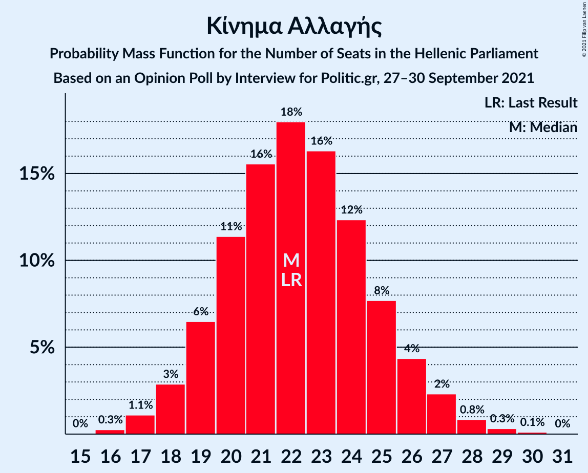

| Number of Seats | Probability | Accumulated | Special Marks |
|:---------------:|:-----------:|:-----------:|:-------------:|
| 16 | 0.3% | 100% |  |
| 17 | 1.1% | 99.7% |  |
| 18 | 3% | 98.6% |  |
| 19 | 6% | 96% |  |
| 20 | 11% | 89% |  |
| 21 | 16% | 78% |  |
| 22 | 18% | 62% | Last Result, Median |
| 23 | 16% | 44% |  |
| 24 | 12% | 28% |  |
| 25 | 8% | 16% |  |
| 26 | 4% | 8% |  |
| 27 | 2% | 4% |  |
| 28 | 0.8% | 1.3% |  |
| 29 | 0.3% | 0.5% |  |
| 30 | 0.1% | 0.2% |  |
| 31 | 0% | 0% |  |

### Κομμουνιστικό Κόμμα Ελλάδας

*For a full overview of the results for this party, see the [Κομμουνιστικό Κόμμα Ελλάδας](party-κομμουνιστικόκόμμαελλάδας.html) page.*

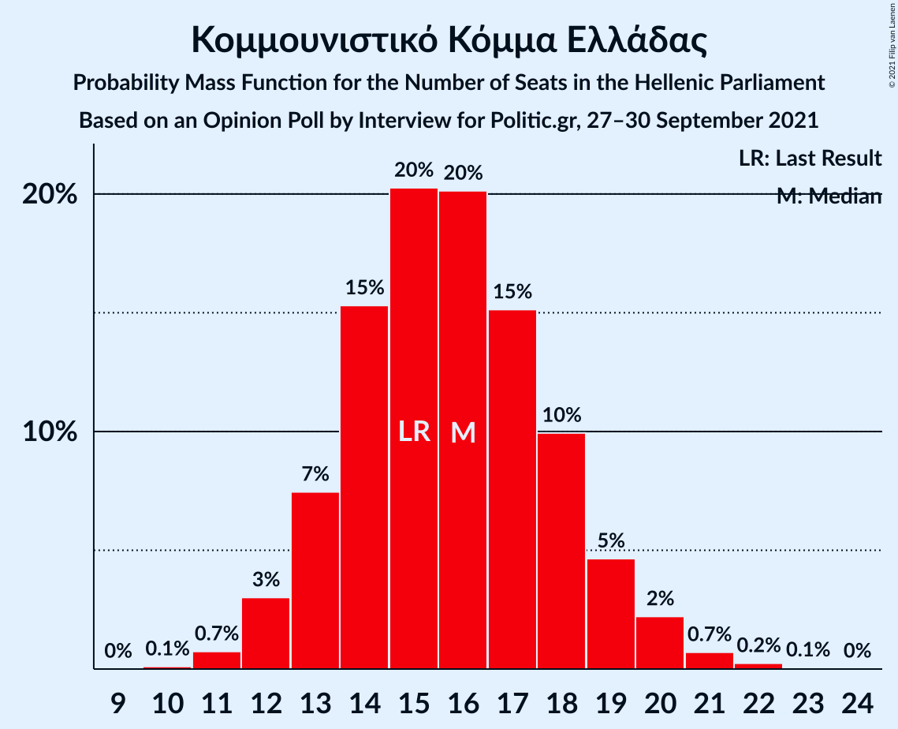

| Number of Seats | Probability | Accumulated | Special Marks |
|:---------------:|:-----------:|:-----------:|:-------------:|
| 10 | 0.1% | 100% |  |
| 11 | 0.7% | 99.9% |  |
| 12 | 3% | 99.1% |  |
| 13 | 7% | 96% |  |
| 14 | 15% | 89% |  |
| 15 | 20% | 73% | Last Result |
| 16 | 20% | 53% | Median |
| 17 | 15% | 33% |  |
| 18 | 10% | 18% |  |
| 19 | 5% | 8% |  |
| 20 | 2% | 3% |  |
| 21 | 0.7% | 1.0% |  |
| 22 | 0.2% | 0.3% |  |
| 23 | 0.1% | 0.1% |  |
| 24 | 0% | 0% |  |

### Ελληνική Λύση

*For a full overview of the results for this party, see the [Ελληνική Λύση](party-ελληνικήλύση.html) page.*

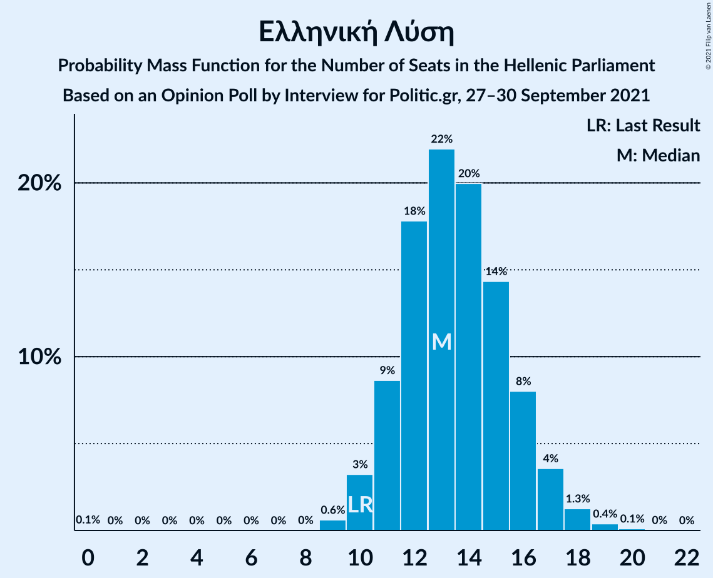

| Number of Seats | Probability | Accumulated | Special Marks |
|:---------------:|:-----------:|:-----------:|:-------------:|
| 0 | 0.1% | 100% |  |
| 1 | 0% | 99.9% |  |
| 2 | 0% | 99.9% |  |
| 3 | 0% | 99.9% |  |
| 4 | 0% | 99.9% |  |
| 5 | 0% | 99.9% |  |
| 6 | 0% | 99.9% |  |
| 7 | 0% | 99.9% |  |
| 8 | 0% | 99.9% |  |
| 9 | 0.6% | 99.9% |  |
| 10 | 3% | 99.3% | Last Result |
| 11 | 9% | 96% |  |
| 12 | 18% | 87% |  |
| 13 | 22% | 70% | Median |
| 14 | 20% | 48% |  |
| 15 | 14% | 28% |  |
| 16 | 8% | 13% |  |
| 17 | 4% | 5% |  |
| 18 | 1.3% | 2% |  |
| 19 | 0.4% | 0.5% |  |
| 20 | 0.1% | 0.1% |  |
| 21 | 0% | 0% |  |

### Μέτωπο Ευρωπαϊκής Ρεαλιστικής Ανυπακοής

*For a full overview of the results for this party, see the [Μέτωπο Ευρωπαϊκής Ρεαλιστικής Ανυπακοής](party-μέτωποευρωπαϊκήςρεαλιστικήςανυπακοής.html) page.*

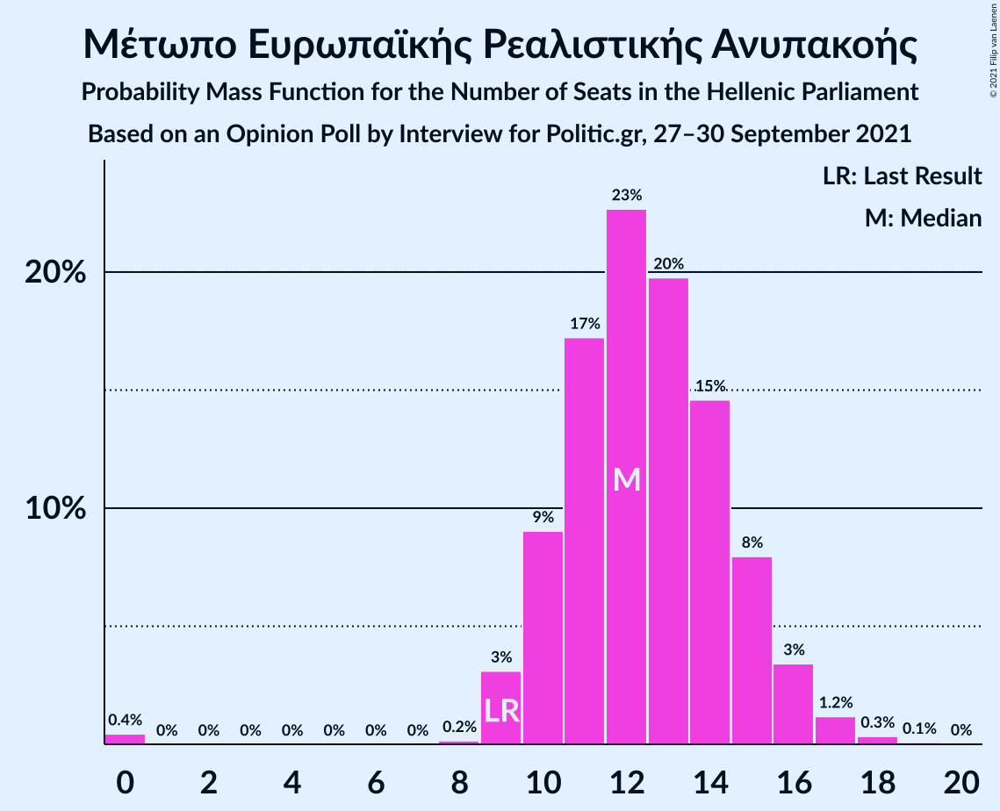

| Number of Seats | Probability | Accumulated | Special Marks |
|:---------------:|:-----------:|:-----------:|:-------------:|
| 0 | 0.4% | 100% |  |
| 1 | 0% | 99.6% |  |
| 2 | 0% | 99.6% |  |
| 3 | 0% | 99.6% |  |
| 4 | 0% | 99.6% |  |
| 5 | 0% | 99.6% |  |
| 6 | 0% | 99.6% |  |
| 7 | 0% | 99.6% |  |
| 8 | 0.2% | 99.6% |  |
| 9 | 3% | 99.4% | Last Result |
| 10 | 9% | 96% |  |
| 11 | 17% | 87% |  |
| 12 | 23% | 70% | Median |
| 13 | 20% | 47% |  |
| 14 | 15% | 28% |  |
| 15 | 8% | 13% |  |
| 16 | 3% | 5% |  |
| 17 | 1.2% | 2% |  |
| 18 | 0.3% | 0.4% |  |
| 19 | 0.1% | 0.1% |  |
| 20 | 0% | 0% |  |

## Coalitions

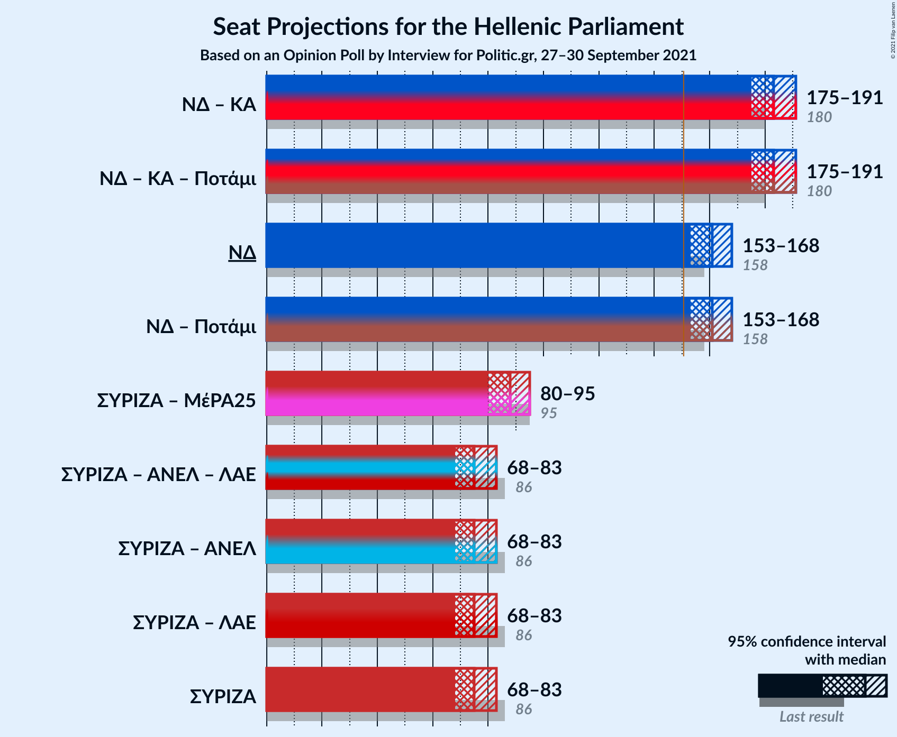

### Confidence Intervals

| Coalition | Last Result | Median | Majority? | 80% Confidence Interval | 90% Confidence Interval | 95% Confidence Interval | 99% Confidence Interval |
|:---------:|:-----------:|:------:|:---------:|:-----------------------:|:-----------------------:|:-----------------------:|:-----------------------:|
| Νέα Δημοκρατία – Κίνημα Αλλαγής | 180 | 183 | 100% | 178–188 | 176–189 | 175–191 | 172–193 |
| Νέα Δημοκρατία | 158 | 161 | 99.5% | 156–166 | 154–167 | 153–168 | 150–171 |
| Συνασπισμός Ριζοσπαστικής Αριστεράς – Μέτωπο Ευρωπαϊκής Ρεαλιστικής Ανυπακοής | 95 | 88 | 0% | 83–93 | 82–94 | 80–95 | 78–98 |
| Συνασπισμός Ριζοσπαστικής Αριστεράς | 86 | 75 | 0% | 71–80 | 70–82 | 68–83 | 66–85 |

### Νέα Δημοκρατία – Κίνημα Αλλαγής

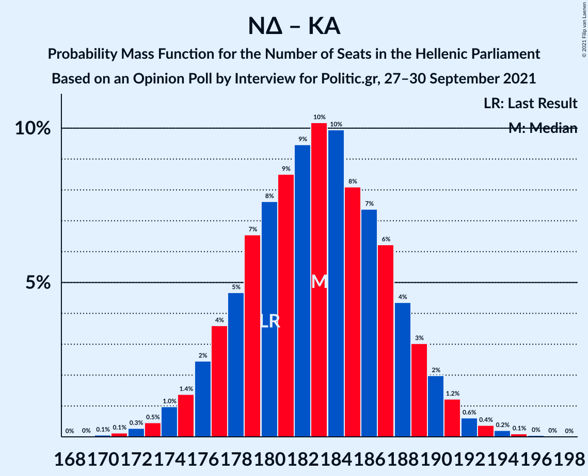

| Number of Seats | Probability | Accumulated | Special Marks |
|:---------------:|:-----------:|:-----------:|:-------------:|
| 170 | 0.1% | 100% |  |
| 171 | 0.1% | 99.9% |  |
| 172 | 0.3% | 99.8% |  |
| 173 | 0.5% | 99.5% |  |
| 174 | 1.0% | 99.0% |  |
| 175 | 1.4% | 98% |  |
| 176 | 2% | 97% |  |
| 177 | 4% | 94% |  |
| 178 | 5% | 91% |  |
| 179 | 7% | 86% |  |
| 180 | 8% | 79% | Last Result |
| 181 | 9% | 72% |  |
| 182 | 9% | 63% |  |
| 183 | 10% | 54% | Median |
| 184 | 10% | 44% |  |
| 185 | 8% | 34% |  |
| 186 | 7% | 26% |  |
| 187 | 6% | 18% |  |
| 188 | 4% | 12% |  |
| 189 | 3% | 8% |  |
| 190 | 2% | 5% |  |
| 191 | 1.2% | 3% |  |
| 192 | 0.6% | 1.4% |  |
| 193 | 0.4% | 0.8% |  |
| 194 | 0.2% | 0.4% |  |
| 195 | 0.1% | 0.2% |  |
| 196 | 0% | 0.1% |  |
| 197 | 0% | 0% |  |

### Νέα Δημοκρατία

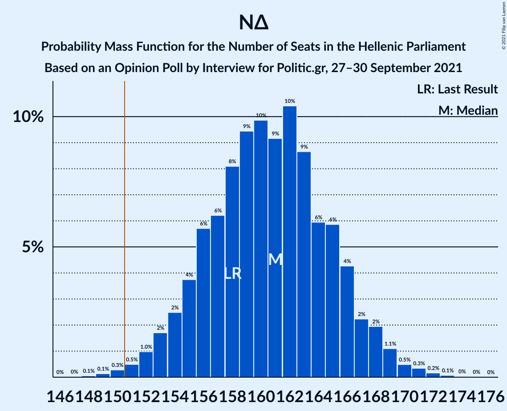

| Number of Seats | Probability | Accumulated | Special Marks |
|:---------------:|:-----------:|:-----------:|:-------------:|
| 148 | 0.1% | 100% |  |
| 149 | 0.1% | 99.9% |  |
| 150 | 0.3% | 99.8% |  |
| 151 | 0.5% | 99.5% | Majority |
| 152 | 1.0% | 99.0% |  |
| 153 | 2% | 98% |  |
| 154 | 2% | 96% |  |
| 155 | 4% | 94% |  |
| 156 | 6% | 90% |  |
| 157 | 6% | 84% |  |
| 158 | 8% | 78% | Last Result |
| 159 | 9% | 70% |  |
| 160 | 10% | 61% |  |
| 161 | 9% | 51% | Median |
| 162 | 10% | 42% |  |
| 163 | 9% | 31% |  |
| 164 | 6% | 23% |  |
| 165 | 6% | 17% |  |
| 166 | 4% | 11% |  |
| 167 | 2% | 6% |  |
| 168 | 2% | 4% |  |
| 169 | 1.1% | 2% |  |
| 170 | 0.5% | 1.1% |  |
| 171 | 0.3% | 0.6% |  |
| 172 | 0.2% | 0.3% |  |
| 173 | 0.1% | 0.1% |  |
| 174 | 0% | 0.1% |  |
| 175 | 0% | 0% |  |

### Συνασπισμός Ριζοσπαστικής Αριστεράς – Μέτωπο Ευρωπαϊκής Ρεαλιστικής Ανυπακοής

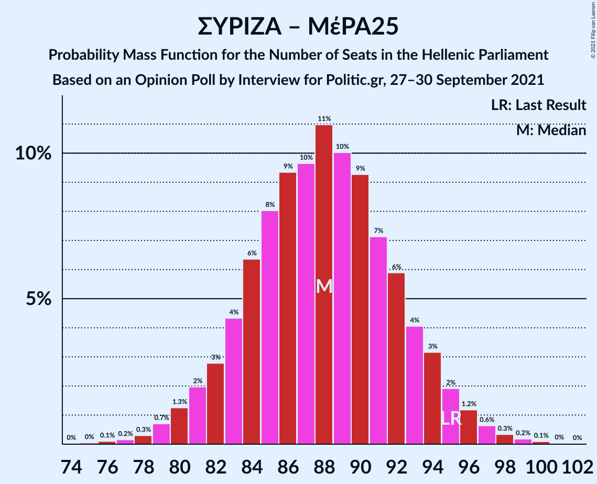

| Number of Seats | Probability | Accumulated | Special Marks |
|:---------------:|:-----------:|:-----------:|:-------------:|
| 74 | 0% | 100% |  |
| 75 | 0% | 99.9% |  |
| 76 | 0.1% | 99.9% |  |
| 77 | 0.2% | 99.8% |  |
| 78 | 0.3% | 99.6% |  |
| 79 | 0.7% | 99.3% |  |
| 80 | 1.3% | 98.6% |  |
| 81 | 2% | 97% |  |
| 82 | 3% | 95% |  |
| 83 | 4% | 93% |  |
| 84 | 6% | 88% |  |
| 85 | 8% | 82% |  |
| 86 | 9% | 74% |  |
| 87 | 10% | 65% | Median |
| 88 | 11% | 55% |  |
| 89 | 10% | 44% |  |
| 90 | 9% | 34% |  |
| 91 | 7% | 25% |  |
| 92 | 6% | 18% |  |
| 93 | 4% | 12% |  |
| 94 | 3% | 8% |  |
| 95 | 2% | 4% | Last Result |
| 96 | 1.2% | 2% |  |
| 97 | 0.6% | 1.3% |  |
| 98 | 0.3% | 0.7% |  |
| 99 | 0.2% | 0.3% |  |
| 100 | 0.1% | 0.2% |  |
| 101 | 0% | 0.1% |  |
| 102 | 0% | 0% |  |

### Συνασπισμός Ριζοσπαστικής Αριστεράς

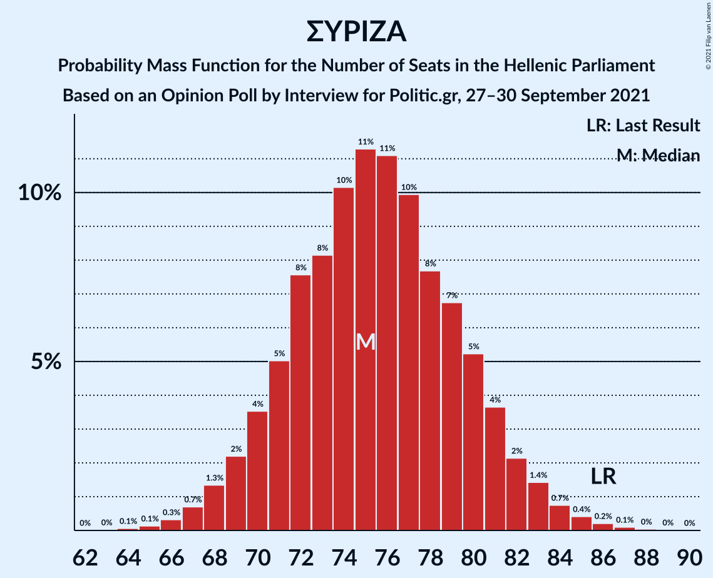

| Number of Seats | Probability | Accumulated | Special Marks |
|:---------------:|:-----------:|:-----------:|:-------------:|
| 64 | 0.1% | 100% |  |
| 65 | 0.1% | 99.9% |  |
| 66 | 0.3% | 99.8% |  |
| 67 | 0.7% | 99.4% |  |
| 68 | 1.3% | 98.7% |  |
| 69 | 2% | 97% |  |
| 70 | 4% | 95% |  |
| 71 | 5% | 92% |  |
| 72 | 8% | 87% |  |
| 73 | 8% | 79% |  |
| 74 | 10% | 71% |  |
| 75 | 11% | 61% | Median |
| 76 | 11% | 49% |  |
| 77 | 10% | 38% |  |
| 78 | 8% | 28% |  |
| 79 | 7% | 21% |  |
| 80 | 5% | 14% |  |
| 81 | 4% | 9% |  |
| 82 | 2% | 5% |  |
| 83 | 1.4% | 3% |  |
| 84 | 0.7% | 2% |  |
| 85 | 0.4% | 0.8% |  |
| 86 | 0.2% | 0.4% | Last Result |
| 87 | 0.1% | 0.2% |  |
| 88 | 0% | 0.1% |  |
| 89 | 0% | 0% |  |

## Technical Information

### Opinion Poll

+ **Polling firm:** Interview
+ **Commissioner(s):** Politic.gr
+ **Fieldwork period:** 27–30 September 2021

### Calculations

+ **Sample size:** 1105
+ **Simulations done:** 1,048,576
+ **Error estimate:** 0.46%

