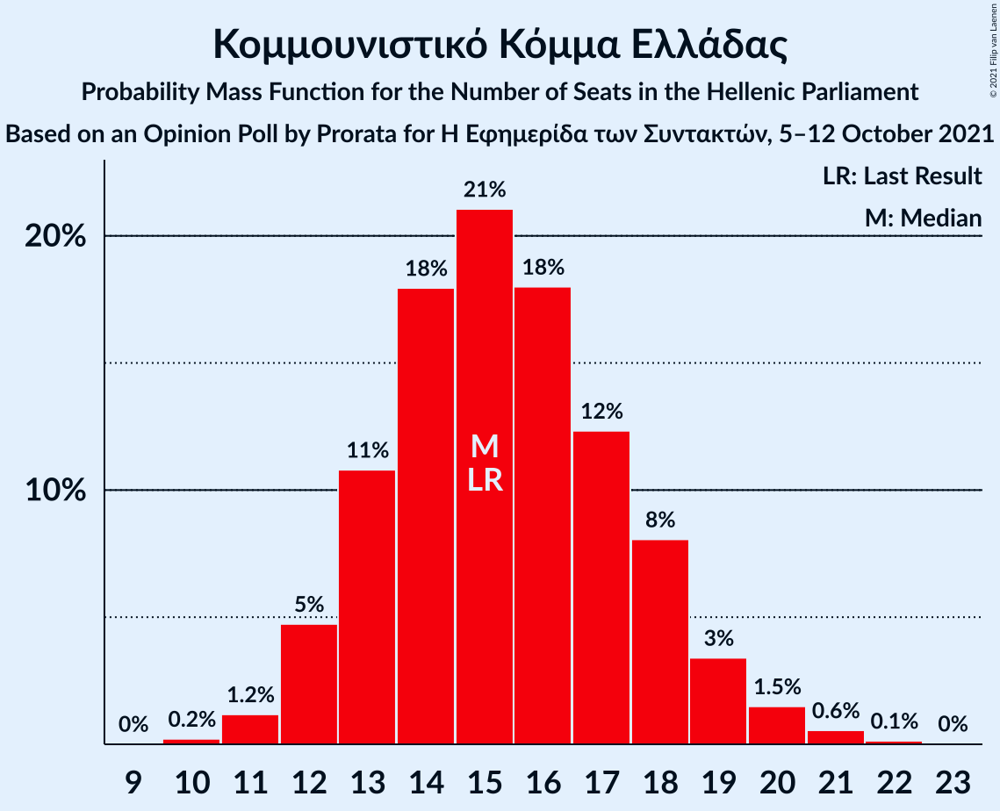
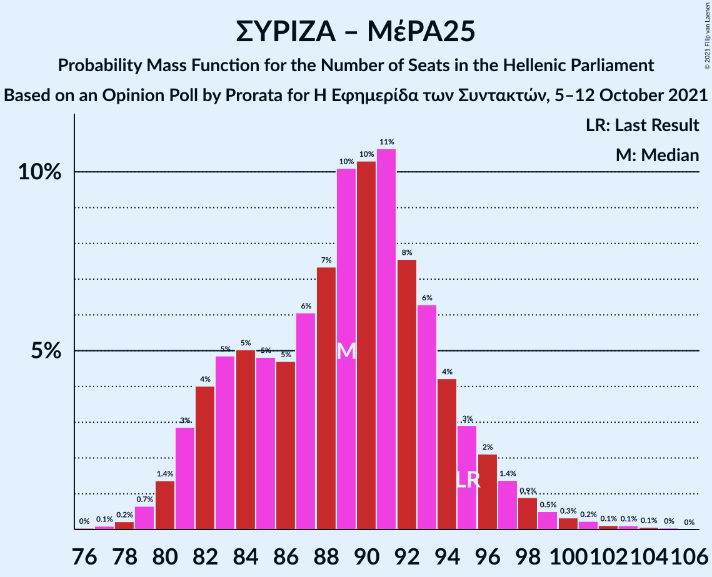

# Opinion Poll by Prorata for Η Εφημερίδα των Συντακτών, 5–12 October 2021

<a href="#voting-intentions">Voting Intentions</a> | <a href="#seats">Seats</a> | <a href="#coalitions">Coalitions</a> | <a href="#technical-information">Technical Information</a>

## Voting Intentions

### Confidence Intervals

| Party | Last Result | Poll Result | 80% Confidence Interval | 90% Confidence Interval | 95% Confidence Interval | 99% Confidence Interval |
|:-----:|:-----------:|:-----------:|:-----------------------:|:-----------------------:|:-----------------------:|:-----------------------:|
| Νέα Δημοκρατία | 39.8% | 40.7% | 38.8–42.6% |38.3–43.1% |37.8–43.6% |37.0–44.5% |
| Συνασπισμός Ριζοσπαστικής Αριστεράς | 31.5% | 31.1% | 29.4–32.9% |28.9–33.4% |28.5–33.9% |27.7–34.8% |
| Κίνημα Αλλαγής | 8.1% | 7.8% | 6.8–8.9% |6.6–9.2% |6.4–9.5% |5.9–10.1% |
| Κομμουνιστικό Κόμμα Ελλάδας | 5.3% | 5.4% | 4.6–6.4% |4.4–6.6% |4.2–6.9% |3.9–7.4% |
| Ελληνική Λύση | 3.7% | 3.6% | 3.0–4.5% |2.8–4.7% |2.7–4.9% |2.4–5.3% |
| Μέτωπο Ευρωπαϊκής Ρεαλιστικής Ανυπακοής | 3.4% | 2.4% | 1.9–3.1% |1.8–3.3% |1.6–3.5% |1.4–3.8% |

*Note:* The poll result column reflects the actual value used in the calculations. Published results may vary slightly, and in addition be rounded to fewer digits.

## Seats

### Confidence Intervals

| Party | Last Result | Median | 80% Confidence Interval | 90% Confidence Interval | 95% Confidence Interval | 99% Confidence Interval |
|:-----:|:-----------:|:------:|:-----------------------:|:-----------------------:|:-----------------------:|:-----------------------:|
| <a href="#νέα-δημοκρατία">Νέα Δημοκρατία</a> | 158 | 164 | 159–170 |157–172 |156–173 |153–176 |
| <a href="#συνασπισμός-ριζοσπαστικής-αριστεράς">Συνασπισμός Ριζοσπαστικής Αριστεράς</a> | 86 | 88 | 82–93 |81–94 |80–95 |77–99 |
| <a href="#κίνημα-αλλαγής">Κίνημα Αλλαγής</a> | 22 | 22 | 19–25 |18–26 |18–27 |17–28 |
| <a href="#κομμουνιστικό-κόμμα-ελλάδας">Κομμουνιστικό Κόμμα Ελλάδας</a> | 15 | 15 | 13–18 |12–19 |12–19 |11–21 |
| <a href="#ελληνική-λύση">Ελληνική Λύση</a> | 10 | 10 | 0–12 |0–13 |0–14 |0–15 |
| <a href="#μέτωπο-ευρωπαϊκής-ρεαλιστικής-ανυπακοής">Μέτωπο Ευρωπαϊκής Ρεαλιστικής Ανυπακοής</a> | 9 | 0 | 0–8 |0–9 |0–10 |0–10 |

### Νέα Δημοκρατία

*For a full overview of the results for this party, see the [Νέα Δημοκρατία](party-νέαδημοκρατία.html) page.*

| Number of Seats | Probability | Accumulated | Special Marks |
|:---------------:|:-----------:|:-----------:|:-------------:|
| 150 | 0% | 100% |  |
| 151 | 0.1% | 99.9% | Majority |
| 152 | 0.2% | 99.9% |  |
| 153 | 0.3% | 99.7% |  |
| 154 | 0.6% | 99.4% |  |
| 155 | 0.9% | 98.8% |  |
| 156 | 1.5% | 98% |  |
| 157 | 2% | 96% |  |
| 158 | 3% | 94% | Last Result |
| 159 | 5% | 91% |  |
| 160 | 6% | 86% |  |
| 161 | 8% | 80% |  |
| 162 | 9% | 72% |  |
| 163 | 8% | 63% |  |
| 164 | 9% | 55% | Median |
| 165 | 9% | 46% |  |
| 166 | 7% | 37% |  |
| 167 | 7% | 30% |  |
| 168 | 6% | 23% |  |
| 169 | 5% | 17% |  |
| 170 | 4% | 12% |  |
| 171 | 3% | 8% |  |
| 172 | 2% | 6% |  |
| 173 | 1.0% | 3% |  |
| 174 | 1.0% | 2% |  |
| 175 | 0.6% | 1.3% |  |
| 176 | 0.3% | 0.7% |  |
| 177 | 0.2% | 0.5% |  |
| 178 | 0.1% | 0.2% |  |
| 179 | 0.1% | 0.1% |  |
| 180 | 0% | 0.1% |  |
| 181 | 0% | 0% |  |

### Συνασπισμός Ριζοσπαστικής Αριστεράς

*For a full overview of the results for this party, see the [Συνασπισμός Ριζοσπαστικής Αριστεράς](party-συνασπισμόςριζοσπαστικήςαριστεράς.html) page.*

| Number of Seats | Probability | Accumulated | Special Marks |
|:---------------:|:-----------:|:-----------:|:-------------:|
| 75 | 0.1% | 100% |  |
| 76 | 0.2% | 99.9% |  |
| 77 | 0.3% | 99.7% |  |
| 78 | 0.5% | 99.4% |  |
| 79 | 1.0% | 98.9% |  |
| 80 | 2% | 98% |  |
| 81 | 3% | 96% |  |
| 82 | 5% | 93% |  |
| 83 | 6% | 88% |  |
| 84 | 6% | 82% |  |
| 85 | 7% | 76% |  |
| 86 | 6% | 69% | Last Result |
| 87 | 7% | 63% |  |
| 88 | 8% | 56% | Median |
| 89 | 10% | 48% |  |
| 90 | 10% | 38% |  |
| 91 | 10% | 27% |  |
| 92 | 7% | 17% |  |
| 93 | 5% | 10% |  |
| 94 | 2% | 6% |  |
| 95 | 1.2% | 3% |  |
| 96 | 0.8% | 2% |  |
| 97 | 0.4% | 1.2% |  |
| 98 | 0.3% | 0.8% |  |
| 99 | 0.2% | 0.5% |  |
| 100 | 0.1% | 0.3% |  |
| 101 | 0.1% | 0.2% |  |
| 102 | 0% | 0.1% |  |
| 103 | 0% | 0% |  |

### Κίνημα Αλλαγής

*For a full overview of the results for this party, see the [Κίνημα Αλλαγής](party-κίνημααλλαγής.html) page.*

| Number of Seats | Probability | Accumulated | Special Marks |
|:---------------:|:-----------:|:-----------:|:-------------:|
| 15 | 0.1% | 100% |  |
| 16 | 0.3% | 99.9% |  |
| 17 | 1.3% | 99.6% |  |
| 18 | 3% | 98% |  |
| 19 | 7% | 95% |  |
| 20 | 12% | 88% |  |
| 21 | 17% | 75% |  |
| 22 | 17% | 59% | Last Result, Median |
| 23 | 15% | 41% |  |
| 24 | 12% | 26% |  |
| 25 | 7% | 14% |  |
| 26 | 4% | 7% |  |
| 27 | 2% | 3% |  |
| 28 | 0.8% | 1.2% |  |
| 29 | 0.3% | 0.4% |  |
| 30 | 0.1% | 0.1% |  |
| 31 | 0% | 0% |  |

### Κομμουνιστικό Κόμμα Ελλάδας

*For a full overview of the results for this party, see the [Κομμουνιστικό Κόμμα Ελλάδας](party-κομμουνιστικόκόμμαελλάδας.html) page.*

| Number of Seats | Probability | Accumulated | Special Marks |
|:---------------:|:-----------:|:-----------:|:-------------:|
| 10 | 0.2% | 100% |  |
| 11 | 1.2% | 99.8% |  |
| 12 | 5% | 98.6% |  |
| 13 | 11% | 94% |  |
| 14 | 18% | 83% |  |
| 15 | 21% | 65% | Last Result, Median |
| 16 | 18% | 44% |  |
| 17 | 12% | 26% |  |
| 18 | 8% | 14% |  |
| 19 | 3% | 6% |  |
| 20 | 1.5% | 2% |  |
| 21 | 0.6% | 0.7% |  |
| 22 | 0.1% | 0.2% |  |
| 23 | 0% | 0% |  |

### Ελληνική Λύση

*For a full overview of the results for this party, see the [Ελληνική Λύση](party-ελληνικήλύση.html) page.*

| Number of Seats | Probability | Accumulated | Special Marks |
|:---------------:|:-----------:|:-----------:|:-------------:|
| 0 | 11% | 100% |  |
| 1 | 0% | 89% |  |
| 2 | 0% | 89% |  |
| 3 | 0% | 89% |  |
| 4 | 0% | 89% |  |
| 5 | 0% | 89% |  |
| 6 | 0% | 89% |  |
| 7 | 0% | 89% |  |
| 8 | 1.1% | 89% |  |
| 9 | 19% | 88% |  |
| 10 | 25% | 69% | Last Result, Median |
| 11 | 22% | 44% |  |
| 12 | 13% | 22% |  |
| 13 | 6% | 9% |  |
| 14 | 2% | 3% |  |
| 15 | 0.6% | 0.8% |  |
| 16 | 0.1% | 0.2% |  |
| 17 | 0% | 0% |  |

### Μέτωπο Ευρωπαϊκής Ρεαλιστικής Ανυπακοής

*For a full overview of the results for this party, see the [Μέτωπο Ευρωπαϊκής Ρεαλιστικής Ανυπακοής](party-μέτωποευρωπαϊκήςρεαλιστικήςανυπακοής.html) page.*

| Number of Seats | Probability | Accumulated | Special Marks |
|:---------------:|:-----------:|:-----------:|:-------------:|
| 0 | 87% | 100% | Median |
| 1 | 0% | 13% |  |
| 2 | 0% | 13% |  |
| 3 | 0% | 13% |  |
| 4 | 0% | 13% |  |
| 5 | 0% | 13% |  |
| 6 | 0% | 13% |  |
| 7 | 0% | 13% |  |
| 8 | 3% | 13% |  |
| 9 | 7% | 9% | Last Result |
| 10 | 2% | 3% |  |
| 11 | 0.4% | 0.5% |  |
| 12 | 0.1% | 0.1% |  |
| 13 | 0% | 0% |  |

## Coalitions

### Confidence Intervals

| Coalition | Last Result | Median | Majority? | 80% Confidence Interval | 90% Confidence Interval | 95% Confidence Interval | 99% Confidence Interval |
|:---------:|:-----------:|:------:|:---------:|:-----------------------:|:-----------------------:|:-----------------------:|:-----------------------:|
| Νέα Δημοκρατία – Κίνημα Αλλαγής | 180 | 186 | 100% | 181–192 | 179–194 | 177–196 | 175–199 |
| Νέα Δημοκρατία | 158 | 164 | 99.9% | 159–170 | 157–172 | 156–173 | 153–176 |
| Συνασπισμός Ριζοσπαστικής Αριστεράς – Μέτωπο Ευρωπαϊκής Ρεαλιστικής Ανυπακοής | 95 | 89 | 0% | 83–94 | 81–96 | 81–97 | 79–101 |
| Συνασπισμός Ριζοσπαστικής Αριστεράς | 86 | 88 | 0% | 82–93 | 81–94 | 80–95 | 77–99 |

### Νέα Δημοκρατία – Κίνημα Αλλαγής

| Number of Seats | Probability | Accumulated | Special Marks |
|:---------------:|:-----------:|:-----------:|:-------------:|
| 171 | 0% | 100% |  |
| 172 | 0.1% | 99.9% |  |
| 173 | 0.1% | 99.9% |  |
| 174 | 0.2% | 99.8% |  |
| 175 | 0.4% | 99.6% |  |
| 176 | 0.7% | 99.2% |  |
| 177 | 1.3% | 98.5% |  |
| 178 | 1.3% | 97% |  |
| 179 | 3% | 96% |  |
| 180 | 3% | 93% | Last Result |
| 181 | 5% | 91% |  |
| 182 | 6% | 86% |  |
| 183 | 8% | 80% |  |
| 184 | 8% | 72% |  |
| 185 | 9% | 64% |  |
| 186 | 8% | 55% | Median |
| 187 | 9% | 47% |  |
| 188 | 7% | 38% |  |
| 189 | 8% | 31% |  |
| 190 | 5% | 23% |  |
| 191 | 5% | 18% |  |
| 192 | 3% | 13% |  |
| 193 | 3% | 9% |  |
| 194 | 2% | 6% |  |
| 195 | 2% | 4% |  |
| 196 | 1.1% | 3% |  |
| 197 | 0.7% | 2% |  |
| 198 | 0.5% | 1.1% |  |
| 199 | 0.3% | 0.6% |  |
| 200 | 0.1% | 0.3% |  |
| 201 | 0.1% | 0.2% |  |
| 202 | 0% | 0.1% |  |
| 203 | 0% | 0.1% |  |
| 204 | 0% | 0% |  |

### Νέα Δημοκρατία

| Number of Seats | Probability | Accumulated | Special Marks |
|:---------------:|:-----------:|:-----------:|:-------------:|
| 150 | 0% | 100% |  |
| 151 | 0.1% | 99.9% | Majority |
| 152 | 0.2% | 99.9% |  |
| 153 | 0.3% | 99.7% |  |
| 154 | 0.6% | 99.4% |  |
| 155 | 0.9% | 98.8% |  |
| 156 | 1.5% | 98% |  |
| 157 | 2% | 96% |  |
| 158 | 3% | 94% | Last Result |
| 159 | 5% | 91% |  |
| 160 | 6% | 86% |  |
| 161 | 8% | 80% |  |
| 162 | 9% | 72% |  |
| 163 | 8% | 63% |  |
| 164 | 9% | 55% | Median |
| 165 | 9% | 46% |  |
| 166 | 7% | 37% |  |
| 167 | 7% | 30% |  |
| 168 | 6% | 23% |  |
| 169 | 5% | 17% |  |
| 170 | 4% | 12% |  |
| 171 | 3% | 8% |  |
| 172 | 2% | 6% |  |
| 173 | 1.0% | 3% |  |
| 174 | 1.0% | 2% |  |
| 175 | 0.6% | 1.3% |  |
| 176 | 0.3% | 0.7% |  |
| 177 | 0.2% | 0.5% |  |
| 178 | 0.1% | 0.2% |  |
| 179 | 0.1% | 0.1% |  |
| 180 | 0% | 0.1% |  |
| 181 | 0% | 0% |  |

### Συνασπισμός Ριζοσπαστικής Αριστεράς – Μέτωπο Ευρωπαϊκής Ρεαλιστικής Ανυπακοής

| Number of Seats | Probability | Accumulated | Special Marks |
|:---------------:|:-----------:|:-----------:|:-------------:|
| 76 | 0% | 100% |  |
| 77 | 0.1% | 99.9% |  |
| 78 | 0.2% | 99.8% |  |
| 79 | 0.7% | 99.6% |  |
| 80 | 1.4% | 98.9% |  |
| 81 | 3% | 98% |  |
| 82 | 4% | 95% |  |
| 83 | 5% | 91% |  |
| 84 | 5% | 86% |  |
| 85 | 5% | 81% |  |
| 86 | 5% | 76% |  |
| 87 | 6% | 71% |  |
| 88 | 7% | 65% | Median |
| 89 | 10% | 58% |  |
| 90 | 10% | 48% |  |
| 91 | 11% | 37% |  |
| 92 | 8% | 27% |  |
| 93 | 6% | 19% |  |
| 94 | 4% | 13% |  |
| 95 | 3% | 9% | Last Result |
| 96 | 2% | 6% |  |
| 97 | 1.4% | 4% |  |
| 98 | 0.9% | 2% |  |
| 99 | 0.5% | 1.5% |  |
| 100 | 0.3% | 0.9% |  |
| 101 | 0.2% | 0.6% |  |
| 102 | 0.1% | 0.4% |  |
| 103 | 0.1% | 0.3% |  |
| 104 | 0.1% | 0.2% |  |
| 105 | 0% | 0.1% |  |
| 106 | 0% | 0% |  |

### Συνασπισμός Ριζοσπαστικής Αριστεράς

| Number of Seats | Probability | Accumulated | Special Marks |
|:---------------:|:-----------:|:-----------:|:-------------:|
| 75 | 0.1% | 100% |  |
| 76 | 0.2% | 99.9% |  |
| 77 | 0.3% | 99.7% |  |
| 78 | 0.5% | 99.4% |  |
| 79 | 1.0% | 98.9% |  |
| 80 | 2% | 98% |  |
| 81 | 3% | 96% |  |
| 82 | 5% | 93% |  |
| 83 | 6% | 88% |  |
| 84 | 6% | 82% |  |
| 85 | 7% | 76% |  |
| 86 | 6% | 69% | Last Result |
| 87 | 7% | 63% |  |
| 88 | 8% | 56% | Median |
| 89 | 10% | 48% |  |
| 90 | 10% | 38% |  |
| 91 | 10% | 27% |  |
| 92 | 7% | 17% |  |
| 93 | 5% | 10% |  |
| 94 | 2% | 6% |  |
| 95 | 1.2% | 3% |  |
| 96 | 0.8% | 2% |  |
| 97 | 0.4% | 1.2% |  |
| 98 | 0.3% | 0.8% |  |
| 99 | 0.2% | 0.5% |  |
| 100 | 0.1% | 0.3% |  |
| 101 | 0.1% | 0.2% |  |
| 102 | 0% | 0.1% |  |
| 103 | 0% | 0% |  |

## Technical Information

### Opinion Poll

+ **Polling firm:** Prorata
+ **Commissioner(s):** Η Εφημερίδα των Συντακτών
+ **Fieldwork period:** 5–12 October 2021

### Calculations

+ **Sample size:** 1131
+ **Simulations done:** 1,048,576
+ **Error estimate:** 0.41%

